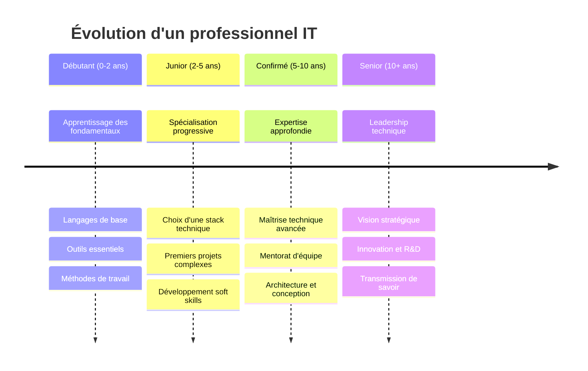
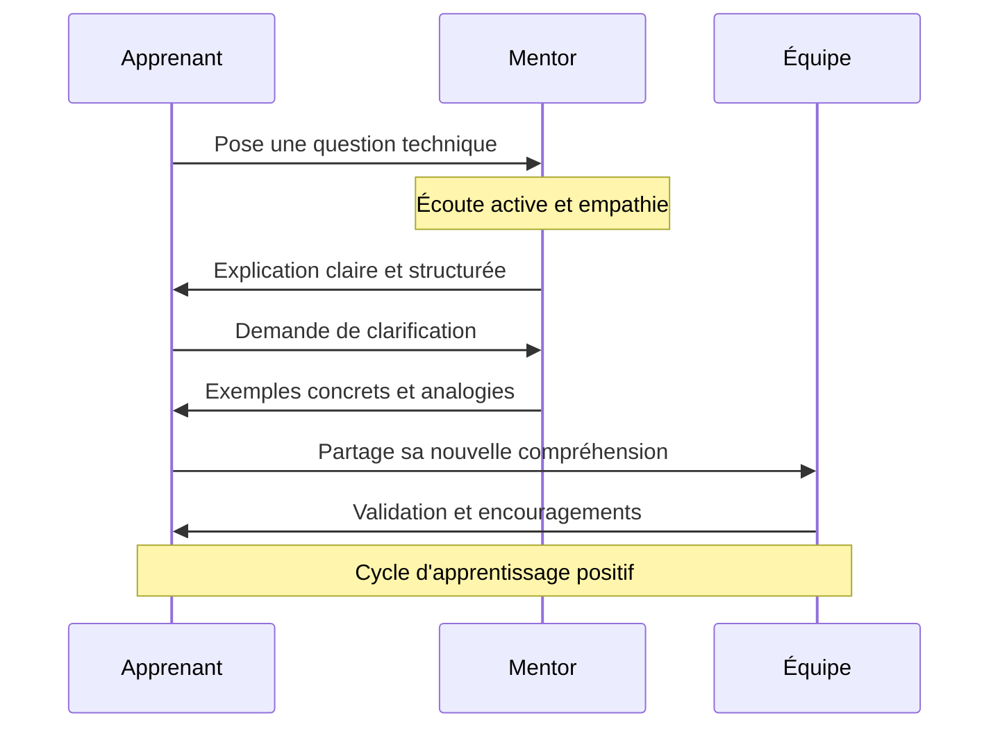
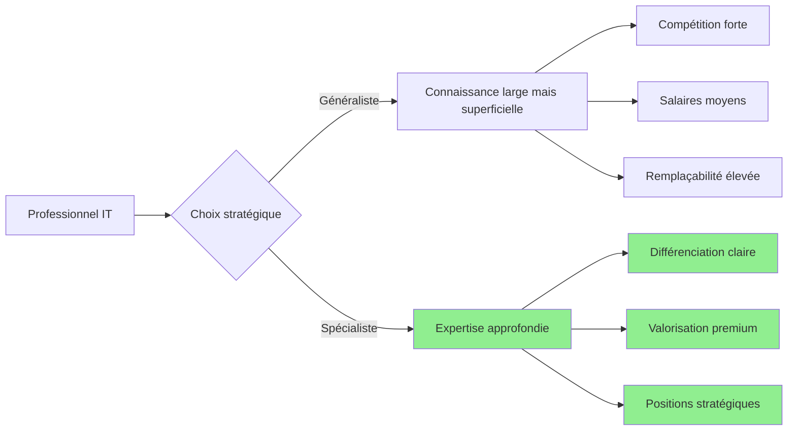
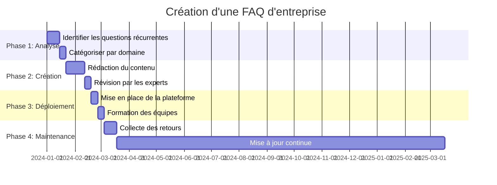

Dans le secteur de l'informatique, l'excellence technique ne suffit plus. **L'attitude professionnelle** devient un facteur différenciant majeur qui détermine non seulement votre réussite personnelle, mais aussi celle de votre équipe et de votre entreprise.

Cette philosophie du développeur moderne repose sur quatre piliers
fondamentaux :

-   **la soif d'apprentissage continu**
-   **la bienveillance envers les apprenants**
-   **la création de valeur organisationnelle**
-   **la responsabilité face aux nouveaux outils**.

<!-- truncate -->

---

# L'attitude du professionnel informatique : entre excellence technique et bienveillance humaine

## L'apprentissage perpétuel : une nécessité vitale

> _"Dans l'informatique, celui qui arrête d'apprendre aujourd'hui devient obsolète demain."_

**Cette citation résume parfaitement la réalité de notre secteur.**

L'informatique évolue à une vitesse vertigineuse. Les frameworks, langages et méthodologies se succèdent sans relâche. **Maintenir ses compétences à jour** n'est pas un luxe, c'est une obligation professionnelle.

:::info Principe fondamental
L'apprentissage continu ne signifie pas **tout apprendre**, mais **apprendre intelligemment** selon ses objectifs de carrière.
:::

Cela implique de développer une **vision à long terme** de sa carrière, d'identifier les tendances émergentes et d'investir du temps dans la **formation continue**. Que ce soit par la **lecture de documentation technique**, la **participation à des conférences**, ou la **réalisation de projets personnels**, l'apprentissage doit devenir un réflexe quotidien.

**L'expertise ne s'acquiert pas par hasard, elle se cultive avec méthode et persévérance.**



:::note Une petite réflexion avec bienveillance
Il est important de choisir une stack très rapidement pour un junior.<br />
Mais... Un junior sans pouvoir découvrir d'autres technologies, il va irrémédiablement
passé à côté d'une voie qui l'aurait éventuellement intéressé.

:::

---

## La bienveillance : fondement d'une communauté forte

Dans notre quête d'excellence technique, il est crucial de **ne jamais oublier ceux qui débutent**. Chaque expert a été novice un jour, et les questions qui peuvent paraître évidentes aujourd'hui étaient légitimes hier.

:::tip Philosophie du mentorat
**Il n'existe pas de "questions stupides", seulement des réponses mal formulées.**
:::

La bienveillance envers les nouveaux apprenants présente de multiples avantages :

-   **Pour l'apprenant**<br />
    _elle crée un environnement de confiance propice à l'apprentissage et réduit le syndrome de l'imposteur si répandu dans notre domaine._

-   **Pour le mentor**<br />
    _expliquer des concepts renforce sa propre compréhension et développe ses
    compétences pédagogiques, essentielles pour évoluer vers des postes de leadership._

-   **Pour l'équipe**<br />
    _elle favorise une culture collaborative où chacun peut progresser sans craindre
    le jugement._

### Diagramme de séquence sur comment réagir



<br />

:::warning Attention
La bienveillance **n'est pas de la complaisance**. Il s'agit d'**accompagner avec
exigence**, de **corriger avec respect** et de **critiquer les idées sans jamais attaquer
les personnes**.

:::

## Spécialisation vs généralisme : trouver sa voie

L'un des pièges les plus courants pour les professionnels IT est de
**vouloir tout apprendre**. Face à l'immensité du domaine informatique, cette approche
mène souvent à l'épuisement et à une expertise superficielle.

:::danger Piège à éviter
Essayer de maîtriser toutes les technologies conduit à une expertise diluée
et peu valorisée sur le marché de l'emploi.

:::

### La puissance de la spécialisation

**Trouver sa voie et s'y spécialiser** présente des avantages considérables :

-   **Expertise reconnue**<br />
    _devenir référent dans un domaine spécifique vous rend indispensable et recherché._

-   **Efficacité accrue**<br />
    _approfondir une stack technique permet de gagner en productivité et en qualité._

-   **Opportunités ciblées**<br />
    _les entreprises valorisent les experts capables de résoudre des problèmes complexes._

-   **Évolution salariale**<br />
    _la spécialisation ouvre la voie à des postes mieux rémunérés._

<br />

#### Schéma pour mieux comprendre



### Comment choisir sa spécialisation

-   **Analysez vos affinités naturelles**<br />
    _dans quels domaines excellez-vous spontanément ?_

-   **Étudiez le marché :**<br />
    _quelles compétences sont les plus demandées et les mieux rémunérées ?_

-   **Considérez l'évolution technologique**<br />
    _misez sur des technologies d'avenir plutôt que sur des solutions obsolescentes._

-   **Testez avant de vous engager**<br />
    _réalisez des projets dans différents domaines pour confirmer votre choix._

<br />

:::tip Conseil pratique
Une bonne spécialisation combine passion personnelle et opportunités de marché.<br />
**L'expertise sans passion mène au burn-out**, la passion sans marché mène à la précarité.

:::

## Optimiser la productivité organisationnelle

Au-delà des compétences individuelles, un professionnel IT doit contribuer à l'efficacité collective.<br />
**La création d'une FAQ d'entreprise** représente un investissement stratégique souvent sous-estimé.

:::info Impact organisationnel
Une documentation interne bien structurée peut réduire de 30 à 50% les interruptions liées aux questions récurrentes.

:::

**Une documentation interne bien structurée permet de :**

-   **Réduire les interruptions** en donnant aux collaborateurs les moyens de résoudre leurs problèmes de manière autonome.
-   **Standardiser les processus** et éviter que chaque développeur réinvente la roue.
-   **Capitaliser sur les connaissances** de l'équipe et prévenir la perte d'informations critiques lors des départs.

**Accélérer l'intégration** des nouveaux collaborateurs en leur fournissant les ressources nécessaires.

<br />



Cette approche transforme les problèmes récurrents en opportunités d'amélioration continue et libère du temps pour des tâches à plus forte
valeur ajoutée.

#### Voici le code mermaid pour une meilleure lisibilité

````markdown

````

_**2w** = 2 semaines, **52w** = 52 semaines_

## Au-delà du CV : la puissance du portfolio

Dans le recrutement informatique, **les projets réalisés parlent plus fort que les diplômes**.<br />
Un CV peut mentir, mais le code ne ment jamais.

### L'apprentissage par la pratique

Pour développer ses compétences, commencer par des **projets simples et classiques** est parfaitement adapté :

-   todo lists
-   calculatrices
-   blogs personnels

Ces exercices permettent d'assimiler les fondamentaux sans la pression de l'innovation.

### La différenciation professionnelle

Cependant, **pour séduire les recruteurs, il faut viser plus haut** soit par exemple :

-   Développer une application e-commerce complète
-   Développer unn système de gestion
-   Développer une plateforme SaaS

**Ses projets démontre votre capacité à gérer la complexité et à livrer des solutions abouties.**

:::danger Défi majeur
**Le défi majeur que vous allez indéniablement rencontrer : vous démarquer parmi des milliers de projets identiques.**<br />

En effet, chaque formation, tutoriel ou vidéo est suivie par des milliers de développeurs qui réalisent ensuite les mêmes projets. Il faut donc savoir sortir du lot dans cet océan de créations similaires.
:::

Trop de candidats présentent des clones de Twitter ou des sites de recettes.<br /> Pour sortir du lot, il faut :

-   **Résoudre un problème réel** que vous avez vous-même rencontré.
-   **Apporter une innovation technique** ou fonctionnelle, même mineure.
-   **Soigner l'expérience utilisateur** et la qualité du code.
-   **Documenter votre démarche** pour montrer votre processus de réflexion.
-   **Déployer en production** pour prouver votre capacité à aller au bout des projets.

## L'IA : opportunité et responsabilité

L'intelligence artificielle révolutionne notre métier...<br />
**Mais avec de grands pouvoirs viennent de grandes responsabilités**.

:::tip Les bénéfices indéniables
L'IA nous aide à **accélérer le développement**, **détecter les erreurs** et **explorer de nouvelles approches**.
Elle démocratise l'accès à l'expertise et permet de se concentrer sur les aspects créatifs du développement.

:::

:::warning Les risques critiques
Cependant, **la vigilance est de mise**, particulièrement concernant la protection des données sensibles.
**Attention à ne surtout pas divulger des données relatives à votre entreprise**.

:::

:::danger Sécurité critique à appliquer impérativement
**En entreprise, ne jamais partager :**

-   Code source propriétaire
-   Données clients ou utilisateurs
-   Informations commerciales confidentielles
-   Architectures système internes
-   Clés d'API ou secrets de configuration

:::

Une **fuite de données** via un outil d'IA peut avoir des **conséquences juridiques** et **financières** désastreuses pour l'entreprise.

### L'importance de la compréhension

Au-delà de la sécurité, il est crucial de **comprendre et valider** ce que produit l'IA.<br />
**Copier-coller** du code **sans le comprendre** crée une **dette technique** et des **vulnérabilités** potentielles.

:::tip Règle d'or
**L'IA est un assistant, pas un remplaçant**.<br />
La responsabilité finale reste humaine.

:::

## Conclusion : cultiver l'excellence durable

L'attitude du professionnel informatique moderne se caractérise par un équilibre subtil entre ambition personnelle et contribution collective.
**Apprendre** sans cesse, **partager** avec bienveillance, **optimiser** l'efficacité organisationnelle et **utiliser** l'IA de manière
**responsable** constituent les piliers de cette philosophie.

:::note Note
_Dans un secteur en perpétuelle évolution, ces principes offrent une boussole fiable pour naviguer vers une carrière
épanouissante et impactante._

:::

**Car au final, la vraie expertise ne se mesure pas seulement à ce que l'on sait,
mais à ce que l'on transmet et à la valeur que l'on crée pour les autres.**
