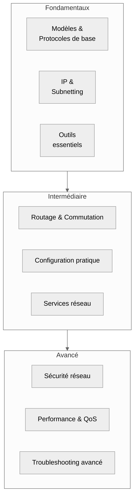
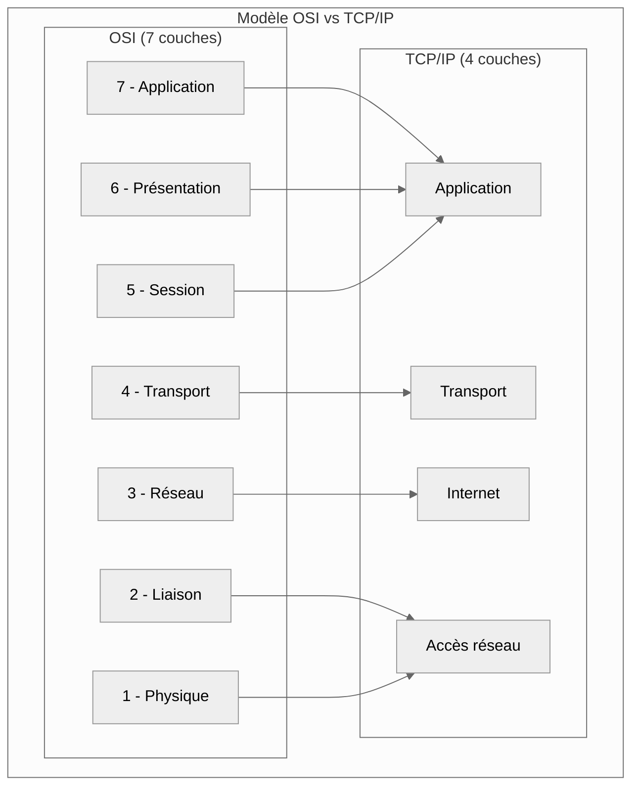
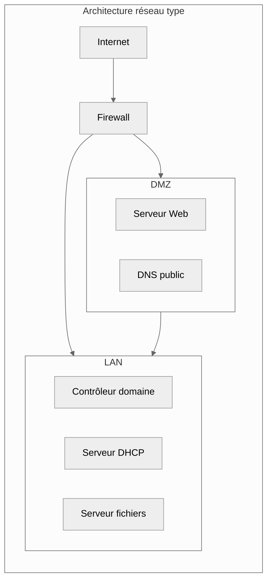

# Introduction

## Administration Réseau

**Objectif** : maîtriser les communications entre machines et les protocoles fondamentaux

Ces compétences réseau constituent le socle technique indispensable pour identifier les vulnérabilités,
comprendre les vecteurs d'attaque, configurer des défenses efficaces et analyser les incidents de sécurité.

:::note
_Indispensable pour comprendre la cybersécurité et le cloud_
:::

## Progression d'Apprentissage

---

## Niveau Fondamental

### Modèles de référence

-   **Modèle OSI** : 7 couches, rôles et interactions
-   **Modèle TCP/IP** : 4 couches, correspondance avec OSI
-   **Encapsulation** : ajout d'en-têtes par couche

### Protocoles essentiels

-   **ICMP** : ping, traceroute, messages d'erreur
-   **DNS** : résolution de noms, types d'enregistrements (A, AAAA, CNAME, MX)
-   **DHCP** : attribution automatique d'adresses IP
-   **HTTP/HTTPS** : navigation web, certificats SSL/TLS

### Adressage IP

-   **IPv4** : classes, masques de sous-réseau
-   **Subnetting de base** : calcul de réseaux et d'hôtes
-   **Adresses privées** : RFC 1918 (10.0.0.0/8, 172.16.0.0/12, 192.168.0.0/16)

### Outils de base

-   `ping` : test de connectivité
-   `traceroute` : chemin réseau
-   `nslookup`/`dig` : requêtes DNS
-   `netstat` : connexions actives

---

## Niveau Intermédiaire

### Protocoles par couche

#### Couche 2 (Liaison)

-   **Ethernet** : trames, adresses MAC
-   **VLAN** : segmentation logique, tagging 802.1Q
-   **STP** : prévention des boucles (Spanning Tree Protocol)

#### Couche 3 (Réseau)

-   **IP avancé** : fragmentation, TTL, ToS
-   **ARP** : résolution adresse IP → MAC
-   **ICMP avancé** : types de messages, Path MTU Discovery

#### Couche 4 (Transport)

-   **TCP** : fiabilité, fenêtres, états de connexion
-   **UDP** : rapidité, applications temps réel
-   **QUIC** : protocole moderne (HTTP/3), chiffrement intégré, réduction latence
-   **Gestion des ports** : well-known, registered, dynamic

### Routage et Commutation

#### Routage

-   **Statique** : routes manuelles, route par défaut
-   **Dynamique** :
    -   **RIP** : protocole à vecteur de distance
    -   **OSPF** : protocole à état de liens
    -   **BGP** : routage inter-domaines (basics)

#### Commutation avancée

-   **VLAN inter-routage** : router-on-a-stick, SVI
-   **Trunking** : transport de multiples VLAN
-   **Link Aggregation** : LACP, EtherChannel

### Services réseau

-   **DNS avancé** : hiérarchie, délégation de zones
-   **DHCP avancé** : scopes, réservations, options
-   **NAT/PAT** : traduction d'adresses, types de NAT

---

## Niveau Avancé

### Sécurité réseau

#### Contrôle d'accès

-   **Firewalls** :
    -   Stateful vs Stateless
    -   DMZ et zones de sécurité
    -   Optimisation des règles
-   **Segmentation** : micro-segmentation, Zero Trust Network

#### Chiffrement et VPN

-   **VPN Site-to-Site** : IPSec, tunneling
-   **VPN Client-to-Site** : SSL/TLS VPN
-   **IDS/IPS** : détection et prévention d'intrusions

### Performance et Qualité de Service

#### QoS (Quality of Service)

-   **Classification** : identification du trafic
-   **Marking** : DSCP, CoS
-   **Queuing** : mécanismes de file d'attente
-   **Shaping** : contrôle du débit

#### Haute disponibilité

-   **Redondance** : HSRP, VRRP
-   **Protocoles de failover**
-   **Load balancing**

### Monitoring et Troubleshooting

#### Outils d'analyse

-   **Wireshark** : analyse de paquets
-   **SNMP** : monitoring équipements
-   **NetFlow/sFlow** : analyse de flux
-   **nmap** : découverte réseau et scanning

#### Configuration système

-   **Firewalls Linux** : iptables, ufw, firewalld
-   **Proxy** : forward/reverse proxy
-   **WAF** : Web Application Firewall

---

## Parcours d'apprentissage recommandé

1. **Étape 1** : Maîtriser les fondamentaux (modèles, IP, outils de base)
2. **Étape 2** : Approfondir routage et commutation
3. **Étape 3** : Implémenter la sécurité et la performance
4. **Étape 4** : Spécialisation (cybersécurité, cloud, etc.)

:::tip
**Conseil pratique** : Utilisez des labs virtuels (GNS3, EVE-NG, Packet Tracer) pour mettre en pratique chaque concept avant de passer au niveau suivant.
:::
