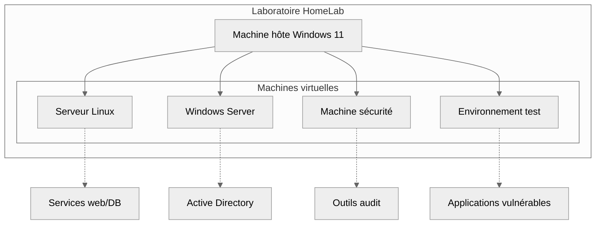
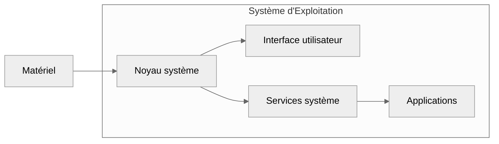
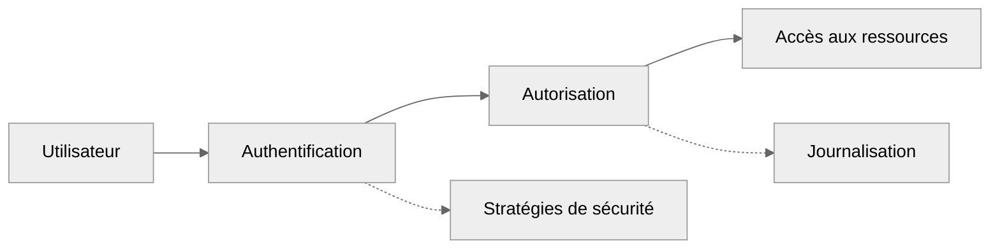
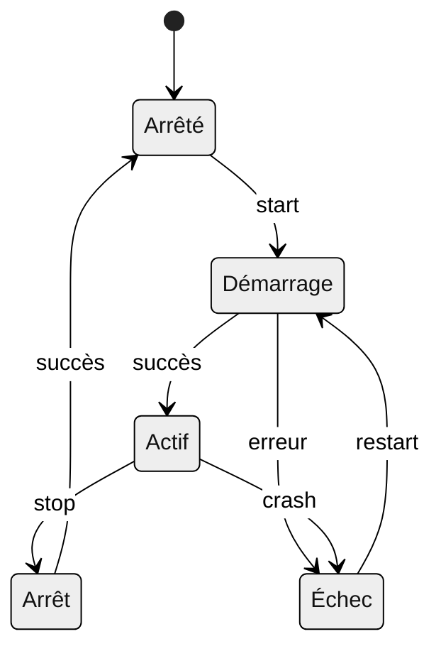
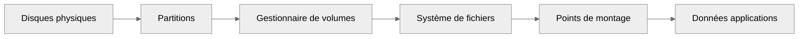
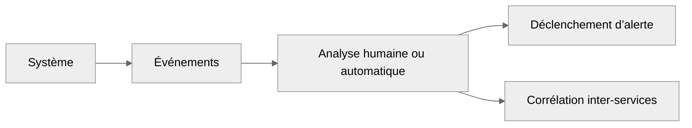
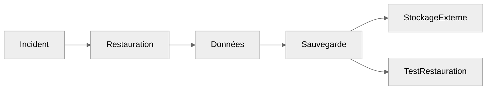
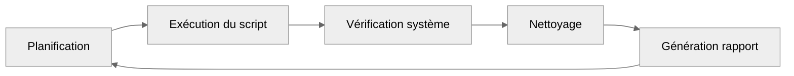
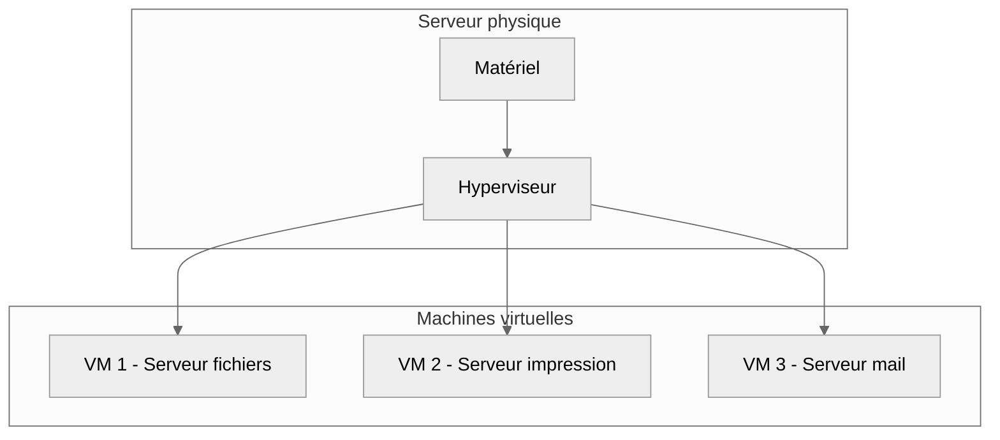
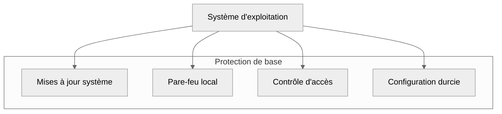

import Badge from '@site/src/components/Badge';

# Introduction

## Administration Système

**Objectif** : acquérir les compétences fondamentales nécessaires pour **administrer**, **maintenir** et **sécuriser** des infrastructures
informatiques dans un environnement professionnel.

L’administration système constitue le **socle technique** de toute infrastructure informatique. Elle regroupe l’ensemble des savoir-faire
nécessaires pour assurer la **disponibilité**, la **performance**, la **stabilité** et la **sécurité locale** des systèmes d’exploitation et
des services qu’ils hébergent.

:::note
_Cette présentation constitue une vue d'ensemble des domaines de compétences essentiels en administration système.
Chaque section introduit des concepts qui seront approfondis dans des documentations dédiées. L'objectif est de vous donner
une vision globale et structurée du métier d'administrateur système._
:::

L'administration système moderne repose sur **la maîtrise de systèmes d'exploitation variés**, **la gestion des services**,
**la surveillance continue** et **l'automatisation des tâches**. Ces fondations techniques permettent de construire des infrastructures
robustes et évolutives.

:::info Posture conseillée
L’administration système ne s’apprend pas uniquement dans les livres.

_Chaque notion théorique présentée ici doit être appliquée dans un environnement réel ou simulé. L'apprentissage de l'administration système
nécessite une approche pratique constante._ **La théorie sans mise en pratique ne permet pas d'acquérir l'expertise opérationnelle**
nécessaire pour gérer des environnements de production.

-   [x] **Mon conseil** - _Construisez un ou plusieurs laboratoires personnel ( couramment appelé **HomeLab** ) pour expérimenter chaque
        concept présenté. **Tester**, **casser**, **réparer**. C’est ainsi que vous acquerrez une vraie expertise, en reproduisant des
        scénarios réalistes que vous retrouverez en entreprise._

:::

---

:::danger Délimitation
Cette documentation ne traite que des aspects liés à l’administration système au sens strict : **gestion des systèmes d’exploitation**,
**des utilisateurs**, **des ressources** et de **la configuration locale**.

_Les éléments relevant de la **cybersécurité**, du **réseau**, de **l’infrastructure as code** ou du **cloud** seront couverts 
dans des rubriques dédiées._
:::

---

## Table des matières

| Section  | Titre                            | Description                                                       |
| :------: | -------------------------------- | ----------------------------------------------------------------- |
|  **I**   | Laboratoire et Environnement     | _Construire un environnement de test et d'apprentissage._         |
|  **II**  | Systèmes d'Exploitation          | _Maîtriser Linux et Windows Server pour l'administration._        |
| **III**  | Gestion des Utilisateurs         | _Contrôler les accès et gérer les permissions de sécurité._       |
|  **IV**  | Processus et Services            | _Comprendre l'exécution et la surveillance des services système._ |
|  **V**   | Stockage et Systèmes de Fichiers | _Administrer le stockage et organiser les données._               |
|  **VI**  | Surveillance et Journalisation   | _Monitorer les systèmes et analyser les événements._              |
| **VII**  | Sauvegarde et Continuité         | _Assurer la protection des données et la continuité de service._  |
| **VIII** | Automatisation Administrative    | _Automatiser les tâches d'administration courantes._              |
|  **IX**  | Virtualisation de Base           | _Gérer des machines virtuelles pour optimiser les ressources._    |
|  **X**   | Configuration Sécurisée          | _Appliquer les paramètres de sécurité de base des systèmes._      |

**Pour une progression logique, il convient de suivre ces sections dans l'ordre pour construire une expertise complète.**

---

## I. Laboratoire et Environnement

**Objectif** : _Construire un environnement de test pour l'apprentissage et l'expérimentation._ 
**Niveau** : <Badge niveau="Débutant" />

:::note Concept
La mise en place d'un laboratoire personnel constitue un élément essentiel de l'apprentissage en administration système. 
Cet environnement permet d'expérimenter sans risque et de valider les concepts théoriques dans un contexte pratique.
:::

-   **Infrastructure virtuelle :** _Vagrant, VirtualBox, environnements isolés._
-   **Scénarios d'apprentissage :** _cas d'usage réalistes, progression structurée._
-   **Outils de test :** _simulation de pannes, tests de sécurité._
-   **Documentation :** _procédures, configurations, retours d'expérience._

**Découverte des laboratoires prévue**

---

## II. Systèmes d'Exploitation

**Objectif** : _Maîtriser les fondamentaux des systèmes d'exploitation Linux et Windows Server._ 
**Niveau** : <Badge niveau="Débutant" />

:::note Concept
Cette première étape établit les bases de l'administration en couvrant l'installation, la configuration initiale et la gestion quotidienne
des systèmes d'exploitation. La maîtrise de ces environnements est un prerequis pour toutes les autres compétences administratives.
:::

-   **Linux** : _distributions serveur, structure des répertoires, commandes de base_
-   **Windows Server** : _rôles et fonctionnalités, PowerShell, interface d'administration_
-   **Configuration système** : _paramètres réseau, services essentiels, sécurité de base_
-   **Maintenance** : _mises à jour, gestion des paquets, optimisation des performances_

**Graphique des couches système**

---

## III. Gestion des Utilisateurs et Permissions

**Objectif** : _Contrôler les accès aux ressources et gérer les identités numériques._ 
**Niveau** : <Badge niveau="Intermédiaire" />

:::note Concept
**La gestion des utilisateurs constitue un pilier de la sécurité informatique**. Cette section couvre **les mécanismes d'authentification**,
**d'autorisation** et **de contrôle d'accès** qui régissent l'utilisation des systèmes.
:::

-   **Comptes utilisateurs** : _création, modification, désactivation, stratégies de mots de passe_
-   **Groupes et permissions** : _organisation logique, droits d'accès, principe du moindre privilège_
-   **Active Directory** : _domaines, unités organisationnelles, stratégies de groupe_
-   **Authentification** : _méthodes locales et centralisées, authentification multi-facteurs_

**Modèle de contrôle d'accès**

---

## IV. Processus et Services

**Objectif** : _Comprendre l'exécution des programmes et la gestion des services système._ 
**Niveau** : <Badge niveau="Intermédiaire" />

:::note Concept
Les processus et services constituent le cœur fonctionnel d'un système. Cette section explore les mécanismes **d'exécution**,
**de surveillance** et **de contrôle** qui permettent de **maintenir la stabilité** et **les performances du système**.
:::

-   **Processus** : _cycle de vie, priorités, signaux système, surveillance des ressources_
-   **Services système** : _démarrage automatique, dépendances, gestion d'état_
-   **Planification** : _tâches automatisées, cron, planificateur Windows_
-   **Performance** : _optimisation des ressources, diagnostic des problèmes_

**Cycle de vie des services**

---

## V. Stockage et Systèmes de Fichiers

**Objectif** : _Administrer l'espace de stockage et organiser efficacement les données._ 
**Niveau** : <Badge niveau="Avancé" />

:::note Concept
La gestion du stockage implique **la compréhension des systèmes de fichiers**, **du partitionnement** et **des technologies de virtualisation
du stockage**. Ces concepts sont essentiels pour **optimiser les performances** et **assurer la pérennité des données**.
:::

-   **Partitionnement** : _tables de partition, redimensionnement, optimisation_
-   **Systèmes de fichiers** : _ext4, NTFS, XFS, caractéristiques et cas d'usage_
-   **Volumes logiques** : _LVM, espaces de stockage Windows, flexibilité et évolutivité_
-   **Montage et organisation** : _points de montage, hiérarchie des répertoires_

**Architecture de stockage**

---

## VI. Surveillance et Journalisation

**Objectif** : _Monitorer les systèmes et analyser les événements critiques._ 
**Niveau** : <Badge niveau="Avancé" />

:::note Concept
La surveillance système permet de **détecter les anomalies**, d'**anticiper les problèmes** et d'**analyser les incidents**. 
Cette discipline combine la **collecte de métriques**, l'**analyse de logs** et la **mise en place d'alertes proactives**.
:::

:::warning Attention une petite nuance subsiste avec la cybersécurité

-   **Administration Système** : 
    _L’objectif est opérationnel et permet de détecter les anomalies locales, surveiller la charge, identifier des crashs, diagnostiquer des
    lenteurs, planifier une montée en charge._

    Les outils généralement utilisés sont : `journalctl`, `logrotate`, `syslog`, `Event Viewer`, `top`, `htop`, `Nagios`, etc.
    **C’est local, souvent préventif, pour la maintenance.**

-   **cybersécurité ( SOC/analyste )** : 
    _L’objectif est détectif ou réactif en permettant d'analyser des logs en profondeur, corréler les événements, identifier des comportements
    suspects, détecter des intrusions ou compromissions._

    Les outils sont plus avancés : `ELK`, `Wazuh` ( _**SIEM** open-source_ ), `Suricata`, `Zeek`, etc. 
    _C’est centralisé, avec une logique de corrélation et d’alerte._

:::

-   **Syslog / Journald** : _flux d’événements systèmes et applicatifs._
-   **Logs d'audit** : _journalisation de sécurité, connexions, modifications critiques._
-   **Surveillance proactive** : _uptime, charge système, espace disque, alertes personnalisées._
-   **Outils** : _`top`, `htop`, `journalctl`, `event viewer`, `uptime`, `dstat`, `logrotate`._

**Flux de surveillance**

---

## VII. Sauvegarde et Continuité

**Objectif** : _Assurer la protection des données et maintenir la continuité des services._
**Niveau** : <Badge niveau="Avancé" />

:::note Concept
**Sauvegarder ne suffit pas**. Il faut pouvoir **restaurer rapidement**, **efficacement** et **intégralement** dans différents scénarios. 
La **sauvegarde** et la **continuité de service** constituent des **enjeux critiques pour toute organisation**. Cette section couvre les
**stratégies de protection des données**, les **plans de reprise d'activité** et les **technologies de haute disponibilité**.
:::

-   **Sauvegarde** : _complète, incrémentielle, différentielle, règle 3-2-1._
-   **Plan de restauration** : _test de restauration, intégrité des sauvegardes._
-   **Technologies** : _synchronisation, snapshots, réplication, sauvegarde cloud_
-   **Outils** : _`rsync`, `borg`, `Veeam`, `Windows Server Backup`._
-   **PCA/PRA** : _plans de continuité et reprise d'activité avec RTO & RPO, procédures de restauration, tests réguliers._
-   **Haute disponibilité** : _clustering, load balancing, redondance_

**Stratégie de protection des données**

---

## VIII. Automatisation Administrative

**Objectif** : _Automatiser les tâches d'administration en éliminant les tâches répétitive courantes pour gagner en efficacité._ 
**Niveau** : <Badge niveau="Intermédiaire" />

:::note Concept
L'automatisation des tâches administratives permet de **standardiser les opérations récurrentes** et de **réduire les erreurs humaines**. 
Cette approche se concentre sur l'**automatisation des tâches quotidiennes d'administration système**, ce qui permet de gagner en **cohérence**,
en **rapidité** et en **fiabilité**..

Les scripts sont des outils incontournables pour tout administrateur moderne.
:::

-   **Scripts d'administration** : _Bash, PowerShell, automatisation des tâches de maintenance, nettoyage, reporting_
-   **Planification de tâches** : _cron, tâches planifiées Windows, exécution différée, surveillance périodique_
-   **Maintenance automatisée** : _nettoyage des logs, mises à jour, vérifications système_
-   **Rapports système** : _génération automatique de rapports d'état_

**Cycle de maintenance automatisée**

---

## IX. Virtualisation de Base

**Objectif** : _Gérer des machines virtuelles pour optimiser l'utilisation des ressources matérielles._ 
**Niveau** : <Badge niveau="Avancé" />

:::note Concept
La virtualisation permet de créer plusieurs machines virtuelles sur un serveur physique unique. Cette technologie améliore l'efficacité des
ressources et facilite l'administration en permettant l'isolation des environnements.
:::

-   **Hyperviseurs** : _VirtualBox, VMware vSphere, Hyper-V, installation et configuration_
-   **Machines virtuelles** : _création, allocation de ressources, gestion du cycle de vie_
-   **Administration** : _snapshots, migration, sauvegarde des VMs_
-   **Ressources** : _allocation mémoire, CPU, stockage, optimisation des performances_

**Architecture de virtualisation**

---

## X. Configuration Sécurisée

**Objectif** : _Appliquer les paramètres de sécurité de base pour protéger les systèmes._ 
**Niveau** : <Badge niveau="Avancé" />

:::note Concept
La

**Un système mal configuré est une porte ouverte aux attaques**. Le durcissement du système permet de prévenir des intrusions. 
Ainsi donc, la configuration sécurisée constitue une responsabilité fondamentale de l'administrateur système. Cette section couvre
**l'application des paramètres de sécurité de base**, **le durcissement des configurations** et **la mise en place des protections
élémentaires**.

:::

-   **Mises à jour** : _stratégies de correctifs de sécurité, gestion des vulnérabilités système_
-   **Durcissement de base** : _désactivation des services inutiles, configuration des mots de passe_
-   **Pare-feu local** : _`Windows Defender Firewall`, `iptables`, `règles de base`, `ufw`, `firewalld`_
-   **Principes fondamentaux** : _moindre privilège, séparation des rôles, audit_
-   **Configuration SSH/RDP** : _paramètres d'accès distant sécurisé, clés d'authentification_

**Couches de protection système**

---

## Mise en perspective

:::tip Transition vers la spécialisation
Les compétences présentées dans cette introduction constituent le socle technique nécessaire pour évoluer vers des domaines spécialisés.
L'administration système fournit les bases techniques indispensables pour comprendre les environnements sur lesquels s'appuient les autres
disciplines.

_Ces fondations techniques permettront d'aborder sereinement les spécialisations avancées, **chaque domaine s'appuie sur une maîtrise solide de
l'administration système** pour développer ses propres méthodologies et outils spécialisés._
:::

**Progression vers les spécialisations**

|      Domaine      | Prérequis administration système              | Évolution naturelle                           |
| :---------------: | --------------------------------------------- | --------------------------------------------- |
|    **Réseau**     | Services système, surveillance                | Architecture réseau, protocoles avancés       |
| **Développement** | Environnements virtualisés, services          | Déploiement d'applications, stack technique   |
|   **DevSecOps**   | Virtualisation, automatisation administrative | Infrastructure as Code, orchestration avancée |
| **Cybersécurité** | Configuration sécurisée, journalisation       | Détection d'intrusion, analyse forensique     |

Ces compétences transversales sont indispensables pour comprendre les concepts avancés en **cybersécurité**,
**DevSecOps** et **gestion d'infrastructure**.
