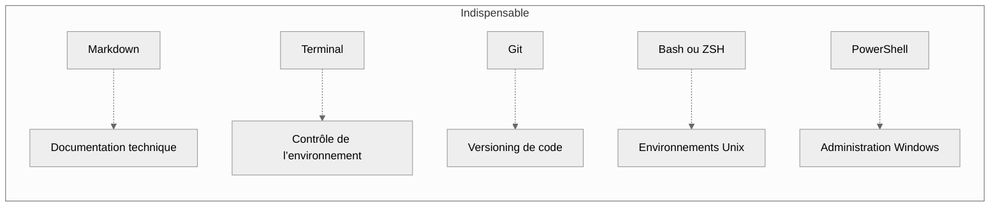
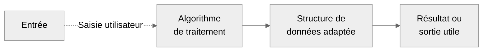
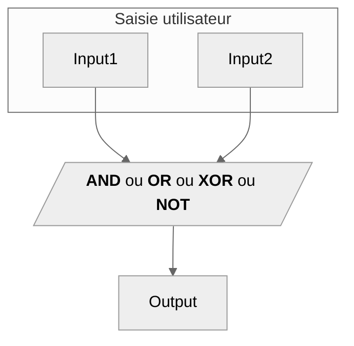
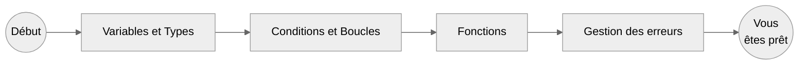
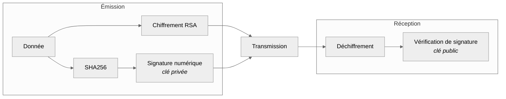

import Badge from '../../src/components/Badge';

# Introduction

**Objectif** : acquérir les fondamentaux de l'informatique sont nécessaires pour comprendre et exceller dans n'importe quel domaine.

Les bases que vous vous apprêtez à découvrir constituent un socle intellectuel et technique indispensable pour comprendre les concepts
avancés en **cybersécurité**, **développement**, **infrastructure** et **analyse de systèmes**.<br />

:::note
_Ce partage est le fruit de mon apprentissage au quotidien. Je suis quelqu'un de pointilleux. Je partage ce que j'apprends avec des précisions
que j'aurais aimé avoir avant de passer des heures à comprendre chacun des concepts. Ainsi, ce savoir vous donnera les moyens de poser un premier pied dans l’univers de l’informatique, tout en comprenant ce que vous faites._
:::

L’informatique repose sur un socle commun de compétences et de concepts transversaux. Ces fondations, bien que souvent sous-estimées, sont
indispensables à toute montée en compétence : du **développement logiciel** à l’**administration système**, du **réseau** à la
**cybersécurité**.

:::info

_Prenez le temps nécessaire pour assimiler chaque notion.<br />
**Fixer une durée stricte n'est pas pertinent** face à la diversité des profils et des rythmes d'apprentissage._

-   [x] **Mon conseil** - _Avancez méthodiquement, sans brûler les étapes, car c'est de cette rigueur qui fera de vous<br />
        un professionnel fiable, compétent et recherché._

:::

---

## Table des matières

| Section | Titre                          | Description                                                    |
| :-----: | ------------------------------ | -------------------------------------------------------------- |
|    I    | Outils Transversaux            | _Maîtriser les bases indispensables pour tous les métiers IT._ |
|   II    | Algorithmie & Structures       | _Développer une pensée logique et structurée._                 |
|   III   | Logique & Systèmes Numériques  | _Comprendre le fonctionnement logique des machines._           |
|   IV    | Concepts de Programmation      | _Poser les fondations d’une pratique du code solide_           |
|    V    | Bonnes pratiques : SOLID & PSR | _Adopter des standards professionnels de qualité logicielle._  |
|   VI    | Cryptographie & Sécurité       | _Appréhender les bases de la sécurité numérique._              |
|   VII   | Projets Interdisciplinaires    | _Consolider les acquis à travers des cas concrets._            |

**Pour une compréhension logique, il faudra suivre les points un a un pour en comprendre chaque aspect.**

## I. Outils Transversaux

**Objectif** : _Maîtriser les bases indispensables pour tout métier du numérique._<br />
**Niveau** : <Badge niveau="Débutant" />

:::note Concept
Cette première étape vise à vous familiariser avec les outils omniprésents dans l’écosystème informatique.<br />
Que vous soyez développeur, administrateur ou analyste, vous utiliserez **Git**, **Markdown**, des **terminaux** et des **scripts** tout au
long de votre carrière.
:::

-   **Git** / **GitHub** : _gestion de versions, branches, merge, historique._
-   **Markdown** : _documentation claire, README, wiki technique._
-   **Bash** ou **ZSH** & **PowerShell** : _scripts d'automatisation pour Linux/MacOS et Windows._
-   **Terminal** & **Éditeurs** : _manipulation de fichiers, navigation rapide, personnalisation d’environnement._

**Graphe Mermaid pour une meilleure visualisation**



---

## II. Algorithmie & Structures

-   **Objectif** : _Développer une pensée logique, réutilisable dans tous les langages._
-   **Niveau** : <Badge niveau="Intermédiaire" />

:::note Concept
Nous abordons ici les **structures fondamentales** et les **algorithmes élémentaires** qui vous serviront dans l’**analyse**,
l’**optimisation** et le **traitement automatisé de données**.
:::

-   **Tri** : _bubble, insertion, quick sort_
-   **Recherche** : _séquentielle, dichotomique_
-   **Structures** : _tableaux, piles, files, listes chaînées, arbres, graphes_
-   **Notions de complexité** : _temps d'exécution, notation Big-O_

**Graphe Mermaid pour une meilleure visualisation**



---

## III. Logique & Systèmes Numériques

-   **Objectif** : _Comprendre comment raisonne une machine._
-   **Niveau** : <Badge niveau="Débutant" />

:::note Concept
La programmation est un langage universel. Ce chapitre couvre ce que tout développeur doit savoir, avant même de choisir un langage.
Vous verrez ici la **logique binaire**, les **opérations de base** et l’**encodage des données**.<br />
Ces notions sont à la base de tout ce qui se passe sous le capot des machines.
:::

-   **Logique booléenne** : _AND, OR, XOR, NOT_
-   **Tables de vérité**
-   **Systèmes binaires** et **hexadécimaux**
-   **Encodages** : _ASCII, UTF-8, Base64_

**Graphe Mermaid pour une meilleure visualisation**



---

## IV. Concepts de Programmation

-   **Objectif** : _Poser les fondations d’une pratique du code claire, structurée et durable._
-   **Niveau** : <Badge niveau="Débutant" />

:::note Concept
Avant d’aborder **un langage spécifique** ou **un framework**, il est essentiel de **maîtriser les bases universelles** de la programmation.
Cette section présente les **éléments fondamentaux** présents dans _tous les langages_, ainsi que les **différents paradigmes** qui structurent
la pensée algorithmique.
:::

Cette vision est découpée en **2 phases**, la première phase concerne les **éléments constitutifs d'un programme**, la seconde quant à elle
aborde les **différents paradigmes** de programmation.

### Les éléments constitutifs d’un programme

> Un programme, quel que soit le langage, repose sur des blocs communs :

-   **Variables** & **types** : _portées, typage fort ou faible, dynamique ou statique._
-   **Structures de contrôle** : _conditions ( **`if`**, **`switch`** ), boucles ( **`for`**, **`while`** ), itérations._
-   **Fonctions** & **modularité** : _logique segmentée, avec paramètres et valeur de retour, réutilisable._
-   **Gestion des Erreurs** & **exceptions** : _codes d'erreurs, exceptions, assertions, débogage, blocs **`try/catch`** messages d’erreur utiles._
-   **Modularité** : _séparer le code en unités fonctionnelles (fonctions, fichiers, modules)._

**Graphe Mermaid pour une meilleure visualisation**



### Les Paradigmes de Programmation

> Un paradigme est un **modèle de pensée structurant la manière d’écrire et d’organiser le code**.<br />
> Comprendre ces modèles permet de mieux choisir ses outils, structurer son code et résoudre des problèmes complexes.

-   **La Programmation procédurale** - <Badge niveau="Débutant" /><br />
    _Approche séquentielle et fonctionnelle, centrée sur les instructions à exécuter._

    -   Regroupement en fonctions indépendantes
    -   Exécution linéaire, souvent de haut en bas
    -   Réutilisable mais peu modulaire sur de grands projets

    <br />

    ```mermaid
    ---
    config:
      theme: 'neutral'
    ---
    flowchart LR
      subgraph Exemple[Exemple de languages]
        C
        Bash
        Python
        PHP
        etc.
      end
    ```

-   **Programmation fonctionnelle (_introductive_)** - <Badge niveau="Intermédiaire" /><br />
    _Approche déclarative où la logique repose sur des fonctions pures, sans effets de bord._

    -   Aucune modification d’état externe (immutabilité)
    -   Pas de variables partagées
    -   Composition des fonctions **`(f(g(h(x))))`**

    <br />

    ```mermaid
    ---
    config:
      theme: 'neutral'
    ---
    flowchart LR
      subgraph Exemple[Exemple de languages]
        React
        Elixir
        Scala
        etc.
      end
    ```

-   **Programmation orientée objet (POO)** - <Badge niveau="Avancé" /><br />
    _Approche centrée sur les entités métier modélisées sous forme d’objets._

    -   Encapsulation des données et du comportement
    -   Modélisation avec **classes**, **attributs**, **méthodes**
    -   Favorise **réutilisabilité**, **modularité**, **testabilité**

    <br />

    ```mermaid
    ---
    config:
      theme: 'neutral'
    ---
    flowchart LR
      subgraph Exemple[Exemple de languages]
        Java
        C++
        C#
        PHP
        TypeScript
        etc.
      end
    ```

**Pourquoi ces paradigmes sont-ils essentiels ?**

| Paradigme         | Application concrète                           | Domaine d'usage principal            |
| ----------------- | ---------------------------------------------- | ------------------------------------ |
| **Procédural**    | Scripts simples, automatisation, logique brute | DevOps, scripts, algorithmes         |
| **Fonctionnel**   | Interfaces déclaratives, transformations       | Frontend ( _React_ ), data pipelines |
| **Orienté Objet** | Applications structurées, réutilisables        | Web, logiciels métiers, API REST     |

**Vous comprendrez que chaque paradigme est complémentaire**, et les projets modernes combinent souvent plusieurs approches.<br />
( **ex :** _POO + fonctions pures dans React_ ).

---

## V. Bonnes pratiques : SOLID & PSR

-   **Objectif** : _Structurer son code comme un professionnel._
-   **Niveau** : <Badge niveau="Intermédiaire" />

:::note Concept
Ces principes **guident le développement de logiciels maintenables et évolutifs**.<br />
Ils seront essentiels dès que vous construirez des projets réels ou collaborerez avec d’autres.
:::

-   **SOLID** — _Principes de conception orienté objet._

    | Acronyme | Principe fondamental            | Définition synthétique                                                                               |
    | :------: | ------------------------------- | ---------------------------------------------------------------------------------------------------- |
    |  **S**   | Single Responsability Principle | _Une classe doit avoir une et une seule responsabilité._                                             |
    |  **O**   | Open/Closed Principle           | _Une entité logicielle doit être ouverte à l’extension mais fermée à la modification._               |
    |  **L**   | Liskov Substitution Principle   | _Une classe dérivée doit pouvoir remplacer sa classe parente sans modifier le comportement attendu._ |
    |  **I**   | Interface Segregation Principle | _Il vaut mieux plusieurs interfaces spécifiques qu’une seule interface générale._ synthétique        |
    |  **D**   | Dependency Inversion Principle  | _Il faut dépendre d’abstractions, et non de classes concrètes._ synthétique                          |

    **Graphe Mermaid pour une meilleure visualisation**

    ```mermaid
    ---
    config:
      theme: 'neutral'
    ---
    graph LR
        subgraph S
          S1[Single Responsibility]
        end
        subgraph O
          O1["Open/Closed"]
        end
        subgraph L
          L1[Liskov Substitution]
        end
        subgraph I
          I1[Interface Segregation]
        end
        subgraph D
          D1[Dependency Inversion]
        end
        S --> O --> L --> I --> D
    ```

-   **PSR** — _PHP Standard Recommendations_

    > Les **PSR** sont des conventions proposées par le groupe **PHP-FIG**, mais dont les principes s’appliquent aussi à d'autres langages
    > modernes (Java, TypeScript, Python…).

    **Exemple de normes PSR**

    ```mermaid
    ---
    config:
      theme: 'neutral'
    ---
    graph LR
      PSR1[PSR-1<br/>Standard de base] --> PSR12[PSR-12<br/>Style étendu]
      PSR12 --> PSR4[PSR-4<br/>Autoloading]
      PSR4 --> PSR7[PSR-7<br/>HTTP Interfaces]
      PSR7 --> PSR11[PSR-11<br/>Container]
    ```

    <br />

    :::warning
    Dans cette partie il ne faut surtout pas apprendre par coeur toutes ses normes mais plutôt en avoir connaissance<br />
    et savoir les mettre en place.
    :::

---

## VI. Cryptographie & Sécurité

-   **Objectif** : _Acquérir les réflexes de protection des données._
-   **Niveau** : <Badge niveau="Avancé" />

:::note Concept
Introduction aux fondements de la **sécurité informatique** à travers la **cryptographie**.<br />
On y découvre des usages simples mais fondamentaux : **hachage**, **chiffrement**, **intégrité**.
:::

-   **Hachage** : _MD5, SHA256, SHA3._
-   **Chiffrement symétrique / asymétrique** : _clé partagée vs clé publique/privée._
-   **Signature, intégrité** : _comment valider qu’un contenu n’a pas été altéré._

**Graphe Mermaid pour une meilleure visualisation**



<br />

:::info Interprétation du schéma

1. La donnée est **hachée** pour produire une **empreinte numérique**.
2. Cette **empreinte** est ensuite **signée** ( _avec une clé privée_ ).
3. La donnée **chiffrée** et la **signature** sont transmises.

**À la réception,**

4. on **déchiffre** la donnée, puis...
5. on **vérifie la signature** à l’aide de la **clé publique** pour **garantir l’intégrité**.

:::

---

## VII. Mise en perspective

:::tip Transition pédagogique
Les compétences présentées dans cette section ne constituent pas une finalité. Elles représentent des **briques techniques transversales**
que vous retrouverez tout au long des autres documentations spécialisées.

_Qu'il s'agisse de tracer vos scripts avec Git, d'écrire une documentation technique en Markdown, de structurer votre code selon SOLID
ou de sécuriser des échanges grâce à la cryptographie, **chaque notion ici posée sera réinvestie** dans des contextes réels._
:::
