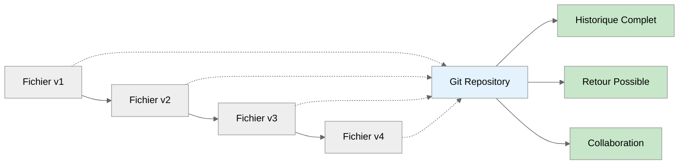
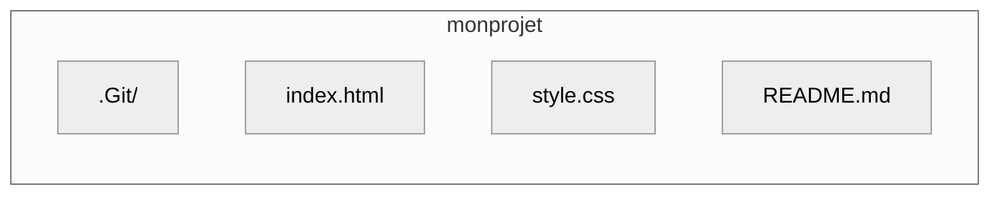
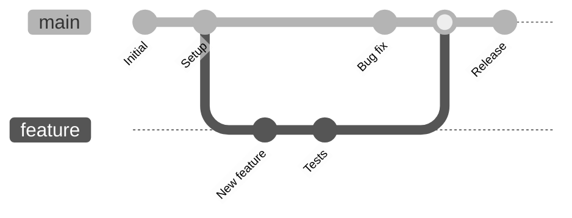
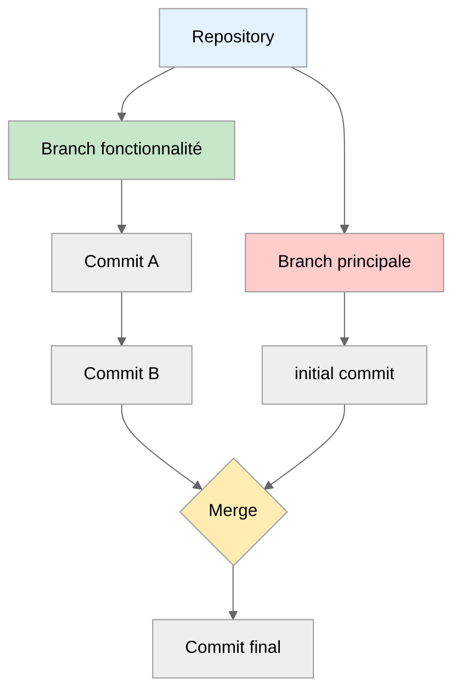
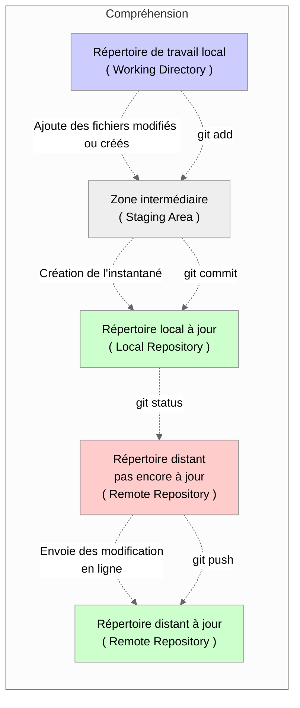
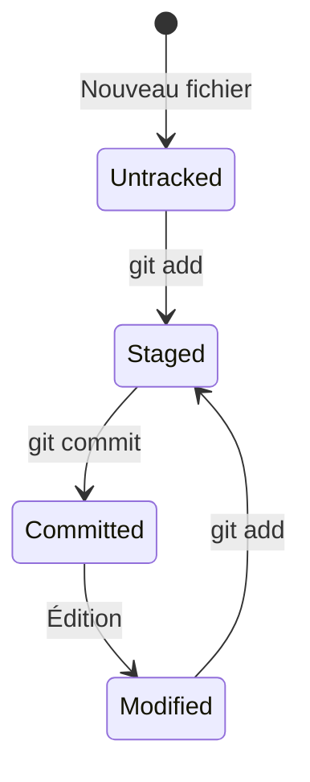

import Badge from '../../../../src/components/Badge';

# Git : Fondamentaux

:::note
**Temps de lecture :** 30 minutes  
**Objectif :** Comprendre Git et maîtriser les commandes essentielles pour débuter en toute confiance
:::

## 1 - Qu'est-ce que Git ? <Badge niveau="Débutant" />

### 1.1 - Définition et utilité

Git constitue **un système de gestion de versions décentralisé** permettant de surveiller l'évolution des fichiers
( _création, modification ou suppression_ ) et de faciliter la collaboration entre différents contributeurs sur un même projet.

:::tip Avantage Principal
Git permet de revenir à une version antérieure du projet, contrairement aux méthodes traditionnelles où nous devions dupliquer les documents.
Sans organisation rigoureuse, ces duplications nous faisaient rapidement perdre le fil entre les différentes versions de nos projets/documents.

:::

#### Schéma pour comprendre Git



## 2 - Concepts Clés

Pour bien comprendre Git, il est essentiel de maîtriser comment les concepts clés s'articulent dans un workflow pratique :

### 2.1 - Introduction au Workflow Git

Le **workflow Git** est une **méthodologie structurée** qui organise la façon dont vous utilisez Git pour gérer votre code et collaborer
avec d'autres développeurs. En comprenant comment les modifications sont _suivies_, _sauvegardées_ et _partagées_, vous pourrez tirer
pleinement parti des fonctionnalités de Git.

**Un workflow bien défini aide à :**

-   **Structurer** le processus de développement
-   **Éviter les conflits** entre développeurs
-   **Maintenir** un historique _clair_ et _compréhensible_

:::note
_Nous explorerons plus en détail différents types de workflows et leurs applications dans les sections suivantes._
:::

### 2.2 - Repository - ( _Dépôt_ )

Un **repository** ( _ou souvent appelé « **repo** »_ ) est un dossier spécial qui sert d'environnement centralisé pour la gestion de votre
code source. Il constitue l'élément fondamental de tout projet Git et contient :

-   Vos fichiers de projet et leur contenu actuel.
-   L'historique complet et chronologique de toutes les modifications apportées depuis la création du projet.
-   Les métadonnées Git essentielles, comme les _informations de configuration_, les _références de branches_ et les _objets Git_.

**Types de repository :**

-   **Local** :<br />
    _Réside directement sur votre ordinateur personnel, vous permettant de travailler même sans connexion internet._

-   **Remote** :<br />
    _Hébergé sur un serveur distant accessible via internet ( GitHub, GitLab, Bitbucket ), facilitant la collaboration et servant de
    sauvegarde centralisée._

**Exemple de structure minimliste**

```git
mon-projet/
├── .git/           # Métadonnées Git ( dossier caché )
├── index.html      # Fichier pour créer une page web statique
├── style.css       # Fichier pour styliser une page web
└── README.md       # Fichier pour documenter le projet
```



<small>_Schéma Représentatif de la structure minimaliste ci-dessus_</small>

### 2.3 - Commit

Un **commit** est un instantané complet et précis de votre projet à un moment spécifique dans son évolution.
Il capture l'état exact de tous les fichiers trackés dans votre repository, permettant ainsi de documenter le développement
progressif de votre code source.

**Caractéristiques :**

-   Identifiant unique automatiquement créé ( _hash_ ) qui sert de référence **immuable**\* pour retrouver cet état particulier du projet
-   Message descriptif obligatoire expliquant clairement les modifications apportées et leur raison d'être
-   Auteur et date automatiquement associé au commit pour maintenir une traçabilité complète des contributions
-   Modifications incluses détaillant précisément chaque changement effectué dans les fichiers concernés

:::info \***immuable**
_Ce terme signifie "**qui ne peut pas être modifié**", garantissant ainsi qu'une fois créé, un élément comme un commit Git
restera **toujours identique** et **inaltérable** dans le temps._

:::

**Découvrons l'anatomie d'un commit :**

```bash
commit a1b2c3d4e5f6g7h8i9j0                 # Hash du commit
Author: Jean Dupont <jean@exemple.com>      # Auteur du commit
Date:   Mon Jun 20 15:30:45 2025 +0200      # Date du commit

    Ajouter la page d\'accueil               # Message (titre) du commit

    - Création du fichier index.html        # Message (corps) du commit
    - Ajout du CSS de base                  # Message (corps suite et fin) du commit
```

<small>
    _Il s'agit des informations qui seront visible dans votre terminal_
</small>

### 2.4 - Branch - ( _Branche_ )

Une **branche** est un mécanisme puissant qui permet de **développer des fonctionnalités en parallèle** sans perturber le code principal.
Les branches constituent un élément essentiel du workflow Git moderne.

:::tip Avantage

-   **Isolation des modifications** :<br />
    _Chaque branche crée un environnement de travail indépendant et sécurisé._
-   **Développement parallèle** :<br />
    _Plusieurs développeurs peuvent travailler simultanément sur différentes fonctionnalités sans interférer avec ce dernier._
-   **Fusion contrôlée** :<br />
    _Les modifications peuvent être **vérifiées** et **intégrées** méthodiquement dans le projet principal._

:::

<br />

**Schéma illustrant le fonctionnement des branches Git**



<small>_Représentation d'un graph Git_</small>

### 2.5 - L'interaction entre les concepts

**Le repository comme fondation**

Comme expliqué en **2.2**, le repository est l'environnement qui contient votre projet et son historique complet.<br />
C'est l'infrastructure qui permet à Git de fonctionner :

-   Le repository local ( _**.git**_ ) stocke toutes les métadonnées et l'historique
-   Le repository distant sert de point central pour la collaboration

**Les commits comme points de sauvegarde**

Comme vu en **2.3**, les commits sont les "**instantanés**" qui capturent l'état du projet à un moment précis :

-   Chaque commit crée un point de référence auquel vous pouvez revenir
-   La suite des commits forme une ligne temporelle de l'évolution du projet
-   Les messages de commit documentent les changements et leur intention

**Les branches comme flux de travail parallèles**

Comme expliqué en **2.4**, les branches permettent de travailler sur différentes fonctionnalités sans affecter le code principal :

-   La branche principale ( _**main**_ ) conserve le code stable
-   Les branches de fonctionnalités isolent les nouvelles modifications
-   La fusion ( _**merge**_ ) permet de réintégrer les changements une fois terminés

**Le workflow complet**



_Cette structure permet de maintenir un historique clair, de travailler en parallèle et de revenir facilement
à n'importe quel état précédent du projet si nécessaire._

## 3 - Installation et Configuration <Badge niveau="Débutant" />

Cette section couvre l'**installation** et la **configuration** de Git sur différents systèmes d'exploitation. ( _**Windows**, **macOS** et
**Linux**_ ) afin de préparer un environnement de travail utilisable immédiatement.

Les **instructions détaillées** sont fournies pour chaque plateforme avec plusieurs options d'installation, suivies par
une **commande de vérification** pour confirmer que l'installation s'est correctement déroulée. Nous terminerons par la **configuration de
l'identité de l'utilisateur**, une étape _cruciale_ pour que Git puisse correctement attribuer les commits comme nous l'avons déjà vu.

La **configuration complémentaire** aborde également des paramètres recommandés comme le **nom de la branche par défaut**,
le **choix de l'éditeur** et la **stratégie de fusion** lors des opérations de pull, afin d'optimiser l'expérience utilisateur selon les
bonnes pratiques actuelles.

### 3.1 - Windows

Plusieurs méthodes pour installer Git sur Windows existes.<br />
Choisissez celle qui correspond le mieux selon vos préférences.

**Option n°1 - Installateur officiel**

:::info Recommandé

```bash
# Visitz le site officiel
https://git-scm.com/download/win

# Suivez les instructions d'installation
# ✓ Acceptez les options par défaut pour une installation standard
```

:::

**Option 2 - Gestionnaires de paquets ( _Chocolatey_ ou _WinGet_ )**

Si sur Windows, vous utilisez déjà le gestionnare de paquet **Chocolatey**, alors ce choix serait plus adapté dans votre situation.

:::warning
Il faut bien avoir déjà ce gestionnaire **installé** et **configuré** sur votre système afin d'utiliser
les commandes liées à **Chocolatey**.
:::

:::note
Si besoin : _**[Lien officiel vers Chocolatey](https://chocolatey.org/ 'Lien vers la page officiel de Chocolatey')**_
:::

```bash
# Exécutez dans un terminal administrateur
choco install git -y
```

**Mais**, sur Windows 10/11, **Winget** est un gestionnaire de paquets **intégré nativement** qui reste souvent méconnu de la communauté.

:::note
Si besoin : _**[Lien officiel vers WinGet](https://learn.microsoft.com/fr-fr/windows/package-manager/winget/ 'Lien vers la page officiel de WinGet')**_
:::

```powershell
# Simple et rapide
winget install Git.Git
```

**Option 3 - Via GitHub Desktop**

Si vous ne vous sentez pas à l'aise avec un terminal, il existe également une solution avec une interface graphique.

```bash
# Téléchargez GitHub Desktop qui inclut Git
https://desktop.github.com/
```

### 3.2 - MacOS

**MacOS** offre plusieurs méthodes d'installation simples et efficaces.<br />
Choisissez celle qui correspond le mieux à votre configuration :

**Option 1 : - Via Homebrew**

Si vous utilisez déjà **Homebrew**, cette méthode est la plus simple et **maintient Git automatiquement à jour** :

:::info Recommandé

```bash
# Installation rapide avec Homebrew
brew install git

# Pour les mises à jour futures
brew upgrade git
```

:::

**Option 2 : Via Xcode Command Line Tools**

Solution **native Apple** qui installe également d'autres outils de développement utiles :

```bash
# Installation des outils de développement Apple
xcode-select --install

# Un dialogue graphique apparaîtra pour confirmer l'installation
```

**Option 3 - Installateur officiel**

Pour une installation manuelle depuis la source officielle :

```bash
# Téléchargez l'installateur depuis le site officiel
https://git-scm.com/download/mac

# Suivez les instructions d'installation à l'écran
```

### 3.3 - Linux

:::warning
L'installation de Git sur Linux **varie selon la distribution utilisée**. Voici les commandes pour les distributions les plus courantes.

:::

-   **Distribution : Ubuntu/Debian**

    ```bash
    # Mettre à jour les dépôts
    sudo apt update -y

    # Installation de Git avec le gestionnaire de paquet APT
    sudo apt install git
    ```

-   **Distribution : CentOS/RHEL/Fedora**

    ```bash
    # Installation de Git avec le gestionnaire de paquet YUM
    sudo yum install git
    ```

    Ou bien

    ```bash
    # Installation de Git avec le gestionnaire de paquet DNF
    sudo dnf install git
    ```

-   **Distribution : Arch Linux et dérivés**

    ```bash
    # Installation de Git avec le gestionnaire de paquet PACMAN
    sudo pacman -S git
    ```

**Vérification de l'installation**

Quelque soit le système d'exploitation, la vérification et les commandes seront les mêmes. Ainsi donc, après l'installation,
vérifiez que Git fonctionne correctement en saisissant dans votre terminal ( _PowerShell_, _Bash_, _Zsh_ ou*autre* ).

```bash
# Dans PowerShell, Bash, CMD ou tout autre terminal, exécutez
git --version

# Résultat attendu (la version peut varier)
# git version 2.42.0.windows.1
```

✅ **Lorsque la commande affiche correctement la version, Git est prêt à être utilisé sur votre système Windows.**

### 3.4 - Configuration Initiale

:::note
Quel que soit le système d'exploitation utilisé, **il est essentiel de configurer Git** afin qu'il puisse identifier précisément
l'utilisateur avec lequel il interagit.
:::

**Voici les commandes à saisir dans votre terminal**

```bash
# Configuration obligatoire (identité)
git config --global user.name "Jean Dupont"
git config --global user.email "jean.dupont@exemple.com"

# Vérifier la configuration
git config --list
```

**Pourquoi cette configuration est importante ?**

-   **`user.name`** et **`user.email`** identifient l'auteur de chaque commit.

:::warning Important
Les identifiants utilisés dans les exemples ci-dessous sont fournis **à titre purement démonstratif**.
Vous devrez impérativement les **remplacer par vos propres informations personnelles**.

_Cela peut sembler évident, mais il est essentiel de le souligner, tant cet aspect est fondamental.._
:::

**Configuration complémentaire** - ( _Non obligatoire_ )

```bash
# Configuration optionnelle mais recommandée
git config --global init.defaultBranch main
git config --global core.editor "code --wait"  # VS Code
git config --global pull.rebase false

# Vérifier la configuration
git config --list
```

-   **`init.defaultBranch main`**<br />
    _Cette commande définit `main` comme **nom de branche par défaut** lors d'une initialisation avec la commande `git init`.
    Cela permet d'éviter la création d'une branche `master` par défaut ( **nom hérité historiquement mais aujourd'hui remplacé par main
    dans la plupart des projets modernes et plateformes comme GitHub **)._

-   **`core.editor "code --wait"`**<br />
    _Configure **Visual Studio Code comme éditeur par défaut** pour les messages de commit, les rebase interactifs,
    les fusions conflictuelles, etc. L’option `--wait` **est cruciale** : elle indique à Git d’**attendre que VS Code soit fermé** avant de
    poursuivre l’exécution ( par exemple, après avoir saisi un message de commit dans l’éditeur )._

    :::note
    _Si tu n’utilises pas **VS Code**, adapte cette ligne à ton éditeur préféré ( **nano**, **vim**, **notepad**, etc. )._
    :::

-   **`pull.rebase false`**<br />
    _Cette ligne indique à Git que lorsqu’on effectue un git pull, il doit utiliser par défaut **un merge** plutôt qu’un **rebase**.
    Cela évite que l’**historique soit réécrit**, ce qui peut être déroutant pour les débutants ou lorsque plusieurs personnes collaborent
    sur une branche._

    |         Option          | Effet                                                                                                        |
    | :---------------------: | :----------------------------------------------------------------------------------------------------------- |
    | **`pull.rebase false`** | La commande **`git pull`** fera un **merge** --> _Historique linéaire mais avec des commits de fusion_       |
    | **`pull.rebase true`**  | La commande **`git pull`** fera un **rebase** --> _Historique plus propre, mais potentiellement plus risqué_ |

## 4 - Commandes Esentielles <Badge niveau="Débutant" />

Cette section présente les **commandes essentielles** de Git pour les débutants.
Elle couvre les **opérations fondamentales** qui permettent de _comprendre_ et _utiliser_ Git efficacement dans un flux de travail quotidien.
Vous y trouverez les commandes pour **créer** et **initialiser** des dépôts, **suivre** des modifications, **créer des instantanés**
( _commits_ ) et **partager** votre travail. Ces connaissances constituent la _base_ pour toute personne souhaitant utiliser
Git dans ses projets de développement.

### 4.1 - Création et Initilisation

:::info Information utile
**La création d'un projet Git** peut se faire de _plusieurs façons différentes_, chacune adaptée à des situations spécifiques :

-   **Création d'un tout nouveau projet** à partir de rien, idéal pour démarrer un développement propre
-   **La possibilité de reprendre un projet déjà existant**, permettant d'intégrer Git à des projets en cours
-   **Mais aussi clonner un projet en ligne** depuis des plateformes comme GitHub ou GitLab<br />
    ( _on y reviendra juste après en détail_ )

:::

**Création d'un nouveau projet - ( _Repository Local_ )**

Concentrons nous dans un premier temps sur la **création d'un tout nouveau projet** pour simplifier la compréhension des commandes.
Cette approche vous permettra de _comprendre les fondamentaux_ avant d'aborder des scénarios plus complexes.

**Commandes Bash**

```bash
# Modélisation d'un nouveau projet avec la création d'un répertoire de travail spécifique.
mkdir mon-projet-demo

# Déplacement dans ce répertoire fraîchement créé
cd mon-projet-demo
```

**Commandes Git**

```git
# Initialisation de git dans ce répertoire.
git init

# Vérification du statut du projet.
git status
```

:::note
Attention il est **impératif** de saisir les **mots-clés** en **anglais**, il n'existe pas de commande traduite en **français**.
Les commandes Git sont _standardisées_ et _universelles_, ce qui garantit leur fonctionnement sur tous les systèmes d'exploitation.

_Pour en savoir d'avantage sur les commandes à saisir dans un terminal, une documentation est en cours de rédaction sur ce sujet.
Celle-ci vous permettra d'approfondir vos connaissances des commandes de base du terminal._
:::

**Clonage d'un projet - ( _Repository Distant_ )**

Pour l'exemple il s'agit d'utiliser une **URL GitHub** mais c'est **sensiblement la même chose** avec **GitLab** ou **Bitbucket**.<br />
Ces plateformes fonctionnent toutes avec le _même principe fondamental_ de gestion de versions distribuée.

:::warning
Le nom d'utilisateur et le projet **doivent exister**, ici il s'agit d'un projet _fictif_, l'URL a pour vocation de **montrer la syntaxe à
saisir seulement**. Dans un cas réel, vous devrez remplacer ces valeurs par celles correspondant à votre propre projet ou au projet que vous
souhaitez cloner.

:::

```bash
# Cloner un projet existant
git clone https://github.com/utilisateur/projet-cloner.git

# Se déplacer dans le dossier
cd projet-cloner

# Vérifier l'état du projet
git status
```

**Structure du projet cloné**

```
projet/
├── .git/           # Historique complet
├── README.md       # Un fichier (correspond à la documentation du projet)
└── (éventuellement d'autres fichiers/dossiers)
```

**Comprendre le clonage en profondeur**

Le clonage d'un dépôt Git est une opération **fondamentale** qui permet de _télécharger l'intégralité_ d'un projet,
y compris son **historique complet** et toutes ses **branches**. Contrairement à un simple téléchargement de fichiers,
cette opération crée une _copie locale complète_ qui reste **connectée** au dépôt d'origine.

:::tip Les Avantages du clonage incluent

-   **Travail hors ligne**<br />
    _Vous pouvez travailler sur le projet sans connexion internet._

-   **Historique complet**<br />
    _Accès à **tous les commits** et **toutes les branches** du projet._

-   **Simplicité de synchronisation**<br />
    _Facilité pour **récupérer** et **envoyer** des modifications._

:::

### 4.2 - Cycle de base : Add, Commit, Push

**Le cycle de base** d'utilisation de Git consiste à naviguer entre **trois états principaux** :

-   la **modification** des fichiers
-   la **préparation** ( _staging area_ )
-   la **validation** ( _commit_ ).

Ce cycle est au **cœur de tout workflow Git** et permet de gérer efficacement les modifications apportées à votre code.
Pour bien comprendre ce cycle, il est **essentiel d'assimiler** comment les fichiers passent d'un état à un autre et
comment les **commandes principales** (_add_, _commit_, _push_) interagissent pour permettre le suivi des changements.

**Visualisons** comment **les fichiers se déplacent** entre **les différents états** et **zones** dans Git avec le schéma suivant :



:::note
_Les commandes sont partiellement dévoilées dans le schéma précédent.<br />
**Notez tout de même qu'il manque les options pour plus de clarté.**._
:::

<br />

**Découvrons les commandes fréquemment utilisées**

-   **`git add`**

    ```git
    # Ajouter un fichier spécifique
    git add index.html

    # Ajouter plusieurs fichiers
    git add index.html style.css script.js

    # Ajouter tous les fichiers modifiés
    git add .

    # Ajouter tous les fichiers d'un type en particulié ( javascript ici )
    git add *.js
    ```

-   **`git status`**

    ```git
    # Voir ce qui est dans la zone d'attente ( Staging Area )
    git status
    ```

-   **`git commit`**<br />
    _Un commit bien structuré est essentiel pour la maintenance et la collaboration._

    :::danger Note très importante
    _Lorsque qu'on utilise la commande_ **`git commit -m "" -m ""`**, _il faut prendre en considération qu'il faut **impérativement
    utiliser des guillemets doubles** ( **"** **"** ) et **non des apostrophes** ( **'** **'** ). En effet, les apostrophes,
    bien que couramment utilisées dans certains langages de programmation, ne fonctionneront pas correctement avec **la signature** de la
    commande<br />_ **`git commit`**.

    :::

    :::warning Couramment utilisé mais à éviter absolument
    _Les messages courts et non descriptifs nuisent à la lisibilité de l'historique du projet._

    ```git
    # Messages trop courts et non informatifs
    git commit -m "Ajouter la page d'accueil"
    git commit -m "Fix"
    git commit -m "Update"
    ```

    :::

    :::tip Approche recommandée
    Utilisez un titre concis suivi d'une description détaillée.

    ```git
    # Structure titre + description détaillée
    git commit -m "Un titre ici" -m "Une description plus fournis permettant de décrire les changements"
    ```

    :::

    :::info Autre approche - Celle du professionnel
    _Pour structurer vos commits de façon standardisée, adoptez la convention **Conventional Commits** qui permet l'automatisation du
    versionnement et des changelogs._

    -   Format : `type(scope): description`
    -   Exemple : `git commit -m "feat(auth): implémenter la connexion OAuth" -m "description complète."`

    <br />
    Pour plus d'informations, consultez CommitLint sur leur **[site officiel](https://commitlint.js.org/)**.

    :::

## 5 - Exemple par la pratique

### 5.1 - Étape 1 - Création d'un fichier html

-   **Commande `bash`** - _Création du fichier index.html_.

    ```bash
    # Créer un fichier comprenant un titre de niveau 1 (Titre principal)
    echo "<h1>Bonjour</h1>" > index.html
    ```

-   **Commande `git`** - _Ajoute du fichier dans la staging area ( zone d'attente )_.

    ```bash
    # Ajout du fichier pour qu'il soit trackée
    git add index.html
    ```

-   **Commande `git`** - _Contrôle le statut des fichiers trackés_.

    ```bash
    # Vérification du statut pour savoir si des éléments sont en attente ou non.
    git status
    ```

:::note

Si le fichier à bien été ajouté alors il ne manque plus qu'à saisir un **Commit** pour versionner celui-ci.<br />
En attendant, **voici le message qui sera affiché à l'écran**. _Il est suceptible de changer selon la version utilisée_.

```git
# Changes to be committed:
#   (use "git rm --cached <file>..." to unstage)
#         new file:   index.html
```

:::

### 5.2 - Étape 2 - Création de l'instantané

**L'instantané sera créé avec la bonne approche** **_sans utiliser la convention présentée en amont_**. **
La volonté recherchée ici est de simplifier grandement l'approche de création** en évoquant les points complexes tout
en pratiquant sur des notions _abordables à votre niveau_.

-   **`git commit`** - _Création d'un instantané avec un titre et un message explicatif_.

    ```git
    # Création d'un premier commit ( instantané )
    # Rappel de la bonne syntaxe : git commit -m "un titre" -m "une description"
    git commit -m "Ajout de la page d'accueil" -m "Création du fichier index.html, structure, titre principal."
    ```

    :::note
    Il est tout à fait possible à ce stade de **continuer à travailler sur sa branche en locale seulement**, **c'est même couramment utilisé
    dans ce sens**. En revanche, si vous souhaitez **envoyer vos changements sur le repository distant**, vous pouvez très bien le faire avec
    la commande suivante.

    **PS :** _Vous devrez bien évidemment disposer d'une URL associée au projet pour lier votre repository local à celui qui est en ligne._
    :::

### 5.3 - Étape 3 - Envooie des modifications sur un repository distant.

**L'envoie des modifications** sur un repository distant passe _indéniablement_ par la validation **précédemment d'un commit**.<br />
Ainsi notre travail sera accessible à d'autres collaborateurs ou simplement **sauvegardé en** ligne.

-   **`git push`** - _Pousser les changements sur le repository distant._

    Premier push et **EXCLUSIVEMENT LE PREMIER**.

    ```git
    # Le tout premier "Push" permet de créer la branche distante ( ici main )
    git push -u origin main
    ```

    Puis les autres **push** se feront simplement comme ceci.

    ```git
    # Puis tout les autres "Push" suivants
    git push
    ```

    Dans un vrai projet, il est question de travailler sur une branche spécifique pour ne pas impacter le travail de ses collaborateurs.

    ```git
    # Push sur une branche spécifique
    git push origin ma-branche-speciale
    ```

    Parfois certains vous demanderont de **forcer** un **push**. **Ne le faites surtout pas hormis si vous avez l'aval d'un mentor par écrit**.

    :::danger Non recommandée
    En effet, cette approche est **non recommandée** car un **push forcé écrase l'historique distant** et **peut causer la perte de
    modifications effectuées par d'autres collaborateurs**, compromettant ainsi l'intégrité du projet partagé.

    ```git
    # Push forcé (ATTENTION : dangereux)
    git push --force
    ```

    :::

## 6 - Vérification de l'état d'un projet

### 6.1 - **`git status`**

Nous avons déjà utilisé à plusieurs reprises la commande **`git status`** sans trop l'expliqué. Différent message peuvent-être associé à cette
commande, ainsi dans cette partie nous vous proposons de comprendre chacun d'entre eux simplement.

-   **`git status -s`** - Voir l'état actuel de façon simplifié

    ```git
    # Version courte
    git status -s
    ```

-   **`git status`** - Couramment utilisé

    ```git
    # Voir l'état actuel
    git status
    ```

**Interprétation des réponses retournées par la commande `git status`**.

:::tip En stagin ( _prêt à être commiter_ )

```git
On branch main
Changes to be committed:
    new file:   nouveau.txt
```

:::

:::warning Modifié mais pas encore dans le zone de " staging "

```git
On branch main
Changes not staged for commit:
    modified:   index.html
```

:::

:::note Nouveaux fichiers non suivis

```git
On branch main
Untracked files:
    temp.txt
```

:::

### 6.2 - **`git commit --amend`**

Parfois, il va vous **arriver** de faire un **`commit`** et d'oublier une étape importante, ainsi vous allez **penser** qu'il faut de nouveau
faire un nouveau commit en expliquant le changement apporté. Sachez que Git **met** à disposition l'option **`--amend`** afin d'éditer le
dernier commit.

:::danger Attention !!!
_**Il faut bien entendu que le dernier commit n'ait pas encore été push sur un repository distant, c'est FONDAMENTAL !!**_

:::

**Exemple de l'édition d'un commit pas encore push**

```git
# Modification du dernier commit ( pas encore pushé )
git commit --amend -m "Nouveau titre" -m "nouveau message détaillé"
```

### 6.3 - **`git log`**

**Il peut être utile** de consulter l'historique complet des commits sur un projet afin de déterminer _qui a effectué une modification
particulière_, _quand elle a été faite_ et _avec quel message_. C'est **essentiel** pour comprendre l'évolution du code et pour déboguer
correctement.

-   **`git log`** - _Connaître l'historique complet._

    ```git
    # Historique complet
    git log
    ```

-   **`git log --oneline`** - _Connaître l'historique complet, chaque log tiendra sur une ligne._

    ```git
    # Historique condensé ( chaque log tient sur une ligne )
    git log --oneline
    ```

-   **`git log --oneline --graph`** - _Connaître l'historique complet, chaque log tiendra sur une ligne accompagné d'un graphique._

    ```git
    # Historique avec graphique
    git log --oneline --graph
    ```

-   **`git log -- index.html`** - _Connaître l'historique d'un fichier spécifique ( ici index.html )._

    ```git
    # Historique d'un fichier
    git log -- index.html
    ```

-   **`git log -n`** - _Afficher un certain nombre de log ( n correspond au nombre désiré )._

    ```git
    # Derniers n commits ( n correspond au nombre de commits que l'on souhaite afficher )
    git log -3
    ```

**Exemple de sortie des logs**

-   **Commande saisie**

    ```git
    # Commande saisie
    git log --oneline
    ```

-   **sortie affiché dans le terminal**

    ```git
    # Résultat obtenue
    a1b2c3d (HEAD -> main, origin/main) Ajouter page contact
    d4e5f6g Corriger bug CSS
    g7h8i9j Page d'accueil initiale
    j1k2l3m Initial commit
    ```

### 6.4 - **`git diff`**

La commande **`git diff`** permet de **visualiser précisément** les _modifications effectuées_ dans les fichiers,
ce qui est **essentiel** pour vérifier les changements avant de les valider dans un commit.

-   **`git diff`** - _Découvrez les modifications qui ne sont pas encore "commit"._

    ```git
    # Voir les modifications non stagées ( utile pour savoir si le fichier est prêt à être commité où non )
    git diff
    ```

-   **`git diff --staged`** - _._

    ```git
    # Voir les modifications stagées ( Vérifie ce qui est prêt à être commit )
    git diff --staged
    ```

-   **`git diff index.html`** - _Comparer les différences sur un fichier spécifique._

    ```git
    # Comparer un fichier spécifique
    git diff index.html
    ```

-   **`git diff a1b2c3d d4e5f6g`** - _Comparaison entre deux commit selon les hash passés en paramètres._

    ```git
    # Comparer deux commits ( Avec git log on récupère un hash qui peut être exploité ici )
    git diff a1b2c3d d4e5f6g
    ```

**Lecture d'une réponse d'une commande `git diff`**

-   **La commande saisie :**

    ```git
    # Commande saisie pour comparer deux fichiers "index.html"
    git diff --git a/index.html b/index.html
    ```

-   **Le résultat obtenu**

    ```git
    index 1234567..abcdefg 100644
    --- a/index.html
    +++ b/index.html
    @@ -1,4 +1,5 @@
    <html>
    <head>
    -    <title>Ancien titre</title>
    +    <title>Nouveau titre</title>
    +    <meta charset="utf-8">
    </head>
    ```

    **Légende**

    | Code couleur       | Couleur | Explication   |
    | ------------------ | :-----: | ------------- |
    | `--- a/index.html` |  Rouge  | Data supprimé |
    | `+++ b/index.html` |  Vert   | Data ajouté   |

## 7 - Gestion des Fichiers <Badge niveau="Débutant" />

### 7.1 - États des Fichiers



**Les 4 États possible**

-   **1 - Untracked** - _Fichier pas encore suivi._

    ```bash
    # 1. Untracked : Non suivi par Git
    echo "nouveau" > fichier.txt
    git status  # Untracked files: fichier.txt
    ```

-   **2 - Staged** - _Fichier suivi_.

    ```bash
    # 2. Staged : Prêt à être commité
    git add fichier.txt
    git status  # Changes to be committed: new file: fichier.txt
    ```

-   **3 - Committed** - _Fichier sauvegardé_.

    ```bash
    # 3. Committed : Sauvegardé dans l'historique
    git commit -m "Ajouter fichier.txt"
    git status  # nothing to commit, working tree clean
    ```

-   **4 - Modified** - \_\_.

    ```bash
    # 4. Modified : Modifié depuis le dernier commit
    echo "contenu modifié" >> fichier.txt
    git status  # Changes not staged for commit: modified: fichier.txt
    ```

### 7.2 - Qu'est-ce que le fichier .gitignore ?

Le fichier **`.gitignore`** permet d'exclure certains fichiers du suivi Git. C'est très pratique pour alléger les repository distant.
Chaque dépendences dans les projets sont tous de différentes tailles et tout envoyer en ligne serait dramatique pour les hébergeurs.
Ici il sera question de télécharger ses dépendances via des commandes relatives aux gestionnaire de paquets qui sera utilisé dans le projet.

**Création et Syntaxe**

```bash
# Créer le fichier .gitignore
touch .gitignore
```

**Contenu d'un .gitignore d'exemple issue d'un projet JavaScript**

```git
# Répetoire
node_modules/

# Fichiers
*.log
.env
```

**Syntaxe de rédaction des règles d'un fichier .gitignore**

```git
# Commentaire

# Ignorer un fichier spécifique
config.txt

# Ignorer tous les fichiers d'un type
*.log
*.tmp

# Ignorer un dossier
node_modules/
build/

# Ignorer mais garder la structure
logs/
!logs/.keep

# Ignorer tout sauf...
*
!index.html
!style.css
```

**Exemple courant d'utilisation**

```git
# === .gitignore pour projet web ===

# Dépendances
node_modules/
npm-debug.log*
yarn-debug.log*
yarn-error.log*

# Production
build/
dist/

# Environnement local
.env
.env.local
.env.development.local
.env.test.local
.env.production.local

# IDE
.vscode/
.idea/
*.sublime-project
*.sublime-workspace

# Système
.DS_Store
Thumbs.db

# Logs
logs/
*.log

# Temporaires
tmp/
temp/
*.swp
*.swo
*~

# Cache
.cache/
.parcel-cache/
```

**Comment est appliquer le fichier `.gitignore` ?**

```bash
# Ajouter le .gitignore au projet
git add .gitignore
git commit -m "Ajout du .gitignore" -m "Ajout du .gitignore pour éviter untracted des éléments inutiles"

# Si fichiers déjà trackés, les retirer du suivi
git rm --cached a-ignorer.txt
git commit -m "Retirer a-ignorer du suivi Git" -m "Retrait du fichier 'a-ignorer.txt' du suivi."
```

## 8 - Collaboration Basique <Badge niveau="Débutant" />

:::info
**Pour collaborer avec un repository distant, vous devez disposer d'un compte sur une plateforme Git **comme `GitHub`, `GitLab` ou `Bitbucket`.
_Ces services hébergent vos projets en ligne et offrent des outils de collaboration supplémentaires comme la **gestion des issues**,
les **pull requests** et les **actions d'intégration continue**._

-   **Les issues** : _C'est un espace pour échanger sur des bugs ou incompréhensions dans un projet._
-   **Les pull requests** : _C'est permettre de proposer une modification ou changement majeur._
-   **L'intégration continue** : _C'est permettre la mise en place d'un cycle automatisé._

:::

### 8.1 - Remote Repository

**Les commandes git remote** permettent de _gérer les connexions avec des dépôts distants_, facilitant ainsi la **visualisation**,
l'**ajout**, la **modification** ou la **suppression** de ces liens essentiels à la collaboration.

-   **Découvrez les remotes configurés sur un projet**

    ```bash
    # Voir les remotes configurés
    git remote -v
    ```

-   **Ajoutez une URL spécifique pour un projet**

    ```bash
    # Ajouter un remote
    git remote add origin https://github.com/utilisateur/projet.git
    ```

-   **Modification d'une URL distante**

    ```bash
    # Modifier l'URL d'un remote
    git remote set-url origin https://github.com/utilisateur/nouveau-projet.git
    ```

-   **Supprimez un remote d'un projet**

    ```bash
    # Supprimer un remote
    git remote remove old-origin
    ```

### 8.2 - Synchronisation ( `git fetch` )

**La synchronisation** permet d'_échanger des données entre repositories locaux et distants_ pour **maintenir la cohérence du projet** entre
tous les collaborateurs. La commande `fetch` est particulièrement utile car elle permet de récupérer les modifications distantes _**sans les
fusionner automatiquement**_, vous donnant ainsi la possibilité d'examiner les changements avant de les intégrer.

```bash
# Récupérer les modifications distantes
git fetch origin
```

```bash
# Récupérer et fusionner
git pull origin main
```

:::note Différence entre fetch VS pull

```bash
# git fetch : Télécharge sans fusionner
git fetch origin
git log origin/main     # Voir ce qui a été récupéré
git merge origin/main   # Fusionner manuellement
```

```bash
# git pull : Télécharge ET fusionne
git pull origin main
# Équivalent à : git fetch + git merge
```

:::

### 8.3 - Workflow de Collaboration Simple

-   **Diagramme de séquence permettant de comprendre plus simplement la collaboration simple**

    **Le diagramme de séquence ci-dessous** illustre _visuellement_ le flux de travail **collaboratif** entre deux développeurs partageant
    leurs modifications via GitHub, montrant _comment les commits sont synchronisés et intégrés chronologiquement_.

    ```mermaid
    ---
    config:
        theme: 'neutral'
    ---
    sequenceDiagram
        participant Dev1
        participant GitHub
        participant Dev2

        Dev1->>GitHub: git push (commit A)
        Dev2->>GitHub: git pull (récupère A)
        Dev2->>GitHub: git push (commit B)
        Dev1->>GitHub: git pull (récupère B)
        Dev1->>GitHub: git push (commit C)
    ```

-   **GitGraph des Commits**

    Le **diagramme GitGraph** ci-dessous a un **lien direct** avec le _diagramme de séquence_ présenté plus haut. Alors que le _diagramme de
    séquence_ montre les **interactions chronologiques** entre les développeurs et GitHub (le "_qui fait quoi quand_"), le **GitGraph**
    visualise comment ces mêmes actions **impactent l'historique** des branches et des commits (le "_comment s'organise l'arbre de
    développement_"). Les **deux se complètent** pour illustrer le même workflow collaboratif sous _deux angles différents_.

    ```mermaid
    ---
    config:
        theme: 'neutral'
    ---
    gitGraph
        commit id: 'Initial commit'
        branch Dev1
        checkout Dev1
        commit id: 'Commit A'
        checkout main
        merge Dev1
        branch Dev2
        checkout Dev2
        commit id: 'Récupère A'
        commit id: 'Commit B'
        checkout main
        merge Dev2
        checkout Dev1
        merge main
        commit id: 'Récupère B'
        commit id: 'ComMit C ... etc.'
    ```

**Comparaison des workflows**

| **Type de branche** | **Objectif**                          | **Cycle de vie** | **Merge vers** | **Exemples de nommage**                                  |
| :-----------------: | ------------------------------------- | ---------------- | -------------- | -------------------------------------------------------- |
|   **main/master**   | _Code de production stable_           | Permanente       | N/A            | `main`<br /> `master`                                    |
|     **develop**     | _Code en développement intégré_       | Permanente       | main           | `develop`<br /> `dev`                                    |
|     **feature**     | _Nouvelles fonctionnalités_           | **Temporaire**   | develop        | `feature/login`<br /> `feature/cart-checkout`            |
|     **release**     | _Préparation d'une version_           | **Temporaire**   | main + develop | `release/v1.2.0`<br /> `release/2023-Q2`                 |
|     **hotfix**      | _Corrections urgentes en prod_        | **Temporaire**   | main + develop | `hotfix/login-security`<br /> `hotfix/api-crash`         |
|     **bugfix**      | _Corrections de bugs non-urgents_     | **Temporaire**   | develop        | `bugfix/header-alignment`<br /> `bugfix/form-validation` |
|     **support**     | _Maintenance de versions antérieures_ | Longue durée     | N/A            | `support/v1.x`<br /> `support/legacy`                    |
|  **documentation**  | _Mise à jour de la documentation_     | **Temporaire**   | develop        | `docs/api-reference`<br /> `docs/readme-update`          |

## Conclusion & Points Clés à Retenir

:::tip Récapitulatif Fondamentaux Git
Concepts maîtrisés :

✅ Workflow : add → commit → push, cycle quotidien
✅ Commits : Instantanés de votre projet avec messages descriptifs
✅ Repository : Espace de travail avec historique complet
✅ Remote : Collaboration et sauvegarde distante

:::

---

:::info Métadonnées du Document

-   Version : 1.1
-   Dernière mise à jour : 24 Juin 2025
-   Niveau : <Badge niveau="Débutant" />
-   Durée : 30 minutes
-   Prérequis : Aucun - première approche de Git
-   Objectif : Autonomie complète sur les opérations Git de base

:::
