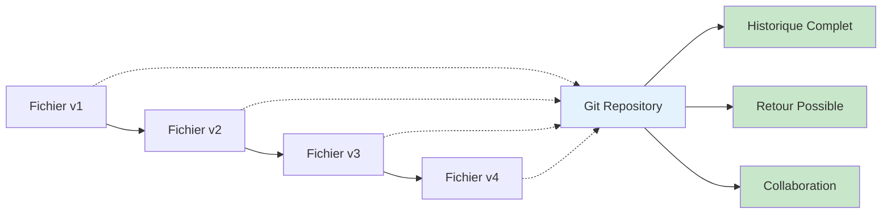
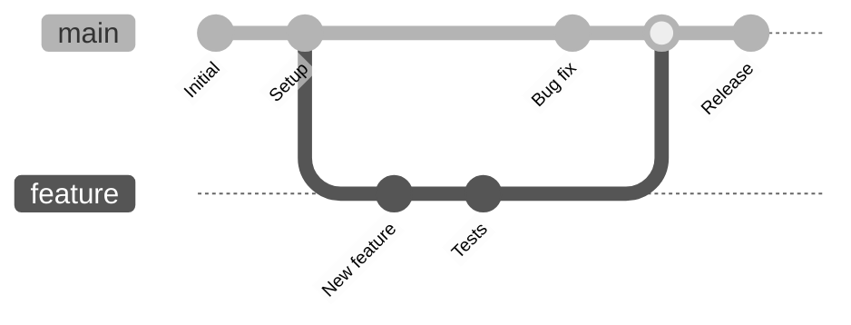
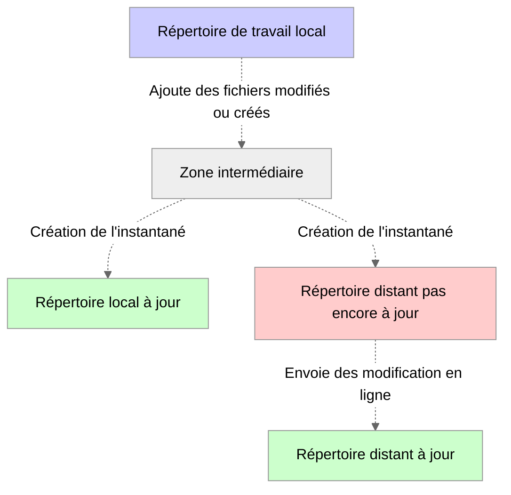
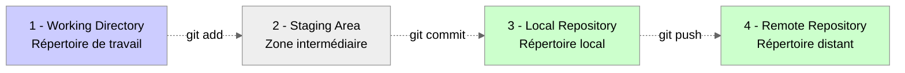
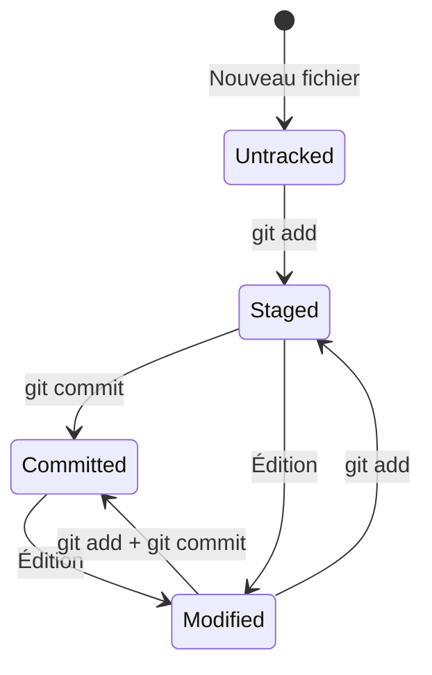
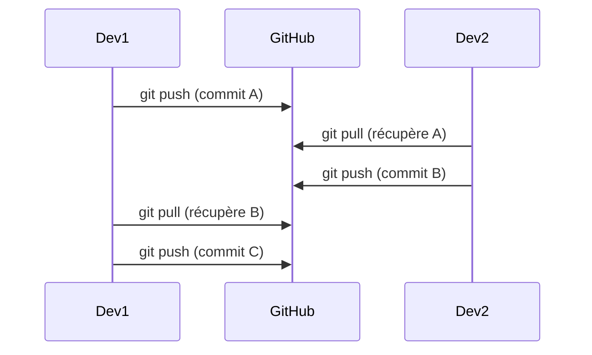

import Badge from '../../../../src/components/Badge';

# Git : Fondamentaux

:::note
**Temps de lecture :** 30 minutes  
**Objectif :** Comprendre Git et maîtriser les commandes essentielles pour débuter sereinement
:::

## 1 - Qu'est-ce que Git ? <Badge niveau="Débutant" />

### 1.1 - Définition et utilité

Git est un **système de contrôle de version distribué** qui permet de suivre les modifications de fichiers et de coordonner le travail
entre plusieurs personnes sur un projet.

:::tip Avantage Principal
Il est tout à fait possible de revenir sur une version antérieure alors qu'avant nous devions dupliquer les documents et si nous n'étions
pas organisés, alors très vite nous nous perdions entre chacune des versions.

:::

#### Schéma pour comprendre Git



## 2 - Concepts Clés

### 2.1 - Repository - ( _Dépôt_ )

Un **repository** ( _ou souvent appelé "**repo**"_ ) est un dossier qui contient :

-   Vos fichiers de projet
-   L'historique complet des modifications
-   Les métadonnées Git

**Types de repository :**

-   **Local** : Sur votre ordinateur
-   **Remote** : Sur un serveur ( _GitHub, GitLab, Bitbucket_ )

**Exemple de structure**

```
mon-projet/
├── .git/           # Métadonnées Git (caché)
├── index.html      # Un fichier personnel pour créer une page internet
├── style.css       # Un fichier personnel pour styliser une page internet
└── README.md       # Un fichier personnel pour documenter le projet
```

### 2.2 - Commit

Un **commit** est un instantané de votre projet à un moment donné.

**Caractéristiques :**

-   Identifiant unique automatiquement créé ( _hash_ )
-   Message descriptif obligatoire
-   Auteur et date automatiquement associé au commit
-   Modifications incluses

**anatomie d'un commit :**

```bash
commit a1b2c3d4e5f6g7h8i9j0                 # Hash du commit
Author: Jean Dupont <jean@exemple.com>      # Auteur du commit
Date:   Mon Jun 20 15:30:45 2025 +0200      # Date du commit

    Ajouter la page d'accueil               # Message (titre) du commit

    - Création du fichier index.html        # Message (corps) du commit
    - Ajout du CSS de base                  # Message (corps suite et fin) du commit
```

### 2.3 - Branch - ( _Branche_ )

Une **Branche** permet de développer des fonctionnalités en parallèle.

:::tip Avantage

-   Isolation des modifications
-   Développement parallèle
-   Fusion contrôlée

:::

**Schéma représentatif du fonctionnement des Branches avec Git**



## 3 - Installation et Configuration <Badge niveau="Débutant" />

### 3.1 - Windows

**Option 1**

```bash
# Télécharger l'exécutable depuis git-scm.com
# https://git-scm.com/download/win
```

**Option 2**

```bash
# Avec Chocolatey (le gestionnaire de dépendance de windows qui doit être installé en amont)
choco install git
```

**Option 3**

```bash
# Avec Winget
winget install Git.Git
```

**Vérification si l'installation à réussi**

```bash
# Affiche le numéro de version de Git.
git --version
```

### 3.2 - MacOS

**Option 1 : Avec Homebrew**

:::info Recommandé

```bash
# Avec Homebrew
brew install git
```

:::

**Option 2 : Avec Xcode**

```bash
# Avec Xcode Command Line Tools
xcode-select --install
```

**Option 3**

```bash
# Télécharger l'exécutable depuis git-scm.com
# https://git-scm.com/download/mac
```

**Vérification si l'installation à réussi**

```bash
# Affiche le numéro de version de Git.
git --version
```

### 3.3 - Linux

**Distribution : Ubuntu/Debian**

```bash
# Mettre à jour les paquets
sudo apt update -y

# Installation avec le gestionnaire de paquet APT
sudo apt install git
```

**Distribution : CentOS/RHEL/Fedora**

```bash
# Installation avec le gestionnaire de paquet YUM
sudo yum install git

# OU

# Installation avec le gestionnaire de paquet DNF
sudo dnf install git
```

**Distribution : Arch Linux**

```bash
# Installation avec le gestionnaire de paquet PACMAN
sudo pacman -S git
```

**Vérification si l'installation à réussi**

```bash
# Affiche le numéro de version de Git.
git --version
```

### 3.4 - Configuration Initiale

:::note
Quel que soit le système d’exploitation utilisé, **il est essentiel de configurer Git** afin qu’il puisse identifier précisément
l’utilisateur avec lequel il interagit.
:::

**Voici les commandes à saisir dans votre terminal**

```bash
# Configuration obligatoire (identité)
git config --global user.name "Jean Dupont"
git config --global user.email "jean.dupont@exemple.com"

# Vérifier la configuration
git config --list
```

**Pourquoi cette configuration est importante ?**

-   **`user.name`** et **`user.email`** identifient l'auteur de chaque commit.

:::warning Important
Les identifiants utilisés dans les exemples ci-dessous sont fournis **à titre purement démonstratif**.
Vous devrez impérativement les **remplacer par vos propres informations personnelles**.

_Cela peut sembler relever du bon sens, certes, mais il me semblait indispensable de vous le rappeler, tant cet aspect est fondamental._

:::

**Configuration complémentaire** - ( _Non obligatoire_ )

```bash
# Configuration optionnelle mais recommandée
git config --global init.defaultBranch main
git config --global core.editor "code --wait"  # VS Code
git config --global pull.rebase false

# Vérifier la configuration
git config --list
```

-   **`init.defaultBranch main`**<br />
    _Cette commande définit `main` **comme nom de branche par défaut** lors d’une initialisation avec la commande `git init`.
    Cela permet d’éviter la création d’une branche `master` par défaut ( **nom hérité historiquement mais aujourd’hui remplacé par main
    dans la plupart des projets modernes et plateformes comme GitHub** )._

-   **`core.editor "code --wait"`**<br />
    _Configure **Visual Studio Code comme éditeur par défaut** pour les messages de commit, les rebase interactifs,
    les fusions conflictuelles, etc. L’option `--wait` est cruciale : elle indique à Git d’**attendre que VS Code soit fermé** avant de
    poursuivre l’exécution ( par exemple, après avoir saisi un message de commit dans l’éditeur )._

    :::note
    Si tu n’utilises pas **VS Code**, adapte cette ligne à ton éditeur préféré ( _**nano**, **vim**, **notepad**, etc._ ).

    :::

-   **`pull.rebase false`**<br />
    _Cette ligne indique à Git que lorsqu’on effectue un git pull, il doit utiliser par défaut **un merge** plutôt qu’un **rebase**.
    Cela évite que l’**historique soit réécrit**, ce qui peut être déroutant pour les débutants ou lorsque plusieurs personnes collaborent
    sur une branche._

    |         Option          | Effet                                                                                                        |
    | :---------------------: | :----------------------------------------------------------------------------------------------------------- |
    | **`pull.rebase false`** | La commande **`git pull`** fera un **merge** --> _Historique linéaire mais avec des commits de fusion_       |
    | **`pull.rebase true`**  | La commande **`git pull`** fera un **rebase** --> _Historique plus propre, mais potentiellement plus risqué_ |

## 4 - Commandes Esentielles <Badge niveau="Débutant" />

### 4.1 - Création et Initilisation

:::info Information utile
La création d'un projet peut se faire de plusieurs façons.

-   Création d'un tout nouveau projet à partir de rien
-   La possibilité de reprendre un projet déjà existant.
-   Mais aussi clonner un projet en ligne ( _on y reviendra juste après_ )

:::

**Création d'un nouveau projet - ( _Repository Local_ )**

Concentrons nous dans un premier temps sur la création d'un tout nouveau projet pour simplifier la compréhension des commandes.

```bash
# Modélisation d'un nouveau projet avec la création d'un répertoire de travail spécifique.
mkdir mon-projet-demo

# Déplacement dans ce répertoire fraîchement créé
cd mon-projet-demo

# Initialisation de git dans ce répertoire.
git init

# Vérification du statut du projet.
git status
```

:::note
Attention il est impératif de saisir les **mots-clés** en **anglais**, il n'existe pas de commande traduite en **français**.<br />
_Pour en savoir d'avantage sur les commandes à saisir dans un terminal, une documentation est en cours de rédaction sur ce sujet._

:::

**Clonnage d'un projet - ( _Repository Distant_ )**

:::warning
Pour l'exemple il s'agit d'utiliser une **URI GitHub** mais c'est senssiblement la même chose avec **GitLab** ou **Bitbucket**.<br />
**Attention le nom d'utilisateur et le projet doivent existé, ici il s'agit d'un projet fictif, l'URI a pour vocation de montrer
la syntaxe à saisir seulement.**
:::

```bash
# Cloner un projet existant
git clone https://github.com/utilisateur/projet-cloner.git

# Se déplacer dans le dossier
cd projet-cloner

# Vérifier l'état
git status
```

**Structure du projet cloné**

```
projet/
├── .git/           # Historique complet
├── README.md       # Un des fichiers du projet (correspond à la documentation du projet)
└── (autres fichiers éventuellement)
```

### 4.2 - Cycle de base : Add, Commit, Push

**Schéma pour comprendre ce qu'il se passe**



<br />

**Schéma pour compprendre les termes techniques utilisés**



**Quels sont les commandes utilisés**

```bash
# Ajouter un fichier spécifique
git add index.html

# Ajouter plusieurs fichiers
git add index.html style.css script.js

# Ajouter tous les fichiers modifiés
git add .

# Ajouter tous les fichiers d'un type en particulié ( javascript ici )
git add *.js

# Voir ce qui est dans la zone d'attente ( Staging Area )
git status
```

**Exemple par la pratique**

**Etape 1 - Création**

```bash
# Créer un fichier comprenant un titre de niveau 1 (Titre principal)
echo "<h1>Bonjour</h1>" > index.html

# L'ajouter au staging ( zone d'attente )
git add index.html

# Vérifier le statut du projet
git status
```

**Affichera dans votre terminal**

```git
# Changes to be committed:
#   (use "git rm --cached <file>..." to unstage)
#         new file:   index.html
```

**Etape n°2 - Commit - ( _Création de l'instantané_ )**

:::warning Pas une bonne approche

```git
# Commit avec message court
git commit -m "Ajouter la page d'accueil"
```

:::

:::tip Bonne approche

```git
# Commit avec message détaillé
git commit -m "Ajouter la page d'accueil" -m "- Création du fichier index.html
- Structure HTML de base
- Titre principal ajouté"
```

:::

**Information utile**

Si le commit en cours n'a pas encore été `push` vers la **banche distante** alors il est possible de modifier
le dernier commit avec la commande suivante.

```git
# Modifier le dernier commit (si pas encore pushé)
git commit --amend -m "Nouveau message"
```

**Consulter l'historique des commits**

```
# Voir l'historique
git log --oneline
```

**Bonnes pratiques pour les messages**

:::tip Bon message

````git
# Descriptif et clair
git commit -m "Corriger le bug d'affichage sur mobile"

# Avec détails
git commit -m "Ajouter la validation du formulaire" -m "- Validation email
- Validation mot de passe
- Messages d'erreur en français"

:::

:::danger Mauvais message

```git
# Trop vague
git commit -m "updates"
git commit -m "fix"
````

:::

**Pousser les changements sur le repository distant avec Push**

```git
# Le tout premier "Push" permet de créer la branche distante ( ici main )
git push -u origin main

# Puis tout les autres "Push" suivants
git push
```

```git
# Push d'une branche spécifique
git push origin ma-branche
```

:::danger Non recommandée

```git
# Push forcé (ATTENTION : dangereux)
git push --force
```

:::

4.3 - Séquence complète typique

**Modification du fichier index.html**

```git
# 1. Modifier du fichier index.html
echo "Nouveau contenu" >> index.html
```

**Contrôler les changements dans la zone d'attente**

```git
# 2. Voir les changements
git status
```

:::info Découverte de la commante **`git diff`**
Cette commande permet d'afficher les différences entre votre nouveau fichier et celui disponible dans la zone d'attente<br />
( Staging Area ).

```git
# 2 bis. Compare le nouveau contenu à celui dans la zone de stagin
git diff
```

:::

**Ajoute des changements dans la zone d'attente**

```git
# 3. Ajouter au staging
git add index.html
```

**Création de l'instantané**

```git
# 4. Créer le commit
git commit -m "Mettre à jour le contenu de la page d'accueil" \
           -m "J'ai apporté des modifications en structurant le projet avec une bonne sémentique."
```

**Envoie des modification sur le Repository disant**

```git
# 5. Envoyer vers le serveur ( ici il ne s'agit pas du premier push, donc syntaxe simplifié )
git push
```

### 4.3 - Commandes de Consultation

J'ai utilisé à plusieurs reprises la commande **`git status`** sans trop l'expliqué. En effet, différents message peuvent-être associé à cette
commande, ainsi je vous propose de comprendre chacun d'entre eux simplement.

**`git status` avec et sans options -s**

```git
# Version courte
git status -s

# Voir l'état actuel
git status
```

**Interprétation des réponses retournées par la commande `git status` :**

:::tip En stagin ( _prêt à être commiter_ )

```git
On branch main
Changes to be committed:
    new file:   nouveau.txt
```

:::

:::warning Modifié mais pas en staging

```git
On branch main
Changes not staged for commit:
    modified:   index.html
```

:::

:::note Nouveaux fichiers non suivis

```git
On branch main
Untracked files:
    temp.txt
```

:::

**Contrôler les logs**

```git
# Historique complet
git log

# Historique condensé ( chaque log tient sur une ligne )
git log --oneline

# Historique avec graphique
git log --oneline --graph

# Historique d'un fichier
git log -- index.html

# Derniers n commits ( n correspond au nombre de commits que l'on souhaite afficher )
git log -3
```

**Exemple de sortie des logs**

```git
# Commande saisie
git log --oneline

# Résultat obtenue
a1b2c3d (HEAD -> main, origin/main) Ajouter page contact
d4e5f6g Corriger bug CSS
g7h8i9j Page d'accueil initiale
j1k2l3m Initial commit
```

**Découvrons la commande `git diff`**

Elle a également été apperçu un peu en amont de cette documentation sans forcément expliquer son fonctionnement.

```git
# Voir les modifications non stagées ( utile pour savoir si le fichier est prêt à être commité où non )
git diff

# Voir les modifications stagées ( Vérifie ce qui est prêt à être commit )
git diff --staged

# Comparer deux commits ( Avec git log on récupère un hash qui peut être exploité ici )
git diff a1b2c3d d4e5f6g

# Comparer un fichier spécifique
git diff index.html
```

**Lecture d'une réponse d'une commande `git diff`**

```git
diff --git a/index.html b/index.html
index 1234567..abcdefg 100644
--- a/index.html
+++ b/index.html
@@ -1,4 +1,5 @@
 <html>
 <head>
-    <title>Ancien titre</title>
+    <title>Nouveau titre</title>
+    <meta charset="utf-8">
 </head>
```

**Légende**

| Code couleur       | Couleur | Explication   |
| ------------------ | :-----: | ------------- |
| `--- a/index.html` |  Rouge  | Data supprimé |
| `+++ b/index.html` |  Vert   | Data ajouté   |

## 5 - Gestion des Fichiers <Badge niveau="Débutant" />

### 5.1 - États des Fichiers



**Les 4 États possible**

**1 - Untracked**

```bash
# 1. Untracked : Non suivi par Git
echo "nouveau" > fichier.txt
git status  # Untracked files: fichier.txt
```

**2 - Staged**

```bash
# 2. Staged : Prêt à être commité
git add fichier.txt
git status  # Changes to be committed: new file: fichier.txt
```

**3 - Committed**

```bash
# 3. Committed : Sauvegardé dans l'historique
git commit -m "Ajouter fichier.txt"
git status  # nothing to commit, working tree clean
```

**4 - Modified**

```bash
# 4. Modified : Modifié depuis le dernier commit
echo "contenu modifié" >> fichier.txt
git status  # Changes not staged for commit: modified: fichier.txt
```

### 5.2 - Qu'est-ce que le fichier .gitignore

Le fichier **`.gitignore`** permet d'exclure certains fichiers du suivi Git. C'est très pratique pour alléger les repository distant.
Chaque dépendences dans les projets sont tous de différentes tailles et tout envoyer en ligne serait dramatique pour les hébergeurs.
Ici il sera question de télécharger ses dépendances via des commandes relatives aux gestionnaire de paquets qui sera utilisé dans le projet.

**Création et Syntaxe**

```bash
# Créer le fichier .gitignore
touch .gitignore
```

**Contenu d'un .gitignore d'exemple issue d'un projet JavaScript**

```git
# Répetoire
node_modules/

# Fichiers
*.log
.env
```

**Syntaxe de rédaction des règles d'un fichier .gitignore**

```git
# Commentaire

# Ignorer un fichier spécifique
config.txt

# Ignorer tous les fichiers d'un type
*.log
*.tmp

# Ignorer un dossier
node_modules/
build/

# Ignorer mais garder la structure
logs/
!logs/.keep

# Ignorer tout sauf...
*
!index.html
!style.css
```

**Exemple courant d'utilisation**

```git
# === .gitignore pour projet web ===

# Dépendances
node_modules/
npm-debug.log*
yarn-debug.log*
yarn-error.log*

# Production
build/
dist/

# Environnement local
.env
.env.local
.env.development.local
.env.test.local
.env.production.local

# IDE
.vscode/
.idea/
*.sublime-project
*.sublime-workspace

# Système
.DS_Store
Thumbs.db

# Logs
logs/
*.log

# Temporaires
tmp/
temp/
*.swp
*.swo
*~

# Cache
.cache/
.parcel-cache/
```

**Comment est appliquer le ficheir .gitignore**

```bash
# Ajouter le .gitignore au projet
git add .gitignore
git commit -m "Ajout du fichier .gitignore" -m "Implémentation du fichier .gitignore pour éviter untracted des éléments inutiles"

# Si fichiers déjà trackés, les retirer du suivi
git rm --cached fichier-a-ignorer.txt
git commit -m "Retirer fichier du suivi Git" -m "Retrait du fichier - fichier-a-ignorer.txt qui n'a plus lieu d'être ici"
```

## 6 - Collaboration Basique <Badge niveau="Débutant" />

### 6.1 - Remote Repository

**Configuration Remote**

```bash
# Voir les remotes configurés
git remote -v
```

```bash
# Ajouter un remote
git remote add origin https://github.com/utilisateur/projet.git
```

```bash
# Modifier l'URL d'un remote
git remote set-url origin https://github.com/utilisateur/nouveau-projet.git
```

```bash
# Supprimer un remote
git remote remove old-origin
```

**Synchronisation**

```bash
# Récupérer les modifications distantes
git fetch origin
```

```bash
# Récupérer et fusionner
git pull origin main
```

```bash
# Envoyer ses modifications
git push origin main
```

```bash
# Premier push avec tracking
git push -u origin main
```

:::note Différence entre fetch VS pull

```bash
# git fetch : Télécharge sans fusionner
git fetch origin
git log origin/main     # Voir ce qui a été récupéré
git merge origin/main   # Fusionner manuellement
```

```bash
# git pull : Télécharge ET fusionne
git pull origin main
# Équivalent à : git fetch + git merge
```

:::

### 6.2 - Workflow de Collaboration Simple

**Diagramme de séquence permettant de comprendre plus simplement la collaboration simple**



**Routine Quotidienne**

```bash
# === Début de journée ===
# 1. Récupérer les dernières modifications
git checkout main
git pull origin main

# 2. Créer sa branche de travail
git checkout -b ma-fonctionnalite

# === Pendant le développement ===
# 3. Travailler et commiter régulièrement
git add .
git commit -m "Avancement sur la fonctionnalité" -m "Explication détaillés ici"

# 4. Pousser régulièrement (sauvegarde)
git push -u origin ma-fonctionnalite

# === Fin de fonctionnalité ===
# 5. Mettre à jour depuis main
git checkout main
git pull origin main
git checkout ma-fonctionnalite
git merge main  # ou git rebase main

# 6. Push final et Pull Request
git push origin ma-fonctionnalite
# Créer PR sur GitHub/GitLab
```

**Résolution de Conflits**

```bash
# Quand un conflit survient lors d'un merge
git merge autre-branche
# Auto-merging fichier.txt
# CONFLICT (content): Merge conflict in fichier.txt

# 1. Voir les fichiers en conflit
git status

# 2. Éditer le fichier conflictuel
# Le fichier contiendra :
<<<<<<< HEAD # ( Modification actuelle )
Votre version
=======
Version de l'autre branche
>>>>>>> autre-branche # ( Modification entrante )

# 3. Résoudre manuellement, puis :
git add fichier.txt
git commit -m "Résoudre conflit dans fichier.txt" -m "Explication de la correction"
```

**Contenu typique d'un conflit :**

```html
<!DOCTYPE html>
<html>
    <head>
        <<<<<<< HEAD
        <title>Mon Site Web</title>
        =======
        <title>Site Web Génial</title>
        >>>>>>> feature-nouveau-titre
    </head>
</html>
```

**Après résolution :**

```html
<!DOCTYPE html>
<html>
    <head>
        <title>Mon Site Web Génial</title>
    </head>
</html>
```

## 7 - Commandes de Récupération <Badge niveau="Intermédiaire" />

### Annuler des Modifications

**Working Directory**

```bash
# Annuler les modifications d'un fichier (non stagé)
git checkout -- fichier.txt
# ou (Git 2.23+)
git restore fichier.txt

# Annuler toutes les modifications non stagées
git checkout -- .
# ou
git restore .

# Supprimer tous les fichiers non trackés ( -f = file & -d = directory )
git clean -f
git clean -fd  # Inclure les dossiers
```

**Staging Area**

```bash
# Retirer un fichier du staging
git reset HEAD fichier.txt
# ou (Git 2.23+)
git restore --staged fichier.txt

# Retirer tous les fichiers du staging
git reset HEAD
# ou
git restore --staged .
```

**Commits**

```bash
# Annuler le dernier commit (garde les modifications)
git reset --soft HEAD~1

# Annuler le dernier commit (perd les modifications)
git reset --hard HEAD~1

# Annuler un commit spécifique (crée un nouveau commit)
git revert abc1234

# Modifier le dernier commit
git commit --amend -m "Nouveau message"
```

**Différences entre reset et revert :**

```bash
# git reset : Efface l'historique (dangereux si pushé)
A -> B -> C (HEAD)
git reset --hard B
A -> B (HEAD)  # C a disparu

# git revert : Crée un commit qui annule (sûr)
A -> B -> C (HEAD)
git revert C
A -> B -> C -> D (HEAD, annule C)
```

## 8 - Exercices Pratiques <Badge niveau="Débutant" />

### Exercice 1 - Premier Projet Git

:::note Énoncé
Créez votre premier projet Git avec une page web simple incluant :

Un fichier HTML avec structure de base
Un fichier CSS pour le style
Un README expliquant le projet
Configuration Git appropriée

:::

**À Vous de Jouer**

Étapes à suivre :

1. Créer un nouveau dossier "mon-premier-site"
2. Initialiser Git dans ce dossier
3. Configurer votre identité Git
4. Créer les fichiers HTML, CSS et README
5. Faire votre premier commit
6. Ajouter du contenu et faire un second commit
7. Consulter l'historique

**Solution Guidée**

```bash
# 1. Création et initialisation
mkdir mon-premier-site
cd mon-premier-site
git init

# 2. Configuration (si pas déjà fait)
git config user.name "Votre Nom"
git config user.email "votre.email@exemple.com"

# 3. Créer index.html
cat > index.html << EOF
<!DOCTYPE html>
<html lang="fr">
<head>
    <meta charset="UTF-8">
    <meta name="viewport" content="width=device-width, initial-scale=1.0">
    <title>Mon Premier Site</title>
    <link rel="stylesheet" href="style.css">
</head>
<body>
    <h1>Bienvenue sur mon site</h1>
    <p>Ceci est mon premier projet avec Git !</p>
</body>
</html>
EOF

# 4. Créer style.css
cat > style.css << EOF
body {
    font-family: Arial, sans-serif;
    max-width: 800px;
    margin: 0 auto;
    padding: 20px;
    background-color: #f5f5f5;
}

h1 {
    color: #333;
    text-align: center;
}

p {
    line-height: 1.6;
    color: #666;
}
EOF

# 5. Créer README.md
cat > README.md << EOF
# Mon Premier Site

Site web simple créé pour apprendre Git.

## Contenu
- Page d'accueil avec HTML5
- Styles CSS basiques
- Première expérience avec Git

## Comment voir le site
Ouvrir index.html dans un navigateur.
EOF

# 6. Premier commit
git add .
git status  # Vérifier ce qui va être commité
git commit -m "Initial commit: structure de base du site"

# 7. Ajouter du contenu
echo "    <footer><p>© 2025 Mon Premier Site</p></footer>" >> index.html

# 8. Second commit
git add index.html
git commit -m "Ajouter footer à la page d'accueil"

# 9. Consulter l'historique
git log --oneline
git log --stat  # Voir les fichiers modifiés
```

**Opérations sur les Fichiers**

```bash
# Ajouter un fichier au suivi
git add nouveau-fichier.txt

# Supprimer un fichier
git rm fichier-obsolete.txt
git commit -m "Supprimer fichier obsolète" -m "Suppression du fichier qui n'a plus lieu d'être dans ce projet"

# Renommer/déplacer un fichier
git mv ancien-nom.txt nouveau-nom.txt
git commit -m "Renommer le fichier" -m "Le fichier a été renommer pour répondre au besoin du projet"

# Ignorer des modifications temporairement
git stash
git stash pop  # Récupérer les modifications

# Annuler les modifications d'un fichier
git checkout -- fichier.txt    # Avant Git 2.23
git restore fichier.txt         # Git 2.23+
```

**Vérification**

Commandes pour vérifier votre travail :

```bash
# Structure du projet
ls -la
# Doit afficher : .git/ index.html style.css README.md

# Configuration Git
git config user.name
git config user.email

# Historique
git log --oneline
# Doit montrer 2 commits

# État actuel
git status
# Doit afficher : "nothing to commit, working tree clean"

# Contenu du dernier commit
git show HEAD
```

**Points à vérifier :**

-   ✅ Repository Git initialisé (.git présent)
-   ✅ Configuration utilisateur définie
-   ✅ 3 fichiers créés et commités
-   ✅ 2 commits dans l'historique
-   ✅ Working directory propre

### Exercice 2 : Travail avec les Branches

:::note Énoncé
Améliorez votre site en utilisant les branches :

-   Créer une branche pour ajouter une page "À propos"
-   Créer une autre branche pour améliorer le CSS
-   Fusionner ces branches dans main
-   Nettoyer les branches devenues inutiles

:::

**Mission**

Spécifications :

-   Branche "page-about" :

    -   Créer about.html avec votre présentation
    -   Ajouter un lien de navigation dans index.html

-   Branche "amelioration-css" :

    -   Améliorer les couleurs du site
    -   Ajouter des effets hover sur les liens
    -   Améliorer la typographie

-   Objectifs d'apprentissage :

    -   Maîtriser la création de branches
    -   Comprendre le workflow Git avec branches
    -   Apprendre à fusionner proprement

**Solution Complète**

```bash
# 1. S'assurer d'être sur main à jour
git checkout main
git status

# === BRANCHE PAGE ABOUT ===
# 2. Créer branche pour page About
git checkout -b page-about

# 3. Créer about.html
cat > about.html << EOF
<!DOCTYPE html>
<html lang="fr">
<head>
    <meta charset="UTF-8">
    <meta name="viewport" content="width=device-width, initial-scale=1.0">
    <title>À propos - Mon Premier Site</title>
    <link rel="stylesheet" href="style.css">
</head>
<body>
    <nav>
        <a href="index.html">Accueil</a> |
        <a href="about.html">À propos</a>
    </nav>

    <h1>À propos de moi</h1>
    <p>Je suis en train d'apprendre Git et c'est passionnant !</p>
    <p>Ce site est mon premier projet de versioning.</p>

    <footer><p>© 2025 Mon Premier Site</p></footer>
</body>
</html>
EOF

# 4. Ajouter navigation dans index.html
sed -i '/<body>/a\    <nav>\n        <a href="index.html">Accueil</a> |\n        <a href="about.html">À propos</a>\n    </nav>' index.html

# 5. Commiter les changements
git add .
git commit -m "Ajouter page About avec navigation"

# === BRANCHE CSS ===
# 6. Revenir sur main et créer branche CSS
git checkout main
git checkout -b amelioration-css

# 7. Améliorer le CSS
cat > style.css << EOF
body {
    font-family: 'Segoe UI', Tahoma, Geneva, Verdana, sans-serif;
    max-width: 900px;
    margin: 0 auto;
    padding: 20px;
    background: linear-gradient(135deg, #667eea 0%, #764ba2 100%);
    color: #333;
    line-height: 1.6;
}

nav {
    background: rgba(255, 255, 255, 0.9);
    padding: 15px;
    margin-bottom: 20px;
    border-radius: 8px;
    text-align: center;
}

nav a {
    color: #333;
    text-decoration: none;
    margin: 0 10px;
    padding: 8px 16px;
    border-radius: 4px;
    transition: background-color 0.3s ease;
}

nav a:hover {
    background-color: #667eea;
    color: white;
}

h1 {
    color: white;
    text-align: center;
    text-shadow: 2px 2px 4px rgba(0,0,0,0.3);
    margin-bottom: 30px;
}

p {
    background: rgba(255, 255, 255, 0.9);
    padding: 20px;
    border-radius: 8px;
    margin-bottom: 20px;
    box-shadow: 0 2px 10px rgba(0,0,0,0.1);
}

footer {
    text-align: center;
    margin-top: 40px;
    color: white;
    opacity: 0.8;
}
EOF

# 8. Commiter les améliorations CSS
git add style.css
git commit -m "Améliorer le design avec gradient et effets"

# === FUSION DES BRANCHES ===
# 9. Revenir sur main
git checkout main

# 10. Fusionner page-about
git merge page-about

# 11. Fusionner amelioration-css
git merge amelioration-css

# 12. Voir l'historique
git log --oneline --graph

# === NETTOYAGE ===
# 13. Supprimer les branches fusionnées
git branch -d page-about
git branch -d amelioration-css

# 14. Vérifier les branches restantes
git branch
```

**Résultat Attendu**

Structure finale :

```bash
mon-premier-site/
├── index.html      # Page d'accueil avec navigation
├── about.html      # Page à propos
├── style.css       # CSS amélioré avec gradient
└── README.md       # Documentation
```

Historique Git :

```bash
$ git log --oneline --graph
*   a1b2c3d (HEAD -> main) Merge branch 'amelioration-css'
|\
| * d4e5f6g Améliorer le design avec gradient et effets
* |   g7h8i9j Merge branch 'page-about'
|\ \
| * | j1k2l3m Ajouter page About avec navigation
|/ /
* | m4n5o6p Ajouter footer à la page d'accueil
|/
* p7q8r9s Initial commit: structure de base du site
```

**Vérifications**

-   ✅ 2 pages HTML avec navigation
-   ✅ CSS moderne avec effets
-   ✅ Historique propre avec merges
-   ✅ Branches de travail supprimées
-   ✅ Working directory clean

## Points Clés à Retenir

:::tip Récapitulatif Fondamentaux Git
Concepts maîtrisés :

✅ Repository : Espace de travail avec historique complet
✅ Commits : Instantanés de votre projet avec messages descriptifs
✅ Branches : Développement parallèle et fusion contrôlée
✅ Remote : Collaboration et sauvegarde distante
✅ Workflow : add → commit → push, cycle quotidien
✅ Récupération : Annulation et correction d'erreurs

:::

## Prochaine Étape

Bravo ! Vous maîtrisez maintenant les fondamentaux de Git.
Direction le niveau intermédiaire pour découvrir :

-   Stratégies de branches avancées (Git Flow, GitHub Flow)
-   Rebase interactif pour nettoyer l'historique
-   Stash et worktrees pour la gestion avancée
-   Hooks Git pour l'automatisation
-   Résolution de conflits complexes

---

:::info Métadonnées du Document

Version : 1.0
Dernière mise à jour : 22 Juin 2025
Niveau : <Badge niveau="Débutant" />
Durée : 30 minutes
Prérequis : Aucun - première approche de Git
Objectif : Autonomie complète sur les opérations Git de base
:::
