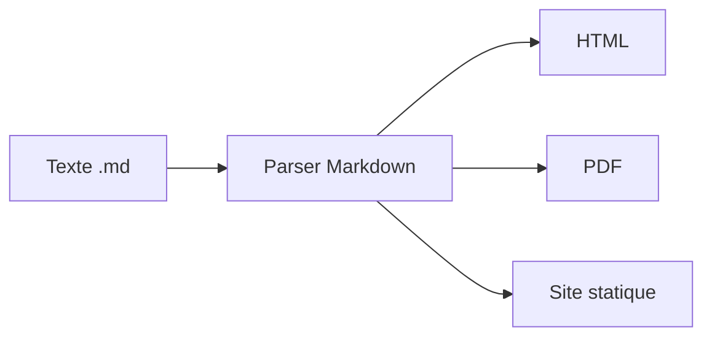
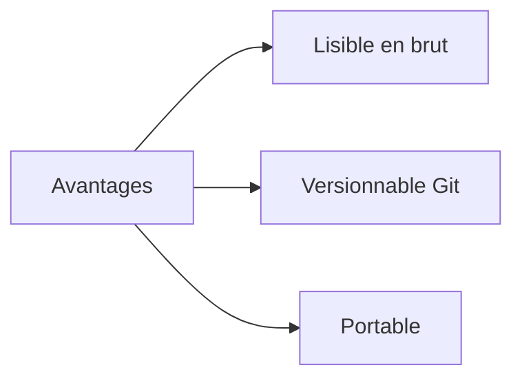
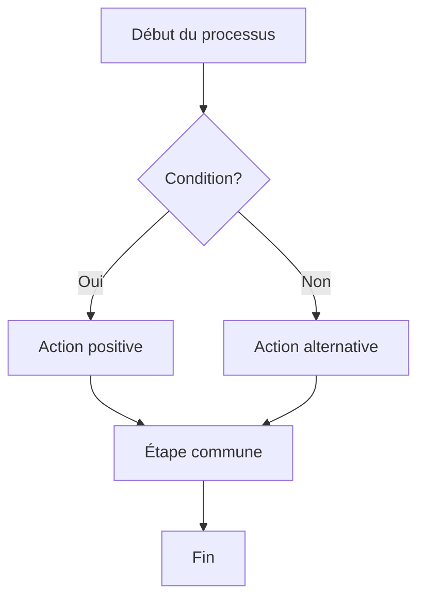
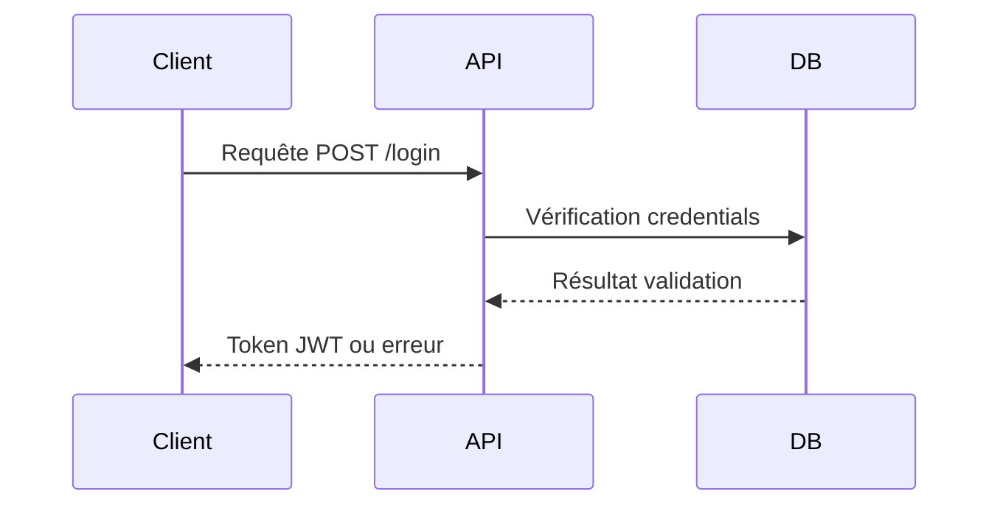
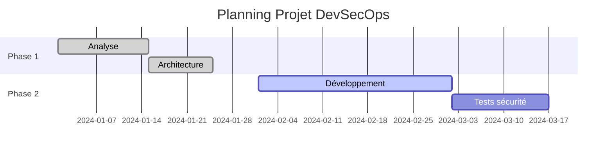
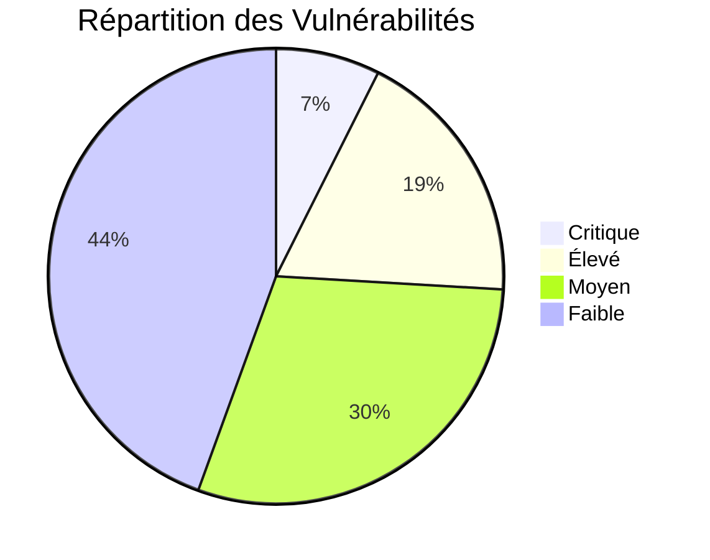
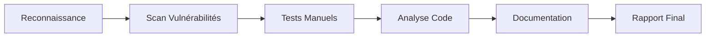
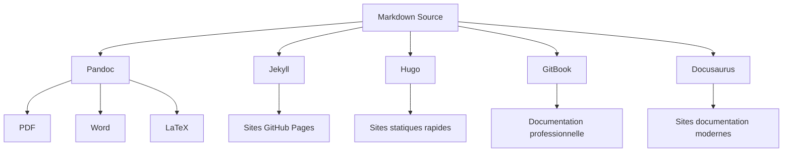
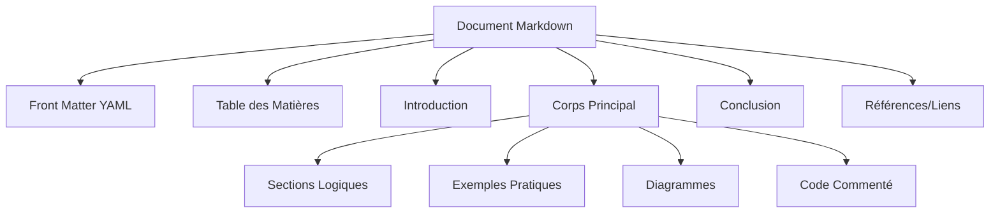
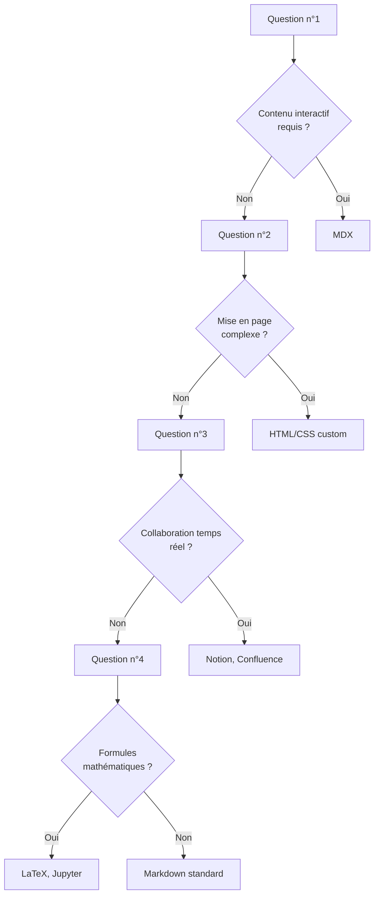

import Badge from '../../../src/components/Badge';

# Markdown

## Guide Professionnel et Structuré

:::info Objectif de cette documentation
Maîtriser de manière exhaustive et structurée la syntaxe Markdown, ses extensions spécialisées et ses applications
dans différents contexte personnel/professionnel.
:::

## 1. Fondamentaux du Markdown

### 1.1 Contexte et Définition

Markdown est un langage de balisage léger créé en **2004** par **John Gruber** pour simplifier l'écriture de contenu web.<br />
**Il convertit du texte formaté en HTML** tout en restant lisible en format brut.

#### Schéma explicatif



#### Avantage



### 1.2 Écosystème et Variantes

| Variante                  | Usage Principal       | Particularités                    |
| ------------------------- | --------------------- | --------------------------------- |
| **CommonMark**            | Standard universel    | Spécification stricte             |
| **GitHub Flavored (GFM)** | Développement         | Tableaux, tâches, mentions        |
| **MultiMarkdown**         | Documents académiques | Notes de bas de page, métadonnées |
| **Kramdown**              | Jekyll/GitHub Pages   | Attributs, extensions             |
| **MDX**                   | Documentation moderne | Composants React intégrés         |

## 2. Syntaxe Structurelle <Badge niveau="Débutant" />

### 2.1 Hiérarchie des Titres

```markdown
# Titre Principal (H1) - Un seul par document

## Section Principale (H2)

### Sous-section (H3)

#### Détail (H4)

##### Spécification (H5)

###### Note (H6)
```

**Syntaxe alternative (sous-lignage) :**

```
Titre Principal
================

Sous-titre Important
---------------------
```

:::warning Règle de hiérarchie

-   Un seul H1 par document pour le SEO
-   Ne jamais sauter de niveau (H1 → H3)
-   Utiliser la hiérarchie pour structurer logiquement le contenu
    :::

### 2.2 Formatage de Texte

```markdown
**Texte en gras** - pour l'emphase forte
_Texte en italique_ - pour l'emphase légère
`Code inline` - pour les variables, fonctions, commandes courtes
~~Texte barré~~ - pour marquer les suppressions (**GFM uniquement**)
```

**Résultat :**

-   **Texte en gras** - pour l'emphase forte
-   _Texte en italique_ - pour l'emphase légère
-   `Code inline` - pour les variables, fonctions, commandes courtes
-   ~~Texte barré~~ - pour marquer les suppressions (**GFM uniquement**)

### 2.3 Retours à la Ligne et Paragraphes

```markdown
Ligne normale de texte.

Nouveau paragraphe séparé par ligne vide.

Ligne avec deux espaces à la fin  
Force un retour à la ligne sans nouveau paragraphe.
```

## 3. Listes et Structures <Badge niveau="Débutant" />

### 3.1 Listes Non Ordonnées

```markdown
-   Élément avec tiret

*   Élément avec astérisque

*   Élément parent
    -   Sous-élément (2 espaces d'indentation)
    -   Autre sous-élément
        -   Sous-sous-élément (4 espaces d'indentation)
```

**Résultat :**

-   Élément avec tiret

*   Élément avec astérisque

*   Élément parent
    -   Sous-élément (2 espaces d'indentation)
    -   Autre sous-élément
        -   Sous-sous-élément (4 espaces d'indentation)

### 3.2 Listes Ordonnées

```markdown
1. Premier élément
2. Deuxième élément
    1. Sous-élément numéroté (3 espaces d'indentation)
    2. Autre sous-élément
3. Troisième élément

4. Alternative : utiliser toujours "1."
5. Le parser gère la numérotation automatique
6. Plus facile pour la maintenance
```

**Résultat :**

1. Premier élément
2. Deuxième élément
    1. Sous-élément numéroté (3 espaces d'indentation)
    2. Autre sous-élément
3. Troisième élément

4. Alternative : **utiliser toujours "1."**
5. **Le parser gère la numérotation automatique**
6. **Plus facile pour la maintenance**

### 3.3 Listes de Tâches <Badge niveau="Intermédiaire" />

```markdown
-   [x] Tâche terminée
-   [ ] Tâche en cours
-   [ ] Tâche à planifier
    -   [x] Sous-tâche complétée
    -   [ ] Sous-tâche en attente
```

**Résultat interactif sur GitHub :**

-   [x] Tâche terminée
-   [ ] Tâche en cours
-   [ ] Tâche à planifier

## 4. Liens et Références <Badge niveau="Débutant" />

### 4.1 Liens Inline

```markdown
[Texte descriptif](https://exemple.com)
[Lien avec titre](https://exemple.com 'Info-bulle au survol')
[Lien relatif](../dossier/fichier.md)
[Lien vers section](#section-cible)
```

### 4.2 Liens de Référence

```markdown
Texte avec [lien de référence][ref1] et [autre lien][ref2].

[ref1]: https://exemple.com 'Titre optionnel'
[ref2]: https://autre-site.com
```

### 4.3 Liens Automatiques

```markdown
<https://auto-lien.com>
<contact@entreprise.fr>
```

## 5. Images et Médias <Badge niveau="Débutant" />

### 5.1 Syntaxe de Base

```markdown


```

### 5.2 Images avec Référence

```markdown
![Logo entreprise][logo-ref]

[logo-ref]: assets/logo.png "Logo officiel de l'entreprise"
```

### 5.3 Redimensionnement Images

:::danger Important
Le markdown pur n'a pas de contrôle prévu sur la taille d'une image.
:::

```markdown


<!-- MDX/HTML : contrôle précis -->

```

:::tip
**Bonnes pratiques pour les images**

-   Toujours inclure un texte alternatif descriptif pour l'accessibilité
-   Optimiser la taille des images pour le web (WebP, compression)
-   Utiliser des chemins relatifs dans les projets
-   Prévoir des images adaptatives pour mobile

:::

## 6. Blocs de Code <Badge niveau="Intermédiaire" />

### 6.1 Code Inline

```markdown
La fonction `console.log()` affiche du texte dans la console.
Le fichier `package.json` contient les métadonnées du projet.
La commande `git status` montre l'état du repository.
```

### 6.2 Blocs de Code avec Coloration Syntaxique

#### JavaScript

````markdown
```javascript
// Fonction JavaScript avec commentaires détaillés
function calculerTotal(prix, tva = 0.2) {
    // Calcul du montant TTC
    const total = prix * (1 + tva);
    return parseFloat(total.toFixed(2));
}

// Utilisation de la fonction
const prixHT = 100;
const prixTTC = calculerTotal(prixHT);
console.log(`Prix TTC: ${prixTTC}€`);
```
````

#### Python

````markdown
```python
# Script Python pour analyse de logs
import re
from collections import Counter

def analyser_logs(fichier_log):
    """Analyse les patterns dans un fichier de log"""
    with open(fichier_log, 'r') as f:
        lignes = f.readlines()

    # Extraction des adresses IP
    pattern_ip = r'\b\d{1,3}\.\d{1,3}\.\d{1,3}\.\d{1,3}\b'
    ips = [re.findall(pattern_ip, ligne) for ligne in lignes]

    return Counter([ip for sublist in ips for ip in sublist])
```
````

#### Bash/Shell

````markdown
```bash
#!/bin/bash
# Script de déploiement automatisé avec vérifications

set -e  # Arrêt en cas d'erreur

# Variables de configuration
APP_DIR="/var/www/application"
BACKUP_DIR="/backup/$(date +%Y%m%d_%H%M%S)"

# Fonction de logging
log() {
    echo "[$(date '+%Y-%m-%d %H:%M:%S')] $1" | tee -a deploy.log
}

# Sauvegarde avant déploiement
log "Début de la sauvegarde..."
mkdir -p "$BACKUP_DIR"
cp -r "$APP_DIR" "$BACKUP_DIR/"

# Déploiement
log "Déploiement en cours..."
git pull origin main
composer install --no-dev
npm run build

log "Déploiement terminé avec succès"
```
````

### 6.3 Blocs de Code Diff <Badge niveau="Avancé" />

````markdown
```diff
// Affichage des modifications avec couleurs
function ancienneFonction() {
-   return "ancienne logique";
+   return "nouvelle logique améliorée";
}

+ // Nouvelle fonction ajoutée
+ function nouvelleFonctionnalite() {
+     return "feature implementée";
+ }

- // Fonction obsolète supprimée
- function fonctionObsolete() {
-     return "code deprecated";
- }
```
````

_Résultat visible ave **GMT**_.

**Résultat visuel :**

-   Lignes avec `+` : **vert** (ajouts)
-   Lignes avec `-` : **rouge** (suppressions)
-   Lignes normales : couleur standard

## 7. Tableaux <Badge niveau="Intermédiaire" />

### 7.1 Syntaxe de Base

```markdown
| Colonne 1 | Colonne 2 | Colonne 3 |
| --------- | --------- | --------- |
| Donnée 1  | Donnée 2  | Donnée 3  |
| Ligne 2   | Valeur 2  | Valeur 3  |
```

### 7.2 Alignement des Colonnes

```markdown
| Gauche | Centré | Droite | Auto   |
| :----- | :----: | -----: | ------ |
| Texte  | Texte  |  Texte | Texte  |
| Aligné | Aligné | Aligné | Normal |
```

**Légende des alignements :**

-   `:---` = Alignement à gauche
-   `:---:` = Alignement centré
-   `---:` = Alignement à droite
-   `---` = Alignement automatique

### 7.3 Tableaux Complexes

```markdown
| Fonctionnalité | Standard | GFM | Utilité       | Support |
| -------------- | :------: | :-: | ------------- | :-----: |
| Tableaux       |    ❌    | ✅  | Essentiel     |   95%   |
| Listes tâches  |    ❌    | ✅  | Projets       |   90%   |
| Mentions       |    ❌    | ✅  | Collaboration |   85%   |
| Émojis         |    ❌    | ✅  | Communication |   80%   |
```

:::warning Limitations des tableaux Markdown

-   Pas de fusion de cellules native
-   Pas de formatage avancé (couleurs, bordures)
-   Pour des tableaux complexes, **utiliser HTML ou des extensions**

:::

## 8. Citations et Blocs <Badge niveau="Débutant" />

### 8.1 Citations Simples

```markdown
> Citation simple sur une ligne.

> Citation qui peut s'étendre
> sur plusieurs lignes consécutives
> pour former un paragraphe complet.
```

**Résultat :**

> Citation simple sur une ligne.

> Citation qui peut s'étendre
> sur plusieurs lignes consécutives
> pour former un paragraphe complet.
> Juste pour l'exemple voici du contenu supplémentaire pour que l'affichage
> puisse se faire sur plusieurs lignes et pas qu'une seule.

### 8.2 Citations Imbriquées

```markdown
> Citation de niveau 1
>
> > Citation imbriquée de niveau 2
> >
> > > Citation de niveau 3

> Retour au niveau 1
> Continuation de la citation principale
```

**Résultat :**

> Citation de niveau 1
>
> > Citation imbriquée de niveau 2
> >
> > > Citation de niveau 3

> Retour au niveau 1<br />
> Continuation de la citation principale

### 8.3 Citations avec Formatage

````markdown
> **Citation importante** avec _emphases_ <br />
> Nouveau paragraphe dans la même citation.
>
> ```bash
> # Code dans une citation
> echo "Exemple de commande"
> ```
````

**Résultat :**

> **Citation importante** avec _emphases_ <br />
> Nouveau paragraphe dans la même citation.
>
> ```bash
> # Code dans une citation
> echo "Exemple de commande"
> ```

## 9. Extensions GitHub Flavored Markdown <Badge niveau="Avancé" />

### 9.1 Mentions et Références

```markdown
@utilisateur // Mention d'un utilisateur
@organisation/équipe // Mention d'une équipe
#123 // Référence à l'issue #123
GH-123 // Référence GitHub explicite
utilisateur/repo#123 // Référence cross-repository
```

### 9.2 Émojis

```markdown
:smile: :heart: :rocket: :warning: :heavy_check_mark:
```

**Résultat :** 😄 ❤️ 🚀 ⚠️ ✅

### 9.3 Échappement et Caractères Spéciaux

```markdown
\*Texte non italique\*
\`Code non formaté\`
\# Pas un titre
\[Pas un lien\]

<!-- Commentaire invisible dans le rendu -->
```

## 10. Diagrammes Mermaid <Badge niveau="Avancé" />

### 10.1 Diagrammes de Flux

````markdown

````

**Résultat :**


### 10.2 Diagrammes de Séquence

````markdown

````

**Résultat :**


### 10.3 Diagrammes de Gantt

````markdown

````

**Résultat :**


### 10.4 Diagramme Pie

````md

````


## 11. Conteneurs MDX <Badge niveau="Avancé" />

### 11.1 Types de Conteneurs

```markdown
:::note
Information générale ou remarque contextuelle.
:::

:::tip
Conseil pratique ou astuce pour optimiser le workflow.
:::

:::warning  
Attention particulière requise ou limitation importante.
:::

:::danger
Erreur critique à éviter absolument ou risque sécuritaire.
:::

:::info
Détail technique ou information complémentaire.
:::
```

**Résultat :**

:::note
Information générale ou remarque contextuelle.
:::

:::tip
Conseil pratique ou astuce pour optimiser le workflow.
:::

:::warning  
Attention particulière requise ou limitation importante.
:::

:::danger
Erreur critique à éviter absolument ou risque sécuritaire.
:::

:::info
Détail technique ou information complémentaire.
:::

### 11.2 Conteneurs avec Titres Personnalisés

```markdown
:::warning Sécurité Critique
Cette configuration expose des vulnérabilités.
Utilisez uniquement en environnement de test.
:::

:::tip Optimisation Performance
Utilisez la mise en cache pour améliorer les temps de réponse.
:::
```

**Résultat :**

:::warning Sécurité Critique
Cette configuration expose des vulnérabilités.
Utilisez uniquement en environnement de test.
:::

:::tip Optimisation Performance
Utilisez la mise en cache pour améliorer les temps de réponse.
:::

## 12. Métadonnées et Front Matter <Badge niveau="Avancé" />

### 12.1 YAML Front Matter

```markdown
---
title: 'Documentation Markdown'
author: 'Expert DevSecOps'
date: '2025-06-20'
tags: ['markdown', 'documentation', 'devsecops']
category: 'guide'
version: '1.0'
---

# Contenu du document commence ici
```

### 12.2 Métadonnées pour Générateurs Statiques

```yaml
---
layout: documentation
sidebar: auto
prev: /guide/introduction
next: /guide/syntaxe-avancee
editLink: true
lastUpdated: true
contributors: false
---
```

## 13. Cas d'Usage Professionnels <Badge niveau="Intermédiaire" />

### 13.1 Exemple d'une documentation API

````markdown
# API Documentation

## Authentification

### Endpoint: `POST /auth/login`

**Description :** Authentifie un utilisateur et retourne un token JWT.

**Paramètres :**
| Paramètre | Type | Requis | Description |
|-----------|------|:------:|-------------|
| `username` | string | ✅ | Nom d'utilisateur (3-50 caractères) |
| `password` | string | ✅ | Mot de passe (8+ caractères) |
| `remember` | boolean | ❌ | Session persistante (défaut: false) |

**Exemple de requête :**

```bash
curl -X POST https://api.exemple.com/auth/login \
  -H "Content-Type: application/json" \
  -d '{
    "username": "john.doe",
    "password": "motdepasse123",
    "remember": true
  }'
```
````

:::danger ATTENTION
Ici le mot de passe n'est pas du tout sécurisé, en cybersécurité, ce mot de passe pourrait-être cassé en quelques secondes à peine.
:::

**Réponse succès (200) :**

```json
{
    "status": "success",
    "data": {
        "token": "eyJhbGciOiJIUzI1NiIsInR5cCI6IkpXVCJ9...",
        "expires_in": 3600,
        "user": {
            "id": 123,
            "username": "john.doe",
            "role": "user"
        }
    }
}
```

### 13.2 README de Projet

````markdown
# Nom du Projet

[](https://travis-ci.org/user/projet)
[](https://codecov.io/gh/user/projet)
[](https://opensource.org/licenses/MIT)

## Description

Application web sécurisée développée selon les principes DevSecOps, <br />
intégrant l'authentification multi-facteurs et le chiffrement end-to-end.

## Prérequis

-   Node.js >= 18.0.0
-   Docker >= 20.10.0
-   PostgreSQL >= 13.0

## Installation Rapide

```bash
# Cloner le repository
git clone https://github.com/user/projet.git
cd projet

# Configuration environnement
cp .env.example .env
# Éditer .env avec vos paramètres

# Installation avec Docker
docker-compose up -d

# Installation manuelle
npm install
npm run migrate
npm run seed
```
````

## Sécurité

:::danger Avertissement Sécurité

-   Ne jamais commiter les fichiers **`.env`**
-   Changer les clés par défaut en production
-   Activer **HTTPS** en production

:::

## Contribution

```md
Voir [CONTRIBUTING](CONTRIBUTING.md) pour les guidelines.
```

Voir [CONTRIBUTING](CONTRIBUTING.md) pour les guidelines.

## Licence

```md
Ce projet est sous **licence MIT**.<br />
Voir [LICENSE](LICENSE) pour plus de détails.
```

Ce projet est sous **licence MIT**.<br />
Voir [LICENSE](LICENSE) pour plus de détails.

### 13.3 Rapport d'Audit de Sécurité

````markdown
# Rapport d'Audit de Sécurité

**Projet :** Application E-commerce
**Date :** 20 juin 2025
**Auditeur :** Expert Cybersécurité RNCP 36399

## Résumé Exécutif

### Niveau de Risque Global


````

| Niveau       | Nombre | Priorité | Délai de Correction |
| ------------ | :----: | :------: | :-----------------: |
| **Critique** |   2    |  🔴 P0   |       24-48h        |
| **Élevé**    |   5    |  🟠 P1   |      1 semaine      |
| **Moyen**    |   8    |  🟡 P2   |       1 mois        |
| **Faible**   |   12   |  🟢 P3   |       3 mois        |

### Recommandations Prioritaires

:::danger Vulnérabilité Critique - SQL Injection
**CVE-2023-XXXX** détectée dans le module d'authentification.<br />
**Action immédiate :** Mise à jour vers la version 2.1.4
:::

:::warning Configuration TLS/SSL
Protocoles obsolètes (**TLS 1.0/1.1**) activés.<br />
**Action :** Désactiver et forcer TLS 1.2+
:::

### Méthodologie d'Audit



## Détails Techniques

### Test d'Injection SQL

```sql
-- Payload utilisé pour la détection
'; DROP TABLE users; --
' OR '1'='1' --
' UNION SELECT password FROM admin_users --
```

**Résultat :** Vulnérabilité confirmée sur **`/login.php`**

### Configuration Sécurisée Recommandée

```apache
# Configuration Apache sécurisée
Header always set Strict-Transport-Security "max-age=31536000; includeSubDomains"
Header always set X-Content-Type-Options nosniff
Header always set X-Frame-Options DENY
Header always set X-XSS-Protection "1; mode=block"
```

## 14. Outils et Écosystème <Badge niveau="Intermédiaire" />

### 14.1 Éditeurs et IDE

| Éditeur       | Avantages                       | Extensions Recommandées           |
| ------------- | ------------------------------- | --------------------------------- |
| **VS Code**   | Gratuit, extensible             | Markdown All in One, markdownlint |
| **Notion**    | Collaboration, bases de données | -                                 |
| **Typora**    | WYSIWYG, export multi-format    | -                                 |
| **Mark Text** | Open source, temps réel         | -                                 |
| **Obsidian**  | Graphe de connaissances         | -                                 |

### 14.2 Convertisseurs et Générateurs



### 14.3 Validation et Linting

```bash
# Installation des outils de validation
npm install -g markdownlint-cli
npm install -g markdown-link-check

# Validation syntaxe
markdownlint *.md

# Vérification des liens
markdown-link-check README.md

# Configuration personnalisée (.markdownlint.json)
{
  "MD013": false,        // Désactive limite longueur ligne
  "MD033": false,        // Autorise HTML inline
  "MD041": false         // Premier titre pas forcément H1
}
```

## 15. Bonnes Pratiques et Standards <Badge niveau="Avancé" />

### 15.1 Structure de Document



### 15.2 Conventions de Nommage

| Élément          | Convention       | Exemple                             | Justification              |
| ---------------- | ---------------- | ----------------------------------- | -------------------------- |
| **Fichiers**     | kebab-case       | `guide-markdown-avance.md`          | URL friendly, lisible      |
| **Dossiers**     | kebab-case       | `assets/images/`                    | Cohérence système          |
| **Ancres**       | lowercase-dash   | `#installation-rapide`              | URLs propres               |
| **Images**       | descriptive      | `architecture-microservices.png`    | SEO, maintenance           |
| **Contantes**    | UPPER_SNAKE_CASE | `API_KEY`, `DB_HOST`                | Variables d'environnement  |
| **Variables**    | snake_case       | `first_name`, `user_age`            | Convention Python/SQL      |
| **Variables JS** | camelCase        | `firstName`, `userAge`              | Convention JavaScript      |
| **Classes**      | PascalCase       | `UserService`, `DatabaseConnection` | Convention POO universelle |

### 15.3 Checklist Qualité

:::note Checklist de Relecture

**Structure :**

-   [ ] Hiérarchie des titres respectée (H1 unique)
-   [ ] Table des matières présente si > 3 sections
-   [ ] Navigation logique entre sections

**Contenu :**

-   [ ] Exemples de code commentés et testés
-   [ ] Liens internes et externes vérifiés
-   [ ] Images avec texte alternatif descriptif
-   [ ] Terminologie cohérente dans tout le document

**Technique :**

-   [ ] Validation markdownlint passée
-   [ ] Rendu testé sur différentes plateformes
-   [ ] Métadonnées front matter complètes
-   [ ] Responsive sur mobile vérifié
        :::

### 15.4 Accessibilité

```markdown
<!-- ✅ Bon : texte alternatif descriptif -->


<!-- ❌ Mauvais : texte alternatif générique -->


<!-- ✅ Bon : lien descriptif -->

[Consulter la documentation officielle de Docker](https://docs.docker.com)

<!-- ❌ Mauvais : lien non descriptif -->

[Cliquez ici](https://docs.docker.com)
```

## 16. Limites et Alternatives <Badge niveau="Avancé" />

### 16.1 Limitations du Markdown Standard

| Limitation                 | Impact                        | Solutions               |
| -------------------------- | ----------------------------- | ----------------------- |
| **Tableaux complexes**     | Pas de fusion cellules        | HTML inline, extensions |
| **Mise en page avancée**   | Colonnes, grilles impossibles | CSS Grid, Flexbox       |
| **Interactivité**          | Contenu statique uniquement   | MDX, composants React   |
| **Formules mathématiques** | Pas de support natif          | KaTeX, MathJax          |
| **Annotations**            | Pas de notes marginales       | Extensions spécialisées |

### 16.2 Quand Choisir une Alternative

#### Décision sur le Choix du Format de la Documentation



### 16.3 Évolutions et Tendances

| Technologie          |   Statut    | Avantages                 | Cas d'usage               |
| -------------------- | :---------: | ------------------------- | ------------------------- |
| **MDX**              |   Mature    | Composants React          | Documentation interactive |
| **CommonMark**       |  Standard   | Compatibilité universelle | Documentation technique   |
| **AsciiDoc**         | Alternative | Fonctionnalités avancées  | Livres, manuels           |
| **reStructuredText** |    Niche    | Puissant pour Python      | Documentation Sphinx      |

## 17. Référence Rapide

### 17.1 Aide-Mémoire Syntaxe

```markdown
# Titre 1 → <h1>

## Titre 2 → <h2>

**Gras** → <strong>
_Italique_ → <em>
`Code` → <code>
~~Barré~~ → <del>
[Lien](url) → <a href="url">
 → 

-   Liste → <ul><li>

1. Numérotée → <ol><li>
    > Citation → <blockquote>
    > --- → <hr>
    > | Table | Header | → <table>
```

### 17.2 Raccourcis Clavier Éditeurs

| Action       | VS Code         | Typora          | Obsidian |
| ------------ | --------------- | --------------- | -------- |
| **Gras**     | `Ctrl+B`        | `Ctrl+B`        | `Ctrl+B` |
| **Italique** | `Ctrl+I`        | `Ctrl+I`        | `Ctrl+I` |
| **Code**     | `Ctrl+Shift+\`` | `Ctrl+Shift+\`` | `Ctrl+E` |
| **Lien**     | `Ctrl+K`        | `Ctrl+K`        | `Ctrl+K` |
| **Préview**  | `Ctrl+Shift+V`  | `Ctrl+/`        | `Ctrl+E` |

### 17.3 Extensions de Fichier

| Extension   | Usage             | Processeur   |
| ----------- | ----------------- | ------------ |
| `.md`       | Markdown standard | Tous         |
| `.markdown` | Markdown verbeux  | Tous         |
| `.mdx`      | Markdown + JSX    | MDX, Next.js |
| `.Rmd`      | R Markdown        | R Studio     |
| `.qmd`      | Quarto Markdown   | Quarto       |

## 18. Ressources et Références

### 18.1 Spécifications Officielles

-   [CommonMark Spec](https://commonmark.org/) - Standard universel
-   [GitHub Flavored Markdown](https://github.github.com/gfm/) - Extensions GitHub
-   [MDX Documentation](https://mdxjs.com/) - Markdown + React
-   [Mermaid Docs](https://mermaid-js.github.io/) - Diagrammes

### 18.2 Outils de Test et Validation

```bash
# Installation outils recommandés
npm install -g markdownlint-cli markdown-link-check
pip install markdown-include

# Tests automatisés
markdownlint **/*.md
markdown-link-check **/*.md
```

### 18.3 Communautés et Support

| Ressource              | Type       | URL                    |
| ---------------------- | ---------- | ---------------------- |
| **Stack Overflow**     | Q&A        | `[markdown]` tag       |
| **Reddit**             | Discussion | `/r/Markdown`          |
| **GitHub Discussions** | Support    | Repositories concernés |
| **Discord DevSecOps**  | Temps réel | Serveurs spécialisés   |

:::info Conclusion Stratégique
Cette documentation couvre exhaustivement Markdown depuis les bases jusqu'aux applications professionnelles avancées.<br />
Chaque section est conçue pour une application immédiate dans vos projets DevSecOps.

:::

:::tip Points clés à retenir

-   Markdown reste l'outil de référence pour la documentation technique
-   Les extensions (GFM, MDX) étendent considérablement les possibilités
-   L'intégration avec les outils DevSecOps (Git, CI/CD, monitoring) est native
-   La courbe d'apprentissage permet une productivité immédiate

:::

:::note Prochaines étapes recommandées

1. Pratiquer avec vos projets actuels
2. Intégrer dans votre workflow de documentation
3. Explorer MDX pour les besoins interactifs
4. Automatiser la validation dans vos pipelines CI/CD

:::

<br />

---

**Métadonnées du Document**

-   **Version :** 2.0
-   **Dernière mise à jour :** juin 2025
-   **Niveau :** Débutant à Avancé
-   **Durée de lecture :** 45-60 minutes
-   **Applicabilité :** Immédiate
-   **Licence:** Documentation libre d'utilisation
