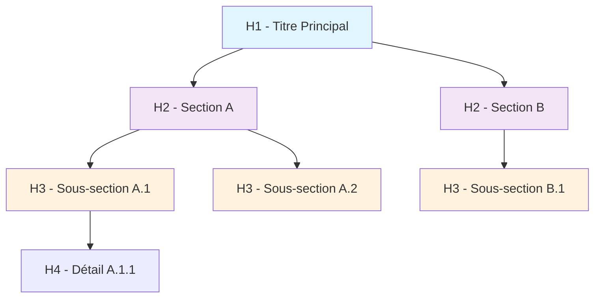
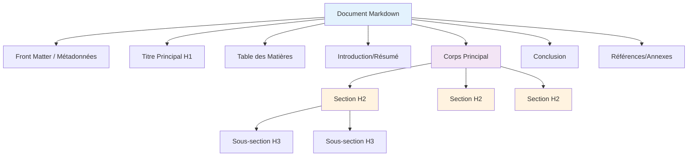

import Badge from '../../../../src/components/Badge';
import Tabs from '@theme/Tabs';
import TabItem from '@theme/TabItem';

# Markdown : Fondamentaux

:::note
**Temps de lecture :** 30 minutes  
**Objectif :** Maîtriser les bases essentielles pour être immédiatement opérationnel
:::

## 1. Syntaxe de Base <Badge niveau="Débutant" />

### 1.1 Titres et Hiérarchie

Les titres structurent votre document et créent une hiérarchie logique. Markdown supporte 6 niveaux de titres.

:::warning Règles Importantes

-   **Un seul H1 par document** pour le SEO et l'accessibilité
-   **Respecter la hiérarchie** : ne jamais sauter de niveau (H1 → H3)
-   **Espace obligatoire** après le `#` : `# Titre` ✅ `#Titre` ❌ _La mise en forme ne sera pas appliquée_

:::

<Tabs>
<TabItem value="syntaxe" label="Syntaxe">

```markdown
# Titre Principal (H1) - Un seul par document

## Section Importante (H2)

### Sous-section (H3)

#### Détail Spécifique (H4)

##### Information Complémentaire (H5)

###### Note Technique (H6)
```

</TabItem>
<TabItem value="resultat" label="Résultat">

# Titre Principal (H1)

## Section Importante (H2)

### Sous-section (H3)

#### Détail Spécifique (H4)

##### Information Complémentaire (H5)

###### Note Technique (H6)

</TabItem>
<TabItem value="schema" label="Schéma Explicatif">
#### Schéma pour mieux comprendre la hiérarchie des titres



</TabItem>
</Tabs>

### 1.2 Formatage de Texte

Le formatage de texte permet d'ajouter de l'emphase et de la structure visuelle à votre contenu.

:::tip Bonnes Pratiques

-   **Gras** : Pour les termes importants, alertes, étapes cruciales
-   **Italique** : Pour l'emphase légère, définitions, notes
-   **Code inline** : Variables, noms de fichiers, commandes courtes
-   **Barré** : Marquer des éléments obsolètes ou supprimés

:::

<Tabs>
<TabItem value="syntaxe" label="Syntaxes Disponibles">

```markdown
**Texte en gras** <!-- ou bien  __texte en gras__ -->
_Texte en italique_ <!-- ou bien  *texte en italique* -->
**_Texte en gras ET italique_**
~~Texte barré~~ (GitHub Flavored Markdown)
`Code inline` pour variables, fonctions, commandes
```

</TabItem>
<TabItem value="resultat" label="Rendu Visuel">

**Texte en gras** ou **texte en gras**  
_Texte en italique_ ou _texte en italique_  
**_Texte en gras ET italique_**  
~~Texte barré~~  
`Code inline` pour variables, fonctions, commandes

</TabItem>
<TabItem value="usage" label="Cas d'Usage">

<section style={{ 
    display: 'flex',
    gap: '20px',
    justifyContent: 'flex-start',
}}>
<div class="left">
```markdown
**Important :** Configuration critique du serveur
```
</div>

    <div class="right" style={{ width: '100%', display: 'flex', alignItems: 'center', justifyContent: 'center'}}>
    **Important :** Configuration critique du serveur
    </div>

</section>

<section style={{ 
    display: 'flex',
    gap: '20px',
    justifyContent: 'flex-start',
}}>
<div class="left">
```markdown
_Note :_ Vérifier la version avant mise à jour
```
</div>

    <div class="right" style={{ width: '100%', display: 'flex', alignItems: 'center', justifyContent: 'center'}}>
    _Note :_ Vérifier la version avant mise à jour
    </div>

</section>

<section style={{ 
    display: 'flex',
    gap: '20px',
    justifyContent: 'flex-start',
}}>
<div class="left">
```markdown
La variable `API_KEY` doit être configurée
```
</div>

    <div class="right" style={{ width: '100%', display: 'flex', alignItems: 'center', justifyContent: 'center'}}>
    La variable `API_KEY` doit être configurée
    </div>

</section>

<section style={{ 
    display: 'flex',
    gap: '20px',
    justifyContent: 'flex-start',
}}>
<div class="left">
```markdown
~~Ancienne méthode~~ Nouvelle approche recommandée
```
</div>

    <div class="right" style={{ width: '100%', display: 'flex', alignItems: 'center', justifyContent: 'center'}}>
    ~~Ancienne méthode~~ Nouvelle approche recommandée
    </div>

</section>

</TabItem>
</Tabs>

### 1.3 Retours à la Ligne et Paragraphes

La gestion des espaces et des retours à la ligne suit des règles précises en Markdown.

<Tabs>
<TabItem value="regles" label="Règles Fondamentales">

```markdown
Première ligne d'un paragraphe.
Deuxième ligne du même paragraphe (collée).

Nouveau paragraphe séparé par une ligne vide.

Ligne avec deux espaces à la fin  
Force un retour à la ligne sans nouveau paragraphe.

Ligne normale sans espaces
Suite sur la même ligne (collée).
```

</TabItem>
<TabItem value="rendu" label="Rendu">

Première ligne d'un paragraphe.
Deuxième ligne du même paragraphe (collée).

Nouveau paragraphe séparé par une ligne vide.

Ligne avec deux espaces à la fin  
Force un retour à la ligne sans nouveau paragraphe.

Ligne normale sans espaces
Suite sur la même ligne (collée).

</TabItem>
<TabItem value="schema" label="Schéma Explicatif">
```mermaid
flowchart TD
    A["Texte écrit"] --> B{"Une ligne vide ?"}
    B -->|Oui| C["Nouveau paragraphe"]
    B -->|Non| D{"Deux espaces en fin ?"}
    D -->|Oui| E["Retour à la ligne<br/>(même paragraphe)"]
    D -->|Non| F["Continuation<br/>(même ligne)"]

    style C fill:#c8e6c9
    style E fill:#fff3c4
    style F fill:#ffcdd2

````
</TabItem>
</Tabs>

## 2. Listes et Structures <Badge niveau="Débutant" />

### 2.1 Listes Non Ordonnées

Les listes à puces permettent d'organiser des informations sans notion d'ordre.

:::warning Indentation Importante

-   **2 espaces** pour chaque niveau d'indentation
-   **Cohérence** : utiliser le même symbole ( -, \* ) dans tout le document
-   **Espaces après le symbole** : `- Élément` ✅ `-Élément` ❌

:::

<Tabs>
<TabItem value="syntaxe" label="Syntaxe de Base">

```markdown
-   Premier élément avec tiret

*   Deuxième élément avec astérisque

-   Élément parent
    -   Sous-élément (2 espaces d'indentation)
    -   Autre sous-élément
        -   Sous-sous-élément (4 espaces)
            -   Niveau 4 (6 espaces)
````

</TabItem>
<TabItem value="resultat" label="Résultat">

-   Premier élément avec tiret

*   Deuxième élément avec astérisque

-   Élément parent
    -   Sous-élément (2 espaces d'indentation)
    -   Autre sous-élément
        -   Sous-sous-élément (4 espaces)
            -   Niveau 4 (6 espaces)

</TabItem>
<TabItem value="exemple" label="Exemple Pratique - Liste d'un déploiement">

```markdown
## Liste d'un déploiement

-   **Préparation**

    -   Vérifier les tests unitaires
    -   Valider les tests d'intégration
    -   Confirmer l'environnement cible

-   **Déploiement**

    -   Créer une sauvegarde
    -   Lancer le script de déploiement
    -   Vérifier les logs

-   **Validation**

    -   Tester les fonctionnalités critiques
    -   Monitorer les métriques
    -   Valider avec l'équipe QA
```

</TabItem>
</Tabs>

### 2.2 Listes Ordonnées

Les listes numérotées indiquent un ordre ou une séquence.

<Tabs>
<TabItem value="syntaxe" label="Syntaxe">

```markdown
1. Premier élément
2. Deuxième élément
3. Troisième élément
    1. Sous-élément numéroté (3 espaces)
    2. Autre sous-élément
4. Quatrième élément

5. Alternative : utiliser toujours "1."
6. Le parser gère la numérotation automatique
7. Plus facile pour la maintenance
8. Réorganisation sans renuméroter
```

</TabItem>
<TabItem value="resultat" label="Résultat">

1. Premier élément
2. Deuxième élément
3. Troisième élément
    1. Sous-élément numéroté (3 espaces)
    2. Autre sous-élément
4. Quatrième élément

**Avec numérotation automatique :**

1. Alternative : utiliser toujours "1."
1. Le parser gère la numérotation automatique
1. Plus facile pour la maintenance
1. Réorganisation sans renuméroter

</TabItem>
<TabItem value="procedure" label="Exemple Pratique - Procédure DevSecOps">

```markdown
## Processus de Review Code

1. **Développement**

    1. Créer une branche feature
    2. Implémenter les modifications
    3. Ajouter/modifier les tests
    4. Exécuter les tests localement

2. **Security Check**

    1. Scanner avec SonarQube
    2. Vérifier les dépendances (npm audit)
    3. Valider les secrets (git-secrets)

3. **Pull Request**

    1. Créer la PR avec template
    2. Assigner les reviewers
    3. Répondre aux commentaires
    4. Merger après approbation
```

</TabItem>
</Tabs>

### 2.3 Listes de Tâches <Badge niveau="Intermédiaire" />

Les listes de tâches ( **checkboxes** ) permettent de suivre l'avancement de projets.

:::info GitHub Integration
Sur GitHub, les checkboxes sont **interactives**.<br />
Cliquer dessus modifie automatiquement le fichier et crée un commit. **Parfait pour le suivi de projet !**
:::

<Tabs>
<TabItem value="syntaxe" label="Syntaxe GFM">

<section style={{ 
    display: 'flex',
    gap: '20px',
    justifyContent: 'flex-start',
}}>
<div class="left">

```markdown
**Tâche à faire**

-   [x] Tâche terminée
-   [ ] Tâche en cours
-   [x] Tâche à planifier
    -   [x] Sous-tâche complétée
    -   [ ] Sous-tâche en attente
    -   [ ] Sous-tâche future
```

</div>

    <div class="right" style={{ display: 'flex', flexDirection: 'column', justifyContent: 'flex-start'}}>

```markdown
**Sprint Planning**

-   [x] Définir les user stories
-   [x] Estimer la complexité
-   [ ] Planifier les sprints
-   [ ] Assigner les tâches
    -   [x] Front-end team
    -   [ ] Back-end team
    -   [ ] DevOps team
```

    </div>

</section>

</TabItem>
<TabItem value="resultat" label="Résultat Interactif">
<section style={{ 
    display: 'flex',
    gap: '20px',
    justifyContent: 'flex-start',
}}>
<div class="left">

**Tâche à faire**

-   [x] Tâche terminée
-   [ ] Tâche en cours
-   [x] Tâche à planifier
    -   [x] Sous-tâche complétée
    -   [ ] Sous-tâche en attente
    -   [ ] Sous-tâche future

</div>

    <div class="right" style={{ display: 'flex', flexDirection: 'column', justifyContent: 'flex-start'}}>

**Sprint Planning**

-   [x] Définir les user stories
-   [x] Estimer la complexité
-   [ ] Planifier les sprints
-   [ ] Assigner les tâches
    -   [x] Front-end team
    -   [ ] Back-end team
    -   [ ] DevOps team

</div>
</section>
    </TabItem>
</Tabs>

## 3. Liens et Navigation <Badge niveau="Débutant" />

### 3.1 Liens Simples

Les liens permettent de naviguer entre documents et vers des ressources externes.

<Tabs>
<TabItem value="syntaxes" label="Types de Liens">

```markdown
## Liens Inline

[Texte descriptif](https://exemple.com)
[Lien avec titre](https://exemple.com 'Info-bulle au survol')
[Documentation officielle](https://docs.exemple.com)

## Liens Relatifs (dans le projet)

[Fichier dans même dossier](autre-page.md)
[Fichier dans sous-dossier](docs/guide.md)
[Retour au dossier parent](../index.md)

## Liens vers Sections

[Aller à la section syntaxe](#syntaxe-de-base)
[Voir les exercices](#exercices-pratiques)

## Liens Automatiques

<https://auto-lien.com>
<contact@entreprise.fr>
```

</TabItem>
<TabItem value="reference" label="Liens de Référence">

```markdown
## Définition des Références

Texte avec [lien de référence][ref1] et [autre lien][ref2].
Consulter la [documentation officielle][docs] pour plus d'infos.

Autre paragraphe avec [même référence][ref1] réutilisée.

## Définitions (à la fin du document)

[ref1]: https://exemple.com 'Titre optionnel'
[ref2]: https://autre-site.com
[docs]: https://docs.exemple.com 'Documentation officielle'
```

**Avantages :**

-   Sépare le contenu des URLs
-   Améliore la lisibilité du source
-   Réutilisation facile des liens
-   Maintenance centralisée

</TabItem>
<TabItem value="schema" label="Schéma Explicatif">
```mermaid
graph LR
    A[Texte Markdown] --> B{Type de lien ?}
    B --> C["Inline: [texte]\(url\)"]
    B --> D["Référence: [texte][ref]"]
    B --> E["Auto: &lt;url&gt;"]
    B --> F["Interne: [texte]\(#ancre\)"]

    D --> G["Définition: [ref]: url"]

    style C fill:#c8e6c9
    style D fill:#fff3c4
    style E fill:#ffccbc
    style F fill:#e1bee7

````

</TabItem>
</Tabs>

### 3.2 Images et Médias

L'insertion d'images suit une syntaxe similaire aux liens, avec un `!` en préfixe.

:::warning Accessibilité Critique
Le **texte alternatif** est essentiel pour :

-   Les lecteurs d'écran (accessibilité)
-   Le SEO (référencement)
-   L'affichage si l'image ne charge pas
-   La compréhension du contexte

:::

<Tabs>
<TabItem value="syntaxe" label="Syntaxe de Base">

```markdown
## Images Simples


## Images avec Lien

[](https://destination.com)

## Images Référencées

![Description de l'architecture][archi-img]

[archi-img]: assets/architecture-microservices.png 'Architecture détaillée'
````

</TabItem>
<TabItem value="html" label="Contrôle Avancé (HTML)">

```html
<!-- Redimensionnement précis -->


<!-- Image responsive -->


<!-- Image avec légende -->
<figure>
    
    <figcaption>Figure 1: Architecture du système</figcaption>
</figure>
```

</TabItem>
<TabItem value="bonnes-pratiques" label="Bonnes Pratiques">

:::tip Exemples Corrects

```markdown


```

:::

:::danger Exemples à Éviter

```markdown


```

:::

**Checklist Images :**

-   ✅ Texte alternatif descriptif et précis
-   ✅ Noms de fichiers explicites
-   ✅ Formats optimisés (WebP, JPEG, PNG)
-   ✅ Taille appropriée pour le web
-   ✅ Chemins relatifs dans les projets

</TabItem>
</Tabs>

### 3.3 Navigation Interne

La navigation interne améliore l'expérience utilisateur dans les documents longs.

**Règles de conversion automatique :**

-   Espaces → tirets (`-`)
-   Majuscules → minuscules
-   Caractères spéciaux supprimés
-   Accents conservés en URL-encoding

<Tabs>
<TabItem value="ancres" label="Ancres Automatiques">

```markdown
## Table des Matières

-   [Introduction](#introduction)
-   [Installation](#installation-et-configuration)
-   [Configuration Avancée](#configuration-avancée)
-   [Troubleshooting](#résolution-de-problèmes)

## Introduction

Contenu de l'introduction...

## Installation et Configuration

Guide d'installation...

## Configuration Avancée

Paramètres experts...

## Résolution de Problèmes

Solutions aux problèmes courants...
```

</TabItem>
<TabItem value="toc" label="Table des Matières Avancée">

```markdown
## 📋 Sommaire

1. **[Préparation](#1-préparation)**

    - [Prérequis système](#prérequis-système)
    - [Installation des outils](#installation-des-outils)

2. **[Configuration](#2-configuration)**

    - [Environnement de développement](#environnement-de-développement)
    - [Variables d'environnement](#variables-denvironnement)

3. **[Déploiement](#3-déploiement)**

    - [Pipeline CI/CD](#pipeline-cicd)
    - [Monitoring](#monitoring-et-logs)

4. **[Maintenance](#4-maintenance)**
    - [Mises à jour](#mises-à-jour-sécurisées)
    - [Sauvegarde](#stratégie-de-sauvegarde)

## 1 - Préparation

### Prérequis Système

### Installation des outils

## 2 - Configuration

### Environnement de Développement

### Variables d'environnement

## 3 - Déploiement

### Pipeline CI/CD

### Monitoring et Logs

## 4 - Maintenance

### Mises à Jour Sécurisées

### Stratégie de sauvegarde
```

</TabItem>
</Tabs>

## 4. Structure de Document <Badge niveau="Intermédiaire" />

### 4.1 Organisation Logique

Un document bien structuré facilite la lecture et la maintenance.



<Tabs>
<TabItem value="template" label="Template Standard">

```markdown
---
title: "Guide d'Installation API"
author: 'Équipe DevSecOps'
date: '2025-06-20'
version: '2.1'
---

# Guide d'Installation API

## Résumé Exécutif

Brève description du document et de ses objectifs.

## Table des Matières

-   [Prérequis](#prérequis)
-   [Installation](#installation)
-   [Configuration](#configuration)
-   [Tests](#tests-et-validation)
-   [Déploiement](#déploiement)

## Prérequis

Liste des éléments nécessaires...

## Installation

Étapes détaillées d'installation...

## Configuration

Paramètres de configuration...

## Tests et Validation

Procédures de vérification...

## Déploiement

Guide de mise en production...

## Références

-   [Documentation officielle](https://docs.api.com)
-   [Repository GitHub](https://github.com/team/api)
```

</TabItem>
<TabItem value="README" label="Structure README">

````markdown
# Nom du Projet

[](https://travis-ci.org/user/projet)
[](https://codecov.io/gh/user/projet)
[](https://opensource.org/licenses/MIT)

## Description

Une phrase claire et concise décrivant le projet.

## Fonctionnalités Principales

-   Authentification sécurisée
-   API RESTful complète
-   Interface d'administration
-   Monitoring temps réel

## Installation Rapide

```bash
git clone https://github.com/user/projet.git
cd projet
npm install
npm start
```
````

```

## Documentation

-   [Guide d'installation détaillé](docs/installation.md)
-   [Documentation API](docs/api.md)
-   [Guide contributeur](CONTRIBUTING.md)

## Licence

Ce projet est sous licence MIT - voir [LICENSE](LICENSE) pour détails.

```

</TabItem>
</Tabs>

### 4.2 Citations et Blocs

Les citations permettent de mettre en évidence du contenu externe ou des remarques importantes.

<Tabs>
<TabItem value="simples" label="Citations Simples">

```markdown
> Ceci est une citation simple.
> Elle peut s'étendre sur plusieurs lignes
> pour former un paragraphe complet.

> Citation avec **formatage en gras** et _italique_.
>
> Nouveau paragraphe dans la même citation.
```

**Résultat :**

> Ceci est une citation simple.
> Elle peut s'étendre sur plusieurs lignes
> pour former un paragraphe complet.

> Citation avec **formatage en gras** et _italique_.
>
> Nouveau paragraphe dans la même citation.

</TabItem>
<TabItem value="imbriquees" label="Citations Imbriquées">

```markdown
> Citation de niveau 1
>
> > Citation imbriquée de niveau 2
> >
> > > Citation de niveau 3

> Retour au niveau 1
>
> Nouveau paragraphe au niveau 1
>
> > Retour au niveau 2
```

**Résultat :**

> Citation de niveau 1
>
> > Citation imbriquée de niveau 2
> >
> > > Citation de niveau 3

> Retour au niveau 1
>
> Nouveau paragraphe au niveau 1
>
> > Retour au niveau 2

</TabItem>
<TabItem value="complexes" label="Citations Complexes">

````markdown
> ## Citation avec Titre
>
> Cette citation contient **plusieurs éléments** :
>
> 1. Une liste ordonnée
> 2. Du `code inline`
> 3. Un exemple de code :
>
> ```bash
> echo "Code dans une citation"
> ```
>
> **Source :** Documentation officielle

> ### Exemple de Review Code
>
> ```diff
> function login(user, password) {
> -   if (password == user.password) {
> +   if (bcrypt.compare(password, user.hashedPassword)) {
>       return true;
>     }
>     return false;
> }
> ```
>
> **Commentaire :** Utiliser bcrypt pour comparer les mots de passe.
````

</TabItem>
</Tabs>

### 4.3 Séparateurs et Espacement

Les séparateurs aident à organiser visuellement le contenu.

<Tabs>
<TabItem value="horizontaux" label="Lignes Horizontales">

```
Section 1 du document avec du contenu important.

---

Section 2 séparée par une ligne horizontale.

***

Section 3 avec une autre syntaxe de séparateur.

___

Section 4 avec la troisième syntaxe possible.

<hr />
```

**Résultat :**

Section 1 du document avec du contenu important.

---

Section 2 séparée par une ligne horizontale.

---

Section 3 avec une autre syntaxe de séparateur.

---

Section 4 avec la troisième syntaxe possible.

<hr />

</TabItem>
<TabItem value="espacement" label="Gestion des Espaces">

```markdown
## Espacement Correct

Paragraphe avec un espacement normal.

Un seul retour à la ligne crée un nouveau paragraphe.

Plusieurs lignes vides sont réduites à une seule.

### Usage Professionnel

**Avant une section importante :** Une ligne vide
**Entre paragraphes :** Une ligne vide
**Avant/après code :** Une ligne vide
**Avant/après tableaux :** Une ligne vide

### À Éviter
```

Trop d'espaces entre sections

```

**Bonne pratique :** Espacement consistant et logique.
```

</TabItem>
</Tabs>

:::note
Il également tout a fait possible d'utiliser le tag auto-fermant `<br />` pour sauter une ligne.
:::

## 5. Exercices Pratiques <Badge niveau="Débutant" />

Mettons en pratique les concepts appris avec des exercices concrets.

### Exercice 1 : Créer un README Simple

:::note Énoncé
Créez un README pour un projet fictif "**API Gestion Utilisateurs**" incluant :

-   Titre principal et description
-   Liste des fonctionnalités (3 minimum)
-   Instructions d'installation (liste ordonnée)
-   Information de contact avec lien email
-   Section contribution avec lien vers un fichier

:::

<Tabs>
<TabItem value="enonce" label="À Vous de Jouer">

Créez votre README en respectant ces contraintes :

-   [ ] Un seul titre H1
-   [ ] Utiliser gras et italique de manière appropriée
-   [ ] Au moins une liste non ordonnée et une ordonnée
-   [ ] Un lien externe et un lien interne
-   [ ] Une ligne de séparation avant les contacts

</TabItem>
<TabItem value="solution" label="Solution Proposée">

```markdown
# API Gestion Utilisateurs

Application **Node.js** pour la gestion sécurisée des utilisateurs avec authentification _JWT_ et _hachage bcrypt_.

## Fonctionnalités

-   Création et modification de profils utilisateur
-   Authentification sécurisée avec tokens JWT
-   Gestion des rôles et permissions
-   Logs d'audit complets
-   API RESTful documentée

## Installation

1. Cloner le repository
2. Installer les dépendances avec `npm install`
3. Configurer les variables d'environnement
4. Lancer les migrations de base de données s'il y en a (_dépends des technologies employées_)
5. Démarrer l'application avec `npm start`

## API Documentation

Consultez la [documentation complète](docs/api.md) pour utiliser les endpoints.

---

## Contact et Contribution

**Questions :** <dev-team@entreprise.com>
**Contributions :** Voir le [guide contributeur](CONTRIBUTING.md)
```

</TabItem>
<TabItem value="analyse" label="Points Clés">

:::tip Elements bien utilisés

-   ✅ Un seul H1 clair et descriptif
-   ✅ Formatage approprié (**gras**/_italique_)
-   ✅ Listes structurées et logiques
-   ✅ Liens internes et externes
-   ✅ Séparateur avant la section contact
-   ✅ Email avec syntaxe automatique

:::

:::note Améliorations possibles

-   Ajouter des badges de status
-   Inclure une section prérequis
-   Ajouter des exemples d'usage

:::

</TabItem>
</Tabs>

### Exercice 2 : Document Structuré avec Navigation

:::note Énoncé
Créez un guide de sécurité incluant :

-   Table des matières avec liens internes
-   3 sections principales avec sous-sections
-   Citations avec différentes sources
-   Liste de tâches pour audit sécurité
-   Images avec texte alternatif approprié

:::

<Tabs>
<TabItem value="exercice" label="Votre Mission">

Structurez un document "**Guide Sécurité API**" avec :

**Navigation :**

-   Table des matières cliquable
-   Ancres vers chaque section

**Contenu :**

-   Section "Authentification" avec 2 sous-sections
-   Section "Autorisation" avec listes de tâches
-   Section "Monitoring" avec citations et images

**Formatage :**

-   Citations d'experts ou documentation
-   Listes de vérification sécuritaire
-   Images d'architecture ou de dashboard

</TabItem>
<TabItem value="solution" label="Solution Proposée">

```markdown
# Guide Sécurité API

Guide complet pour sécuriser vos APIs en production.

## Table des Matières

1. [Authentification](#authentification)
    - [JWT et Sessions](#jwt-et-sessions)
    - [Multi-facteur](#authentification-multi-facteur)
2. [Autorisation](#autorisation)
3. [Monitoring](#monitoring-et-audit)

## Authentification

### JWT et Sessions

L'authentification par **JWT** (JSON Web Tokens) offre une solution _stateless_ sécurisée.

> Les tokens JWT doivent toujours être signés et avoir une durée de vie limitée.
>
> **Source :** OWASP API Security Guidelines

Configuration recommandée :

-   Expiration : 15 minutes pour access token
-   Refresh token : 7 jours maximum
-   Algorithme : RS256 (asymétrique)

### Authentification Multi-facteur

Checklist implémentation 2FA :

-   [x] SMS ou TOTP configuré
-   [x] Backup codes générés
-   [ ] Vérification obligatoire pour actions sensibles
-   [ ] Logs des tentatives d'authentification
-   [ ] Rate limiting sur les tentatives

## Autorisation

Gestion des permissions par rôles :

1. **Définir les rôles** (admin, user, guest)
2. **Mapper les permissions** par endpoint
3. **Valider à chaque requête**
4. **Logger les accès refusés**

## Monitoring et Audit


> Un système de monitoring efficace détecte 95% des attaques en moins de 10 minutes.
>
> **Source :** Étude Verizon Data Breach 2024

### Métriques Essentielles

-   Taux d'erreur 401/403
-   Tentatives de brute force
-   Patterns d'accès anormaux
-   Latence des endpoints sensibles
```

</TabItem>
<TabItem value="evaluation" label="Évaluation">

:::tip Points forts de cette solution

-   ✅ **Structure claire** avec navigation fonctionnelle
-   ✅ **Hiérarchie respectée** (H1 → H2 → H3)
-   ✅ **Formatage varié** (gras, italique, code)
-   ✅ **Citations avec sources** crédibles
-   ✅ **Listes mixtes** (tâches + numérotées)
-   ✅ **Image descriptive** avec alt text professionnel

**Score :** 18/20

:::

:::note Axes d'amélioration

-   Ajouter liens externes vers documentation
-   Inclure exemples de code pratiques

:::

</TabItem>
</Tabs>

---

## Points Clés à Retenir

### Récapitulatif Fondamentaux

**Maîtrisé après cette section :**

-   ✅ Hiérarchie des titres et organisation logique
-   ✅ Formatage de texte pour l'emphase appropriée
-   ✅ Listes (puces, numérotées, tâches) avec imbrication
-   ✅ Liens internes/externes et gestion des images
-   ✅ Structure de document professionnel
-   ✅ Citations et séparateurs pour la lisibilité

## Prochaine Étape

Vous maîtrisez maintenant les **fondamentaux** !

Direction le **[niveau intermédiaire](02-intermediaire.md)** pour découvrir :

-   Tableaux complexes et données structurées
-   Blocs de code avec coloration syntaxique
-   Extensions GitHub Flavored Markdown
-   Automatisation et workflow de documentation

---

:::info Métadonnées du Document

-   **Version :** 1.0
-   **Dernière mise à jour :** Juin 2025
-   **Niveau :** <Badge niveau="Débutant" />
-   **Durée :** 30 minutes
-   **Prérequis :** Aucun
-   **Objectif :** Bases solides pour usage professionnel

:::
