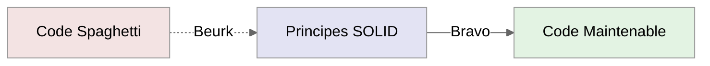
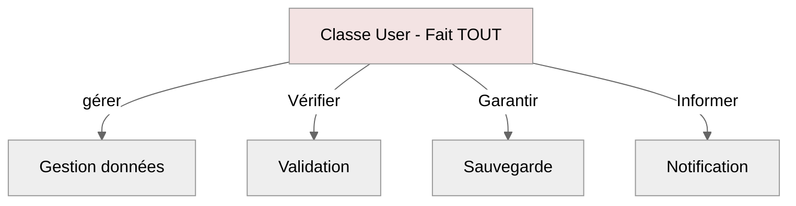
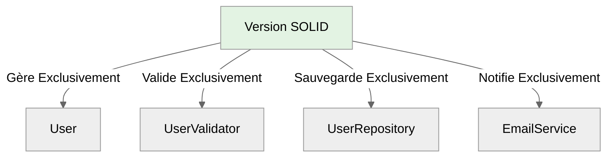
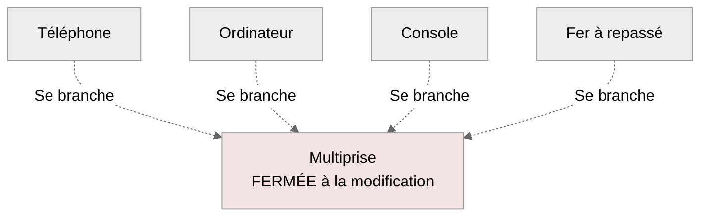
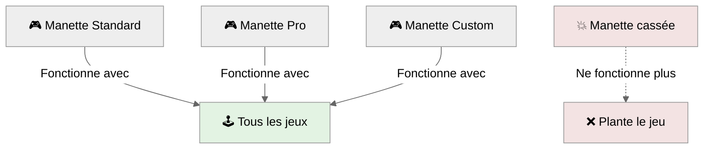
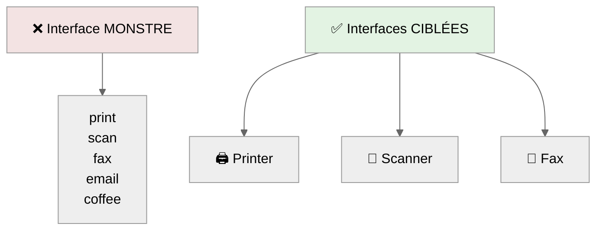
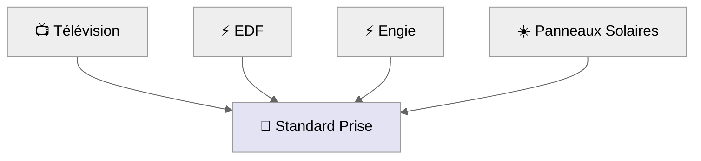
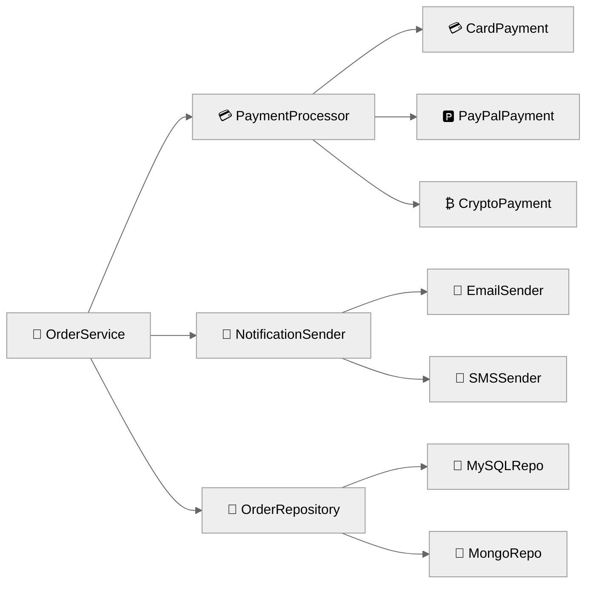
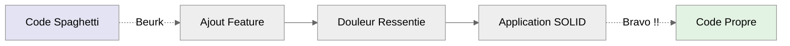

# Guide des Principes SOLID

_Pour développeurs curieux et pragmatiques_

## **Introduction**

Imaginez votre code comme une **boîte à outils**. Les principes **SOLID** sont les règles qui vous aident à organiser vos outils pour qu'ils
soient toujours **faciles à trouver**, **simples à utiliser** et **durables dans le temps**.

Créés par **Robert C. Martin** ( _Uncle Bob_ ), ces 5 principes transforment le **code spaghetti** en **architecture solide**.

**`SOLID`** - est un acronyme pour

-   **S** - Single Responsibility Principle _( Une responsabilité par classe )_
-   **O** - Open/Closed Principle _( Ouvert à l'extension, fermé à la modification )_
-   **L** - Liskov Substitution Principle _( Remplaçabilité sans casse )_
-   **I** - Interface Segregation Principle _( Interfaces sur mesure )_
-   **D** - Dependency Inversion Principle _( Dépendre d'abstractions )_

**Schémas caricaturaux mais réalistes**



## **S - Single Responsibility Principle ( _SRP_ )**

:::note Définition
_Une classe ne devrait avoir qu'une seule raison de changer.<br />
Autrement dit, une classe ne devrait avoir qu'une seule responsabilité._
:::

### Analogie : _La maison bien organisée_

Imaginez une maison où :

-   La cuisine sert AUSSI de bureau
-   La salle de bain fait AUSSI office de cuisine
-   Le salon est AUSSI un atelier de bricolage

:::danger Résultat ?
Chaos total ! Dès qu'un problème arrive ( _fuite d'eau_ ), TOUT s'arrête.
:::

**❌ - Schéma d'une mauvaise pratique**



<br />

**✅ - Schéma d'une bonne pratique**



### En pratique : _Une seule raison de changer_

**❌ Code problématique :**

```javascript
class User {
    constructor(name, email) {
        this.name = name;
        this.email = email;
    }

    // Responsabilité 1: Données
    getName() {
        return this.name;
    }

    // Responsabilité 2: Validation
    validateEmail() {
        return this.email.includes('@');
    }

    // Responsabilité 3: Persistance
    save() {
        console.log('Sauvegarde vers la DB...');
    }

    // Responsabilité 4: Notification
    sendWelcomeEmail() {
        console.log("Envoie d'un email...");
    }
}
```

:::danger Problème
Si l'API d'email change, il faut modifier la classe User !
:::

**✅ Solution SOLID :**

_Une seule mission : représenter un utilisateur_

```javascript
class User {
    constructor(name, email) {
        this.name = name;
        this.email = email;
    }

    getName() {
        return this.name;
    }
    getEmail() {
        return this.email;
    }
}
```

_Une seule mission : valider_

```javascript
class UserValidator {
    static isValidEmail(email) {
        return email.includes('@') && email.includes('.');
    }
}
```

_Une seule mission : sauvegarder_

```javascript
class UserRepository {
    save(user) {
        console.log(`Sauvegarde ${user.getName()} vers la base de données...`);
    }
}
```

_Une seule mission : notifier_

```javascript
class EmailService {
    sendWelcome(user) {
        console.log(`Email de bienvenue envoyé à ${user.getEmail()}`);
    }
}
```

:::tip Bénéfices immédiats

-   **Debugging facile** : 1 problème = 1 endroit à chercher
-   **Tests simples** : 1 classe = 1 série de tests
-   **Évolution sereine** : changer l'email n'impact pas la validation

:::

## **O - Open/Closed Principle ( _OCP_ )**

:::note Définition
Les entités logicielles ( _classes, modules, fonctions_ ) doivent être ouvertes à l'extension mais fermées à la modification.
:::

### Analogie : _La multiprise électrique_

Une **multiprise** est géniale car :

-   **Fermée à la modification** : Tu ne peux pas changer la prise murale
-   **Ouverte à l'extension** : Tu peux brancher pleins d'appareils différents

**Schéma d'une prise électrique**



### En pratique : _Extension sans modification_

**❌ Code qui viole OCP :**

```javascript
class PaymentProcessor {
    process(amount, type) {
        if (type === 'card') {
            console.log(`💳 ${amount}€ via Carte`);
        } else if (type === 'paypal') {
            console.log(`🅿️ ${amount}€ via PayPal`);
        } else if (type === 'crypto') {
            // Modification !
            console.log(`₿ ${amount}€ via Crypto`);
        }
    }
}
```

:::danger Problème
Pour ajouter Apple Pay, il faut ENCORE modifier cette classe !
:::

**✅ Solution OCP :**

_Interface stable - JAMAIS modifiée_

```javascript
class PaymentMethod {
    process(amount) {
        throw new Error('À implémenter dans les sous-classes');
    }

    getIcon() {
        throw new Error('À implémenter dans les sous-classes');
    }
}
```

_Extension 1_

```javascript
class CardPayment extends PaymentMethod {
    process(amount) {
        console.log(`💳 ${amount}€ via Carte Bancaire`);
    }
    getIcon() {
        return '💳';
    }
}
```

_Extension 2_

```javascript
class PayPalPayment extends PaymentMethod {
    process(amount) {
        console.log(`🅿️ ${amount}€ via PayPal`);
    }
    getIcon() {
        return '🅿️';
    }
}
```

_Extension 3 - AUCUNE modification du code existant !_

```javascript
class CryptoPayment extends PaymentMethod {
    process(amount) {
        console.log(`₿ ${amount}€ via Cryptomonnaie`);
    }
    getIcon() {
        return '₿';
    }
}
```

_Processeur stable - JAMAIS modifié_

```javascript
class PaymentProcessor {
    constructor(paymentMethod) {
        this.method = paymentMethod;
    }

    process(amount) {
        console.log(`Traitement avec ${this.method.getIcon()}`);
        this.method.process(amount);
    }
}
```

### Usage magique

_Ajouter un nouveau moyen de paiement = 0 modification !_

```javascript
const methods = [new CardPayment(), new PayPalPayment(), new CryptoPayment()];

methods.forEach((method) => {
    const processor = new PaymentProcessor(method);
    processor.process(100);
});
```

## **L - Liskov Substitution Principle ( _LSP_ )**

:::note Définition
Les objets d'une classe dérivée doivent pouvoir remplacer les objets de la classe de base sans altérer la correction du programme.
:::

### Analogie : _Les manettes de console_

Une **manette PlayStation** doit pouvoir remplacer n'importe quelle autre manette PlayStation sans planter le jeu.



### En pratique : _Remplaçabilité totale_

**❌ Violation du LSP :**

```javascript
class Bird {
    fly() {
        console.log('✈️ Je vole !');
    }
}
```

```javascript
class Penguin extends Bird {
    fly() {
        throw new Error('💥 Les pingouins ne volent pas !'); // ⚠️ CASSE !
    }
}
```

```javascript
function makeAllBirdsFly(birds) {
    birds.forEach((bird) => bird.fly()); // 💥 Plantera avec un pingouin
}
```

:::danger Problème
Le problème ici est que le Pinguin doit voler alors qu'il nage.
:::

<br />

**✅ Solution LSP :**

_Contrat de base : tous les oiseaux se déplacent_

```javascript
class Bird {
    move() {
        console.log('Je me déplace...');
    }

    getType() {
        return 'Oiseau générique';
    }
}
```

_Spécialisation : oiseaux volants_

```javascript
class FlyingBird extends Bird {
    move() {
        console.log(`${this.getType()} vole gracieusement`);
    }
}
```

_Spécialisation : oiseaux nageurs_

```javascript
class SwimmingBird extends Bird {
    move() {
        console.log(`${this.getType()} nage élégamment`);
    }
}
```

_Implémentations concrètes_

```javascript
class Sparrow extends FlyingBird {
    getType() {
        return 'Moineau';
    }
}
```

```javascript
class Penguin extends SwimmingBird {
    getType() {
        return 'Pingouin';
    }
}
```

```javascript
class Eagle extends FlyingBird {
    getType() {
        return 'Aigle';
    }
}
```

### Test du principe

```javascript
function organizeNatureTour(birds) {
    console.log("🌿 Début de l'excursion nature !");
    birds.forEach((bird) => {
        bird.move(); // ✅ Marche avec TOUS les oiseaux !
    });
}
```

_Test LSP_

```javascript
const birds = [
    new Sparrow(), // Moineau vole gracieusement
    new Penguin(), // Pingouin nage élégamment
    new Eagle(), // Aigle vole gracieusement
];

organizeNatureTour(birds); // ✅ Aucune erreur !
```

## **I - Interface Segregation Principle ( _ISP_ )**

:::note Définition

Les clients ( _navigateur_ ) ne doivent pas être forcés de dépendre d'interfaces qu'ils n'utilisent pas.<br />
Il vaut mieux avoir **plusieurs interfaces** spécifiques qu'une **interface générale**.

:::

### Analogie : _Boîte à outils vs Couteau suisse_

-   **Couteau suisse** : 50 fonctions, mais lourd et peu pratique
-   **Boîte à outils** : Chaque outil pour sa tâche = **efficacité maximale** !



### En pratique : _Interfaces sur mesure_

**❌ Interface trop large :**

_Interface dinosaure - fait TOUT_

```javascript
class OfficeDevice {
    print(doc) {
        throw new Error('À implémenter');
    }
    scan(doc) {
        throw new Error('À implémenter');
    }
    fax(doc) {
        throw new Error('À implémenter');
    }
    makeEspresso() {
        throw new Error('À implémenter');
    } // 😅
}
```

_Imprimante simple FORCÉE d'implémenter le café !_

```javascript
class BasicPrinter extends OfficeDevice {
    print(doc) {
        console.log('🖨️ Impression:', doc);
    }

    scan(doc) {
        throw new Error('❌ Scan non supporté'); // Méthode inutile !
    }

    fax(doc) {
        throw new Error('❌ Fax non supporté'); // Méthode inutile !
    }

    makeEspresso() {
        throw new Error('❌ Pas de café ici !'); // Absurde !
    }
}
```

:::danger Problème
On constate que l'idée de reprendre une interface est bonne, mais elle devient totalement désuette de sens vu que des méthodes ne
seront jamais utilisées.
:::

<br />

**✅ Solution ISP - Interfaces ciblées :**

_Interfaces spécialisées_

```javascript
class Printable {
    print(document) {
        throw new Error('À implémenter');
    }
}
```

```javascript
class Scannable {
    scan(document) {
        throw new Error('À implémenter');
    }
}
```

```javascript
class Faxable {
    fax(document) {
        throw new Error('À implémenter');
    }
}
```

_Interface bonus ( séparée ! )_

```javascript
class CoffeeMaker {
    makeEspresso() {
        throw new Error('À implémenter');
    }
}
```

**Implémentations sur mesure :**

_Imprimante simple - SEULEMENT ce dont elle a besoin_

```javascript
class LaserPrinter extends Printable {
    print(document) {
        console.log('🖨️ Impression laser:', document);
    }
}
```

_Scanner dédié_

```javascript
class DocumentScanner extends Scannable {
    scan(document) {
        console.log('📄 Scan haute résolution:', document);
    }
}
```

_Machine de bureau complète_

```javascript
class OfficeCenter extends Printable {
    constructor() {
        super();
        this.scanner = new DocumentScanner();
        this.coffeeMaker = new EspressoMachine();
    }

    print(document) {
        console.log('🏢 Impression multifonction:', document);
    }

    scan(document) {
        return this.scanner.scan(document);
    }

    makeEspresso() {
        return this.coffeeMaker.makeEspresso();
    }
}
```

_Machine à café ( interface séparée )_

```javascript
class EspressoMachine extends CoffeeMaker {
    makeEspresso() {
        console.log('☕ Espresso parfait prêt !');
    }
}
```

## **D - Dependency Inversion Principle ( _DIP_ )**

:::note Définition

**Les modules de haut niveau** ne doivent pas dépendre **des modules de bas niveau**. Les deux doivent dépendre d'**abstractions**.<br />
Les abstractions ne doivent pas dépendre des détails, mais les détails doivent dépendre des abstractions.

:::

### Analogie : _Prises électriques standardisées_

Votre télé ne dépend pas d'**EDF** ou d'**Engie** directement.
Elle dépend du **standard prise électrique**



### En pratique : _Dépendre d'abstractions_

**❌ Couplage fort :**

_Base de données concrète_

```javascript
class MySQLDatabase {
    save(data) {
        console.log('💾 Sauvegarde MySQL:', data);
    }
}
```

_Service métier COUPLÉ à MySQL_

```javascript
class UserService {
    constructor() {
        this.db = new MySQLDatabase(); // Couplage dur !
    }

    createUser(userData) {
        // On est limitée ici...
        this.db.save(userData);
    }
}
```

:::danger Problème
Si on veut changer pour PostgreSQL... GALÈRE !
:::

<br />

**✅ Solution DIP - Inversion des dépendances :**

_Abstraction ( interface )_

```javascript
class DatabaseInterface {
    save(data) {
        throw new Error('Méthode à implémenter');
    }

    getType() {
        throw new Error('Méthode à implémenter');
    }
}
```

_Implémentations concrètes_

```javascript
class MySQLDatabase extends DatabaseInterface {
    save(data) {
        console.log('🐬 MySQL: Sauvegarde terminée!', data);
    }
    getType() {
        return 'MySQL';
    }
}
```

```javascript
class PostgreSQLDatabase extends DatabaseInterface {
    save(data) {
        console.log('🐘 PostgreSQL: Données stockées!', data);
    }
    getType() {
        return 'PostgreSQL';
    }
}
```

```javascript
class MongoDatabase extends DatabaseInterface {
    save(data) {
        console.log('🍃 MongoDB: Document inséré!', data);
    }
    getType() {
        return 'MongoDB';
    }
}
```

_Base cloud_

```javascript
class FirebaseDatabase extends DatabaseInterface {
    save(data) {
        console.log('☁️ Firebase: Sync cloud OK!', data);
    }
    getType() {
        return 'Firebase';
    }
}
```

**Service flexible :**

```javascript
class UserService {
    constructor(database) {
        this.database = database; // ✅ Injection de dépendance !
    }

    createUser(userData) {
        console.log(`🚀 Utilisation de ${this.database.getType()}`);
        this.database.save(userData);
    }
}
```

**Flexibilité totale :**

_Tests avec différentes bases_

```javascript
const databases = [
    new MySQLDatabase(),
    new PostgreSQLDatabase(),
    new MongoDatabase(),
    new FirebaseDatabase(),
];

const userData = { name: 'Alice', email: 'alice@dev.com' };

databases.forEach((db) => {
    const service = new UserService(db);
    service.createUser(userData);
});

// Résultat :
// Utilisation de MySQL
// MySQL: Sauvegarde terminée! {name: 'Alice'...}
// Utilisation de PostgreSQL
// PostgreSQL: Données stockées! {name: 'Alice'...}
// etc...
```

## **Exemple Complet : E-commerce SOLID**

Voyons tous les principes en action dans un système e-commerce :



_**SRP** : Une seule responsabilité = représenter une commande_

```javascript
class Order {
    constructor(id, items, customer) {
        this.id = id;
        this.items = items;
        this.customer = customer;
    }

    getId() {
        return this.id;
    }
    getTotal() {
        return this.items.reduce((sum, item) => sum + item.price, 0);
    }
    getCustomerEmail() {
        return this.customer.email;
    }
}
```

_**ISP** : Interfaces séparées et ciblées_

```javascript
class PaymentProcessor {
    process(amount) {
        throw new Error('À implémenter');
    }
    getProviderName() {
        throw new Error('À implémenter');
    }
}
```

```javascript
class NotificationSender {
    send(message, recipient) {
        throw new Error('À implémenter');
    }
    getChannelType() {
        throw new Error('À implémenter');
    }
}
```

```javascript
class OrderRepository {
    save(order) {
        throw new Error('À implémenter');
    }
    getStorageType() {
        throw new Error('À implémenter');
    }
}
```

_**OCP** : Extensions facilement ajoutables_

```javascript
class StripePayment extends PaymentProcessor {
    process(amount) {
        console.log(`💳 Stripe: ${amount}€ traités avec succès`);
        return { success: true, id: `stripe_${Date.now()}` };
    }
    getProviderName() {
        return 'Stripe';
    }
}
```

```javascript
class PayPalPayment extends PaymentProcessor {
    process(amount) {
        console.log(`🅿️ PayPal: Paiement de ${amount}€ confirmé`);
        return { success: true, id: `paypal_${Date.now()}` };
    }
    getProviderName() {
        return 'PayPal';
    }
}
```

_**LSP** : Toutes les implémentations respectent le contrat_

```javascript
class EmailNotification extends NotificationSender {
    send(message, recipient) {
        console.log(`📧 Email envoyé à ${recipient}: ${message}`);
    }
    getChannelType() {
        return 'Email';
    }
}
```

```javascript
class SMSNotification extends NotificationSender {
    send(message, recipient) {
        console.log(`📱 SMS envoyé à ${recipient}: ${message}`);
    }
    getChannelType() {
        return 'SMS';
    }
}
```

_**DIP** : Dépendance vers l'abstraction_

```javascript
class FirestoreRepository extends OrderRepository {
    save(order) {
        console.log(`☁️ Firestore: Commande ${order.getId()} sauvée`);
    }
    getStorageType() {
        return 'Firestore';
    }
}
```

_Service principal - DIP en action_

```javascript
class OrderService {
    constructor(paymentProcessor, notificationSender, orderRepository) {
        this.payment = paymentProcessor; // ✅ Injection
        this.notification = notificationSender; // ✅ Injection
        this.repository = orderRepository; // ✅ Injection
    }

    async processOrder(order) {
        console.log(`\n🚀 Traitement commande ${order.getId()}`);
        console.log(`💰 Montant: ${order.getTotal()}€`);

        // 1. Paiement
        const paymentResult = this.payment.process(order.getTotal());

        if (paymentResult.success) {
            // 2. Sauvegarde
            this.repository.save(order);

            // 3. Notification
            this.notification.send(
                `Commande ${order.getId()} confirmée ! 🎉`,
                order.getCustomerEmail(),
            );

            console.log(
                `✅ Commande traitée avec ${this.payment.getProviderName()}`,
            );
        }

        return paymentResult;
    }
}
```

**Usage magique :**

_Création commande_

```javascript
const order = new Order(
    'CMD-001',
    [
        { name: 'MacBook Pro', price: 2499 },
        { name: 'Magic Mouse', price: 99 },
    ],
    { email: 'client@email.com' },
);
```

_Configuration flexible ( DIP )_

```javascript
const configurations = [
    {
        payment: new StripePayment(),
        notification: new EmailNotification(),
        repository: new FirestoreRepository(),
    },
    {
        payment: new PayPalPayment(),
        notification: new SMSNotification(),
        repository: new FirestoreRepository(),
    },
];

// Test des différentes configurations_
configurations.forEach((config, index) => {
    const orderService = new OrderService(
        config.payment,
        config.notification,
        config.repository,
    );

    console.log(`\n--- Configuration ${index + 1} ---`);
    orderService.processOrder(order);
});
```

## **Bonnes Pratiques**

### 1. Commencez Simple

> "Premature optimization is the root of all evil" - Donald Knuth

Ne sur-architecturez pas dès le début. Appliquez SOLID quand la **douleur** apparaît.

### 2. Tests = Validation SOLID

Si vos tests sont difficiles à écrire, c'est souvent un signal que SOLID n'est pas respecté.

### 3. Refactoring Continu

SOLID s'applique progressivement, au fur et à mesure des évolutions.

### 4. Composition > Héritage

Privilégiez la composition pour plus de flexibilité.



## Conclusion

:::note
_Les principes SOLID ne sont pas des **règles absolues** mais des **guides bienveillants** pour un code qui vieillit bien._
:::

### À retenir en 30 secondes

-   **S** - **Une classe, une mission** _( comme un bon employé - **SRP** )_
-   **O** - **Extension sans modification** _( comme une multiprise - **OCP** )_
-   **L** - **Remplaçable sans casse** _( comme des piles AA - **LSP** )_
-   **I** - **Interfaces sur mesure** _( comme une boîte à outils - **ISP** )_
-   **D** - **Dépendre d'abstractions** _( comme les prises standardisées - **DIP** )_

### Votre mission maintenant

1. **Identifiez** une classe dans votre code qui fait " **trop de choses** ".
2. **Appliquez** le principe SRP pour la découper.
3. **Observez** comme les tests deviennent plus simples.
4. **Continuez** avec les autres principes quand le besoin se fait sentir.

Le code **`SOLID`**, c'est comme un bon vin : **ça se bonifie avec le temps !**
