# Chiffrement

## **Introduction**

**Le chiffrement des données** est un pilier essentiel de la sécurité informatique moderne. Il vise à rendre des informations
**incompréhensibles pour quiconque** ne possédant pas le secret ( _appelé clé_ ) nécessaire pour les rendre à nouveau lisibles.

:::note
On entend souvent le verbe **crypter** ( _ou le mot **cryptage**_ ) utilisé à tort en français pour parler de chiffrement.
Sachez que la distinction entre **chiffrement** et **cryptage** est très simple. ( _Le terme « **crypter** » étant un abus de langage en
français_ ).

:::

Les différents types de chiffrement ( _**symétrique** vs **asymétrique**_ ) et leurs usages respectifs.
D'autres notions connexes souvent confondues avec le chiffrement:

-   le hachage ( _hashing_ )
-   l'encodage
-   la stéganographie

Un focus sur la mise en œuvre du chiffrement dans les communications ( _ex: protocole **HTTPS**/**TLS**_ ) avec l'illustration
d'un handshake de négociation de clé. Le tout est présenté de manière professionnelle, avec des schémas explicatifs
( _diagrammes Mermaid et illustrations_ ) pour clarifier ces concepts sans ambiguïté.

## **Terminologie :** _**`Chiffrer`** n'est pas **`crypter`**_

En français, on ne _crypte_ pas des données, on les **chiffre**. Le mot _crypter_ est un anglicisme dérivé de l'anglais **to encrypt**.
Son usage est considéré comme incorrect dans le contexte technique, car _chiffrer_ implique l'utilisation d'une clé, tandis que _crypter_
pris littéralement signifierait « rendre illisible **sans clé** puis sans possibilité de déchiffrer ensuite », ce qui n'a pas de sens
dans un échange de données normal.

En d'autres termes :

:::info Chiffrer vs Crypter
Le terme _cryptage_ est qualifié d'**incorrect** par le **Référentiel général de sécurité de l'ANSSI** ( Agence National des Systèmes de
Sécurités de l'Information ), car « il reviendrait à coder un fichier sans en connaître la clé et donc sans pouvoir le décoder ensuite ».
**On dira donc chiffrer** un message ( _le rendre illisible à l'aide d'une clé_ ) et **déchiffrer pour l'opération inverse** avec la clé.

Le mot **décrypter**, lui, signifie décoder un message chiffré sans posséder la clé ( _c'est du « cassage de code »_ ). Quant à _crypter_,
mieux vaut l'éviter : « **On ne crypte pas un fichier, on le chiffre** ».
:::

:::note
_Une exception historique subsiste dans le langage courant : on parle de « **chaînes télévisées cryptées** » pour les chaînes lié à canal+.
Selon l'Académie française : « **on chiffre les messages et on crypte les chaînes** »._
:::

Pour illustrer cette distinction fondamentale, voici un schéma explicatif :

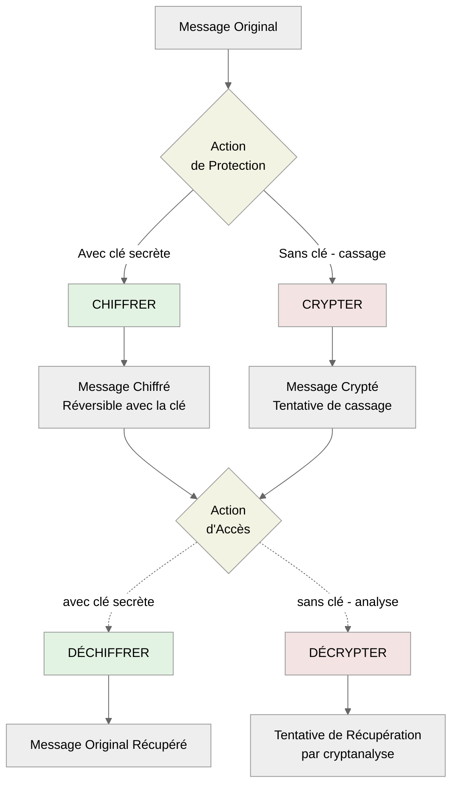

<br />

En résumé, nous utiliserons ici le terme **chiffrement** pour désigner les procédés qui protègent un message à l'aide d'une clé secrète.
Le mot **cryptographie** quant à lui désigne plus largement la science des messages secrets. Il englobe le chiffrement moderne à clé, mais
aussi des techniques plus anciennes ou plus générales ( _codes, masquage, etc._ ). La **cryptologie** est encore plus générale et inclut la
cryptographie ( _art de chiffrer_ ) et la cryptanalyse ( _art de casser les chiffres ou de décrypter sans clé_ ).

### Hiérarchie des disciplines cryptologiques

> Comprendre le sens de chacun des **termes** nous rends plus fort !!

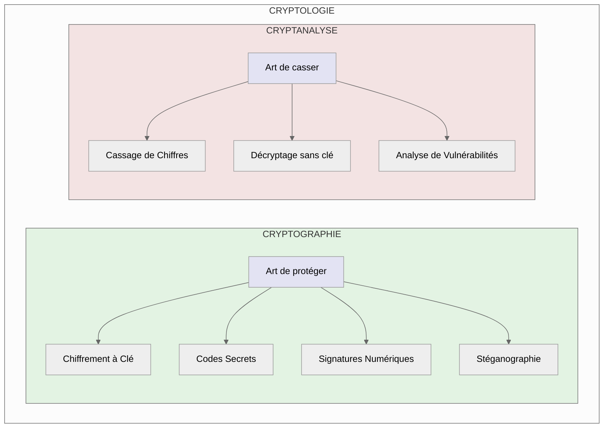

_La Cryptologie est considéré comme la science des messages secrets._

## **Les deux grands types de chiffrement**

Il existe deux familles principales de méthodes pour chiffrer des données :

-   le **chiffrement symétrique**
-   le **chiffrement asymétrique** ( _aussi appelé chiffrement à clé publique_ ).

Chacune a son fonctionnement propre, ses avantages et inconvénients, et elles sont souvent complémentaires dans les systèmes modernes.

### Chiffrement **`symétrique`**

Le chiffrement symétrique utilise une **même clé secrète** partagée entre l'expéditeur et le destinataire du message. La même clé sert donc à
chiffrer et à déchiffrer les données.

:::note Exemple
Si **Alice** et **Bob** partagent au préalable une **clé secrète K** par un canal sécurisé, **Alice peut chiffrer** un message en texte clair
pour le transformer en texte chiffré illisible à l'aide de cette clé secrète K. **Bob**, disposant de la même **clé secrète K** pourra
**déchiffrer** le message reçu et retrouver le texte original.
:::

:::info
**Cette approche symétrique** nécessite donc un accord préalable sur la clé partagée, défi que nous examinerons lors de l'étude des protocoles
de communication sécurisée tels que le **handshake TLS**.
:::

#### Petit diagramme de séquence pour comprendre ce que ça signifie

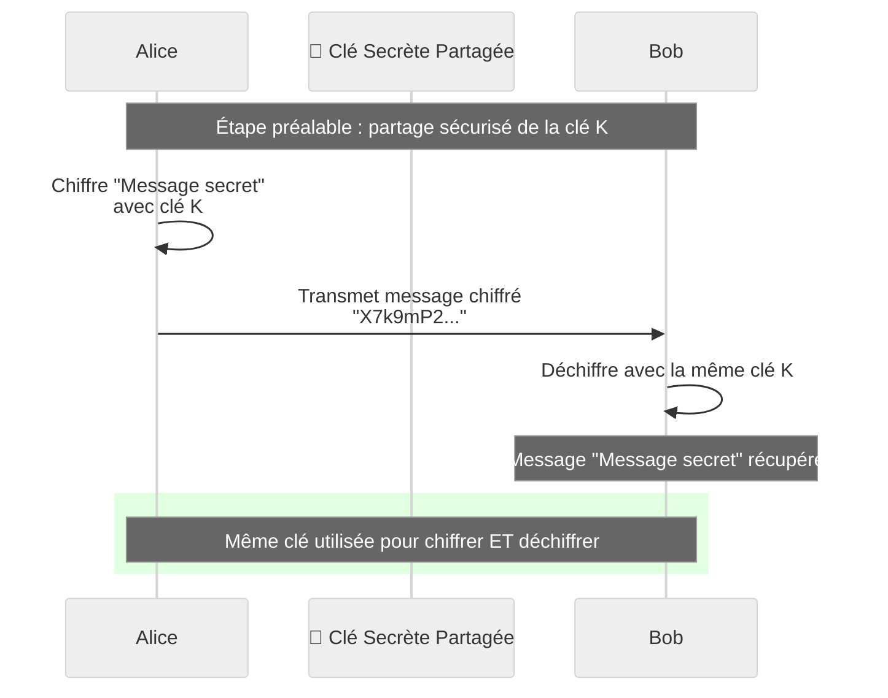

<br />

:::info
Les algorithmes symétriques courants incluent **AES** ( _Advanced Encryption Standard_ ), **ChaCha20**, et l'obsolète **DES/3DES**.
Le chiffrement symétrique est prisé pour sa **simplicité et sa rapidité** : il permet de chiffrer de grands volumes de données très
efficacement. De plus, tant que la clé reste secrète entre les deux parties, le système assure la confidentialité et même l'intégrité du
message.
:::

#### Avantages et inconvénients du chiffrement symétrique

> Découvrons les avantages et les inconvénients du **chiffrement symétrique**

:::tip Avantage du chiffrement symétrique

-   Très rapide.
-   Efficace pour gros volumes.
-   Mathématiques simple.
-   Clés courtes utilisés 128-256 bits.

:::

:::danger Inconvénients du chiffrement symétrique

-   Partage initial de clé.
-   Gestion complexe avec plusieurs utilisateurs.
-   Aucune authentification de l'expéditeur ( _Ce qui est critique pour la sécurité_ ).
-   Si la clée est compromise alors c'est tout le système qui devient vulnérable.

:::

**L'inconvénient majeur du chiffrement symétrique** réside dans le **partage initial de la clé secrète**. L'expéditeur et le destinataire
doivent nécessairement se transmettre ou convenir de cette clé au préalable via un canal de communication sécurisé.

Cette exigence crée **plusieurs vulnérabilités critiques**, si la clé est interceptée pendant la phase d'échange ou ultérieurement divulguée,
**un attaquant disposera alors des moyens de déchiffrer l'intégralité des communications protégées par cette clé**.

Cette interception peut survenir par diverses méthodes d'attaque, notamment l'utilisation de **proxies web malveillants** ou l'exploitation de
la faille classique connue sous le nom d'attaque "**Man In The Middle**" ( _homme du milieu_ ), où **l'attaquant s'interpose entre les deux
parties légitimes** pour **intercepter** et **potentiellement modifier** leurs échanges\*.

Au-delà **des aspects sécuritaires**, **la gestion opérationnelle** pose également des défis considérables. Dans un environnement comportant
plusieurs correspondants distincts, **l'organisation doit maintenir et sécuriser une multitude de clés symétriques différentes**, créant une
complexité administrative croissante avec le nombre d'utilisateurs. Cette problématique de passage à l'échelle constitue l'une des limitations
fondamentales qui a motivé **le développement des solutions de chiffrement asymétrique**.

### Chiffrement **`asymétrique`** ( _à clé publique_ )

**Le chiffrement asymétrique** révolutionne la gestion des clés en fonctionnant avec **deux clés différentes** par entité :

-   une **clé publique**
-   une **clé privée**

Ces deux clés forment une paire mathématiquement liée. **La clé publique peut être diffusée librement à tout le monde**, tandis que
**la clé privée est gardée secrète par son propriétaire**. Ces deux clés sont liées, **ce qui est chiffré avec l'une ne peut être déchiffré
qu'avec l'autre**.

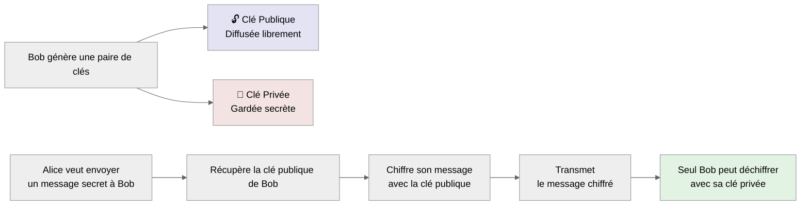

<br />

:::info Concrètement
Si **Bob** possède un couple de **clés asymétriques**, le processus fonctionne ainsi :

1. **Bob publie sa clé publique** - Alice ( _ou quiconque_ ) qui veut lui envoyer un message secret récupère cette clé publique
2. **Alice chiffre le message** à l'aide de la clé publique de Bob
3. **Seul Bob peut déchiffrer** le message avec sa clé privée secrète correspondante

:::

#### Processus détaillé de communication asymétrique

_Voici un diagramme de séquence pour mieux comprendre l'étape lié au chiffrement asymétrique._

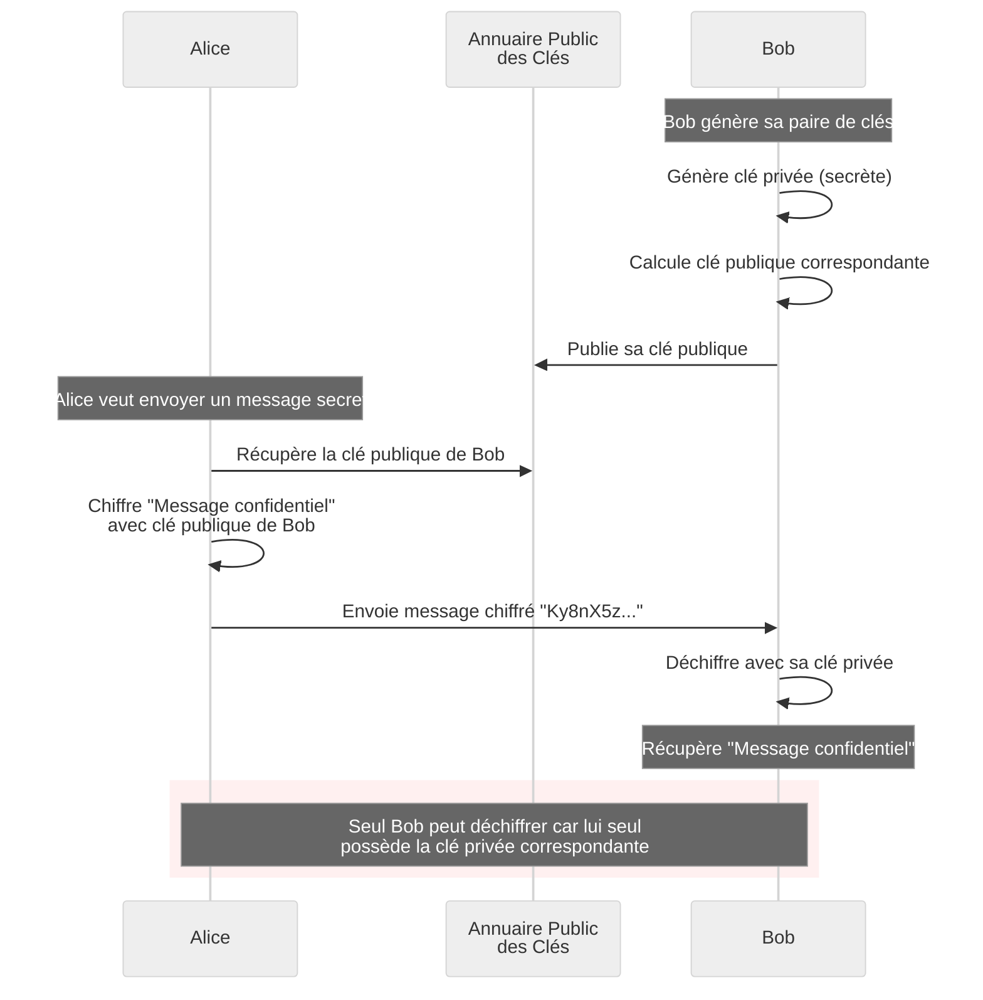

Les algorithmes asymétriques populaires incluent **RSA**, **ECC** ( _courbes elliptiques_ ), et **ElGamal**.
Ce type de chiffrement permet aussi d'implémenter des mécanismes de **signature numérique** et d'**authentification**.

#### Signature numérique : l'usage inverse

> Le chiffrement asymétrique permet également de créer des signatures numériques en inversant le processus :

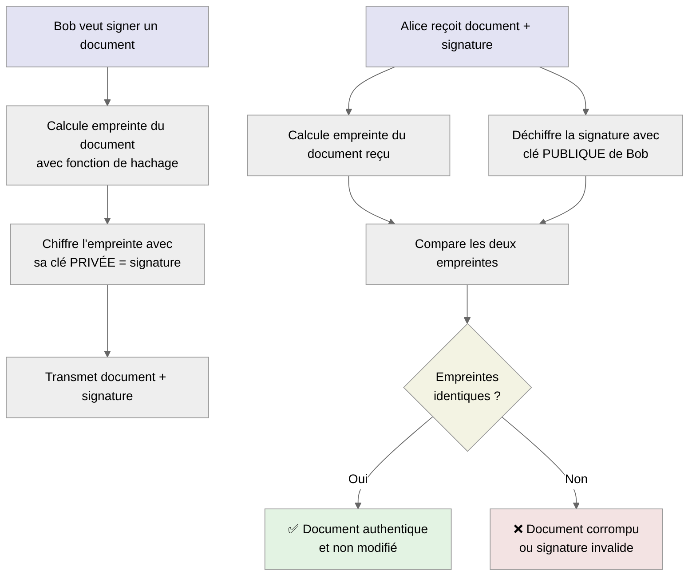

:::info Signatures Numériques : JWT ( _JSON Web Tokens_ ) et SSH ( _Secure Shell_ )
Les signatures numériques inversent le processus de chiffrement asymétrique pour garantir l'**authenticité** et l'**intégrité des données**,
constituant ainsi des fondamentaux du SMSI et du triptyque CIA ( _Confidentialité, Intégrité, Disponibilité_ ).

-   l'expéditeur signe avec sa clé privée
-   le destinataire vérifie avec la clé publique correspondante

Les **JSON Web Tokens** ( _JWT_ ) constituent une implémentation courante de ce principe, où les serveurs d'authentification **signent des
tokens** que les services applicatifs vérifient de manière autonome avec la clé publique. Dans les **connexions SSH**, l'utilisateur prouve
son identité en **signant un défi cryptographique avec sa clé privée** que le **serveur vérifie avec la clé publique** correspondante.

Ces deux implémentations illustrent comment les signatures numériques permettent l'authentification sécurisée sans transmission de secrets
partagés.
:::

#### Comparaison symétrique vs asymétrique

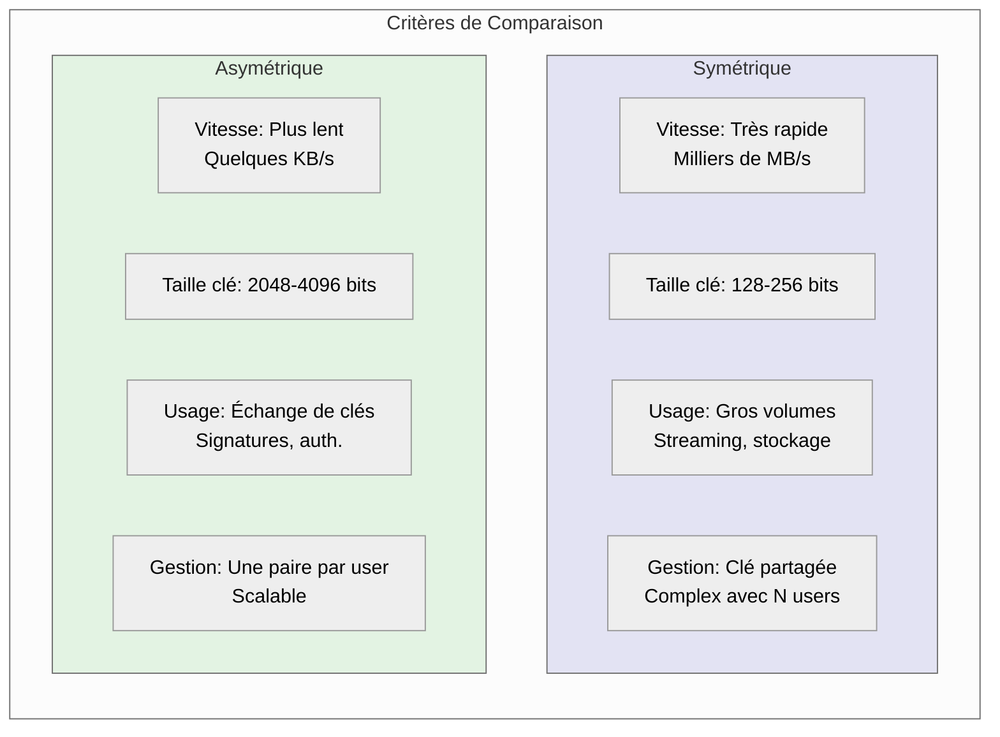

### Chiffrement **`hybride`** ( _Meilleur choix ?_ )

En pratique, les systèmes modernes combinent les deux approches pour bénéficier de leurs avantages respectifs.
Cette technique s'appelle le **chiffrement hybride** et constitue la base de la plupart des protocoles sécurisés contemporains.

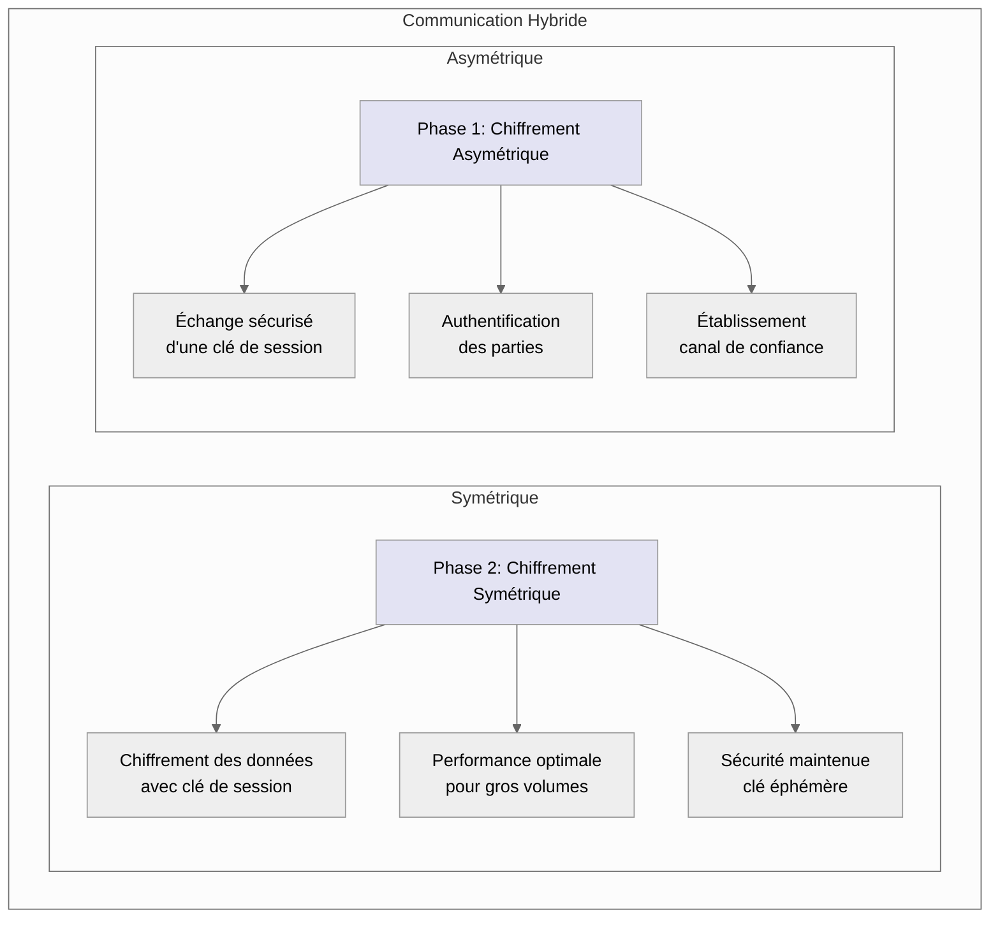

:::note Le processus hybride fonctionne ainsi

On utilise l'asymétrique pour échanger de manière sécurisée une clé symétrique ( _appelée clé de session_ ), puis on utilise cette clé
symétrique pour chiffrer les données effectives.

_Ce schéma est notamment appliqué lorsqu'on visite un site web en **HTTPS** : le **protocole TLS 1.3 ( sécurisé )** commence par un échange de
clés asymétrique, puis bascule sur un algorithme symétrique pour le reste de la communication._

:::

## **Techniques connexes souvent confondues**

Il est fréquent de confondre le chiffrement avec d'autres procédés de transformation de données.<br />
Les plus notables sont :

-   le **hachage cryptographique**
-   l'**encodage**
-   la **stéganographie**

Ces techniques ont des objectifs et des propriétés différentes qu'il convient de clarifier.

### **`Hachage cryptographique`**

Une **fonction de hachage** prend un message de longueur variable en entrée et calcule une empreinte ( _appelée hash_ ) de taille fixe en
sortie. Une propriété cruciale du hachage est qu'il s'agit d'un processus **non réversible** : **on ne peut pas retrouver le message d'origine
à partir du hash.**

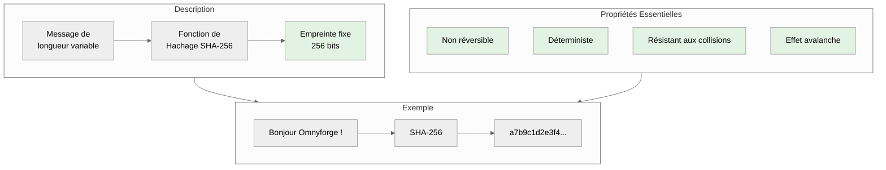

#### Voici quelques explications détaillées pour être véritablement compréhensible\*

-   **Fonctionnement du hachage cryptographique**<br />
    _Le processus de hachage transforme systématiquement un message de longueur arbitraire en une **empreinte numérique de taille fixe**.
    Cette transformation s'effectue selon des algorithmes mathématiques précis qui garantissent quatre propriétés fondamentales essentielles
    à la sécurité informatique._

-   **Propriétés essentielles du hachage sécurisé**

    -   La propriété **non réversible** constitue le pilier de la sécurité du hachage. _Contrairement au chiffrement qui permet de retrouver
        le message original avec la clé appropriée, **le hachage ne permet jamais de reconstituer le contenu initial à partir de l'empreinte**.
        Cette caractéristique unidirectionnelle protège définitivement les données sensibles telles que les mots de passe stockés dans les
        bases de données._

    -   Le caractère **déterministe** assure qu'un même message produira toujours exactement la même empreinte. _Ce concept permet ainsi la
        vérification fiable de l'intégrité des données. Cette prévisibilité s'avère indispensable pour comparer les empreintes et détecter
        les modifications non autorisées dans les fichiers ou les communications._

    -   La **résistance aux collisions** garantit qu'il demeure computationnellement impossible de trouver deux messages différents produisant
        la même empreinte. _Cette propriété préserve l'**unicité des signatures numériques** et empêche la **falsification** des documents par
        **substitution malveillante**._

    -   **L'effet avalanche** amplifie considérablement la sécurité en modifiant drastiquement l'empreinte résultante lors du moindre changement
        dans le message source. _**Une modification d'un seul caractère transforme complètement l'empreinte**, révélant immédiatement
        toute tentative d'altération des données originales._

Ces propriétés convergent pour faire du hachage cryptographique un instrument incontournable de vérification d'intégrité et de protection des
informations sensibles dans les systèmes d'information modernes.

:::note Outil exploitant le hash : BCrypt
**Bcrypt** illustre parfaitement l'utilisation d'un **salt** ( _grain de sel_ ) pour **renforcer la sécurité du hachage des mots de passe**.

Ce grain de sel ( _salt_ ) constitue une valeur aléatoire unique ajoutée au mot de passe avant le hachage, empêchant ainsi l'utilisation de
**tables de correspondance précalculées** ( _rainbow tables_ ). Même si le salt devient public, un attaquant ne peut plus exploiter des
dictionnaires de hashs précompilés et doit recalculer chaque tentative individuellement, augmentant considérablement le coût computationnel
des attaques par force brute.

Cette technique transforme des mots de passe identiques en hashs uniques, éliminant les vulnérabilités liées aux mots de passe communs.
:::

#### Usage principal : vérification d'intégrité

Le hachage sert principalement à garantir **l'intégrité** d'une information, c'est-à-dire vérifier qu'elle n'a pas été altérée.<br />
Voici un exemple concret de vérification d'intégrité de fichier via un diagramme de séquence :

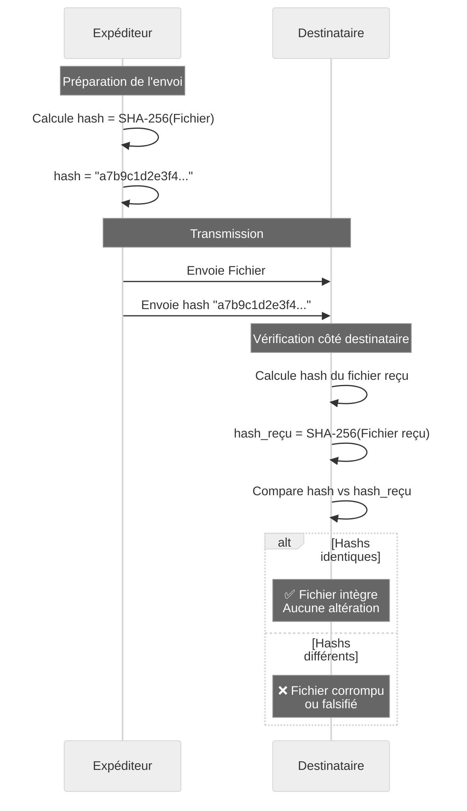

#### Stockage sécurisé des mots de passe

Le hachage est aussi couramment utilisé pour stocker de façon sécurisée des mots de passe :

**Phase 1 - Création du Mot de passe**

:::warning
Ici, nous n'allons pas appliquer le salt pour ne pas complexifier l'information, mais dites-vous juste que le hash généré ne sera pas celui qui sera stocké dans la
base de données, n'oubliez pas le grain de sel qui s'ajoute avant et qui modifie ce hash pour le rendre unique. C'est ce hash unique qui sera stocké dans la base de données.
:::

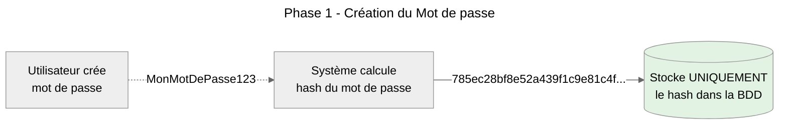

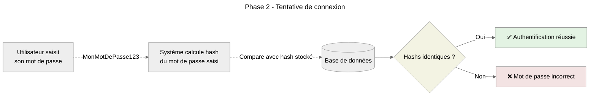

**Exemples de fonctions de hachage** : SHA-256, SHA-3, BLAKE2, HMAC, et l'**obsolète MD5**.

:::note Évolution vers SHA-3 et Considérations Futures
**La fonction de hachage SHA-3 représente l'état de l'art actuel en matière de sécurité cryptographique** et constitue **la recommandation privilégiée pour les nouveaux
développements**. Bien que l'avènement de l'informatique quantique soulève des questions concernant la robustesse des algorithmes cryptographiques actuels, SHA-3 bénéficie
d'une conception moderne qui intègre les meilleures pratiques de résistance aux attaques connues.

Les organisations soucieuses de pérennité sécuritaire adoptent progressivement **SHA-3 dans leurs infrastructures critiques**. Cette migration s'inscrit dans une démarche de
veille technologique proactive, anticipant les évolutions du paysage des menaces sans attendre les recommandations formelles des organismes de normalisation.

Sur les distributions Ubuntu, l'implémentation de SHA-3 nécessite l'installation d'un paquet spécialisé pour accéder aux outils en ligne de commande correspondants.

```shell
# Mise à jour des dépôts de paquets
sudo apt update -y

# Installation du paquet fournissant les outils SHA-3
sudo apt install -y libdigest-sha3-perl

# Utilisation pour le calcul d'empreintes
sha3sum <chemin_vers_fichier>
```

_Cette approche permet aux équipes techniques de tester et évaluer SHA-3 dans leurs environnements de développement avant une éventuelle migration des systèmes de production._
:::

##

### **`L'encodage ( codage )`**

**Encodage** signifie convertir des données d'un format vers un autre selon un schéma connu, **sans intention de secret**.<br />
C'est une transformation réversible publiquement, utilisée pour la compatibilité ou la transmission.

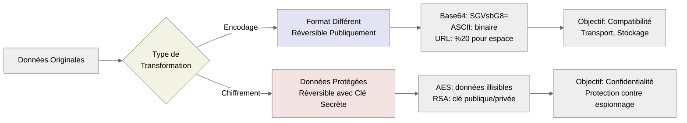

#### Exemple concret : encodage Base64

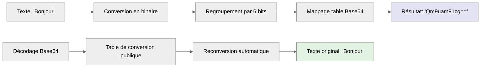

:::note Différence essentielle
Un contenu **encodé en Base64** peut être **facilement décodé par n'importe qui** connaissant l'algorithme standard. Ce n'est pas un secret, simplement une autre
représentation des mêmes données.
:::

:::danger Attention avec les JSON Web Tokens ( _JWT_ )
Précédemment on a évoqué cet outil qui permet l'authentification.
Ce qu'il faut savoir c'est que dans la génération de son **Payload**, **il ne faudra jamais passer une quelconque données sensibles**. En effet ce dernier est **encodée
en base64** et donc, si vous avez bien compris le concept de l'encodage alors vous aurez compris qu'il est très simple de décoder ce dernier et ainsi afficher des données
pour compromettre la société ou votre application en tant que tel.
:::

### **`La stéganographie`**

La **stéganographie** est l'art de dissimuler l'existence même d'un message au sein d'un autre support anodin. Contrairement au chiffrement qui rend un message illisible mais
visible, la stéganographie cherche à faire passer inaperçu le fait qu'il y a une communication secrète.

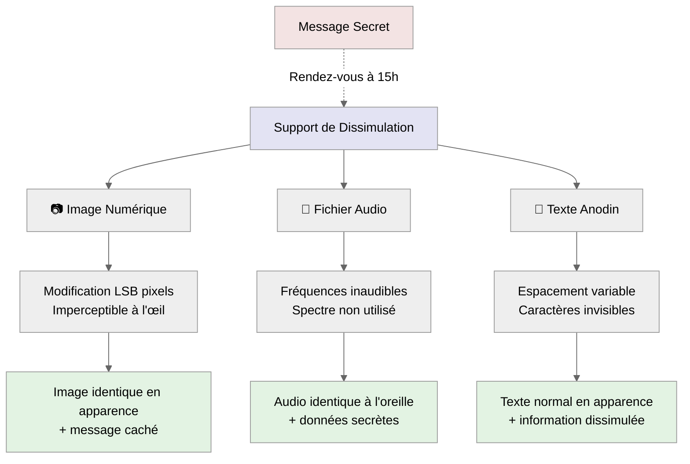

#### Comparaison : Cryptographie vs Stéganographie

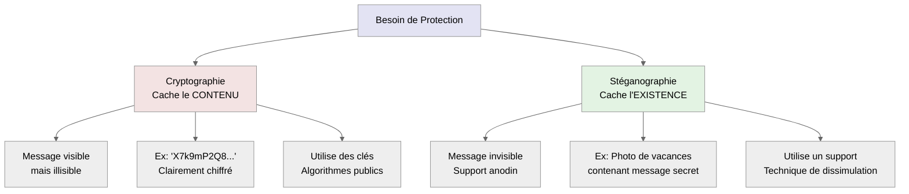

:::info Limitation importante
_La stéganographie pure n'offre pas de garantie de confidentialité du contenu. Si le subterfuge est découvert, le message caché peut être en clair.
C'est pourquoi on combine souvent les deux techniques : **on chiffre d'abord le message**, puis **on le cache dans un support anodin**._
:::

## **Le chiffrement dans les communications réelles**

Pour assurer la confidentialité des échanges sur les réseaux, on utilise le chiffrement dans divers **protocoles sécurisés**. Le protocole **TLS**
( _Transport Layer Security_ ), qui sous-tend **HTTPS** pour le web sécurisé, constitue l'exemple le plus répandu de ces implémentations.

### Architecture d'une connexion HTTPS

> Avant d'examiner le **handshake TLS**, comprenons l'architecture complète d'une connexion sécurisée :

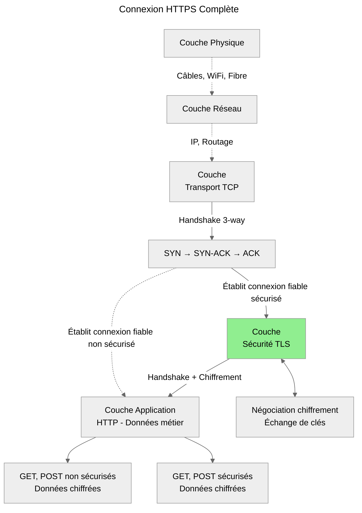

### Le three-way handshake TCP

Avant d'aborder le **chiffrement avec TLS**, il convient de comprendre comment s'établit la connexion de transport sous-jacente. Le **protocole TCP** utilise un mécanisme
appelé **three-way handshake** pour établir une connexion fiable entre deux entités. Cette procédure garantit que les deux parties sont prêtes à communiquer et synchronise
leurs paramètres de connexion.

Le processus se déroule en **trois étapes distinctes** qui permettent d'établir un **canal de communication bidirectionnel fiable** sur un **réseau potentiellement non
fiable** comme Internet.

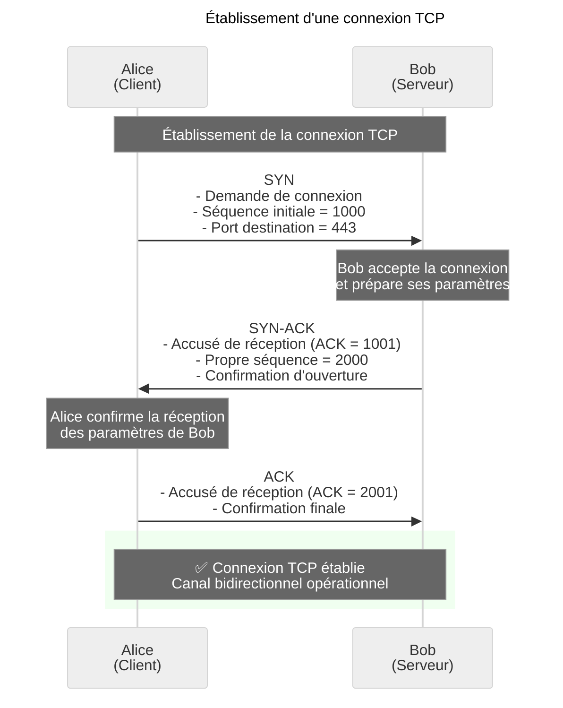

#### Analyse du processus

1. Le message **SYN** initial initie la demande de connexion en transmettant les paramètres de communication souhaités par le client. Cette étape annonce l'intention
   d'établir une session et propose les conditions techniques de l'échange.

2. La réponse **SYN-ACK** du serveur remplit une double fonction en accusant réception de la demande initiale tout en proposant ses propres paramètres de connexion.
   Cette étape bidirectionnelle optimise l'efficacité du processus de négociation.

3. L'accusé de réception final **ACK** confirme l'acceptation des paramètres proposés par le serveur et marque l'achèvement de la phase d'établissement.
   À partir de ce moment, les deux parties peuvent échanger des données de manière fiable avec garantie de livraison et détection d'erreurs.

> _Cette fondation du protocole TCP constitue le prérequis indispensable pour toute communication sécurisée, car elle fournit la fiabilité de transport nécessaire aux
> protocoles de chiffrement qui s'appuient sur elle._

### Le handshake TLS détaillé

Lorsqu'un client ( _votre navigateur_ ) se connecte à un serveur en **HTTPS**, une **négociation TLS** complexe a lieu au-dessus de la couche de transport fiable.
Cette négociation établit les paramètres cryptographiques qui protégeront toutes les communications subséquentes. Voici le processus complet :

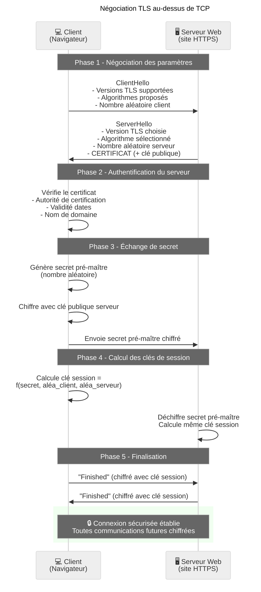

-   La phase de négociation initiale permet aux deux parties d'identifier les capacités cryptographiques communes et de sélectionner les algorithmes les plus robustes
    disponibles des deux côtés. Cette négociation adaptative garantit la compatibilité tout en maximisant le niveau de sécurité.

-   L'authentification du serveur via **son certificat numérique** constitue une étape **critique** qui **prévient les attaques par usurpation d'identité**.
    Le client vérifie la chaîne de confiance jusqu'à une autorité de certification reconnue, validant ainsi l'authenticité du serveur contacté.

-   L'échange de secret exploite la **cryptographie asymétrique** pour transmettre de manière sécurisée un élément secret qui servira à **générer les clés symétriques** de
    session. Cette approche hybride combine la sécurité de l'asymétrique avec l'efficacité du symétrique pour les communications de données.

#### Ce que garantit ce processus

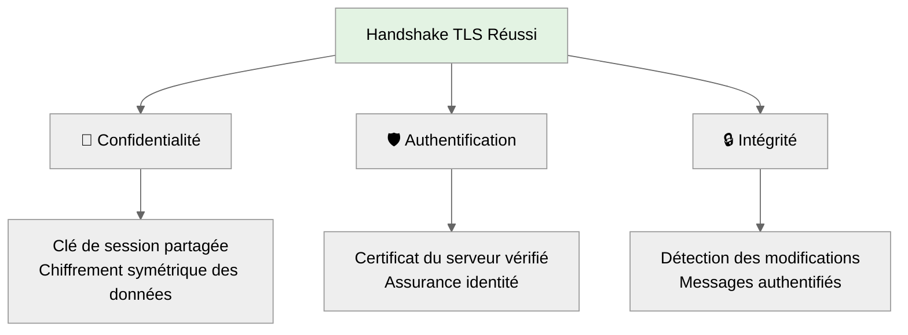

Ce processus combiné **TCP** + **TLS** garantit l'établissement d'un canal de communication à la fois fiable et sécurisé, répondant aux exigences de **confidentialité**,
d'**intégrité** et d'**authentification** nécessaires aux échanges sensibles sur des réseaux publics.

:::note
_Nous restons conformes au triptyque CIA d'un SMSI._
:::

### Protocole Diffie-Hellman moderne

Dans les versions récentes de **TLS**, on utilise souvent l'échange de clés **Diffie-Hellman** qui évite de transmettre un secret pré-chiffré :

```mermaid
---
config:
    theme: 'neutral'
---
sequenceDiagram
    participant A as Alice (Client)
    participant B as Bob (Serveur)

    Note over A,B: Paramètres DH publics et connus

    A->>A: Génère nombre privé secret 'a'<br/>Calcule A = g^a mod p
    B->>B: Génère nombre privé secret 'b'<br/>Calcule B = g^b mod p

    A->>B: Envoie A (valeur publique)
    B->>A: Envoie B (valeur publique)

    Note over A,B: Calcul du secret partagé
    A->>A: Secret = B^a mod p
    B->>B: Secret = A^b mod p

    rect rgb(240, 255, 240)
        Note over A,B: - Même secret calculé des deux côtés<br/>- Un observateur ne peut pas<br />le calculer car il ne connaît ni 'a' ni 'b'
    end
```

**Légende** : _**p** ( nombre premier ) & **g** ( générateur )_

#### Paramètres cryptographiques fondamentaux

Les paramètres **p** et **g** constituent les fondements mathématiques du protocole Diffie-Hellman et requièrent une attention particulière dans leur sélection et leur usage.

:::note Le paramètre p
Il représente un **nombre premier de très grande taille**, typiquement de 2048 bits ou plus dans les implémentations actuelles. Cette taille garantit la sécurité contre les
tentatives de cassage par force brute ou analyse mathématique avancée.
:::

:::note Le paramètre g
Il constitue un **générateur du groupe multiplicatif modulo p** qui permet de créer un large éventail de valeurs distinctes lors des calculs cryptographiques. Cette
propriété assure une distribution suffisamment étendue des valeurs publiques échangées, prévenant ainsi les attaques par analyse statistique.
:::

Ces deux paramètres demeurent publics et standardisés. Les organismes de normalisation tels que le **NIST** publient des jeux de paramètres **p** et **g validés** pour les
déploiements professionnels. Cette approche standardisée facilite l'interopérabilité entre systèmes tout en maintenant les garanties de sécurité requises.

La robustesse du protocole Diffie-Hellman repose sur l'impossibilité pratique pour un attaquant de calculer les valeurs secrètes à partir des informations publiques
échangées. Cette propriété permet l'établissement d'un secret partagé sur des canaux non sécurisés, constituant ainsi l'un des piliers des communications cryptographiques
contemporaines dans les environnements d'entreprise.

### Autres protocoles de sécurité

TLS n'est pas le seul protocole utilisant ces principes. Voici un aperçu des autres protocoles courants :

```mermaid
---
config:
    theme: 'neutral'
---
flowchart TB
    A[Protocoles de Sécurité Modernes]

    subgraph WEB[🌐 Web et APIs]
        F[HTTPS/TLS<br/>Chiffrement hybride]
        G[WebRTC<br/>Communication temps réel]
    end

    subgraph Messagerie[📧 Messagerie]
        H[S/MIME<br/>Email sécurisé]
        I[Signal Protocol<br/>Messagerie bout-en-bout]
    end

    subgraph AccèsDistant[🖥️ Accès Distant]
        J[SSH<br/>Terminal sécurisé]
    K[RDP sécurisé<br/>Bureau à distance]
    end

    subgraph ReseauxPrivés[🔗 Réseaux Privés]
        L[VPN IPSec<br/>Tunnel réseau]
        M[OpenVPN<br/>Connexion chiffrée]
    end

    A --> WEB & Messagerie & AccèsDistant & ReseauxPrivés
```

## **Applications pratiques et recommandations**

### Matrice de choix technologique

Pour sélectionner l'approche **cryptographique optimale** selon les **exigences opérationnelles spécifiques**, cette matrice de décision fournit un cadre d'évaluation
structuré permettant aux **équipes techniques** et aux **responsables sécurité** de choisir les solutions les mieux adaptées à leurs contextes d'usage.

| **Critère d'Évaluation**        | **Condition Spécifique**  | **Technologie Recommandée**     | **Justification Technique**                     |
| ------------------------------- | ------------------------- | ------------------------------- | ----------------------------------------------- |
| **Volume de Données**           | Petits volumes (< 1 MB)   | Chiffrement Asymétrique         | Acceptable malgré la surcharge computationnelle |
|                                 | Gros volumes (> 1 MB)     | Chiffrement Symétrique          | Performance optimale pour traitement massif     |
| **Contraintes Performance**     | Applications temps réel   | AES-256, ChaCha20               | Latence minimale, débit élevé                   |
|                                 | Traitement en différé     | RSA acceptable                  | Contraintes temporelles relâchées               |
| **Niveau de Sécurité**          | Sécurité standard         | AES-256, RSA-2048               | Conformité réglementaire courante               |
|                                 | Haute sécurité critique   | AES-256, RSA-4096+              | Protection renforcée données sensibles          |
| **Infrastructure de Clés**      | PKI déployée              | Chiffrement Asymétrique         | Exploitation infrastructure existante           |
|                                 | Canal sécurisé disponible | Chiffrement Symétrique          | Échange préalable de clés possible              |
| **Contraintes Opérationnelles** | Authentification requise  | Solutions hybrides + signatures | Garantie identité et confidentialité            |
|                                 | Intégrité prioritaire     | Fonctions de hachage + MAC      | Détection altérations critiques                 |

Cette **matrice de décision** permet une **évaluation systématique des options technologiques** en fonction des **contraintes spécifiques de chaque projet**.
Les recommandations présentées reflètent les meilleures pratiques industrielles actuelles et respectent les standards de sécurité reconnus par les **organismes
de normalisation internationaux**.

### Cycle de vie sécurisé d'une communication

L'établissement d'une communication sécurisée en environnement professionnel nécessite une orchestration rigoureuse de multiples phases techniques et sécuritaires. Ce
processus dépasse largement la simple négociation initiale des paramètres cryptographiques pour englober un cycle de vie complet garantissant la confidentialité, l'intégrité
et la disponibilité ( _triptyque CIA d'un SMSI_ ) des échanges tout au long de leur durée de vie opérationnelle.

:::note
_Le diagramme de séquence ci-dessous illustrent l'approche recommandée pour les communications critiques d'entreprise, intégrant les meilleures pratiques de sécurité
informatique contemporaines et respectant les exigences de conformité réglementaire applicables aux organisations traitant des données sensibles._
:::

#### Phase 1 - Négociation et Initiation

La phase de négociation initiale constitue le fondement de toute communication sécurisée robuste. Cette étape établit les paramètres cryptographiques optimaux supportés par
l'ensemble des participants, prévenant ainsi les vulnérabilités associées aux algorithmes obsolètes ou affaiblis. Le système sécurisé analyse les capacités déclarées par
chaque partie pour sélectionner la combinaison d'algorithmes offrant le niveau de protection maximal compatible avec les contraintes opérationnelles de l'environnement.

```mermaid
---
title: Phase 1 - Négociation et Initiation
config:
    theme: 'neutral'
---
sequenceDiagram
    participant U1 as Utilisateur 1
    participant S as Système Sécurisé
    participant U2 as Utilisateur 2

    Note over U1,U2: 1. Initiation et négociation
    U1->>S: Demande communication + paramètres supportés
    S->>U2: Notification demande de U1
    U2->>S: Acceptation + paramètres supportés
    S->>S: Négociation algorithmes optimaux
    S->>S: Génération clés de session
```

#### Phase 2 - Authentification mutuelle et validation des autorisations

L'authentification mutuelle garantit la légitimité de tous les participants avant l'établissement du canal de communication. Cette vérification bidirectionnelle prévient
efficacement les attaques par usurpation d'identité, quelle que soit leur origine. Le processus inclut non seulement la validation des identités mais également la
vérification des autorisations spécifiques requises pour accéder aux ressources concernées par la communication envisagée.

```mermaid
---
title: Phase 2 - Authentification mutuelle et validation des autorisations
config:
    theme: 'neutral'
---
sequenceDiagram
    participant U1 as Utilisateur 1
    participant S as Système Sécurisé
    participant U2 as Utilisateur 2

    Note over U1,U2: 2. Authentification mutuelle
    S->>U1: Défi d'authentification
    U1->>S: Preuve d'identité (certificat/biométrie)
    S->>U2: Défi d'authentification
    U2->>S: Preuve d'identité (certificat/token)
    S->>S: Validation identités et autorisations
```

#### Phase 3 - Établissement et validation du canal sécurisé

La confirmation de réception des éléments cryptographiques assure la synchronisation parfaite des paramètres de sécurité avant le commencement des échanges opérationnels.
Cette validation croisée élimine les risques de désynchronisation qui pourraient compromettre l'intégrité ou la confidentialité des communications subséquentes.

```mermaid
---
title: Phase 3 - Établissement et validation du canal sécurisé
config:
    theme: 'neutral'
---
sequenceDiagram
    participant U1 as Utilisateur 1
    participant S as Système Sécurisé
    participant U2 as Utilisateur 2

    Note over U1,U2: 3. Établissement canal sécurisé
    S->>U1: Clé session + paramètres (chiffrés)
    S->>U2: Clé session + paramètres (chiffrés)
    U1->>S: Confirmation réception et validation
    U2->>S: Confirmation réception et validation
    S->>S: Validation établissement canal
```

#### Phase 4 - Communication opérationnelle et surveillance continue

Durant la phase opérationnelle, l'intégrité des messages bénéficie d'une protection renforcée via des codes d'authentification qui détectent toute altération ou injection
malveillante. La surveillance continue de la session permet l'identification proactive des anomalies comportementales ou des tentatives d'intrusion, maintenant ainsi un
niveau de sécurité optimal pendant toute la durée de vie de la communication.

```mermaid
---
title: Phase 4 - Communication opérationnelle et surveillance continue
config:
    theme: 'neutral'
---
sequenceDiagram
    participant U1 as Utilisateur 1
    participant S as Système Sécurisé
    participant U2 as Utilisateur 2

    Note over U1,U2: 4. Communication opérationnelle
    U1->>U2: Messages chiffrés + MAC d'intégrité
    U2->>U1: Accusé réception + réponses chiffrées
    S->>S: Surveillance session (timeouts, anomalies)
```

#### Phase 5 - Gestion proactive des incidents de sécurité

Les mécanismes de gestion des incidents fournissent des capacités de réaction immédiate en cas de compromission détectée. Cette approche proactive inclut la révocation
instantanée des matériels cryptographiques compromis et la notification synchrone de tous les participants concernés par l'incident sécuritaire.

```mermaid
---
title: Phase 5 - Gestion proactive des incidents de sécurité
config:
    theme: 'neutral'
---
sequenceDiagram
    participant U1 as Utilisateur 1
    participant S as Système Sécurisé
    participant U2 as Utilisateur 2

    Note over U1,U2: 5. Gestion des incidents
    alt Détection d'anomalie
        S->>U1: Alerte sécuritaire
        S->>U2: Alerte sécuritaire
        S->>S: Révocation immédiate des clés
    end
```

#### Phase 6 - Terminaison contrôlée et conformité réglementaire

La terminaison contrôlée garantit la fermeture ordonnée de la session avec destruction sécurisée de l'ensemble des éléments sensibles. Cette phase génère également les
traces d'audit indispensables à la conformité réglementaire et aux exigences de gouvernance informatique des organisations d'entreprise.

```mermaid
---
title: Phase 6 - Terminaison contrôlée et conformité réglementaire
config:
    theme: 'neutral'
---
sequenceDiagram
    participant U1 as Utilisateur 1
    participant S as Système Sécurisé
    participant U2 as Utilisateur 2

    Note over U1,U2: 6. Terminaison contrôlée
    U1->>S: Demande fermeture session
    S->>U2: Notification fin de session
    U2->>S: Accusé réception fermeture
    S->>S: Destruction sécurisée clés + logs audit
    S->>U1: Confirmation terminaison
    Note over U1,U2: Session fermée - Aucune trace cryptographique
```

> Cette approche méthodologique reflète les standards de sécurité exigés dans les environnements professionnels où la protection des données, la traçabilité des accès et la
> résilience opérationnelle constituent des impératifs stratégiques incontournables pour la continuité des activités et la préservation de la réputation organisationnelle.

### Recommandations de sécurité actuelles

```mermaid
---
config:
    theme: 'neutral'
---
flowchart LR
    subgraph GOOD[Bonnes Pratiques 2025]
        B[Algorithmes]
        C[Tailles de Clés]
        D[Gestion Avancée]
        E[Transition Post-Quantique]

        B --> F[✅ AES-256<br/>✅ ChaCha20<br/>✅ Algorithmes Hybrides<br/>❌ DES/3DES]
        B --> G[✅ RSA-4096+<br/>✅ ECC P-521<br/>❌ RSA-2048]
        C --> H[Symétrique: 256 bits<br/>Asymétrique: 4096+ bits<br/>Post-Quantique: Variables]
        D --> I[Rotation trimestrielle<br/>HSM certifiés FIPS 140-3<br/>Zero Trust Architecture<br/>Chiffrement bout-en-bout]
        E --> J[Migration hybride obligatoire<br/>Standards NIST finalisés<br/>Audits de compatibilité<br/>Formation équipes techniques]
    end

    style F fill:#e3f3e3
    style G fill:#e3f3e3
    style H fill:#e3e3f3
    style I fill:#f3f3e3
    style J fill:#f3e3e3
```

:::danger Important
L'évolution rapide du paysage technologique **impose une révision continue des pratiques de sécurité informatique**. Les recommandations pour 2025 reflètent l'émergence de
nouvelles menaces et **l'avènement de technologies disruptives qui transforment fondamentalement les approches traditionnelles de protection des données**.
:::

#### Évolution des algorithmes de chiffrement

Les algorithmes hybrides constituent désormais une nécessité stratégique pour les organisations soucieuses de maintenir leur niveau de sécurité tout en préparant l'avenir.
Cette approche combine intelligemment les méthodes cryptographiques classiques, dont la fiabilité a été démontrée au fil des décennies, avec les nouvelles technologies
post-quantiques. Cette stratégie permet aux entreprises de conserver la compatibilité avec leurs systèmes existants sans compromettre leur capacité d'adaptation aux
évolutions technologiques futures.

Les algorithmes traditionnels tels qu'**AES-256** et **ChaCha20** conservent leur statut de **références incontournables pour le chiffrement symétrique**.
Leur robustesse éprouvée et leur efficacité opérationnelle les maintiennent au cœur des architectures de sécurité contemporaines. En revanche, **les technologies obsolètes
comme DES et 3DES doivent impérativement être abandonnées en raison de leurs vulnérabilités désormais exploitables par des moyens de calcul accessibles**.

#### Renforcement des paramètres cryptographiques

L'augmentation des tailles de clés asymétriques vers un minimum de **4096 bits pour RSA** répond directement à l'évolution des capacités de calcul disponibles et à la
sophistication croissante des attaques informatiques. Cette progression technique nécessaire assure le maintien d'un niveau de protection adéquat face aux ressources
computationnelles modernes.

Les courbes elliptiques évoluent parallèlement vers des paramètres plus robustes, avec **P-521** qui devient la nouvelle référence pour les déploiements nécessitant un
niveau de sécurité élevé. Cette migration technique garantit la pérennité des investissements en infrastructure cryptographique tout en anticipant les défis sécuritaires
des prochaines années.

#### Modernisation de la gestion des clés

La gestion avancée des clés intègre désormais les principes **Zero Trust** qui révolutionnent les architectures de sécurité d'entreprise. Cette approche fondamentale modifie
**la philosophie traditionnelle de la sécurité périmétrique en imposant une vérification systématique de chaque accès**, indépendamment de son origine géographique ou
organisationnelle.

**La rotation trimestrielle des clés cryptographiques** devient **la pratique standard** pour les environnements traitant des informations sensibles. Cette fréquence accrue
de renouvellement, supportée par des modules de sécurité matérielle certifiés selon les derniers standards **FIPS 140-3**, réduit significativement la fenêtre d'exposition
en cas de compromission et renforce la résilience globale des systèmes.

#### Préparation à la révolution post-quantique

La transition vers la **cryptographie post-quantique** représente l'enjeu technologique majeur de 2025. La finalisation des standards par les organismes de normalisation
internationaux, notamment le **NIST américain**, impose aux organisations une obligation d'adaptation pour préserver la sécurité de leurs actifs informationnels face à
l'émergence annoncée des ordinateurs quantiques.

Cette migration technologique majeure nécessite **un investissement substantiel en formation spécialisée pour les équipes techniques**, qui doivent **maîtriser les nouveaux
paradigmes cryptographiques** tout en gérant la coexistence temporaire avec les systèmes existants. Les audits de compatibilité deviennent également indispensables pour
identifier les composants nécessitant une mise à niveau prioritaire et planifier une transition progressive qui minimise les risques opérationnels.

> L'ensemble de ces évolutions répond aux défis émergents de cybersécurité tout en positionnant les infrastructures critiques pour les transformations technologiques
> anticipées. Cette approche proactive permet aux organisations de maintenir leur avantage concurrentiel tout en assurant la protection continue de leurs actifs
> informationnels dans un environnement de menaces en constante évolution.

## **Conclusion**

Le chiffrement des données constitue un pilier fondamental de la sécurité informatique moderne. La distinction terminologique entre **chiffrer** ( _avec clé_ ) et **crypter** ( _anglicisme incorrect_ ) reflète une compréhension précise des mécanismes sous-jacents.

Les systèmes sécurisés contemporains s'appuient sur une approche hybride combinant la robustesse du chiffrement asymétrique pour l'échange de clés et l'efficacité du chiffrement symétrique pour la protection des données volumineuses. Cette architecture, illustrée dans les protocoles comme TLS/HTTPS, démontre comment la cryptographie théorique se traduit en solutions pratiques et performantes.

Les techniques connexes ( _hachage, encodage, stéganographie_ ) complètent l'arsenal cryptographique en répondant à des besoins spécifiques d'intégrité, de compatibilité ou de discrétion. Leur compréhension permet d'éviter les confusions courantes et de choisir la solution appropriée selon le contexte.

L'évolution vers la cryptographie post-quantique et les défis émergents nécessitent une veille technologique constante. Cependant, les principes fondamentaux présentés dans ce guide restent valides et constituent la base nécessaire pour appréhender les développements futurs de la sécurité informatique.

---

> _Ce guide s'appuie sur les standards industriels et les recommandations des organismes de sécurité reconnus (ANSSI, NIST) pour fournir une compréhension solide et actuelle des technologies de chiffrement._

-   Lien vers l'Agence nationale de la sécurité des systèmes d'information ( ANSSI ) : **[https://cyber.gouv.fr/](https://cyber.gouv.fr/)**
-   Lien vers "National Institute of Standards and Technology" ( NIST ) : **[https://www.nist.gov/](https://www.nist.gov/)**
