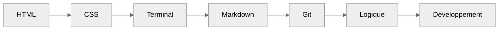
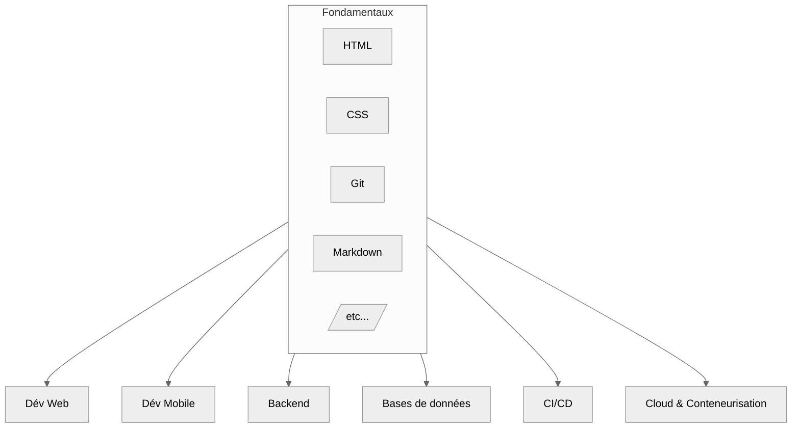

import Badge from '@site/src/components/Badge';

# Introduction

## Développement & Cloud

**Objectif** : amorcer une montée en compétence dans le développement moderne, les pratiques CI/CD, le Cloud Computing et les tests automatisés.

Cette introduction générale vise à offrir un socle commun avant de se spécialiser dans les différentes branches du développement web, mobile,
backend ou fullstack, ainsi que les pratiques DevOps associées. Elle repose sur les prérequis abordés dans la section **Fondamentaux**
( _HTML, CSS, Git, Markdown, etc._ ), et propose une vue d’ensemble des :

-   **Stacks modernes** : MERN, MEAN, TALL, Python, React Native
-   **Bases de données** : MongoDB ( _Mongoose_ ), MySQL/MariaDB, PostgreSQL, Eloquent
-   **Moteurs de rendu** : EJS, PUG, TWIG, Handlebars
-   **Modélisations** : UML, Merise
-   **Pratiques CI/CD** : GitHub Actions, Docker, Vercel, etc.
-   **Tests automatisés** : TDD, assertions, gestion de couverture

## Prérequis fondamentaux pour poursuivre

**Objectif** : _poser les bases nécessaires à toute forme de développement._ 
**Niveau** : <Badge niveau="Débutant" />

-   **HTML / CSS** : structure et mise en forme de pages web
-   **Terminal & Shell** : naviguer dans les répertoires, exécuter des scripts, gérer des projets.
-   **Git / GitHub** : versionner, collaborer, créer des branches et gérer des fusions.
-   **Markdown** : écrire une documentation claire et structurée.
-   **Logique et algorithmie de base** : comprendre les structures conditionnelles, boucles, fonctions

**Exemple de chaîne d’apprentissage préliminaire**

:::info Information importante
Toutes ses parties ne seront pas expliquées dans cette section, elles le sont déjà dans la section **Bases Fondamentales** disponible sur ce
lien directe : **[Cliquez ici](../bases-fondamentales/introduction)**

Cette section repose sur les notions déjà abordées dans les **[Bases Fondamentales](../bases-fondamentales/introduction)** :
HTML, CSS, Git, Markdown, logique, etc. 
Il est **fortement recommandé de les maîtriser** avant de poursuivre.
:::

## Table des matières

| Section | Titre                                        | Description                                                              |
| :-----: | -------------------------------------------- | ------------------------------------------------------------------------ |
|  **I**  | Prérequis fondamentaux                       | _HTML, CSS, logique, terminal, Git, Markdown._                           |
| **II**  | Panorama des stacks modernes                 | _MERN, MEAN, TALL, Python, React Native : cas d’usage et architectures._ |
| **III** | Bases de données & moteurs de rendu          | _MongoDB, SQL, ORM, moteurs de templates (EJS, PUG, etc.)._              |
| **IV**  | Développement piloté par les tests           | _Tests unitaires, TDD, assertions, bonnes pratiques._                    |
|  **V**  | Intégration continue / Livraison ( _CI/CD_ ) | _Automatiser les builds, les tests, les déploiements._                   |
| **VI**  | Principes de modélisation                    | _UML, Merise, schémas entité-association, modélisation fonctionnelle._   |

## Vue d'ensemble des domaines

## Mise en perspective

:::tip Transition vers la spécialisation
Les fondements abordés ici permettent d’amorcer une montée en compétence dans les branches spécifiques du développement :
:::

| Domaine              | Fondamentaux nécessaires                 | Applications ciblées                              |
| -------------------- | ---------------------------------------- | ------------------------------------------------- |
| **Web**              | HTML, CSS, JS, Git                       | Frameworks MEAN / MERN / TALL, moteurs de rendu   |
| **Mobile**           | JS, React, Git                           | React Native, PWA                                 |
| **Backend**          | Node.js, Laravel, Python                 | APIs REST, GraphQL, microservices                 |
| **Bases de données** | SQL, NoSQL, ORM ( _Mongoose, Eloquent_ ) | Stockage structuré, relationnel ou documentaires  |
| **Modélisation**     | UML, Merise                              | Conception de base de données, architecture logic |
| **CI/CD**            | Git, tests, scripting                    | Pipelines de déploiement                          |
| **Cloud**            | Conteneurisation, Git, scripts           | Docker, GitHub Actions, Vercel, AWS, etc.         |

**Ces compétences seront explorées dans les chapitres suivants avec mise en pratique progressive et contextualisée.**
