# Étape 3 bis : Alpine.js Pur

:::danger A prendre en compte
**Parcours Alpine.js ( _Plus avancé_ 🟡 )** - Alpine.js = _Réactivité côté client_
:::

## Qu'est-ce qu'Alpine.js ?

**Alpine.js** est un framework JavaScript minimaliste qui apporte la réactivité directement dans le HTML sans
la complexité de frameworks lourds. Voici ses principes clés :

-   **Léger et performant** : _Seulement **~15KB minifié**, idéal pour les performances._
-   **Déclaratif** : _Logique directement dans le **HTML**, syntaxe **intuitive**._
-   **Réactif** : _Mises à jour automatiques de l'interface côté client._
-   **Sans compilation** : _Pas de build step, fonctionne directement dans le navigateur._

## Évolution Naturelle

```mermaid
---
title: Progression & Prochaines Étapes
config:
  theme: 'neutral'
---
graph LR
A[<b>Application Laravel</b>] -.-> |Challenge| B["Interactions basiques"]
C[<b>Solution Alpine.js</b>] -.-> |Apporte|D[Réactivité client] --> |Permet| E[Interactions riches] -.-> |Offre| F[UX moderne]

style A fill:#e3e3f3
style C fill:#e3e3f3
style F fill:#e3f3e3
```



_Maintenant que je maîtrise Laravel classique, je vais ajouter Alpine.js pour créer des interactions fluides côté client,
sans la complexité de frameworks comme React ou Vue, tout en gardant la logique côté client._

## Différence avec Livewire

Contrairement à Livewire qui traite tout côté serveur, Alpine.js fonctionne **entièrement côté client**.<br />
Cela nécessite donc de créer une **API REST** pour communiquer avec Laravel.

## Création de l'API Laravel

### Contrôleur API

```bash
# Créer le contrôleur API
php artisan make:controller Api/TaskController --api
```

:::note Fichier créé
Contrôleur API : **`app/Http/Controllers/Api/TaskController.php`**
:::

### Structure du contrôleur API

:::note Emplacement Fichier
**`app/Http/Controllers/Api/TaskController.php`**
:::

```php
<?php

namespace App\Http\Controllers\Api;

use App\Http\Controllers\Controller;
use App\Models\Task;
use Illuminate\Http\Request;

class TaskController extends Controller
{
    // Toutes les méthodes qui suivent doivent être implémentées ici
}
```

### Méthode `index()`

_Récupère toutes les tâches au format JSON._

```php
// Récupérer toutes les tâches
public function index()
{
    $tasks = Task::latest()->get();
    return response()->json($tasks);
}
```

### Méthode `store()`

_Crée une nouvelle tâche via l'API._

```php
// Créer une nouvelle tâche
public function store(Request $request)
{
    $validated = $request->validate([
        'title' => 'required|min:3|max:255',
        'description' => 'nullable|max:500'
    ]);

    $task = Task::create($validated);
    return response()->json($task, 201);
}
```

### Méthode `update()`

_Met à jour une tâche existante._

```php
// Mettre à jour une tâche
public function update(Request $request, Task $task)
{
    $validated = $request->validate([
        'title' => 'required|min:3|max:255',
        'description' => 'nullable|max:500',
        'completed' => 'boolean'
    ]);

    $task->update($validated);
    return response()->json($task);
}
```

### Méthode `destroy()`

_Supprime une tâche._

```php
// Supprimer une tâche
public function destroy(Task $task)
{
    $task->delete();
    return response()->json(['message' => 'Tâche supprimée avec succès']);
}
```

### Méthode `toggle()`

_Bascule l'état d'une tâche._

```php
// Basculer l'état d'une tâche
public function toggle(Task $task)
{
    $task->update(['completed' => !$task->completed]);
    return response()->json($task);
}
```

### Méthode `stats()`

_Retourne les statistiques._

```php
// Statistiques
public function stats()
{
    $total = Task::count();
    $completed = Task::where('completed', true)->count();
    $pending = Task::where('completed', false)->count();
    $completionRate = $total > 0 ? round(($completed / $total) * 100) : 0;

    return response()->json([
        'total' => $total,
        'completed' => $completed,
        'pending' => $pending,
        'completion_rate' => $completionRate
    ]);
}
```

## Routes API

:::note Emplacement Fichier
**`routes/api.php`**
:::

```php
<?php

use App\Http\Controllers\Api\TaskController;
use Illuminate\Support\Facades\Route;

Route::prefix('tasks')->group(function () {
    Route::get('/', [TaskController::class, 'index']);
    Route::post('/', [TaskController::class, 'store']);
    Route::put('/{task}', [TaskController::class, 'update']);
    Route::delete('/{task}', [TaskController::class, 'destroy']);
    Route::patch('/{task}/toggle', [TaskController::class, 'toggle']);
    Route::get('/stats', [TaskController::class, 'stats']);
});
```

## Composant Alpine.js

### Qu'est-ce qu'un `Composant Alpine.js`

:::warning Fondamentaux pour comprendre la suite
Un **Composant Alpine.js** est une **fonction JavaScript** qui retourne un objet contenant l'état et les méthodes de votre composant.

#### Convention de nommage

```javascript
// Fonction composant
function taskManager() {
    return {
        // État réactif
        tasks: [],
        loading: false,

        // Méthodes
        async addTask() {
            /* ... */
        },
    };
}
```

#### Placement dans le code

**Le composant se place dans une balise `<script>` à la fin de la vue HTML** - après tout le contenu HTML !

:::

### Structure du composant

```javascript
function taskManager() {
    return {
        // État des données - Propriétés réactives
        tasks: [],
        stats: {
            total: 0,
            completed: 0,
            pending: 0,
            completion_rate: 0,
        },
        form: {
            title: '',
            description: '',
        },
        editingTask: null,
        search: '',
        filter: 'all',
        loading: false,
        message: '',
        errors: {},

        // Méthodes - Toutes les fonctions ci-dessous vont ici
    };
}
```

:::info Premier & dernier rappel
_Toutes les méthodes qui suivent doivent être implémentées dans l'objet retourné par la fonction **taskManager**._
:::

### Méthode `init()`

_Méthode d'initialisation appelée automatiquement par Alpine.js._

```javascript
// Initialisation
async init() {
    await this.loadTasks();
    await this.loadStats();
},
```

### Méthode `loadTasks()`

_Charge les tâches depuis l'API._

```javascript
// Charger les tâches
async loadTasks() {
    try {
        const response = await fetch('/api/tasks');
        this.tasks = await response.json();
    } catch (error) {
        this.showMessage('Erreur lors du chargement des tâches', 'error');
    }
},
```

### Méthode `loadStats()`

_Charge les statistiques depuis l'API._

```javascript
// Charger les statistiques
async loadStats() {
    try {
        const response = await fetch('/api/tasks/stats');
        this.stats = await response.json();
    } catch (error) {
        console.error('Erreur lors du chargement des statistiques:', error);
    }
},
```

### Méthode `addTask()`

_Ajoute une nouvelle tâche via l'API._

```javascript
// Ajouter une tâche
async addTask() {
    if (!this.form.title.trim()) {
        this.errors.title = 'Le titre est obligatoire';
        return;
    }

    this.loading = true;
    this.errors = {};

    try {
        const response = await fetch('/api/tasks', {
            method: 'POST',
            headers: {
                'Content-Type': 'application/json',
                'X-CSRF-TOKEN': document.querySelector('meta[name="csrf-token"]').getAttribute('content')
            },
            body: JSON.stringify(this.form)
        });

        if (response.ok) {
            const task = await response.json();
            this.tasks.unshift(task);
            this.resetForm();
            this.showMessage('Tâche ajoutée avec succès !');
            await this.loadStats();
        } else {
            const errors = await response.json();
            this.errors = errors.errors || {};
        }
    } catch (error) {
        this.showMessage('Erreur lors de l\'ajout de la tâche', 'error');
    } finally {
        this.loading = false;
    }
},
```

### Méthode `updateTask()`

_Met à jour une tâche existante._

```javascript
// Modifier une tâche
async updateTask() {
    if (!this.form.title.trim()) {
        this.errors.title = 'Le titre est obligatoire';
        return;
    }

    this.loading = true;
    this.errors = {};

    try {
        const response = await fetch(`/api/tasks/${this.editingTask.id}`, {
            method: 'PUT',
            headers: {
                'Content-Type': 'application/json',
                'X-CSRF-TOKEN': document.querySelector('meta[name="csrf-token"]').getAttribute('content')
            },
            body: JSON.stringify(this.form)
        });

        if (response.ok) {
            const updatedTask = await response.json();
            const index = this.tasks.findIndex(t => t.id === updatedTask.id);
            if (index !== -1) {
                this.tasks[index] = updatedTask;
            }
            this.cancelEdit();
            this.showMessage('Tâche mise à jour !');
            await this.loadStats();
        } else {
            const errors = await response.json();
            this.errors = errors.errors || {};
        }
    } catch (error) {
        this.showMessage('Erreur lors de la mise à jour', 'error');
    } finally {
        this.loading = false;
    }
},
```

### Méthode `toggleTask()`

_Bascule l'état d'une tâche._

```javascript
// Basculer l'état d'une tâche
async toggleTask(task) {
    this.loading = true;

    try {
        const response = await fetch(`/api/tasks/${task.id}/toggle`, {
            method: 'PATCH',
            headers: {
                'X-CSRF-TOKEN': document.querySelector('meta[name="csrf-token"]').getAttribute('content')
            }
        });

        if (response.ok) {
            const updatedTask = await response.json();
            const index = this.tasks.findIndex(t => t.id === task.id);
            if (index !== -1) {
                this.tasks[index] = updatedTask;
            }
            this.showMessage('Tâche mise à jour !');
            await this.loadStats();
        }
    } catch (error) {
        this.showMessage('Erreur lors de la mise à jour', 'error');
    } finally {
        this.loading = false;
    }
},
```

### Méthode `deleteTask()`

_Supprime une tâche._

```javascript
// Supprimer une tâche
async deleteTask(task) {
    if (!confirm('Êtes-vous sûr de vouloir supprimer cette tâche ?')) {
        return;
    }

    this.loading = true;

    try {
        const response = await fetch(`/api/tasks/${task.id}`, {
            method: 'DELETE',
            headers: {
                'X-CSRF-TOKEN': document.querySelector('meta[name="csrf-token"]').getAttribute('content')
            }
        });

        if (response.ok) {
            this.tasks = this.tasks.filter(t => t.id !== task.id);
            this.showMessage('Tâche supprimée !');
            await this.loadStats();
        }
    } catch (error) {
        this.showMessage('Erreur lors de la suppression', 'error');
    } finally {
        this.loading = false;
    }
},
```

### Méthode `editTask()`

_Démarre l'édition d'une tâche._

```javascript
// Commencer l'édition
editTask(task) {
    this.editingTask = task;
    this.form = {
        title: task.title,
        description: task.description || ''
    };
    this.errors = {};
},
```

### Méthode `cancelEdit()`

_Annule l'édition en cours._

```javascript
// Annuler l'édition
cancelEdit() {
    this.editingTask = null;
    this.resetForm();
},
```

### Méthode `resetForm()`

_Réinitialise le formulaire._

```javascript
// Réinitialiser le formulaire
resetForm() {
    this.form = {
        title: '',
        description: ''
    };
    this.errors = {};
},
```

### Méthode `resetFilters()`

_Réinitialise les filtres._

```javascript
// Réinitialiser les filtres
resetFilters() {
    this.search = '';
    this.filter = 'all';
},
```

### Méthode `showMessage()`

_Affiche un message à l'utilisateur._

```javascript
// Afficher un message
showMessage(text, type = 'success') {
    this.message = text;
    setTimeout(() => {
        this.message = '';
    }, 3000);
},
```

### Méthode `formatDate()`

_Formate une date de manière lisible._

```javascript
// Formatage de date
formatDate(dateString) {
    const date = new Date(dateString);
    const now = new Date();
    const diff = now - date;
    const days = Math.floor(diff / (1000 * 60 * 60 * 24));

    if (days === 0) return 'aujourd\'hui';
    if (days === 1) return 'hier';
    if (days < 7) return `il y a ${days} jours`;

    return date.toLocaleDateString('fr-FR');
},
```

### Propriété calculée `filteredTasks`

_Computed property pour filtrer les tâches._

```javascript
// Computed property pour les tâches filtrées
get filteredTasks() {
    let filtered = this.tasks;

    // Filtre par recherche
    if (this.search) {
        filtered = filtered.filter(task =>
            task.title.toLowerCase().includes(this.search.toLowerCase()) ||
            (task.description && task.description.toLowerCase().includes(this.search.toLowerCase()))
        );
    }

    // Filtre par statut
    if (this.filter === 'completed') {
        filtered = filtered.filter(task => task.completed);
    } else if (this.filter === 'pending') {
        filtered = filtered.filter(task => !task.completed);
    }

    return filtered;
}
```

## Concepts Clés Alpine.js

:::danger Urgent
Il est important de comprendre cette partie afin de pouvoir implémenter ce concept dans le fichier HTML.
:::

### 1. Initialisation du composant

```html
<!-- Initialise le composant Alpine.js -->
x-data="taskManager()"

<!-- Exécute la méthode init() au chargement -->
x-init="init()"
```

### 2. Liaison de données

```html
<!-- Liaison bidirectionnelle -->
x-model="form.title"

<!-- Affichage de texte -->
x-text="task.title"

<!-- Affichage conditionnel -->
x-show="loading"
```

### 3. Gestion d'événements

```html
<!-- Clic sur bouton -->
@click="addTask()"

<!-- Soumission de formulaire -->
@submit.prevent="addTask()"

<!-- Événement clavier -->
@keyup.enter="addTask()"
```

### 4. Boucles et conditions

```html
<!-- Boucle -->
<template x-for="task in filteredTasks" :key="task.id">
    <div x-text="task.title"></div>
</template>

<!-- Classe conditionnelle -->
:class="{ 'completed': task.completed }"

<!-- Attribut conditionnel -->
:disabled="loading"
```

### 5. Transitions et animations

```html
<!-- Transition d'entrée -->
x-transition:enter="transition ease-out duration-300"
x-transition:enter-start="opacity-0 transform translate-y-2"
x-transition:enter-end="opacity-100 transform translate-y-0"

<!-- Transition de sortie -->
x-transition:leave="transition ease-in duration-150"
x-transition:leave-start="opacity-100 transform translate-y-0"
x-transition:leave-end="opacity-0 transform translate-y-2"
```

## Vue Alpine.js Pure

:::note Emplacement Fichier
**`resources/views/alpine-tasks.blade.php`**
:::

```html
<!DOCTYPE html>
<html lang="fr">
    <head>
        <meta charset="utf-8" />
        <meta name="viewport" content="width=device-width, initial-scale=1" />
        <title>TALL Tasks - Alpine.js</title>
        <script src="https://cdn.tailwindcss.com"></script>
        <script
            defer
            src="https://unpkg.com/alpinejs@3.x.x/dist/cdn.min.js"
        ></script>
        <meta name="csrf-token" content="{{ csrf_token() }}" />
    </head>
    <body class="bg-gray-100">
        <div class="min-h-screen">
            <!-- Header -->
            <header class="bg-white shadow-sm border-b">
                <div class="max-w-4xl mx-auto px-6 py-4">
                    <div class="flex items-center justify-between">
                        <h1 class="text-2xl font-bold text-gray-800">
                            TALL Tasks
                        </h1>
                        <div class="flex items-center space-x-2">
                            <span
                                class="px-2 py-1 bg-blue-100 text-blue-800 rounded text-sm"
                                >Tailwind ✓</span
                            >
                            <span
                                class="px-2 py-1 bg-green-100 text-green-800 rounded text-sm"
                                >Alpine.js ✓</span
                            >
                            <span
                                class="px-2 py-1 bg-red-100 text-red-800 rounded text-sm"
                                >Laravel API ✓</span
                            >
                        </div>
                    </div>
                    <div class="mt-2 text-sm text-gray-600">
                        Étape 4:
                        <span class="text-green-600 font-medium"
                            >Réactivité Alpine.js 🏔️</span
                        >
                    </div>
                </div>
            </header>

            <!-- Application Alpine.js -->
            <main class="py-8" x-data="taskManager()" x-init="init()">
                <div class="max-w-4xl mx-auto px-6">
                    <!-- Messages -->
                    <div
                        x-show="message"
                        x-transition:enter="transition ease-out duration-300"
                        x-transition:enter-start="opacity-0 transform translate-y-2"
                        x-transition:enter-end="opacity-100 transform translate-y-0"
                        x-transition:leave="transition ease-in duration-150"
                        x-transition:leave-start="opacity-100 transform translate-y-0"
                        x-transition:leave-end="opacity-0 transform translate-y-2"
                        class="mb-6 p-4 bg-green-100 border border-green-400 text-green-700 rounded-lg"
                    >
                        <div class="flex items-center justify-between">
                            <span x-text="message"></span>
                            <button
                                @click="message = ''"
                                class="text-green-500 hover:text-green-700"
                            >
                                &times;
                            </button>
                        </div>
                    </div>

                    <!-- Bannière Alpine.js -->
                    <div
                        class="mb-6 p-4 bg-green-50 border-l-4 border-green-400"
                    >
                        <div class="flex items-center">
                            <div class="flex-shrink-0">
                                <span class="text-green-600">🏔️</span>
                            </div>
                            <div class="ml-3">
                                <p class="text-sm text-green-700">
                                    <strong>Alpine.js en action :</strong>
                                    Toutes les interactions se font côté client
                                    avec des appels API !
                                </p>
                            </div>
                        </div>
                    </div>

                    <!-- Tableau de bord statistique -->
                    <div class="grid grid-cols-1 md:grid-cols-4 gap-4 mb-6">
                        <div class="bg-white p-4 rounded-lg shadow text-center">
                            <div
                                class="text-2xl font-bold text-blue-600"
                                x-text="stats.total"
                            ></div>
                            <div class="text-gray-600">Total</div>
                        </div>
                        <div class="bg-white p-4 rounded-lg shadow text-center">
                            <div
                                class="text-2xl font-bold text-green-600"
                                x-text="stats.completed"
                            ></div>
                            <div class="text-gray-600">Terminées</div>
                        </div>
                        <div class="bg-white p-4 rounded-lg shadow text-center">
                            <div
                                class="text-2xl font-bold text-yellow-600"
                                x-text="stats.pending"
                            ></div>
                            <div class="text-gray-600">En cours</div>
                        </div>
                        <div class="bg-white p-4 rounded-lg shadow text-center">
                            <div
                                class="text-2xl font-bold text-purple-600"
                                x-text="stats.completion_rate + '%'"
                            ></div>
                            <div class="text-gray-600">Progression</div>
                        </div>
                    </div>

                    <!-- Recherche et filtres -->
                    <div class="bg-white rounded-lg shadow-md p-6 mb-6">
                        <h2 class="text-xl font-semibold mb-4">
                            🔍 Recherche et filtres
                        </h2>

                        <div class="grid grid-cols-1 md:grid-cols-3 gap-4">
                            <!-- Recherche -->
                            <div>
                                <label
                                    class="block text-sm font-medium text-gray-700 mb-2"
                                    >Rechercher</label
                                >
                                <input
                                    type="text"
                                    x-model="search"
                                    class="w-full px-4 py-2 border rounded-lg focus:ring-2 focus:ring-blue-500"
                                    placeholder="Rechercher une tâche..."
                                />
                            </div>

                            <!-- Filtre -->
                            <div>
                                <label
                                    class="block text-sm font-medium text-gray-700 mb-2"
                                    >Filtrer</label
                                >
                                <select
                                    x-model="filter"
                                    class="w-full px-4 py-2 border rounded-lg focus:ring-2 focus:ring-blue-500"
                                >
                                    <option value="all">
                                        Toutes les tâches
                                    </option>
                                    <option value="pending">En cours</option>
                                    <option value="completed">Terminées</option>
                                </select>
                            </div>

                            <!-- Bouton reset -->
                            <div class="flex items-end">
                                <button
                                    @click="resetFilters()"
                                    class="px-4 py-2 bg-gray-500 text-white rounded-lg hover:bg-gray-600 transition-colors"
                                >
                                    🔄 Réinitialiser
                                </button>
                            </div>
                        </div>
                    </div>

                    <!-- Formulaire d'ajout/édition -->
                    <div class="bg-white rounded-lg shadow-md p-6 mb-6">
                        <h2 class="text-xl font-semibold mb-4">
                            <span
                                x-text="editingTask ? '✏️ Modifier la tâche' : '➕ Ajouter une tâche'"
                            ></span>
                        </h2>

                        <form
                            @submit.prevent="editingTask ? updateTask() : addTask()"
                        >
                            <div class="grid grid-cols-1 md:grid-cols-2 gap-4">
                                <!-- Titre -->
                                <div>
                                    <label
                                        class="block text-sm font-medium text-gray-700 mb-2"
                                        >Titre *</label
                                    >
                                    <input
                                        type="text"
                                        x-model="form.title"
                                        class="w-full px-4 py-2 border rounded-lg focus:ring-2 focus:ring-blue-500"
                                        :class="{'border-red-500': errors.title}"
                                        placeholder="Ex: Terminer le projet"
                                        required
                                    />
                                    <p
                                        x-show="errors.title"
                                        x-text="errors.title"
                                        class="mt-1 text-sm text-red-600"
                                    ></p>
                                </div>

                                <!-- Description -->
                                <div>
                                    <label
                                        class="block text-sm font-medium text-gray-700 mb-2"
                                        >Description</label
                                    >
                                    <input
                                        type="text"
                                        x-model="form.description"
                                        class="w-full px-4 py-2 border rounded-lg focus:ring-2 focus:ring-blue-500"
                                        :class="{'border-red-500': errors.description}"
                                        placeholder="Détails optionnels..."
                                    />
                                    <p
                                        x-show="errors.description"
                                        x-text="errors.description"
                                        class="mt-1 text-sm text-red-600"
                                    ></p>
                                </div>
                            </div>

                            <!-- Boutons d'action -->
                            <div class="mt-4 flex gap-2">
                                <button
                                    type="submit"
                                    :disabled="loading"
                                    class="px-6 py-2 bg-blue-600 text-white rounded-lg hover:bg-blue-700 transition-colors disabled:opacity-50"
                                >
                                    <span
                                        x-show="!loading"
                                        x-text="editingTask ? '💾 Mettre à jour' : '✨ Ajouter'"
                                    ></span>
                                    <span x-show="loading"
                                        >⏳ Traitement...</span
                                    >
                                </button>

                                <button
                                    type="button"
                                    x-show="editingTask"
                                    @click="cancelEdit()"
                                    class="px-6 py-2 bg-gray-500 text-white rounded-lg hover:bg-gray-600 transition-colors"
                                >
                                    ❌ Annuler
                                </button>
                            </div>
                        </form>
                    </div>

                    <!-- Liste des tâches -->
                    <div class="bg-white rounded-lg shadow-md">
                        <div class="p-4 border-b">
                            <h2 class="text-xl font-semibold">
                                📋 Mes Tâches (<span
                                    x-text="filteredTasks.length"
                                ></span
                                >)
                            </h2>
                        </div>

                        <template x-for="task in filteredTasks" :key="task.id">
                            <div
                                class="p-4 border-b last:border-b-0 hover:bg-gray-50 transition-colors"
                            >
                                <div class="flex items-center justify-between">
                                    <!-- Informations de la tâche -->
                                    <div class="flex-1">
                                        <h3
                                            class="font-medium"
                                            :class="task.completed ? 'line-through text-gray-500' : 'text-gray-800'"
                                            x-text="task.title"
                                        ></h3>
                                        <p
                                            x-show="task.description"
                                            class="text-sm text-gray-600 mt-1"
                                            :class="task.completed ? 'line-through' : ''"
                                            x-text="task.description"
                                        ></p>
                                        <p
                                            class="text-xs text-gray-400 mt-2"
                                            x-text="'Créée ' + formatDate(task.created_at)"
                                        ></p>
                                    </div>

                                    <!-- Actions -->
                                    <div class="flex items-center gap-2 ml-4">
                                        <!-- Toggle -->
                                        <button
                                            @click="toggleTask(task)"
                                            :disabled="loading"
                                            class="p-2 rounded-lg transition-colors"
                                            :class="task.completed ? 'bg-green-100 text-green-700' : 'bg-gray-100 text-gray-700 hover:bg-green-100'"
                                        >
                                            <span
                                                x-text="task.completed ? '✅' : '⏳'"
                                            ></span>
                                        </button>

                                        <!-- Édition -->
                                        <button
                                            @click="editTask(task)"
                                            class="p-2 bg-blue-100 text-blue-700 rounded-lg hover:bg-blue-200 transition-colors"
                                        >
                                            ✏️
                                        </button>

                                        <!-- Suppression -->
                                        <button
                                            @click="deleteTask(task)"
                                            :disabled="loading"
                                            class="p-2 bg-red-100 text-red-700 rounded-lg hover:bg-red-200 transition-colors"
                                        >
                                            🗑️
                                        </button>
                                    </div>
                                </div>
                            </div>
                        </template>

                        <!-- Message si aucune tâche -->
                        <div
                            x-show="filteredTasks.length === 0"
                            class="p-8 text-center text-gray-500"
                        >
                            <div class="text-4xl mb-4">📝</div>
                            <p>Aucune tâche trouvée.</p>
                            <button
                                x-show="search || filter !== 'all'"
                                @click="resetFilters()"
                                class="mt-2 text-blue-600 hover:text-blue-800"
                            >
                                Réinitialiser les filtres
                            </button>
                        </div>
                    </div>

                    <!-- Démonstration des fonctionnalités Alpine.js -->
                    <div class="mt-6 p-4 bg-blue-50 border-l-4 border-blue-400">
                        <h3 class="font-medium text-blue-800 mb-2">
                            🔧 Fonctionnalités Alpine.js démontrées :
                        </h3>
                        <ul class="text-sm text-blue-700 space-y-1">
                            <li>
                                • <strong>x-data</strong> : Gestion d'état
                                réactive
                            </li>
                            <li>
                                • <strong>x-init</strong> : Initialisation
                                automatique
                            </li>
                            <li>
                                • <strong>x-model</strong> : Liaison
                                bidirectionnelle
                            </li>
                            <li>
                                • <strong>x-show/x-text</strong> : Affichage
                                conditionnel
                            </li>
                            <li>
                                • <strong>x-transition</strong> : Animations
                                fluides
                            </li>
                            <li>
                                • <strong>@click/@submit</strong> : Gestion
                                d'événements
                            </li>
                            <li>• <strong>x-for</strong> : Rendu de listes</li>
                            <li>
                                • <strong>:class/:disabled</strong> : Attributs
                                dynamiques
                            </li>
                        </ul>
                    </div>
                </div>
            </main>
        </div>

        <!-- Script Alpine.js -->
        <script>
            function taskManager() {
                return {
                    // État des données
                    tasks: [],
                    stats: {
                        total: 0,
                        completed: 0,
                        pending: 0,
                        completion_rate: 0,
                    },
                    form: {
                        title: '',
                        description: '',
                    },
                    editingTask: null,
                    search: '',
                    filter: 'all',
                    loading: false,
                    message: '',
                    errors: {},

                    // Initialisation
                    async init() {
                        await this.loadTasks();
                        await this.loadStats();
                    },

                    // Charger les tâches
                    async loadTasks() {
                        try {
                            const response = await fetch('/api/tasks');
                            this.tasks = await response.json();
                        } catch (error) {
                            this.showMessage(
                                'Erreur lors du chargement des tâches',
                                'error',
                            );
                        }
                    },

                    // Charger les statistiques
                    async loadStats() {
                        try {
                            const response = await fetch('/api/tasks/stats');
                            this.stats = await response.json();
                        } catch (error) {
                            console.error(
                                'Erreur lors du chargement des statistiques:',
                                error,
                            );
                        }
                    },

                    // Ajouter une tâche
                    async addTask() {
                        if (!this.form.title.trim()) {
                            this.errors.title = 'Le titre est obligatoire';
                            return;
                        }

                        this.loading = true;
                        this.errors = {};

                        try {
                            const response = await fetch('/api/tasks', {
                                method: 'POST',
                                headers: {
                                    'Content-Type': 'application/json',
                                    'X-CSRF-TOKEN': document
                                        .querySelector(
                                            'meta[name="csrf-token"]',
                                        )
                                        .getAttribute('content'),
                                },
                                body: JSON.stringify(this.form),
                            });

                            if (response.ok) {
                                const task = await response.json();
                                this.tasks.unshift(task);
                                this.resetForm();
                                this.showMessage('Tâche ajoutée avec succès !');
                                await this.loadStats();
                            } else {
                                const errors = await response.json();
                                this.errors = errors.errors || {};
                            }
                        } catch (error) {
                            this.showMessage(
                                "Erreur lors de l'ajout de la tâche",
                                'error',
                            );
                        } finally {
                            this.loading = false;
                        }
                    },

                    // Modifier une tâche
                    async updateTask() {
                        if (!this.form.title.trim()) {
                            this.errors.title = 'Le titre est obligatoire';
                            return;
                        }

                        this.loading = true;
                        this.errors = {};

                        try {
                            const response = await fetch(
                                `/api/tasks/${this.editingTask.id}`,
                                {
                                    method: 'PUT',
                                    headers: {
                                        'Content-Type': 'application/json',
                                        'X-CSRF-TOKEN': document
                                            .querySelector(
                                                'meta[name="csrf-token"]',
                                            )
                                            .getAttribute('content'),
                                    },
                                    body: JSON.stringify(this.form),
                                },
                            );

                            if (response.ok) {
                                const updatedTask = await response.json();
                                const index = this.tasks.findIndex(
                                    (t) => t.id === updatedTask.id,
                                );
                                if (index !== -1) {
                                    this.tasks[index] = updatedTask;
                                }
                                this.cancelEdit();
                                this.showMessage('Tâche mise à jour !');
                                await this.loadStats();
                            } else {
                                const errors = await response.json();
                                this.errors = errors.errors || {};
                            }
                        } catch (error) {
                            this.showMessage(
                                'Erreur lors de la mise à jour',
                                'error',
                            );
                        } finally {
                            this.loading = false;
                        }
                    },

                    // Basculer l'état d'une tâche
                    async toggleTask(task) {
                        this.loading = true;

                        try {
                            const response = await fetch(
                                `/api/tasks/${task.id}/toggle`,
                                {
                                    method: 'PATCH',
                                    headers: {
                                        'X-CSRF-TOKEN': document
                                            .querySelector(
                                                'meta[name="csrf-token"]',
                                            )
                                            .getAttribute('content'),
                                    },
                                },
                            );

                            if (response.ok) {
                                const updatedTask = await response.json();
                                const index = this.tasks.findIndex(
                                    (t) => t.id === task.id,
                                );
                                if (index !== -1) {
                                    this.tasks[index] = updatedTask;
                                }
                                this.showMessage('Tâche mise à jour !');
                                await this.loadStats();
                            }
                        } catch (error) {
                            this.showMessage(
                                'Erreur lors de la mise à jour',
                                'error',
                            );
                        } finally {
                            this.loading = false;
                        }
                    },

                    // Supprimer une tâche
                    async deleteTask(task) {
                        if (
                            !confirm(
                                'Êtes-vous sûr de vouloir supprimer cette tâche ?',
                            )
                        ) {
                            return;
                        }

                        this.loading = true;

                        try {
                            const response = await fetch(
                                `/api/tasks/${task.id}`,
                                {
                                    method: 'DELETE',
                                    headers: {
                                        'X-CSRF-TOKEN': document
                                            .querySelector(
                                                'meta[name="csrf-token"]',
                                            )
                                            .getAttribute('content'),
                                    },
                                },
                            );

                            if (response.ok) {
                                this.tasks = this.tasks.filter(
                                    (t) => t.id !== task.id,
                                );
                                this.showMessage('Tâche supprimée !');
                                await this.loadStats();
                            }
                        } catch (error) {
                            this.showMessage(
                                'Erreur lors de la suppression',
                                'error',
                            );
                        } finally {
                            this.loading = false;
                        }
                    },

                    // Commencer l'édition
                    editTask(task) {
                        this.editingTask = task;
                        this.form = {
                            title: task.title,
                            description: task.description || '',
                        };
                        this.errors = {};
                    },

                    // Annuler l'édition
                    cancelEdit() {
                        this.editingTask = null;
                        this.resetForm();
                    },

                    // Réinitialiser le formulaire
                    resetForm() {
                        this.form = {
                            title: '',
                            description: '',
                        };
                        this.errors = {};
                    },

                    // Réinitialiser les filtres
                    resetFilters() {
                        this.search = '';
                        this.filter = 'all';
                    },

                    // Afficher un message
                    showMessage(text, type = 'success') {
                        this.message = text;
                        setTimeout(() => {
                            this.message = '';
                        }, 3000);
                    },

                    // Formatage de date
                    formatDate(dateString) {
                        const date = new Date(dateString);
                        const now = new Date();
                        const diff = now - date;
                        const days = Math.floor(diff / (1000 * 60 * 60 * 24));

                        if (days === 0) return "aujourd'hui";
                        if (days === 1) return 'hier';
                        if (days < 7) return `il y a ${days} jours`;

                        return date.toLocaleDateString('fr-FR');
                    },

                    // Computed property pour les tâches filtrées
                    get filteredTasks() {
                        let filtered = this.tasks;

                        // Filtre par recherche
                        if (this.search) {
                            filtered = filtered.filter(
                                (task) =>
                                    task.title
                                        .toLowerCase()
                                        .includes(this.search.toLowerCase()) ||
                                    (task.description &&
                                        task.description
                                            .toLowerCase()
                                            .includes(
                                                this.search.toLowerCase(),
                                            )),
                            );
                        }

                        // Filtre par statut
                        if (this.filter === 'completed') {
                            filtered = filtered.filter(
                                (task) => task.completed,
                            );
                        } else if (this.filter === 'pending') {
                            filtered = filtered.filter(
                                (task) => !task.completed,
                            );
                        }

                        return filtered;
                    },
                };
            }
        </script>
    </body>
</html>
```

## Route pour la Vue Alpine.js

:::note Emplacement Fichier
**`routes/web.php`**
:::

```php
<?php

// Route pour la vue Alpine.js
Route::get('/', function () {
    return view('alpine-tasks');
});
```

## Diagramme de Séquence Alpine.js

```mermaid
---
config:
  theme: 'neutral'
---
sequenceDiagram
    participant U as Utilisateur
    participant A as Alpine.js
    participant API as API Laravel
    participant DB as Base de données

    Note over U,DB: Chargement initial
    U->>A: Visite la page
    A->>A: x-init="init()"
    A->>API: GET /api/tasks
    API->>DB: SELECT * FROM tasks
    DB-->>API: Données
    API-->>A: JSON Response
    A-->>U: Interface mise à jour

    Note over U,DB: Interaction côté client
    U->>A: Tape dans le formulaire
    A->>A: x-model réactivité
    A-->>U: Validation temps réel

    U->>A: Clique "Ajouter"
    A->>A: @click="addTask()"
    A->>API: POST /api/tasks
    API->>DB: INSERT INTO tasks
    DB-->>API: Nouvelle tâche
    API-->>A: JSON Response
    A->>A: Mise à jour du state
    A-->>U: DOM mis à jour automatiquement
```



## Avantages d'Alpine.js

-   ✅ **Léger** : _Moins de 15KB, idéal pour les performances._
-   ✅ **Simplicité** : _Syntaxe intuitive, courbe d'apprentissage douce._
-   ✅ **Réactivité** : _Mises à jour automatiques du DOM côté client._
-   ✅ **Flexibilité** : _Peut être ajouté progressivement à une application existante._
-   ✅ **Performance** : _Pas de Virtual DOM, manipulations directes._

## Différences avec Livewire

| Aspect         | Alpine.js                    | Livewire                   |
| -------------- | ---------------------------- | -------------------------- |
| **Logique**    | Côté client (JavaScript)     | Côté serveur (PHP)         |
| **API**        | Nécessite une API REST       | Intégré avec Laravel       |
| **Réactivité** | Immédiate (client)           | Via requêtes AJAX          |
| **Sécurité**   | Validation côté client + API | Validation côté serveur    |
| **Complexité** | Plus de code JS              | Moins de code, plus simple |

<br />

:::tip Résultat immédiat
Interface riche et réactive avec Alpine.js pur !
:::
