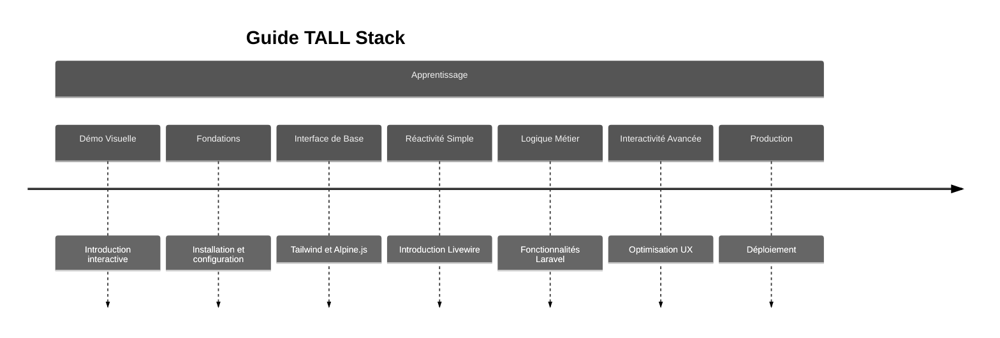
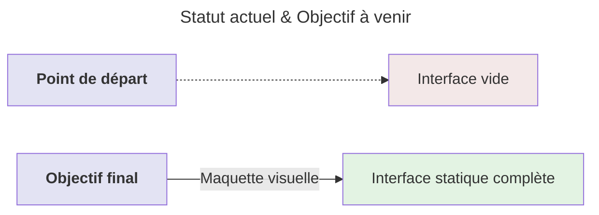
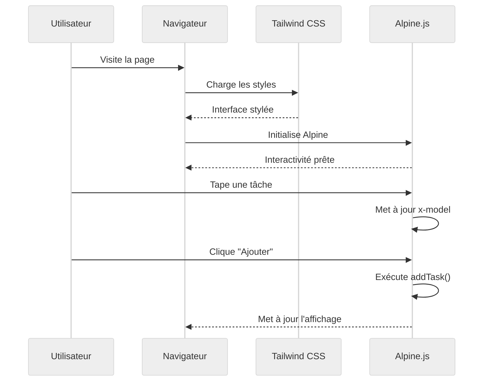

# Feuille de Route

:::info Objectif
**Créer** une **application moderne de gestion de tâche** tout en explorant pas à pas chaque composant de la stack TALL.<br />
_À chaque étape, j'examinerais les résultats pour bien comprendre comment les différents éléments s'assemblent._
:::

**Cette feuille de route détaillée** me guidera à travers chaque étape du développement d'une application moderne, en commençant par une
démonstration interactive jusqu'au déploiement en production. _Le but étant de maîtriser progressivement les composants essentiels de la stack
TALL._

## Frise chronologique du projet



_La frise chronologique ci-dessus illustre mon parcours d'apprentissage structuré :_

-   **Démo Visuelle :** Une introduction interactive pour visualiser concrètement ce que nous allons construire
-   **Fondations :** Mise en place de l'environnement de développement et configuration initiale du projet
-   **Interface de Base :** Création de l'interface utilisateur avec Tailwind CSS et ajout d'interactions simples avec Alpine.js
-   **Réactivité Simple :** Introduction à Livewire pour créer des composants dynamiques sans JavaScript complexe
-   **Logique Métier :** Implémentation des fonctionnalités principales avec Laravel (authentification, base de données, etc.)
-   **Interactivité Avancée :** Optimisation de l'expérience utilisateur avec des fonctionnalités plus sophistiquées
-   **Production :** Préparation et déploiement de l'application en environnement de production

Chaque étape s'appuie sur les précédentes, permettant une progression naturelle et une compréhension approfondie de chaque composant
de la stack TALL.

## Démo Visuelle

### Aperçu de l'Application

Pour commencer, nous allons explorer l'interface finale avant de la construire étape par étape, ce qui nous permettra de mieux
comprendre notre objectif.



### Installation Express pour la Démo

```bash
# Installation rapide avec Laravel Sail
composer create-project laravel/laravel tall-tasks
cd tall-tasks-demo
```

### Démarrage avec Laravel Sail

**Laravel Sail** est un _environnement de développement Docker léger_ inclus avec Laravel. Il fournit une **excellente configuration par
défaut** pour démarrer une application Laravel avec _PHP, MySQL, Redis et d'autres services essentiels_.

Pour lancer mon environnement de développement; il me suffit de saisir ses commandes :

```bash
# Démarrer les conteneurs Docker en arrière-plan
./vendor/bin/sail up -d

# Installer les dépendances et compiler les assets
./vendor/bin/sail npm install
./vendor/bin/sail npm run dev
```

:::tip Astuce
Une fois les conteneurs démarrés, mon application sera accessible à l'adresse **`http://localhost`**.
:::

### Simplifier l'utilisation de Sail ( _Sur un système UNIX_ )

**Pour simplifier l'expérience développeur**, je vais configurer un **alias global** dans mon fichier de configuration<br />
shell (_.bashrc_ ou _.zshrc_) :

```bash
# Création d'un alias 'sail' pour simplifier l'utilisation
# Je vérifie d'abord si le fichier 'sail' existe dans le répertoire courant
# Si oui, j'utilise ce fichier, sinon utilise celui dans vendor/bin
alias sail='[ -f sail ] && sh sail || sh vendor/bin/sail'
```

**Je recharge automatiquement mon fichier de configuration shell afin d'éviter de fermer et relancer un quelconque terminal.<br />
Pour réaliser cette action, je saisie cette commande :**

:::info Linux ( _Si j'utilise Bash_ )

```bash
# Rechargement du fichier sans relancer le terminal
source ~/.bashrc  #
```

:::

:::info MacOS ( _Si j'utilise ZSH_ )

```bash
# Rechargement du fichier sans relancer le terminal
source ~/.zshrc
```

:::

**Une fois rechargé**, l'alias `sail` sera **immédiatement disponible** dans mon terminal.
Après avoir ajouté cet alias, je pourrais utiliser simplement **`sail`** au lieu de **`./vendor/bin/sail`**.

**À propos de l'option `-d`** dans la commande `sail up -d` :

-   **Mode détaché :** Le `-d` signifie _"detached mode"_<br />
    **Fonctionne en arrière-plan** ce qui me permet d'exécuter les conteneurs Docker sans bloquer mon terminal

:::danger Sans l'option `-d`
_Les logs s'afficheraient directement dans mon terminal_
:::

:::info Avec l'option `-d`
_Mon terminal reste libre pour d'autres commandes_
:::

_Pour consulter les logs en mode détaché, je peux utiliser simplement **`sail logs`**._

### Ma première Vue Simple

Je créer immédiatement quelque chose de visible pour comprendre la structure.

:::note Emplacement du fichier
**`resources/views/demo.blade.php`**
:::

#### Sans Tailwindcss et Sans AlpineJS

```html
<!DOCTYPE html>
<html lang="fr">
    <head>
        <meta charset="utf-8" />
        <meta name="viewport" content="width=device-width, initial-scale=1" />
        <title>TALL Stack Demo</title>
    </head>
    <body>
        <div>
            <div>
                <!-- En-tête avec badges technologiques -->
                <header>
                    <h1>Démonstraton de la TALL Stack</h1>
                    <div>
                        <span>Tailwind CSS</span>
                        <span>Alpine.js</span>
                        <span>Laravel</span>
                        <span>Livewire</span>
                    </div>
                </header>

                <!-- Démo Interactive Simple avec Alpine.js -->
                <div>
                    <h2>Démo Interactive (Alpine.js)</h2>

                    <!-- Formulaire -->
                    <div>
                        <input />
                        <button>Ajouter</button>
                    </div>

                    <!-- Liste des tâches -->
                    <div>
                        <template>
                            <div>
                                <span></span>
                                <button>🗑️</button>
                            </div>
                        </template>
                    </div>

                    <!-- Compteur dynamique -->
                    <p>Total: <span></span> tâches</p>
                </div>

                <!-- Aperçu de ce que je vais construire -->
                <div>
                    <h3>Ce que je vais construire :</h3>
                    <ul>
                        <li>
                            <span></span>
                            Interface moderne et responsive avec
                            <strong>Tailwind CSS</strong>
                        </li>
                        <li>
                            <span></span>
                            Interactions fluides avec <strong>Alpine.js</strong>
                        </li>
                        <li>
                            <span></span>
                            Base de données et logique avec
                            <strong>Laravel</strong>
                        </li>
                        <li>
                            <span></span>
                            Temps réel sans JavaScript complexe avec
                            <strong>Livewire</strong>
                        </li>
                    </ul>
                </div>
            </div>
        </div>
    </body>
</html>
```

#### Avec Tailwindcss et Sans AlpineJS

```html
<!DOCTYPE html>
<html lang="fr">
    <head>
        <meta charset="utf-8" />
        <meta name="viewport" content="width=device-width, initial-scale=1" />
        <title>TALL Stack Demo</title>
        <script src="https://cdn.tailwindcss.com"></script>
    </head>
    <body class="bg-gray-100">
        <div class="min-h-screen py-8">
            <div class="max-w-4xl mx-auto px-6">
                <!-- En-tête avec badges technologiques -->
                <header class="text-center mb-8">
                    <h1 class="text-4xl font-bold text-gray-800 mb-4">
                        Démonstraton de la TALL Stack
                    </h1>
                    <div class="flex justify-center gap-2 mb-6">
                        <span
                            class="px-3 py-1 bg-blue-100 text-blue-800 rounded-full text-sm"
                            >Tailwind CSS</span
                        >
                        <span
                            class="px-3 py-1 bg-green-100 text-green-800 rounded-full text-sm"
                            >Alpine.js</span
                        >
                        <span
                            class="px-3 py-1 bg-red-100 text-red-800 rounded-full text-sm"
                            >Laravel</span
                        >
                        <span
                            class="px-3 py-1 bg-purple-100 text-purple-800 rounded-full text-sm"
                            >Livewire</span
                        >
                    </div>
                </header>

                <!-- Démo Interactive Simple avec Alpine.js -->
                <div class="bg-white rounded-lg shadow-md p-6 mb-6">
                    <h2 class="text-xl font-semibold mb-4">
                        🎮 Démo Interactive (Alpine.js)
                    </h2>

                    <!-- Formulaire -->
                    <div class="flex gap-2 mb-4">
                        <input
                            type="text"
                            placeholder="Nouvelle tâche..."
                            class="flex-1 px-4 py-2 border rounded-lg focus:ring-2 focus:ring-blue-500"
                        />
                        <button
                            class="px-6 py-2 bg-blue-600 text-white rounded-lg hover:bg-blue-700"
                        >
                            Ajouter
                        </button>
                    </div>

                    <!-- Liste des tâches -->
                    <div class="space-y-2">
                        <template>
                            <div
                                class="flex items-center justify-between p-3 bg-gray-50 rounded"
                            >
                                <span></span>
                                <button class="text-red-500 hover:text-red-700">
                                    🗑️
                                </button>
                            </div>
                        </template>
                    </div>

                    <!-- Compteur dynamique -->
                    <p class="mt-4 text-center text-gray-600">
                        Total:
                        <span class="font-bold text-blue-600"></span> tâches
                    </p>
                </div>

                <!-- Aperçu de ce que je vais construire -->
                <div
                    class="bg-gradient-to-r from-blue-50 to-purple-50 rounded-lg p-6"
                >
                    <h3 class="text-lg font-semibold mb-3">
                        Ce que je vais construire :
                    </h3>
                    <ul class="space-y-2">
                        <li class="flex items-center gap-2">
                            <span
                                class="w-2 h-2 bg-green-500 rounded-full"
                            ></span>
                            Interface moderne et responsive avec
                            <strong>Tailwind CSS</strong>
                        </li>
                        <li class="flex items-center gap-2">
                            <span
                                class="w-2 h-2 bg-green-500 rounded-full"
                            ></span>
                            Interactions fluides avec <strong>Alpine.js</strong>
                        </li>
                        <li class="flex items-center gap-2">
                            <span
                                class="w-2 h-2 bg-green-500 rounded-full"
                            ></span>
                            Base de données et logique avec
                            <strong>Laravel</strong>
                        </li>
                        <li class="flex items-center gap-2">
                            <span
                                class="w-2 h-2 bg-green-500 rounded-full"
                            ></span>
                            Temps réel sans JavaScript complexe avec
                            <strong>Livewire</strong>
                        </li>
                    </ul>
                </div>
            </div>
        </div>
    </body>
</html>
```

#### Avec Tailwindcss et AlpineJS

```html
<!DOCTYPE html>
<html lang="fr">
    <head>
        <meta charset="utf-8" />
        <meta name="viewport" content="width=device-width, initial-scale=1" />
        <title>TALL Stack Demo</title>
        <script src="https://cdn.tailwindcss.com"></script>
        <script
            defer
            src="https://unpkg.com/alpinejs@3.x.x/dist/cdn.min.js"
        ></script>
    </head>
    <body class="bg-gray-100">
        <div class="min-h-screen py-8">
            <div class="max-w-4xl mx-auto px-6">
                <!-- En-tête avec badges technologiques -->
                <header class="text-center mb-8">
                    <h1 class="text-4xl font-bold text-gray-800 mb-4">
                        Démonstraton de la TALL Stack
                    </h1>
                    <div class="flex justify-center gap-2 mb-6">
                        <span
                            class="px-3 py-1 bg-blue-100 text-blue-800 rounded-full text-sm"
                            >Tailwind CSS</span
                        >
                        <span
                            class="px-3 py-1 bg-green-100 text-green-800 rounded-full text-sm"
                            >Alpine.js</span
                        >
                        <span
                            class="px-3 py-1 bg-red-100 text-red-800 rounded-full text-sm"
                            >Laravel</span
                        >
                        <span
                            class="px-3 py-1 bg-purple-100 text-purple-800 rounded-full text-sm"
                            >Livewire</span
                        >
                    </div>
                </header>

                <!-- Démo Interactive Simple avec Alpine.js -->
                <div
                    class="bg-white rounded-lg shadow-md p-6 mb-6"
                    x-data="{
                      tasks: ['Apprendre TALL Stack', 'Créer une app géniale'],
                      newTask: '',
                      addTask() {
                        if(this.newTask.trim()) {
                          this.tasks.push(this.newTask);
                          this.newTask = '';
                        }
                      }
                    }"
                >
                    <h2 class="text-xl font-semibold mb-4">
                        🎮 Démo Interactive (Alpine.js)
                    </h2>

                    <!-- Formulaire -->
                    <div class="flex gap-2 mb-4">
                        <input
                            type="text"
                            x-model="newTask"
                            @keyup.enter="addTask()"
                            placeholder="Nouvelle tâche..."
                            class="flex-1 px-4 py-2 border rounded-lg focus:ring-2 focus:ring-blue-500"
                        />
                        <button
                            @click="addTask()"
                            class="px-6 py-2 bg-blue-600 text-white rounded-lg hover:bg-blue-700"
                        >
                            Ajouter
                        </button>
                    </div>

                    <!-- Liste des tâches -->
                    <div class="space-y-2">
                        <template x-for="(task, index) in tasks" :key="index">
                            <div
                                class="flex items-center justify-between p-3 bg-gray-50 rounded"
                            >
                                <span x-text="task"></span>
                                <button
                                    @click="tasks.splice(index, 1)"
                                    class="text-red-500 hover:text-red-700"
                                >
                                    🗑️
                                </button>
                            </div>
                        </template>
                    </div>

                    <!-- Compteur dynamique -->
                    <p class="mt-4 text-center text-gray-600">
                        Total:
                        <span
                            x-text="tasks.length"
                            class="font-bold text-blue-600"
                        ></span>
                        tâches
                    </p>
                </div>

                <!-- Aperçu de ce que je vais construire -->
                <div
                    class="bg-gradient-to-r from-blue-50 to-purple-50 rounded-lg p-6"
                >
                    <h3 class="text-lg font-semibold mb-3">
                        🎯 Ce que je vais construire :
                    </h3>
                    <ul class="space-y-2">
                        <li class="flex items-center gap-2">
                            <span
                                class="w-2 h-2 bg-green-500 rounded-full"
                            ></span>
                            Interface moderne et responsive avec
                            <strong>Tailwind CSS</strong>
                        </li>
                        <li class="flex items-center gap-2">
                            <span
                                class="w-2 h-2 bg-green-500 rounded-full"
                            ></span>
                            Interactions fluides avec <strong>Alpine.js</strong>
                        </li>
                        <li class="flex items-center gap-2">
                            <span
                                class="w-2 h-2 bg-green-500 rounded-full"
                            ></span>
                            Base de données et logique avec
                            <strong>Laravel</strong>
                        </li>
                        <li class="flex items-center gap-2">
                            <span
                                class="w-2 h-2 bg-green-500 rounded-full"
                            ></span>
                            Temps réel sans JavaScript complexe avec
                            <strong>Livewire</strong>
                        </li>
                    </ul>
                </div>
            </div>
        </div>
    </body>
</html>
```

#### route temporaire

:::note Emplacement Fichier
**`routes/web.php`**
:::

```php
Route::get('/', function () {
    return view('demo');
});
```

:::tip Résultat immédiat
Si je visite l'URL ( **`http://localhost:8000`** ) - Je peux voir une interface fonctionnelle !
:::

## Diagramme de séquence

Ce diagramme de séquence me permet d'apporter une compréhension complémentaire sur le fonctionnement de ce qui a été créé jusqu'à maintenant.

:::warning
Le détails est là mais les explications sur le fonctionnement n'est pas présent pour le moment.<br />
C'est totalement **volontaire**, chaque partie sera expliquée afin de poser les bases step by step.
:::


