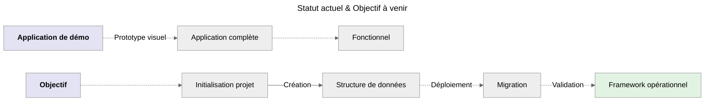
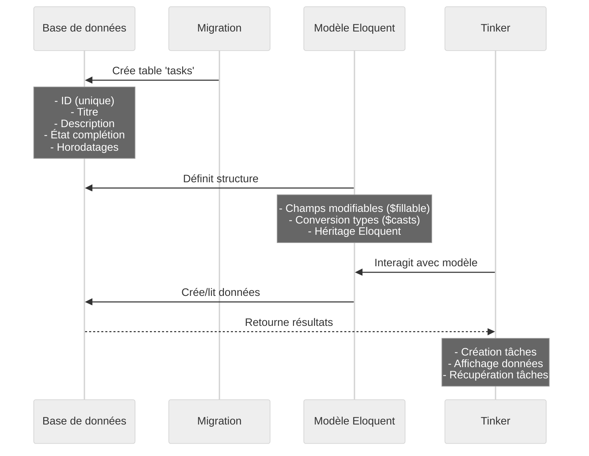

# Étape 1 - Fondations

:::info Objectif
**Créer** un **nouveau projet** sur la **gestion de tâche** en implémentant une base de données **SQLite**.<br />
_Je vais continuer à tout expliquer en détails._
:::

## Comprendre où j'en suis



_Maintenant que j'ai vu l'interface, je vais construire les fondations pour persister les données en utilisant **SQLite**._

## Pourquoi SQLite pour ce projet ?

1. **Simplicité de configuration**<br />
   _SQLite ne nécessite pas d'installation de serveur de base de données séparé, contrairement à MySQL/MariaDB ou PostgreSQL._

2. **Portabilité**<br />
   _La base de données est stockée dans un seul fichier, facilitant le partage et la sauvegarde du projet._

3. **Parfait pour l'apprentissage**<br />
   _Idéal pour comprendre les concepts sans la complexité d'une configuration de base de données complète._

4. **Performance suffisante**<br />
   _Pour un projet d'apprentissage, SQLite offre des performances plus que satisfaisantes._

:::note
_Pour un projet en **production** avec plusieurs utilisateurs simultanés, j'opterais plutôt pour **MySQL**/**MariaDB** ou **PostgreSQL**._
:::

## Configuration du Projet

### Création du nouveau projet

```bash
# Nouveau projet
composer create-project laravel/laravel tall-tasks
cd tall-tasks
```

### Création du fichié lié à la base de données

```bash
# Base de données SQLite pour simplicité
touch database/database.sqlite
```

### Générer une nouvelle clé d'application Laravel

**Pourquoi une clé d'application ?**

-   **Sécurité :** La clé est utilisée pour chiffrer les données sensibles comme les sessions et les cookies
-   **Authentification :** Elle garantit l'intégrité des données signées par l'application
-   **Protection :** Elle aide à prévenir les attaques CSRF et autres vulnérabilités de sécurité

```bash
# Générer une nouvelle clé d'application de 32 caractères
# Cette clé est utilisée pour le chiffrement des données et la sécurité
php artisan key:generate
```

:::danger Important
Cette clé sera automatiquement générée et stockée de manière sécurisée dans mon fichier **`.env`**.<br />
Pour des raisons évidente de sécurité :

-   Je ne partage jamais cette clé, elle est vitale à l'application.
-   Je ne versionne pas cette clé dans Git afin d'éviter qu'elle ne soit exposée sur GitHub.

:::

**Configuration du fichier `.env`**

```perl
DB_CONNECTION="sqlite"
DB_DATABASE="./database/database.sqlite"
```

## Premier Modèle - Visible et Compréhensible

```bash
# Création d'un modèle Task + migration d'un coup (-m)
php artisan make:model Task -m
```

**Que fait l'option `-m` dans la commande artisan ?**

Le flag **`-m`** est un raccourci qui crée automatiquement deux fichiers essentiels :

-   **Le modèle** : **`app/Models/Task.php`** - _Qui définit la structure et le comportement de mes tâches._
-   **La migration** : **`database/migrations/xxxx_create_tasks_table.php`** - _Qui gère la structure de la table en base de données._

Sans le **`-m`**, j'aurais créer le modèle et la migration séparément. Soit :

```bash
# Création du modèle "Task"
php artisan make:model Task

# Création des migrations "create_tasks_table"
php artisan make:migration create_tasks_table
```

_Cette option vous fait gagner du temps en créant les deux fichiers en une seule commande._

### Contenu du fichier de migration

:::note Emplacement Fichier
**`database/migrations/xxxx_create_tasks_table.php`**
:::

```php
<?php

use Illuminate\Database\Migrations\Migration;
use Illuminate\Database\Schema\Blueprint;
use Illuminate\Support\Facades\Schema;

return new class extends Migration
{
    public function up()
    {
        Schema::create('tasks', function (Blueprint $table) {
            $table->id();                                     // Identifiant unique
            $table->string('title');                          // Ce que je vois dans l'interface
            $table->text('description')->nullable();          // Détails optionnels
            $table->boolean('completed')->default(false);     // État de la tâche
            $table->timestamps();                             // Créé/modifié automatiquement
        });
    }

    public function down()
    {
        Schema::dropIfExists('tasks');
    }
};
```

#### Explication de la migration

_La migration est un *blueprint* qui définit la structure de ma table en base de données._

**Champs essentiels**

    - ➔ **`id()`** : _Identifiant unique auto-incrémenté_
    - ➔ **`string('title')`** : _Stocke le titre de la tâche_
    - ➔ **`text('description')`** : _Champ optionnel pour les détails_
    - ➔ **`boolean('completed')`** : _État de complétion (vrai/faux)_
    - ➔ **`timestamps()`** : _Dates de création/modification_

:::info Information utile
Les migrations sont une fonctionnalité essentielle qui permet de **versionner** et suivre l'évolution de la structure de la base de données au
fil du temps. Cette approche offre plusieurs avantages cruciaux :

-   _Elle facilite grandement la **collaboration en équipe** en permettant à chaque développeur d'avoir une structure cohérente._
-   _Elle simplifie le **processus de déploiement** en automatisant les modifications de schéma._
-   _Elle fournit un **historique clair** des changements apportés à la structure de la base de données._

:::

### Contenu du fichier modèle

:::note Emplacement Fichier
**`app/Models/Task.php`**
:::

```php
<?php

namespace App\Models;

use Illuminate\Database\Eloquent\Model;

class Task extends Model
{
    // Champs qu'on peut remplir en masse (sécurité)
    protected $fillable = [
        'title',
        'description',
        'completed'
    ];

    // Conversion automatique des types
    protected $casts = [
        'completed' => 'boolean'
    ];
}
```

**L'importance de l'attribut `$fillable` et `$casts` dans Laravel**<br />
_C'est, **comprendre** les **Propriétés Essentielles** du Modèle qui peuvent être exploitées_

### La propriété **`$fillable`**

-   **Protection contre l'assignation massive**<br />
    _Renforce la sécurité en bloquant les modifications non autorisées de champs sensibles via des requêtes malveillantes_
-   **Sécurité renforcée**<br />
    _Seuls les champs explicitement listés dans $fillable peuvent être modifiés en masse via les méthodes create() ou update()_
-   **Explicite et documenté**<br />
    _Améliore la lisibilité du code en définissant clairement les champs modifiables_

### La propriété **`$casts`**

-   **Conversion automatique des types :**<br />
    _Assure une transformation fluide des données entre la base de données et les types PHP_
-   **Cohérence des données :**<br />
    _Maintient l'intégrité des types de données tout au long de l'application_
-   **Facilite le développement :**<br />
    _Élimine le besoin de conversions manuelles, réduisant ainsi les risques d'erreurs_

:::warning Exemple concret avec le modèle Task

**`completed`** est **casté** en **boolean** : la valeur **0/1** de la base de données sera automatiquement convertie en **true/false** en PHP.
Seuls **`title`**, **`description`** et **`completed`** peuvent être modifiés en masse, protégeant ainis des champs comme **`id`** ou
**`created_at`** d'une quelconque altération non désiré.

_Cette structure forme la base sur laquelle je pourrais construire des fonctionnalités plus avancées dans mon application Laravel._
:::

### création de la migration

```bash
# Créer la table en base de données (*sqlite*)
php artisan migrate
```

## Test immédiat avec Tinker

### Qu'est-ce que Tinker ?

**Tinker** est un _REPL (Read-Eval-Print Loop)_ intégré à Laravel qui permet d'interagir directement avec votre application depuis la console.
Voici ses principaux avantages :

-   **Tester rapidement :** _Validez votre code PHP en temps réel dans le contexte de votre application_
-   **Manipuler en direct :** _Interagissez avec vos modèles et votre base de données de manière interactive_
-   **Déboguer efficacement :** _Explorez et testez les fonctionnalités de Laravel en mode console_
-   **Expérimenter rapidement :** _Testez l'API Eloquent sans avoir à écrire du code dans des fichiers_

:::note
C'est un outil indispensable pendant le développement pour vérifier le bon fonctionnement de mes modèles et relations, ce qui ne nécessite pas
la création de routes ou de contrôleurs.
:::

### Différence entre PHPUnit et Tinker

**Ces deux outils servent des objectifs très différents dans l'écosystème Laravel :**

:::info PHPUnit est un framework de tests

-   Permet d'écrire et exécuter des tests automatisés
-   Vérifie le bon fonctionnement du code
-   S'utilise pendant le développement et l'intégration continue
-   Produit des rapports de tests

:::

:::tip Tinker est un REPL interactif

-   Permet d'interagir directement avec l'application
-   Utile pour tester rapidement du code ou des requêtes
-   S'utilise principalement pendant le développement
-   Ne produit pas de tests réutilisables

:::

**En résumé :** PHPUnit sert à créer des tests automatisés pour garantir la qualité du code, tandis que Tinker est un outil interactif pour
explorer et manipuler rapidement l'application pendant le développement.

### Différence avec le TDD

L'approche actuellement choisie est différente du TDD classique ( _Test-Driven Development_ ) :

:::info TDD classique

-   Écrire d'abord les tests
-   Voir les tests échouer
-   Écrire le code minimal pour passer les tests
-   Refactoriser

:::

:::tip Approche choisie

-   Démonstration visuelle d'abord
-   Construction progressive des fondations
-   Intégration pas à pas des fonctionnalités
-   Tests ajoutés pour la robustesse

:::

_Les deux approches sont valides, mais j'ai choisie une méthode plus visuelle et intuitive pour faciliter mon apprentissage._

```bash
# Lancement de Tinker via la console interactive de Laravel
php artisan tinker
```

```php
// Dans tinker - créer votre première tâche
$task = App\Models\Task::create([
    'title' => 'Ma première tâche Laravel',
    'description' => 'Comprendre les modèles Eloquent'
]);

// Voir le résultat
$task->toArray();

// Récupérer toutes les tâches
App\Models\Task::all()->toArray();
```

:::danger Point important à soulever
Mon approche suit une **méthodologie progressive**, commençant par une interface visuelle puis ajoutant la persistance des données,
contrairement au TDD traditionnel qui commence par les tests.
:::

## Compréhension / Explication du Code Pas à Pas

Cette étape est fondamentale pour la suite. Il est important de bien comprendre ce qui se passe pour aborder la suite sereinement.
Le code ci-dessus met en place les fondations d'une application de gestion de tâches avec Laravel.

Je décompose donc les éléments clés en un diagramme de séquence.



<br />

:::tip Résultat immédiat
Les données sont persistées dans la base de données !
:::
