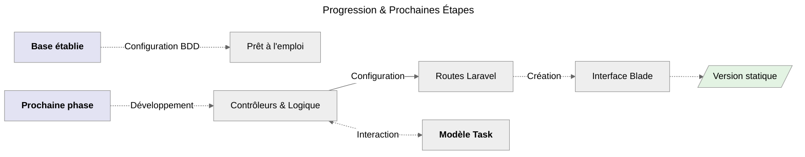
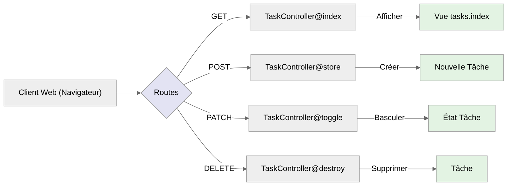
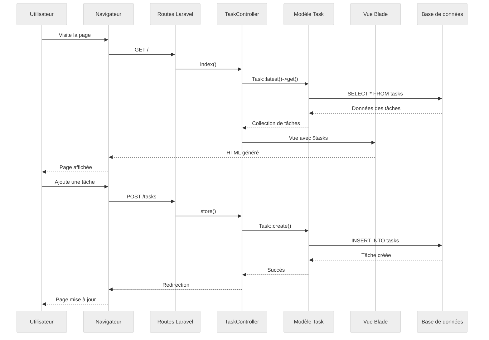

# Étape 2 : Interface Laravel

## Progression Visuelle



_Je vais maintenant créer l'interface Laravel qui interagira avec la base de données._

## Contrôleur Simple et Visible

```bash
# Création du contrôleur qui gèrera toute la logique métier des tâches
php artisan make:controller TaskController
```

:::note Emplacement Fichier
**`app/Http/Controllers/TaskController.php`**
:::

Le **TaskController** est une classe PHP qui hérite de la classe **Controller** de Laravel. Il sert d'_intermédiaire essentiel_ entre le
**modèle Task** et les **vues**, orchestrant toute la logique métier de l'application de gestion de tâches.

### Contenu de `TaskController`

```php
<?php

namespace App\Http\Controllers;

use App\Models\Task;
use Illuminate\Http\Request;

class TaskController extends Controller
{
   // Les méthodes seront ajoutées ici
}
```

**Points clés essentiels du contrôleur**

-   **Architecture :** _Utilisation du namespace **`App\Http\Controllers`** pour une organisation optimale_
-   **Importations :** _Intégration du **modèle Task** et de la **classe Request** de Laravel pour la gestion des données_
-   **Structure :** _Organisation **méthodique** de la logique applicative pour une maintenance facilitée_
-   **Bonnes pratiques :** _Respect des principes **SOLID** et des **conventions Laravel** pour un code robuste et évolutif_

:::info SOLID
Une documentation sur **S.O.L.I.D** est en pleine réflexion mais prévu dans les **Bases Fondamentales**.<br />
_Le lien vers cette partie sera ajouté une fois rédigé_.
:::

## Très important

:::danger Information très importante
Dans les prochaines parties, j'explique chaque méthode que je vais utiliser.<br />
**Pour ne pas perturber mon apprentissage**, j'affiche uniquement le code correspondant à la méthode en cours.<br />
Les méthodes commentées sont remplacées par **`// ... Du code`**.

Aussi, il faut prendre en considération que **pour comprendre chaque partie** et ne pas **switcher de fichier en fichier de peur de perdre
le fil**, j'ai volontairement affiché toutes les méthodes à la suite les unes après les autres, puis je parle des routes et enfin des
interfaces blade. **Donc avec du bon sens, si une méthode est utilisée, il faut allé va voir la route et l'interface correspondante**.
:::

## Méthodes utilisées dans `TaskController`

### Première méthode : `index()`

La méthode **`index()`** est une méthode très importante, elle permet **d’afficher les tâches récupérer depuis la base de données**.<br />
( _la plus récente sera afficher en premier_ ).

```php
<?php

namespace App\Http\Controllers;

use App\Models\Task;
use Illuminate\Http\Request;

class TaskController extends Controller
{
    // Afficher toutes les tâches
    public function index()
    {
        $tasks = Task::latest()->get(); // Plus récent en premier
        return view('tasks.index', compact('tasks'));
    }
}
```

### Seconde méthode : `store()`

_La méthode store() est simple, elle permet de créer une nouvelle tâche en fonction de ce qui est récupéré dans la **request**._

```php
<?php

namespace App\Http\Controllers;

use App\Models\Task;
use Illuminate\Http\Request;

class TaskController extends Controller
{
    // ... Du code

    // Créer une nouvelle tâche
    public function store(Request $request)
    {
        // Validation simple et claire
        $validated = $request->validate([
            'title' => 'required|min:3|max:255',
            'description' => 'nullable|max:500'
        ]);

        Task::create($validated);

        return redirect()->route('tasks.index')
                         ->with('success', 'Tâche créée avec succès !');
    }
}
```

### Troisième méthode : `toggle()`

_La méthode **`toggle()`** prends en paramètre **Task $task** ce qui permet de basculer l'état de la tâche qui aura été ciblé._

```php
<?php

namespace App\Http\Controllers;

use App\Models\Task;
use Illuminate\Http\Request;

class TaskController extends Controller
{
    // ... Du code

    // Basculer l'état d'une tâche
    public function toggle(Task $task)
    {
        $task->update(['completed' => !$task->completed]);

        return redirect()->route('tasks.index')
                         ->with('success', 'Tâche mise à jour !');
    }
}
```

### Quatrième méthode : `destroy()`

_La méthode **`destroy()`** prends également un paramètre **Task $task** afin de cibler la bonne tâche qui sera supprimer de la liste._

```php
<?php

namespace App\Http\Controllers;

use App\Models\Task;
use Illuminate\Http\Request;

class TaskController extends Controller
{
    // ... Du code

    // Supprimer une tâche
    public function destroy(Task $task)
    {
        $task->delete();

        return redirect()->route('tasks.index')
                         ->with('success', 'Tâche supprimée !');
    }
}
```

## Routes Simples et Intuitives

:::note Emplacement Fichier
**`routes/web.php`**
:::

### Compréhension des routes utilisées



### Contenu du fichier `web.php`

```php
<?php

use App\Http\Controllers\TaskController;
use Illuminate\Support\Facades\Route;

Route::get('/', [TaskController::class, 'index'])->name('tasks.index');
Route::post('/tasks', [TaskController::class, 'store'])->name('tasks.store');
Route::patch('/tasks/{task}/toggle', [TaskController::class, 'toggle'])->name('tasks.toggle');
Route::delete('/tasks/{task}', [TaskController::class, 'destroy'])->name('tasks.destroy');
```

#### Explication détaillée des routes

-   **GET /** : _Point d'entrée principal_ - Affiche l'interface de gestion des tâches avec la liste complète
-   **POST /tasks** : _Endpoint de création_ - Traite la soumission du formulaire pour créer une nouvelle tâche
-   **PATCH /tasks/\{task\}/toggle** : _Gestion de l'état_ - Permet de basculer dynamiquement entre tâche complétée et non-complétée
-   **DELETE /tasks/\{task\}** : _Suppression sécurisée_ - Gère la suppression permanente d'une tâche spécifique

## Interface Blade Moderne

:::note Emplacement Dossier contenant les interfaces
**`resources/views/tasks/`**
_**tasks** est un dossier créé manuellement._
:::

### Layout : `app.blade.php`

:::note Emplacement Fichier
**`resources/views/layouts/app.blade.php`**
:::

```html
<!DOCTYPE html>
<html lang="fr">
    <head>
        <meta charset="utf-8" />
        <meta name="viewport" content="width=device-width, initial-scale=1" />
        <title>TALL Tasks</title>
        <script src="https://cdn.tailwindcss.com"></script>
        <script
            defer
            src="https://unpkg.com/alpinejs@3.x.x/dist/cdn.min.js"
        ></script>
    </head>
    <body class="bg-gray-100">
        <div class="min-h-screen">
            <!-- Header avec progression -->
            <header class="bg-white shadow-sm border-b">
                <div class="max-w-4xl mx-auto px-6 py-4">
                    <div class="flex items-center justify-between">
                        <h1 class="text-2xl font-bold text-gray-800">
                            TALL Tasks
                        </h1>
                        <div class="text-sm text-gray-600">
                            Étape 3:
                            <span class="text-green-600 font-medium"
                                >Interface Laravel ✓</span
                            >
                        </div>
                    </div>
                </div>
            </header>

            <!-- Contenu principal -->
            <main class="py-8">@yield('content')</main>
        </div>
    </body>
</html>
```

### Vue principale : `index.blade.php`

:::note Emplacement Fichier
**`resources/views/tasks/index.blade.php`**
:::

```html
@extends('layouts.app') @section('content')
<div class="max-w-4xl mx-auto px-6">
    <!-- Messages de succès -->
    @if(session('success'))
    <div
        class="mb-6 p-4 bg-green-100 border border-green-400 text-green-700 rounded-lg"
        x-data="{ show: true }"
        x-show="show"
        x-transition
    >
        {{ session('success') }}
        <button
            @click="show = false"
            class="ml-2 text-green-500 hover:text-green-700"
        >
            &times;
        </button>
    </div>
    @endif

    <!-- Formulaire d'ajout -->
    <div class="bg-white rounded-lg shadow-md p-6 mb-6">
        <h2 class="text-xl font-semibold mb-4">➕ Ajouter une tâche</h2>

        <form action="{{ route('tasks.store') }}" method="POST">
            @csrf
            <div class="grid grid-cols-1 md:grid-cols-2 gap-4">
                <div>
                    <label class="block text-sm font-medium text-gray-700 mb-2"
                        >Titre *</label
                    >
                    <input
                        type="text"
                        name="title"
                        value="{{ old('title') }}"
                        class="w-full px-4 py-2 border rounded-lg focus:ring-2 focus:ring-blue-500 @error('title') border-red-500 @enderror"
                        placeholder="Ex: Terminer le projet"
                    />
                    @error('title')
                    <p class="mt-1 text-sm text-red-600">{{ $message }}</p>
                    @enderror
                </div>

                <div>
                    <label class="block text-sm font-medium text-gray-700 mb-2"
                        >Description</label
                    >
                    <input
                        type="text"
                        name="description"
                        value="{{ old('description') }}"
                        class="w-full px-4 py-2 border rounded-lg focus:ring-2 focus:ring-blue-500"
                        placeholder="Détails optionnels..."
                    />
                    @error('description')
                    <p class="mt-1 text-sm text-red-600">{{ $message }}</p>
                    @enderror
                </div>
            </div>

            <button
                type="submit"
                class="mt-4 px-6 py-2 bg-blue-600 text-white rounded-lg hover:bg-blue-700 transition-colors"
            >
                💾 Enregistrer la tâche
            </button>
        </form>
    </div>

    <!-- Statistiques simples -->
    <div class="grid grid-cols-1 md:grid-cols-3 gap-4 mb-6">
        <div class="bg-white p-4 rounded-lg shadow text-center">
            <div class="text-2xl font-bold text-blue-600">
                {{ $tasks->count() }}
            </div>
            <div class="text-gray-600">Total</div>
        </div>
        <div class="bg-white p-4 rounded-lg shadow text-center">
            <div class="text-2xl font-bold text-green-600">
                {{ $tasks->where('completed', true)->count() }}
            </div>
            <div class="text-gray-600">Terminées</div>
        </div>
        <div class="bg-white p-4 rounded-lg shadow text-center">
            <div class="text-2xl font-bold text-yellow-600">
                {{ $tasks->where('completed', false)->count() }}
            </div>
            <div class="text-gray-600">En cours</div>
        </div>
    </div>

    <!-- Liste des tâches -->
    <div class="bg-white rounded-lg shadow-md">
        <div class="p-4 border-b">
            <h2 class="text-xl font-semibold">
                📋 Mes Tâches ({{ $tasks->count() }})
            </h2>
        </div>

        @forelse($tasks as $task)
        <div
            class="p-4 border-b last:border-b-0 hover:bg-gray-50 transition-colors"
        >
            <div class="flex items-center justify-between">
                <div class="flex-1">
                    <h3
                        class="font-medium {{ $task->completed ? 'line-through text-gray-500' : 'text-gray-800' }}"
                    >
                        {{ $task->title }}
                    </h3>
                    @if($task->description)
                    <p
                        class="text-sm text-gray-600 mt-1 {{ $task->completed ? 'line-through' : '' }}"
                    >
                        {{ $task->description }}
                    </p>
                    @endif
                    <p class="text-xs text-gray-400 mt-2">
                        Créée {{ $task->created_at->diffForHumans() }}
                    </p>
                </div>

                <div class="flex items-center gap-2 ml-4">
                    <!-- Toggle completion -->
                    <form
                        action="{{ route('tasks.toggle', $task) }}"
                        method="POST"
                        class="inline"
                    >
                        @csrf @method('PATCH')
                        <button
                            type="submit"
                            class="p-2 rounded-lg transition-colors {{ $task->completed ? 'bg-green-100 text-green-700' : 'bg-gray-100 text-gray-700 hover:bg-green-100' }}"
                        >
                            {{ $task->completed ? '✅' : '⏳' }}
                        </button>
                    </form>

                    <!-- Delete -->
                    <form
                        action="{{ route('tasks.destroy', $task) }}"
                        method="POST"
                        class="inline"
                        onsubmit="return confirm('Êtes-vous sûr de vouloir supprimer cette tâche ?')"
                    >
                        @csrf @method('DELETE')
                        <button
                            type="submit"
                            class="p-2 bg-red-100 text-red-700 rounded-lg hover:bg-red-200 transition-colors"
                        >
                            🗑️
                        </button>
                    </form>
                </div>
            </div>
        </div>
        @empty
        <div class="p-8 text-center text-gray-500">
            <div class="text-4xl mb-4">📝</div>
            <p>
                Aucune tâche pour le moment. Créez votre première tâche
                ci-dessus !
            </p>
        </div>
        @endforelse
    </div>
</div>
@endsection
```

## Compréhension via un diagramme de séquence

_Pour bien comprendre ce qu'il se passe, voici un diagramme de séquence proposé afin d'analyser chaque étape et surtout permettre de comprendre
ce qu'il se passe en arrière plan._



<br />

:::tip Résultat immédiat
Application Laravel complète et fonctionnelle !
:::
