# Étape 3 : Ajout de Livewire

## Évolution Naturelle

```mermaid
---
title: Progression & Prochaines Étapes
config:
  theme: 'neutral'
---
graph LR
A[<b>Application actuelle</b>] -.-> |Challenge| B["Interface statique"]
C[<b>Solution</b>] -.-> |Intégration|D[Composants Livewire] --> |Permet| E[Réactivité instantanée] -.-> |Offre| F[Expérience fluide]

style A fill:#e3e3f3
style C fill:#e3e3f3
style F fill:#e3f3e3
```



_Maintenant que je comprends la structure de Laravel, je vais ajouter la magie Livewire pour éliminer les rechargements de page qui
nuise très clairement à l'utilisation de cette application._

## Installation de Livewire

```bash
# Installation de Livewire via Composer
composer require livewire/livewire
```

## Mon Premier Composant Livewire

```bash
# Création d'un nouveau composant Livewire pour la gestion des tâches
php artisan make:livewire TaskManager
```

:::note Emplacement Fichier
Composant : **`app/Livewire/TaskManager.php`**
:::

### Attributs publiques

```php
<?php

namespace App\Livewire;

use App\Models\Task;
use Livewire\Component;

class TaskManager extends Component
{
    // Propriétés publiques qui correspondent à l'état du composant
    public $title = '';
    public $description = '';
    public $editingTask = null;
}
```

### Règles de validation encapsulées

```php
<?php

namespace App\Livewire;

use App\Models\Task;
use Livewire\Component;

class TaskManager extends Component
{
    // ... Le code précédent

    // Règles de validation
    protected $rules = [
        'title' => 'required|min:3|max:255',
        'description' => 'nullable|max:500'
    ];
}
```

### Messages personnalisés

```php
<?php

namespace App\Livewire;

use App\Models\Task;
use Livewire\Component;

class TaskManager extends Component
{
    // ... Le code précédent

    // Messages personnalisés
    protected $messages = [
        'title.required' => 'Le titre est obligatoire.',
        'title.min' => 'Le titre doit contenir au moins 3 caractères.',
        // Etc...
    ];
}
```

### Méthodes `addTask()`

:::info
La méthode **`addTask`** est appelée dans l'interface par **`wire:submit`**.
:::

```php
<?php

namespace App\Livewire;

use App\Models\Task;
use Livewire\Component;

class TaskManager extends Component
{
    // ... Le code précédent

    // Méthode appelée par wire:submit
    public function addTask()
    {
        $this->validate();

        Task::create([
            'title' => $this->title,
            'description' => $this->description,
        ]);

        // Réinitialisation du formulaire
        $this->reset(['title', 'description']);

        // Dispatch d'un événement pour Alpine.js
        $this->dispatch('task-added');

        // Message flash
        session()->flash('message', 'Tâche ajoutée avec succès !');
    }
}
```

### Méthodes `toggleTask()`

```php
<?php

namespace App\Livewire;

use App\Models\Task;
use Livewire\Component;

class TaskManager extends Component
{
    // ... Le code précédent

    // Basculer l'état d'une tâche
    public function toggleTask($taskId)
    {
        $task = Task::find($taskId);
        if ($task) {
            $task->update(['completed' => !$task->completed]);
        }
    }
}
```

### Méthodes `deleteTask()`

```php
<?php

namespace App\Livewire;

use App\Models\Task;
use Livewire\Component;

class TaskManager extends Component
{
    // ... Le code précédent

    // Supprimer une tâche
    public function deleteTask($taskId)
    {
        Task::find($taskId)?->delete();
        session()->flash('message', 'Tâche supprimée !');
    }
}
```

### Méthodes `editTask()`

```php
<?php

namespace App\Livewire;

use App\Models\Task;
use Livewire\Component;

class TaskManager extends Component
{
    // ... Le code précédent

    // Démarrer l'édition
    public function editTask($taskId)
    {
        $task = Task::find($taskId);
        if ($task) {
            $this->editingTask = $task->id;
            $this->title = $task->title;
            $this->description = $task->description ?? '';
        }
    }
}
```

### Méthodes `cancelEdit()`

```php
<?php

namespace App\Livewire;

use App\Models\Task;
use Livewire\Component;

class TaskManager extends Component
{
    // ... Le code précédent

    // Annuler l'édition
    public function cancelEdit()
    {
        $this->reset(['title', 'description', 'editingTask']);
    }
}
```

### Méthodes `updateTask()`

```php
<?php

namespace App\Livewire;

use App\Models\Task;
use Livewire\Component;

class TaskManager extends Component
{
    // ... Le code précédent

    // Sauvegarder les modifications
    public function updateTask()
    {
        $this->validate();

        $task = Task::find($this->editingTask);
        if ($task) {
            $task->update([
                'title' => $this->title,
                'description' => $this->description,
            ]);
        }

        $this->cancelEdit();
        session()->flash('message', 'Tâche mise à jour !');
    }
}
```

### Méthodes `getTaskProperty()` & `getStatsProperty()`

```php
<?php

namespace App\Livewire;

use App\Models\Task;
use Livewire\Component;

class TaskManager extends Component
{
    // ... Le code précédent

    // Calculer les propriétés en temps réel
    public function getTasksProperty()
    {
        return Task::latest()->get();
    }

    public function getStatsProperty()
    {
        $tasks = $this->tasks;

        return [
            'total' => $tasks->count(),
            'completed' => $tasks->where('completed', true)->count(),
            'pending' => $tasks->where('completed', false)->count(),
            'completion_rate' => $tasks->count() > 0
                ? round(($tasks->where('completed', true)->count() / $tasks->count()) * 100)
                : 0
        ];
    }
}
```

### Méthodes `render()`

```php
<?php

namespace App\Livewire;

use App\Models\Task;
use Livewire\Component;

class TaskManager extends Component
{
    // ... Le code précédent

    // Rendu du composant
    public function render()
    {
        return view('livewire.task-manager');
    }
}
```

## Vue Livewire Interactive

:::note Emplacement Fichier
Vue : **`resources/views/livewire/task-manager.blade.php`**
:::

```html
<div class="max-w-4xl mx-auto px-6">
    <!-- Section 1: Messages Flash - Affiche les notifications temporaires -->
    <!-- Utilise Alpine.js pour l'animation et la disparition automatique -->
    @if (session()->has('message'))
    <div
        class="mb-6 p-4 bg-green-100 border border-green-400 text-green-700 rounded-lg"
        x-data="{ show: true }"
        x-show="show"
        x-transition
        x-init="setTimeout(() => show = false, 3000)"
    >
        {{ session('message') }}
        <button
            @click="show = false"
            class="ml-2 text-green-500 hover:text-green-700"
        >
            &times;
        </button>
    </div>
    @endif

    <!-- Section 2: Bannière d'information Livewire -->
    <!-- Indique aux utilisateurs que la page utilise Livewire pour des mises à jour en temps réel -->
    <div class="mb-6 p-4 bg-blue-50 border-l-4 border-blue-400">
        <div class="flex items-center">
            <div class="flex-shrink-0">
                <span class="text-blue-600">⚡</span>
            </div>
            <div class="ml-3">
                <p class="text-sm text-blue-700">
                    <strong>Livewire en action :</strong> Toutes les
                    interactions ci-dessous se font sans rechargement de page !
                </p>
            </div>
        </div>
    </div>

    <!-- Section 3: Tableau de bord statistique -->
    <!-- Utilise les computed properties de Livewire pour des stats en temps réel -->
    <div class="grid grid-cols-1 md:grid-cols-4 gap-4 mb-6">
        <div class="bg-white p-4 rounded-lg shadow text-center">
            <div class="text-2xl font-bold text-blue-600">
                {{ $this->stats['total'] }}
            </div>
            <div class="text-gray-600">Total</div>
        </div>
        <div class="bg-white p-4 rounded-lg shadow text-center">
            <div class="text-2xl font-bold text-green-600">
                {{ $this->stats['completed'] }}
            </div>
            <div class="text-gray-600">Terminées</div>
        </div>
        <div class="bg-white p-4 rounded-lg shadow text-center">
            <div class="text-2xl font-bold text-yellow-600">
                {{ $this->stats['pending'] }}
            </div>
            <div class="text-gray-600">En cours</div>
        </div>
        <div class="bg-white p-4 rounded-lg shadow text-center">
            <div class="text-2xl font-bold text-purple-600">
                {{ $this->stats['completion_rate'] }}%
            </div>
            <div class="text-gray-600">Progression</div>
        </div>
    </div>

    <!-- Section 4: Formulaire d'ajout/édition -->
    <!-- Formulaire dynamique qui change selon le mode (ajout ou édition) -->
    <div class="bg-white rounded-lg shadow-md p-6 mb-6">
        <h2 class="text-xl font-semibold mb-4">
            {{ $editingTask ? '✏️ Modifier la tâche' : '➕ Ajouter une tâche' }}
        </h2>

        <!-- Formulaire avec validation en temps réel et gestion des erreurs -->
        <form wire:submit="{{ $editingTask ? 'updateTask' : 'addTask' }}">
            <div class="grid grid-cols-1 md:grid-cols-2 gap-4">
                <div>
                    <label class="block text-sm font-medium text-gray-700 mb-2"
                        >Titre *</label
                    >
                    <input
                        type="text"
                        wire:model.live="title"
                        class="w-full px-4 py-2 border rounded-lg focus:ring-2 focus:ring-blue-500 @error('title') border-red-500 @enderror"
                        placeholder="Ex: Terminer le projet"
                    />
                    @error('title')
                    <p class="mt-1 text-sm text-red-600">{{ $message }}</p>
                    @enderror
                </div>

                <div>
                    <label class="block text-sm font-medium text-gray-700 mb-2"
                        >Description</label
                    >
                    <input
                        type="text"
                        wire:model.live="description"
                        class="w-full px-4 py-2 border rounded-lg focus:ring-2 focus:ring-blue-500"
                        placeholder="Détails optionnels..."
                    />
                    @error('description')
                    <p class="mt-1 text-sm text-red-600">{{ $message }}</p>
                    @enderror
                </div>
            </div>

            <!-- Boutons d'action avec états de chargement -->
            <div class="mt-4 flex gap-2">
                <button
                    type="submit"
                    wire:loading.attr="disabled"
                    class="px-6 py-2 bg-blue-600 text-white rounded-lg hover:bg-blue-700 transition-colors disabled:opacity-50"
                >
                    <span wire:loading.remove>
                        {{ $editingTask ? '💾 Mettre à jour' : '✨ Ajouter' }}
                    </span>
                    <span wire:loading> ⏳ Traitement... </span>
                </button>

                @if($editingTask)
                <button
                    type="button"
                    wire:click="cancelEdit"
                    class="px-6 py-2 bg-gray-500 text-white rounded-lg hover:bg-gray-600 transition-colors"
                >
                    ❌ Annuler
                </button>
                @endif
            </div>
        </form>
    </div>

    <!-- Section 5: Liste des tâches -->
    <!-- Liste dynamique avec actions en temps réel -->
    <div class="bg-white rounded-lg shadow-md">
        <div class="p-4 border-b">
            <h2 class="text-xl font-semibold">
                📋 Mes Tâches ({{ $this->tasks->count() }})
            </h2>
        </div>

        <!-- Boucle sur les tâches avec gestion du cas vide -->
        @forelse($this->tasks as $task)
        <div
            class="p-4 border-b last:border-b-0 hover:bg-gray-50 transition-colors"
            wire:key="task-{{ $task->id }}"
        >
            <div class="flex items-center justify-between">
                <!-- Informations de la tâche -->
                <div class="flex-1">
                    <h3
                        class="font-medium {{ $task->completed ? 'line-through text-gray-500' : 'text-gray-800' }}"
                    >
                        {{ $task->title }}
                    </h3>
                    @if($task->description)
                    <p
                        class="text-sm text-gray-600 mt-1 {{ $task->completed ? 'line-through' : '' }}"
                    >
                        {{ $task->description }}
                    </p>
                    @endif
                    <p class="text-xs text-gray-400 mt-2">
                        Créée {{ $task->created_at->diffForHumans() }}
                    </p>
                </div>

                <!-- Actions sur la tâche avec états de chargement -->
                <div class="flex items-center gap-2 ml-4">
                    <!-- Bouton de basculement d'état -->
                    <button
                        wire:click="toggleTask({{ $task->id }})"
                        wire:loading.attr="disabled"
                        wire:target="toggleTask({{ $task->id }})"
                        class="p-2 rounded-lg transition-colors {{ $task->completed ? 'bg-green-100 text-green-700' : 'bg-gray-100 text-gray-700 hover:bg-green-100' }}"
                    >
                        <span
                            wire:loading.remove
                            wire:target="toggleTask({{ $task->id }})"
                        >
                            {{ $task->completed ? '✅' : '⏳' }}
                        </span>
                        <span
                            wire:loading
                            wire:target="toggleTask({{ $task->id }})"
                        >
                            🔄
                        </span>
                    </button>

                    <!-- Bouton d'édition -->
                    <button
                        wire:click="editTask({{ $task->id }})"
                        class="p-2 bg-blue-100 text-blue-700 rounded-lg hover:bg-blue-200 transition-colors"
                    >
                        ✏️
                    </button>

                    <!-- Bouton de suppression avec confirmation -->
                    <button
                        wire:click="deleteTask({{ $task->id }})"
                        wire:confirm="Êtes-vous sûr de vouloir supprimer cette tâche ?"
                        wire:loading.attr="disabled"
                        wire:target="deleteTask({{ $task->id }})"
                        class="p-2 bg-red-100 text-red-700 rounded-lg hover:bg-red-200 transition-colors"
                    >
                        <span
                            wire:loading.remove
                            wire:target="deleteTask({{ $task->id }})"
                            >🗑️</span
                        >
                        <span
                            wire:loading
                            wire:target="deleteTask({{ $task->id }})"
                            >🔄</span
                        >
                    </button>
                </div>
            </div>
        </div>
        @empty
        <!-- Message affiché quand la liste est vide -->
        <div class="p-8 text-center text-gray-500">
            <div class="text-4xl mb-4">📝</div>
            <p>
                Aucune tâche pour le moment. Créez votre première tâche
                ci-dessus !
            </p>
        </div>
        @endforelse
    </div>

    <!-- Section 6: Démo d'interaction Alpine.js + Livewire -->
    <!-- Exemple de synchronisation entre Alpine.js et Livewire -->
    <div
        class="mt-6 p-4 bg-yellow-50 border-l-4 border-yellow-400"
        x-data="{ taskCount: {{ $this->tasks->count() }} }"
        x-on:task-added.window="taskCount++; $nextTick(() => {
             window.scrollTo({ top: document.body.scrollHeight, behavior: 'smooth' });
         })"
    >
        <p class="text-sm text-yellow-700">
            <strong>🎯 Interaction Alpine.js + Livewire :</strong>
            Compteur Alpine.js synchronisé :
            <span x-text="taskCount" class="font-bold"></span> tâches
        </p>
    </div>
</div>

<!-- Section 7: Notifications Toast -->
<!-- Utilise Alpine.js pour les animations et la gestion d'état -->
<div
    x-data="{ show: false, message: '' }"
    x-on:task-added.window="show = true; message = 'Tâche ajoutée !'; setTimeout(() => show = false, 3000)"
    x-show="show"
    x-transition:enter="transition ease-out duration-300"
    x-transition:enter-start="opacity-0 transform translate-y-2"
    x-transition:enter-end="opacity-100 transform translate-y-0"
    class="fixed bottom-4 right-4 bg-green-500 text-white px-6 py-3 rounded-lg shadow-lg z-50"
>
    <span x-text="message"></span>
</div>
```

## Mise à Jour du Layout Principal

```html
<!DOCTYPE html>
<html lang="fr">
    <head>
        <meta charset="utf-8" />
        <meta name="viewport" content="width=device-width, initial-scale=1" />
        <title>TALL Tasks - Livewire</title>
        <script src="https://cdn.tailwindcss.com"></script>
        @livewireStyles
    </head>
    <body class="bg-gray-100">
        <div class="min-h-screen">
            <!-- Header avec indicateur de progression -->
            <header class="bg-white shadow-sm border-b">
                <div class="max-w-4xl mx-auto px-6 py-4">
                    <div class="flex items-center justify-between">
                        <h1 class="text-2xl font-bold text-gray-800">
                            TALL Tasks
                        </h1>
                        <div class="flex items-center space-x-2">
                            <span
                                class="px-2 py-1 bg-blue-100 text-blue-800 rounded text-sm"
                                >Tailwind ✓</span
                            >
                            <span
                                class="px-2 py-1 bg-green-100 text-green-800 rounded text-sm"
                                >Alpine ✓</span
                            >
                            <span
                                class="px-2 py-1 bg-red-100 text-red-800 rounded text-sm"
                                >Laravel ✓</span
                            >
                            <span
                                class="px-2 py-1 bg-purple-100 text-purple-800 rounded text-sm"
                                >Livewire ✓</span
                            >
                        </div>
                    </div>
                    <div class="mt-2 text-sm text-gray-600">
                        Étape 4:
                        <span class="text-purple-600 font-medium"
                            >Réactivité Livewire ⚡</span
                        >
                    </div>
                </div>
            </header>

            <!-- Contenu principal -->
            <main class="py-8">{{ $slot }}</main>
        </div>

        <script
            defer
            src="https://unpkg.com/alpinejs@3.x.x/dist/cdn.min.js"
        ></script>
        @livewireScripts
    </body>
</html>
```

## Route Simplifiée

:::note Emplacement Fichier
**`routes/web.php`**
:::

### Avant

```php
<?php

use App\Http\Controllers\TaskController;
use Illuminate\Support\Facades\Route;

Route::get('/', [TaskController::class, 'index'])->name('tasks.index');
Route::post('/tasks', [TaskController::class, 'store'])->name('tasks.store');
Route::patch('/tasks/{task}/toggle', [TaskController::class, 'toggle'])->name('tasks.toggle');
Route::delete('/tasks/{task}', [TaskController::class, 'destroy'])->name('tasks.destroy');
```

### Après

```php
<?php

use App\Livewire\TaskManager;

Route::get('/', TaskManager::class);
```

## Compréhension via un diagramme de séquence

```mermaid
---
config:
  theme: 'neutral'
---
sequenceDiagram
    participant U as Utilisateur
    participant A as Alpine.js
    participant L as Livewire
    participant S as Serveur Laravel
    participant DB as Base de données

    Note over U,DB: Chargement initial
    U->>L: Visite la page
    L->>S: Rendu du composant
    S->>DB: Récupération des tâches
    DB-->>S: Données
    S-->>L: HTML + état initial
    L-->>U: Page affichée

    Note over U,DB: Interaction en temps réel
    U->>L: Tape dans le formulaire
    L->>L: wire:model.live
    L-->>U: Validation temps réel

    U->>L: Clique "Ajouter"
    L->>S: wire:submit="addTask"
    S->>DB: INSERT nouvelle tâche
    DB-->>S: Succès
    S->>L: État mis à jour
    L->>A: dispatch('task-added')
    A-->>U: Animation/notification
    L-->>U: DOM mis à jour (sans rechargement)

    U->>L: Toggle tâche
    L->>S: wire:click="toggleTask"
    S->>DB: UPDATE tâche
    DB-->>S: Succès
    S-->>L: Statistiques recalculées
    L-->>U: Interface mise à jour instantanément
```



<br />

:::tip Résultat immédiat
Interface entièrement réactive sans rechargement de page !
:::
