# Étape 3 ter : Livewire + Alpine

:::danger A prendre en compte
**Parcours Livewire + Alpine.js ( _Hybride_ 🔴 )**<br />

Livewire = _Réactivité côté serveur_<br />
Alpine.js = _Réactivité côté client_
:::

## Qu'est-ce qu'une Architecture Hybride ?

**Une architecture hybride** combine intelligemment Livewire et Alpine.js pour tirer parti des **avantages de chaque technologie**.<br />
Voici les principes clés :

-   **Livewire pour la logique complexe** : _Gestion des données, validation, sécurité côté serveur._
-   **Alpine.js pour les interactions légères** : _Filtres, animations, micro-interactions côté client._
-   **Communication bidirectionnelle** : _Les deux technologies se synchronisent et s'entraident._
-   **Optimisation des performances** : _Moins de requêtes serveur, plus de réactivité._

## Évolution Naturelle

```mermaid
---
title: Progression & Architecture Hybride
config:
  theme: 'neutral'
---
graph LR
A[<b>Livewire Pur</b>] -.-> |Limitation| B["Interactions lourdes"]
C[<b>Alpine.js Pur</b>] -.-> |Limitation| D["Pas de persistance"]
E[<b>Solution Hybride</b>] -.-> |Combine|F[Livewire logique] & G[Alpine.js interactions] -.-> |Résultat| H[Expérience optimale]

F <-->|"&nbsp;\+&nbsp;"|G

style A fill:#e3f3e3
style C fill:#f3e3f3
style E fill:#e3e3f3
style H fill:#e3f3e3
```



_Maintenant que je maîtrise Livewire **ET** Alpine.js séparément, je vais les combiner intelligemment pour créer une expérience
utilisateur optimale en tirant parti des forces de chaque technologie._

## Répartition des Responsabilités

### Livewire s'occupe de :

-   **Logique métier** : Création, modification, suppression des tâches
-   **Validation** : Contrôle des données côté serveur
-   **Persistance** : Sauvegarde en base de données
-   **Sécurité** : Autorisation et authentification

### Alpine.js s'occupe de :

-   **Filtres temps réel** : Recherche et filtrage instantané
-   **Animations** : Transitions fluides et micro-interactions
-   **Drag & Drop** : Réorganisation des tâches
-   **Notifications** : Messages toast et confirmations

## Patterns de Communication

### Qu'est-ce que la `Communication Livewire ↔ Alpine.js`

:::warning Fondamentaux pour comprendre la suite
La **communication** entre Livewire et Alpine.js se fait principalement via des **événements**.

#### Pattern principal

```php
// Livewire dispatch un événement
$this->dispatch('task-updated', $task->id);
```

```javascript
// Alpine.js écoute l'événement
x-on:task-updated.window="handleTaskUpdate($event.detail)"
```

#### Flux de données

**Livewire → Alpine.js** : Via `dispatch()` et `x-on`
**Alpine.js → Livewire** : Via `$wire` et méthodes Livewire

:::

## Composant Livewire Hybride

:::note Emplacement Fichier
**`app/Livewire/HybridTaskManager.php`**
:::

### Structure du fichier

```php
<?php

namespace App\Livewire;

use App\Models\Task;
use Livewire\Component;
use Livewire\Attributes\On;

class HybridTaskManager extends Component
{
    // Tout le code qui suit doit être implémenté ici
}
```

### Attributs publiques

```php
// Propriétés Livewire - Logique métier
public $title = '';
public $description = '';
public $editingTask = null;

// Propriétés partagées avec Alpine.js
public $selectedCategory = 'all';
public $showCompleted = true;
```

:::info Premier & dernier rappel
_C'est à implémenter dans le fichier **HybridTaskManager** comme mentionné dans la structure du fichier._
:::

### Règles de validation

```php
// Règles de validation côté serveur
protected $rules = [
    'title' => 'required|min:3|max:255',
    'description' => 'nullable|max:500'
];

// Messages personnalisés
protected $messages = [
    'title.required' => 'Le titre est obligatoire.',
    'title.min' => 'Le titre doit contenir au moins 3 caractères.',
    'title.max' => 'Le titre ne peut pas dépasser 255 caractères.',
    'description.max' => 'La description ne peut pas dépasser 500 caractères.'
];
```

### Méthode `addTask()`

```php
// Ajouter une nouvelle tâche - Logique Livewire
public function addTask()
{
    $this->validate();

    $task = Task::create([
        'title' => $this->title,
        'description' => $this->description,
        'category' => $this->selectedCategory === 'all' ? 'general' : $this->selectedCategory,
    ]);

    // Réinitialiser le formulaire
    $this->reset(['title', 'description']);

    // Communication avec Alpine.js
    $this->dispatch('task-created', [
        'task' => $task,
        'message' => 'Tâche ajoutée avec succès !'
    ]);
}
```

### Méthode `updateTask()`

```php
// Mettre à jour une tâche - Logique Livewire
public function updateTask()
{
    $this->validate();

    $task = Task::find($this->editingTask);
    if ($task) {
        $task->update([
            'title' => $this->title,
            'description' => $this->description,
        ]);

        $this->cancelEdit();

        // Communication avec Alpine.js
        $this->dispatch('task-updated', [
            'task' => $task,
            'message' => 'Tâche mise à jour !'
        ]);
    }
}
```

### Méthode `toggleTask()`

```php
// Basculer l'état d'une tâche - Logique Livewire
public function toggleTask($taskId)
{
    $task = Task::find($taskId);
    if ($task) {
        $task->update(['completed' => !$task->completed]);

        // Communication avec Alpine.js
        $this->dispatch('task-toggled', [
            'task' => $task,
            'message' => $task->completed ? 'Tâche terminée !' : 'Tâche remise en cours !'
        ]);
    }
}
```

### Méthode `deleteTask()`

```php
// Supprimer une tâche - Logique Livewire
public function deleteTask($taskId)
{
    $task = Task::find($taskId);
    if ($task) {
        $task->delete();

        // Communication avec Alpine.js
        $this->dispatch('task-deleted', [
            'taskId' => $taskId,
            'message' => 'Tâche supprimée !'
        ]);
    }
}
```

### Méthode `reorderTasks()`

```php
// Réorganiser les tâches - Appelée depuis Alpine.js
public function reorderTasks($orderedIds)
{
    foreach ($orderedIds as $index => $taskId) {
        Task::where('id', $taskId)->update(['order' => $index]);
    }

    // Confirmer la réorganisation
    $this->dispatch('tasks-reordered', [
        'message' => 'Tâches réorganisées !'
    ]);
}
```

### Méthode `editTask()`

```php
// Démarrer l'édition d'une tâche
public function editTask($taskId)
{
    $task = Task::find($taskId);
    if ($task) {
        $this->editingTask = $task->id;
        $this->title = $task->title;
        $this->description = $task->description ?? '';

        // Notifier Alpine.js
        $this->dispatch('editing-started', ['taskId' => $taskId]);
    }
}
```

### Méthode `cancelEdit()`

```php
// Annuler l'édition
public function cancelEdit()
{
    $this->reset(['title', 'description', 'editingTask']);

    // Notifier Alpine.js
    $this->dispatch('editing-cancelled');
}
```

### Méthode `#[On('alpine-filter-changed')]`

```php
// Écouter les changements de filtres depuis Alpine.js
#[On('alpine-filter-changed')]
public function updateFilter($category, $showCompleted)
{
    $this->selectedCategory = $category;
    $this->showCompleted = $showCompleted;

    // Optionnel : log pour analytics
    logger('Filter changed', ['category' => $category, 'showCompleted' => $showCompleted]);
}
```

### Méthode `getTasksProperty()`

```php
// Computed property pour les tâches - Logique Livewire
public function getTasksProperty()
{
    return Task::query()
        ->when($this->selectedCategory !== 'all', function ($query) {
            $query->where('category', $this->selectedCategory);
        })
        ->when(!$this->showCompleted, function ($query) {
            $query->where('completed', false);
        })
        ->orderBy('order')
        ->latest()
        ->get();
}
```

### Méthode `getStatsProperty()`

```php
// Computed property pour les statistiques
public function getStatsProperty()
{
    $tasks = $this->tasks;

    return [
        'total' => $tasks->count(),
        'completed' => $tasks->where('completed', true)->count(),
        'pending' => $tasks->where('completed', false)->count(),
        'completion_rate' => $tasks->count() > 0
            ? round(($tasks->where('completed', true)->count() / $tasks->count()) * 100)
            : 0
    ];
}
```

### Méthode `render()`

```php
// Rendu du composant
public function render()
{
    return view('livewire.hybrid-task-manager');
}
```

## Composant Alpine.js Hybride

### Structure du composant Alpine.js

```javascript
function hybridTaskManager() {
    return {
        // État local Alpine.js - Interactions légères
        searchTerm: '',
        filterCategory: 'all',
        showCompleted: true,
        draggedTask: null,
        notifications: [],

        // Animations et transitions
        isAnimating: false,
        lastAction: null,

        // Toutes les méthodes ci-dessous vont dans cet objet
    };
}
```

### Méthode `init()`

```javascript
// Initialisation - Communication avec Livewire
init() {
    // Écouter les événements Livewire
    this.setupLivewireListeners();

    // Initialiser les fonctionnalités avancées
    this.initDragAndDrop();
    this.initNotifications();
},
```

### Méthode `setupLivewireListeners()`

```javascript
// Configuration des écouteurs d'événements Livewire
setupLivewireListeners() {
    // Écouter les créations de tâches
    window.addEventListener('task-created', (event) => {
        this.showNotification(event.detail.message, 'success');
        this.animateNewTask(event.detail.task.id);
    });

    // Écouter les mises à jour
    window.addEventListener('task-updated', (event) => {
        this.showNotification(event.detail.message, 'success');
        this.animateTaskUpdate(event.detail.task.id);
    });

    // Écouter les basculements d'état
    window.addEventListener('task-toggled', (event) => {
        this.showNotification(event.detail.message, 'info');
        this.animateToggle(event.detail.task.id);
    });

    // Écouter les suppressions
    window.addEventListener('task-deleted', (event) => {
        this.showNotification(event.detail.message, 'warning');
        this.animateTaskRemoval(event.detail.taskId);
    });
},
```

### Méthode `filterTasks()`

```javascript
// Filtrage côté client - Alpine.js
filterTasks(tasks) {
    let filtered = tasks;

    // Filtre par recherche (instantané)
    if (this.searchTerm) {
        filtered = filtered.filter(task =>
            task.title.toLowerCase().includes(this.searchTerm.toLowerCase()) ||
            (task.description && task.description.toLowerCase().includes(this.searchTerm.toLowerCase()))
        );
    }

    return filtered;
},
```

### Méthode `updateFilters()`

```javascript
// Mise à jour des filtres - Communication avec Livewire
updateFilters() {
    // Notifier Livewire des changements
    this.$wire.dispatch('alpine-filter-changed', {
        category: this.filterCategory,
        showCompleted: this.showCompleted
    });
},
```

### Méthode `initDragAndDrop()`

```javascript
// Initialisation du drag & drop
initDragAndDrop() {
    // Configuration du drag & drop avec SortableJS ou logique personnalisée
    this.setupSortable();
},

setupSortable() {
    // Logique de réorganisation des tâches
    // Communique avec Livewire une fois terminé
},
```

### Méthode `handleTaskReorder()`

```javascript
// Gestion de la réorganisation - Communication avec Livewire
handleTaskReorder(orderedIds) {
    // Animation pendant la réorganisation
    this.isAnimating = true;

    // Appel à Livewire pour persister l'ordre
    this.$wire.reorderTasks(orderedIds).then(() => {
        this.isAnimating = false;
        this.showNotification('Tâches réorganisées !', 'success');
    });
},
```

### Méthode `showNotification()`

```javascript
// Système de notifications - Alpine.js
showNotification(message, type = 'info') {
    const notification = {
        id: Date.now(),
        message: message,
        type: type,
        show: true
    };

    this.notifications.push(notification);

    // Auto-suppression après 3 secondes
    setTimeout(() => {
        this.removeNotification(notification.id);
    }, 3000);
},

removeNotification(id) {
    this.notifications = this.notifications.filter(n => n.id !== id);
},
```

### Méthodes d'animation

```javascript
// Animations pour les actions - Alpine.js
animateNewTask(taskId) {
    this.$nextTick(() => {
        const element = document.querySelector(`[data-task-id="${taskId}"]`);
        if (element) {
            element.classList.add('animate-bounce');
            setTimeout(() => element.classList.remove('animate-bounce'), 1000);
        }
    });
},

animateTaskUpdate(taskId) {
    const element = document.querySelector(`[data-task-id="${taskId}"]`);
    if (element) {
        element.classList.add('animate-pulse');
        setTimeout(() => element.classList.remove('animate-pulse'), 500);
    }
},

animateToggle(taskId) {
    const element = document.querySelector(`[data-task-id="${taskId}"]`);
    if (element) {
        element.classList.add('animate-spin');
        setTimeout(() => element.classList.remove('animate-spin'), 300);
    }
},

animateTaskRemoval(taskId) {
    const element = document.querySelector(`[data-task-id="${taskId}"]`);
    if (element) {
        element.classList.add('animate-fade-out');
    }
},
```

### Propriétés calculées

```javascript
// Computed properties Alpine.js
get filteredTasks() {
    return this.filterTasks(this.$wire.tasks || []);
},

get hasActiveFilters() {
    return this.searchTerm || this.filterCategory !== 'all' || !this.showCompleted;
},

get searchStats() {
    const filtered = this.filteredTasks;
    const total = this.$wire.tasks ? this.$wire.tasks.length : 0;
    return { filtered: filtered.length, total: total };
},
```

## Concepts Clés Hybrides

:::danger Urgent
Il est important de comprendre cette partie pour maîtriser l'architecture hybride.
:::

### 1. Communication Livewire → Alpine.js

```php
// Dans Livewire
$this->dispatch('task-created', ['task' => $task, 'message' => 'Succès !']);
```

```html
<!-- Dans Alpine.js -->
<div x-on:task-created.window="handleTaskCreated($event.detail)"></div>
```

### 2. Communication Alpine.js → Livewire

```javascript
// Depuis Alpine.js
this.$wire.methodName(parameters);
this.$wire.dispatch('event-name', data);
```

### 3. Partage d'état

```php
// Livewire expose des données
public $sharedData = [];
```

```javascript
// Alpine.js y accède
this.$wire.sharedData;
```

### 4. Patterns avancés

```html
<!-- Combinaison wire + x-model -->
<input wire:model.live="serverData" x-model="clientData" />

<!-- Conditions hybrides -->
<div x-show="localCondition" wire:loading.remove></div>
```

## Vue Hybride

:::note Emplacement Fichier
**`resources/views/livewire/hybrid-task-manager.blade.php`**
:::

```html
<div
    class="max-w-4xl mx-auto px-6"
    x-data="hybridTaskManager()"
    x-init="init()"
>
    <!-- Bannière Hybride -->
    <div
        class="mb-6 p-4 bg-gradient-to-r from-purple-50 to-green-50 border-l-4 border-purple-400"
    >
        <div class="flex items-center">
            <div class="flex-shrink-0">
                <span class="text-2xl">⚡🏔️</span>
            </div>
            <div class="ml-3">
                <p class="text-sm font-medium text-gray-800">
                    <strong>Architecture Hybride :</strong>
                    Livewire gère la logique métier, Alpine.js optimise les
                    interactions !
                </p>
            </div>
        </div>
    </div>

    <!-- Notifications Alpine.js -->
    <div class="fixed top-4 right-4 z-50 space-y-2">
        <template x-for="notification in notifications" :key="notification.id">
            <div
                x-show="notification.show"
                x-transition:enter="transition ease-out duration-300"
                x-transition:enter-start="opacity-0 transform translate-x-6"
                x-transition:enter-end="opacity-100 transform translate-x-0"
                x-transition:leave="transition ease-in duration-200"
                x-transition:leave-start="opacity-100 transform translate-x-0"
                x-transition:leave-end="opacity-0 transform translate-x-6"
                class="px-4 py-3 rounded-lg shadow-lg text-white"
                :class="{
                     'bg-green-500': notification.type === 'success',
                     'bg-blue-500': notification.type === 'info',
                     'bg-yellow-500': notification.type === 'warning',
                     'bg-red-500': notification.type === 'error'
                 }"
            >
                <div class="flex items-center justify-between">
                    <span x-text="notification.message"></span>
                    <button
                        @click="removeNotification(notification.id)"
                        class="ml-2 text-white hover:text-gray-200"
                    >
                        &times;
                    </button>
                </div>
            </div>
        </template>
    </div>

    <!-- Statistiques avec animations -->
    <div class="grid grid-cols-1 md:grid-cols-4 gap-4 mb-6">
        <div
            class="bg-white p-4 rounded-lg shadow text-center transform transition-transform hover:scale-105"
        >
            <div class="text-2xl font-bold text-blue-600">
                {{ $this->stats['total'] }}
            </div>
            <div class="text-gray-600">Total</div>
        </div>
        <div
            class="bg-white p-4 rounded-lg shadow text-center transform transition-transform hover:scale-105"
        >
            <div class="text-2xl font-bold text-green-600">
                {{ $this->stats['completed'] }}
            </div>
            <div class="text-gray-600">Terminées</div>
        </div>
        <div
            class="bg-white p-4 rounded-lg shadow text-center transform transition-transform hover:scale-105"
        >
            <div class="text-2xl font-bold text-yellow-600">
                {{ $this->stats['pending'] }}
            </div>
            <div class="text-gray-600">En cours</div>
        </div>
        <div
            class="bg-white p-4 rounded-lg shadow text-center transform transition-transform hover:scale-105"
        >
            <div class="text-2xl font-bold text-purple-600">
                {{ $this->stats['completion_rate'] }}%
            </div>
            <div class="text-gray-600">Progression</div>
        </div>
    </div>

    <!-- Recherche et filtres hybrides -->
    <div class="bg-white rounded-lg shadow-md p-6 mb-6">
        <div class="flex items-center justify-between mb-4">
            <h2 class="text-xl font-semibold">🔍 Recherche et filtres</h2>
            <div class="text-sm text-gray-500" x-show="hasActiveFilters">
                <span x-text="searchStats.filtered"></span> /
                <span x-text="searchStats.total"></span> tâches
            </div>
        </div>

        <div class="grid grid-cols-1 md:grid-cols-4 gap-4">
            <!-- Recherche instantanée Alpine.js -->
            <div>
                <label class="block text-sm font-medium text-gray-700 mb-2"
                    >Recherche instantanée</label
                >
                <input
                    type="text"
                    x-model="searchTerm"
                    class="w-full px-4 py-2 border rounded-lg focus:ring-2 focus:ring-blue-500"
                    placeholder="Rechercher..."
                />
            </div>

            <!-- Filtre par catégorie Livewire -->
            <div>
                <label class="block text-sm font-medium text-gray-700 mb-2"
                    >Catégorie</label
                >
                <select
                    wire:model.live="selectedCategory"
                    x-model="filterCategory"
                    @change="updateFilters()"
                    class="w-full px-4 py-2 border rounded-lg focus:ring-2 focus:ring-blue-500"
                >
                    <option value="all">Toutes</option>
                    <option value="work">Travail</option>
                    <option value="personal">Personnel</option>
                    <option value="urgent">Urgent</option>
                </select>
            </div>

            <!-- Toggle des tâches terminées -->
            <div>
                <label class="block text-sm font-medium text-gray-700 mb-2"
                    >Affichage</label
                >
                <div class="flex items-center space-x-2">
                    <input
                        type="checkbox"
                        wire:model.live="showCompleted"
                        x-model="showCompleted"
                        @change="updateFilters()"
                        class="rounded border-gray-300 text-blue-600 focus:ring-blue-500"
                    />
                    <span class="text-sm text-gray-700">Terminées</span>
                </div>
            </div>

            <!-- Bouton reset -->
            <div class="flex items-end">
                <button
                    @click="searchTerm = ''; filterCategory = 'all'; showCompleted = true; updateFilters();"
                    class="px-4 py-2 bg-gray-500 text-white rounded-lg hover:bg-gray-600 transition-colors"
                >
                    🔄 Réinitialiser
                </button>
            </div>
        </div>
    </div>

    <!-- Formulaire Livewire avec validation -->
    <div class="bg-white rounded-lg shadow-md p-6 mb-6">
        <h2 class="text-xl font-semibold mb-4">
            {{ $editingTask ? '✏️ Modifier la tâche' : '➕ Ajouter une tâche' }}
        </h2>

        <form wire:submit="{{ $editingTask ? 'updateTask' : 'addTask' }}">
            <div class="grid grid-cols-1 md:grid-cols-2 gap-4">
                <!-- Titre avec validation Livewire -->
                <div>
                    <label class="block text-sm font-medium text-gray-700 mb-2"
                        >Titre *</label
                    >
                    <input
                        type="text"
                        wire:model.live="title"
                        class="w-full px-4 py-2 border rounded-lg focus:ring-2 focus:ring-blue-500 @error('title') border-red-500 @enderror"
                        placeholder="Ex: Terminer le projet"
                    />
                    @error('title')
                    <p class="mt-1 text-sm text-red-600">{{ $message }}</p>
                    @enderror
                </div>

                <!-- Description -->
                <div>
                    <label class="block text-sm font-medium text-gray-700 mb-2"
                        >Description</label
                    >
                    <input
                        type="text"
                        wire:model.live="description"
                        class="w-full px-4 py-2 border rounded-lg focus:ring-2 focus:ring-blue-500 @error('description') border-red-500 @enderror"
                        placeholder="Détails optionnels..."
                    />
                    @error('description')
                    <p class="mt-1 text-sm text-red-600">{{ $message }}</p>
                    @enderror
                </div>
            </div>

            <!-- Boutons d'action -->
            <div class="mt-4 flex gap-2">
                <button
                    type="submit"
                    wire:loading.attr="disabled"
                    class="px-6 py-2 bg-blue-600 text-white rounded-lg hover:bg-blue-700 transition-colors disabled:opacity-50"
                >
                    <span wire:loading.remove>
                        {{ $editingTask ? '💾 Mettre à jour' : '✨ Ajouter' }}
                    </span>
                    <span wire:loading>⏳ Traitement...</span>
                </button>

                @if($editingTask)
                <button
                    type="button"
                    wire:click="cancelEdit"
                    class="px-6 py-2 bg-gray-500 text-white rounded-lg hover:bg-gray-600 transition-colors"
                >
                    ❌ Annuler
                </button>
                @endif
            </div>
        </form>
    </div>

    <!-- Liste des tâches avec drag & drop -->
    <div class="bg-white rounded-lg shadow-md" x-ref="taskList">
        <div class="p-4 border-b">
            <h2 class="text-xl font-semibold">
                📋 Mes Tâches (<span x-text="filteredTasks.length"></span>)
            </h2>
        </div>

        @forelse($this->tasks as $task)
        <div
            class="p-4 border-b last:border-b-0 hover:bg-gray-50 transition-colors transform"
            wire:key="task-{{ $task->id }}"
            data-task-id="{{ $task->id }}"
            x-show="filteredTasks.some(t => t.id === {{ $task->id }})"
            x-transition:enter="transition ease-out duration-300"
            x-transition:enter-start="opacity-0 transform translate-y-4"
            x-transition:enter-end="opacity-100 transform translate-y-0"
            x-transition:leave="transition ease-in duration-200"
            x-transition:leave-start="opacity-100 transform translate-y-0"
            x-transition:leave-end="opacity-0 transform translate-y-4"
        >
            <div class="flex items-center justify-between">
                <!-- Informations de la tâche -->
                <div class="flex-1">
                    <h3
                        class="font-medium {{ $task->completed ? 'line-through text-gray-500' : 'text-gray-800' }}"
                    >
                        {{ $task->title }}
                    </h3>
                    @if($task->description)
                    <p
                        class="text-sm text-gray-600 mt-1 {{ $task->completed ? 'line-through' : '' }}"
                    >
                        {{ $task->description }}
                    </p>
                    @endif
                    <div class="flex items-center space-x-2 mt-2">
                        <p class="text-xs text-gray-400">
                            Créée {{ $task->created_at->diffForHumans() }}
                        </p>
                        @if($task->category)
                        <span
                            class="px-2 py-1 bg-blue-100 text-blue-800 rounded-full text-xs"
                        >
                            {{ $task->category }}
                        </span>
                        @endif
                    </div>
                </div>

                <!-- Actions avec animations -->
                <div class="flex items-center gap-2 ml-4">
                    <!-- Drag handle -->
                    <div
                        class="cursor-move text-gray-400 hover:text-gray-600 p-1"
                    >
                        ⋮⋮
                    </div>

                    <!-- Toggle avec animation -->
                    <button
                        wire:click="toggleTask({{ $task->id }})"
                        wire:loading.attr="disabled"
                        wire:target="toggleTask({{ $task->id }})"
                        class="p-2 rounded-lg transition-all transform hover:scale-110 {{ $task->completed ? 'bg-green-100 text-green-700' : 'bg-gray-100 text-gray-700 hover:bg-green-100' }}"
                    >
                        <span
                            wire:loading.remove
                            wire:target="toggleTask({{ $task->id }})"
                        >
                            {{ $task->completed ? '✅' : '⏳' }}
                        </span>
                        <span
                            wire:loading
                            wire:target="toggleTask({{ $task->id }})"
                            class="animate-spin"
                        >
                            🔄
                        </span>
                    </button>

                    <!-- Édition -->
                    <button
                        wire:click="editTask({{ $task->id }})"
                        class="p-2 bg-blue-100 text-blue-700 rounded-lg hover:bg-blue-200 transition-all transform hover:scale-110"
                    >
                        ✏️
                    </button>

                    <!-- Suppression avec confirmation Alpine.js -->
                    <button
                        @click="if(confirm('Êtes-vous sûr ?')) $wire.deleteTask({{ $task->id }})"
                        wire:loading.attr="disabled"
                        wire:target="deleteTask({{ $task->id }})"
                        class="p-2 bg-red-100 text-red-700 rounded-lg hover:bg-red-200 transition-all transform hover:scale-110"
                    >
                        <span
                            wire:loading.remove
                            wire:target="deleteTask({{ $task->id }})"
                            >🗑️</span
                        >
                        <span
                            wire:loading
                            wire:target="deleteTask({{ $task->id }})"
                            class="animate-spin"
                            >🔄</span
                        >
                    </button>
                </div>
            </div>
        </div>
        @empty
        <div class="p-8 text-center text-gray-500">
            <div class="text-4xl mb-4">📝</div>
            <p>Aucune tâche trouvée.</p>
        </div>
        @endforelse
    </div>

    <!-- Démonstration des fonctionnalités hybrides -->
    <div
        class="mt-6 p-4 bg-gradient-to-r from-purple-50 to-green-50 border-l-4 border-purple-400"
    >
        <h3 class="font-medium text-purple-800 mb-2">
            🔧 Fonctionnalités hybrides démontrées :
        </h3>
        <div
            class="grid grid-cols-1 md:grid-cols-2 gap-4 text-sm text-gray-700"
        >
            <div>
                <h4 class="font-medium text-purple-700 mb-1">
                    Livewire (Serveur) :
                </h4>
                <ul class="space-y-1">
                    <li>• Validation et logique métier</li>
                    <li>• Persistance des données</li>
                    <li>• Gestion des états complexes</li>
                    <li>• Sécurité et autorisation</li>
                </ul>
            </div>
            <div>
                <h4 class="font-medium text-green-700 mb-1">
                    Alpine.js (Client) :
                </h4>
                <ul class="space-y-1">
                    <li>• Recherche instantanée</li>
                    <li>• Animations et transitions</li>
                    <li>• Notifications temps réel</li>
                    <li>• Drag & drop (prochainement)</li>
                </ul>
            </div>
        </div>
    </div>
</div>

<!-- Script Alpine.js -->
<script>
    function hybridTaskManager() {
        return {
            // État local Alpine.js
            searchTerm: '',
            filterCategory: 'all',
            showCompleted: true,
            notifications: [],
            isAnimating: false,

            // Initialisation
            init() {
                this.setupLivewireListeners();
            },

            // Configuration des écouteurs Livewire
            setupLivewireListeners() {
                window.addEventListener('task-created', (event) => {
                    this.showNotification(event.detail.message, 'success');
                    this.animateNewTask(event.detail.task.id);
                });

                window.addEventListener('task-updated', (event) => {
                    this.showNotification(event.detail.message, 'success');
                });

                window.addEventListener('task-toggled', (event) => {
                    this.showNotification(event.detail.message, 'info');
                });

                window.addEventListener('task-deleted', (event) => {
                    this.showNotification(event.detail.message, 'warning');
                    this.animateTaskRemoval(event.detail.taskId);
                });
            },

            // Filtrage côté client
            filterTasks(tasks) {
                if (!this.searchTerm) return tasks;

                return tasks.filter(
                    (task) =>
                        task.title
                            .toLowerCase()
                            .includes(this.searchTerm.toLowerCase()) ||
                        (task.description &&
                            task.description
                                .toLowerCase()
                                .includes(this.searchTerm.toLowerCase())),
                );
            },

            // Mise à jour des filtres
            updateFilters() {
                this.$wire.dispatch('alpine-filter-changed', {
                    category: this.filterCategory,
                    showCompleted: this.showCompleted,
                });
            },

            // Système de notifications
            showNotification(message, type = 'info') {
                const notification = {
                    id: Date.now(),
                    message: message,
                    type: type,
                    show: true,
                };

                this.notifications.push(notification);

                setTimeout(() => {
                    this.removeNotification(notification.id);
                }, 3000);
            },

            removeNotification(id) {
                this.notifications = this.notifications.filter(
                    (n) => n.id !== id,
                );
            },

            // Animations
            animateNewTask(taskId) {
                this.$nextTick(() => {
                    const element = document.querySelector(
                        `[data-task-id="${taskId}"]`,
                    );
                    if (element) {
                        element.classList.add('animate-bounce');
                        setTimeout(
                            () => element.classList.remove('animate-bounce'),
                            1000,
                        );
                    }
                });
            },

            animateTaskRemoval(taskId) {
                const element = document.querySelector(
                    `[data-task-id="${taskId}"]`,
                );
                if (element) {
                    element.style.transition = 'all 0.3s ease';
                    element.style.opacity = '0';
                    element.style.transform = 'translateX(100px)';
                }
            },

            // Propriétés calculées
            get filteredTasks() {
                const livewireTasks = this.$wire.tasks || [];
                return this.filterTasks(livewireTasks);
            },

            get hasActiveFilters() {
                return (
                    this.searchTerm ||
                    this.filterCategory !== 'all' ||
                    !this.showCompleted
                );
            },

            get searchStats() {
                const filtered = this.filteredTasks;
                const total = this.$wire.tasks ? this.$wire.tasks.length : 0;
                return { filtered: filtered.length, total: total };
            },
        };
    }
</script>
```

## Layout pour l'Hybride

:::note Emplacement Fichier
**`resources/views/layouts/app.blade.php`**
:::

```html
<!DOCTYPE html>
<html lang="fr">
    <head>
        <meta charset="utf-8" />
        <meta name="viewport" content="width=device-width, initial-scale=1" />
        <title>TALL Tasks - Hybride</title>
        <script src="https://cdn.tailwindcss.com"></script>
        <script>
            tailwind.config = {
                theme: {
                    extend: {
                        animation: {
                            'fade-out': 'fadeOut 0.3s ease-in-out',
                        },
                        keyframes: {
                            fadeOut: {
                                '0%': {
                                    opacity: '1',
                                    transform: 'translateY(0)',
                                },
                                '100%': {
                                    opacity: '0',
                                    transform: 'translateY(-10px)',
                                },
                            },
                        },
                    },
                },
            };
        </script>
        @livewireStyles
    </head>
    <body class="bg-gray-100">
        <div class="min-h-screen">
            <!-- Header -->
            <header class="bg-white shadow-sm border-b">
                <div class="max-w-4xl mx-auto px-6 py-4">
                    <div class="flex items-center justify-between">
                        <h1 class="text-2xl font-bold text-gray-800">
                            TALL Tasks
                        </h1>
                        <div class="flex items-center space-x-2">
                            <span
                                class="px-2 py-1 bg-blue-100 text-blue-800 rounded text-sm"
                                >Tailwind ✓</span
                            >
                            <span
                                class="px-2 py-1 bg-green-100 text-green-800 rounded text-sm"
                                >Alpine.js ✓</span
                            >
                            <span
                                class="px-2 py-1 bg-red-100 text-red-800 rounded text-sm"
                                >Laravel ✓</span
                            >
                            <span
                                class="px-2 py-1 bg-purple-100 text-purple-800 rounded text-sm"
                                >Livewire ✓</span
                            >
                        </div>
                    </div>
                    <div class="mt-2 text-sm text-gray-600">
                        Étape 3 ter:
                        <span class="text-purple-600 font-medium"
                            >Architecture Hybride ⚡🏔️</span
                        >
                    </div>
                </div>
            </header>

            <!-- Contenu principal -->
            <main class="py-8">{{ $slot }}</main>
        </div>

        <script
            defer
            src="https://unpkg.com/alpinejs@3.x.x/dist/cdn.min.js"
        ></script>
        @livewireScripts
    </body>
</html>
```

## Route pour l'Hybride

:::note Emplacement Fichier
**`routes/web.php`**
:::

```php
<?php

use App\Livewire\HybridTaskManager;

Route::get('/', HybridTaskManager::class);
```

## Diagramme de Séquence Hybride

```mermaid
---
config:
  theme: 'neutral'
---
sequenceDiagram
    participant U as Utilisateur
    participant A as Alpine.js
    participant L as Livewire
    participant S as Serveur Laravel
    participant DB as Base de données

    Note over U,DB: Interactions hybrides
    U->>A: Tape dans la recherche
    A->>A: Filtre instantané (côté client)
    A-->>U: Résultats immédiats

    U->>L: Clique "Ajouter tâche"
    L->>S: Validation + logique métier
    S->>DB: Persistance des données
    DB-->>S: Succès
    S->>L: Tâche créée
    L->>A: dispatch('task-created')
    A->>A: Animation + notification
    A-->>U: Feedback visuel

    U->>A: Drag & drop tâche
    A->>A: Animation immédiate
    A->>L: Appel $wire.reorderTasks()
    L->>S: Mise à jour ordre
    S->>DB: Sauvegarde ordre
    DB-->>S: Succès
    S->>L: Confirmation
    L->>A: dispatch('tasks-reordered')
    A-->>U: Notification succès
```



## Avantages de l'Architecture Hybride

-   ✅ **Meilleur des deux mondes** : _Logique serveur sécurisée + interactions client fluides._
-   ✅ **Performance optimisée** : _Réactivité instantanée pour les filtres, validation serveur pour les données._
-   ✅ **Expérience utilisateur supérieure** : _Animations fluides et feedback immédiat._
-   ✅ **Maintenabilité** : _Séparation claire des responsabilités._
-   ✅ **Évolutivité** : _Chaque technologie gère sa partie optimalement._

## Quand Utiliser l'Architecture Hybride

| Cas d'usage              | Recommandation |
| ------------------------ | -------------- |
| **Application simple**   | Livewire pur   |
| **Interface riche**      | Alpine.js pur  |
| **Application complexe** | **Hybride**    |
| **Besoins évolutifs**    | **Hybride**    |
| **Équipe mixte**         | **Hybride**    |

<br />

:::tip Résultat immédiat
Architecture hybride optimale alliant puissance et performance !
:::
