# Étape 3 : Livewire Pur

:::danger A prendre en considération immédiatement
**Parcours Livewire ( _Recommandé pour débuter_ 🟢 )** - Livewire = _Réactivité côté serveur_
:::

## Qu'est-ce que Livewire ?

**Livewire** est un framework full-stack pour Laravel qui rend la création d'interfaces dynamiques simple sans écrire de JavaScript.<br />
Voici ses principes clés :

-   **Composants réactifs** : _Mise à jour automatique de l'interface._
-   **Logique côté serveur** : _Toute la logique métier reste en PHP._
-   **Pas de JavaScript** : _Livewire gère les interactions automatiquement._
-   **Sécurité intégrée** : _Validation et autorisation côté serveur._

## Évolution Naturelle

```mermaid
---
title: Progression & Prochaines Étapes
config:
  theme: 'neutral'
---
graph LR
A[<b>Application Laravel</b>] -.-> |Challenge| B["Rechargements de page"]
C[<b>Solution Livewire</b>] -.-> |Apporte|D[Réactivité serveur] --> |Permet| E[Interactions fluides] -.-> |Offre| F[Expérience moderne]

style A fill:#e3e3f3
style C fill:#e3e3f3
style F fill:#e3f3e3
```



_Maintenant que je maîtrise Laravel classique, je vais ajouter la magie Livewire pour éliminer les rechargements de page qui nuise
très clairement à l'utilisation de cette application tout en gardant la logique côté serveur._

## Installation de Livewire

```bash
# Installation de Livewire via Composer
composer require livewire/livewire
```

## Mon Premier Composant Livewire

```bash
# Création d'un composant Livewire dédié aux tâches
php artisan make:livewire TaskManager
```

:::note Fichiers créés

-   Composant : **`app/Livewire/TaskManager.php`**
-   Vue : **`resources/views/livewire/task-manager.blade.php`**

:::

## Composant Livewire Complet

:::note Emplacement Fichier
**`app/Livewire/TaskManager.php`**
:::

### Structure du fichier

```php
<?php

namespace App\Livewire;

use App\Models\Task;
use Livewire\Component;

class TaskManager extends Component
{
    // Tout le code qui suit doit être implémenté ici
}
```

### Attributs publiques

```php
// Propriétés publiques automatiquement synchronisées avec la vue
public $title = '';
public $description = '';
public $editingTask = null;
public $search = '';
public $filter = 'all'; // all, completed, pending
```

:::info Premier & dernier rappel
_C'est à implémenter dans le fichier **TaskManager** comme mentionné dans la structure du fichier._
:::

### Règles de validation

```php
// Règles de validation
protected $rules = [
    'title' => 'required|min:3|max:255',
    'description' => 'nullable|max:500'
];
```

### Messages personnalisés

```php
// Messages personnalisés
protected $messages = [
    'title.required' => 'Le titre est obligatoire.',
    'title.min' => 'Le titre doit contenir au moins 3 caractères.',
    'title.max' => 'Le titre ne peut pas dépasser 255 caractères.',
    'description.max' => 'La description ne peut pas dépasser 500 caractères.'
];
```

### Validation en temps réel

```php
// Validation en temps réel
public function updated($propertyName)
{
    $this->validateOnly($propertyName);
}
```

### Méthode `addTask()`

```php
// Ajouter une nouvelle tâche - Méthode appelée par wire:submit
public function addTask()
{
    $this->validate();

    Task::create([
        'title' => $this->title,
        'description' => $this->description,
    ]);

    // Réinitialiser le formulaire
    $this->reset(['title', 'description']);

    // Message de succès
    session()->flash('message', 'Tâche ajoutée avec succès !');
}
```

### Méthode `toggleTask()`

_Permet de faire basculer l'état d'une tâche vers l'état opposé à celui actuellement sélectionné._

```php
// Basculer l'état d'une tâche
public function toggleTask($taskId)
{
    $task = Task::find($taskId);
    if ($task) {
        $task->update(['completed' => !$task->completed]);
        session()->flash('message', 'Tâche mise à jour !');
    }
}
```

### Méthode `deleteTask()`

_Permet de supprimer une tâche sélectionnée._

```php
// Supprimer une tâche
public function deleteTask($taskId)
{
    $task = Task::find($taskId);
    if ($task) {
        $task->delete();
        session()->flash('message', 'Tâche supprimée !');
    }
}
```

### Méthode `editTask()`

_Permet d'éditer une tâche sélectionnée._

```php
// Démarrer l'édition d'une tâche
public function editTask($taskId)
{
    $task = Task::find($taskId);
    if ($task) {
        $this->editingTask = $task->id;
        $this->title = $task->title;
        $this->description = $task->description ?? '';
    }
}
```

### Méthode `updateTask()`

_Permet de mettre à jour une tâche sélectionnée._

```php
// Mettre à jour une tâche
public function updateTask()
{
    $this->validate();

    $task = Task::find($this->editingTask);
    if ($task) {
        $task->update([
            'title' => $this->title,
            'description' => $this->description,
        ]);

        $this->cancelEdit();
        session()->flash('message', 'Tâche mise à jour !');
    }
}
```

### Méthode `cancelEdit()`

_Permet d'annuler l'édition d'une tâche sélectionnée._

```php
// Annuler l'édition
public function cancelEdit()
{
    $this->reset(['title', 'description', 'editingTask']);
}
```

### Méthode `resetFilters()`

_Permet de réinitialiser les filtres._

```php
// Réinitialiser les filtres
public function resetFilters()
{
    $this->reset(['search', 'filter']);
}
```

### Qu'est-ce qu'une `Computed Property`

:::warning Fondamentaux pour comprendre la suite
Une **Computed Property** est une **propriété calculée dynamiquement** qui se comporte comme une variable normale,
mais qui est en fait le résultat d'une méthode.

#### Convention de nommage magique

```php
// Dans TaskManager.php
public function getTasksProperty()  // ← Méthode avec "get" + "Tasks" + "Property"
{
    return Task::latest()->get();
}

// Cette méthode crée automatiquement une propriété $tasks
// accessible via $this->tasks dans la vue ET dans le composant
```

#### Placement dans le code

**TOUT se place dans le fichier `TaskManager.php`** - pas dans la vue **HTML** !

:::

:::danger Important
La ligne de code **`return Task::latest()->get();`** sera à remplacée par la version avec la prise en compte des filtres.

:::

#### Ordre d'exécution

1. `getTasksProperty()` → Récupère les tâches filtrées
2. `getStatsProperty()` → Utilise `$this->tasks` (donc appelle getTasksProperty())

### Méthode `getTasksProperty()`

_Permet d'utiliser **Computed property** pour les filtres._

```php
// Computed property pour les tâches filtrées
public function getTasksProperty()
{
    return Task::query()
        ->when($this->search, fn($q) => $q->where('title', 'like', '%' . $this->search . '%'))
        ->when($this->filter === 'completed', fn($q) => $q->where('completed', true))
        ->when($this->filter === 'pending', fn($q) => $q->where('completed', false))
        ->latest()
        ->get();
}
```

### Méthode `getStatsProperty()`

_Permet d'utiliser **Computed property** pour les statistiques._

```php
// Computed property pour les statistiques
public function getStatsProperty()
{
    $tasks = $this->tasks;

    return [
        'total' => $tasks->count(),
        'completed' => $tasks->where('completed', true)->count(),
        'pending' => $tasks->where('completed', false)->count(),
        'completion_rate' => $tasks->count() > 0
            ? round(($tasks->where('completed', true)->count() / $tasks->count()) * 100)
            : 0
    ];
}
```

### Méthode `render()`

_Permet de renvoyer la vue du composant._

```php
// Rendu du composant
public function render()
{
    return view('livewire.task-manager');
}
```

## Concepts Clés Livewire

:::danger Urgent
Il est important de comprendre cette partie afin de pouvoir implémenter ce concept au fichier html.
:::

### 1. Propriétés Publiques ( _TaskManager_ )

```php
public $title = '';  // Est automatiquement synchronisé avec la vue
// etc...
```

### 2. Liaison de Données

```html
<!-- Mise à jour en temps réel -->
wire:model.live="title"

<!-- Mise à jour à la perte de focus -->
wire:model.blur="title"
```

### 3. Actions

```html
<!-- Appel de méthode -->
wire:click="addTask"

<!-- Soumission de formulaire -->
wire:submit="addTask"
```

### 4. États de Chargement

```html
<!-- Désactiver pendant le chargement -->
wire:loading.attr="disabled"

<!-- Masquer pendant le chargement -->
wire:loading.remove

<!-- Afficher pendant le chargement -->
wire:loading
```

### 5. Computed Properties

Cette section pourrait juste faire référence à l'explication précédente
Voir la section "**[Qu'est-ce qu'une Computed Property (cliquable)](introduction-livewire#quest-ce-quune-computed-property)**" ci-dessus.

## Vue Livewire Pure

:::note Emplacement Fichier
**`resources/views/livewire/task-manager.blade.php`**
:::

```html
<div class="max-w-4xl mx-auto px-6">
    <!-- Messages Flash -->
    @if (session()->has('message'))
    <div
        class="mb-6 p-4 bg-green-100 border border-green-400 text-green-700 rounded-lg"
    >
        {{ session('message') }}
    </div>
    @endif

    <!-- Bannière Livewire -->
    <div class="mb-6 p-4 bg-purple-50 border-l-4 border-purple-400">
        <div class="flex items-center">
            <div class="flex-shrink-0">
                <span class="text-purple-600">⚡</span>
            </div>
            <div class="ml-3">
                <p class="text-sm text-purple-700">
                    <strong>Livewire en action :</strong> Toutes les
                    interactions se font côté serveur, sans JavaScript
                    personnalisé !
                </p>
            </div>
        </div>
    </div>

    <!-- Tableau de bord statistique -->
    <div class="grid grid-cols-1 md:grid-cols-4 gap-4 mb-6">
        <div class="bg-white p-4 rounded-lg shadow text-center">
            <div class="text-2xl font-bold text-blue-600">
                {{ $this->stats['total'] }}
            </div>
            <div class="text-gray-600">Total</div>
        </div>
        <div class="bg-white p-4 rounded-lg shadow text-center">
            <div class="text-2xl font-bold text-green-600">
                {{ $this->stats['completed'] }}
            </div>
            <div class="text-gray-600">Terminées</div>
        </div>
        <div class="bg-white p-4 rounded-lg shadow text-center">
            <div class="text-2xl font-bold text-yellow-600">
                {{ $this->stats['pending'] }}
            </div>
            <div class="text-gray-600">En cours</div>
        </div>
        <div class="bg-white p-4 rounded-lg shadow text-center">
            <div class="text-2xl font-bold text-purple-600">
                {{ $this->stats['completion_rate'] }}%
            </div>
            <div class="text-gray-600">Progression</div>
        </div>
    </div>

    <!-- Recherche et filtres -->
    <div class="bg-white rounded-lg shadow-md p-6 mb-6">
        <h2 class="text-xl font-semibold mb-4">🔍 Recherche et filtres</h2>

        <div class="grid grid-cols-1 md:grid-cols-3 gap-4">
            <!-- Recherche -->
            <div>
                <label class="block text-sm font-medium text-gray-700 mb-2"
                    >Rechercher</label
                >
                <input
                    type="text"
                    wire:model.live="search"
                    class="w-full px-4 py-2 border rounded-lg focus:ring-2 focus:ring-blue-500"
                    placeholder="Rechercher une tâche..."
                />
            </div>

            <!-- Filtre -->
            <div>
                <label class="block text-sm font-medium text-gray-700 mb-2"
                    >Filtrer</label
                >
                <select
                    wire:model.live="filter"
                    class="w-full px-4 py-2 border rounded-lg focus:ring-2 focus:ring-blue-500"
                >
                    <option value="all">Toutes les tâches</option>
                    <option value="pending">En cours</option>
                    <option value="completed">Terminées</option>
                </select>
            </div>

            <!-- Bouton reset -->
            <div class="flex items-end">
                <button
                    wire:click="resetFilters"
                    class="px-4 py-2 bg-gray-500 text-white rounded-lg hover:bg-gray-600 transition-colors"
                >
                    🔄 Réinitialiser
                </button>
            </div>
        </div>
    </div>

    <!-- Formulaire d'ajout/édition -->
    <div class="bg-white rounded-lg shadow-md p-6 mb-6">
        <h2 class="text-xl font-semibold mb-4">
            {{ $editingTask ? '✏️ Modifier la tâche' : '➕ Ajouter une tâche' }}
        </h2>

        <form wire:submit="{{ $editingTask ? 'updateTask' : 'addTask' }}">
            <div class="grid grid-cols-1 md:grid-cols-2 gap-4">
                <!-- Titre -->
                <div>
                    <label class="block text-sm font-medium text-gray-700 mb-2"
                        >Titre *</label
                    >
                    <input
                        type="text"
                        wire:model.live="title"
                        class="w-full px-4 py-2 border rounded-lg focus:ring-2 focus:ring-blue-500 @error('title') border-red-500 @enderror"
                        placeholder="Ex: Terminer le projet"
                    />
                    @error('title')
                    <p class="mt-1 text-sm text-red-600">{{ $message }}</p>
                    @enderror
                </div>

                <!-- Description -->
                <div>
                    <label class="block text-sm font-medium text-gray-700 mb-2"
                        >Description</label
                    >
                    <input
                        type="text"
                        wire:model.live="description"
                        class="w-full px-4 py-2 border rounded-lg focus:ring-2 focus:ring-blue-500 @error('description') border-red-500 @enderror"
                        placeholder="Détails optionnels..."
                    />
                    @error('description')
                    <p class="mt-1 text-sm text-red-600">{{ $message }}</p>
                    @enderror
                </div>
            </div>

            <!-- Boutons d'action -->
            <div class="mt-4 flex gap-2">
                <button
                    type="submit"
                    wire:loading.attr="disabled"
                    class="px-6 py-2 bg-blue-600 text-white rounded-lg hover:bg-blue-700 transition-colors disabled:opacity-50"
                >
                    <span wire:loading.remove>
                        {{ $editingTask ? '💾 Mettre à jour' : '✨ Ajouter' }}
                    </span>
                    <span wire:loading> ⏳ Traitement... </span>
                </button>

                @if($editingTask)
                <button
                    type="button"
                    wire:click="cancelEdit"
                    class="px-6 py-2 bg-gray-500 text-white rounded-lg hover:bg-gray-600 transition-colors"
                >
                    ❌ Annuler
                </button>
                @endif
            </div>
        </form>
    </div>

    <!-- Liste des tâches -->
    <div class="bg-white rounded-lg shadow-md">
        <div class="p-4 border-b">
            <h2 class="text-xl font-semibold">
                📋 Mes Tâches ({{ $this->tasks->count() }})
            </h2>
        </div>

        @forelse($this->tasks as $task)
        <div
            class="p-4 border-b last:border-b-0 hover:bg-gray-50 transition-colors"
            wire:key="task-{{ $task->id }}"
        >
            <div class="flex items-center justify-between">
                <!-- Informations de la tâche -->
                <div class="flex-1">
                    <h3
                        class="font-medium {{ $task->completed ? 'line-through text-gray-500' : 'text-gray-800' }}"
                    >
                        {{ $task->title }}
                    </h3>
                    @if($task->description)
                    <p
                        class="text-sm text-gray-600 mt-1 {{ $task->completed ? 'line-through' : '' }}"
                    >
                        {{ $task->description }}
                    </p>
                    @endif
                    <p class="text-xs text-gray-400 mt-2">
                        Créée {{ $task->created_at->diffForHumans() }}
                    </p>
                </div>

                <!-- Actions -->
                <div class="flex items-center gap-2 ml-4">
                    <!-- Toggle -->
                    <button
                        wire:click="toggleTask({{ $task->id }})"
                        wire:loading.attr="disabled"
                        wire:target="toggleTask({{ $task->id }})"
                        class="p-2 rounded-lg transition-colors {{ $task->completed ? 'bg-green-100 text-green-700' : 'bg-gray-100 text-gray-700 hover:bg-green-100' }}"
                    >
                        <span
                            wire:loading.remove
                            wire:target="toggleTask({{ $task->id }})"
                        >
                            {{ $task->completed ? '✅' : '⏳' }}
                        </span>
                        <span
                            wire:loading
                            wire:target="toggleTask({{ $task->id }})"
                        >
                            🔄
                        </span>
                    </button>

                    <!-- Édition -->
                    <button
                        wire:click="editTask({{ $task->id }})"
                        class="p-2 bg-blue-100 text-blue-700 rounded-lg hover:bg-blue-200 transition-colors"
                    >
                        ✏️
                    </button>

                    <!-- Suppression -->
                    <button
                        wire:click="deleteTask({{ $task->id }})"
                        wire:confirm="Êtes-vous sûr de vouloir supprimer cette tâche ?"
                        wire:loading.attr="disabled"
                        wire:target="deleteTask({{ $task->id }})"
                        class="p-2 bg-red-100 text-red-700 rounded-lg hover:bg-red-200 transition-colors"
                    >
                        <span
                            wire:loading.remove
                            wire:target="deleteTask({{ $task->id }})"
                            >🗑️</span
                        >
                        <span
                            wire:loading
                            wire:target="deleteTask({{ $task->id }})"
                            >🔄</span
                        >
                    </button>
                </div>
            </div>
        </div>
        @empty
        <div class="p-8 text-center text-gray-500">
            <div class="text-4xl mb-4">📝</div>
            <p>Aucune tâche trouvée.</p>
            @if($search || $filter !== 'all')
            <button
                wire:click="resetFilters"
                class="mt-2 text-blue-600 hover:text-blue-800"
            >
                Réinitialiser les filtres
            </button>
            @endif
        </div>
        @endforelse
    </div>

    <!-- Démonstration du loading -->
    <div class="mt-6 p-4 bg-blue-50 border-l-4 border-blue-400">
        <p class="text-sm text-blue-700">
            <strong>💡 Astuce Livewire :</strong>
            Remarquez les indicateurs de chargement (🔄) qui apparaissent
            pendant les actions !
        </p>
    </div>
</div>
```

## Layout pour Livewire

:::note Emplacement Fichier
**`resources/views/layouts/app.blade.php`**
:::

```html
<!DOCTYPE html>
<html lang="fr">
    <head>
        <meta charset="utf-8" />
        <meta name="viewport" content="width=device-width, initial-scale=1" />
        <title>TALL Tasks - Livewire</title>
        <script src="https://cdn.tailwindcss.com"></script>
        @livewireStyles
    </head>
    <body class="bg-gray-100">
        <div class="min-h-screen">
            <!-- Header -->
            <header class="bg-white shadow-sm border-b">
                <div class="max-w-4xl mx-auto px-6 py-4">
                    <div class="flex items-center justify-between">
                        <h1 class="text-2xl font-bold text-gray-800">
                            TALL Tasks
                        </h1>
                        <div class="flex items-center space-x-2">
                            <span
                                class="px-2 py-1 bg-blue-100 text-blue-800 rounded text-sm"
                                >Tailwind ✓</span
                            >
                            <span
                                class="px-2 py-1 bg-red-100 text-red-800 rounded text-sm"
                                >Laravel ✓</span
                            >
                            <span
                                class="px-2 py-1 bg-purple-100 text-purple-800 rounded text-sm"
                                >Livewire ✓</span
                            >
                        </div>
                    </div>
                    <div class="mt-2 text-sm text-gray-600">
                        Étape 3:
                        <span class="text-purple-600 font-medium"
                            >Réactivité Livewire ⚡</span
                        >
                    </div>
                </div>
            </header>

            <!-- Contenu principal -->
            <main class="py-8">{{ $slot }}</main>
        </div>

        @livewireScripts
    </body>
</html>
```

## Route Simplifiée

:::note Emplacement Fichier
**`routes/web.php`**
:::

```php
<?php

use App\Livewire\TaskManager;

Route::get('/', TaskManager::class);
```

## Diagramme de Séquence Livewire

```mermaid
---
config:
  theme: 'neutral'
---
sequenceDiagram
    participant U as Utilisateur
    participant L as Livewire
    participant S as Serveur Laravel
    participant DB as Base de données

    Note over U,DB: Chargement initial
    U->>L: Visite la page
    L->>S: Rendu du composant
    S->>DB: Récupération des tâches
    DB-->>S: Données
    S-->>L: HTML + état initial
    L-->>U: Page affichée

    Note over U,DB: Interaction temps réel
    U->>L: Tape dans le formulaire
    L->>S: wire:model.live
    S-->>L: Validation côté serveur
    L-->>U: Erreurs affichées

    U->>L: Clique "Ajouter"
    L->>S: wire:submit="addTask"
    S->>DB: INSERT nouvelle tâche
    DB-->>S: Succès
    S-->>L: État mis à jour
    L-->>U: DOM mis à jour (sans rechargement)
```



## Avantages de Livewire

-   ✅ **Simplicité** : _Pas besoin d'API ou de JavaScript complexe._
-   ✅ **Sécurité** : _Validation et logique côté serveur._
-   ✅ **Réactivité** : _Mises à jour automatiques de l'interface._
-   ✅ **Performance** : _Seules les parties modifiées sont mises à jour._
-   ✅ **Debugging** : _Outils Laravel habituels ( **dd**, **logs**, etc. )._

<br />

:::tip Résultat immédiat
Interface entièrement réactive avec Livewire pur !
:::
