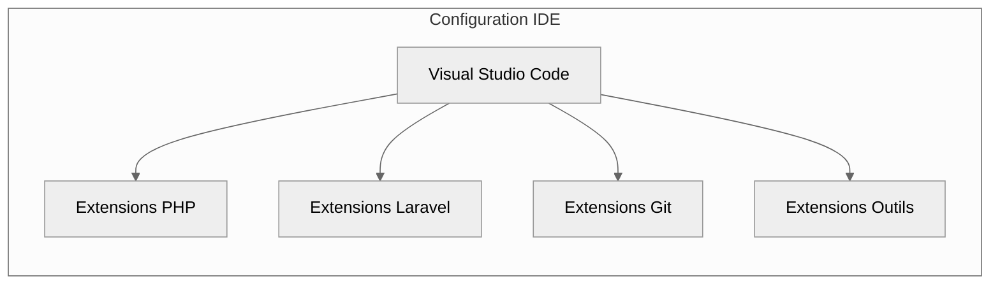
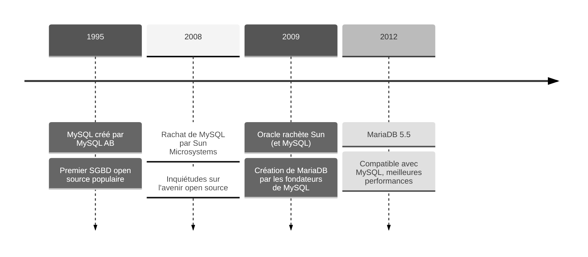
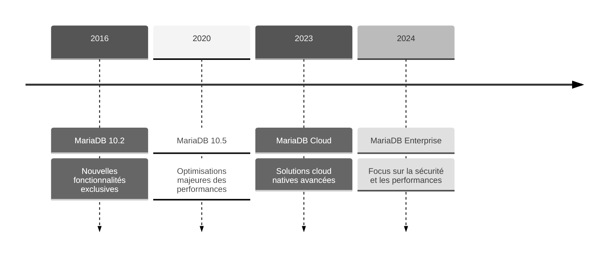
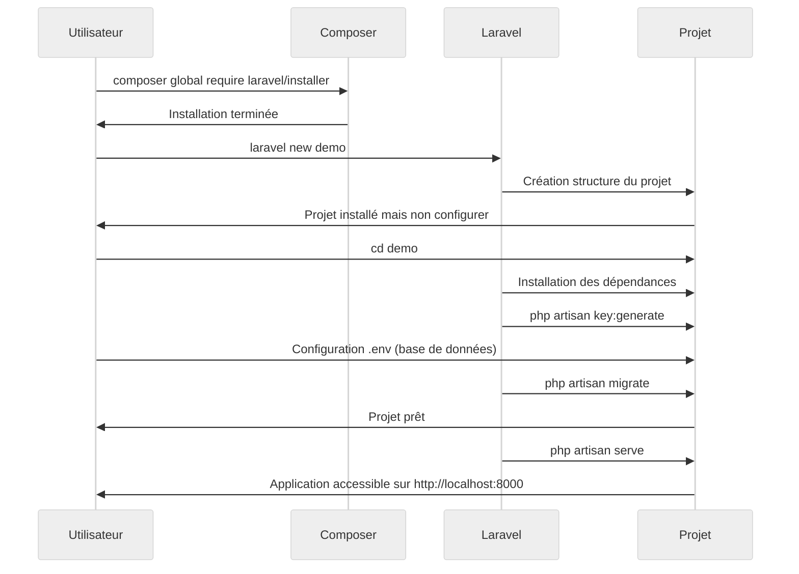

# Installation et configuration

## Rappel sur les Prérequis Techniques

:::warning **Important**
Avant de commencer avec Laravel, assurez-vous de maîtriser les prérequis suivants pour une expérience d'apprentissage optimale.
:::

### Connaissances Techniques

-   **PHP 8.2+** : _Maîtrise des concepts fondamentaux et des nouveautés._
-   **Base de données** : _Expérience avec MySQL / MariaDB ou PostgreSQL, requêtes simple & complexes._
-   **Front-end** : _HTML5, CSS3, et bases du responsive design._
-   **JavaScript** : _Manipulation du DOM, AJAX, promesses._
-   **POO** : _Classes, héritage, interfaces, namespaces._

**C'est évident mais autant le préciser quand même**

-   **Tailwind CSS** : _Connaître les fondamentaux est essentiel._
-   **Laravel** : _Connaître le fonctionnement de Laravel est obligatoire._

### Environnement de Développement

-   **Docker** : _Pour la conteneurisation de l'environnement._ ( **Non obligatoire mais c'est un gros +** )
-   **Composer** : _Gestionnaire de dépendances PHP._
-   **Node.js & NPM** : _Pour la compilation des assets._
-   **IDE recommandé** : _PHPStorm ( **payant** ) ou VS Code ( **Celui que j'utilise** ) avec extensions PHP._

:::info Pour les utilisateurs de Docker
Laravel propose une configuration optimisée ( **Laravel Sail** ) !!

-   **Laravel Sail** : _Inclus dans Laravel pour une configuration Docker préconfigurée et optimisée_
-   **Services conteneurisés principaux** :
    -   **PHP-FPM :** _Gestionnaire de processus PHP_
    -   **Nginx :** _Serveur web haute performance_
    -   **MySQL / MariaDB - PostgreSQL :** _Systèmes de gestion de base de données_
    -   **Redis :** _Cache et file d'attente_
    -   **Mailhog :** _Service de test d'emails_
-   **Extensibilité** : _Personnalisation complète via **`docker-compose.yml`** pour ajouter des services supplémentaires selon vos besoins ( **Elasticsearch**, **MongoDB**, etc.)_

:::

## Installation de Visual Studio Code

### Sur Windows

Téléchargez l'installeur depuis le site officiel de Visual Studio Code :

-   **[https://code.visualstudio.com/](https://code.visualstudio.com/)**

Lancez le fichier `.exe` et suivez les étapes d'installation en cochant **Ajouter à PATH** pour un accès via le terminal.

### Sur MacOS

```bash
# Installation de VS Code avec Homebrew
brew install --cask visual-studio-code
```

### Sur Linux

```bash
# Installation de VS Code avec snapstore
sudo snap install code --classic
```

## Configuration de Visual Studio Code

### Diagramme d'extension répartie en famille



### Extensions `PHP`

| Extension              | Description                                     | Importance  |
| ---------------------- | ----------------------------------------------- | ----------- |
| PHP Intelephense       | Support PHP avancé, autocomplétion, refactoring | Essentielle |
| PHP Debug              | Débogage PHP avec XDebug                        | Essentielle |
| PHP Namespace Resolver | Gestion automatique des imports                 | Très utile  |
| PHP DocBlocker         | Génération de documentation PHPDoc              | Utile       |
| PHP Sniffer            | Vérification de la qualité du code              | Utile       |
| Better PHPUnit         | Exécution de tests unitaires                    | Utile       |

### Extensions `Laravel`

| Extension                  | Description                            | Importance  |
| -------------------------- | -------------------------------------- | ----------- |
| Laravel Artisan            | Commandes Artisan depuis VSCode        | Essentielle |
| Laravel Blade Snippets     | Snippets pour les templates Blade      | Essentielle |
| Laravel Snippets           | Snippets pour le code Laravel          | Essentielle |
| Laravel Extra Intellisense | Autocomplétion pour routes, vues, etc. | Très utile  |
| Laravel Goto View          | Navigation rapide entre vues           | Utile       |
| Laravel Model Snippets     | Snippets pour les modèles              | Utile       |
| DotENV                     | Support pour les fichiers .env         | Très utile  |

### Extensions `Git`

| Extension   | Description                            | Importance  |
| ----------- | -------------------------------------- | ----------- |
| GitLens     | Historique et annotations Git avancées | Essentielle |
| Git History | Visualisation de l'historique Git      | Utile       |
| Git Graph   | Visualisation graphique des branches   | Très utile  |
| PHP GitDoc  | Documentation automatique des commits  | Utile       |

### Extensions `Outils`

| Extension           | Description                            | Importance  |
| ------------------- | -------------------------------------- | ----------- |
| ESLint              | Linting JavaScript/TypeScript          | Essentielle |
| Prettier            | Formatage de code automatique          | Essentielle |
| EditorConfig        | Normalisation des styles de code       | Très utile  |
| Database Client     | Gestion des bases de données           | Très utile  |
| REST Client         | Test d'API directement depuis VSCode   | Utile       |
| Thunder Client      | Alternative à Postman intégrée         | Utile       |
| Error Lens          | Affichage des erreurs dans le code     | Très utile  |
| Project Manager     | Gestion de plusieurs projets           | Utile       |
| Material Icon Theme | Icônes distinctives pour les fichiers  | Recommandée |
| Peacock             | Identification visuelle des workspaces | Utile       |

## Installation de Git ( _Versionning_ )

### Sur Windows

Téléchargez l'installeur depuis le site officiel de Git **[https://git-scm.com/download/win](https://git-scm.com/download/win)**.
Lancez le fichier `.exe` et suivez les étapes d'installation en cochant "**Git from the command line and also from 3rd-party software**" pour un accès via le terminal.

### Sur MacOS

```bash
# Installation de git avec Homebrew
brew install git
```

### Sur Linux

```bash
# Installation de git
sudo apt install -y git
```

## Installation de PHP 8.4+ / Composer 3+ / Laravel 12+

_Cette installation remplace l'installation manuelle de chacun des outils, c'est un atout radicalement pratique, merci **php.new**._

### Sur Windows

**PowerShell à lancer en Administrateur**

```bash
# Installation de PHP 8.4+ / Composer 3+ / Laravel 12+
Set-ExecutionPolicy Bypass -Scope Process -Force; [System.Net.ServicePointManager]::SecurityProtocol =
[System.Net.ServicePointManager]::SecurityProtocol -bor 3072; iex (
(New-Object System.Net.WebClient).DownloadString('https://php.new/install/windows'))
```

:::danger Information relativement importante
**La commande doit impérativement être sur une seule ligne.**<br/>
_Nous avons effectué un saut de ligne après le " **3072; iex (** " uniquement pour améliorer la lisibilité._

:::

### Sur MacOS

```bash
# Installation de PHP 8.4+ / Composer 3+ / Laravel 12+
/bin/bash -c "$(curl -fsSL https://php.new/install/mac)"
```

### Sur Linux

```bash
# Installation de PHP 8.4+ / Composer 3+ / Laravel 12+
/bin/bash -c "$(curl -fsSL https://php.new/install/linux)"
```

## Installation de Node + NPM ( _pour les assets_ )

### Sur Linux & MacOS

:::note
La série de commandes est exactement la même sur Linux et Mac.
:::

```bash
# Installation de NVM
curl -o- https://raw.githubusercontent.com/nvm-sh/nvm/v0.40.3/install.sh | bash

# au lieu de redémarrer le shell
\. "$HOME/.nvm/nvm.sh"

# Télécharger et installer Node.js :
nvm install 24

# Vérifier la version de Node.js :
node -v # Doit afficher "v24.1.0".
nvm current # Doit afficher "v24.1.0".

# Vérifier la version de npm :
npm -v # Doit afficher "11.3.0".
```

_Le code provient du site officiel de node pour intaller **NVM**._

:::info Qu'est-ce que **NVM** ?
**NVM** signifie **Node Version Manager**, il permet d'installer et de switcher très simplement entre différentes versions de node sans
créer de conflit. Ce qui est très pratique dans le monde du développement Web.
:::

### Sur Windows

:::note
Nous allons utiliser **Chocolatey**, le gestionnaire de paquets pour Windows.<br />
_Vous vous doutez bien qu'il faut que ce dernier soit installé sur votre système, c'est une évidence qui devait être dite..._
:::

**PowerShell à lancer en Administrateur**

```bash
# Installation de Chocolatey :
powershell -c "irm https://community.chocolatey.org/install.ps1|iex"

# Télécharger et installer Node.js :
choco install nodejs-lts --version="24"

# Vérifier la version de Node.js :
node -v # Doit afficher "v24.1.0".

# Vérifier la version de npm :
npm -v # Doit afficher "11.3.0".
```

## Vérifications post-installation

Avant de continuer il est important de vérifier que dans notre terminal chaque commande qui suit doit retourner un numéro de version.

```bash
# Section à ajouter : "Vérifier l'installation"
php --version
composer --version
laravel --version
node --version
npm -v
```

## Installation de MariaDB

### Sur Windows

**Lancez PowerShell en Administrateur**

```bash
# Installation de MariaDB avec Chocolatey
choco install mariadb

# Activer MariaDB au démarrage
sc.exe config "MySQL" start=auto

# Démarrer MariaDB
net start MySQL

# Vérifier le statut de MariaDB
sc.exe query MySQL
```

### Sur MacOS

```bash
# Installation de MariaDB avec Homebrew
brew install mariadb

# Activation au démarrage du système
brew services start mariadb

# Vérifier que MariaDB est bien lancé
brew services list | grep mariadb
```

### Sur Linux

```bash
# Installation de MariaDB
sudo apt install -y mariadb-server

# Activation au démarrage du système
sudo systemctl enable mariadb

# Démarrer MariaDB
sudo systemctl start mariadb

# Voir le statut de MariaDB
sudo systemctl status mariadb
```

## Pourquoi choisir MariaDB ?

:::info
**MariaDB** se distingue comme une alternative supérieure à **MySQL**, particulièrement pour les projets Laravel modernes.<br />
Voici pourquoi :

-   **Performance optimisée** : _Architecture repensée offrant de meilleures performances pour les requêtes complexes_
-   **Sécurité renforcée** : _Cycles de mise à jour plus rapides et correctifs de sécurité proactifs_
-   **Open Source pur** : _Contrairement à MySQL, MariaDB maintient une philosophie 100% open source_
-   **Innovation continue** : _Développement actif de nouvelles fonctionnalités par une communauté dynamique_

:::

Le tableau comparatif ci-dessous illustre en détail ces différences fondamentales entre les deux systèmes de gestion de base de données.

|   Critère   | MariaDB                                           | MySQL                                 |
| :---------: | ------------------------------------------------- | ------------------------------------- |
|   Licence   | GPL ( **100% Open Source** )                      | Dual licence ( **Propriétaire/GPL** ) |
| Performance | Meilleure optimisation des requêtes               | Performance standard                  |
|  Sécurité   | Patches de sécurité plus rapides                  | Dépend de Oracle                      |
| Communauté  | Très active et réactive                           | Limitée par Oracle                    |
| Innovations | Développement rapide de nouvelles fonctionnalités | Cycle plus lent                       |

### Timeline chronologique pour comprendre

**Évolution et Avantages de MariaDB par rapport à MySQL - Partie 1/2**



**Évolution et Avantages de MariaDB par rapport à MySQL - Partie 2/2**



:::tip Avantages clés de MariaDB

-   Sécurité renforcée avec des mises à jour plus fréquentes
-   Meilleures performances avec **le moteur de stockage Aria**
-   Compatible avec MySQL mais avec plus de fonctionnalités
-   Communauté plus active et réactive
-   **100% open source sans restrictions commerciales**

:::

## Sécurisation de MariaDB

:::danger Étape essentielle
Pour **garantir une installation sécurisée de MariaDB**, il est **impératif** d'exécuter la commande de sécurisation suivante :

```bash
# Sécurisation de MariaDB
sudo mariadb-secure-installation
```

Cette commande interactive déclenche **un assistant de configuration avancé** qui accompagne l'administrateur à travers plusieurs
étapes cruciales pour renforcer la sécurité de l'installation MariaDB.

:::

**L'assistant configure les mesures de sécurité suivantes :**

-   **Mot de passe root robuste**<br />
    _Protection renforcée de l'accès administrateur avec une politique de mot de passe strict._

-   **Suppression des comptes anonymes**<br />
    _Élimination des risques d'accès non authentifiés au système._

-   **Restriction d'accès réseau**<br />
    _Limitation aux connexions locales uniquement pour une sécurité optimale._

-   **Nettoyage des bases test**<br />
    _Suppression des bases de données de test pour réduire la surface d'attaque potentielle._

### J'ai oublié mon mot de passe !!

Pas de panique, si vous avez oublié votre mot de passe **root MariaDB**, voici la procédure pour le réinitialiser :

```bash
# Réinitialisation du mot de passe "root" via l'assistant de sécurisation de MariaDB
sudo mariadb-secure-installation
```

Cette commande vous permettra de **réinitialiser le mot de passe root** tout en vérifiant les autres paramètres de sécurité.<br />
**C'est la méthode recommandée car elle assure que toutes les mesures de sécurité sont bien en place.**

:::danger Important
_Assurez-vous de choisir **un nouveau mot de passe fort** et de **le stocker de manière sécurisée** pour éviter d'avoir à répéter
cette procédure plusieurs fois._
:::

:::note
_Cette méthode ne nécessite pas d'arrêter le service MariaDB ni de le démarrer en mode sans authentification,
ce qui la rend plus sûre et plus simple à exécuter._
:::

## Installation d'un premier projet Laravel

### Comprendre chaque phase

_Voici **un diagramme de Séquence** pour comprendre les phases d’installation d’un projet Laravel._



<br />

:::note
Dans ce diagramme de séquence j'utilise la commande **`laravel new demo`**.<br />
Par défaut cette commande ne fonctionne pas il faut installer la **CLI** ( _Command Line Interface_ ) de Laravel.<br />
_C'est justement le point suivant._
:::

## Installation globale de Laravel CLI

### Sur Windows

```bash
# Installation de Laravel globalement
composer global require laravel/installer

# Ajouter le chemin Composer à PATH
set PATH=%PATH%;%USERPROFILE%\AppData\Roaming\Composer\vendor\bin

# Vérifier l'installation
laravel -v
```

:::danger Important
Sur Windows, **il est important d'ajouter manuellement le chemin Composer aux variables d'environnement PATH** pour que la commande
**`laravel`** soit accessible globalement.

_Cette configuration ne nécessite qu'un redémarrage du terminal pour être active._

:::

### Sur MacOS ( _avec Zsh_ )

```bash
# Installation de Laravel globalement dans : "~/.composer/vendor/bin/"
composer global require laravel/installer

# Permettre l'utilisation de laravel directement
echo 'export PATH="$PATH:$HOME/.composer/vendor/bin"' >> ~/.zshrc

# Redémarrer zshrc sans devoir relancer un nouveau terminal
source ~/.zshrc

# Vérifier si laravel est disponible
laravel -v
```

### Sur Linux ( _avec Bash_ )

```bash
# Installation de Laravel globalement dans : "~/.config/composer/vendor/bin/"
composer global require laravel/installer

# Permettre l'utilisation de laravel directement
echo 'export PATH="$PATH:$HOME/.config/composer/vendor/bin"' >> ~/.bashrc

# Redémarrer bashrc sans devoir relancer un nouveau terminal
source ~/.bashrc

# Vérifier si laravel est disponible
laravel -v
```

## Mise en place du projet

Une fois Laravel CLI installé globalement, nous pouvons créer notre projet Laravel.
Pour cela, nous allons utiliser la commande `laravel new` qui va générer une nouvelle application Laravel avec tous les fichiers
nécessaires.

**Il existe deux méthodes principales pour créer un nouveau projet :**

-   **Via Composer** : **`composer create-project laravel/laravel nom-projet`**<br />
    _Méthode alternative offrant plus de flexibilité dans la configuration initiale_

    ```bash
    # Créer un nouveau projet Laravel avec composer directement
    composer create-project laravel/laravel mon-projet

    # Aller dans le dossier du projet
    cd mon-projet
    ```

-   **Via Laravel CLI** : **`laravel new nom-projet`** ( _Celle que l’on va utiliser ici_ )<br />
    _Méthode recommandée pour un développement rapide et simple_

    ```bash
    # Créer un nouveau projet Laravel avec composer directement
    laravel new mon-projet

    # Aller dans le dossier du projet
    cd mon-projet
    ```

:::info Conseil
La méthode Laravel CLI est généralement préférée car **elle inclut automatiquement les dernières optimisations** et **bonnes pratiques
recommandées par l'équipe Laravel**.
:::

### Création du projet de démonstration

```bash
# Création du projet
laravel new demo

# Se rendre dans le projet
cd demo
```

**Plusieurs questions seront posées** :

1.  Which starter kit would you like to install?<br />
    **Traduction :** _Quel kit de démarrage aimeriez-vous installer ?_<br />
    **Choix effectuer pour débuter :** _none_

2.  Which database will your application use?<br />
    **Traduction :** _Quelle base de données souhaitez vous utiliser ?_<br />
    **Choix effectuer pour débuter :** _MariaDB_

    :::note
    Dans des projet ultra simple on préfèrera **SQLite** pour développer, ici il est question de configurer un environnement avec une base
    de données qui oblige à rentrer dans la configuration de celle-ci.
    :::

3.  Default database updated. Would tou like to run the default database migrations<br />
    **Traduction :** _Base de données à jour par féfaut. Aimeriez-vous lancer les migrations de la base de données par défaut?_<br />
    **Choix effectuer pour débuter :** _No_

    :::info Pourquoi Non ?
    Nous allons devoir apprendre et comprendre ce qu'est **une migration**, de plus la base de données n'est pas encore configurer ce
    qui provoquera indéniablement une erreur de compilation.
    :::

4.  Would tou like to run **`npm install`** and **`npm run build`**?<br />
    **Traduction :** _Aimeriez-vous lancer **`npm install`** et **`npm run build`** ?_<br />
    **Choix effectuer pour débuter :** _No_

    :::info Pourquoi encore Non ?
    Même chose que précédemment. Une erreur sera soulevée.
    :::

_à cette étape l'installation est arrivé à son terme. Il ne nous reste plus qu'à se déplacer dans le répertoire de travail correspondant
au projet que l'on vient de créer soit **Demo**_

```bash
# Déplacement dans le répertoire du projet demo
cd demo
```

### Installation des dépendances pour les assets du projets

Pour gérer efficacement les assets ( _CSS, JavaScript, images_ ) de notre projet Laravel, nous devons installer et configurer
les outils de build nécessaires.

Voici les étapes à suivre :

```bash
# Installation des dépendances grâce à Node.js et plus particulière npm (node package manager)
npm install

# Installation de Vite ( *bundler par défaut de Laravel* )
npm install --save-dev vite
```

:::info
Laravel utilise **`Vite.js`** comme bundler par défaut depuis la **version 9.x**.<br />
_Il remplace **`Laravel Mix`** pour une expérience de développement plus rapide et plus moderne._
:::

### Générer une nouvelle clé de sécurité

**Importance de la Clé de Sécurité dans Laravel**

La clé de sécurité configurée dans le fichier **`.env`** représente un **élément fondamental et critique** pour la sécurité de votre
application Laravel. Cette clé cryptographique joue un rôle central dans plusieurs aspects de sécurité :

-   **Chiffrement des Sessions**<br />
    _Protection des données de session contre les accès non autorisés et les manipulations malveillantes_

-   **Sécurisation des Cookies**<br />
    _Garantie de l'intégrité et de la confidentialité des données stockées côté client_

-   **Protection des Données Sensibles**<br />
    _Chiffrement robuste des informations critiques stockées dans l'application_

-   **Authentification Sécurisée**<br />
    _Renforcement des mécanismes d'authentification et de gestion des tokens_

:::danger C'est un impératif
Il est **absolument crucial** de générer une nouvelle clé unique pour chaque installation de votre application.<br />
Cette pratique est essentielle pour :

-   **Éviter les Vulnérabilités**<br />
    _Prévenir les risques d'exploitation de clés par défaut ou partagées_

-   **Garantir l'Isolation**<br />
    _Assurer que chaque instance de l'application dispose de son propre environnement sécurisé_

:::

**Commande pour générer une nouvelle clé** :

```bash
# Générer une nouvelle clé d'application
php artisan key:generate
```

:::info
**Cette commande doit être exécutée une seule fois lors de l'installation initiale.**
_La clé générée sera automatiquement stockée dans votre fichier **.env** sous la variable **APP_KEY**._
:::danger Évidemment
**Ne partagez jamais cette clé publiquement.**
:::

## Création de la base de données

:::warning
La création de la base de données et la configuration d'un utilisateur dédié pour son administration doit être unique, c'est
une base fondamentale de la sécurité. Tout projet doit disposer d'un administrateur unique qui ne peut interagir avec une quelconque
autre base de données que la sienne. C'est ce qu'on appelle la séparation des privilèges.<br />
:::

Pour accéder à **`MySQL`** en tant que **root** depuis le terminal, utilisez l'une des commandes suivantes :

```bash
# Méthode 1 : Connexion directe (si mot de passe root configuré)
mysql -u root -p

# Méthode 2 : Connexion via sudo (sur Linux/Mac)
sudo mysql -u root
```

:::note
Le mot de passe saisie ne s'affichera pas, c'est une sécurité **UNIX**. C'est donc tout à fait normal.
:::

Une fois connecté vous obtiendrez ceci dans votre terminal :

```bash
mysql>
```

Si c'est le cas c'est que vous êtes bien connecté sur MySQL à partir du terminal.<br />
Nous allons pouvoir saisir les commandes SQL suivantes qui nous permettrons de mettre en place un environnement sécurisé
et optimisé pour notre application Laravel :

```sql
-- Création de la base de données avec encodage UTF-8
CREATE DATABASE demo CHARACTER SET utf8 COLLATE utf8_general_ci;

-- Création d'un utilisateur dédié avec son mot de passe
CREATE USER 'demo_user'@'localhost' IDENTIFIED BY 'votreMotDePasseUltraSecure';

-- Attribution de tous les droits sur la base 'nom_bdd' à l'utilisateur
GRANT ALL PRIVILEGES ON demo.* TO 'demo_user'@'localhost';

-- Application des modifications des privilèges
FLUSH PRIVILEGES;

-- Sortie de MySQL
EXIT;
```

:::danger Important
Il est évident encore une fois qu'il faut **remplacer** :

-   **`demo`** en fonction du nom de la base de données que vous souhaitez.
-   **`demo_user`** par votre nom d'utilisateur
-   **`votreMotDePasseUltraSecure`** par un mot de passe fort et unique

Surtout, et **c'est très important**, ne réutilisez jamais les mots de passe de **production** en **développement**.
:::

### Configuration du fichier `.env`

Le fichier `.env` est crucial pour la configuration de votre application Laravel.<br />
Il contient toutes **les variables d'environnement** nécessaires au bon fonctionnement de votre application.

En fonction de l'**utilisateur** et de la **base de données** créés précédemment, ajustons la configuration :<br />
( _sera différent chez vous_ )

```perl
APP_NAME="Demo"
APP_ENV=local
APP_DEBUG=true
APP_URL=http://localhost:8000

DB_CONNECTION=mysql
DB_HOST=127.0.0.1
DB_PORT=3306
DB_DATABASE=demo
DB_USERNAME=demo_user
DB_PASSWORD=votreMotDePasseUltraSecure
```

:::warning Pourquoi choisir mysql alors que l'on a configurer MariaDB ensemble ?
C'est extrêmement simple, pour **MariaDB**, **nous utilisons le même pilote MySQL** ( **`DB_CONNECTION=mysql`** ) car **MariaDB**
est tout simplement **un fork de MySQL** et reste compatible avec le pilote **MySQL de Laravel**.
:::

:::note
**Vous comprenez maintenant l'importance de ne pas divulguer ce fichier** et donc de ne pas le versionner dans **Git**.<br />
_Il contient toutes les données sensibles qui pourrait nuire à votre entreprise._
:::

:::tip Astuce
Créer ou éditer un fichier `.env.example` qui sera une copie initiale avec toutes les variables existantes **mais non définies**.
:::

**Commande pour créer une copie du `.env.example` en `.env`** pour le rendre fonctionnel.

```bash
# Création d'une copie du fichier .env d'exemple pour le rendre opérationnel
cp .env.example .env
```

### Appliquer les changements avec artisan

Avant de démarrer le serveur de développement, il est crucial d'exécuter les migrations de base de données.

:::info Mais qu'est-ce qu'une migration dans Laravel ?
_Les migrations sont un système de contrôle de version pour votre base de données, permettant à votre équipe de modifier et
de partager facilement le schéma de la base de données._
:::

```bash
# Exécuter les migrations
php artisan migrate
```

#### Pourquoi les migrations sont importantes ?

-   **Versionner le Schéma de Base de Données**<br />
    _Permet un suivi précis des modifications structurelles et facilite la gestion des versions de votre base de données au fil du temps._

-   **Collaboration en Équipe Optimisée**<br />
    _Maintient une synchronisation parfaite des structures de base de données entre tous les membres de l'équipe, évitant les conflits et
    incohérences._

-   **Système de Rollback Sécurisé**<br />
    _Offre la possibilité de revenir à des versions antérieures de la base de données en cas d'erreurs ou de problèmes, assurant ainsi la
    stabilité de l'application._

-   **Cohérence Multi-environnements**<br />
    _Garantit une parfaite uniformité entre les différents environnements ( **développement**, **staging**, **production**), réduisant les
    risques d'erreurs lors des déploiements._

-   **Traçabilité et Audit**<br />
    _Permet de suivre l'historique complet des modifications de **la structure de la base de données**, facilitant **les audits** et
    **la résolution de problèmes**._

_Une fois les migrations effectuées, nous pouvons procéder aux commandes d'optimisation :_

```bash
# Effacer le cache de configuration
php artisan config:clear

# Optimiser l'application
php artisan optimize

# Démarrer le serveur de développement
php artisan serve

# Ou, personnaliser le port et l'hôte
php artisan serve --port=8080 --host=0.0.0.0
```

:::tip Succès
Si tout est correctement configuré, votre application devrait maintenant être accessible à l'adresse **`http://localhost:8000`**.
:::

## Découverte de la structure de Laravel

### Arborescence complète du projet

Voici la structure détaillée des dossiers et fichiers d'un projet Laravel standard.
_Cette organisation hiérarchique est conçue pour suivre les meilleures pratiques de développement et faciliter la maintenance du code._

```bash
demo/
├── app/                # Cœur de l'application
│   ├── Console/          # Commandes Artisan personnalisées
│   ├── Http/             # Controllers, Middleware, Requests
│   ├── Models/           # Modèles Eloquent
│   └── Providers/        # Service Providers
├── config/             # Fichiers de configuration
├── database/           # Contient les fichiers relatifs à la BDD
│   ├── migrations/       # Fichiers définissant les modifications de la BDD
│   ├── seeds/            # Fichier permettant de peupler la BDD
├── public/             # Point d'entrée et assets publics
├── resources/          # Vues, assets non compilés
├── routes/             # Définition des routes
├── storage/            # Contient les fichiers générés par l'application
│   ├── app/              # Contient les fichiers stockés par l'application
│   ├── framework/        # Contient les fichiers de cache, logs, sessions
│   ├── logs/             # Contient les fichiers de log
└── tests/              # Contient les tests automatisés de l'application
    ├── Feature/       # Contient les tests fonctionnels
    ├── Unit/            # Contient les tests unitaires
```

### Rôle et fonction de chaque dossier

Voici une description détaillée du rôle de chaque dossier principal dans un projet Laravel et leur importance dans l'architecture globale de
l'application. Chaque dossier a une responsabilité spécifique et contribue à maintenir une structure propre et organisée. Cette organisation
modulaire permet de suivre les principes **SOLID** et facilite la maintenance du code.

|  Dossier   | Description                                     | Responsabilité |
| :--------: | ----------------------------------------------- | :------------: |
|    app/    | _Contient la logique métier de l'application_   |    Primaire    |
|  config/   | _Stocke tous les fichiers de configuration_     |    Critique    |
| database/  | _Gère les migrations et seeds_                  |  Essentielle   |
| resources/ | _Contient les vues et assets non compilés_      |   Importante   |
|  routes/   | _Définit toutes les routes de l'application_    |    Critique    |
|  storage/  | _Stocke les fichiers générés par l'application_ |    Support     |
|   tests/   | _Contient tous les tests automatisés_           |  Essentielle   |

### Importance des fichiers de configuration

Les fichiers de configuration dans Laravel jouent un **rôle crucial** dans la personnalisation et le contrôle du comportement de l'application.
Situés dans le dossier `config/`, ils permettent de définir les **paramètres essentiels** comme la _base de données, le cache, la session,
et les services externes_. Chaque fichier est organisé de manière **modulaire** et retourne un _tableau PHP_ contenant les configurations
spécifiques.

|   Fichier    | Description                               | Importance |
| :----------: | ----------------------------------------- | :--------: |
|   app.php    | _Configuration générale de l'application_ |  Critique  |
| database.php | _Connexions aux bases de données_         |  Critique  |
|   mail.php   | _Configuration des services mail_         | Important  |
|  cache.php   | _Systèmes de cache_                       | Important  |
|   auth.php   | _Authentication et autorisation_          |  Critique  |
