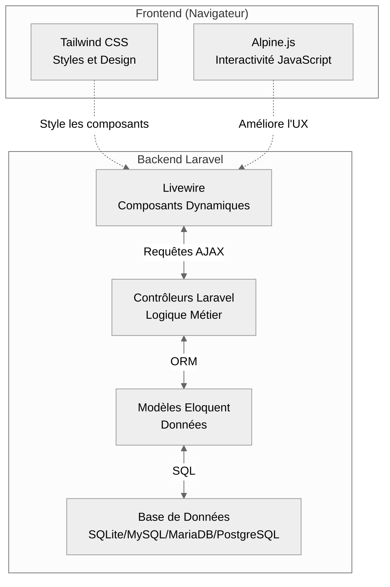

import MyImage from '@site/src/components/MyImage';

# Présentation

Cette documentation détaillée présente l'architecture **TALL** ( **Tailwind CSS**, **Alpine.js**, **Laravel**, **Livewire** ), qui
n'est autre qu'une **alternative moderne** aux frameworks JavaScript traditionnels. _Par cette documentation, je vais tenter de créer
un guide complet au fur et à mesure que je découvre cette Stack_, ainsi vous découvrirez pourquoi cette stack gagne en **popularité**,
ses **avantages comparatifs**, et comment elle peut **optimiser** significativement vos projets de développement web.

:::note
_Cette Stack s'adresse aux développeurs **PHP francophones** cherchant une approche plus intuitive et efficace pour créer
des applications web interactives avec une courbe d'apprentissage réduite et des performances exceptionnelles._
:::

:::info Documentation exhaustive et précise
Cette documentation est conçue pour être **complète et détaillée dans les moindres aspects**, permettant une compréhension
approfondie de chaque concept.

_Mon objectif est de vous offrir une ressource où **toutes vos questions trouvent réponse**, éliminant ainsi les incertitudes qui
pourraient freiner votre progression. C'est, à mon sens, en fournissant des explications claires et exhaustives que nous bâtissons
une base solide d'apprentissage, ce qui est au cœur de ma philosophie._
:::

## Qu'est-ce que la Stack TALL ?

La stack TALL repose sur quatre technologies qui **s'articulent parfaitement ensemble**.
Il y a tout d'abord **Tailwind CSS** pour styliser l'interface de manière élégante et responsive, puis nous avons **Alpine.js** pour
apporter de la **réactivité côté client**, ensuite nous avons **Livewire** pour la **réactivité** cette fois-ci _côté serveur_ et
enfin **Laravel**, le **framework PHP n°1 dans le monde**, qui constitue la fondation solide de cette stack.

---

### **T** - Tailwind CSS

<MyImage
    name="Logo officiel de Tailwind CSS"
    src="https://icon.icepanel.io/Technology/svg/Tailwind-CSS.svg"
    alt="Représentation du logo officiel de Tailwind CSS"
/>

**T**ailwind CSS : Framework CSS moderne et utilitaire qui révolutionne le design web avec une approche unique basée sur des
**classes atomiques prédéfinies**.

:::warning Qu'est-ce qu'une classe atomique ?
Une classe atomique dans le contexte de **Tailwind CSS** fait référence à **une classe CSS qui a une seule responsabilité** ou
**fonction spécifique**. _Le terme "**atomique**" vient de l'idée qu'il s'agit de la plus petite unité fonctionnelle possible._
:::

:::note
_Tailwind CSS utilise donc une méthodologie "**utility-first**" permettant de construire rapidement des interfaces responsives sans
écrire de CSS personnalisé, le tout en gardant une cohérence visuelle à travers l'application._
:::

**Les principaux avantages incluent :**

<dl style={{ marginLeft: '40px'}}>

    <dt>**Productivité accrue**</dt>
    <dd>_Développement rapide sans switcher entre fichiers CSS._</dd>

    <dt>**Personnalisation flexible**</dt>
    <dd>_Configuration adaptable via tailwind.config.js._</dd>

    <dt>**Responsive by design**</dt>
    <dd>_Classes intuitives pour tous les breakpoints._</dd>

    <dt>**Performance optimisée**</dt>
    <dd>_Purge automatique du CSS inutilisé en production._</dd>

</dl>

#### Auteur de Tailwind CSS

<MyImage
    name="Adam Wathan - Créateur"
    src="https://cdn.devdojo.com/images/august2022/adam-wathan.jpeg"
    alt="Auteur de Tailwind CSS"
/>

### **A** - Alpine.js

<MyImage
    name="Logo officiel d'Alpine.js"
    src="https://icon.icepanel.io/Technology/png-shadow-512/Alpine.js.png"
    alt="Représentation du logo d'Alpine.js"
/>

**A**lpine.js : Framework JavaScript léger qui apporte l'interactivité côté client avec une syntaxe simple et élégante.

:::note
_Ce framework minimaliste ( seulement 7.1kB ) permet d'ajouter des comportements dynamiques sans la complexité de frameworks plus
lourds comme React ou Vue.js_
:::

**Les principaux avantages incluent :**

<dl style={{ marginLeft: '40px'}}>

    <dt>**Performances optimales**</dt>
    <dd>_Exécution rapide, chargement minimal._</dd>

    <dt>**Simplicité d'utilisation**</dt>
    <dd>_Syntaxe déclarative et intuitive._</dd>

    <dt>**Intégration native**</dt>
    <dd>_Fonctionne parfaitement avec Livewire._</dd>

</dl>

#### Auteur d'Alpine.js

<MyImage
    name="Caleb Porzio - Créateur d'Alpine.js & de Livewire"
    src="https://cdn.devdojo.com/images/august2022/caleb.jpeg"
    alt="Auteur de Livewire & d'Alpine.js"
/>

### **L** - Livewire

<MyImage
    name="Logo officiel de Livewire"
    src="https://icon.icepanel.io/Technology/svg/Livewire.svg"
    alt="Représentation du logo de Livewire"
/>

**L**ivewire : Framework qui connecte le backend Laravel au frontend de manière élégante.

:::note
_Cette couche magique permet de créer des interfaces interactives en temps réel sans écrire de JavaScript, tout en gardant la puissance de Laravel._
:::

**Les principaux avantages incluent :**

<dl style={{ marginLeft: '40px'}}>

    <dt>**Performances optimales**</dt>
    <dd>_Mise à jour partielle du DOM._</dd>

    <dt>**État synchronisé**</dt>
    <dd>_Données backend/frontend toujours cohérentes._</dd>

    <dt>**Développement rapide**</dt>
    <dd>_Composants réutilisables._</dd>

    <dt>**Intégration native**</dt>
    <dd>_Parfaite synergie avec Laravel._</dd>

</dl>

#### Auteur de Livewire

:::note
**Il ne s'agit pas d'une erreur**, il est bien le créateur de Livewire et d'Alpine.js présenté précédemment.
:::

<MyImage
    name="Caleb Porzio - Créateur de Livewire & Alpine.js"
    src="https://cdn.devdojo.com/images/august2022/caleb.jpeg"
    alt="Auteur de Livewire & d'Alpine.js"
/>

### **L** - Laravel

<MyImage
    name="Logo officiel de Laravel"
    src="https://icon.icepanel.io/Technology/svg/Laravel.svg"
    alt="Représentation du logo de Laravel"
/>

**L**aravel : Framework PHP robuste pour le backend.

:::note
_Ce framework moderne offre une architecture MVC complète, une gestion élégante des bases de données via Eloquent ORM, et un
écosystème riche d'outils et de packages._
:::

**Les principaux avantages incluent :**

<dl style={{ marginLeft: '40px'}}>

    <dt>**Sécurité intégrée**</dt>
    <dd>_Protection CSRF, XSS, et authentication._</dd>

    <dt>**Performance optimale**</dt>
    <dd>_Cache, queues, et sessions._</dd>

    <dt>**Outils développeur**</dt>
    <dd>_Artisan CLI, Tinker, et debugging._</dd>

    <dt>**Packages officiels**</dt>
    <dd>_Sanctum, Jetstream, et Breeze._</dd>

</dl>

#### Auteur de Livewire

<MyImage
    name="Taylor Otwell - Créateur de Laravel"
    src="https://cdn.devdojo.com/images/august2022/taylor1.jpeg"
    alt="Auteur de Laravel"
/>

## Prérequis indispensables

:::info Information
Maintenant que l'on sait à quoi correspond la stack TALL, il est évident que des **notions fondamentales** sont attendues pour
permettre d'assimiler au mieux cette documentation sereinement.

:::

1. **HTML & CSS** : _Les bases indispensables pour toute construction web_
2. **JavaScript** pour la partie AlpineJS : _Compréhension des fonctions, variables et événements_
3. **Compréhension des événements** pour la partie liée à Livewire : _Gestion des interactions utilisateur et des mises à jour dynamiques_
4. **Framework Tailwind CSS** : _Maîtrise des classes utilitaires et du concept "utility-first"_
5. **PHP et Programmation Orientée Objet (POO)** : _Connaissances impératives pour bien aborder Laravel et son paradigme MVC_

## Architecture de la Stack TALL

### Schéma de compréhension



### Approche Pédagogique

-   **Accessibilité**<br />
    _Documentation intégralement en français avec explications techniques claires et précises pour les développeurs francophones._

-   **Méthodologie**<br />
    _Progression structurée allant du fondamental à l'avancé avec :_

        - Exemples concrets et cas d'usage réels
        - Explications détaillées du "comment" et du "pourquoi"
        - Supports visuels (schémas, diagrammes et captures d'écran annotées)
        - Points de contrôle réguliers et exercices pratiques

-   **Expertise Technique**<br />
    _Exploration approfondie de chaque technologie à travers :_

        -   Rôle et contribution dans l'architecture globale
        -   Interactions et synergies entre les composants
        -   Patterns de conception recommandés
        -   Techniques d'optimisation pour des performances maximales

## Pourquoi la stack TALL ?

### Différence avec React/Vue Ou Angular ?

**La stack TALL : Une Alternative Moderne et Efficace**

La stack TALL se distingue significativement des frameworks JavaScript traditionnels comme **React**, **Vue** ou **Angular**.
_Cette stack innovante révolutionne l'approche du développement web moderne en privilégiant la **simplicité** et l'**efficacité**._

:::tip Avantage

-   **Architecture Simplifiée**<br />
    _Approche plus légère et intuitive, évitant la complexité excessive généralement associée aux **Single Page Applications** ( SPA )_

-   **Développement Agile**<br />
    _Grâce à la synergie entre **Livewire** et **Alpine.js**, le développement devient plus rapide et plus fluide, avec une courbe
    d'apprentissage optimisée_

-   **Performance Exceptionnelle**<br />
    _Des mises à jour DOM ciblées et intelligentes assurant une réactivité optimale de l'application_

-   **Simplicité et Productivité**<br />
    _Configuration minimale et réduction significative du code redondant comparé aux frameworks JS classiques_

-   **Performance Optimisée**<br />
    _Temps de chargement initial réduit et utilisation efficiente des ressources système_

-   **Maintenance Facilitée**<br />
    _Code plus structuré et debugging simplifié grâce à une architecture épurée et des dépendances minimales_

-   **Écosystème Cohérent**<br />
    _Intégration naturelle entre les composants, facilitant le développement d'applications robustes et évolutives_

:::

<MyImage
    src="https://logowik.com/content/uploads/images/vs-versus-symbol2575.logowik.com.webp"
    alt="Image représentant le sigle VS de Versus"
/>

:::danger Limitation des Autres Stacks

-   **Complexité Excessive**<br />
    _**React**, **Vue** et **Angular** nécessitent souvent une configuration complexe et une gestion laborieuse des états, rendant le
    développement plus chronophage. **Attention, Angular dans ses dernières versions à drastiquement évolué positivement.**_

-   **Surcharge JavaScript**<br />
    _Les frameworks JS traditionnels peuvent alourdir significativement le chargement initial avec des bundles JS volumineux._

-   **Fragmentation de l'Écosystème**<br />
    _Multiplication des dépendances et des outils nécessaires, augmentant la complexité de maintenance._

-   **SEO Complexe**<br />
    _Les SPA traditionnelles nécessitent des configurations supplémentaires pour optimiser le référencement.<br />
    Le **SSR** et le **SSG** vienent changer la donne également._

-   **Courbe d'Apprentissage Raide**<br />
    _Formation plus longue des équipes et adaptation complexe aux nouveaux concepts. **Mêmes si les tendances vont en s'améliorant.**_

-   **Coûts de Développement**<br />
    _Temps de développement plus long et ressources supplémentaires nécessaires pour la maintenance_

:::

## Comparaison des courbes d'apprentissage

Voici une analyse comparative de la difficulté d'apprentissage des différentes stacks de développement web :

| **Stack** | **Temps Estimé** | **Niveau de Difficulté** | **Principaux Défis**                                                       |
| :-------: | :--------------: | :----------------------: | -------------------------------------------------------------------------- |
|  Vue.js   |     3-4 mois     |      Modéré à Élevé      | _Composition API, Vuex, écosystème en évolution._                          |
|   React   |     4-6 mois     |          Élevé           | _Gestion d'état complexe, JSX, nombreux concepts avancés._                 |
|  Angular  |     6-8 mois     |        Très Élevé        | _TypeScript obligatoire, architecture complexe, RxJS._                     |
| **TALL**  |   **2-3 mois**   |        **Modéré**        | _**Comprendre l'écosystème Laravel, maîtriser les concepts de Livewire.**_ |

:::warning Facteurs Influençant l'Apprentissage

-   **Expérience Préalable**<br />
    _La connaissance de **PHP** accélère l'apprentissage de **TALL**, tandis que **JS** est nécessaire pour **React**/**Vue**/**Angular**_

-   **Documentation** :<br />
    _**TALL** bénéficie d'une documentation claire et structurée, particulièrement en anglais._ **[Lien ici](https://tallstack.dev/)**

-   **Ressources d'Apprentissage**<br />
    _React possède la plus grande communauté et le plus de ressources disponibles_

-   **Complexité Conceptuelle**<br />
    _Angular a fait beaucoup de progrès avec la version 20, simplifiant son apprentissage, bien que certains concepts spécifiques restent à maîtriser_

:::

### Comparaison TALL vs React & Vue

#### Compteur simple - React

```js
import React, { useState } from 'react';

function Counter() {
    // Utilisation du hook useState
    const [count, setCount] = useState(0);

    return (
        <div className="p-4 bg-gray-100 rounded">
            <h2 className="text-xl font-bold mb-4">Compteur React</h2>
            <p className="mb-4">Valeur : {count}</p>
            <button
                onClick={() => setCount(count + 1)}
                className="bg-blue-500 text-white px-4 py-2 rounded mr-2"
            >
                Incrémenter
            </button>
            <button
                onClick={() => setCount(0)}
                className="bg-red-500 text-white px-4 py-2 rounded"
            >
                Reset
            </button>
        </div>
    );
}

export default Counter;
```

#### Compteur simple - Vue.js

```html
<template>
    <div class="p-4 bg-gray-100 rounded">
        <h2 class="text-xl font-bold mb-4">Compteur Vue</h2>
        <p class="mb-4">Valeur : {{ count }}</p>
        <button
            @click="increment"
            class="bg-blue-500 text-white px-4 py-2 rounded mr-2"
        >
            Incrémenter
        </button>
        <button @click="reset" class="bg-red-500 text-white px-4 py-2 rounded">
            Reset
        </button>
    </div>
</template>

<script>
    import { ref } from 'vue';

    export default {
        setup() {
            const count = ref(0);

            const increment = () => {
                count.value++;
            };

            const reset = () => {
                count.value = 0;
            };

            return {
                count,
                increment,
                reset,
            };
        },
    };
</script>
```

#### Compteur simple - TALL Stack ( Livewire + Alpine.js )

**Composant Counter**

```php
<?php

namespace App\Http\Livewire;

use Livewire\Component;

class Counter extends Component
{
    public $count = 0;

    public function increment()
    {
        $this->count++;
    }

    public function reset()
    {
        $this->count = 0;
    }

    public function render()
    {
        return view('livewire.counter');
    }
}
```

**Vue Livewire ( Blade + Alpine.js )** - _Blade est le moteur de rendu de Laravel, j'y reviendrai plus tard._

```html
<div class="p-4 bg-gray-100 rounded">
    <h2 class="text-xl font-bold mb-4">Compteur TALL</h2>
    <p class="mb-4">Valeur : {{ $count }}</p>

    <button
        wire:click="increment"
        class="bg-blue-500 text-white px-4 py-2 rounded mr-2 hover:bg-blue-600
        transition-colors"
    >
        Incrémenter
    </button>

    <button
        wire:click="reset"
        class="bg-red-500 text-white px-4 py-2 rounded hover:bg-red-600 transition-colors"
    >
        Reset
    </button>
</div>
```

> Ce que j'aime dans la stack TALL c'est la séparation des concepts

## Qui utilisent la stack TALL

:::info **Adoption Croissante de la Stack TALL**

La stack **TALL** connaît une adoption grandissante dans l'écosystème web professionnel.
_De plus en plus d'entreprises et d'organisations choisissent cette technologie pour sa robustesse et son efficacité éprouvée en
environnement de production._

:::

### Entreprise Notables

-   **Laravel Forge** : _La plateforme officielle de déploiement Laravel, utilisée par des milliers de développeurs_
-   **Laravel Vapor** : _Service d'hébergement serverless par Laravel, optimisé pour les performances_
-   **Stripe** : _Intégration dans leur Dashboard utilisateur pour une expérience fluide_
-   **GitHub** : _Certaines fonctionnalités interactives de leur plateforme_

### Types de Projets

-   **Applications SaaS** : _Solutions métier évolutives et plateformes de service à haute disponibilité_
-   **E-commerce** : _Sites marchands performants avec gestion temps réel des stocks et paniers_
-   **Plateformes Collaboratives** : _Outils de gestion et de communication en temps réel_
-   **Dashboards** : _Interfaces d'administration et tableaux de bord interactifs_

## Et la performance dans tout ça ?

:::note Performance Exceptionnelle
La performance est un aspect **crucial** dans le développement web moderne, et la stack TALL **excelle particulièrement** dans ce domaine.
_Son architecture innovante redéfinit les standards de performance web._
:::

### Architecture Hybride Optimisée

-   Rendu côté serveur efficace
-   Mises à jour dynamiques ciblées
-   Temps de chargement initiaux optimisés
-   Excellente réactivité utilisateur

### Le meilleur des Deux Mondes

-   Performance brute de PHP
-   Interactivité du JavaScript moderne
-   Optimisation des ressources serveur
-   Expérience utilisateur fluide

_Cette synergie unique entre performances serveur et réactivité client fait de TALL une solution idéale pour les applications web
modernes exigeant haute performance et scalabilité._
