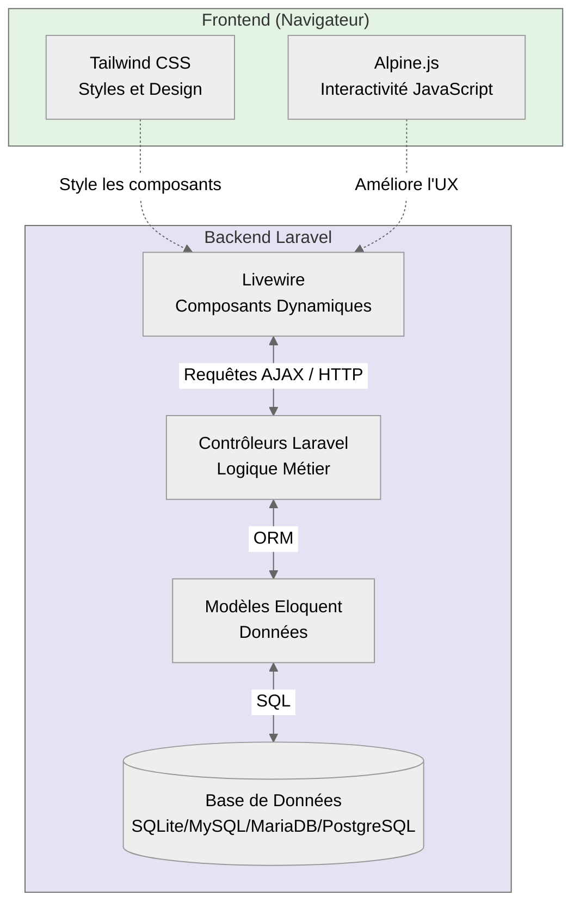
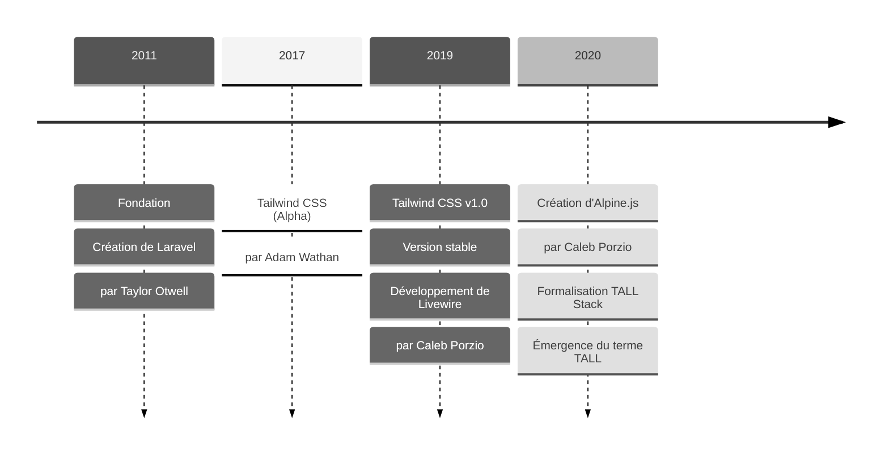
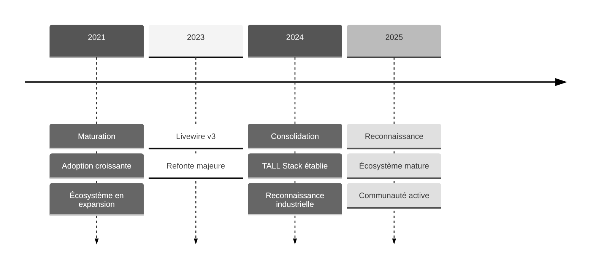

import MyImage from '@site/src/components/MyImage';

# Présentation

Cette documentation présente l'architecture **TALL** ( **Tailwind CSS**, **Alpine.js**, **Laravel**, **Livewire** ), une **alternative
moderne** aux frameworks JavaScript traditionnels. _Cette ressource évoluera au fur et à mesure de mon apprentissage de la stack._
Vous y découvrirez pourquoi TALL gagne en **popularité**, ses **avantages comparatifs**, et comment elle peut **optimiser** vos projets.

:::note
_Cette Stack s'adresse aux développeurs **PHP francophones** cherchant une approche plus intuitive et efficace pour créer
des applications web interactives avec une courbe d'apprentissage réduite et des performances exceptionnelles._
:::

:::info Documentation évolutive et approfondie
Cette documentation est conçue pour être **complète et détaillée**, évoluant progressivement pour couvrir tous les aspects
de la stack TALL et permettre une compréhension approfondie de chaque concept.

_Mon objectif est de construire avec vous une ressource où **vos questions trouveront réponse**, éliminant ainsi les incertitudes qui
pourraient freiner votre progression. C'est, à mon sens, en fournissant des explications claires et exhaustives que nous bâtissons
ensemble une base solide d'apprentissage, ce qui est au cœur de cette démarche._
:::

## Qu'est-ce que la Stack TALL ?

La stack TALL repose sur quatre technologies qui **s'articulent parfaitement ensemble**.
Il y a tout d'abord **Tailwind CSS** pour styliser l'interface de manière élégante et responsive, puis nous avons **Alpine.js** pour
apporter de la **réactivité côté client**, ensuite nous avons **Livewire** pour la **réactivité** cette fois-ci _côté serveur_ et
enfin **Laravel**, le **framework PHP n°1 dans le monde**, qui constitue la fondation solide de cette stack.

### Des auteurs emblématique

Les technologies qui composent cette stack ont été créées par des **développeurs reconnus mondialement**. Le fait qu'ils se soient unis
pour concevoir une stack technique cohérente comme celle présentée ici renforce considérablement son adoption.<br />

Mais qui sont-ils réellement ?

<div
    style={{
        display: 'grid',
        gridTemplateColumns: '1fr 1fr 1fr',
        gap: '20px',
    }}
>
    <MyImage
        name="Adam Wathan - Créateur de Tailwind CSS"
        src="https://cdn.devdojo.com/images/august2022/adam-wathan.jpeg"
        alt="Auteur de Tailwind CSS"
    />
    <MyImage
        name="Caleb Porzio - Créateur d'Alpine.js & de Livewire"
        src="https://cdn.devdojo.com/images/august2022/caleb.jpeg"
        alt="Auteur de Livewire & d'Alpine.js"
    />
    <MyImage
        name="Taylor Otwell - Créateur de Laravel"
        src="https://cdn.devdojo.com/images/august2022/taylor1.jpeg"
        alt="Auteur de Laravel"
    />
</div>

### Plus de précision sur cette Stack

#### **T** - Tailwind CSS

<MyImage
    name="Logo officiel de Tailwind CSS"
    src="https://icon.icepanel.io/Technology/svg/Tailwind-CSS.svg"
    alt="Représentation du logo officiel de Tailwind CSS"
/>

**T**ailwind CSS : Framework CSS moderne et utilitaire qui révolutionne le design web avec une approche unique basée sur des
**classes atomiques prédéfinies**.

:::warning Qu'est-ce qu'une classe atomique ?
Une classe atomique dans le contexte de **Tailwind CSS** fait référence à **une classe CSS qui a une seule responsabilité** ou
**fonction spécifique**. _Le terme "**atomique**" vient de l'idée qu'il s'agit de la plus petite unité fonctionnelle possible._
:::

:::note
_Tailwind CSS utilise donc une méthodologie "**utility-first**" permettant de construire rapidement des interfaces responsives sans
écrire de CSS personnalisé, le tout en gardant une cohérence visuelle à travers l'application._
:::

**Les principaux avantages incluent :**

<dl style={{ marginLeft: '40px'}}>

    <dt>**Productivité accrue**</dt>
    <dd>_Développement rapide sans switcher entre fichiers CSS._</dd>

    <dt>**Personnalisation flexible**</dt>
    <dd>_Configuration adaptable via tailwind.config.js._</dd>

    <dt>**Responsive by design**</dt>
    <dd>_Classes intuitives pour tous les breakpoints._</dd>

    <dt>**Performance optimisée**</dt>
    <dd>_Purge automatique du CSS inutilisé en production._</dd>

</dl>

---

#### **A** - Alpine.js

<MyImage
    name="Logo officiel d'Alpine.js"
    src="https://icon.icepanel.io/Technology/png-shadow-512/Alpine.js.png"
    alt="Représentation du logo d'Alpine.js"
/>

**A**lpine.js : Framework JavaScript léger qui apporte l'interactivité côté client avec une syntaxe simple et élégante.

:::note
_Ce framework minimaliste ( seulement 7.1kB ) permet d'ajouter des comportements dynamiques sans la complexité de frameworks plus
lourds comme React ou Vue.js_
:::

**Les principaux avantages incluent :**

<dl style={{ marginLeft: '40px'}}>

    <dt>**Performances optimales**</dt>
    <dd>_Exécution rapide, chargement minimal._</dd>

    <dt>**Simplicité d'utilisation**</dt>
    <dd>_Syntaxe déclarative et intuitive._</dd>

    <dt>**Intégration native**</dt>
    <dd>_Fonctionne parfaitement avec Livewire._</dd>

</dl>

---

#### **L** - Livewire

<MyImage
    name="Logo officiel de Livewire"
    src="https://icon.icepanel.io/Technology/svg/Livewire.svg"
    alt="Représentation du logo de Livewire"
/>

**L**ivewire : Framework qui connecte le backend Laravel au frontend de manière élégante.

:::note
_Cette couche magique permet de créer des interfaces interactives en temps réel sans écrire de JavaScript, tout en gardant la puissance de Laravel._
:::

**Les principaux avantages incluent :**

<dl style={{ marginLeft: '40px'}}>

    <dt>**Performances optimales**</dt>
    <dd>_Mise à jour partielle du DOM._</dd>

    <dt>**État synchronisé**</dt>
    <dd>_Données backend/frontend toujours cohérentes._</dd>

    <dt>**Développement rapide**</dt>
    <dd>_Composants réutilisables._</dd>

    <dt>**Intégration native**</dt>
    <dd>_Parfaite synergie avec Laravel._</dd>

</dl>

---

#### **L** - Laravel

<MyImage
    name="Logo officiel de Laravel"
    src="https://icon.icepanel.io/Technology/svg/Laravel.svg"
    alt="Représentation du logo de Laravel"
/>

**L**aravel : Framework PHP robuste pour le backend.

:::note
_Ce framework moderne offre une architecture MVC complète, une gestion élégante des bases de données via Eloquent ORM, et un
écosystème riche d'outils et de packages._
:::

**Les principaux avantages incluent :**

<dl style={{ marginLeft: '40px'}}>

    <dt>**Sécurité intégrée**</dt>
    <dd>_Protection CSRF, XSS, et authentication._</dd>

    <dt>**Performance optimale**</dt>
    <dd>_Cache, queues, et sessions._</dd>

    <dt>**Outils développeur**</dt>
    <dd>_Artisan CLI, Tinker, et debugging._</dd>

    <dt>**Packages officiels**</dt>
    <dd>_Sanctum, Jetstream, et Breeze._</dd>

</dl>

## Prérequis indispensables

:::info Information
Maintenant que l'on sait à quoi correspond la stack TALL, il est évident que des **notions fondamentales** sont attendues pour
permettre d'assimiler au mieux cette documentation sereinement.

:::

1. **HTML & CSS**<br />
   _Les bases indispensables pour toute construction web._

2. **JavaScript** pour la partie Alpine.js<br />
   _Compréhension des fonctions, variables et événements._

3. **Compréhension des événements** pour la partie liée à Livewire<br />
   _Gestion des interactions utilisateur et des mises à jour dynamiques._

4. **Framework Tailwind CSS**<br />
   _Maîtrise des classes utilitaires et du concept "utility-first"._

5. **PHP et Programmation Orientée Objet (POO)**<br />
   _Connaissances impératives pour bien aborder Laravel et son paradigme MVC._

6. **Manipulation d'un terminal**<br />
   _Savoir naviguer, créer des répertoires et afficher du contenu est essentiel pour utiliser les outils Laravel._

## Architecture de la Stack TALL

### Diagramme d'architecture



### Approche Pédagogique

-   **Accessibilité**<br />
    _Documentation intégralement en français avec explications techniques claires et précises pour les développeurs francophones._

-   **Méthodologie**<br />
    _Progression structurée allant du fondamental à l'avancé avec :_

        - Exemples concrets et cas d'usage réels
        - Explications détaillées du "comment" et du "pourquoi"
        - Supports visuels (schémas, diagrammes et captures d'écran annotées)

-   **Expertise Technique**<br />
    _Exploration approfondie de chaque technologie à travers :_

        -   Rôle et contribution dans l'architecture globale
        -   Interactions et synergies entre les composants
        -   Patterns de conception recommandés
        -   Techniques d'optimisation pour des performances maximales

## Pourquoi la stack TALL ?

### Différence avec React/Vue Ou Angular ?

**La stack TALL : Une Alternative Moderne et Efficace**

Elle se distingue significativement des frameworks JavaScript traditionnels comme **React**, **Vue** ou **Angular**.
_Cette stack innovante révolutionne l'approche du développement web moderne en privilégiant la **simplicité** et l'**efficacité**._

:::tip Les avantages

-   **Architecture Simplifiée**<br />
    _Approche plus légère et intuitive, évitant la complexité excessive généralement associée aux **Single Page Applications** ( SPA )_

-   **Développement Agile**<br />
    _Grâce à la synergie entre **Livewire** et **Alpine.js**, le développement devient plus rapide et plus fluide, avec une courbe
    d'apprentissage optimisée_

-   **Performance Exceptionnelle**<br />
    _Des mises à jour DOM ciblées et intelligentes assurant une réactivité optimale de l'application_

-   **Simplicité et Productivité**<br />
    _Configuration minimale et réduction significative du code redondant comparé aux frameworks JS classiques_

-   **Performance Optimisée**<br />
    _Temps de chargement initial réduit et utilisation efficiente des ressources système_

-   **Maintenance Facilitée**<br />
    _Code plus structuré et debugging simplifié grâce à une architecture épurée et des dépendances minimales_

-   **Écosystème Cohérent**<br />
    _Intégration naturelle entre les composants, facilitant le développement d'applications robustes et évolutives_

:::

<MyImage
    src="https://logowik.com/content/uploads/images/vs-versus-symbol2575.logowik.com.webp"
    alt="Image représentant le sigle VS de Versus"
/>

:::danger Limitation des Autres Stacks

-   **Complexité Excessive**<br />
    _**React**, **Vue** et **Angular** nécessitent souvent une configuration complexe et une gestion laborieuse des états, rendant le
    développement plus chronophage. **Attention, Angular dans ses dernières versions à drastiquement évolué positivement.**_

-   **Surcharge JavaScript**<br />
    _Les frameworks JS traditionnels peuvent alourdir significativement le chargement initial avec des bundles JS volumineux._

-   **Fragmentation de l'Écosystème**<br />
    _Multiplication des dépendances et des outils nécessaires, augmentant la complexité de maintenance._

-   **SEO Complexe**<br />
    _Les SPA traditionnelles nécessitent des configurations supplémentaires pour optimiser le référencement.<br />
    Le **SSR** et le **SSG** vienent changer la donne également._

-   **Courbe d'Apprentissage Raide**<br />
    _Formation plus longue des équipes et adaptation complexe aux nouveaux concepts. **Mêmes si les tendances vont en s'améliorant.**_

-   **Coûts de Développement**<br />
    _Temps de développement plus long et ressources supplémentaires nécessaires pour la maintenance_

:::

## Comparaison des courbes d'apprentissage

Voici une analyse comparative sur la difficulté d'apprentissage des différentes stacks de développement web, basée sur mon expérience
dans les formations et la pratique de ces technologies.

:::note Perspective personnelle
Il s'agit de **mon retour d'expérience qui ne reflète pas forcément votre vécu**.<br />
Chacun avance à **son rythme** et **développe des affinités particulières** avec certaines technologies.
:::

| **Stack** | **Temps Estimé** | **Niveau de Difficulté** | **Principaux Défis**                                                                                                                                    |
| :-------: | :--------------: | :----------------------: | ------------------------------------------------------------------------------------------------------------------------------------------------------- |
|  Vue.js   |     3-4 mois     |      Modéré à Élevé      | _Composition API dans ses dernières versions, Pinia (ex-Vuex), écosystème en constante évolution._                                                      |
|   React   |     4-6 mois     |          Élevé           | _Gestion d'état complexe, JSX, nombreux concepts avancés. Routeur modifié régulièrement, obligeant à réécrire le code à chaque version majeure._        |
|  Angular  |     6-8 mois     |        Très Élevé        | _TypeScript obligatoire, architecture complexe, transition de RxJS vers les Signaux, migration des modules vers les standalone components._             |
| **TALL**  |   **2-4 mois**   |        **Modéré**        | _**Comprendre l'écosystème Laravel, maîtriser les concepts de Livewire, l'intégration avec Alpine.js et la mise en place du style avec Tailwind CSS.**_ |

:::note À savoir

-   **Ressources d'Apprentissage abondantes pour React**<br />
    _React possède la plus grande communauté et dispose de plus de ressources utilisables à travers le monde._

-   **Complexité Conceptuelle pour Angular**<br />
    _Angular a fait beaucoup de progrès avec la version 20, simplifiant son apprentissage, bien que certains concepts spécifiques
    restent à maîtriser. Malgré tout, c'est un indispensable dans le milieu professionnel._

:::

:::info Facteurs Influençant l'Apprentissage de TALL

-   **Expérience Préalable**<br />
    _La connaissance de **PHP** et de **Laravel** accélère significativement l'apprentissage de la stack TALL_

-   **Documentation Accessible**<br />
    _**TALL** bénéficie d'une documentation claire et structurée._ **[Documentation officielle](https://tallstack.dev/)**

-   **Écosystème Laravel**<br />
    _L'apprentissage est facilité par la richesse de l'écosystème Laravel existant (Laracasts, communauté francophone active)_

-   **Courbe d'Apprentissage Progressive**<br />
    _Possibilité d'apprendre chaque technologie individuellement avant de les combiner_

:::

### Comparaison TALL vs React & Vue

#### Compteur simple - React

> Ci-dessous il s'agit d'un code écrit en **React** permettant d'**incrémenter** ou de **réinitialiser** un compteur.<br />
> Le hook **useState** est utilisé afin de rendre le composant fonctionnel réactif.

```js
import React, { useState } from 'react';

function Counter() {
    // Utilisation du hook useState
    const [count, setCount] = useState(0);

    return (
        <div className="p-4 bg-gray-100 rounded">
            <h2 className="text-xl font-bold mb-4">Compteur React</h2>
            <p className="mb-4">Valeur : {count}</p>
            <button
                onClick={() => setCount(count + 1)}
                className="bg-blue-500 text-white px-4 py-2 rounded mr-2"
            >
                Incrémenter
            </button>
            <button
                onClick={() => setCount(0)}
                className="bg-red-500 text-white px-4 py-2 rounded"
            >
                Reset
            </button>
        </div>
    );
}

export default Counter;
```

---

#### Compteur simple - Vue.js

> Ci-dessous il s'agit maintenant d'un code écrit en **Vue.js 3** utilisant la **Composition API**.<br />
> La fonction **ref()** permet de créer une référence réactive pour gérer l'état du compteur.

```html
<template>
    <div class="p-4 bg-gray-100 rounded">
        <h2 class="text-xl font-bold mb-4">Compteur Vue</h2>
        <p class="mb-4">Valeur : {{ count }}</p>
        <button
            @click="increment"
            class="bg-blue-500 text-white px-4 py-2 rounded mr-2"
        >
            Incrémenter
        </button>
        <button @click="reset" class="bg-red-500 text-white px-4 py-2 rounded">
            Reset
        </button>
    </div>
</template>

<script setup>
    import { ref } from 'vue';

    // Déclaration réactive
    const count = ref(0);

    // Fonctions
    const increment = () => {
        count.value++;
    };

    const reset = () => {
        count.value = 0;
    };
</script>
```

:::note
C'est très court, très simple d'accès mais la **non séparation des concepts** me dérange personnellement. C'est **mon choix**,
**ma vision** et encore une fois, **elle ne reflète pas forcément la vôtre** et **vous avez raison de maintenir votre opinion**.<br />
Si vous vous sentez à l'aise avec celle-ci alors foncez !!
:::

---

#### Compteur simple - TALL Stack ( Livewire pur )

:::note Séparation des concepts
C'est ce que je préfère, c'est ce que j'ai appris à mes débuts :<br />
( _séparer la logique métier pour éviter de tout regrouper au même endroit._ )

-   **Avec Angular** et l'abandon des modules pour les standalones components, cette approche remet en cause ce concept que j'adorais. Malgré tout cette technologie reste pour moi l'une des meilleures car elle dispose d'une écosystème très riche.

-   **Avec VueJS** tout avoir au même endroit c'est pratique quand on débute dans un framework JavaScript, mais par la suite je me sens limité par cette approche.

-   **Avec React**, la problématique pour moi reste un écosystème non maîtrisé et donc susceptible de contenir un nombre de faille
    exponentiel. J'ai aussi du mal avec le fait de devoir réécrire le routing plusieurs fois avec des versions différentes, c'est
    problématique et l'évolution du projet reste cloisonnée à une version spécifique... Les failles peuvent donc prendre du temps à être
    corrigées, favorisant les vulnérabilités à long terme. **Il s'agit ici de ma vision, encore une fois.**

:::

**Composant Counter**

> Ici il s'agit d'un fichier comportant la classe **Counter** qui hérite de la classe **Component** de Livewire.<br />
> Nous disposons ainsi d'un composant qui sera exploité par la vue **`livewire.counter`**.<br />
> Ce composant contient une logique métier simple qui comprend l'**incrémentation** et le **reset** du compteur.

```php
<?php

namespace App\Http\Livewire;

use Livewire\Component;

class Counter extends Component
{
    // Attribut public initialisé à 0
    public $count = 0;

    // Méthode permettant d'incrémenter de 1
    public function increment()
    {
        $this->count++;
    }

    // Méthode permettant de réinitialiser le compteur à 0
    public function reset()
    {
        $this->count = 0;
    }

    // Méthode permettant de retourner la vue associée
    public function render()
    {
        return view('livewire.counter');
    }
}
```

**Vue Livewire pur ( Blade sans Alpine.js )** - _Blade est le moteur de rendu de Laravel, nous y reviendrons plus tard._

```html
<!-- Fichier : resources/views/livewire/counter.blade.php -->
<div class="p-4 bg-gray-100 rounded">
    <h2 class="text-xl font-bold mb-4">Compteur TALL</h2>
    <p class="mb-4">Valeur : {{ $count }}</p>

    <!-- Événement Livewire appelant la méthode pour incrémenter de 1 -->
    <button
        wire:click="increment"
        class="bg-blue-500 text-white px-4 py-2 rounded mr-2 hover:bg-blue-600 transition-colors"
    >
        Incrémenter
    </button>

    <!-- Événement Livewire pour réinitialiser le compteur -->
    <button
        wire:click="reset"
        class="bg-red-500 text-white px-4 py-2 rounded hover:bg-red-600 transition-colors"
    >
        Reset
    </button>
</div>
```

## Qui utilisent la stack TALL

:::info **Adoption Croissante de la Stack TALL**

La stack **TALL** connaît une adoption grandissante dans l'écosystème web professionnel.
_De plus en plus d'entreprises et d'organisations choisissent cette technologie pour sa robustesse et son efficacité éprouvée en
environnement de production._

:::

### Entreprises Notables

-   **Laravel Forge** : _Plateforme officielle de déploiement utilisée par plus de 500 000 développeurs_
-   **Laravel Vapor** : _Service d'hébergement serverless par Laravel, optimisé pour les performances.
    (gère des millions de requêtes par mois)_
-   **Stripe** : _Dashboard utilisateur pour la gestion des paiements en temps réel ( expérience fluide )_
-   **GitHub** : _Fonctionnalités interactives comme les notifications live et la collaboration._

### Types de Projets

-   **Applications SaaS** : _Solutions métier évolutives et plateformes de service à haute disponibilité_
-   **E-commerce** : _Sites marchands performants avec gestion temps réel des stocks et paniers_
-   **Plateformes Collaboratives** : _Outils de gestion et de communication en temps réel_
-   **Dashboards** : _Interfaces d'administration et tableaux de bord interactifs_

## Et la performance dans tout ça ?

:::note Performance Exceptionnelle
La performance est un aspect **crucial** dans le développement web moderne, et la stack TALL **excelle particulièrement** dans ce domaine.
_Son architecture innovante redéfinit les standards de performance web._
:::

### Architecture Hybride Optimisée

-   Rendu côté serveur efficace
-   Mises à jour dynamiques ciblées
-   Temps de chargement initiaux optimisés
-   Excellente réactivité utilisateur

### Le meilleur des Deux Mondes

-   Performance brute de PHP
-   Interactivité du JavaScript moderne
-   Optimisation des ressources serveur
-   Expérience utilisateur fluide

_Cette synergie unique entre performances serveur et réactivité client fait de TALL une solution idéale pour les applications web
modernes exigeant haute performance et scalabilité._

## Une Stack d'Avenir : Timeline et Perspectives

La stack TALL se distingue par sa **jeunesse et sa modernité** comparée aux stacks JavaScript traditionnelles.<br />
Contrairement aux stacks **MEAN** ( _2010+_ ), **MERN** ( _2013+_ ) ou **MEVN** ( _2014+_ ), **TALL** est née de l'expérience acquise et
des leçons apprises du développement web moderne.

:::note
_Cette approche récente lui permet d'intégrer nativement les meilleures pratiques actuelles et d'éviter les écueils des premières
générations de frameworks._
:::

### Timeline d'évolution 1/2

_Histoire de la Stack TALL - Partie 1/2_



### Timeline d'évolution 2/2

_Histoire de la Stack TALL - Partie 2/2_



### Points clés de cette évolution

-   **Avantage temporel**<br />
    _Née dans l'ère post-SPA, TALL intègre les enseignements des erreurs passées._

-   **Innovation collaborative**<br />
    _Caleb Porzio ( **Alpine.js + Livewire** ) et Adam Wathan ( **Tailwind** ) travaillent en synergie._

-   **Adoption rapide**<br />
    _**En moins de 5 ans**, TALL est passée d'**expérimentation** à **solution industrielle**._

-   **Écosystème jeune mais dynamique**<br />
    _Contrairement aux stacks plus anciennes, **TALL n'a pas de dette technique historique**._

:::tip L'avenir de TALL
Cette jeunesse constitue un **atout majeur** : la stack peut évoluer rapidement, intégrer les dernières innovations et rester en phase
avec les besoins actuels du développement web sans porter le poids de décisions architecturales obsolètes.
:::

## Conclusion

Au terme de cette présentation, la stack TALL s'impose comme une **alternative mature et réfléchie** aux frameworks JavaScript
traditionnels. Sa philosophie de **simplicité**, sa **courbe d'apprentissage optimisée** et son **écosystème cohérent** en font un choix
particulièrement pertinent pour les développeurs PHP cherchant à créer des applications web modernes et performantes.

**Ce qui rend TALL unique :**

-   **Une approche unifiée** : Quatre technologies pensées pour fonctionner ensemble
-   **La puissance de Laravel** : Bénéficier de tout l'écosystème **PHP le plus mature**
-   **La modernité sans complexité** : Réactivité avancée sans la surcharge JavaScript
-   **Une vision d'avenir** : Stack récente intégrant les meilleures pratiques actuelles

:::info Prochaines étapes
Cette présentation n'est que le **début de notre voyage** dans l'univers TALL.<br />
Les prochains chapitres de cette documentation approfondiront chaque technologie, leurs interactions, et vous guideront pas à pas dans la
création d'applications complètes et professionnelles.

_L'aventure TALL ne fait que commencer !_
:::
