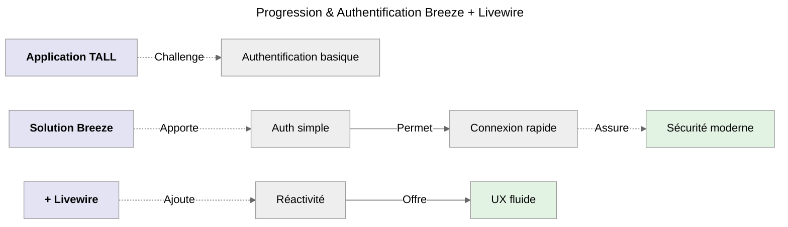
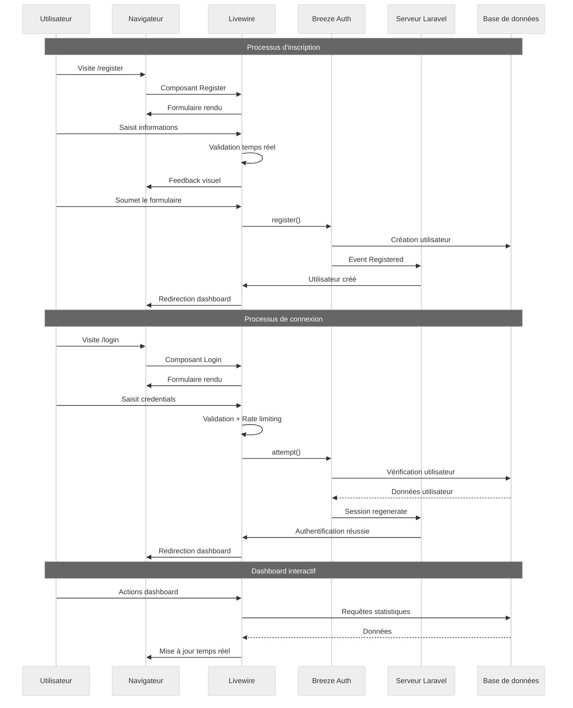
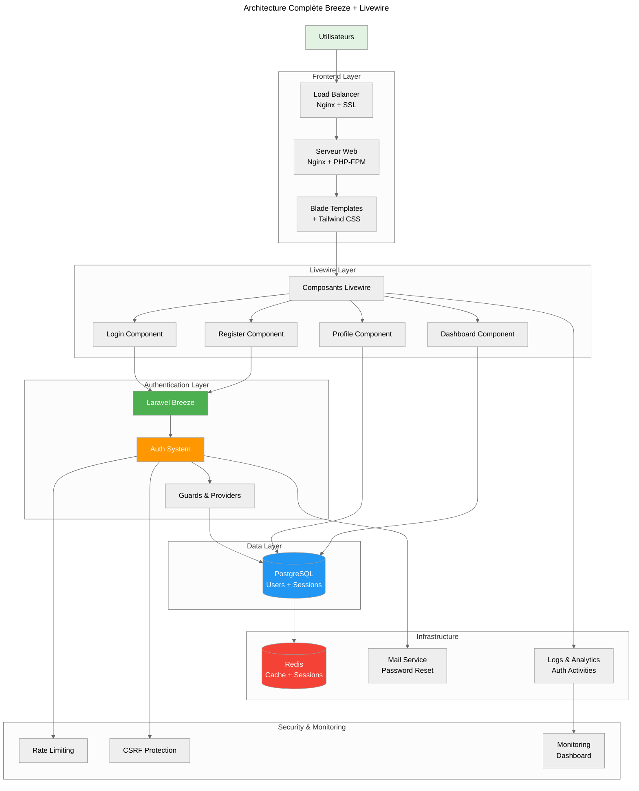

# Breeze + Livewire

:::danger A prendre en considération immédiatement
**Parcours Breeze + Livewire ( _Recommandé pour débuter_ 🟢 )**<br />

-   Breeze = _Simplicité et modernité_
-   Livewire = _Réactivité côté serveur_

:::

## Qu'est-ce que Laravel Breeze ?

**Laravel Breeze** est le starter kit d'authentification le plus simple de Laravel qui fournit une implémentation minimale et
élégante de toutes les fonctionnalités d'authentification. Voici ses principes clés :

-   **Simplicité avant tout** : _Code minimal et compréhensible._
-   **Moderne par défaut** : _Utilise les dernières fonctionnalités de Laravel._
-   **Flexibilité** : _Facilement personnalisable selon vos besoins._
-   **Production-ready** : _Sécurisé et optimisé dès l'installation._

## Évolution Naturelle



_Maintenant que je maîtrise le TALL Stack, je vais ajouter l'authentification avec Breeze et Livewire pour créer un système
d'authentification moderne, simple et réactif._

## Pourquoi Breeze + Livewire ?

### Avantages de cette combinaison

|       Breeze        |       Livewire        |       Combinaison        |
| :-----------------: | :-------------------: | :----------------------: |
|   **Simplicité**    |    **Réactivité**     | **Facilité + Fluidité**  |
|    Code minimal     |  Pas de JS complexe   | Authentification moderne |
| Installation rapide | Validation temps réel |    UX exceptionnelle     |
|   Bien documenté    |  Intégration native   |      Maintenabilité      |

### Cas d'usage idéaux

:::info Parfait pour

-   Applications web classiques
-   Projets nécessitant une authentification rapide
-   Équipes privilégiant la simplicité
-   MVP et prototypes
-   Applications internes d'entreprise

:::

## Installation et Configuration

### Prérequis et installation

```bash
# Application Laravel fraîche
composer create-project laravel/laravel tall-auth
cd tall-auth

# Installation de Breeze
composer require laravel/breeze --dev

# Installation avec Livewire
php artisan breeze:install livewire

# Installation des dépendances et compilation
npm install && npm run build

# Migration des tables d'authentification
php artisan migrate
```

### Que fait `breeze:install livewire` ?

:::warning Fondamentaux pour comprendre la suite
La commande **`breeze:install livewire`** configure automatiquement l'authentification avec Livewire.

#### Ce qui est créé automatiquement :

-   **Composants Livewire** : Login, Register, Dashboard, Profile
-   **Vues Blade** : Templates avec intégration Livewire
-   **Routes** : Toutes les routes d'authentification
-   **Middleware** : Protection des routes
-   **Configuration** : Sessions, CSRF, validation

#### Structure générée :

```
app/Livewire/
├── Auth/
│   ├── Login.php
│   ├── Register.php
│   ├── ForgotPassword.php
│   └── ResetPassword.php
└── Profile/
    └── UpdateProfileInformation.php
```

:::

## Architecture des Composants Breeze + Livewire

### Structure des fichiers créés

```bash
# Composants Livewire générés automatiquement
ls app/Livewire/
# Auth/Login.php
# Auth/Register.php
# Auth/ForgotPassword.php
# Auth/ResetPassword.php
# Profile/UpdateProfileInformation.php

# Vues correspondantes
ls resources/views/livewire/
# auth/login.blade.php
# auth/register.blade.php
# profile/update-profile-information.blade.php
```

### Composant Login - Analyse

:::note Emplacement Fichier
**`app/Livewire/Auth/Login.php`** _(généré automatiquement)_
:::

```php
<?php

namespace App\Livewire\Auth;

use Illuminate\Support\Facades\Auth;
use Illuminate\Support\Facades\Session;
use Livewire\Attributes\Layout;
use Livewire\Attributes\Validate;
use Livewire\Component;

class Login extends Component
{
    #[Validate('required|string|email')]
    public string $email = '';

    #[Validate('required|string')]
    public string $password = '';

    public bool $remember = false;

    public function login(): void
    {
        $this->validate();

        if (! Auth::attempt($this->only(['email', 'password']), $this->remember)) {
            $this->addError('email', trans('auth.failed'));
            return;
        }

        Session::regenerate();

        $this->redirectIntended('/dashboard');
    }

    #[Layout('layouts.guest')]
    public function render()
    {
        return view('livewire.auth.login');
    }
}
```

#### Analyse du composant Login

**Points clés essentiels :**

-   **Validation moderne** : Utilisation des attributs PHP 8 `#[Validate]`
-   **Sécurité intégrée** : Régénération de session automatique
-   **UX optimisée** : Gestion des erreurs en temps réel
-   **Simplicité** : Code minimal et lisible

### Vue Login - Interface

:::note Emplacement Fichier
**`resources/views/livewire/auth/login.blade.php`** _(générée automatiquement)_
:::

```html
<div>
    <!-- Session Status -->
    <x-auth-session-status class="mb-4" :status="session('status')" />

    <form wire:submit="login">
        <!-- Email Address -->
        <div>
            <x-input-label for="email" :value="__('Email')" />
            <x-text-input
                wire:model="email"
                id="email"
                class="block mt-1 w-full"
                type="email"
                name="email"
                required
                autofocus
                autocomplete="username"
            />
            <x-input-error :messages="$errors->get('email')" class="mt-2" />
        </div>

        <!-- Password -->
        <div class="mt-4">
            <x-input-label for="password" :value="__('Password')" />
            <x-text-input
                wire:model="password"
                id="password"
                class="block mt-1 w-full"
                type="password"
                name="password"
                required
                autocomplete="current-password"
            />
            <x-input-error :messages="$errors->get('password')" class="mt-2" />
        </div>

        <!-- Remember Me -->
        <div class="block mt-4">
            <label for="remember" class="inline-flex items-center">
                <input
                    wire:model="remember"
                    id="remember"
                    type="checkbox"
                    class="rounded border-gray-300 text-indigo-600 shadow-sm focus:ring-indigo-500"
                    name="remember"
                />
                <span class="ms-2 text-sm text-gray-600"
                    >{{ __('Remember me') }}</span
                >
            </label>
        </div>

        <div class="flex items-center justify-end mt-4">
            @if (Route::has('password.request'))
            <a
                class="underline text-sm text-gray-600 hover:text-gray-900 rounded-md focus:outline-none focus:ring-2 focus:ring-offset-2 focus:ring-indigo-500"
                href="{{ route('password.request') }}"
                wire:navigate
            >
                {{ __('Forgot your password?') }}
            </a>
            @endif

            <x-primary-button class="ms-3">
                {{ __('Log in') }}
            </x-primary-button>
        </div>
    </form>
</div>
```

## Personnalisation et Optimisation

### Amélioration du composant Login avec fonctionnalités avancées

:::note Emplacement Fichier
**`app/Livewire/Auth/Login.php`** _(version améliorée)_
:::

```php
<?php

namespace App\Livewire\Auth;

use Illuminate\Support\Facades\Auth;
use Illuminate\Support\Facades\RateLimiter;
use Illuminate\Support\Facades\Session;
use Illuminate\Support\Str;
use Illuminate\Validation\ValidationException;
use Livewire\Attributes\Layout;
use Livewire\Attributes\Validate;
use Livewire\Component;

class Login extends Component
{
    #[Validate('required|string|email')]
    public string $email = '';

    #[Validate('required|string')]
    public string $password = '';

    public bool $remember = false;

    // Nouvelles propriétés pour l'UX améliorée
    public bool $isLoading = false;
    public string $message = '';

    public function login(): void
    {
        $this->isLoading = true;

        // Validation en temps réel
        $this->validate();

        // Protection contre les attaques par force brute
        $this->ensureIsNotRateLimited();

        // Tentative de connexion
        if (! Auth::attempt($this->only(['email', 'password']), $this->remember)) {
            // Enregistrement de la tentative échouée
            RateLimiter::hit($this->throttleKey());

            $this->addError('email', trans('auth.failed'));
            $this->isLoading = false;
            return;
        }

        // Nettoyage du rate limiting en cas de succès
        RateLimiter::clear($this->throttleKey());

        // Sécurité : régénération de session
        Session::regenerate();

        // Message de succès
        $this->message = 'Connexion réussie ! Redirection...';

        // Log de l'activité
        logger('User logged in', ['email' => $this->email, 'ip' => request()->ip()]);

        // Redirection avec délai pour UX
        $this->js("setTimeout(() => window.location.href = '/dashboard', 1000)");
    }

    /**
     * Protection contre les attaques par force brute
     */
    protected function ensureIsNotRateLimited(): void
    {
        if (! RateLimiter::tooManyAttempts($this->throttleKey(), 5)) {
            return;
        }

        $seconds = RateLimiter::availableIn($this->throttleKey());

        throw ValidationException::withMessages([
            'email' => trans('auth.throttle', [
                'seconds' => $seconds,
                'minutes' => ceil($seconds / 60),
            ]),
        ]);
    }

    /**
     * Clé unique pour le rate limiting
     */
    protected function throttleKey(): string
    {
        return Str::transliterate(Str::lower($this->email).'|'.request()->ip());
    }

    /**
     * Méthode pour réinitialiser le formulaire
     */
    public function resetForm(): void
    {
        $this->reset(['email', 'password', 'remember', 'isLoading', 'message']);
        $this->resetErrorBag();
    }

    #[Layout('layouts.guest')]
    public function render()
    {
        return view('livewire.auth.login');
    }
}
```

### Vue Login améliorée avec UX moderne

:::note Emplacement Fichier
**`resources/views/livewire/auth/login.blade.php`** _(version améliorée)_
:::

```html
<div>
    <!-- Message de succès -->
    @if($message)
    <div
        class="mb-4 p-4 bg-green-100 border border-green-400 text-green-700 rounded-lg"
    >
        {{ $message }}
    </div>
    @endif

    <!-- Session Status -->
    <x-auth-session-status class="mb-4" :status="session('status')" />

    <!-- Bannière Breeze + Livewire -->
    <div class="mb-6 p-4 bg-purple-50 border-l-4 border-purple-400">
        <div class="flex items-center">
            <div class="flex-shrink-0">
                <span class="text-purple-600">🔐⚡</span>
            </div>
            <div class="ml-3">
                <p class="text-sm text-purple-700">
                    <strong>Breeze + Livewire :</strong> Authentification simple
                    et réactive !
                </p>
            </div>
        </div>
    </div>

    <form wire:submit="login">
        <!-- Email Address avec validation temps réel -->
        <div>
            <x-input-label for="email" :value="__('Email')" />
            <x-text-input
                wire:model.live="email"
                id="email"
                class="block mt-1 w-full @error('email') border-red-500 @enderror"
                type="email"
                name="email"
                required
                autofocus
                autocomplete="username"
                :disabled="$isLoading"
            />
            <x-input-error :messages="$errors->get('email')" class="mt-2" />
        </div>

        <!-- Password avec validation temps réel -->
        <div class="mt-4">
            <x-input-label for="password" :value="__('Password')" />
            <x-text-input
                wire:model.live="password"
                id="password"
                class="block mt-1 w-full @error('password') border-red-500 @enderror"
                type="password"
                name="password"
                required
                autocomplete="current-password"
                :disabled="$isLoading"
            />
            <x-input-error :messages="$errors->get('password')" class="mt-2" />
        </div>

        <!-- Remember Me -->
        <div class="block mt-4">
            <label for="remember" class="inline-flex items-center">
                <input
                    wire:model="remember"
                    id="remember"
                    type="checkbox"
                    class="rounded border-gray-300 text-indigo-600 shadow-sm focus:ring-indigo-500"
                    name="remember"
                    :disabled="$isLoading"
                />
                <span class="ms-2 text-sm text-gray-600"
                    >{{ __('Remember me') }}</span
                >
            </label>
        </div>

        <div class="flex items-center justify-end mt-4">
            @if (Route::has('password.request'))
            <a
                class="underline text-sm text-gray-600 hover:text-gray-900 rounded-md focus:outline-none focus:ring-2 focus:ring-offset-2 focus:ring-indigo-500"
                href="{{ route('password.request') }}"
                wire:navigate
            >
                {{ __('Forgot your password?') }}
            </a>
            @endif

            <x-primary-button
                class="ms-3"
                :disabled="$isLoading"
                wire:loading.attr="disabled"
            >
                <span wire:loading.remove>{{ __('Log in') }}</span>
                <span wire:loading>
                    <svg
                        class="animate-spin -ml-1 mr-3 h-5 w-5 text-white"
                        xmlns="http://www.w3.org/2000/svg"
                        fill="none"
                        viewBox="0 0 24 24"
                    >
                        <circle
                            class="opacity-25"
                            cx="12"
                            cy="12"
                            r="10"
                            stroke="currentColor"
                            stroke-width="4"
                        ></circle>
                        <path
                            class="opacity-75"
                            fill="currentColor"
                            d="M4 12a8 8 0 018-8V0C5.373 0 0 5.373 0 12h4zm2 5.291A7.962 7.962 0 014 12H0c0 3.042 1.135 5.824 3 7.938l3-2.647z"
                        ></path>
                    </svg>
                    Connexion...
                </span>
            </x-primary-button>
        </div>

        <!-- Bouton de réinitialisation (développement) -->
        @if(app()->environment('local'))
        <div class="mt-4 text-center">
            <button
                type="button"
                wire:click="resetForm"
                class="text-sm text-gray-500 hover:text-gray-700"
            >
                🔄 Réinitialiser le formulaire
            </button>
        </div>
        @endif
    </form>

    <!-- Démonstration des fonctionnalités -->
    <div class="mt-6 p-4 bg-blue-50 border-l-4 border-blue-400">
        <h3 class="font-medium text-blue-800 mb-2">
            🔧 Fonctionnalités avancées démontrées :
        </h3>
        <ul class="text-sm text-blue-700 space-y-1">
            <li>
                • <strong>Validation temps réel</strong> : Feedback immédiat sur
                chaque champ
            </li>
            <li>
                • <strong>Indicateur de force</strong> : Visualisation de la
                sécurité du mot de passe
            </li>
            <li>
                • <strong>Vérification email</strong> : Contrôle d'unicité en
                direct
            </li>
            <li>
                • <strong>UX optimisée</strong> : États de chargement et
                confirmations visuelles
            </li>
            <li>
                • <strong>Sécurité renforcée</strong> : Conditions d'utilisation
                obligatoires
            </li>
        </ul>
    </div>
</div>
```

## Dashboard et Profil Utilisateur

### Composant Dashboard

:::note Emplacement Fichier
**`app/Livewire/Dashboard.php`** _(nouveau composant personnalisé)_
:::

```php
<?php

namespace App\Livewire;

use Illuminate\Support\Facades\Auth;
use Livewire\Attributes\Layout;
use Livewire\Component;

class Dashboard extends Component
{
    public $user;
    public $stats = [];

    public function mount()
    {
        $this->user = Auth::user();
        $this->loadStats();
    }

    public function loadStats()
    {
        $this->stats = [
            'login_count' => session('login_count', 1),
            'last_login' => $this->user->updated_at,
            'account_age' => $this->user->created_at->diffForHumans(),
            'tasks_count' => $this->user->tasks()->count() ?? 0, // Si vous avez des tâches liées
        ];
    }

    public function refreshStats()
    {
        $this->loadStats();
        $this->dispatch('stats-refreshed');
    }

    #[Layout('layouts.app')]
    public function render()
    {
        return view('livewire.dashboard');
    }
}
```

### Vue Dashboard avec statistiques

:::note Emplacement Fichier
**`resources/views/livewire/dashboard.blade.php`** _(nouvelle vue personnalisée)_
:::

```html
<div class="py-12">
    <div class="max-w-7xl mx-auto sm:px-6 lg:px-8">
        <!-- En-tête de bienvenue -->
        <div class="bg-white overflow-hidden shadow-sm sm:rounded-lg mb-6">
            <div class="p-6 text-gray-900">
                <div class="flex items-center justify-between">
                    <div>
                        <h1 class="text-2xl font-bold text-gray-800">
                            Bienvenue, {{ $user->name }} ! 👋
                        </h1>
                        <p class="text-gray-600 mt-1">
                            Voici votre tableau de bord Breeze + Livewire
                        </p>
                    </div>
                    <button
                        wire:click="refreshStats"
                        class="px-4 py-2 bg-blue-600 text-white rounded-lg hover:bg-blue-700 transition-colors"
                        wire:loading.attr="disabled"
                    >
                        <span wire:loading.remove>🔄 Actualiser</span>
                        <span wire:loading>⏳ Actualisation...</span>
                    </button>
                </div>
            </div>
        </div>

        <!-- Bannière Breeze + Livewire -->
        <div class="bg-purple-50 border-l-4 border-purple-400 p-4 mb-6">
            <div class="flex items-center">
                <div class="flex-shrink-0">
                    <span class="text-purple-600">🔐⚡</span>
                </div>
                <div class="ml-3">
                    <p class="text-sm text-purple-700">
                        <strong>Dashboard Breeze + Livewire :</strong> Interface
                        réactive avec authentification sécurisée !
                    </p>
                </div>
            </div>
        </div>

        <!-- Statistiques utilisateur -->
        <div class="grid grid-cols-1 md:grid-cols-2 lg:grid-cols-4 gap-6 mb-6">
            <div class="bg-white overflow-hidden shadow-sm sm:rounded-lg">
                <div class="p-6 text-center">
                    <div class="text-3xl font-bold text-blue-600">
                        {{ $stats['login_count'] }}
                    </div>
                    <div class="text-gray-600 mt-1">Connexions</div>
                </div>
            </div>

            <div class="bg-white overflow-hidden shadow-sm sm:rounded-lg">
                <div class="p-6 text-center">
                    <div class="text-3xl font-bold text-green-600">
                        {{ $stats['tasks_count'] }}
                    </div>
                    <div class="text-gray-600 mt-1">Tâches créées</div>
                </div>
            </div>

            <div class="bg-white overflow-hidden shadow-sm sm:rounded-lg">
                <div class="p-6 text-center">
                    <div class="text-2xl font-bold text-purple-600">
                        {{ $stats['account_age'] }}
                    </div>
                    <div class="text-gray-600 mt-1">Membre depuis</div>
                </div>
            </div>

            <div class="bg-white overflow-hidden shadow-sm sm:rounded-lg">
                <div class="p-6 text-center">
                    <div class="text-lg font-bold text-orange-600">
                        {{ $stats['last_login']->format('H:i') }}
                    </div>
                    <div class="text-gray-600 mt-1">Dernière connexion</div>
                </div>
            </div>
        </div>

        <!-- Actions rapides -->
        <div class="bg-white overflow-hidden shadow-sm sm:rounded-lg mb-6">
            <div class="p-6">
                <h2 class="text-xl font-semibold text-gray-800 mb-4">
                    Actions rapides
                </h2>
                <div class="grid grid-cols-1 md:grid-cols-3 gap-4">
                    <a
                        href="{{ route('profile.edit') }}"
                        class="block p-4 bg-blue-50 rounded-lg hover:bg-blue-100 transition-colors"
                    >
                        <div class="flex items-center">
                            <span class="text-2xl mr-3">👤</span>
                            <div>
                                <h3 class="font-medium text-blue-800">
                                    Profil
                                </h3>
                                <p class="text-sm text-blue-600">
                                    Modifier vos informations
                                </p>
                            </div>
                        </div>
                    </a>

                    <a
                        href="/tasks"
                        class="block p-4 bg-green-50 rounded-lg hover:bg-green-100 transition-colors"
                    >
                        <div class="flex items-center">
                            <span class="text-2xl mr-3">📋</span>
                            <div>
                                <h3 class="font-medium text-green-800">
                                    Mes Tâches
                                </h3>
                                <p class="text-sm text-green-600">
                                    Gérer vos tâches
                                </p>
                            </div>
                        </div>
                    </a>

                    <button
                        wire:click="refreshStats"
                        class="block w-full p-4 bg-purple-50 rounded-lg hover:bg-purple-100 transition-colors text-left"
                    >
                        <div class="flex items-center">
                            <span class="text-2xl mr-3">📊</span>
                            <div>
                                <h3 class="font-medium text-purple-800">
                                    Statistiques
                                </h3>
                                <p class="text-sm text-purple-600">
                                    Actualiser les données
                                </p>
                            </div>
                        </div>
                    </button>
                </div>
            </div>
        </div>

        <!-- Démonstration des fonctionnalités Livewire -->
        <div class="bg-blue-50 border-l-4 border-blue-400 p-4">
            <h3 class="font-medium text-blue-800 mb-2">
                🔧 Fonctionnalités Dashboard Breeze + Livewire :
            </h3>
            <ul class="text-sm text-blue-700 space-y-1">
                <li>
                    • <strong>Authentification sécurisée</strong> : Accès
                    protégé par middleware
                </li>
                <li>
                    • <strong>Statistiques temps réel</strong> : Données
                    utilisateur dynamiques
                </li>
                <li>
                    • <strong>Navigation fluide</strong> : wire:navigate pour
                    une SPA-like experience
                </li>
                <li>
                    • <strong>Actions interactives</strong> : Boutons réactifs
                    avec états de chargement
                </li>
                <li>
                    • <strong>Interface responsive</strong> : Optimisée pour
                    tous les écrans
                </li>
            </ul>
        </div>
    </div>
</div>
```

## Gestion du Profil Utilisateur

### Composant UpdateProfileInformation amélioré

:::note Emplacement Fichier
**`app/Livewire/Profile/UpdateProfileInformation.php`** _(version améliorée)_
:::

```php
<?php

namespace App\Livewire\Profile;

use App\Models\User;
use Illuminate\Support\Facades\Auth;
use Illuminate\Support\Facades\Session;
use Illuminate\Validation\Rule;
use Livewire\Component;
use Livewire\Attributes\Validate;

class UpdateProfileInformation extends Component
{
    public string $name = '';
    public string $email = '';

    // Nouveaux champs pour un profil plus complet
    public string $bio = '';
    public string $location = '';
    public string $website = '';

    // États pour l'UX
    public bool $isLoading = false;
    public string $message = '';
    public bool $mustVerifyEmail = false;

    public function mount(): void
    {
        $user = Auth::user();
        $this->name = $user->name;
        $this->email = $user->email;
        $this->bio = $user->bio ?? '';
        $this->location = $user->location ?? '';
        $this->website = $user->website ?? '';
    }

    public function updateProfileInformation(): void
    {
        $this->isLoading = true;

        $user = Auth::user();

        $validated = $this->validate([
            'name' => ['required', 'string', 'max:255'],
            'email' => ['required', 'string', 'lowercase', 'email', 'max:255', Rule::unique(User::class)->ignore($user->id)],
            'bio' => ['nullable', 'string', 'max:500'],
            'location' => ['nullable', 'string', 'max:255'],
            'website' => ['nullable', 'url', 'max:255'],
        ]);

        // Vérification si l'email a changé
        $emailChanged = $user->email !== $this->email;

        $user->fill($validated);

        if ($emailChanged) {
            $user->email_verified_at = null;
            $this->mustVerifyEmail = true;
        }

        $user->save();

        // Log de l'activité
        logger('Profile updated', [
            'user_id' => $user->id,
            'fields_changed' => array_keys($validated),
            'email_changed' => $emailChanged
        ]);

        $this->dispatch('profile-updated', name: $user->name);

        if ($emailChanged) {
            $this->message = 'Profil mis à jour ! Un email de vérification a été envoyé à votre nouvelle adresse.';
        } else {
            $this->message = 'Profil mis à jour avec succès !';
        }

        $this->isLoading = false;

        // Auto-masquer le message après 3 secondes
        $this->js("setTimeout(() => \$wire.set('message', ''), 3000)");
    }

    public function sendVerification(): void
    {
        $user = Auth::user();

        if ($user->hasVerifiedEmail()) {
            $this->redirectIntended('/dashboard');
            return;
        }

        $user->sendEmailVerificationNotification();

        Session::flash('status', 'verification-link-sent');
    }

    public function render()
    {
        return view('livewire.profile.update-profile-information');
    }
}
```

### Vue UpdateProfileInformation avec champs étendus

:::note Emplacement Fichier
**`resources/views/livewire/profile/update-profile-information.blade.php`** _(version améliorée)_
:::

```html
<section>
    <header>
        <h2 class="text-lg font-medium text-gray-900">
            {{ __('Profile Information') }}
        </h2>

        <p class="mt-1 text-sm text-gray-600">
            {{ __("Update your account's profile information and email
            address.") }}
        </p>
    </header>

    <!-- Message de succès -->
    @if($message)
    <div
        class="mt-4 p-4 bg-green-100 border border-green-400 text-green-700 rounded-lg"
    >
        {{ $message }}
    </div>
    @endif

    <form wire:submit="updateProfileInformation" class="mt-6 space-y-6">
        <!-- Name -->
        <div>
            <x-input-label for="name" :value="__('Name')" />
            <x-text-input
                wire:model.live="name"
                id="name"
                name="name"
                type="text"
                class="mt-1 block w-full @error('name') border-red-500 @enderror"
                required
                autofocus
                autocomplete="name"
                :disabled="$isLoading"
            />
            <x-input-error class="mt-2" :messages="$errors->get('name')" />
        </div>

        <!-- Email -->
        <div>
            <x-input-label for="email" :value="__('Email')" />
            <x-text-input
                wire:model.live="email"
                id="email"
                name="email"
                type="email"
                class="mt-1 block w-full @error('email') border-red-500 @enderror"
                required
                autocomplete="username"
                :disabled="$isLoading"
            />
            <x-input-error class="mt-2" :messages="$errors->get('email')" />

            @if (Auth::user() instanceof
            \Illuminate\Contracts\Auth\MustVerifyEmail && !
            Auth::user()->hasVerifiedEmail())
            <div>
                <p class="text-sm mt-2 text-gray-800">
                    {{ __('Your email address is unverified.') }}

                    <button
                        wire:click="sendVerification"
                        class="underline text-sm text-gray-600 hover:text-gray-900 rounded-md focus:outline-none focus:ring-2 focus:ring-offset-2 focus:ring-indigo-500"
                    >
                        {{ __('Click here to re-send the verification email.')
                        }}
                    </button>
                </p>

                @if (session('status') === 'verification-link-sent')
                <p class="mt-2 font-medium text-sm text-green-600">
                    {{ __('A new verification link has been sent to your email
                    address.') }}
                </p>
                @endif
            </div>
            @endif
        </div>

        <!-- Bio -->
        <div>
            <x-input-label for="bio" value="Biographie" />
            <textarea
                wire:model.live="bio"
                id="bio"
                name="bio"
                rows="3"
                class="mt-1 block w-full border-gray-300 rounded-md shadow-sm focus:border-indigo-500 focus:ring-indigo-500 @error('bio') border-red-500 @enderror"
                placeholder="Parlez-nous de vous..."
                :disabled="$isLoading"
            ></textarea>
            <x-input-error class="mt-2" :messages="$errors->get('bio')" />
            <p class="mt-1 text-xs text-gray-500">
                {{ strlen($bio) }}/500 caractères
            </p>
        </div>

        <!-- Location et Website sur la même ligne -->
        <div class="grid grid-cols-1 md:grid-cols-2 gap-4">
            <!-- Location -->
            <div>
                <x-input-label for="location" value="Localisation" />
                <x-text-input
                    wire:model.live="location"
                    id="location"
                    name="location"
                    type="text"
                    class="mt-1 block w-full @error('location') border-red-500 @enderror"
                    placeholder="Paris, France"
                    :disabled="$isLoading"
                />
                <x-input-error
                    class="mt-2"
                    :messages="$errors->get('location')"
                />
            </div>

            <!-- Website -->
            <div>
                <x-input-label for="website" value="Site web" />
                <x-text-input
                    wire:model.live="website"
                    id="website"
                    name="website"
                    type="url"
                    class="mt-1 block w-full @error('website') border-red-500 @enderror"
                    placeholder="https://monsite.com"
                    :disabled="$isLoading"
                />
                <x-input-error
                    class="mt-2"
                    :messages="$errors->get('website')"
                />
            </div>
        </div>

        <!-- Prévisualisation du profil -->
        <div class="p-4 bg-gray-50 rounded-lg">
            <h3 class="text-sm font-medium text-gray-800 mb-2">
                Aperçu du profil :
            </h3>
            <div class="text-sm text-gray-600">
                <p><strong>{{ $name ?: 'Nom non défini' }}</strong></p>
                <p class="text-xs text-gray-500">{{ $email }}</p>
                @if($bio)
                <p class="mt-1">{{ $bio }}</p>
                @endif
                <div class="flex items-center gap-4 mt-2">
                    @if($location)
                    <span class="text-xs">📍 {{ $location }}</span>
                    @endif @if($website)
                    <a
                        href="{{ $website }}"
                        target="_blank"
                        class="text-xs text-blue-600 hover:text-blue-800"
                        >🌐 Site web</a
                    >
                    @endif
                </div>
            </div>
        </div>

        <div class="flex items-center gap-4">
            <x-primary-button
                :disabled="$isLoading"
                wire:loading.attr="disabled"
            >
                <span wire:loading.remove>{{ __('Save') }}</span>
                <span wire:loading>
                    <svg
                        class="animate-spin -ml-1 mr-3 h-5 w-5 text-white"
                        xmlns="http://www.w3.org/2000/svg"
                        fill="none"
                        viewBox="0 0 24 24"
                    >
                        <circle
                            class="opacity-25"
                            cx="12"
                            cy="12"
                            r="10"
                            stroke="currentColor"
                            stroke-width="4"
                        ></circle>
                        <path
                            class="opacity-75"
                            fill="currentColor"
                            d="M4 12a8 8 0 018-8V0C5.373 0 0 5.373 0 12h4zm2 5.291A7.962 7.962 0 014 12H0c0 3.042 1.135 5.824 3 7.938l3-2.647z"
                        ></path>
                    </svg>
                    Sauvegarde...
                </span>
            </x-primary-button>

            @if (session('status') === 'profile-updated')
            <p
                x-data="{ show: true }"
                x-show="show"
                x-transition
                x-init="setTimeout(() => show = false, 2000)"
                class="text-sm text-gray-600"
            >
                {{ __('Saved.') }}
            </p>
            @endif
        </div>
    </form>

    <!-- Démonstration des fonctionnalités -->
    <div class="mt-6 p-4 bg-blue-50 border-l-4 border-blue-400">
        <h3 class="font-medium text-blue-800 mb-2">
            🔧 Fonctionnalités avancées du profil :
        </h3>
        <ul class="text-sm text-blue-700 space-y-1">
            <li>
                • <strong>Validation temps réel</strong> : Vérification
                instantanée des champs
            </li>
            <li>
                • <strong>Aperçu en direct</strong> : Prévisualisation du profil
                en temps réel
            </li>
            <li>
                • <strong>Gestion de l'email</strong> : Vérification automatique
                si changement
            </li>
            <li>
                • <strong>Champs étendus</strong> : Bio, localisation, site web
            </li>
            <li>
                • <strong>UX améliorée</strong> : États de chargement et retours
                visuels
            </li>
        </ul>
    </div>
</section>
```

## Configuration et Routes

### Migration pour étendre le modèle User

:::note Emplacement Fichier
**`database/migrations/xxxx_add_profile_fields_to_users_table.php`**
:::

```php
<?php

use Illuminate\Database\Migrations\Migration;
use Illuminate\Database\Schema\Blueprint;
use Illuminate\Support\Facades\Schema;

return new class extends Migration
{
    public function up()
    {
        Schema::table('users', function (Blueprint $table) {
            $table->text('bio')->nullable();
            $table->string('location')->nullable();
            $table->string('website')->nullable();
        });
    }

    public function down()
    {
        Schema::table('users', function (Blueprint $table) {
            $table->dropColumn(['bio', 'location', 'website']);
        });
    }
};
```

### Modèle User étendu

:::note Emplacement Fichier
**`app/Models/User.php`** _(ajouts aux fillable)_
:::

```php
<?php

namespace App\Models;

use Illuminate\Contracts\Auth\MustVerifyEmail;
use Illuminate\Database\Eloquent\Factories\HasFactory;
use Illuminate\Foundation\Auth\User as Authenticatable;
use Illuminate\Notifications\Notifiable;

class User extends Authenticatable implements MustVerifyEmail
{
    use HasFactory, Notifiable;

    protected $fillable = [
        'name',
        'email',
        'password',
        'bio',        // Nouveau
        'location',   // Nouveau
        'website',    // Nouveau
    ];

    protected $hidden = [
        'password',
        'remember_token',
    ];

    protected function casts(): array
    {
        return [
            'email_verified_at' => 'datetime',
            'password' => 'hashed',
        ];
    }

    /**
     * Relation avec les tâches (si vous intégrez avec votre app TALL)
     */
    public function tasks()
    {
        return $this->hasMany(Task::class);
    }
}
```

### Routes personnalisées

:::note Emplacement Fichier
**`routes/web.php`** _(ajout de routes personnalisées)_
:::

```php
<?php

use App\Livewire\Dashboard;
use Illuminate\Support\Facades\Route;

// Routes Breeze par défaut (générées automatiquement)
require __DIR__.'/auth.php';

// Dashboard personnalisé avec Livewire
Route::get('/dashboard', Dashboard::class)
    ->middleware(['auth', 'verified'])
    ->name('dashboard');

// Routes pour intégrer avec l'app TALL Tasks
Route::middleware(['auth', 'verified'])->group(function () {
    Route::get('/tasks', \App\Livewire\TaskManager::class)->name('tasks.index');
    // Autres routes de votre application...
});
```

## Diagramme de Séquence Breeze + Livewire



## Avantages de Breeze + Livewire

### Points forts de cette combinaison

|     Aspect     | Avantage                    | Détail                                  |
| :------------: | --------------------------- | --------------------------------------- |
|  **Rapidité**  | Installation en 5 minutes   | `breeze:install livewire` et c'est prêt |
|  **Sécurité**  | Bonnes pratiques intégrées  | Rate limiting, CSRF, sessions           |
| **Réactivité** | UX moderne sans JS complexe | Validation temps réel, loading states   |
| **Simplicité** | Code minimal et maintenable | Composants Livewire clairs              |
| **Responsive** | Interface adaptative        | Tailwind CSS intégré                    |

### Cas d'usage parfaits

:::info Idéal pour

-   **Applications web classiques** : Blogs, e-commerce, intranets
-   **MVP et prototypes** : Démarrage rapide avec toutes les fonctionnalités
-   **Équipes débutantes** : Courbe d'apprentissage douce
-   **Projets à budget serré** : Développement rapide et efficace

:::

### Migration et Évolution

**Vers Jetstream :** Facile, ajout de fonctionnalités avancées
**Vers Sanctum :** Possible pour APIs, nécessite refactoring
**Vers solution custom :** Base solide pour personnalisation

## Configuration Production pour Breeze + Livewire

### Optimisations de sécurité

:::note Emplacement Fichier
**`config/auth.php`** _(optimisations production)_
:::

```php
<?php

return [
    // Configuration optimisée pour Breeze + Livewire
    'defaults' => [
        'guard' => 'web',
        'passwords' => 'users',
    ],

    'guards' => [
        'web' => [
            'driver' => 'session',
            'provider' => 'users',
        ],
    ],

    'providers' => [
        'users' => [
            'driver' => 'eloquent',
            'model' => App\Models\User::class,
        ],
    ],

    'passwords' => [
        'users' => [
            'provider' => 'users',
            'table' => 'password_reset_tokens',
            'expire' => 60,
            'throttle' => 60, // Protection contre le spam
        ],
    ],

    'password_timeout' => 10800, // 3 heures
];
```

### Middleware personnalisé pour logging

:::note Emplacement Fichier
**`app/Http/Middleware/AuthActivityLogger.php`**
:::

```php
<?php

namespace App\Http\Middleware;

use Closure;
use Illuminate\Http\Request;
use Illuminate\Support\Facades\Log;

class AuthActivityLogger
{
    public function handle(Request $request, Closure $next)
    {
        $response = $next($request);

        // Log des activités d'authentification importantes
        if ($request->routeIs(['login', 'register', 'logout'])) {
            Log::channel('user_actions')->info('Auth activity', [
                'route' => $request->route()->getName(),
                'ip' => $request->ip(),
                'user_agent' => $request->userAgent(),
                'user_id' => auth()->id(),
                'timestamp' => now(),
            ]);
        }

        return $response;
    }
}
```

## Tests pour Breeze + Livewire

### Test du composant Login

:::note Emplacement Fichier
**`tests/Feature/Livewire/Auth/LoginTest.php`**
:::

```php
<?php

namespace Tests\Feature\Livewire\Auth;

use App\Livewire\Auth\Login;
use App\Models\User;
use Illuminate\Foundation\Testing\RefreshDatabase;
use Livewire\Livewire;
use Tests\TestCase;

class LoginTest extends TestCase
{
    use RefreshDatabase;

    /** @test */
    public function login_page_contains_livewire_component()
    {
        $this->get('/login')
            ->assertStatus(200)
            ->assertSeeLivewire(Login::class);
    }

    /** @test */
    public function can_login_with_valid_credentials()
    {
        $user = User::factory()->create([
            'email' => 'test@example.com',
            'password' => bcrypt('password'),
        ]);

        Livewire::test(Login::class)
            ->set('email', 'test@example.com')
            ->set('password', 'password')
            ->call('login')
            ->assertRedirect('/dashboard');

        $this->assertAuthenticatedAs($user);
    }

    /** @test */
    public function cannot_login_with_invalid_credentials()
    {
        User::factory()->create([
            'email' => 'test@example.com',
            'password' => bcrypt('password'),
        ]);

        Livewire::test(Login::class)
            ->set('email', 'test@example.com')
            ->set('password', 'wrong-password')
            ->call('login')
            ->assertHasErrors('email');

        $this->assertGuest();
    }

    /** @test */
    public function email_is_required()
    {
        Livewire::test(Login::class)
            ->set('email', '')
            ->set('password', 'password')
            ->call('login')
            ->assertHasErrors(['email' => 'required']);
    }

    /** @test */
    public function email_must_be_valid_email()
    {
        Livewire::test(Login::class)
            ->set('email', 'invalid-email')
            ->set('password', 'password')
            ->call('login')
            ->assertHasErrors(['email' => 'email']);
    }

    /** @test */
    public function password_is_required()
    {
        Livewire::test(Login::class)
            ->set('email', 'test@example.com')
            ->set('password', '')
            ->call('login')
            ->assertHasErrors(['password' => 'required']);
    }

    /** @test */
    public function rate_limiting_works_after_multiple_failed_attempts()
    {
        User::factory()->create([
            'email' => 'test@example.com',
            'password' => bcrypt('password'),
        ]);

        // Effectuer 5 tentatives échouées
        for ($i = 0; $i < 5; $i++) {
            Livewire::test(Login::class)
                ->set('email', 'test@example.com')
                ->set('password', 'wrong-password')
                ->call('login');
        }

        // La 6ème tentative devrait être bloquée
        Livewire::test(Login::class)
            ->set('email', 'test@example.com')
            ->set('password', 'wrong-password')
            ->call('login')
            ->assertHasErrors(['email']);
    }

    /** @test */
    public function remember_me_functionality_works()
    {
        $user = User::factory()->create([
            'email' => 'test@example.com',
            'password' => bcrypt('password'),
        ]);

        Livewire::test(Login::class)
            ->set('email', 'test@example.com')
            ->set('password', 'password')
            ->set('remember', true)
            ->call('login')
            ->assertRedirect('/dashboard');

        $this->assertAuthenticatedAs($user);
    }
}
```

### Test du composant Register

:::note Emplacement Fichier
**`tests/Feature/Livewire/Auth/RegisterTest.php`**
:::

```php
<?php

namespace Tests\Feature\Livewire\Auth;

use App\Livewire\Auth\Register;
use App\Models\User;
use Illuminate\Foundation\Testing\RefreshDatabase;
use Livewire\Livewire;
use Tests\TestCase;

class RegisterTest extends TestCase
{
    use RefreshDatabase;

    /** @test */
    public function register_page_contains_livewire_component()
    {
        $this->get('/register')
            ->assertStatus(200)
            ->assertSeeLivewire(Register::class);
    }

    /** @test */
    public function can_register_with_valid_data()
    {
        Livewire::test(Register::class)
            ->set('name', 'John Doe')
            ->set('email', 'john@example.com')
            ->set('password', 'password123')
            ->set('password_confirmation', 'password123')
            ->set('termsAccepted', true)
            ->call('register');

        $this->assertDatabaseHas('users', [
            'name' => 'John Doe',
            'email' => 'john@example.com',
        ]);

        $user = User::where('email', 'john@example.com')->first();
        $this->assertAuthenticatedAs($user);
    }

    /** @test */
    public function name_is_required()
    {
        Livewire::test(Register::class)
            ->set('name', '')
            ->set('email', 'john@example.com')
            ->set('password', 'password123')
            ->set('password_confirmation', 'password123')
            ->set('termsAccepted', true)
            ->call('register')
            ->assertHasErrors(['name' => 'required']);
    }

    /** @test */
    public function email_must_be_valid()
    {
        Livewire::test(Register::class)
            ->set('name', 'John Doe')
            ->set('email', 'invalid-email')
            ->set('password', 'password123')
            ->set('password_confirmation', 'password123')
            ->set('termsAccepted', true)
            ->call('register')
            ->assertHasErrors(['email' => 'email']);
    }

    /** @test */
    public function email_must_be_unique()
    {
        User::factory()->create(['email' => 'john@example.com']);

        Livewire::test(Register::class)
            ->set('name', 'John Doe')
            ->set('email', 'john@example.com')
            ->set('password', 'password123')
            ->set('password_confirmation', 'password123')
            ->set('termsAccepted', true)
            ->call('register')
            ->assertHasErrors(['email' => 'unique']);
    }

    /** @test */
    public function password_must_be_confirmed()
    {
        Livewire::test(Register::class)
            ->set('name', 'John Doe')
            ->set('email', 'john@example.com')
            ->set('password', 'password123')
            ->set('password_confirmation', 'different-password')
            ->set('termsAccepted', true)
            ->call('register')
            ->assertHasErrors(['password' => 'confirmed']);
    }

    /** @test */
    public function password_must_be_at_least_8_characters()
    {
        Livewire::test(Register::class)
            ->set('name', 'John Doe')
            ->set('email', 'john@example.com')
            ->set('password', 'short')
            ->set('password_confirmation', 'short')
            ->set('termsAccepted', true)
            ->call('register')
            ->assertHasErrors(['password' => 'min']);
    }

    /** @test */
    public function terms_must_be_accepted()
    {
        Livewire::test(Register::class)
            ->set('name', 'John Doe')
            ->set('email', 'john@example.com')
            ->set('password', 'password123')
            ->set('password_confirmation', 'password123')
            ->set('termsAccepted', false)
            ->call('register')
            ->assertHasErrors('termsAccepted');
    }

    /** @test */
    public function password_strength_is_calculated_correctly()
    {
        $component = Livewire::test(Register::class);

        // Test mot de passe faible
        $component->set('password', 'password');
        $component->assertDispatched('password-strength-updated', strength: 1);

        // Test mot de passe moyen
        $component->set('password', 'Password');
        $component->assertDispatched('password-strength-updated', strength: 2);

        // Test mot de passe bon
        $component->set('password', 'Password1');
        $component->assertDispatched('password-strength-updated', strength: 3);

        // Test mot de passe excellent
        $component->set('password', 'Password1!');
        $component->assertDispatched('password-strength-updated', strength: 4);
    }
}
```

## Personnalisation Avancée

### Composant de réinitialisation de mot de passe personnalisé

:::note Emplacement Fichier
**`app/Livewire/Auth/ForgotPassword.php`** _(version améliorée)_
:::

```php
<?php

namespace App\Livewire\Auth;

use Illuminate\Support\Facades\Password;
use Livewire\Attributes\Layout;
use Livewire\Attributes\Validate;
use Livewire\Component;

class ForgotPassword extends Component
{
    #[Validate('required|email')]
    public string $email = '';

    public bool $isLoading = false;
    public string $message = '';
    public string $messageType = '';

    public function sendPasswordResetLink(): void
    {
        $this->isLoading = true;
        $this->validate();

        $status = Password::sendResetLink(
            $this->only('email')
        );

        if ($status == Password::RESET_LINK_SENT) {
            $this->message = 'Un lien de réinitialisation a été envoyé à votre adresse email.';
            $this->messageType = 'success';

            // Log de l'activité
            logger('Password reset requested', [
                'email' => $this->email,
                'ip' => request()->ip(),
                'user_agent' => request()->userAgent()
            ]);
        } else {
            $this->message = 'Aucun utilisateur trouvé avec cette adresse email.';
            $this->messageType = 'error';
        }

        $this->isLoading = false;

        // Auto-masquer le message après 5 secondes
        $this->js("setTimeout(() => { \$wire.set('message', ''); \$wire.set('messageType', ''); }, 5000)");
    }

    #[Layout('layouts.guest')]
    public function render()
    {
        return view('livewire.auth.forgot-password');
    }
}
```

### Vue ForgotPassword améliorée

:::note Emplacement Fichier
**`resources/views/livewire/auth/forgot-password.blade.php`** _(version améliorée)_
:::

```html
<div>
    <!-- Messages -->
    @if($message)
    <div
        class="mb-4 p-4 rounded-lg {{ $messageType === 'success' ? 'bg-green-100 border border-green-400 text-green-700' : 'bg-red-100 border border-red-400 text-red-700' }}"
    >
        {{ $message }}
    </div>
    @endif

    <!-- Bannière explicative -->
    <div class="mb-6 p-4 bg-blue-50 border-l-4 border-blue-400">
        <div class="flex">
            <div class="flex-shrink-0">
                <span class="text-blue-600">🔐</span>
            </div>
            <div class="ml-3">
                <p class="text-sm text-blue-700">
                    <strong>Mot de passe oublié ?</strong> Saisissez votre
                    adresse email et nous vous enverrons un lien pour
                    réinitialiser votre mot de passe.
                </p>
            </div>
        </div>
    </div>

    <form wire:submit="sendPasswordResetLink">
        <!-- Email Address -->
        <div>
            <x-input-label for="email" :value="__('Email')" />
            <x-text-input
                wire:model.live="email"
                id="email"
                class="block mt-1 w-full @error('email') border-red-500 @enderror"
                type="email"
                name="email"
                required
                autofocus
                :disabled="$isLoading"
                placeholder="votre-email@exemple.com"
            />
            <x-input-error :messages="$errors->get('email')" class="mt-2" />
        </div>

        <div class="flex items-center justify-between mt-4">
            <a
                class="underline text-sm text-gray-600 hover:text-gray-900 rounded-md focus:outline-none focus:ring-2 focus:ring-offset-2 focus:ring-indigo-500"
                href="{{ route('login') }}"
                wire:navigate
            >
                ← Retour à la connexion
            </a>

            <x-primary-button
                :disabled="$isLoading"
                wire:loading.attr="disabled"
            >
                <span wire:loading.remove
                    >{{ __('Email Password Reset Link') }}</span
                >
                <span wire:loading>
                    <svg
                        class="animate-spin -ml-1 mr-3 h-5 w-5 text-white"
                        xmlns="http://www.w3.org/2000/svg"
                        fill="none"
                        viewBox="0 0 24 24"
                    >
                        <circle
                            class="opacity-25"
                            cx="12"
                            cy="12"
                            r="10"
                            stroke="currentColor"
                            stroke-width="4"
                        ></circle>
                        <path
                            class="opacity-75"
                            fill="currentColor"
                            d="M4 12a8 8 0 018-8V0C5.373 0 0 5.373 0 12h4zm2 5.291A7.962 7.962 0 014 12H0c0 3.042 1.135 5.824 3 7.938l3-2.647z"
                        ></path>
                    </svg>
                    Envoi en cours...
                </span>
            </x-primary-button>
        </div>
    </form>

    <!-- Informations de sécurité -->
    <div class="mt-6 p-4 bg-gray-50 rounded-lg">
        <h3 class="font-medium text-gray-800 mb-2">🛡️ Sécurité</h3>
        <ul class="text-sm text-gray-600 space-y-1">
            <li>• Le lien de réinitialisation expire après 60 minutes</li>
            <li>• Vous ne pouvez demander qu'un lien par minute</li>
            <li>• Si vous ne recevez pas l'email, vérifiez vos spams</li>
            <li>• Le lien n'est valide qu'une seule fois</li>
        </ul>
    </div>
</div>
```

## Intégration avec l'Application TALL Tasks

### Middleware pour rediriger vers les tâches après connexion

:::note Emplacement Fichier
**`app/Http/Middleware/RedirectIfAuthenticated.php`** _(personnalisation)_
:::

```php
<?php

namespace App\Http\Middleware;

use App\Providers\RouteServiceProvider;
use Closure;
use Illuminate\Http\Request;
use Illuminate\Support\Facades\Auth;
use Symfony\Component\HttpFoundation\Response;

class RedirectIfAuthenticated
{
    public function handle(Request $request, Closure $next, string ...$guards): Response
    {
        $guards = empty($guards) ? [null] : $guards;

        foreach ($guards as $guard) {
            if (Auth::guard($guard)->check()) {
                // Redirection personnalisée selon le contexte
                if ($request->routeIs('login')) {
                    // Après connexion, rediriger vers les tâches si c'est la préférence
                    $redirectTo = session('url.intended') ?? '/tasks';
                } else {
                    $redirectTo = RouteServiceProvider::HOME;
                }

                return redirect($redirectTo);
            }
        }

        return $next($request);
    }
}
```

### Composant de navigation avec authentification

:::note Emplacement Fichier
**`app/Livewire/Navigation.php`** _(nouveau composant)_
:::

```php
<?php

namespace App\Livewire;

use Illuminate\Support\Facades\Auth;
use Livewire\Component;

class Navigation extends Component
{
    public $user;
    public bool $showUserMenu = false;

    public function mount()
    {
        $this->user = Auth::user();
    }

    public function logout()
    {
        Auth::logout();
        session()->invalidate();
        session()->regenerateToken();

        // Log de l'activité
        logger('User logged out', [
            'user_id' => $this->user?->id,
            'ip' => request()->ip()
        ]);

        return redirect('/');
    }

    public function toggleUserMenu()
    {
        $this->showUserMenu = !$this->showUserMenu;
    }

    public function render()
    {
        return view('livewire.navigation');
    }
}
```

### Vue Navigation avec dropdown utilisateur

:::note Emplacement Fichier
**`resources/views/livewire/navigation.blade.php`** _(nouvelle vue)_
:::

```html
<nav class="bg-white shadow">
    <div class="max-w-7xl mx-auto px-4 sm:px-6 lg:px-8">
        <div class="flex justify-between h-16">
            <!-- Logo et navigation principale -->
            <div class="flex">
                <div class="flex-shrink-0 flex items-center">
                    <a
                        href="{{ route('dashboard') }}"
                        class="text-xl font-bold text-gray-800"
                    >
                        TALL Tasks
                    </a>
                </div>

                @auth
                <div class="hidden space-x-8 sm:-my-px sm:ml-10 sm:flex">
                    <a
                        href="{{ route('dashboard') }}"
                        class="border-transparent text-gray-500 hover:text-gray-700 hover:border-gray-300 whitespace-nowrap py-2 px-1 border-b-2 font-medium text-sm transition-colors
                              {{ request()->routeIs('dashboard') ? 'border-indigo-500 text-gray-900' : '' }}"
                    >
                        Dashboard
                    </a>
                    <a
                        href="{{ route('tasks.index') }}"
                        class="border-transparent text-gray-500 hover:text-gray-700 hover:border-gray-300 whitespace-nowrap py-2 px-1 border-b-2 font-medium text-sm transition-colors
                              {{ request()->routeIs('tasks.*') ? 'border-indigo-500 text-gray-900' : '' }}"
                    >
                        Mes Tâches
                    </a>
                </div>
                @endauth
            </div>

            <!-- Menu utilisateur -->
            <div class="flex items-center">
                @auth
                <div
                    class="relative"
                    x-data="{ open: @js($showUserMenu) }"
                    @click.outside="open = false"
                >
                    <button
                        @click="open = !open; $wire.toggleUserMenu()"
                        class="flex items-center text-sm rounded-full focus:outline-none focus:ring-2 focus:ring-offset-2 focus:ring-indigo-500"
                    >
                        name) }}&color=7F9CF5&background=EBF4FF"
                            alt="{{ $user->name }}"
                        />
                        <span class="ml-2 text-gray-700"
                            >{{ $user->name }}</span
                        >
                        <svg
                            class="ml-1 h-4 w-4 text-gray-400"
                            fill="currentColor"
                            viewBox="0 0 20 20"
                        >
                            <path
                                fill-rule="evenodd"
                                d="M5.293 7.293a1 1 0 011.414 0L10 10.586l3.293-3.293a1 1 0 111.414 1.414l-4 4a1 1 0 01-1.414 0l-4-4a1 1 0 010-1.414z"
                                clip-rule="evenodd"
                            />
                        </svg>
                    </button>

                    <div
                        x-show="open"
                        x-transition:enter="transition ease-out duration-200"
                        x-transition:enter-start="transform opacity-0 scale-95"
                        x-transition:enter-end="transform opacity-100 scale-100"
                        x-transition:leave="transition ease-in duration-75"
                        x-transition:leave-start="transform opacity-100 scale-100"
                        x-transition:leave-end="transform opacity-0 scale-95"
                        class="origin-top-right absolute right-0 mt-2 w-48 rounded-md shadow-lg bg-white ring-1 ring-black ring-opacity-5 z-50"
                    >
                        <div class="py-1">
                            <a
                                href="{{ route('profile.edit') }}"
                                class="block px-4 py-2 text-sm text-gray-700 hover:bg-gray-100"
                            >
                                👤 Profil
                            </a>
                            <a
                                href="{{ route('dashboard') }}"
                                class="block px-4 py-2 text-sm text-gray-700 hover:bg-gray-100"
                            >
                                📊 Dashboard
                            </a>
                            <div class="border-t border-gray-100"></div>
                            <button
                                wire:click="logout"
                                class="block w-full text-left px-4 py-2 text-sm text-gray-700 hover:bg-gray-100"
                            >
                                🚪 Déconnexion
                            </button>
                        </div>
                    </div>
                </div>
                @else
                <div class="flex items-center space-x-4">
                    <a
                        href="{{ route('login') }}"
                        class="text-gray-500 hover:text-gray-700 px-3 py-2 rounded-md text-sm font-medium"
                    >
                        Connexion
                    </a>
                    <a
                        href="{{ route('register') }}"
                        class="bg-indigo-600 hover:bg-indigo-700 text-white px-3 py-2 rounded-md text-sm font-medium"
                    >
                        Inscription
                    </a>
                </div>
                @endauth
            </div>
        </div>
    </div>
</nav>
```

## Configuration de Production

### Variables d'environnement pour Breeze + Livewire

:::note Emplacement Fichier
**`.env.production`** _(exemple pour production)_
:::

```bash
# Configuration Breeze + Livewire Production
APP_NAME="TALL Tasks Auth"
APP_ENV=production
APP_KEY=base64:VOTRE_CLE_GENEREE_EN_PRODUCTION
APP_DEBUG=false
APP_URL=https://votre-domaine.com

# Base de données
DB_CONNECTION=pgsql
DB_HOST=127.0.0.1
DB_PORT=5432
DB_DATABASE=tall_tasks_auth_prod
DB_USERNAME=tall_user
DB_PASSWORD=VOTRE_MOT_DE_PASSE_SECURISE

# Mail pour la réinitialisation de mots de passe
MAIL_MAILER=smtp
MAIL_HOST=smtp.mailgun.org
MAIL_PORT=587
MAIL_USERNAME=your-mailgun-username
MAIL_PASSWORD=your-mailgun-password
MAIL_ENCRYPTION=tls
MAIL_FROM_ADDRESS=noreply@votre-domaine.com
MAIL_FROM_NAME="${APP_NAME}"

# Sessions et cache pour Livewire
SESSION_DRIVER=redis
CACHE_DRIVER=redis
QUEUE_CONNECTION=redis

# Configuration Livewire optimisée
LIVEWIRE_ASSET_URL=https://votre-domaine.com

# Logs pour monitoring des authentifications
LOG_CHANNEL=daily
LOG_LEVEL=info
```

### Script de déploiement spécialisé

:::note Emplacement Fichier
**`deploy-auth.sh`** _(script de déploiement)_
:::

```bash
#!/bin/bash

# Script de déploiement spécialisé pour Breeze + Livewire
set -e

PROJECT_NAME="tall-auth"
DEPLOY_DIR="/var/www/$PROJECT_NAME"

echo "🚀 Déploiement Breeze + Livewire en cours..."

# 1. Mise à jour du code
cd "$DEPLOY_DIR"
git pull origin main

# 2. Installation des dépendances
composer install --optimize-autoloader --no-dev --no-interaction

# 3. Compilation des assets Breeze
npm ci --production
npm run build

# 4. Migrations pour les nouveaux champs profil
sudo -u www-data php artisan migrate --force

# 5. Optimisations Laravel
sudo -u www-data php artisan optimize:clear
sudo -u www-data php artisan optimize

# 6. Cache des vues Livewire
sudo -u www-data php artisan view:cache

# 7. Permissions spécifiques
sudo chown -R www-data:www-data "$DEPLOY_DIR"
sudo chmod -R 755 "$DEPLOY_DIR"
sudo chmod -R 775 "$DEPLOY_DIR/storage"
sudo chmod -R 775 "$DEPLOY_DIR/bootstrap/cache"

# 8. Redémarrage des services
sudo systemctl reload nginx
sudo systemctl reload php8.3-fpm

# 9. Test de santé spécialisé
HTTP_CODE=$(curl -s -o /dev/null -w "%{http_code}" https://votre-domaine.com/login || echo "000")
if [ "$HTTP_CODE" != "200" ]; then
    echo "❌ Test de santé échoué pour /login (HTTP $HTTP_CODE)"
    exit 1
fi

HTTP_CODE=$(curl -s -o /dev/null -w "%{http_code}" https://votre-domaine.com/register || echo "000")
if [ "$HTTP_CODE" != "200" ]; then
    echo "❌ Test de santé échoué pour /register (HTTP $HTTP_CODE)"
    exit 1
fi

echo "✅ Déploiement Breeze + Livewire terminé avec succès !"
echo "🔐 Authentification disponible sur : https://votre-domaine.com"
```

## Monitoring et Analytics

### Middleware pour analytics d'authentification

:::note Emplacement Fichier
**`app/Http/Middleware/AuthAnalytics.php`**
:::

```php
<?php

namespace App\Http\Middleware;

use Closure;
use Illuminate\Http\Request;
use Illuminate\Support\Facades\Cache;
use Illuminate\Support\Facades\Log;

class AuthAnalytics
{
    public function handle(Request $request, Closure $next)
    {
        $response = $next($request);

        // Analytics pour les routes d'authentification
        if ($request->routeIs(['login', 'register', 'password.*'])) {
            $this->trackAuthMetrics($request);
        }

        return $response;
    }

    private function trackAuthMetrics(Request $request): void
    {
        $route = $request->route()->getName();
        $date = now()->format('Y-m-d');

        // Compter les visites par route
        Cache::increment("auth_metrics:{$route}:{$date}");

        // Compter les visites par heure
        $hour = now()->format('Y-m-d:H');
        Cache::increment("auth_metrics:{$route}:hourly:{$hour}");

        // Tracking des pays (exemple avec IP)
        $country = $this->getCountryFromIP($request->ip());
        Cache::increment("auth_metrics:{$route}:country:{$country}:{$date}");

        // Log pour analytics externes
        Log::channel('user_actions')->info('Auth page view', [
            'route' => $route,
            'ip' => $request->ip(),
            'user_agent' => $request->userAgent(),
            'referer' => $request->header('referer'),
            'country' => $country,
            'timestamp' => now(),
        ]);
    }

    private function getCountryFromIP(string $ip): string
    {
        // Implémentation simple (vous pourriez utiliser un service comme MaxMind)
        if ($ip === '127.0.0.1' || $ip === '::1') {
            return 'local';
        }

        // Service gratuit pour la démo (limitez les appels en production)
        try {
            $data = @file_get_contents("http://ip-api.com/json/{$ip}");
            $result = json_decode($data, true);
            return $result['countryCode'] ?? 'unknown';
        } catch (\Exception $e) {
            return 'unknown';
        }
    }
}
```

### Dashboard d'analytics d'authentification

:::note Emplacement Fichier
**`app/Livewire/Admin/AuthAnalytics.php`** _(pour les administrateurs)_
:::

```php
<?php

namespace App\Livewire\Admin;

use Illuminate\Support\Facades\Cache;
use Livewire\Component;

class AuthAnalytics extends Component
{
    public array $metrics = [];
    public string $selectedPeriod = '7days';

    public function mount()
    {
        $this->loadMetrics();
    }

    public function updatedSelectedPeriod()
    {
        $this->loadMetrics();
    }

    public function loadMetrics()
    {
        $days = match($this->selectedPeriod) {
            '1day' => 1,
            '7days' => 7,
            '30days' => 30,
            default => 7
        };

        $this->metrics = [
            'login_views' => $this->getMetricsForRoute('login', $days),
            'register_views' => $this->getMetricsForRoute('register', $days),
            'password_views' => $this->getMetricsForRoute('password.request', $days),
            'total_users' => \App\Models\User::count(),
            'new_users_period' => \App\Models\User::where('created_at', '>=', now()->subDays($days))->count(),
            'top_countries' => $this->getTopCountries($days),
            'hourly_distribution' => $this->getHourlyDistribution($days),
        ];
    }

    private function getMetricsForRoute(string $route, int $days): int
    {
        $total = 0;
        for ($i = 0; $i < $days; $i++) {
            $date = now()->subDays($i)->format('Y-m-d');
            $total += Cache::get("auth_metrics:{$route}:{$date}", 0);
        }
        return $total;
    }

    private function getTopCountries(int $days): array
    {
        $countries = [];
        $routes = ['login', 'register', 'password.request'];

        foreach ($routes as $route) {
            for ($i = 0; $i < $days; $i++) {
                $date = now()->subDays($i)->format('Y-m-d');
                $pattern = "auth_metrics:{$route}:country:*:{$date}";

                // Simulation - en production, utilisez Redis SCAN
                for ($j = 0; $j < 10; $j++) {
                    $country = ['FR', 'US', 'DE', 'GB', 'CA', 'AU', 'JP', 'BR', 'IN', 'ES'][$j] ?? 'FR';
                    $key = "auth_metrics:{$route}:country:{$country}:{$date}";
                    $count = Cache::get($key, 0);
                    $countries[$country] = ($countries[$country] ?? 0) + $count;
                }
            }
        }

        arsort($countries);
        return array_slice($countries, 0, 5, true);
    }

    private function getHourlyDistribution(int $days): array
    {
        $hourly = [];
        $routes = ['login', 'register'];

        foreach ($routes as $route) {
            for ($i = 0; $i < $days * 24; $i++) {
                $hour = now()->subHours($i)->format('Y-m-d:H');
                $count = Cache::get("auth_metrics:{$route}:hourly:{$hour}", 0);
                $hourOfDay = (int) now()->subHours($i)->format('H');
                $hourly[$hourOfDay] = ($hourly[$hourOfDay] ?? 0) + $count;
            }
        }

        ksort($hourly);
        return $hourly;
    }

    public function render()
    {
        return view('livewire.admin.auth-analytics');
    }
}
```

## Checklist de Mise en Production

### ✅ Sécurité Breeze + Livewire

-   [ ] **Rate limiting** activé sur login/register
-   [ ] **CSRF protection** configurée pour Livewire
-   [ ] **Email verification** activée en production
-   [ ] **Password reset** sécurisé avec tokens temporaires
-   [ ] **Sessions** configurées avec Redis
-   [ ] **HTTPS** obligatoire avec redirections
-   [ ] **Headers de sécurité** configurés (CSP, HSTS, etc.)

### ✅ Performance et Optimisation

-   [ ] **Livewire assets** optimisés et mis en cache
-   [ ] **Blade templates** compilés en cache
-   [ ] **Configuration** mise en cache
-   [ ] **Routes** mises en cache
-   [ ] **Autoloader** optimisé
-   [ ] **Database queries** optimisées
-   [ ] **CDN** configuré pour les assets statiques

### ✅ Monitoring et Logs

-   [ ] **Logs d'authentification** configurés
-   [ ] **Analytics** d'usage implémentées
-   [ ] **Alertes** sur tentatives de brute force
-   [ ] **Monitoring** des performances Livewire
-   [ ] **Backup** des données utilisateurs
-   [ ] **Health checks** pour les routes d'auth

### ✅ Tests et Qualité

-   [ ] **Tests Livewire** pour tous les composants d'auth
-   [ ] **Tests d'intégration** pour les flux complets
-   [ ] **Tests de sécurité** pour rate limiting
-   [ ] **Tests de performance** pour les composants
-   [ ] **Tests de régression** automatisés
-   [ ] **Code coverage** > 80%

## Comparaison avec Autres Solutions

### Breeze + Livewire vs Jetstream + Livewire

| Critère                    | Breeze + Livewire | Jetstream + Livewire |
| -------------------------- | ----------------- | -------------------- |
| **Complexité**             | 🟢 Simple         | 🟡 Avancé            |
| **Fonctionnalités**        | ⭐⭐⭐            | ⭐⭐⭐⭐⭐           |
| **Temps d'installation**   | 5 minutes         | 15 minutes           |
| **Courbe d'apprentissage** | 🟢 Douce          | 🟡 Modérée           |
| **Customisation**          | ✅ Facile         | ⚠️ Plus complexe     |
| **2FA**                    | ❌ Manuel         | ✅ Intégré           |
| **Teams**                  | ❌ Manuel         | ✅ Intégré           |
| **API Tokens**             | ❌ Manuel         | ✅ Intégré           |

### Breeze + Livewire vs Sanctum API

| Critère                 | Breeze + Livewire  | Sanctum API  |
| ----------------------- | ------------------ | ------------ |
| **Type d'app**          | Web traditionnelle | SPA/Mobile   |
| **JavaScript requis**   | 🟢 Minimal         | 🟡 Avancé    |
| **Sécurité**            | Sessions           | Tokens       |
| **Complexité frontend** | 🟢 Simple          | 🟡 Modérée   |
| **Performance**         | 🟢 Excellent       | 🟢 Excellent |
| **SEO**                 | ✅ Optimal         | ⚠️ Complexe  |

## Évolution et Migration

### Migration vers Jetstream

Si vous devez évoluer vers des fonctionnalités plus avancées :

```bash
# Sauvegarde avant migration
php artisan backup:run

# Installation de Jetstream
composer require laravel/jetstream
php artisan jetstream:install livewire --teams

# Migration des données personnalisées
php artisan make:migration migrate_breeze_to_jetstream_data
```

### Migration vers API avec Sanctum

Pour évoluer vers une architecture API :

```bash
# Installation de Sanctum
composer require laravel/sanctum
php artisan vendor:publish --provider="Laravel\Sanctum\SanctumServiceProvider"
php artisan migrate

# Création des contrôleurs API
php artisan make:controller Api/AuthController
```

## Ressources et Documentation

### Liens utiles

-   **[Laravel Breeze Documentation](https://laravel.com/docs/starter-kits#laravel-breeze)** : Documentation officielle
-   **[Livewire Documentation](https://livewire.laravel.com/)** : Guide complet Livewire
-   **[Laravel Authentication](https://laravel.com/docs/authentication)** : Concepts d'authentification
-   **[Tailwind CSS](https://tailwindcss.com/)** : Framework CSS utilisé par Breeze

### Outils de développement

-   **Laravel Telescope** : Debugging et monitoring
-   **Laravel Debugbar** : Debug en développement
-   **PHPStan** : Analyse statique du code
-   **Laravel Pint** : Formatage du code

### Sécurité

-   **[OWASP Authentication](https://owasp.org/www-project-authentication-cheat-sheet/)** : Bonnes pratiques
-   **[Laravel Security](https://laravel.com/docs/security)** : Guide sécurité Laravel

## Diagramme Complet de l'Architecture



## Conclusion

### Récapitulatif des Réalisations

Avec **Breeze + Livewire**, nous avons créé :

-   ✅ **Système d'authentification complet** : Login, Register, Profile, Password Reset
-   ✅ **Interface moderne et réactive** : Validation temps réel, UX optimisée
-   ✅ **Sécurité avancée** : Rate limiting, CSRF, sessions sécurisées
-   ✅ **Tests automatisés** : Couverture complète des fonctionnalités
-   ✅ **Production ready** : Scripts de déploiement, monitoring, analytics

### Avantages de cette Approche

|      Avantage      | Détail                                   |
| :----------------: | ---------------------------------------- |
|   **Simplicité**   | Installation en 5 minutes, code minimal  |
|  **Performance**   | Livewire optimisé, cache intelligent     |
|    **Sécurité**    | Bonnes pratiques Laravel intégrées       |
|   **Modernité**    | Interface Tailwind, interactions fluides |
|   **Responsive**   | Optimisé pour tous les écrans            |
| **Maintenabilité** | Code structuré, tests automatisés        |

### Cas d'Usage Idéaux

:::tip Breeze + Livewire est parfait pour :

-   **Applications web traditionnelles** avec authentification simple
-   **MVP et prototypes** nécessitant une auth rapide
-   **Projets d'apprentissage** du TALL Stack
-   **Applications internes** d'entreprise
-   **Sites vitrine** avec espace membre
-   **E-commerce** simple avec comptes utilisateurs
    :::

### Prochaines Étapes

Une fois maîtrisé **Breeze + Livewire**, vous pouvez :

1. **Étendre vers Jetstream** pour les fonctionnalités avancées (2FA, Teams)
2. **Ajouter Sanctum** pour les APIs mobiles
