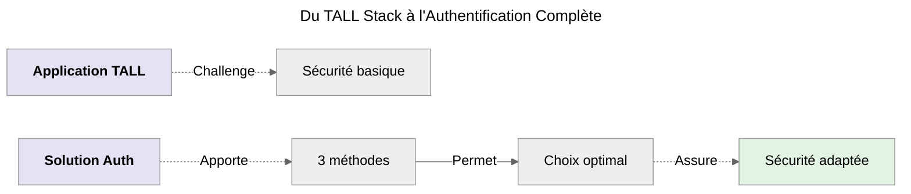
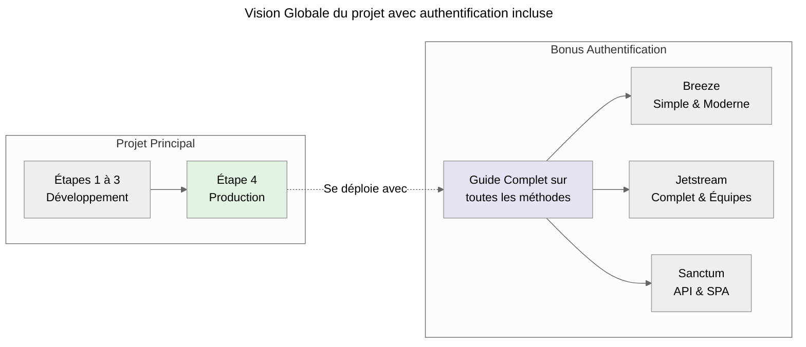
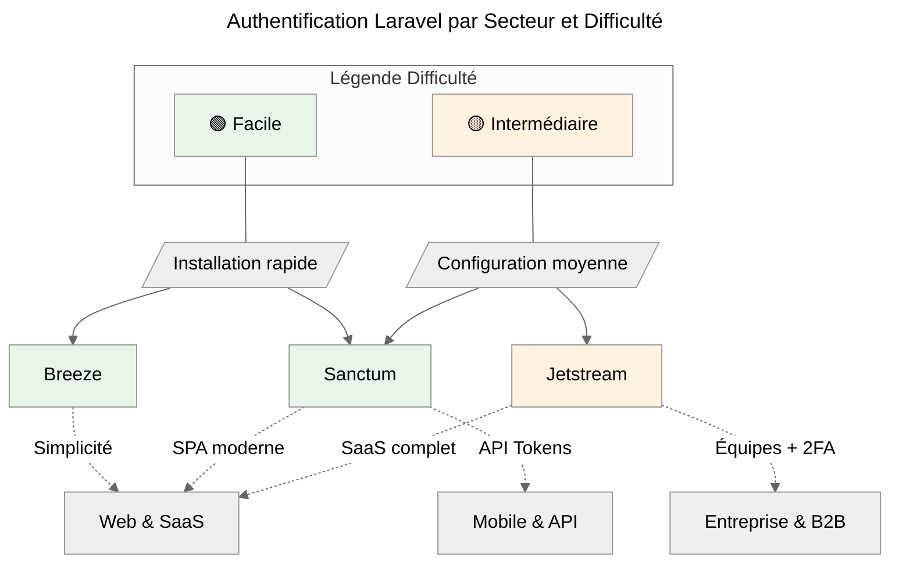
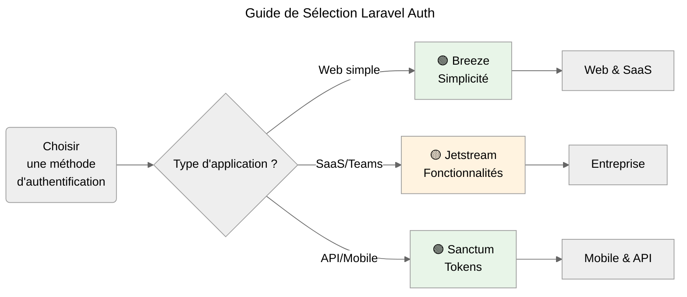
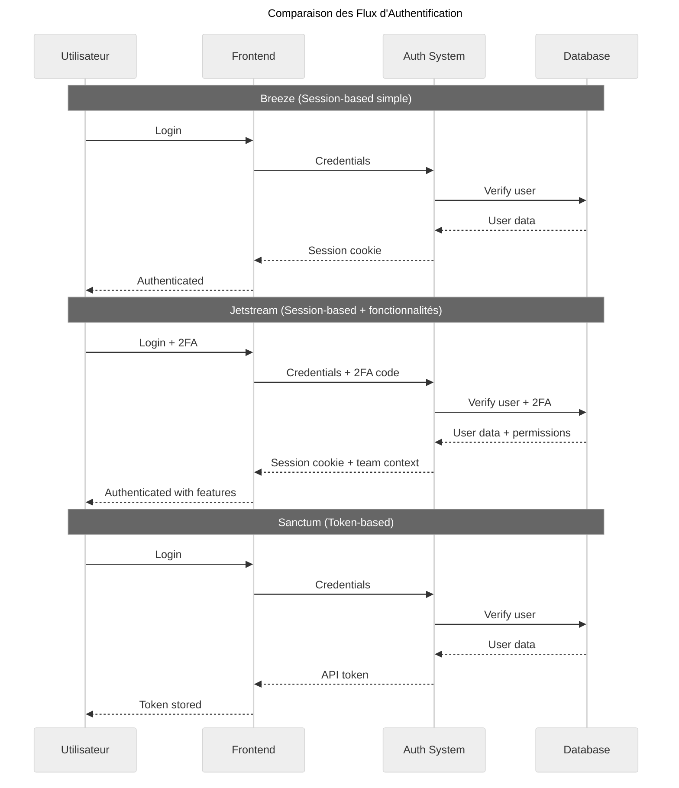

# Présentation

## Qu'est-ce que l'Authentification Laravel ?

**L'authentification Laravel** offre plusieurs approches pour sécuriser votre application, chacune adaptée à des besoins spécifiques.
Voici les principes clés :

-   **Choix adapté au contexte** : _Chaque méthode répond à des besoins différents._
-   **Sécurité intégrée** : _Protection native contre les vulnérabilités courantes._
-   **Flexibilité d'implémentation** : _Adaptation possible aux 3 architectures TALL._
-   **Évolutivité** : _Migration possible entre les différentes approches._

## Évolution Naturelle



_Maintenant que je maîtrise parfaitement les 3 architectures TALL et leur déploiement en production, je vais explorer toutes les méthodes d'authentification Laravel pour choisir la plus adaptée à chaque contexte._

## Pourquoi cette approche ?

Choisir une authentification sans connaître toutes les possibilités disponibles n'aurait pas de sens.<br />
C'est pourquoi nous explorons chaque méthode ( _recommandée_ ) pour savoir précisément quelle solution utiliser et quand.

### Compréhension via un Schéma explicatif



### Valeur ajoutée unique

:::info Guide exhaustif rare
**Je n'ai trouvé aucun guide complet sur le sujet alors autant réaliser le sien pour comprendre chaque notion**.
:::

#### Ce qu'il comprend

-   **Toutes les méthodes** d'authentification Laravel réunies
-   **Comparaison pratique** avec exemples concrets
-   **Adaptation** aux 3 architectures développées précédemment
-   **Référence complète** pour les décisions techniques

#### **Approche différenciante**

-   **Pas de choix imposé** : Comprendre pour mieux choisir
-   **Cas d'usage réels** : Savoir quand utiliser quelle méthode
-   **Migration guidée** : Comment passer d'une méthode à l'autre
-   **Architecture-agnostic** : Fonctionne avec Livewire, Alpine.js et Hybride

### Structure par méthode

Pour **chaque méthode d'authentification**, la démonstration suivra cette structure :

:::note Présentation

-   Philosophie et cas d'usage
-   Avantages et inconvénients
-   Comparaison avec les autres méthodes

:::

:::info Implémentation

-   **Livewire** : Intégration native et optimisations
-   **Alpine.js** : API tokens et gestion côté client
-   **Hybride** : Combinaison optimale des deux approches

:::

:::tip Cas pratiques

-   Exemples concrets d'utilisation
-   Configuration en production
-   Migration depuis/vers d'autres méthodes

:::

## Méthodes d'Authentification Laravel

### Laravel Breeze

**Philosophie** : _Simplicité et modernité_

```php
// Installation simple
composer require laravel/breeze
php artisan breeze:install livewire
```

:::info Idéal pour

-   Applications simples et rapides
-   Prototypage et MVP
-   Blogs personnels et petits e-commerces
-   Apprentissage de l'authentification Laravel

:::

### Laravel Jetstream

**Philosophie** : _Fonctionnalités complètes d'entreprise_

```php
// Installation avec toutes les fonctionnalités
composer require laravel/jetstream
php artisan jetstream:install livewire --teams
```

:::info Idéal pour

-   Applications d'entreprise
-   Gestion d'équipes et rôles complexes
-   Authentification à deux facteurs
-   Gestion avancée des sessions

:::

### Laravel Sanctum

**Philosophie** : _API-first et SPA_

```php
// Installation pour API et SPA
composer require laravel/sanctum
php artisan vendor:publish --provider="Laravel\Sanctum\SanctumServiceProvider"
```

:::info Idéal pour

-   Applications mobiles
-   SPA (_Single Page Applications_)
-   API publiques avec tokens
-   Architecture microservices

:::

## Tableau Comparatif Complet

| Méthode       | Simplicité | Fonctionnalités | Livewire    | Alpine.js     | Hybride     | Production  |
| ------------- | ---------- | --------------- | ----------- | ------------- | ----------- | ----------- |
| **Breeze**    | ⭐⭐⭐⭐⭐ | ⭐⭐⭐          | ✅ Natif    | ⚠️ Adaptation | ✅ Optimal  | ✅ Rapide   |
| **Jetstream** | ⭐⭐⭐     | ⭐⭐⭐⭐⭐      | ✅ Parfait  | ❌ Complexe   | ✅ Puissant | ✅ Complet  |
| **Sanctum**   | ⭐⭐⭐⭐   | ⭐⭐⭐⭐        | ⚠️ API Mode | ✅ Parfait    | ✅ Flexible | ✅ Scalable |

**Légende du tableau**

-   **Simplicité** : Facilité d'installation et de configuration
-   **Fonctionnalités** : Richesse des features prêtes à l'emploi
-   **Architecture** : Compatibilité avec chaque approche TALL
-   **Production** : Facilité de mise en production et maintenance

## Cas d'Usage par Secteur

### Secteur et Difficulté



### Orientation



### Recommandations par Contexte

| Secteur          | Besoin Principal          | Méthode Recommandée | Pourquoi                |
| ---------------- | ------------------------- | ------------------- | ----------------------- |
| **Web Simple**   | Auth rapide               | **Breeze** 🟢       | Installation en 5 min   |
| **SaaS/Équipes** | Fonctionnalités complètes | **Jetstream** 🟡    | 2FA + Teams intégrés    |
| **Mobile/API**   | Tokens simples            | **Sanctum** 🟢      | Parfait pour API/Mobile |

## Compréhension du Flux d'Authentification



## Migration entre Méthodes

### Chemins de migration courants

| De            | Vers          | Difficulté | Raison                  |
| ------------- | ------------- | ---------- | ----------------------- |
| **Breeze**    | **Jetstream** | ⭐⭐       | Plus de fonctionnalités |
| **Breeze**    | **Sanctum**   | ⭐⭐⭐     | API mobile              |
| **Jetstream** | **Sanctum**   | ⭐⭐⭐⭐   | Découplage frontend     |

### Guide de migration

Pour chaque méthode, nous fournirons :

-   **Script de migration** automatisé
-   **Checklist** des étapes manuelles
-   **Tests** de validation post-migration
-   **Rollback** en cas de problème

## Impact de cette Approche

### Pour les Développeurs

#### Gain de temps

-   **Décision éclairée** dès le début du projet
-   **Pas de refactoring** majeur plus tard
-   **Exemples prêts** pour chaque architecture

#### Montée en compétences

-   **Compréhension globale** de l'écosystème Laravel Auth
-   **Bonnes pratiques** pour chaque méthode
-   **Patterns** réutilisables

### Pour les Projets

#### Choix technique optimal

-   **Méthode adaptée** au contexte
-   **Évolutivité** prise en compte
-   **Performance** optimisée

#### Maintenance facilitée

-   **Documentation complète** de l'implémentation
-   **Migration** possible vers d'autres méthodes
-   **Équipe** formée sur les bonnes pratiques

### Pour l'Écosystème

#### Référence unique

-   **Guide complet** inexistant ailleurs
-   **Comparaison objective** des méthodes
-   **Adaptation TALL Stack** pioneering

#### Standardisation

-   **Patterns** reproductibles
-   **Bonnes pratiques** partagées
-   **Évolution** de l'écosystème

## Structure de la partie Bonus

Chaque méthode d'authentification contiendra 3 liens correspondant à la technologie qui sera utilisé.

### Simulation du menu pour comprendre avec : `breeze`

```
📁 breeze
├── 📄 livewire    ← Breeze + Livewire
├── 📄 alpinejs    ← Breeze + Alpine.js
└── 📄 hybrid      ← Breeze + Hybride
```

### Contenu type de chaque lien

```
1. Introduction & Philosophie
2. Difficulté d'implémentation
3. Installation & Configuration
4. Implémentation complète
5. Configuration Production
6. Tests & Validation
7. Migration & Évolution
8. Cas d'Usage Avancés
9. Troubleshooting
10. Conclusion
```

### Approche Pratique

-   **Code complet** et testé
-   **Explications détaillées** de chaque choix
-   **Optimisations** spécifiques à chaque architecture
-   **Exemples concrets** d'utilisation

---

:::info Objectif Final
**Créer LA référence complète** pour l'authentification Laravel dans l'écosystème TALL Stack, permettant aux développeurs de faire
des **choix éclairés** et d'**implémenter efficacement** la méthode la plus adaptée à leur contexte.
:::
