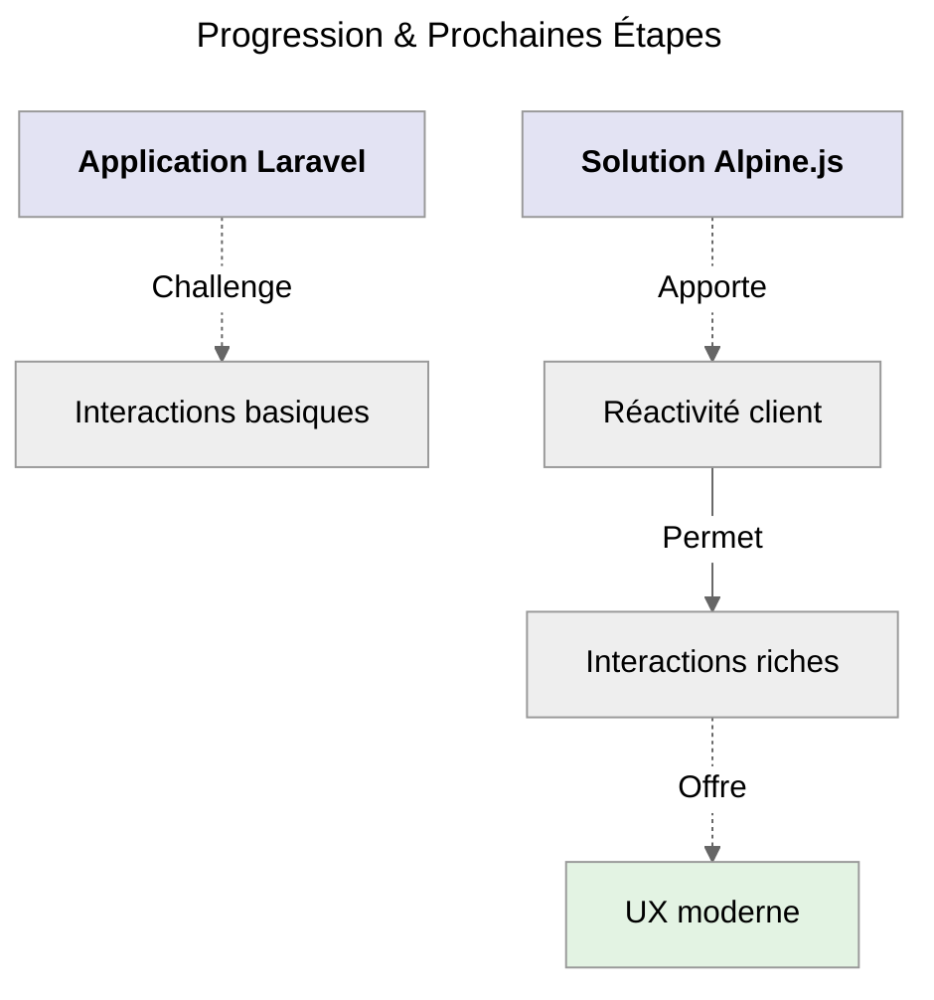
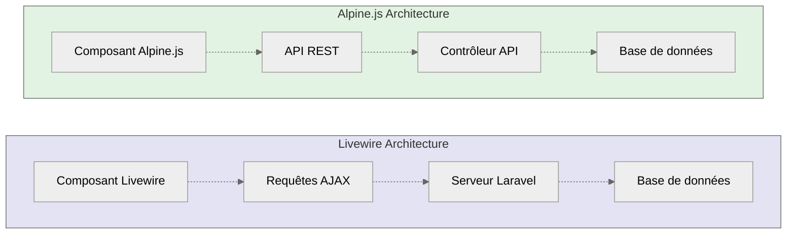
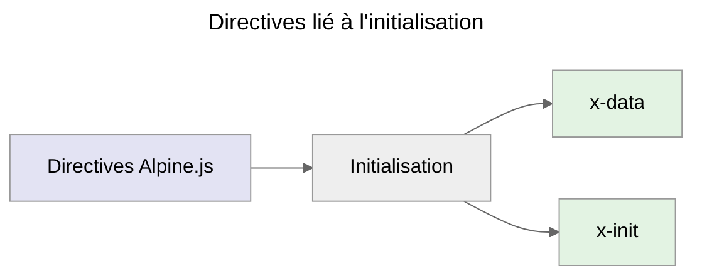
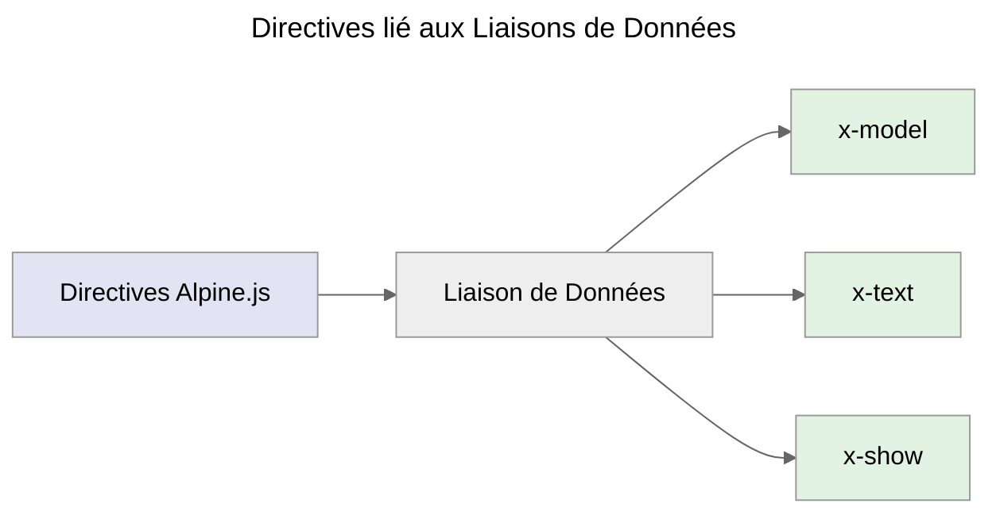
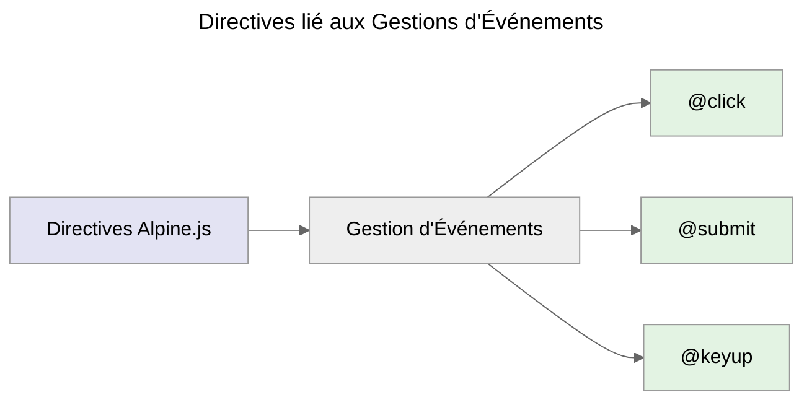
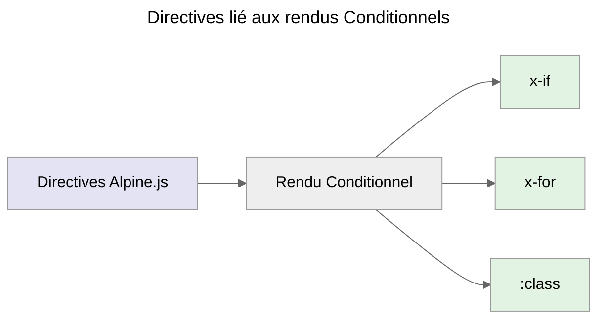
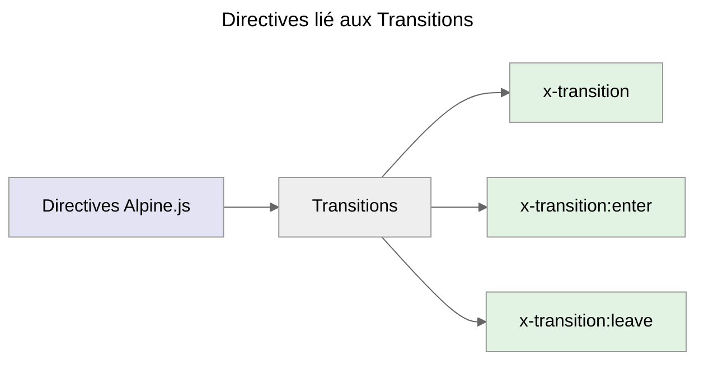
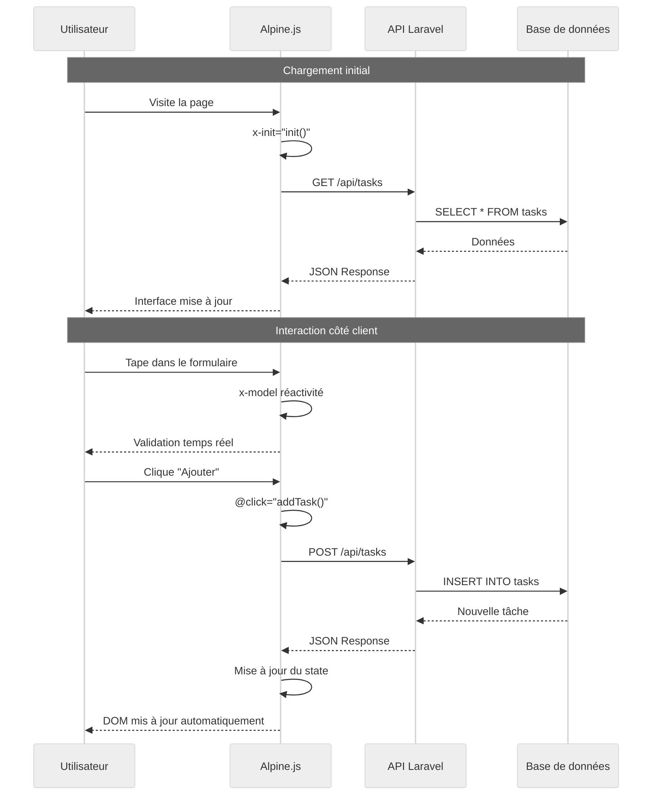

# 🟡 - Alpine.js Pur

:::warning A prendre en compte immédiatement
**Parcours Alpine.js ( _Plus avancé que Livewire_ 🟡 )**<br />
**Alpine.js** = _Réactivité côté client_
:::

:::note
_Pour cette partie et apprendre à utiliser Alpine.js, **vous pouvez recréer un projet** avec **tasks-alpine** comme nom._<br />
_Nous ne le ferons pas ici, mais c'est tout à fait louable et surtout, ça vous fera pratiquer ce qui a déjà été vu auparavant._
:::

## **Qu'est-ce qu'Alpine.js ?**

**Alpine.js** est un **framework JavaScript minimaliste** qui apporte la réactivité directement dans le HTML sans la complexité de frameworks
lourds comme React ou Vue.js. Il constitue une alternative moderne pour créer des interfaces interactives tout en conservant la simplicité
d'utilisation.

**Voici ses principes clés :**

-   **Léger et performant** : _Seulement **~15KB minifié**, idéal pour les performances._
-   **Déclaratif** : _Logique directement intégrée dans le **HTML** avec une syntaxe **intuitive**._
-   **Réactif** : _Mises à jour automatiques de l'interface utilisateur côté client._
-   **Sans compilation** : _Fonctionnement direct dans le navigateur sans étape de build._

## **Évolution Naturelle**



_Maintenant que nous maîtrisons Laravel classique, nous allons ajouter Alpine.js pour créer des interactions fluides côté client. Cette
approche nécessite une architecture différente de Livewire, car la logique s'exécute entièrement dans le navigateur et communique avec le
serveur via des API REST._

## **Différence Fondamentale avec Livewire**

### Architecture Comparative

L'approche Alpine.js diffère radicalement de Livewire dans sa philosophie d'exécution. Cette différence architecturale influence
directement la manière dont nous structurons notre application.

**Livewire - Approche Serveur**

-   Logique métier exécutée côté serveur
-   Communication via requêtes AJAX automatiques
-   Validation et sécurité intégrées côté serveur
-   Pas d'API REST nécessaire

**Alpine.js - Approche Client**

-   Logique métier exécutée côté client
-   Communication via API REST explicite
-   Validation côté client ET serveur
-   Nécessite la création d'endpoints API

### Diagramme Architectural



Cette distinction architecturale nécessite de créer une **API REST complète** pour permettre la communication entre
le **frontend Alpine.js** et le **backend Laravel**.

## **Création de l'API Laravel**

> La création d'un contrôleur API dédié constitue **la première étape** pour établir la communication entre **Alpine.js** et **Laravel**.
> Ce contrôleur diffère des contrôleurs web classiques par sa spécialisation dans les réponses JSON.

### Contrôleur API

```bash
# Créer le contrôleur API avec toutes les méthodes REST
php artisan make:controller Api/TaskController --api
```

:::info
Cette commande génère automatiquement **un contrôleur optimisé pour les API REST** avec les méthodes **index**, **store**, **show**,
**update** et **destroy** de pré-configurées.
:::

:::note Fichier créé automatiquement
Contrôleur API : **`app/Http/Controllers/Api/TaskController.php`**
:::

### Structure du contrôleur API

:::note Emplacement Fichier utilisé ici
Contrôleur API : **`app/Http/Controllers/Api/TaskController.php`**
:::

```php
<?php

namespace App\Http\Controllers\Api;

use App\Http\Controllers\Controller;
use App\Models\Task;
use Illuminate\Http\Request;

class TaskController extends Controller
{
    // Toutes les méthodes API seront implémentées ici
}
```

_Le contrôleur API hérite du contrôleur de base mais se spécialise dans **la gestion des requêtes HTTP** et **la création de réponses JSON**
structurées pour la consommation par Alpine.js._

## **Implémentation des Méthodes API**

### Méthode `index()`

_La méthode **`index()`** constitue le point d'entrée principal pour récupérer la liste complète des tâches.
**Elle retourne les données au format JSON avec les codes de statut HTTP appropriés**._

```php
// Récupérer toutes les tâches au format JSON
public function index()
{
    $tasks = Task::latest()->get();

    return response()->json([
        'data' => $tasks,
        'message' => 'Tâches récupérées avec succès'
    ], 200);

    // Sans message flash
    // return response()->json($tasks);
}
```

Cette méthode utilise la méthode **`latest()`** d'**Eloquent** ( _ORM - Object Relationnal Mapping_ ) pour trier les tâches par
**date de création décroissante**, garantissant que les tâches les plus récentes apparaissent en premier dans l'interface utilisateur.

### Méthode `store()`

_La méthode **`store()`** gère la création de nouvelles tâches via des **requêtes POST**.
**Elle intègre la validation des données** et retourne la tâche créée avec un code de statut **HTTP 201**._

```php
// Créer une nouvelle tâche via l'API REST
public function store(Request $request)
{
    $validated = $request->validate([
        'title' => 'required|min:3|max:255',
        'description' => 'nullable|max:500'
    ]);

    $task = Task::create($validated);

    return response()->json([
        'data' => $task,
        'message' => 'Tâche créée avec succès'
    ], 201);

    // Sans message flash (qui pourrait énervé si c'est trop intrusif)
    // return response()->json($task, 201);
}
```

**La validation s'effectue côté serveur** pour garantir la sécurité et la cohérence des données, même si **une validation préliminaire** peut
être implémentée côté client avec Alpine.js.

### Méthode `update()`

_La méthode **`update()`** permet la modification des tâches existantes via des **requêtes PUT**.
Elle utilise la liaison de modèle de Laravel pour récupérer automatiquement la tâche à modifier._

```php
// Mettre à jour une tâche existante
public function update(Request $request, Task $task)
{
    $validated = $request->validate([
        'title' => 'required|min:3|max:255',
        'description' => 'nullable|max:500',
        'completed' => 'boolean'
    ]);

    $task->update($validated);

    return response()->json([
        'data' => $task->fresh(),
        'message' => 'Tâche mise à jour avec succès'
    ], 200);

    // Sans message
    // return response()->json($task);
}
```

La méthode **`fresh()`** garantit que les données retournées reflètent l'état actuel de la tâche en base de données après la mise à jour.

### Méthode `destroy()`

_La méthode **`destroy()`** gère la suppression des tâches via des **requêtes DELETE**.
Elle retourne un message de confirmation sans données supplémentaires._

```php
// Supprimer une tâche définitivement
public function destroy(Task $task)
{
    $task->delete();

    return response()->json([
        'message' => 'Tâche supprimée avec succès'
    ], 200);
}
```

### Méthode `toggle()`

_La méthode **`toggle()`** représente une action personnalisée qui bascule l'état de complétion d'une tâche.
Elle illustre comment créer des endpoints API spécialisés au-delà des opérations CRUD standard._

```php
// Basculer l'état de complétion d'une tâche
public function toggle(Task $task)
{
    $task->update(['completed' => !$task->completed]);

    return response()->json([
        'data' => $task->fresh(),
        'message' => 'État de la tâche modifié avec succès'
    ], 200);

    // Sans message
    // return response()->json($task);
}
```

### Méthode `stats()`

_La méthode **`stats()`** fournit des statistiques calculées sur les tâches.
Elle démontre comment créer des endpoints API pour des données agrégées._

```php
// Calculer et retourner les statistiques des tâches
public function stats()
{
    $total = Task::count();
    $completed = Task::where('completed', true)->count();
    $pending = Task::where('completed', false)->count();
    $completionRate = $total > 0 ? round(($completed / $total) * 100) : 0;

    return response()->json([
        'data' => [
            'total' => $total,
            'completed' => $completed,
            'pending' => $pending,
            'completion_rate' => $completionRate
        ],
        'message' => 'Statistiques calculées avec succès'
    ], 200);

    // Sans message
    // return response()->json([
    //     'total' => $total,
    //     'completed' => $completed,
    //     'pending' => $pending,
    //     'completion_rate' => $completionRate
    // ]);
}
```

Cette méthode utilise des **requêtes Eloquent** optimisées pour calculer efficacement les statistiques nécessaires
à l'affichage du tableau de bord.

## **Configuration des Routes API**

### Structure des Routes REST

:::note Emplacement Fichier
**`routes/api.php`**
:::

```php
<?php

use App\Http\Controllers\Api\TaskController;
use Illuminate\Support\Facades\Route;

Route::prefix('tasks')->group(function () {
    Route::get('/', [TaskController::class, 'index']);                  // GET /api/tasks
    Route::post('/', [TaskController::class, 'store']);                 // POST /api/tasks
    Route::put('/{task}', [TaskController::class, 'update']);           // PUT /api/tasks/{id}
    Route::delete('/{task}', [TaskController::class, 'destroy']);       // DELETE /api/tasks/{id}
    Route::patch('/{task}/toggle', [TaskController::class, 'toggle']);  // PATCH /api/tasks/{id}/toggle
    Route::get('/stats', [TaskController::class, 'stats']);             // GET /api/tasks/stats
});
```

### Tableau de Correspondance des Routes

| Méthode HTTP | Endpoint                   | Action  | Description                                        |
| :----------: | -------------------------- | :-----: | -------------------------------------------------- |
|   **GET**    | `/api/tasks`               |  index  | _Récupération de toutes les tâches._               |
|   **GET**    | `/api/tasks`               |  stats  | _Récupération des statistiques._                   |
|   **POST**   | `/api/tasks/\{id\}`        |  store  | _Création d'une nouvelle tâche._                   |
|   **PUT**    | `/api/tasks/\{id\}`        | update  | _Mise à jour complète d'une tâche._                |
|  **PATCH**   | `/api/tasks/\{id\}/toggle` | toggle  | _Basculement de l'état de complétion d'une tâche._ |
|  **DELETE**  | `/api/tasks/\{id\}`        | destroy | _Suppression d'une tâche._                         |

Cette structure respecte les conventions **REST** et facilite la compréhension et la maintenance de l'API.

## **Composant Alpine.js**

### Qu'est-ce qu'un Composant Alpine.js

:::info Fondamentaux pour comprendre la suite
Un **Composant Alpine.js** est une fonction JavaScript qui retourne un objet contenant l'état réactif et les méthodes de votre composant.
Cette approche diffère des frameworks comme **React** ou **Vue**.js en privilégiant la simplicité et l'intégration directe dans le HTML.
:::

#### Convention de nommage

_Les composants Alpine.js suivent une convention de nommage **fonctionnelle** qui facilite leur identification et leur utilisation
dans les **templates HTML**._

```javascript
// Fonction composant avec nommage descriptif
function taskManager() {
    return {
        // État réactif - Propriétés observées par Alpine.js
        tasks: [],
        loading: false,

        // Méthodes - Actions disponibles pour l'interface
        async addTask() {
            /* Logique d'ajout de tâche */
        },

        async deleteTask(taskId) {
            /* Logique de suppression */
        },
    };
}
```

### Placement et Intégration

Le composant se place dans une balise **`<script>`** à la **fin du document HTML**, après tout le contenu de l'interface utilisateur.
Cette approche **garantit que le DOM est entièrement chargé** avant l'initialisation d'Alpine.js.

### Structure Complète du composant

_La structure du composant Alpine.js reflète l'architecture de l'application et organise l'état et les méthodes de manière logique
et maintenable._

```javascript
function taskManager() {
    return {
        // État des données - Propriétés réactives
        tasks: [],
        stats: {
            total: 0,
            completed: 0,
            pending: 0,
            completion_rate: 0,
        },
        form: {
            title: '',
            description: '',
        },
        editingTask: null,
        search: '',
        filter: 'all',
        loading: false,
        message: '',
        errors: {},

        // Méthodes d'initialisation et gestion des données
        // Toutes les méthodes seront implémentées ici
    };
}
```

:::warning Premier et dernier rappel
_Toutes les méthodes qui suivent doivent être implémentées dans l'objet retourné par la fonction **`taskManager()`**.<br />
Cette structure garantit que l'état et les méthodes sont correctement encapsulés et accessibles par Alpine.js._
:::

### Méthode `init()`

_La méthode **`init()`** constitue le point d'entrée du composant Alpine.js.
Elle s'exécute automatiquement lors de l'initialisation du composant et configure l'état initial de l'application._

```javascript
// Initialisation automatique du composant
async init() {
    await this.loadTasks();
    await this.loadStats();
},
```

Cette méthode utilise **la programmation asynchrone** ( _async & await_ ) pour charger les données initiales sans bloquer l'interface
utilisateur. L'ordre d'exécution **garantit que les tâches sont chargées avant le calcul des statistiques**.

### Méthode `loadTasks()`

_La méthode **`loadTasks()`** récupère la liste des tâches depuis l'API REST.
Elle gère les erreurs de réseau et met à jour l'état du composant avec les données récupérées.._

```javascript
// Chargement des tâches depuis l'API REST
async loadTasks() {
    try {
        this.loading = true;
        const response = await fetch('/api/tasks');

        if (!response.ok) {
            throw new Error('Erreur lors du chargement des tâches');
        }

        const loadingData = await response.json();
        this.tasks = loadingData.data || [];
    } catch (error) {
        console.error('Erreur:', error);
        this.showMessage('Erreur lors du chargement des tâches', 'error');
    } finally {
        this.loading = false;
    }
},
```

La gestion des erreurs inclut la vérification du statut HTTP et la capture des exceptions réseau pour fournir un feedback
approprié à l'utilisateur.

### Méthode `loadStats()`

_La méthode **`loadStats()`** récupère les statistiques calculées depuis l'API et met à jour l'affichage du tableau de bord._

```javascript
// Chargement des statistiques depuis l'API
async loadStats() {
    try {
        const response = await fetch('/api/tasks/stats');

        if (!response.ok) {
            throw new Error('Erreur lors du chargement des statistiques');
        }

        const statsData = await response.json();
        this.stats = statsData.data || {};
    } catch (error) {
        console.error('Erreur lors du chargement des statistiques:', error);
        // Les statistiques ne sont pas critiques, on continue sans message d'erreur
    }
},
```

### Méthode `addTask()`

_La méthode **`addTask()`** gère la création de nouvelles tâches via l'API REST.
Elle inclut la validation côté client et la gestion des erreurs serveur._

```javascript


        if (response.ok) {

        } else {
            const errors = await response.json();
            this.errors = errors.errors || {};
        }


// Ajouter une tâche via l'API REST
async addTask() {
    // Validation côté client avant envoi
    if (!this.form.title.trim()) {
        this.errors.title = 'Le titre est obligatoire';
        return;
    }

    // Initialisation de l'état de chargement
    this.loading = true;
    this.errors = {};

    try {
        const response = await fetch('/api/tasks', {
            method: 'POST',
            headers: {
                'Content-Type': 'application/json',
                'X-CSRF-TOKEN': document.querySelector('meta[name="csrf-token"]').getAttribute('content')
            },
            body: JSON.stringify(this.form)
        });

        if (response.ok) {
            // Traitement de la réponse avec structure data
            const newTask = await response.json();

            // Mise à jour optimiste de l'interface
            this.tasks.unshift(newTask);
            this.resetForm();
            this.showMessage('Tâche ajoutée avec succès !');

            // Rechargement des statistiques
            await this.loadStats();
        } else {
            // Gestion des erreurs de validation serveur
            const errorData = await response.json();
            this.errors = errorData.errors || {};
        }
    } catch (error) {
        console.error('Erreur lors de l\'ajout:', error);
        this.showMessage('Erreur lors de l\'ajout de la tâche', 'error');
    } finally {
        this.loading = false;
    }
}
```

Cette méthode illustre la gestion complète d'une requête API avec validation côté client, traitement des réponses structurées
et mise à jour optimiste de l'interface utilisateur.

### Méthode `updateTask()`

_La méthode **`updateTask()`** gère la modification des tâches existantes.
Elle suit le même pattern de traitement des réponses JSON structurées que la méthode **`addTask()`**._

```javascript
// Modifier une tâche existante via l'API REST
async updateTask() {
    // Validation préalable des données
    if (!this.form.title.trim()) {
        this.errors.title = 'Le titre est obligatoire';
        return;
    }

    this.loading = true;
    this.errors = {};

    try {
        const response = await fetch(`/api/tasks/${this.editingTask.id}`, {
            method: 'PUT',
            headers: {
                'Content-Type': 'application/json',
                'X-CSRF-TOKEN': document.querySelector('meta[name="csrf-token"]').getAttribute('content')
            },
            body: JSON.stringify(this.form)
        });

        if (response.ok) {
            // Extraction des données de la réponse structurée
            const updatedTask = await response.json();

            // Mise à jour locale de la tâche modifiée
            const taskIndex = this.tasks.findIndex(task => task.id === updatedTask.id);
            if (taskIndex  !== -1) {
                this.tasks[taskIndex] = updatedTask;
            }

            // Réinitialisation du mode édition
            this.cancelEdit();
            this.showMessage('Tâche mise à jour !');

            // Actualisation des statistiques
            await this.loadStats();
        } else {
            // Traitement des erreurs de validation
            const errors = await response.json();
            this.errors = errors.errors || {};
        }
    } catch (error) {
        console.error('Erreur lors de la mise à jour:', error);
        this.showMessage('Erreur lors de la mise à jour', 'error');
    } finally {
        this.loading = false;
    }
},
```

### Méthode `toggleTask()`

_La méthode **`toggleTask()`** bascule l'état de complétion d'une tâche via l'endpoint API spécialisé.
Elle traite la réponse JSON structurée pour mettre à jour l'interface utilisateur._

```javascript
// Basculer l'état de complétion d'une tâche
async toggleTask(task) {
    this.loading = true;

    try {
        const response = await fetch(`/api/tasks/${task.id}/toggle`, {
            method: 'PATCH',
            headers: {
                'X-CSRF-TOKEN': document.querySelector('meta[name="csrf-token"]').getAttribute('content')
            }
        });

        if (response.ok) {
            // Traitement de la réponse avec extraction des données
            const updatedTask = await response.json();

            // Localisation et mise à jour de la tâche dans la liste
            const taskIndex = this.tasks.findIndex(taskDB => taskDB.id === task.id);
            if (taskIndex !== -1) {
                this.tasks[taskIndex] = updatedTask;
            }
            this.showMessage('Tâche mise à jour !');

            // Recalcul des statistiques après modification
            await this.loadStats();
        } else {
            throw new Error('Erreur lors du basculement de l\'état');
        }
    } catch (error) {
        console.error('Erreur lors du basculement:', error);
        this.showMessage('Erreur lors de la mise à jour', 'error');
    } finally {
        this.loading = false;
    }
},
```

### Méthode `deleteTask()`

_La méthode **`deleteTask()`** gère la suppression des tâches avec confirmation utilisateur.
Elle traite la réponse de suppression et met à jour l'interface de manière optimiste.._

```javascript
// Supprimer une tâche avec confirmation utilisateur
async deleteTask(task) {
    // Demande de confirmation avant suppression
    if (!confirm('Êtes-vous sûr de vouloir supprimer cette tâche ?')) {
        return;
    }

    this.loading = true;

    try {
        const response = await fetch(`/api/tasks/${task.id}`, {
            method: 'DELETE',
            headers: {
                'X-CSRF-TOKEN': document.querySelector('meta[name="csrf-token"]').getAttribute('content')
            }
        });

        if (response.ok) {
            // La suppression ne retourne que le message de confirmation
            const responseData = await response.json();

            // Suppression optimiste de la tâche de la liste locale
            this.tasks = this.tasks.filter(t => t.id !== task.id);

            this.showMessage('Tâche supprimée avec succès !');

            // Mise à jour des statistiques après suppression
            await this.loadStats();
        } else {
            throw new Error('Erreur lors de la suppression');
        }
    } catch (error) {
        console.error('Erreur lors de la suppression:', error);
        this.showMessage('Erreur lors de la suppression', 'error');
    } finally {
        this.loading = false;
    }
},
```

## **Méthodes Utilitaires et de Gestion d'État**

_Ces méthodes gèrent l'état local du composant sans interaction avec l'API, maintenant la cohérence de l'expérience utilisateur._

### Méthode `editTask()`

_Permet de démarrer le mode édition d'une tâche._

```javascript
// Commencer l'édition
editTask(task) {
    this.editingTask = task;
    this.form = {
        title: task.title,
        description: task.description || ''
    };
    this.errors = {};
},
```

### Méthode `cancelEdit()`

_Permet d'annuler le mode édition et réinitialiser l'état._

```javascript
// Annuler le mode édition et réinitialiser l'état
cancelEdit() {
    this.editingTask = null;
    this.resetForm();
},
```

### Méthode `resetForm()`

_Permet de réinitialiser le formulaire à son état initial._

```javascript
// Réinitialiser le formulaire à son état initial
resetForm() {
    this.form = {
        title: '',
        description: ''
    };
    this.errors = {};
},
```

### Méthode `resetFilters()`

_Permet de réinitialiser les filtres de recherche et de statut._

```javascript
// Réinitialiser les filtres de recherche et de statut
resetFilters() {
    this.search = '';
    this.filter = 'all';
},
```

### Méthode `showMessage()`

_Permet d'afficher un message temporaire à l'utilisateur._

```javascript
// Afficher un message temporaire à l'utilisateur
showMessage(text, type = 'success') {
    this.message = text;
    setTimeout(() => {
        this.message = '';
    }, 3000);
},
```

### Méthode `formatDate()`

_Permet de formater les dates pour l'affichage utilisateur._

```javascript
// Formater les dates pour l'affichage utilisateur
formatDate(dateString) {
    const date = new Date(dateString);
    const now = new Date();
    const timeDifference = now - date;
    const daysDifference = Math.floor(timeDifference / (1000 * 60 * 60 * 24));

    if (daysDifference === 0) return 'aujourd\'hui';
    if (daysDifference === 1) return 'hier';
    if (daysDifference < 7) return `il y a ${daysDifference} jours`;

    return date.toLocaleDateString('fr-FR');
}
```

### Propriété calculée `filteredTasks`

_Cette propriété calculée démontre la réactivité d'Alpine.js en filtrant automatiquement les tâches selon les critères de recherche
et de statut._

```javascript
// Propriété calculée pour le filtrage dynamique des tâches
get filteredTasks() {
    let filteredResults = this.tasks;

    // Application du filtre de recherche textuelle
    if (this.search) {
        const searchTerm  = this.search.toLowerCase();
        filteredResults = filteredResults.filter(task =>
            const titleMatch = task.title.toLowerCase().includes(searchTerm);
            const descriptionMatch = task.description && task.description.toLowerCase().includes(searchTerm);
            return titleMatch || descriptionMatch
        );
    }

    // Application du filtre de statut
    if (this.filter === 'completed') {
        filteredResults = filteredResults.filter(task => task.completed);
    } else if (this.filter === 'pending') {
        filteredResults = filteredResults.filter(task => !task.completed);
    }

    return filteredResults;
}
```

## **Concepts Clés Alpine.js**

### Architecture Déclarative

Alpine.js privilégie une approche déclarative où la logique est exprimée directement dans le HTML via des directives spécialisées.
Cette philosophie rapproche le comportement de la présentation pour une meilleure lisibilité.

### Directives Fondamentales











<br />

:::danger Urgent
Il est important de comprendre cette partie afin de pouvoir implémenter ce concept dans nos fichiers HTML.
:::

### 1. Initialisation du composant

> Les directives d'initialisation établissent le contexte Alpine.js et configurent l'état initial du composant.

```html
<!-- Initialisation du composant avec les données -->
<div x-data="taskManager()">
    <!-- Exécution automatique lors de l'initialisation -->
    <div x-init="init()">
        <!-- Contenu du composant ici ... -->
    </div>
</div>
```

### 2. Liaison de données

```html
<!-- Liaison bidirectionnelle avec le modèle -->
<input x-model="form.title" type="text" placeholder="Titre de la tâche" />

<!-- Affichage de texte dynamique -->
<h3 x-text="task.title"></h3>

<!-- Affichage conditionnel -->
<div x-show="loading">Chargement en cours...</div>
```

### 3. Gestion d'événements

> Les directives d'événements connectent les interactions utilisateur aux méthodes du composant.

```html
<!-- Gestion du clic sur un bouton -->
<button @click="addTask()">Ajouter une tâche</button>

<!-- Soumission de formulaire avec une prévention du comportement par défaut -->
<form @submit.prevent="addTask()">
    <!-- Contenu du formulaire -->
</form>

<!-- Gestion des événements clavier -->
<input @keyup.enter="addTask()" type="text" />
```

### 4. Rendu de Listes et Conditions

> Les directives de rendu gèrent l'affichage dynamique du contenu selon l'état de l'application.

```html
<!-- Rendu de liste avec clé unique -->
<template x-for="task in filteredTasks" :key="task.id">
    <div x-text="task.title"></div>
</template>

<!-- Classes conditionnelles -->
<div :class="{ 'completed': task.completed, 'pending': !task.completed }">
    <!-- Contenu de la tâche -->
</div>

<!-- Attributs dynamiques -->
<button :disabled="loading">Action</button>
```

### 5. Transitions et Animations

> Les directives de transition créent des animations fluides lors des changements d'état.

```html
<!-- Transition d'entrée -->
x-transition:enter="transition ease-out duration-300"
x-transition:enter-start="opacity-0 transform translate-y-2"
x-transition:enter-end="opacity-100 transform translate-y-0"

<!-- Transition d'entrée & de sortie -->
<div
    x-show="message"
    x-transition:enter="transition ease-out duration-300"
    x-transition:enter-start="opacity-0 transform translate-y-2"
    x-transition:enter-end="opacity-100 transform translate-y-0"
    x-transition:leave="transition ease-in duration-150"
    x-transition:leave-start="opacity-100 transform translate-y-0"
    x-transition:leave-end="opacity-0 transform translate-y-2"
>
    Message affiché
</div>
```

## **Vue Alpine.js Complète**

### Structure HTML avec Intégration Alpine.js

> L'interface utilisateur intègre toutes les directives Alpine.js dans une structure HTML sémantique et accessible.

:::note Emplacement Fichier
**`resources/views/alpine-tasks.blade.php`**
:::

```html
<!DOCTYPE html>
<html lang="fr">
    <head>
        <meta charset="utf-8" />
        <meta name="viewport" content="width=device-width, initial-scale=1" />
        <title>TALL Tasks - Alpine.js</title>
        <script src="https://cdn.tailwindcss.com"></script>
        <script
            defer
            src="https://unpkg.com/alpinejs@3.x.x/dist/cdn.min.js"
        ></script>
        <meta name="csrf-token" content="{{ csrf_token() }}" />
    </head>
    <body class="bg-gray-100">
        <div class="min-h-screen">
            <!-- En-tête de l'application -->
            <header class="bg-white shadow-sm border-b">
                <div class="max-w-4xl mx-auto px-6 py-4">
                    <div class="flex items-center justify-between">
                        <h1 class="text-2xl font-bold text-gray-800">
                            TALL Tasks
                        </h1>
                        <div class="flex items-center space-x-2">
                            <span
                                class="px-2 py-1 bg-blue-100 text-blue-800 rounded text-sm"
                                >Tailwind ✓</span
                            >
                            <span
                                class="px-2 py-1 bg-green-100 text-green-800 rounded text-sm"
                                >Alpine.js ✓</span
                            >
                            <span
                                class="px-2 py-1 bg-red-100 text-red-800 rounded text-sm"
                                >Laravel API ✓</span
                            >
                        </div>
                    </div>
                    <div class="mt-2 text-sm text-gray-600">
                        Étape 3:
                        <span class="text-green-600 font-medium"
                            >Réactivité Alpine.js 🏔️</span
                        >
                    </div>
                </div>
            </header>

            <!-- Application principale avec Alpine.js -->
            <main class="py-8" x-data="taskManager()" x-init="init()">
                <div class="max-w-4xl mx-auto px-6">
                    <!-- Messages utilisateur -->
                    <div
                        x-show="message"
                        x-transition:enter="transition ease-out duration-300"
                        x-transition:enter-start="opacity-0 transform translate-y-2"
                        x-transition:enter-end="opacity-100 transform translate-y-0"
                        x-transition:leave="transition ease-in duration-150"
                        x-transition:leave-start="opacity-100 transform translate-y-0"
                        x-transition:leave-end="opacity-0 transform translate-y-2"
                        class="mb-6 p-4 bg-green-100 border border-green-400 text-green-700 rounded-lg"
                    >
                        <div class="flex items-center justify-between">
                            <span x-text="message"></span>
                            <button
                                @click="message = ''"
                                class="text-green-500 hover:text-green-700"
                            >
                                &times;
                            </button>
                        </div>
                    </div>

                    <!-- Bannière informative Alpine.js -->
                    <div
                        class="mb-6 p-4 bg-green-50 border-l-4 border-green-400"
                    >
                        <div class="flex items-center">
                            <div class="flex-shrink-0">
                                <span class="text-green-600">🏔️</span>
                            </div>
                            <div class="ml-3">
                                <p class="text-sm text-green-700">
                                    <strong>Alpine.js en action :</strong>
                                    Toutes les interactions se font côté client
                                    avec des appels API !
                                </p>
                            </div>
                        </div>
                    </div>

                    <!-- Tableau de bord des statistiques -->
                    <div class="grid grid-cols-1 md:grid-cols-4 gap-4 mb-6">
                        <div class="bg-white p-4 rounded-lg shadow text-center">
                            <div
                                class="text-2xl font-bold text-blue-600"
                                x-text="stats.total"
                            ></div>
                            <div class="text-gray-600">Total</div>
                        </div>
                        <div class="bg-white p-4 rounded-lg shadow text-center">
                            <div
                                class="text-2xl font-bold text-green-600"
                                x-text="stats.completed"
                            ></div>
                            <div class="text-gray-600">Terminées</div>
                        </div>
                        <div class="bg-white p-4 rounded-lg shadow text-center">
                            <div
                                class="text-2xl font-bold text-yellow-600"
                                x-text="stats.pending"
                            ></div>
                            <div class="text-gray-600">En cours</div>
                        </div>
                        <div class="bg-white p-4 rounded-lg shadow text-center">
                            <div
                                class="text-2xl font-bold text-purple-600"
                                x-text="stats.completion_rate + '%'"
                            ></div>
                            <div class="text-gray-600">Progression</div>
                        </div>
                    </div>

                    <!-- Recherche et filtres -->
                    <div class="bg-white rounded-lg shadow-md p-6 mb-6">
                        <h2 class="text-xl font-semibold mb-4">
                            🔍 Recherche et filtres
                        </h2>

                        <div class="grid grid-cols-1 md:grid-cols-3 gap-4">
                            <!-- Recherche -->
                            <div>
                                <label
                                    class="block text-sm font-medium text-gray-700 mb-2"
                                    >Rechercher</label
                                >
                                <input
                                    type="text"
                                    x-model="search"
                                    class="w-full px-4 py-2 border rounded-lg focus:ring-2 focus:ring-blue-500"
                                    placeholder="Rechercher une tâche..."
                                />
                            </div>

                            <!-- Filtre -->
                            <div>
                                <label
                                    class="block text-sm font-medium text-gray-700 mb-2"
                                    >Filtrer</label
                                >
                                <select
                                    x-model="filter"
                                    class="w-full px-4 py-2 border rounded-lg focus:ring-2 focus:ring-blue-500"
                                >
                                    <option value="all">
                                        Toutes les tâches
                                    </option>
                                    <option value="pending">En cours</option>
                                    <option value="completed">Terminées</option>
                                </select>
                            </div>

                            <!-- Bouton reset -->
                            <div class="flex items-end">
                                <button
                                    @click="resetFilters()"
                                    class="px-4 py-2 bg-gray-500 text-white rounded-lg hover:bg-gray-600 transition-colors"
                                >
                                    🔄 Réinitialiser
                                </button>
                            </div>
                        </div>
                    </div>

                    <!-- Formulaire d'ajout/édition -->
                    <div class="bg-white rounded-lg shadow-md p-6 mb-6">
                        <h2 class="text-xl font-semibold mb-4">
                            <span
                                x-text="editingTask ? '✏️ Modifier la tâche' : '➕ Ajouter une tâche'"
                            ></span>
                        </h2>

                        <form
                            @submit.prevent="editingTask ? updateTask() : addTask()"
                        >
                            <div class="grid grid-cols-1 md:grid-cols-2 gap-4">
                                <!-- Titre -->
                                <div>
                                    <label
                                        class="block text-sm font-medium text-gray-700 mb-2"
                                        >Titre *</label
                                    >
                                    <input
                                        type="text"
                                        x-model="form.title"
                                        class="w-full px-4 py-2 border rounded-lg focus:ring-2 focus:ring-blue-500"
                                        :class="{'border-red-500': errors.title}"
                                        placeholder="Ex: Terminer le projet"
                                        required
                                    />
                                    <p
                                        x-show="errors.title"
                                        x-text="errors.title"
                                        class="mt-1 text-sm text-red-600"
                                    ></p>
                                </div>

                                <!-- Description -->
                                <div>
                                    <label
                                        class="block text-sm font-medium text-gray-700 mb-2"
                                        >Description</label
                                    >
                                    <input
                                        type="text"
                                        x-model="form.description"
                                        class="w-full px-4 py-2 border rounded-lg focus:ring-2 focus:ring-blue-500"
                                        :class="{'border-red-500': errors.description}"
                                        placeholder="Détails optionnels..."
                                    />
                                    <p
                                        x-show="errors.description"
                                        x-text="errors.description"
                                        class="mt-1 text-sm text-red-600"
                                    ></p>
                                </div>
                            </div>

                            <!-- Boutons d'action -->
                            <div class="mt-4 flex gap-2">
                                <button
                                    type="submit"
                                    :disabled="loading"
                                    class="px-6 py-2 bg-blue-600 text-white rounded-lg hover:bg-blue-700 transition-colors disabled:opacity-50"
                                >
                                    <span
                                        x-show="!loading"
                                        x-text="editingTask ? '💾 Mettre à jour' : '✨ Ajouter'"
                                    ></span>
                                    <span x-show="loading"
                                        >⏳ Traitement...</span
                                    >
                                </button>

                                <button
                                    type="button"
                                    x-show="editingTask"
                                    @click="cancelEdit()"
                                    class="px-6 py-2 bg-gray-500 text-white rounded-lg hover:bg-gray-600 transition-colors"
                                >
                                    ❌ Annuler
                                </button>
                            </div>
                        </form>
                    </div>

                    <!-- Liste des tâches -->
                    <div class="bg-white rounded-lg shadow-md">
                        <div class="p-4 border-b">
                            <h2 class="text-xl font-semibold">
                                📋 Mes Tâches (<span
                                    x-text="filteredTasks.length"
                                ></span
                                >)
                            </h2>
                        </div>

                        <template x-for="task in filteredTasks" :key="task.id">
                            <div
                                class="p-4 border-b last:border-b-0 hover:bg-gray-50 transition-colors"
                            >
                                <div class="flex items-center justify-between">
                                    <!-- Informations de la tâche -->
                                    <div class="flex-1">
                                        <h3
                                            class="font-medium"
                                            :class="task.completed ? 'line-through text-gray-500' : 'text-gray-800'"
                                            x-text="task.title"
                                        ></h3>
                                        <p
                                            x-show="task.description"
                                            class="text-sm text-gray-600 mt-1"
                                            :class="task.completed ? 'line-through' : ''"
                                            x-text="task.description"
                                        ></p>
                                        <p
                                            class="text-xs text-gray-400 mt-2"
                                            x-text="'Créée ' + formatDate(task.created_at)"
                                        ></p>
                                    </div>

                                    <!-- Actions -->
                                    <div class="flex items-center gap-2 ml-4">
                                        <!-- Toggle -->
                                        <button
                                            @click="toggleTask(task)"
                                            :disabled="loading"
                                            class="p-2 rounded-lg transition-colors"
                                            :class="task.completed ? 'bg-green-100 text-green-700' : 'bg-gray-100 text-gray-700 hover:bg-green-100'"
                                        >
                                            <span
                                                x-text="task.completed ? '✅' : '⏳'"
                                            ></span>
                                        </button>

                                        <!-- Édition -->
                                        <button
                                            @click="editTask(task)"
                                            class="p-2 bg-blue-100 text-blue-700 rounded-lg hover:bg-blue-200 transition-colors"
                                        >
                                            ✏️
                                        </button>

                                        <!-- Suppression -->
                                        <button
                                            @click="deleteTask(task)"
                                            :disabled="loading"
                                            class="p-2 bg-red-100 text-red-700 rounded-lg hover:bg-red-200 transition-colors"
                                        >
                                            🗑️
                                        </button>
                                    </div>
                                </div>
                            </div>
                        </template>

                        <!-- Message si aucune tâche -->
                        <div
                            x-show="filteredTasks.length === 0"
                            class="p-8 text-center text-gray-500"
                        >
                            <div class="text-4xl mb-4">📝</div>
                            <p>Aucune tâche trouvée.</p>
                            <button
                                x-show="search || filter !== 'all'"
                                @click="resetFilters()"
                                class="mt-2 text-blue-600 hover:text-blue-800"
                            >
                                Réinitialiser les filtres
                            </button>
                        </div>
                    </div>

                    <!-- Démonstration des fonctionnalités Alpine.js -->
                    <div class="mt-6 p-4 bg-blue-50 border-l-4 border-blue-400">
                        <h3 class="font-medium text-blue-800 mb-2">
                            🔧 Fonctionnalités Alpine.js démontrées :
                        </h3>
                        <ul class="text-sm text-blue-700 space-y-1">
                            <li>
                                • <strong>x-data</strong> : Gestion d'état
                                réactive
                            </li>
                            <li>
                                • <strong>x-init</strong> : Initialisation
                                automatique
                            </li>
                            <li>
                                • <strong>x-model</strong> : Liaison
                                bidirectionnelle
                            </li>
                            <li>
                                • <strong>x-show/x-text</strong> : Affichage
                                conditionnel
                            </li>
                            <li>
                                • <strong>x-transition</strong> : Animations
                                fluides
                            </li>
                            <li>
                                • <strong>@click/@submit</strong> : Gestion
                                d'événements
                            </li>
                            <li>• <strong>x-for</strong> : Rendu de listes</li>
                            <li>
                                • <strong>:class/:disabled</strong> : Attributs
                                dynamiques
                            </li>
                        </ul>
                    </div>
                </div>
            </main>
        </div>

        <!-- Script Alpine.js -->
        <script>
            function taskManager() {
                return {
                    // Il ne reste plus qu'à implémenter l'ensemble des scripts qui a été vu en amont.
                };
            }
        </script>
    </body>
</html>
```

:::warning
Veuillez ajouter le code JavaScript qui a été expliquer à l'emplacement attendu.
:::

## **Route pour la Vue Alpine.js**

:::note Emplacement Fichier
**`routes/web.php`**
:::

```php
<?php

// Route pour la vue Alpine.js
Route::get('/', function () {
    return view('alpine-tasks');
});
```

## Diagramme de Séquence Alpine.js



## Avantages d'Alpine.js

-   ✅ **Léger** : _Moins de 15KB, idéal pour les performances._
-   ✅ **Simplicité** : _Syntaxe intuitive, courbe d'apprentissage douce._
-   ✅ **Réactivité** : _Mises à jour automatiques du DOM côté client._
-   ✅ **Flexibilité** : _Peut être ajouté progressivement à une application existante._
-   ✅ **Performance** : _Pas de Virtual DOM, manipulations directes._

## Différences avec Livewire

| Aspect         | Alpine.js                    | Livewire                   |
| -------------- | ---------------------------- | -------------------------- |
| **Logique**    | Côté client (JavaScript)     | Côté serveur (PHP)         |
| **API**        | Nécessite une API REST       | Intégré avec Laravel       |
| **Réactivité** | Immédiate (client)           | Via requêtes AJAX          |
| **Sécurité**   | Validation côté client + API | Validation côté serveur    |
| **Complexité** | Plus de code JS              | Moins de code, plus simple |

<br />

:::tip Résultat immédiat
Interface riche et réactive avec Alpine.js pur !
:::
