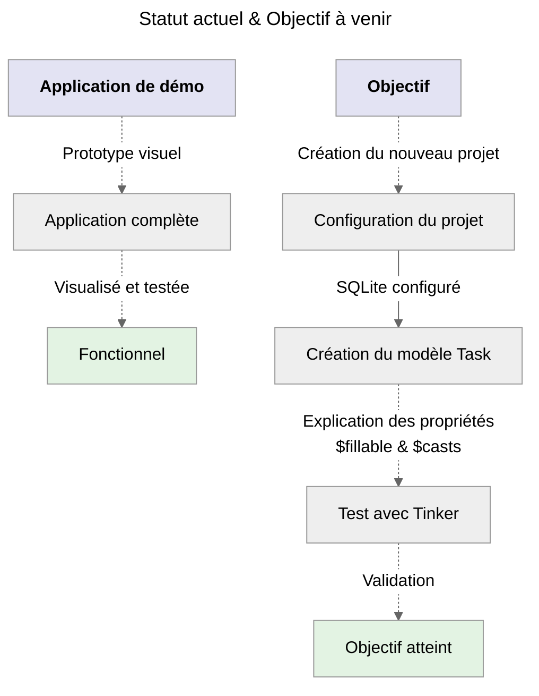
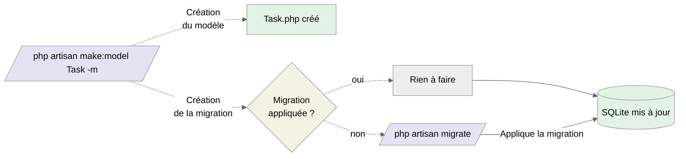
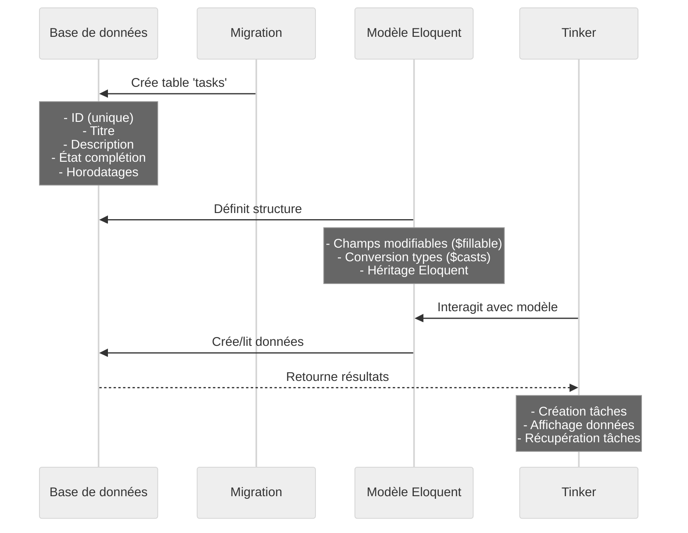
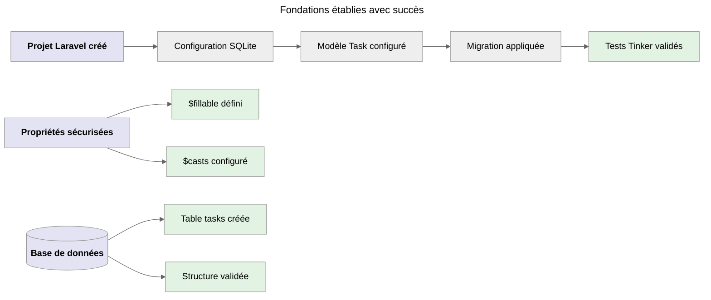
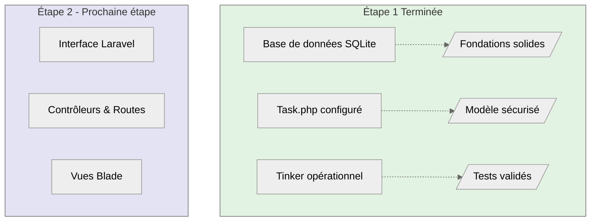
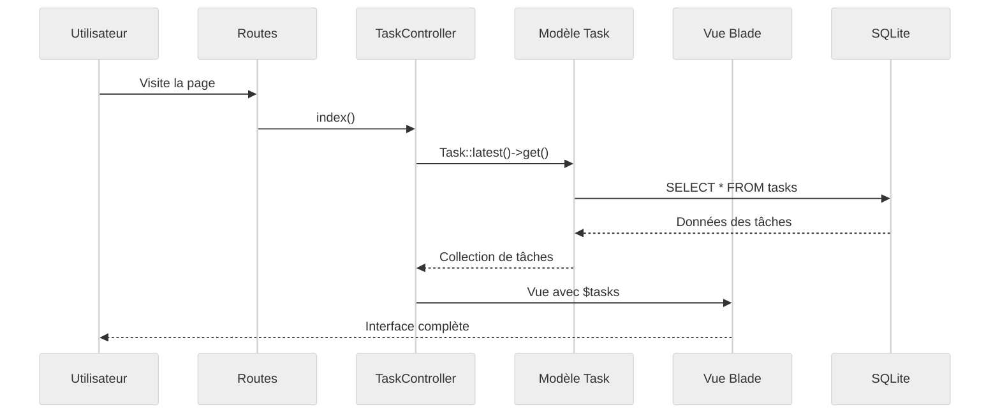

# Étape 1 - Fondations

:::info Objectif
**Créer** un **nouveau projet** sur la **gestion de tâches** en implémentant une base de données **SQLite**.<br />
_Nous allons bien évidemment continuer à tout expliquer en détails._
:::

## **Comprendre où nous en sommes**



_Maintenant que j'ai vu l'interface, je vais construire les fondations pour persister les données en utilisant **SQLite**._

## **Pourquoi SQLite pour ce projet ?**

:::info Simplicité
_SQLite ne nécessite aucune installation d'un quelconque serveur de base de données séparé,
contrairement à **MySQL** / **MariaDB** ou **PostgreSQL**._
:::

:::danger Portabilité exceptionnelle
_Comme évoqué dans le point précédent, sa simplicité lui permet de disposer d'une portabilité excellente.<br />
En effet, la base de données est stockée dans un seul fichier, facilitant le partage et la sauvegarde du projet._

**Bien évidemment, c'est un risque majeur de fuite de données et c'est pour cela qu'elle est utilisée essentiellement lors de la phase de développement d'une application.**
:::

:::warning Parfait pour l'apprentissage
_Vous l'aurez compris avec le point précédent, SQLite est idéal pour comprendre les concepts sans la complexité d'une configuration de
base de données complète._

**Ce n'est pas un problème ici, car la complexité à été vu dans la partie installation et le projet "Demo"**.
:::

:::tip Performance largement suffisante
_Pour un projet d'apprentissage, SQLite offre des performances plus que satisfaisantes. De plus, cela n'aurait pas de sens de
complexifier la compréhension alors que le but est de comprendre la stack en tant que telle._
:::

---

:::note Remarque évidente
_Pour un projet en **production** avec plusieurs utilisateurs simultanés, nous opterons plutôt pour **MySQL**/**MariaDB** ou
**PostgreSQL**._
:::

## **Configuration du Projet**

> Pour en savoir plus sur l'**installation** d'un projet vous pouvez vous rendre dans la partie **installation et configuration** où
> tout es détaillé. ( _La partie base de données quant à elle diffère de ce que l'on va utilisé ici_ ).<br /><br />
> Si vous souhaitez en revanche utiliser **Laravel Sail**, veuillez vous référer à la **feuille de route**, nous ne reviendrons
> également pas dessus en sachant que tout a déjà été vu.

### Création du nouveau projet

Pour cette partie, nous utiliserons **Composer** et non la **CLI Laravel**. Cela n'a aucune importance et vous pouvez vous entraîner avec
les deux façons de faire, juste pensez à ne pas donner le même nom. Auquel cas l'installation échouera.

```bash
# Nouveau projet
composer create-project laravel/laravel tall-tasks
cd tall-tasks
```

:::note
_Si vous êtes attentifs, vous aurez remarqué que nous avions déjà anticipé ce projet avec le nom **tall-tasks** !!_<br />
_Si ça ne vous dis rien, regarder dans la partie **feuille-de-route** et plus particulièrement à **L'installation express pour la démo**,
nous avions utilisé **tall-tasks-demo**._
:::

### Création du fichier lié à la base de données

> Nous ne détaillerons pas la structure du projet elle a déjà été vu dans **Installation et configuration** au niveau de
> **Arborescence complète du projet**.

```bash
# Création du fichier "portable" de la base de données SQLite
touch database/database.sqlite
```

:::note
_Bien évidemment, ce fichier peut très bien être créé manuellement, c'est un choix qui vous revient entièrement._

_Notez qu'il n'y a pas de bonne ou mauvaise pratique. Concevez et apprenez à votre rythme, les commandes ou syntaxes proposées sont là
pour vous aider à progresser, mais avec la surcharge d'informations, avancez à votre rythme._
:::

### Générer une nouvelle clé d'application Laravel

:::tip Bravo
Le projet **tall-tasks** est bien créé, de plus vous avez également créé avec succès **le fichier lié à la base de données**.<br />
:::

Nous allons maintenant **Générer** notre clé de sécurité pour notre projet.

:::note Rappel

**Pourquoi une clé d'application ?**

-   **Sécurité :** _La clé est utilisée pour chiffrer les données sensibles comme les sessions et les cookies._
-   **Authentification :** _Elle garantit l'intégrité des données signées par l'application._
-   **Protection :** _Elle aide à prévenir les attaques CSRF et autres vulnérabilités de sécurité._

```bash
# La commande ci-dessous génère une nouvelle clé d'application de 32 caractères.
php artisan key:generate
```

:::danger Important
Cette clé sera automatiquement générée et stockée de manière sécurisée dans notre fichier **`.env`**.<br />
Pour des raisons évidente de sécurité :

-   Nous ne partagerons jamais cette clé, elle est vitale à l'application.
-   Nous ne versionnerons pas cette clé dans Git afin d'éviter qu'elle ne soit exposée sur GitHub.

:::

Maintenant que nous avons généré notre clé , nous allons configurer le fichier **`.env`**.

**Configuration du fichier `.env`**

```perl
DB_CONNECTION="sqlite"
DB_DATABASE="./database/database.sqlite"
```

## **Premier Modèle - Visible et Compréhensible**

> Nous n'allons pas réexpliquer ce qu'est une migration, pour cela je vous invite à vous rendre dans **Installation et configuration**
> et plus précisément à la section **Appliquer les changements avec artisan**, tout est expliqué.

En revanche, ici nous allons créer un modèle Task. Dans d'autres technologies comme **React**, **Vue** ou bien **Angular**, ce fichier
correspondrait aisément à une **interface** que l'on aurait créée avec **TypeScript**.

```bash
# Création d'un modèle Task + migration d'un coup (-m)
php artisan make:model Task -m
```

**Que fait l'option `-m` dans la commande artisan ?**

Le flag **`-m`** est un raccourci qui crée automatiquement deux fichiers essentiels en une fois :

-   **Le modèle** : **`app/Models/Task.php`** - _Qui définit la structure et le comportement de nos tâches._
-   **La migration** : **`database/migrations/xxxx_create_tasks_table.php`** - _Qui gère la structure de la table en base de données._

Sans le **`-m`**, nous aurions dû créer le modèle et la migration séparément. Soit :

```bash
# Création du modèle "Task" uniquement
php artisan make:model Task

# Création des migrations "create_tasks_table"
php artisan make:migration create_tasks_table
```

_Vous l'aurez compris, l'option **`-m`** nous fait gagner du temps en créant les deux fichiers en une seule fois._

### Contenu du fichier de migration

:::note Emplacement Fichier
**`database/migrations/xxxx_create_tasks_table.php`**
:::

```php
<?php

use Illuminate\Database\Migrations\Migration;
use Illuminate\Database\Schema\Blueprint;
use Illuminate\Support\Facades\Schema;

return new class extends Migration
{
    public function up()
    {
        Schema::create('tasks', function (Blueprint $table) {
            $table->id();                                     // Identifiant unique
            $table->string('title');                          // Ce que je vois dans l'interface
            $table->text('description')->nullable();          // Détails optionnels
            $table->boolean('completed')->default(false);     // État de la tâche
            $table->timestamps();                             // Créé/modifié automatiquement
        });
    }

    public function down()
    {
        Schema::dropIfExists('tasks');
    }
};
```

:::note
Dans la stack **MERN**, **MEAN** ou bien **MEVN** le terme **Schema** est utilisé avec l'ODM ( _Object Data Modeling_ ) de **Mongoose**
qui permet de faire le lien avec une base de données **NoSQL** et l'application en tant que telle. Et bien figurez-vous qu'avec
**Eloquent** l'**ORM** ( _Object Relationnal Mapping_ ) de Laravel, le concept est identique. A l'époque en procédural en PHP,
**MySQLi** était utilisé puis petit à petit **PDO** a été préférée pour plusieurs raisons dont une importante qui est la compatibilité
avec différentes SGBD ( _Système Gestion de Base de Données_ ). Il faut aussi savoir qu'Eloquent s'inspire largement de l'ORM Doctrine
du framework Symfony, tout en apportant sa propre approche simplifiée.
:::

#### Explication de la migration

_La migration est un *blueprint* qui définit la structure de ma table en base de données._

**Champs essentiels**

    - ➔ **`id()`** : _Identifiant unique auto-incrémenté_
    - ➔ **`string('title')`** : _Stocke le titre de la tâche_
    - ➔ **`text('description')`** : _Champ optionnel pour les détails_
    - ➔ **`boolean('completed')`** : _État de complétion (vrai/faux)_
    - ➔ **`timestamps()`** : _Dates de création/modification_

:::info Micro rappel sur une migration
Comme ça la été dit, les migrations sont une fonctionnalité essentielle qui nous permet de **versionner** et suivre l'évolution de la
structure de la base de données au fil du temps. Cette approche offre plusieurs avantages cruciaux :

-   _Elle facilite grandement la **collaboration en équipe** en permettant à chaque développeur d'avoir une structure cohérente._
-   _Elle simplifie le **processus de déploiement** en automatisant les modifications de schéma._
-   _Elle fournit un **historique clair** des changements apportés à la structure de la base de données._

:::

### Contenu du fichier modèle

> Ce fichier permet de définir les propriétés qui seront manipulable ( _Une couche de sécurité qui est la bienvenue_ ).<br />
> Mais aussi, ce fichier nous permet de convertir efficacement de la donnée vers un type spécifique.

:::note Emplacement Fichier
**`app/Models/Task.php`**
:::

```php
<?php

namespace App\Models;

use Illuminate\Database\Eloquent\Model;

class Task extends Model
{
    // Champs qu'on peut remplir en masse (sécurité)
    protected $fillable = [
        'title',
        'description',
        'completed'
    ];

    // Conversion automatique des types
    protected $casts = [
        'completed' => 'boolean'
    ];
}
```

:::info L'importance des attributs `$fillable` et `$casts`
_C'est, **comprendre** quelles sont les **Propriétés Essentielles** du Modèle qui peuvent être exploitées sans risque._
:::

<br />

**La propriété `$fillable`**

-   **Protection contre l'assignation massive**<br />
    _Renforce la sécurité en bloquant les modifications non autorisées de champs sensibles via des requêtes malveillantes_

-   **Sécurité renforcée**<br />
    _Seuls les champs explicitement listés dans $fillable peuvent être modifiés en masse via les méthodes create() ou update()_

-   **Explicite et documenté**<br />
    _Améliore la lisibilité du code en définissant clairement les champs modifiables_

**La propriété `$casts`**

-   **Conversion automatique des types :**<br />
    _Assure une transformation fluide des données entre la base de données et les types PHP_

-   **Cohérence des données :**<br />
    _Maintient l'intégrité des types de données tout au long de l'application_

-   **Facilite le développement :**<br />
    _Élimine le besoin de conversions manuelles, réduisant ainsi les risques d'erreurs_

<br />

:::info Exemple concret avec le modèle Task

**`completed`** est **casté** en **boolean** : la valeur **0/1** de la base de données sera automatiquement convertie en **true/false**
en PHP. Seuls **`title`**, **`description`** et **`completed`** peuvent être modifiés en masse, protégeant ainsi des champs comme
**`id`** ou **`created_at`** d'une quelconque altération non désiré.

_Cette structure forme la base sur laquelle nous pourrons construire des fonctionnalités plus avancées dans notre application Laravel._
:::

### Création de la migration

```bash
# Créer la table en base de données ( SQLite )
php artisan migrate
```

### Quel est le lien avec `SQLite` ?

Afin de mieux comprendre le lien qui peut être fait avec SQLite, nous avons créé un Schéma récapitulatif.



## **Test immédiat avec Tinker**

### Qu'est-ce que Tinker ?

**Tinker** a été créé par **Taylor Otwell**, notre emblématique créateur de Laravel.

**Tinker** est un **REPL** ( _Read-Eval-Print Loop_ - _Lire-Evaluer-Afficher Boucle_ ) intégré à Laravel qui permet d'interagir
directement avec votre application depuis la console. Voici ses principaux avantages :

-   **Tester rapidement :** _Validez votre code PHP en temps réel dans le contexte de votre application_
-   **Manipuler en direct :** _Interagissez avec vos modèles et votre base de données de manière interactive_
-   **Déboguer efficacement :** _Explorez et testez les fonctionnalités de Laravel en mode console_
-   **Expérimenter rapidement :** _Testez l'API Eloquent sans avoir à écrire du code dans des fichiers_

:::note
C'est un outil **indispensable** pendant le développement pour vérifier le bon fonctionnement de nos modèles et de nos relations. Ainsi,
cela ne nécessite pas de créer de routes ou de contrôleurs, tout est automatisé.
:::

### Différence entre **`Tinker`** & **`PHPUnit`**

Ces deux outils servent des objectifs très différents dans l'écosystème Laravel.

:::info PHPUnit est un framework de tests

-   Permet d'écrire et exécuter des tests automatisés
-   Vérifie le bon fonctionnement du code
-   S'utilise pendant le développement et l'intégration continue
-   Produit des rapports de tests

:::

:::tip Tinker est un REPL interactif

-   Permet d'interagir directement avec l'application
-   Utile pour tester rapidement du code ou des requêtes
-   S'utilise principalement pendant le développement
-   Ne produit pas de tests réutilisables

:::

**En résumé :** **`PHPUnit`** sert à créer des tests automatisés pour garantir la qualité du code, tandis que **`Tinker`** est un outil
interactif pour explorer et manipuler rapidement l'application pendant le développement.

### Différence avec le **`TDD`**

L'approche actuellement choisie est différente du TDD classique ( _Test-Driven Development_ ) :

:::info TDD classique

-   Écrire d'abord les tests
-   Voir les tests échouer
-   Écrire le code minimal pour passer les tests
-   Refactoriser

:::

:::tip Approche choisie

-   Démonstration visuelle d'abord
-   Construction progressive des fondations
-   Intégration pas à pas des fonctionnalités
-   Tests ajoutés pour la robustesse

:::

_Les deux approches sont valides, mais nous avons choisi une méthode plus visuelle et intuitive pour faciliter notre apprentissage._

```bash
# Lancement de Tinker via la console interactive de Laravel
php artisan tinker
```

```php
// Dans tinker - créer votre première tâche
$task = App\Models\Task::create([
    'title' => 'Ma première tâche Laravel',
    'description' => 'Comprendre les modèles Eloquent'
]);

// Voir le résultat
$task->toArray();

// Récupérer toutes les tâches
App\Models\Task::all()->toArray();
```

:::note
Nous n'avons pas implémenté la propriété "**completed**" car cette dernière a été définie à **false** par défaut dans notre migration.
:::

_Voir le code ci-dessous pour savoir de quoi l'on parle._

```php
// Du code...

public function up()
{
    Schema::create('tasks', function (Blueprint $table) {
        // D'autres propriétés...

        $table->boolean('completed')->default(false);     // <--- Définit par défaut à false ici

        // D'autres propriétés...
    });
}

// du code...
```

:::danger Point important à soulever
Notre approche suit une **méthodologie progressive**, commençant par une interface visuelle puis ajoutant la persistance des données
dans **SQLite** afin d'expliquer étape par étape contrairement au TDD traditionnel qui commence par les tests, mais ça on l'a déjà dit.
:::

## **Compréhension du Code Pas à Pas**

Le diagramme de séquence est une étape fondamentale pour comprendre ce qu'il se passe afin d'aborder la suite sereinement.
Le code ci-dessus met en place les fondations d'une application de gestion de tâches avec Laravel.



<br />

## **Conclusion de l'Étape 1 - Fondations**

:::tip Félicitations
Les fondations de notre application TALL sont maintenant solides ! Nous avons réussi à créer une base de données fonctionnelle avec
SQLite et un modèle Task parfaitement configuré et sécurisée.
:::

### Récapitulatif de nos accomplissements

#### Ce que nous avons construit



#### Architecture mise en place

-   **Base de données SQLite** : _Solution portable et simple pour le développement._
-   **Modèle Task** : _Structure claire avec sécurité intégrée via **`$fillable`** et **`$casts`**._
-   **Migration fonctionnelle** : _Table **`tasks`** avec tous les champs nécessaires._
-   **Tests validés** : _Vérification complète avec Tinker._

### Sécurité et bonnes pratiques

Notre modèle Task intègre les meilleures pratiques Laravel :

```php
// Protection contre l'assignation massive
protected $fillable = [
    'title',
    'description',
    'completed'
];

// Conversion automatique des types
protected $casts = [
    'completed' => 'boolean'
];
```

:::info Points clés maîtrisés

-   ✅ **Création de projet Laravel** avec Composer
-   ✅ **Configuration SQLite** pour le développement
-   ✅ **Génération de modèles et migrations** avec Artisan
-   ✅ **Sécurisation des modèles** avec `$fillable` et `$casts`
-   ✅ **Tests interactifs** avec Tinker
-   ✅ **Compréhension de l'ORM Eloquent**

:::

## **Évolution dans notre feuille de route**



## **Transition vers l'Étape 2 : Interface Laravel**

:::info Prochaine étape
Maintenant que nos **fondations sont établies**, il est temps de créer **l'interface utilisateur** qui permettra d'interagir
avec notre base de données.

Dans l'**Étape 2**, nous allons développer :

-   **TaskController** : _La logique métier pour gérer nos tâches._
-   **Routes Laravel** : _Les points d'entrée de notre application._
-   **Interface Blade** : _Des vues modernes et intuitives._
-   **Intégration complète** : _Connexion entre l'interface et la base de données._

:::

### Aperçu de ce que nous allons créer

L'interface Laravel que nous développerons permettra de :

-   **Afficher** toutes les tâches depuis la base de données
-   **Créer** de nouvelles tâches via un formulaire
-   **Basculer** l'état d'une tâche ( _terminée / en cours_ )
-   **Supprimer** des tâches de manière sécurisée
-   **Visualiser** des statistiques en temps réel

### Comprendre ce que nous allons faire

_Voici un diagramme de séquence permettant de comprendre ce que nous allons créer ensemble._



### Fonctionnalités prévues

Notre **TaskController** disposera de quatre méthodes essentielles :

-   **`index()`** : Affichage de toutes les tâches
-   **`store()`** : Création d'une nouvelle tâche
-   **`toggle()`** : Basculement de l'état d'une tâche
-   **`destroy()`** : Suppression d'une tâche

:::warning Point important
Dans l'étape suivante, nous expliquerons chaque méthode individuellement pour une compréhension optimale.<br />
Le code sera organisé de manière progressive pour faciliter l'apprentissage sans perdre le fil.
:::

Les fondations sont posées, les données persistent correctement dans SQLite, et notre modèle Task est parfaitement configuré.<br />
Il est maintenant temps de créer l'interface qui donnera vie à notre application !
