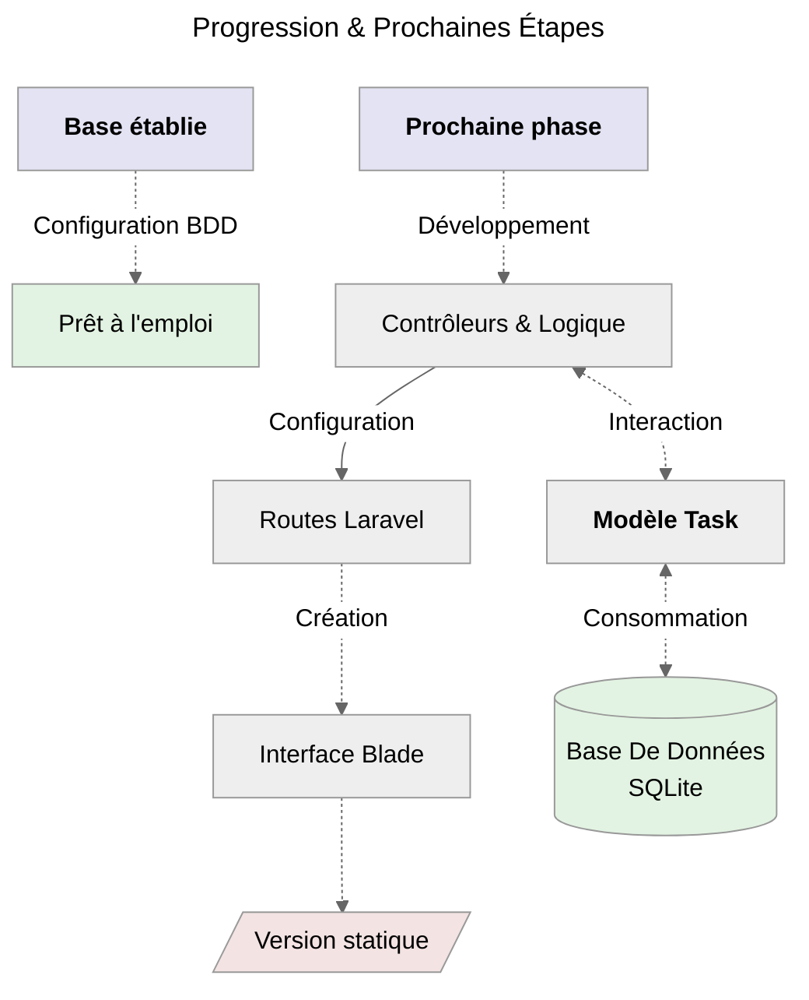
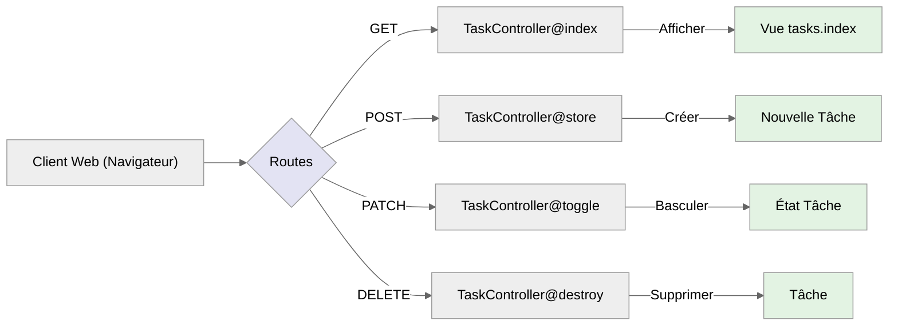
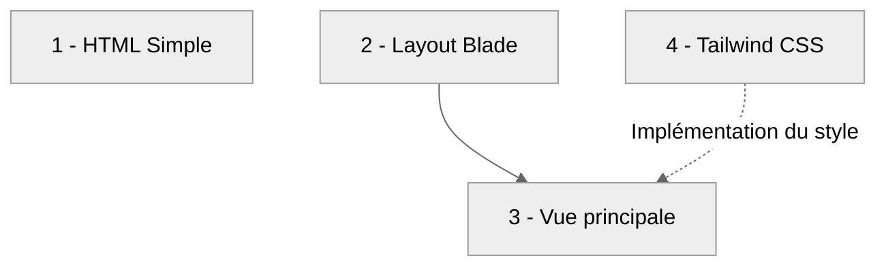
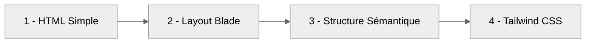
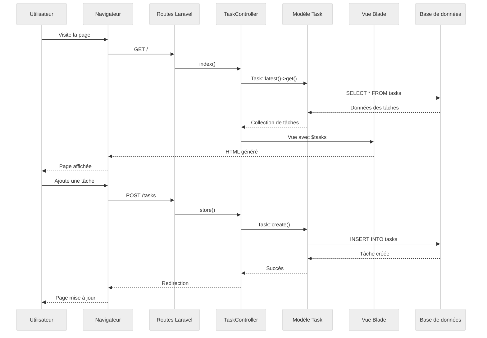

# Étape 2 : Interface Laravel

:::info Objectif
**Créer** un **contrôleur** qui disposera de toutes les **méthodes** nécessaires pour permettre de répondre au besoin.<br />
Nous allons également aborder la question du **routing** qui reste fondamental pour toute application web qui se respecte. Mais surtout,
nous allons aborder la partie vue qui correspondra à l'interface que nous aurons à l'écran.
:::

## **Progression Visuelle**



_Nous allons maintenant créer l'interface Laravel qui interagira avec la base de données qui a déjà été configurée._

## **Contrôleur Simple et Visible**

**La logique métier** est toujours située dans un **contrôleur**.<br />
Il reste le coeur du paradigme **MVC** ( _*Modèle*, **Vue**, **Controller**_ ).

```bash
# Création du contrôleur qui gérera toute la logique métier des tâches
php artisan make:controller TaskController
```

:::note Emplacement Fichier
**`app/Http/Controllers/TaskController.php`**
:::

Le **TaskController** est une classe PHP qui hérite de la classe **Controller** de Laravel. Il sert d'_intermédiaire essentiel_ entre le
**modèle Task** et les **vues**, orchestrant toute la logique métier de notre application de gestion de tâches.

### Contenu de `TaskController`

```php
<?php

namespace App\Http\Controllers;

use App\Models\Task;
use Illuminate\Http\Request;

class TaskController extends Controller
{
   // Les méthodes seront ajoutées ici
}
```

**Points clés essentiels du contrôleur**

-   **Architecture :** _Utilisation du namespace **`App\Http\Controllers`** pour une organisation optimale_
-   **Importations :** _Intégration du **modèle Task** et de la **classe Request** de Laravel pour la gestion des données_
-   **Structure :** _Organisation **méthodique** de la logique applicative pour une maintenance facilitée_
-   **Bonnes pratiques :** _Respect des principes **SOLID** et des **conventions Laravel** pour un code robuste et évolutif_

:::info SOLID
Une documentation sur **S.O.L.I.D** est en pleine réflexion mais prévu dans les **Bases Fondamentales**.<br />
_Le lien vers cette partie sera ajouté une fois que cette dernière sera rédigée_.
:::

:::danger **Information importante**
Dans cette étape, nous allons créer **4 méthodes essentielles** dans notre contrôleur. Chaque méthode sera expliquée individuellement avec son
rôle spécifique. Ensuite, nous configurerons les routes correspondantes et créerons d'abord les vues Blade **en HTML simple, puis avec
Tailwind CSS**
:::

## **La base du code**

> _Voici le code qui sera utilisé. Afin de gagner en lisibilité seule la méthode concernée sera affichée._

```php
<?php

namespace App\Http\Controllers;

use App\Models\Task;
use Illuminate\Http\Request;

class TaskController extends Controller
{
    // Les méthodes vont toutes ici les unes à la suite des autres
}
```

## **Méthodes utilisées dans `TaskController`**

### Première méthode : **`index()`**

La méthode **`index()`** est une méthode très importante, elle permet **affichée les tâches récupérées depuis la base de données**.<br />
( _la plus récente sera affichée en premier_ ).

```php
// Afficher toutes les tâches
public function index()
{
    $tasks = Task::latest()->get(); // Plus récent en premier
    return view('tasks.index', compact('tasks'));
}
```

### Seconde méthode : **`store()`**

_La méthode **`store()`** est simple, elle permet de créer une nouvelle tâche en fonction de ce qui est récupéré dans la **request**._

```php
// Créer une nouvelle tâche
public function store(Request $request)
{
    // Validation simple et claire
    $validated = $request->validate([
        'title' => 'required|min:3|max:255',
        'description' => 'nullable|max:500'
    ]);

    Task::create($validated);

    return redirect()->route('tasks.index')
                        ->with('success', 'Tâche créée avec succès !');
}
```

:::info Qu'est-ce que la `Request`
Pour faire simple, sachez que la **$request** contient le contenu de la requête HTTP.<br />
Ainsi lorsqu'un formulaire est soumit, les éléments sont passés dans le protocole HTTP et ils sont utilisable à partir de la **`Request`**.
:::

### Troisième méthode : **`toggle()`**

_La méthode **`toggle()`** prends en paramètre le modèle **Task $task** qui correspond à la tâche qui aura été récupéré en base de données.
Ainsi donc, cela nous permettra de basculer l'état de la tâche vers son opposé ( **0** / **1** vers **true** / **false** via la conversion
avec **$casts** )._

```php
// Basculer l'état d'une tâche
public function toggle(Task $task)
{
    $task->update(['completed' => !$task->completed]);

    return redirect()->route('tasks.index')
                     ->with('success', 'Tâche mise à jour !');
}
```

### Quatrième méthode : **`destroy()`**

_La méthode **`destroy()`** prends également le même paramètre lié au modèle **Task $task** afin de cibler la bonne tâche qui sera supprimée
de la liste._

```php
// Supprimer une tâche
public function destroy(Task $task)
{
    $task->delete();

    return redirect()->route('tasks.index')
                     ->with('success', 'Tâche supprimée !');
}
```

## **Routes Simples et Intuitives**

:::note Emplacement Fichier
**`routes/web.php`**
:::

### Compréhension des routes utilisées



### Contenu du fichier `web.php`

```php
<?php

use App\Http\Controllers\TaskController;
use Illuminate\Support\Facades\Route;

Route::get('/', [TaskController::class, 'index'])->name('tasks.index');
Route::post('/tasks', [TaskController::class, 'store'])->name('tasks.store');
Route::patch('/tasks/{task}/toggle', [TaskController::class, 'toggle'])->name('tasks.toggle');
Route::delete('/tasks/{task}', [TaskController::class, 'destroy'])->name('tasks.destroy');
```

**Explications détaillées**

| Route                                 | Rôle principal             | Description                                                             |
| ------------------------------------- | -------------------------- | ----------------------------------------------------------------------- |
| **GET**<br />/                        | _Point d'entrée principal_ | Affiche l'interface de gestion des tâches avec la liste complète        |
| **POST**<br />/tasks                  | _Endpoint de création_     | Traite la soumission du formulaire pour créer une nouvelle tâche        |
| **PATCH**<br />/tasks/\{task\}/toggle | _Gestion de l'état_        | Permet de basculer dynamiquement entre tâche complétée et non-complétée |
| **DELETE**<br />/tasks/\{task\}       | _Suppression sécurisée_    | Gère la suppression permanente d'une tâche spécifique                   |

## **Interface Blade Progressive**

:::info Approche Step by Step
Nous allons créer l'interface en 4 étapes progressives :<br />



:::

:::note Emplacement Dossier
**`resources/views/tasks/`**<br />
Le dossier tasks doit être créé manuellement.
:::

### HTML Simple et Fonctionnel

_Commençons par créer une page HTML basique qui affiche nos données sans aucun style._

**Vue de base :** **`index.blade.php`** ( _Version HTML simple_ )

:::note Emplacement Fichier
**`resources/views/tasks/index.blade.php`**
:::

```html
<!DOCTYPE html>
<html lang="fr">
    <head>
        <meta charset="utf-8" />
        <meta name="viewport" content="width=device-width, initial-scale=1" />
        <title>TALL Tasks - Gestion de tâches</title>
    </head>
    <body>
        <h1>Gestion de Tâches</h1>
        <p>Étape 2 : Interface Laravel</p>

        <!-- Formulaire d'ajout -->
        <h2>Ajouter une tâche</h2>
        <form action="{{ route('tasks.store') }}" method="POST">
            @csrf
            <div>
                <label>Titre *</label><br />
                <input
                    type="text"
                    name="title"
                    value="{{ old('title') }}"
                    placeholder="Ex: Terminer le projet"
                />
                @error('title')
                <p style="color: red;">{{ $message }}</p>
                @enderror
            </div>

            <div>
                <label>Description</label><br />
                <input
                    type="text"
                    name="description"
                    value="{{ old('description') }}"
                    placeholder="Détails optionnels..."
                />
                @error('description')
                <p style="color: red;">{{ $message }}</p>
                @enderror
            </div>

            <button type="submit">Enregistrer la tâche</button>
        </form>

        <!-- Statistiques simples -->
        <h2>Statistiques</h2>
        <p>Total : {{ $tasks->count() }}</p>
        <p>Terminées : {{ $tasks->where('completed', true)->count() }}</p>
        <p>En cours : {{ $tasks->where('completed', false)->count() }}</p>

        <!-- Liste des tâches -->
        <h2>Mes Tâches ({{ $tasks->count() }})</h2>

        @forelse($tasks as $task)
        <div
            style="border: 1px solid #ccc; margin-bottom: 10px; padding: 10px;"
        >
            <h3
                style="{{ $task->completed ? 'text-decoration: line-through; color: #999;' : '' }}"
            >
                {{ $task->title }}
            </h3>

            @if($task->description)
            <p
                style="{{ $task->completed ? 'text-decoration: line-through; color: #999;' : '' }}"
            >
                {{ $task->description }}
            </p>
            @endif

            <p style="font-size: 12px; color: #666;">
                Créée {{ $task->created_at->diffForHumans() }}
            </p>

            <!-- Actions -->
            <form
                action="{{ route('tasks.toggle', $task) }}"
                method="POST"
                style="display: inline;"
            >
                @csrf @method('PATCH')
                <button type="submit">
                    {{ $task->completed ? '✅ Terminée' : '⏳ En cours' }}
                </button>
            </form>

            <form
                action="{{ route('tasks.destroy', $task) }}"
                method="POST"
                style="display: inline;"
                onsubmit="return confirm('Êtes-vous sûr de vouloir supprimer cette tâche ?')"
            >
                @csrf @method('DELETE')
                <button type="submit">🗑️ Supprimer</button>
            </form>
        </div>
        @empty
        <p>
            Aucune tâche pour le moment. Créez votre première tâche ci-dessus !
        </p>
        @endforelse
    </body>
</html>
```

:::tip Test immédiat
À ce stade, vous pouvez déjà tester votre application ! Elle est fonctionnelle mais sans style.
:::

### Création du **`Layout Blade`**

Maintenant, séparons la structure avec un layout réutilisable.

:::note Emplacement Fichier
**`resources/views/layouts/app.blade.php`**
:::

```html
<!DOCTYPE html>
<html lang="fr">
    <head>
        <meta charset="utf-8" />
        <meta name="viewport" content="width=device-width, initial-scale=1" />
        <title>@yield('title', 'TALL Tasks')</title>
    </head>
    <body>
        <!-- Header simple -->
        <header>
            <h1>TALL Tasks</h1>
            <p>Étape 2 : Interface Laravel ✓</p>
        </header>

        <!-- Contenu principal -->
        <main>@yield('content')</main>

        <!-- Footer simple -->
        <footer>
            <p>Application de gestion de tâches - Laravel</p>
        </footer>
    </body>
</html>
```

### Vue principale : **`index.blade.php`**

Maintenant, utilisons notre layout et simplifions la vue.

:::note Emplacement Fichier
**`resources/views/tasks/index.blade.php`**
:::

```html
@extends('layouts.app') @section('title', 'Gestion des Tâches')
@section('content')
<!-- Formulaire d'ajout -->
<section>
    <h2>Ajouter une tâche</h2>
    <form action="{{ route('tasks.store') }}" method="POST">
        @csrf
        <div>
            <label>Titre *</label><br />
            <input
                type="text"
                name="title"
                value="{{ old('title') }}"
                placeholder="Ex: Terminer le projet"
            />
            @error('title')
            <p style="color: red;">{{ $message }}</p>
            @enderror
        </div>

        <div>
            <label>Description</label><br />
            <input
                type="text"
                name="description"
                value="{{ old('description') }}"
                placeholder="Détails optionnels..."
            />
            @error('description')
            <p style="color: red;">{{ $message }}</p>
            @enderror
        </div>

        <button type="submit">Enregistrer la tâche</button>
    </form>
</section>

<!-- Statistiques -->
<section>
    <h2>Statistiques</h2>
    <div>
        <div>
            <strong>{{ $tasks->count() }}</strong>
            <span>Total</span>
        </div>
        <div>
            <strong>{{ $tasks->where('completed', true)->count() }}</strong>
            <span>Terminées</span>
        </div>
        <div>
            <strong>{{ $tasks->where('completed', false)->count() }}</strong>
            <span>En cours</span>
        </div>
    </div>
</section>

<!-- Liste des tâches -->
<section>
    <h2>Mes Tâches ({{ $tasks->count() }})</h2>

    @forelse($tasks as $task)
    <article>
        <div>
            <h3
                style="{{ $task->completed ? 'text-decoration: line-through; color: #999;' : '' }}"
            >
                {{ $task->title }}
            </h3>

            @if($task->description)
            <p
                style="{{ $task->completed ? 'text-decoration: line-through; color: #999;' : '' }}"
            >
                {{ $task->description }}
            </p>
            @endif

            <p style="font-size: 12px; color: #666;">
                Créée {{ $task->created_at->diffForHumans() }}
            </p>
        </div>

        <div>
            <!-- Toggle completion -->
            <form
                action="{{ route('tasks.toggle', $task) }}"
                method="POST"
                style="display: inline;"
            >
                @csrf @method('PATCH')
                <button type="submit">
                    {{ $task->completed ? '✅' : '⏳' }}
                </button>
            </form>

            <!-- Delete -->
            <form
                action="{{ route('tasks.destroy', $task) }}"
                method="POST"
                style="display: inline;"
                onsubmit="return confirm('Êtes-vous sûr de vouloir supprimer cette tâche ?')"
            >
                @csrf @method('DELETE')
                <button type="submit">🗑️</button>
            </form>
        </div>
    </article>
    @empty
    <p>Aucune tâche pour le moment. Créez votre première tâche ci-dessus !</p>
    @endforelse
</section>
@endsection
```

:::tip Structure claire
Maintenant nous avons une structure HTML sémantique avec sections et articles, prête pour le stylisme !
:::

### Stylisation avec **`Tailwind CSS`**

Maintenant que notre structure est solide, ajoutons Tailwind CSS pour l'esthétique.

#### Layout moderne : **`app.blade.php`** ( _Version Tailwind_ )

:::note Emplacement Fichier
**`resources/views/layouts/app.blade.php`**
:::

```html
<!DOCTYPE html>
<html lang="fr">
    <head>
        <meta charset="utf-8" />
        <meta name="viewport" content="width=device-width, initial-scale=1" />
        <title>@yield('title', 'TALL Tasks')</title>
        <script src="https://cdn.tailwindcss.com"></script>
    </head>
    <body class="bg-gray-100">
        <div class="min-h-screen">
            <!-- Header avec progression -->
            <header class="bg-white shadow-sm border-b">
                <div class="max-w-4xl mx-auto px-6 py-4">
                    <div class="flex items-center justify-between">
                        <h1 class="text-2xl font-bold text-gray-800">
                            TALL Tasks
                        </h1>
                        <div class="text-sm text-gray-600">
                            Étape 2:
                            <span class="text-green-600 font-medium"
                                >Interface Laravel ✓</span
                            >
                        </div>
                    </div>
                </div>
            </header>

            <!-- Contenu principal -->
            <main class="py-8">@yield('content')</main>
        </div>
    </body>
</html>
```

#### Vue finale : **`index.blade.php`** ( _Version Tailwind_ )

:::note Emplacement Fichier
**`resources/views/tasks/index.blade.php`**
:::

```html
@extends('layouts.app') @section('title', 'Gestion des Tâches')
@section('content')
<div class="max-w-4xl mx-auto px-6">
    <!-- Formulaire d'ajout -->
    <section class="bg-white rounded-lg shadow-md p-6 mb-6">
        <h2 class="text-xl font-semibold mb-4">➕ Ajouter une tâche</h2>

        <form action="{{ route('tasks.store') }}" method="POST">
            @csrf
            <div class="grid grid-cols-1 md:grid-cols-2 gap-4">
                <div>
                    <label class="block text-sm font-medium text-gray-700 mb-2"
                        >Titre *</label
                    >
                    <input
                        type="text"
                        name="title"
                        value="{{ old('title') }}"
                        class="w-full px-4 py-2 border rounded-lg focus:ring-2 focus:ring-blue-500 @error('title') border-red-500 @enderror"
                        placeholder="Ex: Terminer le projet"
                    />
                    @error('title')
                    <p class="mt-1 text-sm text-red-600">{{ $message }}</p>
                    @enderror
                </div>

                <div>
                    <label class="block text-sm font-medium text-gray-700 mb-2"
                        >Description</label
                    >
                    <input
                        type="text"
                        name="description"
                        value="{{ old('description') }}"
                        class="w-full px-4 py-2 border rounded-lg focus:ring-2 focus:ring-blue-500"
                        placeholder="Détails optionnels..."
                    />
                    @error('description')
                    <p class="mt-1 text-sm text-red-600">{{ $message }}</p>
                    @enderror
                </div>
            </div>

            <button
                type="submit"
                class="mt-4 px-6 py-2 bg-blue-600 text-white rounded-lg hover:bg-blue-700 transition-colors"
            >
                Enregistrer la tâche
            </button>
        </form>
    </section>

    <!-- Statistiques simples -->
    <section class="grid grid-cols-1 md:grid-cols-3 gap-4 mb-6">
        <div class="bg-white p-4 rounded-lg shadow text-center">
            <div class="text-2xl font-bold text-blue-600">
                {{ $tasks->count() }}
            </div>
            <div class="text-gray-600">Total</div>
        </div>
        <div class="bg-white p-4 rounded-lg shadow text-center">
            <div class="text-2xl font-bold text-green-600">
                {{ $tasks->where('completed', true)->count() }}
            </div>
            <div class="text-gray-600">Terminées</div>
        </div>
        <div class="bg-white p-4 rounded-lg shadow text-center">
            <div class="text-2xl font-bold text-yellow-600">
                {{ $tasks->where('completed', false)->count() }}
            </div>
            <div class="text-gray-600">En cours</div>
        </div>
    </section>

    <!-- Liste des tâches -->
    <section class="bg-white rounded-lg shadow-md">
        <div class="p-4 border-b">
            <h2 class="text-xl font-semibold">
                📋 Mes Tâches ({{ $tasks->count() }})
            </h2>
        </div>

        @forelse($tasks as $task)
        <article
            class="p-4 border-b last:border-b-0 hover:bg-gray-50 transition-colors"
        >
            <div class="flex items-center justify-between">
                <div class="flex-1">
                    <h3
                        class="font-medium {{ $task->completed ? 'line-through text-gray-500' : 'text-gray-800' }}"
                    >
                        {{ $task->title }}
                    </h3>

                    @if($task->description)
                    <p
                        class="text-sm text-gray-600 mt-1 {{ $task->completed ? 'line-through' : '' }}"
                    >
                        {{ $task->description }}
                    </p>
                    @endif

                    <p class="text-xs text-gray-400 mt-2">
                        Créée {{ $task->created_at->diffForHumans() }}
                    </p>
                </div>

                <div class="flex items-center gap-2 ml-4">
                    <!-- Toggle completion -->
                    <form
                        action="{{ route('tasks.toggle', $task) }}"
                        method="POST"
                        class="inline"
                    >
                        @csrf @method('PATCH')
                        <button
                            type="submit"
                            class="p-2 rounded-lg transition-colors {{ $task->completed ? 'bg-green-100 text-green-700' : 'bg-gray-100 text-gray-700 hover:bg-green-100' }}"
                        >
                            {{ $task->completed ? '✅' : '⏳' }}
                        </button>
                    </form>

                    <!-- Delete -->
                    <form
                        action="{{ route('tasks.destroy', $task) }}"
                        method="POST"
                        class="inline"
                        onsubmit="return confirm('Êtes-vous sûr de vouloir supprimer cette tâche ?')"
                    >
                        @csrf @method('DELETE')
                        <button
                            type="submit"
                            class="p-2 bg-red-100 text-red-700 rounded-lg hover:bg-red-200 transition-colors"
                        >
                            🗑️
                        </button>
                    </form>
                </div>
            </div>
        </article>
        @empty
        <div class="p-8 text-center text-gray-500">
            <div class="text-4xl mb-4">📝</div>
            <p>
                Aucune tâche pour le moment. Créez votre première tâche
                ci-dessus !
            </p>
        </div>
        @endforelse
    </section>
</div>
@endsection
```

### Récapitulatif de la Progression



:::tip Approche Step by Step réussie
Nous avons créé notre interface en 4 étapes logiques :

-   ✅ Fonctionnalité d'abord ( _HTML brut_ )
-   ✅ Structure avec Layout Blade
-   ✅ Sémantique HTML5 claire
-   ✅ Style moderne avec Tailwind CSS

Cette approche progressive permet de comprendre chaque couche avant d'ajouter la réactivité !
:::

## **Compréhension via un diagramme de séquence**

_Pour bien comprendre ce qu'il se passe, voici un diagramme de séquence proposé afin d'analyser chaque étape et surtout permettre de comprendre
ce qu'il se passe en arrière plan._



<br />

:::tip Résultat immédiat
Application Laravel complète et fonctionnelle !
:::
