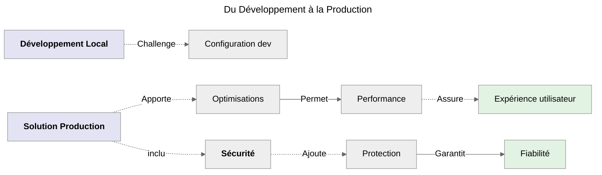
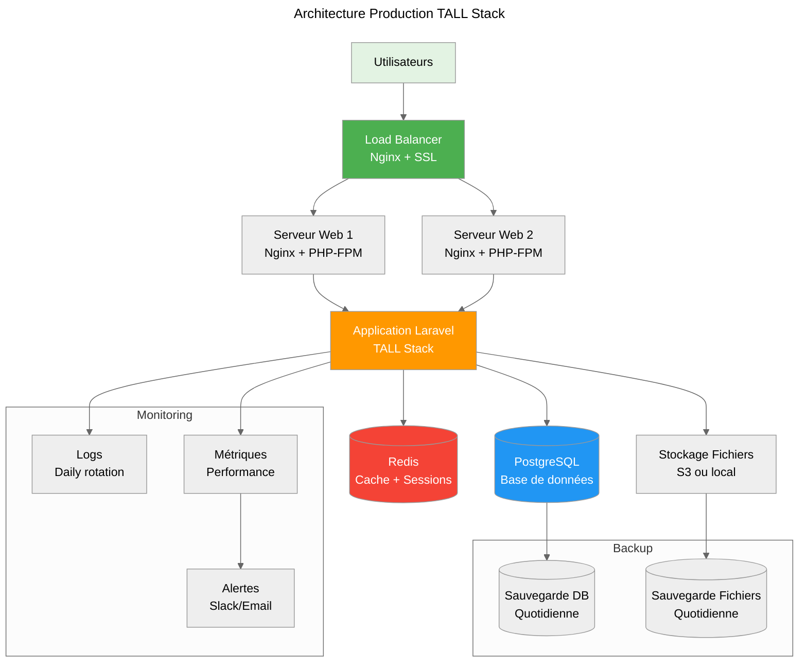

# Étape 4 : Production

## Qu'est-ce que la Production ?

**La production** est l'environnement où votre application est accessible aux utilisateurs finaux, nécessitant optimisation, sécurité et fiabilité. Voici les principes clés :

-   **Performance optimisée** : _Application rapide et réactive pour l'utilisateur final._
-   **Sécurité renforcée** : _Protection contre les attaques et vulnérabilités._
-   **Fiabilité maximale** : _Disponibilité 24/7 avec monitoring et sauvegarde._
-   **Scalabilité** : _Capacité à supporter une montée en charge._

## Évolution Naturelle



_Maintenant que j'ai maîtrisé le développement des 3 architectures TALL, je vais préparer et déployer mon application en production avec toutes les optimisations et
sécurisations nécessaires._

## Préparation à la Production

### Qu'est-ce que `l'Optimisation Laravel`

:::warning Fondamentaux pour comprendre la suite
**L'optimisation Laravel** consiste à configurer et compiler l'application pour des **performances maximales** en production.

#### Principe de base

```bash
# En développement : Flexibilité
APP_ENV=local
APP_DEBUG=true

# En production : Performance
APP_ENV=production
APP_DEBUG=false
```

#### Types d'optimisation

-   **Configuration** du Cache des fichiers de config
-   **Routes** : Compilation des routes
-   **Vues** : Compilation des templates Blade
-   **Autoloader** : Optimisation du chargement des classes

:::

### Configuration de l'environnement

:::note Emplacement Fichier
**`.env.production`** _( copie de `.env` adaptée pour la production )_
:::

```bash
# Configuration de base
APP_NAME="TALL Tasks"
APP_ENV=production
APP_KEY=base64:VOTRE_CLE_GENEREE_EN_PRODUCTION  # <--- php artisan key:generate
APP_DEBUG=false
APP_URL=https://votredomaine.com

# Base de données production (exemple avec PostgreSQL)
DB_CONNECTION=pgsql
DB_HOST=127.0.0.1
DB_PORT=5432
DB_DATABASE=tall_tasks_prod
DB_USERNAME=<votre_user_ici> # <--- A modifié et à sécuriser >
DB_PASSWORD=VOTRE_MOT_DE_PASSE_SECURISE

# Cache et sessions
CACHE_DRIVER=redis
SESSION_DRIVER=redis
QUEUE_CONNECTION=redis

# Redis pour les performances
REDIS_HOST=127.0.0.1
REDIS_PASSWORD=null
REDIS_PORT=6379

# Mail pour les notifications
MAIL_MAILER=smtp
MAIL_HOST=smtp.mailgun.org
MAIL_PORT=587
MAIL_USERNAME=your-mailgun-username
MAIL_PASSWORD=your-mailgun-password
MAIL_ENCRYPTION=tls
MAIL_FROM_ADDRESS=noreply@votredomaine.com
MAIL_FROM_NAME="${APP_NAME}"

# Logs et monitoring
LOG_CHANNEL=daily
LOG_DEPRECATIONS_CHANNEL=null
LOG_LEVEL=error
```

### Migration vers PostgreSQL

_Pour la production, on migre de **SQLite** vers **PostgreSQL** pour de meilleures performances._

```bash
# Installation PostgreSQL (Ubuntu/Debian)
sudo apt update
sudo apt install -y postgresql postgresql-contrib

# Création de la base de données
sudo -u postgres createdb tall_tasks_prod
sudo -u postgres createuser --interactive <votre_user_ici>
```

:::note Emplacement Fichier
**`config/database.php`** _( configuration adaptée )_
:::

```php
// Configuration PostgreSQL optimisée pour la production
'pgsql' => [
    'driver' => 'pgsql',
    'url' => env('DATABASE_URL'),
    'host' => env('DB_HOST', '127.0.0.1'),
    'port' => env('DB_PORT', '5432'),
    'database' => env('DB_DATABASE', 'forge'),
    'username' => env('DB_USERNAME', 'forge'),
    'password' => env('DB_PASSWORD', ''),
    'charset' => 'utf8',
    'prefix' => '',
    'prefix_indexes' => true,
    'search_path' => 'public',
    'sslmode' => 'prefer',
    // Optimisations production
    'options' => [
        PDO::ATTR_PERSISTENT => true,
        PDO::ATTR_EMULATE_PREPARES => false,
    ],
],
```

### Commandes d'optimisation Laravel

```bash
# Optimisation complète pour la production
php artisan optimize

# Détail des optimisations (exécutées par optimize)
php artisan config:cache     # Cache la configuration
php artisan route:cache      # Cache les routes
php artisan view:cache       # Cache les vues Blade
php artisan event:cache      # Cache les événements

# Optimisation de l'autoloader Composer
composer install --optimize-autoloader --no-dev

# Génération de la clé d'application (une seule fois)
php artisan key:generate
```

:::danger Important
**Les commandes de cache doivent être relancées à chaque déploiement** car elles figent la configuration.
En développement, utilisez **`php artisan optimize:clear`** pour vider tous les caches.
:::

## Optimisations par Architecture

### 1. Optimisations Livewire

:::note Emplacement Fichier
**`config/livewire.php`** _( configuration production )_
:::

```php
<?php

return [
    // Optimisations production Livewire
    'temporary_file_upload' => [
        'disk' => 's3', // Stockage cloud pour les uploads
        'rules' => ['file', 'max:12288'], // 12MB max
        'directory' => 'livewire-tmp',
        'middleware' => 'throttle:5,1', // Limitation uploads
        'preview_mimes' => ['png', 'gif', 'bmp', 'svg', 'wav', 'mp4'],
        'max_upload_time' => 5, // 5 minutes max
    ],

    // Optimisation des assets
    'asset_url' => env('LIVEWIRE_ASSET_URL', null),

    // Optimisation du manifeste
    'manifest_path' => null,

    // Injection automatique des assets (désactivée en prod pour contrôle)
    'inject_assets' => false,

    // Optimisation des mises à jour
    'navigate' => [
        'show_progress_bar' => true,
        'progress_bar_color' => '#2299dd',
    ],
];
```

#### Adaptation du composant Livewire pour la production

:::note Emplacement Fichier
**`app/Livewire/TaskManager.php`** _( optimisations ajoutées )_
:::

```php
<?php

namespace App\Livewire;

use App\Models\Task;
use Livewire\Component;
use Livewire\Attributes\Cache;
use Livewire\Attributes\Lazy;

class TaskManager extends Component
{
    // Propriétés avec optimisations
    public $title = '';
    public $description = '';
    public $editingTask = null;
    public $search = '';
    public $filter = 'all';

    // Règles de validation (inchangées)
    protected $rules = [
        'title' => 'required|min:3|max:255',
        'description' => 'nullable|max:500'
    ];

    // Optimisation : Lazy loading des statistiques
    #[Lazy]
    #[Cache(seconds: 300)] // Cache 5 minutes
    public function getStatsProperty()
    {
        return cache()->remember('task_stats', 300, function () {
            $tasks = $this->tasks;

            return [
                'total' => $tasks->count(),
                'completed' => $tasks->where('completed', true)->count(),
                'pending' => $tasks->where('completed', false)->count(),
                'completion_rate' => $tasks->count() > 0
                    ? round(($tasks->where('completed', true)->count() / $tasks->count()) * 100)
                    : 0
            ];
        });
    }

    // Optimisation : Requête optimisée avec pagination
    public function getTasksProperty()
    {
        return Task::query()
            ->select(['id', 'title', 'description', 'completed', 'created_at']) // Seulement les champs nécessaires
            ->when($this->search, fn($q) => $q->where('title', 'ilike', '%' . $this->search . '%'))
            ->when($this->filter === 'completed', fn($q) => $q->where('completed', true))
            ->when($this->filter === 'pending', fn($q) => $q->where('completed', false))
            ->latest()
            ->limit(100) // Limitation pour éviter la surcharge
            ->get();
    }

    // Méthodes avec logs pour monitoring
    public function addTask()
    {
        $this->validate();

        try {
            $task = Task::create([
                'title' => $this->title,
                'description' => $this->description,
            ]);

            $this->reset(['title', 'description']);

            // Log pour analytics
            logger('Task created', ['task_id' => $task->id, 'user_ip' => request()->ip()]);

            session()->flash('message', 'Tâche ajoutée avec succès !');

            // Invalider le cache des stats
            cache()->forget('task_stats');

        } catch (\Exception $e) {
            // Log des erreurs
            logger('Task creation failed', ['error' => $e->getMessage(), 'user_ip' => request()->ip()]);
            session()->flash('error', 'Erreur lors de la création de la tâche.');
        }
    }

    // Autres méthodes avec gestion d'erreurs similaire...
    public function toggleTask($taskId)
    {
        try {
            $task = Task::findOrFail($taskId);
            $task->update(['completed' => !$task->completed]);

            logger('Task toggled', ['task_id' => $taskId, 'completed' => $task->completed]);
            session()->flash('message', 'Tâche mise à jour !');
            cache()->forget('task_stats');

        } catch (\Exception $e) {
            logger('Task toggle failed', ['task_id' => $taskId, 'error' => $e->getMessage()]);
            session()->flash('error', 'Erreur lors de la mise à jour.');
        }
    }

    public function deleteTask($taskId)
    {
        try {
            $task = Task::findOrFail($taskId);
            $task->delete();

            logger('Task deleted', ['task_id' => $taskId]);
            session()->flash('message', 'Tâche supprimée !');
            cache()->forget('task_stats');

        } catch (\Exception $e) {
            logger('Task deletion failed', ['task_id' => $taskId, 'error' => $e->getMessage()]);
            session()->flash('error', 'Erreur lors de la suppression.');
        }
    }

    // Rendu avec cache
    public function render()
    {
        return view('livewire.task-manager')->cache(300);
    }
}
```

### 2. Optimisations Alpine.js

:::note Emplacement Fichier
**`resources/views/alpine-tasks.blade.php`** _( version production )_
:::

```html
<!DOCTYPE html>
<html lang="fr">
    <head>
        <meta charset="utf-8" />
        <meta name="viewport" content="width=device-width, initial-scale=1" />
        <title>TALL Tasks - Alpine.js</title>

        <!-- Production: CSS optimisé -->
        @if(app()->environment('production'))
        <link href="{{ mix('css/app.css') }}" rel="stylesheet" />
        @else
        <script src="https://cdn.tailwindcss.com"></script>
        @endif

        <!-- Alpine.js en production -->
        <script
            defer
            src="https://unpkg.com/alpinejs@3.x.x/dist/cdn.min.js"
        ></script>
        <meta name="csrf-token" content="{{ csrf_token() }}" />

        <!-- Meta tags pour le SEO et performance -->
        <meta
            name="description"
            content="Application de gestion de tâches moderne avec Alpine.js et Laravel"
        />
        <meta name="robots" content="index, follow" />
        <link rel="canonical" href="{{ url()->current() }}" />

        <!-- Préchargement des ressources critiques -->
        <link rel="preconnect" href="https://fonts.googleapis.com" />
        <link rel="dns-prefetch" href="//unpkg.com" />
    </head>
    <body class="bg-gray-100">
        <!-- Application avec optimisations production -->
        <main class="py-8" x-data="taskManager()" x-init="init()">
            <!-- Contenu de l'application... -->
        </main>

        <!-- Script Alpine.js optimisé pour production -->
        <script>
            function taskManager() {
                return {
                    // État avec valeurs par défaut optimisées
                    tasks: [],
                    stats: {
                        total: 0,
                        completed: 0,
                        pending: 0,
                        completion_rate: 0,
                    },
                    form: { title: '', description: '' },
                    editingTask: null,
                    search: '',
                    filter: 'all',
                    loading: false,
                    message: '',
                    errors: {},

                    // Cache pour éviter les requêtes répétées
                    _cache: new Map(),
                    _cacheTimeout: 5 * 60 * 1000, // 5 minutes

                    // Initialisation avec gestion d'erreurs
                    async init() {
                        try {
                            await Promise.all([
                                this.loadTasks(),
                                this.loadStats(),
                            ]);
                        } catch (error) {
                            this.handleError(
                                "Erreur lors de l'initialisation",
                                error,
                            );
                        }
                    },

                    // Chargement avec cache et gestion d'erreurs
                    async loadTasks() {
                        const cacheKey = 'tasks';
                        const cached = this._cache.get(cacheKey);

                        if (
                            cached &&
                            Date.now() - cached.timestamp < this._cacheTimeout
                        ) {
                            this.tasks = cached.data;
                            return;
                        }

                        try {
                            const response = await this.fetchWithRetry(
                                '/api/tasks',
                            );
                            const data = await response.json();

                            this.tasks = data;
                            this._cache.set(cacheKey, {
                                data: data,
                                timestamp: Date.now(),
                            });
                        } catch (error) {
                            this.handleError(
                                'Erreur lors du chargement des tâches',
                                error,
                            );
                        }
                    },

                    // Fetch avec retry automatique
                    async fetchWithRetry(url, options = {}, retries = 3) {
                        for (let i = 0; i < retries; i++) {
                            try {
                                const response = await fetch(url, {
                                    ...options,
                                    headers: {
                                        'Content-Type': 'application/json',
                                        'X-CSRF-TOKEN': document
                                            .querySelector(
                                                'meta[name="csrf-token"]',
                                            )
                                            ?.getAttribute('content'),
                                        'X-Requested-With': 'XMLHttpRequest',
                                        ...options.headers,
                                    },
                                });

                                if (!response.ok) {
                                    throw new Error(
                                        `HTTP ${response.status}: ${response.statusText}`,
                                    );
                                }

                                return response;
                            } catch (error) {
                                if (i === retries - 1) throw error;
                                await this.delay(Math.pow(2, i) * 1000); // Backoff exponentiel
                            }
                        }
                    },

                    // Gestion centralisée des erreurs
                    handleError(message, error) {
                        console.error(message, error);
                        this.showNotification(
                            `${message}: ${error.message}`,
                            'error',
                        );

                        // Envoyer l'erreur au service de monitoring en production
                        if (window.location.hostname !== 'localhost') {
                            this.reportError(error, message);
                        }
                    },

                    // Reporting d'erreurs (exemple avec Sentry)
                    reportError(error, context) {
                        // En production, vous pourriez utiliser Sentry, LogRocket, etc.
                        fetch('/api/errors', {
                            method: 'POST',
                            headers: {
                                'Content-Type': 'application/json',
                                'X-CSRF-TOKEN': document
                                    .querySelector('meta[name="csrf-token"]')
                                    .getAttribute('content'),
                            },
                            body: JSON.stringify({
                                error: error.message,
                                stack: error.stack,
                                context: context,
                                url: window.location.href,
                                userAgent: navigator.userAgent,
                            }),
                        }).catch(() => {}); // Fail silently
                    },

                    // Utilitaire pour les délais
                    delay(ms) {
                        return new Promise((resolve) =>
                            setTimeout(resolve, ms),
                        );
                    },

                    // Débounce pour la recherche
                    debounce(func, wait) {
                        let timeout;
                        return function executedFunction(...args) {
                            const later = () => {
                                clearTimeout(timeout);
                                func(...args);
                            };
                            clearTimeout(timeout);
                            timeout = setTimeout(later, wait);
                        };
                    },

                    // Filtrage optimisé avec débounce
                    get filteredTasks() {
                        if (!this.searchTerm) return this.tasks;

                        const searchLower = this.searchTerm.toLowerCase();
                        return this.tasks.filter(
                            (task) =>
                                task.title
                                    .toLowerCase()
                                    .includes(searchLower) ||
                                (task.description &&
                                    task.description
                                        .toLowerCase()
                                        .includes(searchLower)),
                        );
                    },

                    // Autres méthodes avec optimisations similaires...
                };
            }

            // Optimisations globales pour la production
            if (
                'serviceWorker' in navigator &&
                window.location.hostname !== 'localhost'
            ) {
                window.addEventListener('load', () => {
                    navigator.serviceWorker
                        .register('/sw.js')
                        .then((registration) => console.log('SW registered'))
                        .catch((error) =>
                            console.log('SW registration failed'),
                        );
                });
            }
        </script>
    </body>
</html>
```

## Configuration Serveur

### Qu'est-ce que la `Configuration Serveur Production`

:::warning Fondamentaux pour comprendre la suite
La **configuration serveur** pour Laravel nécessite plusieurs composants optimisés pour la production.

#### Stack recommandée

-   **Nginx** : Serveur web rapide et léger
-   **PHP-FPM** : Gestionnaire de processus PHP optimisé
-   **PostgreSQL** : Base de données robuste
-   **Redis** : Cache et sessions
-   **Supervisor** : Gestion des tâches en arrière-plan

:::

### Configuration Nginx

:::note Emplacement Fichier
**`/etc/nginx/sites-available/tall-tasks`**
:::

```nginx
# Configuration Nginx optimisée pour Laravel
server {
    listen 80;
    listen [::]:80;
    server_name votredomaine.com www.votredomaine.com;

    # Redirection HTTPS obligatoire
    return 301 https://$server_name$request_uri;
}

server {
    listen 443 ssl http2;
    listen [::]:443 ssl http2;
    server_name votredomaine.com www.votredomaine.com;

    # Certificat SSL (Let's Encrypt recommandé)
    ssl_certificate /etc/letsencrypt/live/votredomaine.com/fullchain.pem;
    ssl_certificate_key /etc/letsencrypt/live/votredomaine.com/privkey.pem;

    # Configuration SSL sécurisée
    ssl_protocols TLSv1.2 TLSv1.3;
    ssl_ciphers ECDHE-ECDSA-AES128-GCM-SHA256:ECDHE-RSA-AES128-GCM-SHA256;
    ssl_prefer_server_ciphers off;

    # Headers de sécurité
    add_header X-Frame-Options "SAMEORIGIN" always;
    add_header X-Content-Type-Options "nosniff" always;
    add_header X-XSS-Protection "1; mode=block" always;
    add_header Referrer-Policy "no-referrer-when-downgrade" always;
    add_header Strict-Transport-Security "max-age=31536000; includeSubDomains" always;

    # Racine du projet Laravel
    root /var/www/tall-tasks/public;
    index index.php;

    # Gestion des fichiers statiques avec cache
    location ~* \.(css|js|png|jpg|jpeg|gif|ico|svg|woff|woff2|ttf|eot)$ {
        expires 1y;
        add_header Cache-Control "public, immutable";
        add_header Vary Accept-Encoding;

        # Compression gzip
        gzip on;
        gzip_vary on;
        gzip_types text/css application/javascript image/svg+xml;
    }

    # Configuration Laravel
    location / {
        try_files $uri $uri/ /index.php?$query_string;
    }

    # Traitement PHP avec PHP-FPM
    location ~ \.php$ {
        fastcgi_pass unix:/var/run/php/php8.3-fpm.sock;
        fastcgi_param SCRIPT_FILENAME $realpath_root$fastcgi_script_name;
        include fastcgi_params;

        # Optimisations FastCGI
        fastcgi_buffer_size 128k;
        fastcgi_buffers 4 256k;
        fastcgi_busy_buffers_size 256k;
        fastcgi_read_timeout 300;
    }

    # Sécurité : Bloquer l'accès aux fichiers sensibles
    location ~ /\.(ht|git|env) {
        deny all;
    }

    # Optimisation Livewire
    location /livewire {
        try_files $uri $uri/ /index.php?$query_string;

        # Headers spéciaux pour Livewire
        add_header X-Livewire "true";
    }

    # Logs pour monitoring
    access_log /var/log/nginx/tall-tasks.access.log;
    error_log /var/log/nginx/tall-tasks.error.log;

    # Limitations de sécurité
    client_max_body_size 10M;
    client_body_timeout 12;
    client_header_timeout 12;
    keepalive_timeout 15;
}
```

### Configuration PHP-FPM

:::note Emplacement Fichier
**`/etc/php/8.3/fpm/pool.d/tall-tasks.conf`**
:::

```ini
; Configuration PHP-FPM optimisée pour Laravel
[tall-tasks]

; Utilisateur et groupe
user = www-data
group = www-data

; Socket Unix pour communication avec Nginx
listen = /var/run/php/php8.3-fpm.sock
listen.owner = www-data
listen.group = www-data
listen.mode = 0660

; Gestion des processus optimisée
pm = dynamic
pm.max_children = 20
pm.start_servers = 3
pm.min_spare_servers = 2
pm.max_spare_servers = 6
pm.max_requests = 1000

; Optimisations mémoire
php_admin_value[memory_limit] = 256M
php_admin_value[max_execution_time] = 120
php_admin_value[max_input_time] = 60
php_admin_value[post_max_size] = 10M
php_admin_value[upload_max_filesize] = 10M

; Configuration spécifique Laravel
php_admin_value[opcache.enable] = 1
php_admin_value[opcache.memory_consumption] = 128
php_admin_value[opcache.max_accelerated_files] = 4000
php_admin_value[opcache.validate_timestamps] = 0

; Variables d'environnement Laravel
env[APP_ENV] = production
env[APP_DEBUG] = false

; Logs pour monitoring
php_admin_value[log_errors] = on
php_admin_value[error_log] = /var/log/php-fpm/tall-tasks.log
```

## Déploiement Automatisé

### Script de déploiement

:::note Emplacement Fichier
**`deploy.sh`** _( script de déploiement )_
:::

```bash
#!/bin/bash

# Script de déploiement automatisé pour TALL Tasks
set -e

# Configuration
PROJECT_NAME="tall-tasks"
DEPLOY_DIR="/var/www/$PROJECT_NAME"
BACKUP_DIR="/var/backups/$PROJECT_NAME"
REPO_URL="https://github.com/votre-compte/tall-tasks.git"

echo "🚀 Début du déploiement de $PROJECT_NAME"

# Fonction de rollback en cas d'erreur
rollback() {
    echo "❌ Erreur détectée, rollback en cours..."
    if [ -d "$BACKUP_DIR/previous" ]; then
        sudo rm -rf "$DEPLOY_DIR"
        sudo mv "$BACKUP_DIR/previous" "$DEPLOY_DIR"
        sudo systemctl reload nginx
        sudo systemctl reload php8.3-fpm
    fi
    echo "🔄 Rollback terminé"
    exit 1
}

# Trap pour gérer les erreurs
trap rollback ERR

# 1. Sauvegarde de l'ancienne version
echo "📦 Sauvegarde de l'ancienne version..."
sudo mkdir -p "$BACKUP_DIR"
if [ -d "$DEPLOY_DIR" ]; then
    sudo rm -rf "$BACKUP_DIR/previous"
    sudo cp -r "$DEPLOY_DIR" "$BACKUP_DIR/previous"
fi

# 2. Clonage ou mise à jour du code
echo "📥 Récupération du code..."
if [ ! -d "$DEPLOY_DIR" ]; then
    sudo git clone "$REPO_URL" "$DEPLOY_DIR"
else
    cd "$DEPLOY_DIR"
    sudo git fetch origin
    sudo git reset --hard origin/main
fi

cd "$DEPLOY_DIR"

# 3. Installation des dépendances
echo "📋 Installation des dépendances..."
sudo -u www-data composer install --optimize-autoloader --no-dev --no-interaction

# 4. Configuration de l'environnement
echo "⚙️ Configuration de l'environnement..."
if [ ! -f ".env" ]; then
    sudo cp .env.production .env
fi

# 5. Génération de la clé d'application (si nécessaire)
if ! grep -q "APP_KEY=base64:" .env; then
    sudo -u www-data php artisan key:generate --force
fi

# 6. Migrations de base de données
echo "🗄️ Mise à jour de la base de données..."
sudo -u www-data php artisan migrate --force

# 7. Optimisations Laravel
echo "⚡ Optimisations Laravel..."
sudo -u www-data php artisan optimize:clear
sudo -u www-data php artisan optimize

# 8. Compilation des assets (si nécessaire)
if [ -f "package.json" ]; then
    echo "🎨 Compilation des assets..."
    npm ci --production
    npm run production
fi

# 9. Permissions appropriées
echo "🔐 Configuration des permissions..."
sudo chown -R www-data:www-data "$DEPLOY_DIR"
sudo chmod -R 755 "$DEPLOY_DIR"
sudo chmod -R 775 "$DEPLOY_DIR/storage"
sudo chmod -R 775 "$DEPLOY_DIR/bootstrap/cache"

# 10. Redémarrage des services
echo "🔄 Redémarrage des services..."
sudo systemctl reload nginx
sudo systemctl reload php8.3-fpm

# 11. Test de santé
echo "🏥 Test de santé de l'application..."
HTTP_CODE=$(curl -s -o /dev/null -w "%{http_code}" https://votredomaine.com/health || echo "000")
if [ "$HTTP_CODE" != "200" ]; then
    echo "❌ Test de santé échoué (HTTP $HTTP_CODE)"
    rollback
fi

# 12. Nettoyage
echo "🧹 Nettoyage..."
sudo rm -rf "$BACKUP_DIR/old"
if [ -d "$BACKUP_DIR/previous" ]; then
    sudo mv "$BACKUP_DIR/previous" "$BACKUP_DIR/old"
fi

echo "✅ Déploiement terminé avec succès !"
echo "🌐 Application disponible sur : https://votredomaine.com"
```

### Route de santé pour monitoring

:::note Emplacement Fichier
**`routes/web.php`** _( ajout de la route de santé )_
:::

```php
<?php

use Illuminate\Support\Facades\DB;
use Illuminate\Support\Facades\Cache;

// Route de santé pour le monitoring
Route::get('/health', function () {
    $checks = [];
    $overall = true;

    // Test de la base de données
    try {
        DB::connection()->getPdo();
        $checks['database'] = 'OK';
    } catch (\Exception $e) {
        $checks['database'] = 'FAILED: ' . $e->getMessage();
        $overall = false;
    }

    // Test du cache Redis
    try {
        Cache::put('health_check', 'OK', 10);
        $cacheValue = Cache::get('health_check');
        $checks['cache'] = $cacheValue === 'OK' ? 'OK' : 'FAILED';
    } catch (\Exception $e) {
        $checks['cache'] = 'FAILED: ' . $e->getMessage();
        $overall = false;
    }

    // Test de l'espace disque
    $diskFree = disk_free_space('/');
    $diskTotal = disk_total_space('/');
    $diskUsage = round((($diskTotal - $diskFree) / $diskTotal) * 100, 2);

    if ($diskUsage > 90) {
        $checks['disk'] = "WARNING: ${diskUsage}% used";
        // Ne pas marquer comme failed, juste warning
    } else {
        $checks['disk'] = "OK: ${diskUsage}% used";
    }

    // Test de la mémoire
    $memoryUsage = memory_get_usage(true);
    $memoryLimit = ini_get('memory_limit');
    $checks['memory'] = 'OK: ' . round($memoryUsage / 1024 / 1024, 2) . 'MB used';

    return response()->json([
        'status' => $overall ? 'healthy' : 'unhealthy',
        'timestamp' => now()->toISOString(),
        'checks' => $checks,
        'version' => config('app.version', '1.0.0')
    ], $overall ? 200 : 503);
});
```

## Monitoring et Logs

### Configuration des logs

:::note Emplacement Fichier
**`config/logging.php`** _( configuration production )_
:::

```php
<?php

return [
    'default' => env('LOG_CHANNEL', 'daily'),

    'deprecations' => env('LOG_DEPRECATIONS_CHANNEL', 'null'),

    'channels' => [
        // Canal par défaut pour la production
        'daily' => [
            'driver' => 'daily',
            'path' => storage_path('logs/laravel.log'),
            'level' => env('LOG_LEVEL', 'error'),
            'days' => 30, // Garder 30 jours de logs
            'permission' => 0664,
        ],

        // Canal spécialisé pour les erreurs critiques
        'critical' => [
            'driver' => 'daily',
            'path' => storage_path('logs/critical.log'),
            'level' => 'critical',
            'days' => 90, // Garder plus longtemps
        ],

        // Canal pour les performances
        'performance' => [
            'driver' => 'daily',
            'path' => storage_path('logs/performance.log'),
            'level' => 'info',
            'days' => 7,
        ],

        // Canal pour les actions utilisateur
        'user_actions' => [
            'driver' => 'daily',
            'path' => storage_path('logs/user-actions.log'),
            'level' => 'info',
            'days' => 30,
        ],

        // Canal Slack pour les alertes critiques (optionnel)
        'slack' => [
            'driver' => 'slack',
            'url' => env('LOG_SLACK_WEBHOOK_URL'),
            'username' => 'TALL Tasks',
            'emoji' => ':boom:',
            'level' => 'critical',
        ],
    ],
];
```

### Middleware de monitoring

:::note Emplacement Fichier
**`app/Http/Middleware/PerformanceMonitoring.php`**
:::

```php
<?php

namespace App\Http\Middleware;

use Closure;
use Illuminate\Http\Request;
use Illuminate\Support\Facades\Log;

class PerformanceMonitoring
{
    public function handle(Request $request, Closure $next)
    {
        $startTime = microtime(true);
        $startMemory = memory_get_usage();

        $response = $next($request);

        $endTime = microtime(true);
        $endMemory = memory_get_usage();

        $executionTime = ($endTime - $startTime) * 1000; // en milliseconds
        $memoryUsage = $endMemory - $startMemory;

        // Log des requêtes lentes (> 1 seconde)
        if ($executionTime > 1000) {
            Log::channel('performance')->warning('Requête lente détectée', [
                'url' => $request->fullUrl(),
                'method' => $request->method(),
                'execution_time' => round($executionTime, 2) . 'ms',
                'memory_usage' => round($memoryUsage / 1024 / 1024, 2) . 'MB',
                'user_agent' => $request->userAgent(),
                'ip' => $request->ip(),
            ]);
        }

        // Ajouter les headers de performance
        $response->headers->set('X-Execution-Time', round($executionTime, 2) . 'ms');
        $response->headers->set('X-Memory-Usage', round($memoryUsage / 1024 / 1024, 2) . 'MB');

        return $response;
    }
}
```

### Gestion centralisée des erreurs

:::note Emplacement Fichier
**`app/Exceptions/Handler.php`** _( personnalisation pour la production )_
:::

```php
<?php

namespace App\Exceptions;

use Illuminate\Foundation\Exceptions\Handler as ExceptionHandler;
use Illuminate\Support\Facades\Log;
use Throwable;

class Handler extends ExceptionHandler
{
    protected $dontReport = [
        // Exceptions à ne pas reporter
    ];

    protected $dontFlash = [
        'current_password',
        'password',
        'password_confirmation',
    ];

    public function register(): void
    {
        $this->reportable(function (Throwable $e) {
            // Reporting personnalisé pour la production
            if (app()->environment('production')) {
                $this->reportProductionError($e);
            }
        });
    }

    private function reportProductionError(Throwable $e): void
    {
        $context = [
            'exception' => get_class($e),
            'message' => $e->getMessage(),
            'file' => $e->getFile(),
            'line' => $e->getLine(),
            'url' => request()->fullUrl(),
            'method' => request()->method(),
            'ip' => request()->ip(),
            'user_agent' => request()->userAgent(),
            'user_id' => auth()->id(),
            'stack_trace' => $e->getTraceAsString(),
        ];

        // Log selon la criticité
        if ($this->isCriticalError($e)) {
            Log::channel('critical')->critical('Erreur critique détectée', $context);

            // Optionnel : Notification Slack
            if (config('logging.channels.slack.url')) {
                Log::channel('slack')->critical('🚨 Erreur critique sur TALL Tasks', $context);
            }
        } else {
            Log::channel('daily')->error('Erreur applicative', $context);
        }
    }

    private function isCriticalError(Throwable $e): bool
    {
        $criticalExceptions = [
            \Illuminate\Database\QueryException::class,
            \PDOException::class,
            \Symfony\Component\HttpKernel\Exception\ServiceUnavailableHttpException::class,
        ];

        return in_array(get_class($e), $criticalExceptions) ||
               str_contains($e->getMessage(), 'SQLSTATE') ||
               str_contains($e->getMessage(), 'Connection refused');
    }

    public function render($request, Throwable $e)
    {
        // Pages d'erreur personnalisées pour la production
        if (app()->environment('production')) {
            if ($this->isHttpException($e)) {
                $statusCode = $e->getStatusCode();

                if (view()->exists("errors.{$statusCode}")) {
                    return response()->view("errors.{$statusCode}", [], $statusCode);
                }
            }
        }

        return parent::render($request, $e);
    }
}
```

## Sauvegarde et Récupération

### Script de sauvegarde automatique

:::note Emplacement Fichier
**`backup.sh`** _( script de sauvegarde )_
:::

```bash
#!/bin/bash

# Script de sauvegarde automatique pour TALL Tasks
set -e

# Configuration
PROJECT_NAME="tall-tasks"
BACKUP_BASE_DIR="/var/backups/$PROJECT_NAME"
PROJECT_DIR="/var/www/$PROJECT_NAME"
DB_NAME="tall_tasks_prod"
DB_USER="tall_user"
RETENTION_DAYS=30

# Création du répertoire de sauvegarde avec timestamp
TIMESTAMP=$(date +"%Y%m%d_%H%M%S")
BACKUP_DIR="$BACKUP_BASE_DIR/$TIMESTAMP"
mkdir -p "$BACKUP_DIR"

echo "🔄 Début de la sauvegarde - $TIMESTAMP"

# 1. Sauvegarde de la base de données
echo "🗄️ Sauvegarde de la base de données..."
sudo -u postgres pg_dump "$DB_NAME" | gzip > "$BACKUP_DIR/database.sql.gz"

# 2. Sauvegarde des fichiers uploadés
echo "📁 Sauvegarde des fichiers..."
if [ -d "$PROJECT_DIR/storage/app" ]; then
    tar -czf "$BACKUP_DIR/storage.tar.gz" -C "$PROJECT_DIR" storage/app
fi

# 3. Sauvegarde de la configuration
echo "⚙️ Sauvegarde de la configuration..."
cp "$PROJECT_DIR/.env" "$BACKUP_DIR/env.backup"

# 4. Création d'un manifeste de sauvegarde
cat > "$BACKUP_DIR/manifest.json" << EOF
{
    "timestamp": "$TIMESTAMP",
    "project": "$PROJECT_NAME",
    "database": "database.sql.gz",
    "storage": "storage.tar.gz",
    "config": "env.backup",
    "git_commit": "$(cd $PROJECT_DIR && git rev-parse HEAD 2>/dev/null || echo 'unknown')",
    "laravel_version": "$(cd $PROJECT_DIR && php artisan --version 2>/dev/null || echo 'unknown')"
}
EOF

# 5. Calcul des checksums
echo "🔐 Calcul des checksums..."
cd "$BACKUP_DIR"
sha256sum * > checksums.sha256

# 6. Nettoyage des anciennes sauvegardes
echo "🧹 Nettoyage des anciennes sauvegardes..."
find "$BACKUP_BASE_DIR" -maxdepth 1 -type d -name "20*" -mtime +$RETENTION_DAYS -exec rm -rf {} \;

# 7. Vérification de l'espace disque
BACKUP_SIZE=$(du -sh "$BACKUP_DIR" | cut -f1)
DISK_USAGE=$(df -h "$BACKUP_BASE_DIR" | awk 'NR==2 {print $5}' | sed 's/%//')

echo "✅ Sauvegarde terminée !"
echo "📊 Taille de la sauvegarde : $BACKUP_SIZE"
echo "💾 Utilisation du disque : $DISK_USAGE%"

# Alerte si l'espace disque est faible
if [ "$DISK_USAGE" -gt 85 ]; then
    echo "⚠️ ATTENTION : Espace disque faible ($DISK_USAGE%)"
    # Optionnel : Envoyer une notification
fi

echo "📍 Sauvegarde disponible dans : $BACKUP_DIR"
```

### Script de restauration

:::note Emplacement Fichier
**`restore.sh`** _( script de restauration )_
:::

```bash
#!/bin/bash

# Script de restauration pour TALL Tasks
set -e

# Vérification des paramètres
if [ $# -ne 1 ]; then
    echo "Usage: $0 <backup_timestamp>"
    echo "Exemple: $0 20241201_143000"
    exit 1
fi

BACKUP_TIMESTAMP=$1
PROJECT_NAME="tall-tasks"
BACKUP_DIR="/var/backups/$PROJECT_NAME/$BACKUP_TIMESTAMP"
PROJECT_DIR="/var/www/$PROJECT_NAME"

# Vérification de l'existence de la sauvegarde
if [ ! -d "$BACKUP_DIR" ]; then
    echo "❌ Sauvegarde non trouvée : $BACKUP_DIR"
    exit 1
fi

echo "🔄 Début de la restauration depuis $BACKUP_TIMESTAMP"

# Confirmation obligatoire en production
read -p "⚠️ Cette action va écraser les données actuelles. Confirmez-vous ? (yes/no): " CONFIRM
if [ "$CONFIRM" != "yes" ]; then
    echo "Restauration annulée"
    exit 1
fi

# 1. Sauvegarde de sécurité avant restauration
echo "🛡️ Sauvegarde de sécurité avant restauration..."
SAFETY_BACKUP="/tmp/tall-tasks-safety-$(date +%s)"
mkdir -p "$SAFETY_BACKUP"
sudo -u postgres pg_dump tall_tasks_prod > "$SAFETY_BACKUP/database.sql"

# 2. Vérification des checksums
echo "🔐 Vérification de l'intégrité de la sauvegarde..."
cd "$BACKUP_DIR"
if ! sha256sum -c checksums.sha256 --quiet; then
    echo "❌ Erreur : Checksums invalides !"
    exit 1
fi

# 3. Mise en mode maintenance
echo "🚧 Activation du mode maintenance..."
cd "$PROJECT_DIR"
sudo -u www-data php artisan down --message="Restauration en cours..."

# 4. Restauration de la base de données
echo "🗄️ Restauration de la base de données..."
gunzip -c "$BACKUP_DIR/database.sql.gz" | sudo -u postgres psql tall_tasks_prod

# 5. Restauration des fichiers
echo "📁 Restauration des fichiers..."
if [ -f "$BACKUP_DIR/storage.tar.gz" ]; then
    cd "$PROJECT_DIR"
    sudo rm -rf storage/app
    sudo tar -xzf "$BACKUP_DIR/storage.tar.gz"
    sudo chown -R www-data:www-data storage/
fi

# 6. Restauration de la configuration
echo "⚙️ Restauration de la configuration..."
if [ -f "$BACKUP_DIR/env.backup" ]; then
    sudo cp "$BACKUP_DIR/env.backup" "$PROJECT_DIR/.env"
    sudo chown www-data:www-data "$PROJECT_DIR/.env"
fi

# 7. Optimisations Laravel
echo "⚡ Optimisations Laravel..."
sudo -u www-data php artisan optimize:clear
sudo -u www-data php artisan optimize

# 8. Test de santé
echo "🏥 Test de santé..."
HTTP_CODE=$(curl -s -o /dev/null -w "%{http_code}" https://votredomaine.com/health || echo "000")

if [ "$HTTP_CODE" != "200" ]; then
    echo "❌ Test de santé échoué, rollback..."
    # Rollback automatique
    sudo -u postgres psql tall_tasks_prod < "$SAFETY_BACKUP/database.sql"
    sudo -u www-data php artisan up
    echo "🔄 Rollback terminé"
    exit 1
fi

# 9. Désactivation du mode maintenance
echo "✅ Désactivation du mode maintenance..."
sudo -u www-data php artisan up

# 10. Nettoyage
rm -rf "$SAFETY_BACKUP"

echo "✅ Restauration terminée avec succès !"
echo "🌐 Application disponible sur : https://votredomaine.com"
```

## Automatisation avec Cron

### Configuration Cron pour maintenance

:::note Emplacement Fichier
**`/etc/cron.d/tall-tasks`**
:::

```bash
# Crontab pour TALL Tasks - Maintenance automatique

# Planificateur Laravel (toutes les minutes)
* * * * * www-data cd /var/www/tall-tasks && php artisan schedule:run >> /dev/null 2>&1

# Sauvegarde quotidienne (tous les jours à 2h00)
0 2 * * * root /var/www/tall-tasks/backup.sh

# Nettoyage des logs (tous les dimanches à 3h00)
0 3 * * 0 www-data cd /var/www/tall-tasks && php artisan log:clear --keep=30

# Optimisation de la base de données (tous les lundis à 4h00)
0 4 * * 1 www-data cd /var/www/tall-tasks && php artisan db:optimize

# Monitoring de l'espace disque (toutes les heures)
0 * * * * root /var/www/tall-tasks/monitor-disk.sh

# Nettoyage du cache temporaire (tous les jours à 5h00)
0 5 * * * www-data cd /var/www/tall-tasks && php artisan cache:prune-stale-tags
```

## Diagramme de l'Architecture Production



## Checklist de Déploiement

### ✅ Avant le déploiement

-   [ ] Tests automatisés passés
-   [ ] Variables d'environnement configurées
-   [ ] Certificat SSL installé
-   [ ] Base de données de production créée
-   [ ] Sauvegardes configurées
-   [ ] Monitoring en place

### ✅ Pendant le déploiement

-   [ ] Mode maintenance activé
-   [ ] Code déployé et optimisé
-   [ ] Migrations exécutées
-   [ ] Permissions correctes
-   [ ] Services redémarrés
-   [ ] Tests de santé passés

### ✅ Après le déploiement

-   [ ] Application accessible
-   [ ] Fonctionnalités testées
-   [ ] Logs surveillés
-   [ ] Performance vérifiée
-   [ ] Équipe notifiée
-   [ ] Documentation mise à jour

## Optimisations par Architecture

| Optimisation       | Livewire               | Alpine.js            | Hybride     |
| ------------------ | ---------------------- | -------------------- | ----------- |
| **Cache requêtes** | ✅ Computed Properties | ✅ Cache local       | ✅ Les deux |
| **Lazy loading**   | ✅ Attribut #[Lazy]    | ✅ Pagination JS     | ✅ Combiné  |
| **Compression**    | ✅ Gzip assets         | ✅ CDN + Gzip        | ✅ Optimisé |
| **Monitoring**     | ✅ Logs Laravel        | ✅ JS Error tracking | ✅ Complet  |

<br />

:::tip Résultat immédiat
Application TALL Stack optimisée et prête pour la production !
:::
