# Glossaire - Administration Réseau

> Protocoles, infrastructure et sécurité réseau - TCP/IP, routage, commutation

:::info 35 termes disponible pour la partie Administration Réseau
:::

:::warning A REVOIR
:::

---

## A

:::note ARP

> Protocole résolvant les adresses IP en adresses MAC sur un réseau local

Utilisé pour la communication de niveau 2 dans les réseaux Ethernet
Acronyme : Address Resolution Protocol
Commandes : arp -a, ip neighbor

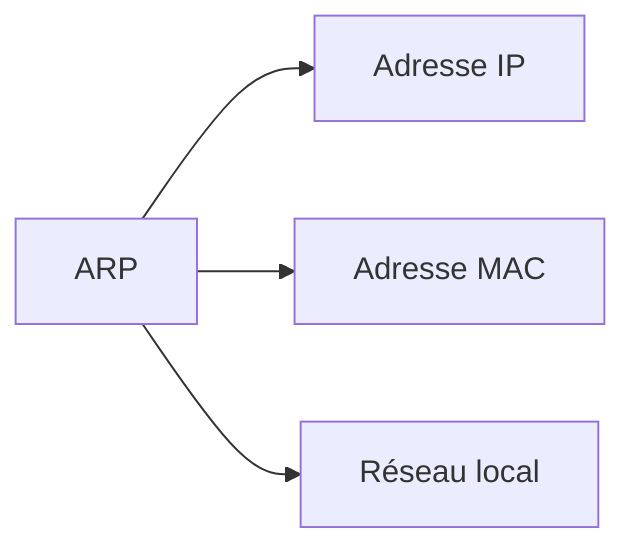

:::

:::note AS

> Groupe de réseaux IP sous une administration technique et politique commune

Utilisé dans le routage Internet pour identifier les domaines de routage
Acronyme : Autonomous System
Identifiant : ASN (Autonomous System Number)

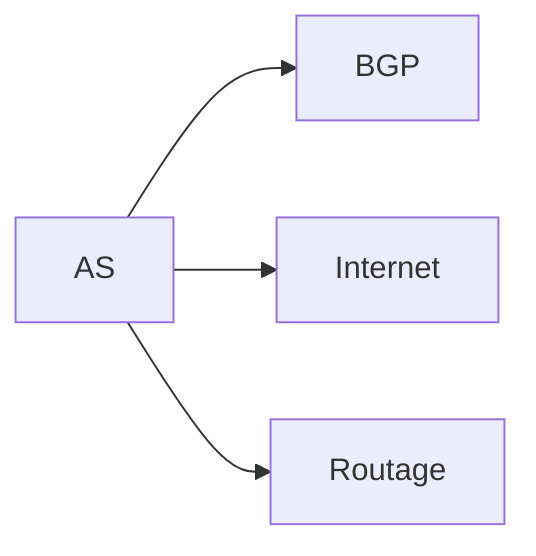

:::

:::note ASN

> Identifiant numérique unique attribué à chaque système autonome

Utilisé pour identifier les AS dans les protocoles de routage externe
Acronyme : Autonomous System Number
Plages : 16-bit (1-65535), 32-bit (étendue)

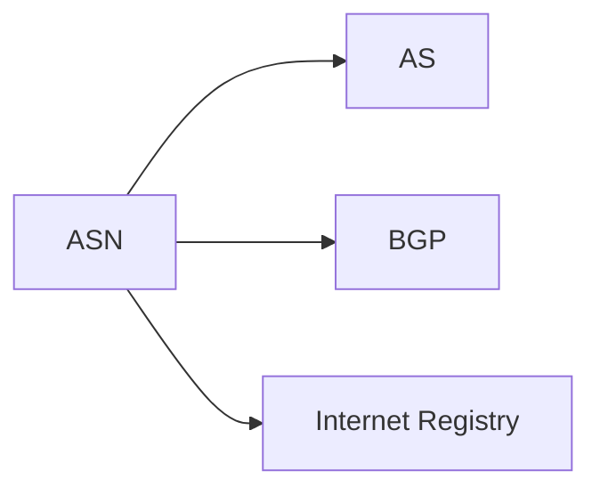

:::

## B

:::note BGP

> Protocole de routage externe utilisé pour échanger des routes entre systèmes autonomes

Utilisé pour le routage Internet entre fournisseurs d'accès et grandes organisations
Acronyme : Border Gateway Protocol
Types : eBGP (externe), iBGP (interne)

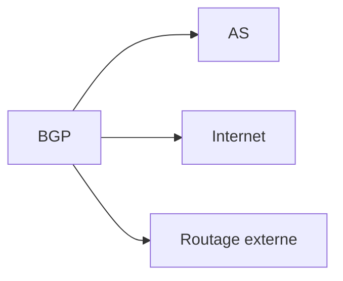

:::

:::note Broadcast

> Mode de transmission envoyant des données à tous les hôtes d'un réseau

Utilisé pour la découverte de services, ARP, DHCP et annonces réseau
Domaine : limité au domaine de broadcast (VLAN, subnet)
Adresse : dernière adresse du sous-réseau

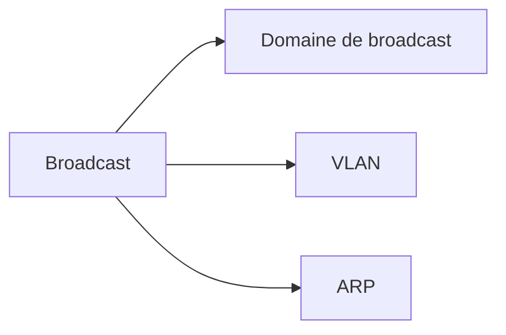

:::

## C

:::note CIDR

> Méthode d'allocation d'adresses IP utilisant une notation de préfixe variable

Utilisé pour optimiser l'utilisation de l'espace d'adressage IP
Acronyme : Classless Inter-Domain Routing
Notation : 192.168.1.0/24 (réseau/masque)

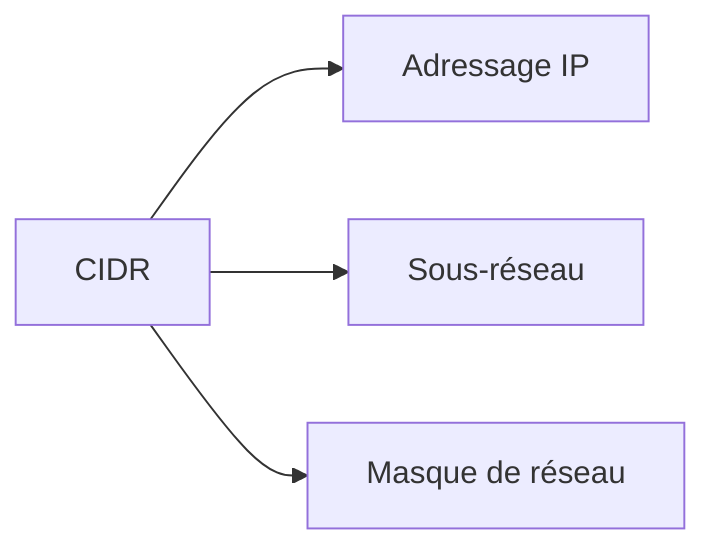

:::

:::note Collision domain

> Zone réseau où les collisions de trames peuvent survenir lors de transmissions simultanées

Utilisé dans les réseaux Ethernet partagés avec hubs
Réduction : utilisation de switches (séparation en domaines de collision)
Obsolescence : technologies full-duplex modernes

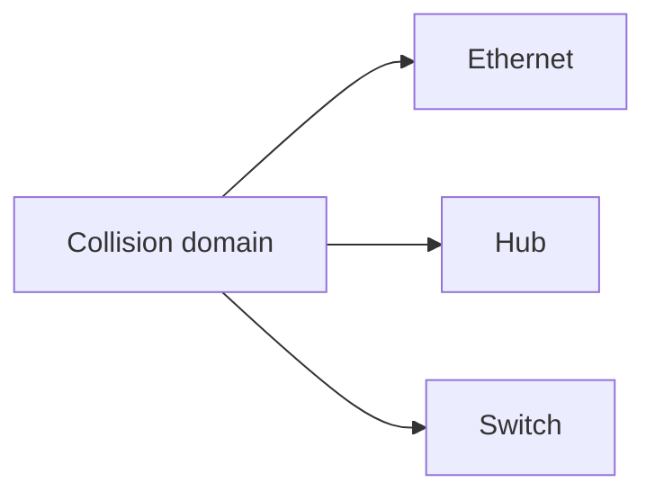

:::

## D

:::note DMZ

> Zone réseau intermédiaire entre le réseau interne et Internet pour les services publics

Utilisé pour exposer des services tout en protégeant le réseau interne
Acronyme : Demilitarized Zone
Services typiques : serveurs web, mail, DNS publics

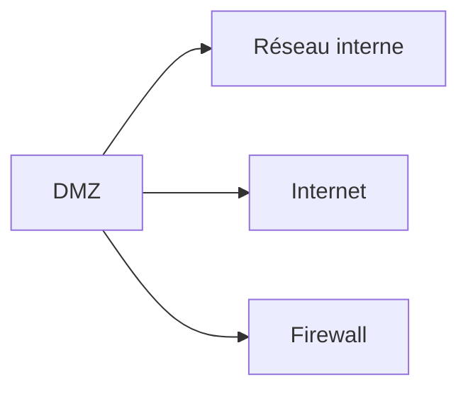

:::

:::note DNS

> Système hiérarchique de résolution de noms de domaine en adresses IP

Utilisé pour traduire les noms d'hôtes en adresses IP navigables
Acronyme : Domain Name System
Composants : serveurs racine, TLD, autoritaires, récursifs

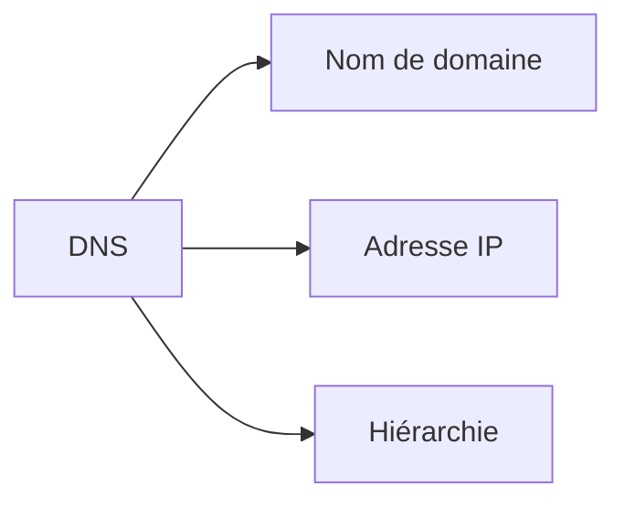

:::

## E

:::note Ethernet

> Standard de réseau local filaire le plus répandu utilisant CSMA/CD

Utilisé pour la connectivité réseau dans les LAN modernes
Vitesses : 10Mbps, 100Mbps, 1Gbps, 10Gbps, 100Gbps
Types : 10BASE-T, 100BASE-TX, 1000BASE-T

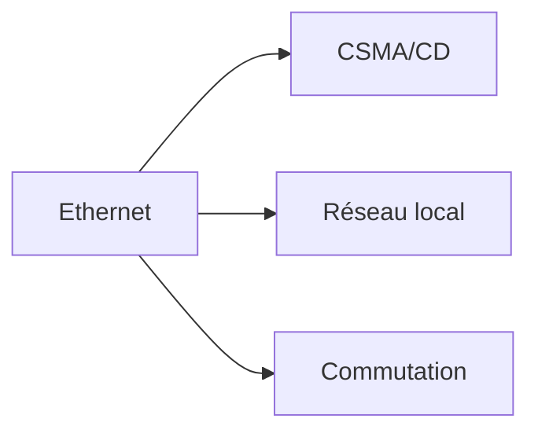

:::

## F

:::note FQDN

> Nom de domaine complet spécifiant la position exacte dans la hiérarchie DNS

Utilisé pour identifier de manière unique un hôte sur Internet
Acronyme : Fully Qualified Domain Name
Format : host.domain.tld (www.example.com)

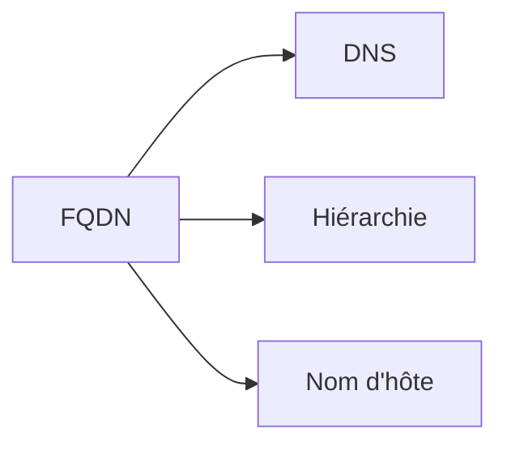

:::

## G

:::note Gateway

> Dispositif réseau connectant deux réseaux utilisant des protocoles différents

Utilisé pour router le trafic entre réseaux et fournir la connectivité externe
Synonyme : passerelle
Types : routeur, proxy, NAT gateway

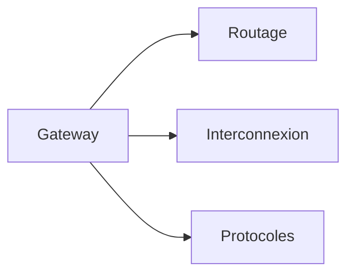

:::

## H

:::note HSRP

> Protocole de redondance permettant à plusieurs routeurs de partager une adresse IP virtuelle

Utilisé pour la haute disponibilité des passerelles par défaut
Acronyme : Hot Standby Router Protocol
Propriétaire : Cisco (équivalent standard : VRRP)

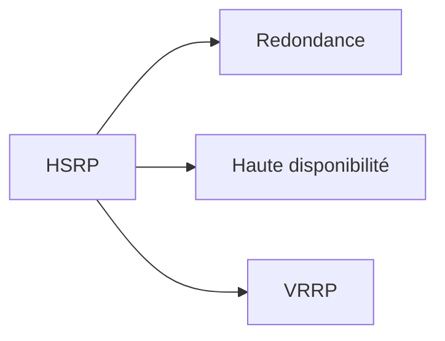

:::

## I

:::note ICMP

> Protocole de messages de contrôle et d'erreur pour la pile TCP/IP

Utilisé pour les diagnostics réseau, notifications d'erreur et découverte de chemin
Acronyme : Internet Control Message Protocol
Outils : ping, traceroute, MTU discovery

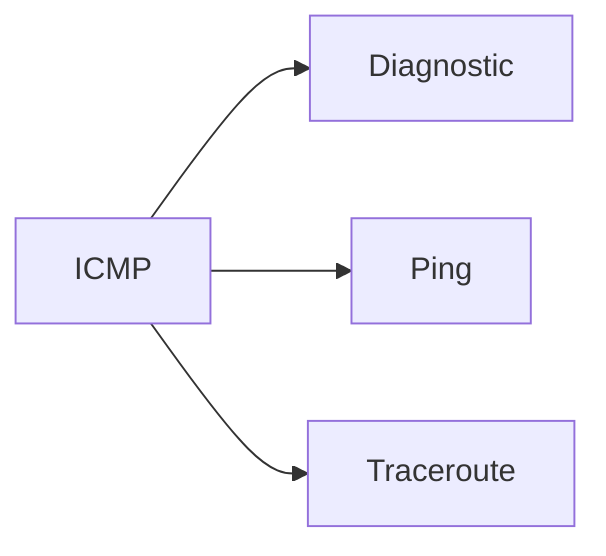

:::

:::note IGP

> Protocole de routage utilisé à l'intérieur d'un système autonome

Utilisé pour distribuer les routes au sein d'une organisation
Acronyme : Interior Gateway Protocol
Exemples : OSPF, EIGRP, RIP

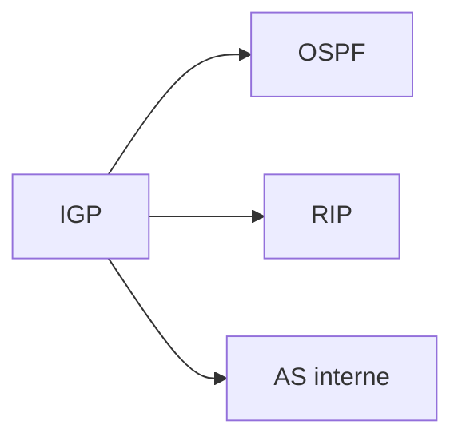

:::

## L

:::note LACP

> Protocole de négociation pour l'agrégation de liens réseau

Utilisé pour combiner plusieurs liens physiques en un lien logique unique
Acronyme : Link Aggregation Control Protocol
Avantages : bande passante augmentée, redondance

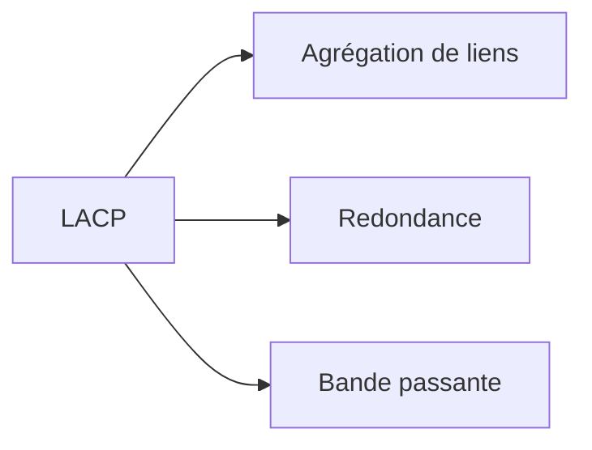

:::

:::note Latency

> Délai de transmission des données entre deux points du réseau

Utilisé pour mesurer la performance et la réactivité réseau
Unité : millisecondes (ms)
Facteurs : distance, équipements, congestion

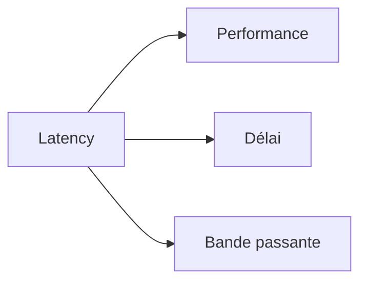

:::

## M

:::note MAC Address

> Identifiant matériel unique de 48 bits attribué à chaque interface réseau

Utilisé pour l'adressage au niveau liaison de données (couche 2)
Acronyme : Media Access Control Address
Format : 6 octets en hexadécimal (00:1B:44:11:3A:B7)

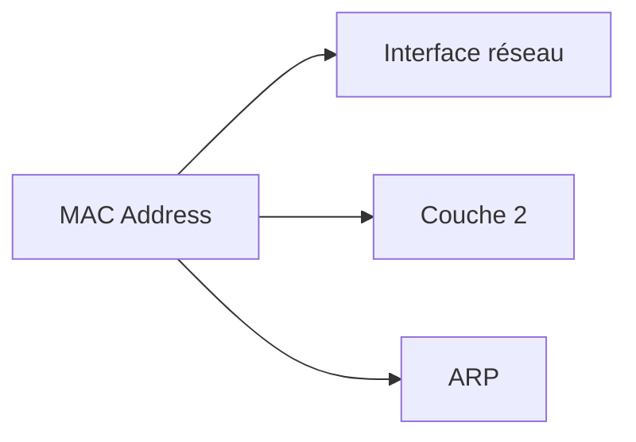

:::

:::note MTU

> Taille maximale d'un paquet de données transmissible sans fragmentation

Utilisé pour optimiser les performances et éviter la fragmentation
Acronyme : Maximum Transmission Unit
Ethernet standard : 1500 octets, Jumbo frames : 9000 octets

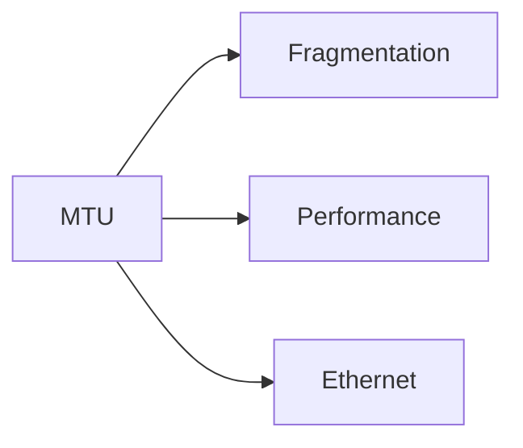

:::

:::note Multicast

> Mode de transmission envoyant des données à un groupe spécifique d'hôtes

Utilisé pour la diffusion efficace de contenu vers plusieurs destinataires
Adresses IPv4 : 224.0.0.0/4, IPv6 : ff00::/8
Protocoles : IGMP, PIM, OSPF

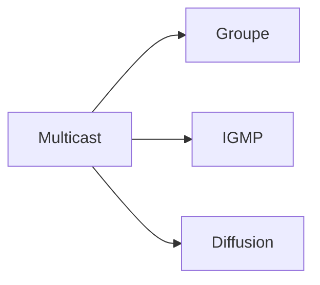

:::

## N

:::note NAT

> Technique de modification des adresses IP lors du routage entre réseaux

Utilisé pour permettre aux réseaux privés d'accéder à Internet
Acronyme : Network Address Translation
Types : statique, dynamique, PAT (Port Address Translation)

```mermaid
graph LR
    A[NAT] --> B[Adresse privée]
    A --> C[Adresse publique]
    A --> D[Internet]
```

:::

:::note NetFlow

> Protocole de collecte et d'analyse du trafic réseau pour le monitoring

Utilisé pour l'analyse de performance, sécurité et facturation
Développé par : Cisco
Standards : NetFlow v9, IPFIX

```mermaid
graph LR
    A[NetFlow] --> B[Monitoring]
    A --> C[Analyse trafic]
    A --> D[Sécurité]
```

:::

## O

:::note OSPF

> Protocole de routage à état de liens utilisant l'algorithme de Dijkstra

Utilisé pour le routage efficace dans les réseaux d'entreprise
Acronyme : Open Shortest Path First
Fonctionnalités : convergence rapide, métrique de coût, aires

```mermaid
graph LR
    A[OSPF] --> B[État de liens]
    A --> C[Dijkstra]
    A --> D[Aires]
```

:::

## P

:::note Packet

> Unité de données formatée transmise sur un réseau avec en-têtes et payload

Utilisé comme unité de base de transmission dans les réseaux à commutation de paquets
Composants : en-têtes (L2, L3, L4), données utiles
Processus : encapsulation, routage, désencapsulation

```mermaid
graph LR
    A[Packet] --> B[En-tête]
    A --> C[Payload]
    A --> D[Routage]
```

:::

:::note Port mirroring

> Technique de copie du trafic d'un port vers un autre pour analyse

Utilisé pour la surveillance réseau, dépannage et analyse de sécurité
Synonymes : SPAN (Switched Port Analyzer), port monitoring
Applications : IDS, analyseurs de protocole

```mermaid
graph LR
    A[Port mirroring] --> B[Surveillance]
    A --> C[Analyse]
    A --> D[IDS]
```

:::

## Q

:::note QoS

> Ensemble de techniques gérant la qualité et priorité du trafic réseau

Utilisé pour garantir la performance des applications critiques
Acronyme : Quality of Service
Mécanismes : classification, marquage, mise en file, limitation

```mermaid
graph LR
    A[QoS] --> B[Priorité]
    A --> C[Bande passante]
    A --> D[Latence]
```

:::

## R

:::note RIP

> Protocole de routage simple basé sur la distance (nombre de sauts)

Utilisé dans les petits réseaux pour sa simplicité de configuration
Acronyme : Routing Information Protocol
Limitations : 15 sauts maximum, convergence lente

```mermaid
graph LR
    A[RIP] --> B[Distance vector]
    A --> C[Sauts]
    A --> D[OSPF]
```

:::

:::note Route

> Chemin que doivent prendre les paquets pour atteindre une destination réseau

Utilisé par les routeurs pour diriger le trafic vers sa destination
Composants : réseau de destination, passerelle, interface, métrique
Table : table de routage stockant toutes les routes connues

```mermaid
graph LR
    A[Route] --> B[Destination]
    A --> C[Passerelle]
    A --> D[Table de routage]
```

:::

## S

:::note Spanning Tree

> Protocole évitant les boucles dans les réseaux de switches redondants

Utilisé pour maintenir une topologie sans boucle tout en gardant la redondance
Standard : IEEE 802.1D (STP), 802.1w (RSTP), 802.1s (MSTP)
États : blocking, listening, learning, forwarding

```mermaid
graph LR
    A[Spanning Tree] --> B[Boucles]
    A --> C[Redondance]
    A --> D[Switch]
```

:::

:::note Subnet

> Subdivision logique d'un réseau IP en segments plus petits

Utilisé pour organiser et sécuriser les réseaux en domaines distincts
Synonyme : sous-réseau
Avantages : isolation, performance, sécurité, organisation

```mermaid
graph LR
    A[Subnet] --> B[Segmentation]
    A --> C[VLAN]
    A --> D[Adressage IP]
```

:::

:::note Switch

> Équipement de commutation opérant au niveau 2 OSI pour interconnecter des hôtes

Utilisé pour créer des réseaux locaux commutés haute performance
Fonctions : apprentissage MAC, commutation, filtrage
Évolution : de hub (domaine de collision partagé) vers switch (séparé)

```mermaid
graph LR
    A[Switch] --> B[Commutation]
    A --> C[Table MAC]
    A --> D[VLAN]
```

:::

## T

:::note Trunking

> Technique transportant le trafic de plusieurs VLANs sur un seul lien physique

Utilisé pour interconnecter des switches en transportant plusieurs VLANs
Standards : IEEE 802.1Q (DOT1Q), ISL (Cisco propriétaire)
Avantages : économie de ports, flexibilité

```mermaid
graph LR
    A[Trunking] --> B[VLAN]
    A --> C[802.1Q]
    A --> D[Interconnexion]
```

:::

:::note TTL

> Valeur décrémentée à chaque saut empêchant les boucles infinies

Utilisé pour limiter la durée de vie des paquets dans le réseau
Acronyme : Time To Live
IPv6 équivalent : Hop Limit

```mermaid
graph LR
    A[TTL] --> B[Saut]
    A --> C[Boucle infinie]
    A --> D[Routage]
```

:::

## U

:::note Unicast

> Mode de transmission point à point entre un émetteur et un récepteur unique

Utilisé pour la communication normale entre deux hôtes spécifiques
Contraste : broadcast (tous), multicast (groupe)
Efficacité : bande passante optimisée, sécurité

```mermaid
graph LR
    A[Unicast] --> B[Point à point]
    A --> C[Broadcast]
    A --> D[Multicast]
```

:::

## V

:::note VLAN

> Réseau local virtuel regroupant logiquement des ports de switches

Utilisé pour segmenter un réseau physique en réseaux logiques distincts
Acronyme : Virtual Local Area Network
Avantages : sécurité, performance, flexibilité, gestion

```mermaid
graph LR
    A[VLAN] --> B[Segmentation]
    A --> C[Switch]
    A --> D[Trunking]
```

:::

:::note VRRP

> Protocole standard de redondance permettant la haute disponibilité des routeurs

Utilisé pour éliminer le point de défaillance unique de la passerelle par défaut
Acronyme : Virtual Router Redundancy Protocol
Standard : RFC 3768 (équivalent libre de HSRP)

```mermaid
graph LR
    A[VRRP] --> B[Redondance]
    A --> C[Haute disponibilité]
    A --> D[HSRP]
```

:::

:::note VTP

> Protocole propriétaire Cisco de gestion centralisée des VLANs

Utilisé pour synchroniser les informations VLAN entre switches
Acronyme : VLAN Trunking Protocol
Modes : server, client, transparent

```mermaid
graph LR
    A[VTP] --> B[VLAN]
    A --> C[Synchronisation]
    A --> D[Cisco]
```

:::

## W

:::note WAN

> Réseau étendu couvrant une large zone géographique pour interconnecter des sites distants

Utilisé pour connecter des bureaux, data centers ou régions géographiques
Acronyme : Wide Area Network
Technologies : MPLS, Internet VPN, lignes louées, satellite

```mermaid
graph LR
    A[WAN] --> B[Sites distants]
    A --> C[MPLS]
    A --> D[VPN]
```

:::

---

_Glossaire Administration Réseau v2024.1_
