# Glossaire - Administration Système

> Gestion des systèmes d'exploitation, services et infrastructure - Linux, Windows, virtualisation

:::info 38 termes disponible pour la partie Administration Système
:::

---

## **A**

:::note ACL

> Liste de contrôle d'accès définissant les permissions spécifiques d'utilisateurs ou groupes sur des ressources

Utilisé pour la sécurité fine des fichiers, répertoires et services système

-   **Acronyme :** Access Control List
-   Extension des permissions UNIX classiques (rwx)

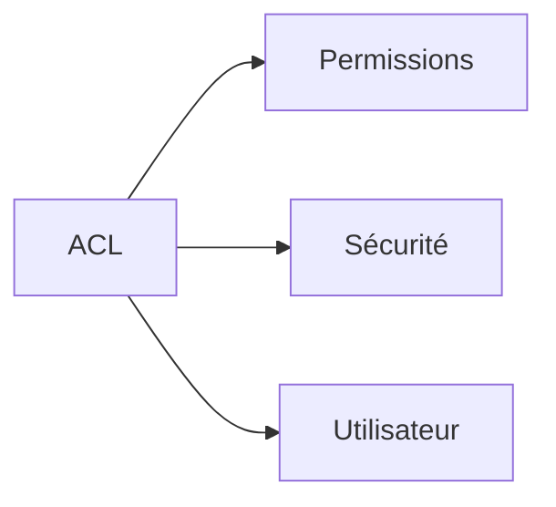

:::

:::note Ansible

> Outil d'automatisation IT permettant la configuration, déploiement et gestion d'infrastructure

Utilisé pour l'automatisation des tâches système et le configuration management

-   **Langage :** YAML (playbooks)
-   **Avantages :** agentless, idempotent

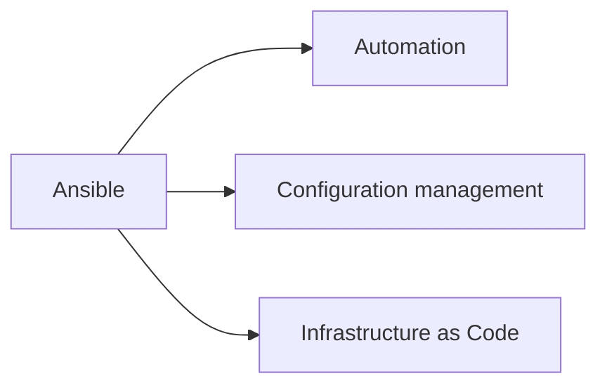

:::

:::note APT

> Gestionnaire de paquets avancé pour les distributions Debian et dérivées

Utilisé pour installer, mettre à jour et supprimer des logiciels

-   **Acronyme :** Advanced Package Tool
-   **Commandes :** apt install, apt update, apt upgrade

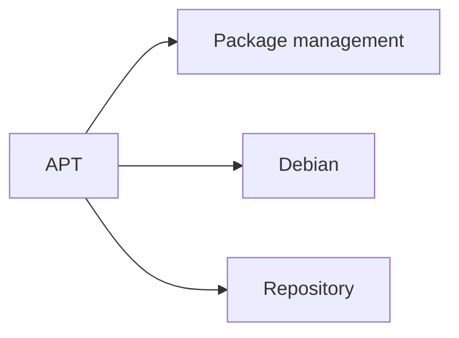

:::

## **B**

:::note Bash

> Shell Unix populaire et langage de script pour l'automatisation de tâches système

Utilisé comme interface en ligne de commande et pour l'écriture de scripts

-   **Acronyme :** Bourne Again Shell
-   **Fonctionnalités :** variables, boucles, conditions, pipes

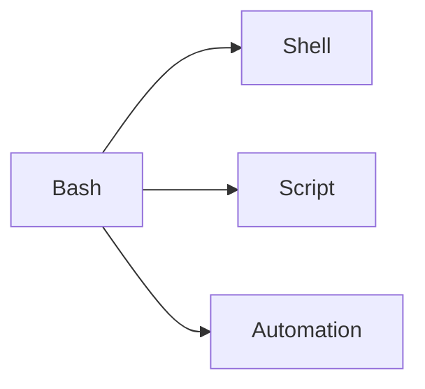

:::

:::note Backup

> Processus de copie et sauvegarde des données pour prévenir leur perte

Utilisé pour la continuité d'activité et la récupération après sinistre

-   **Types :** complet, incrémental, différentiel
-   **Stratégies :** 3-2-1 rule (3 copies, 2 supports, 1 hors site)

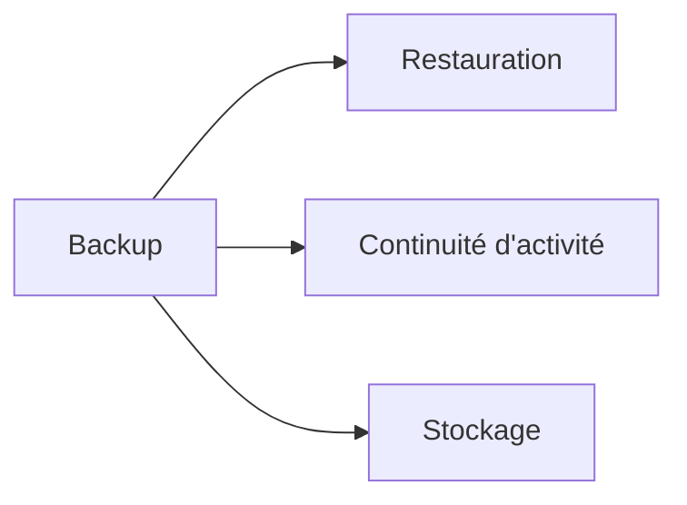

:::

## **C**

:::note Chroot

> Technique d'isolation changeant la racine apparente du système de fichiers pour un processus

Utilisé pour la sécurité, les tests et l'isolation d'applications

-   **Principe :** création d'un environnement cloison
-   **Évolution :** containers (Docker, LXC)

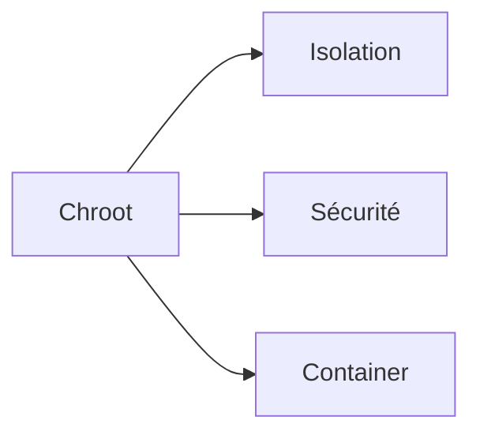

:::

:::note Cron

> Démon Unix planificateur de tâches permettant l'exécution automatique de commandes

Utilisé pour l'automatisation de maintenance, sauvegardes et monitoring

-   **Format :** minute heure jour mois jour_semaine commande
-   **Fichiers :** crontab personnel, /etc/crontab système

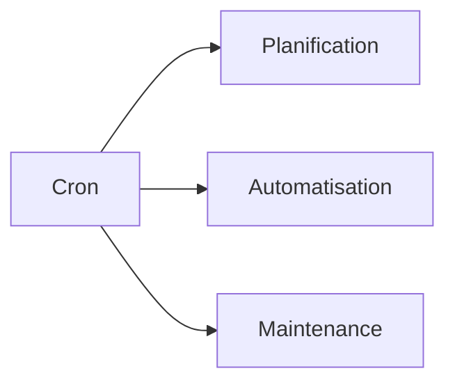

:::

:::note CIS Benchmarks

> Standards de configuration sécurisée pour systèmes, réseaux et applications

Utilisé pour le durcissement et l'audit de sécurité des infrastructures

-   **Acronyme :** Center for Internet Security
-   **Niveaux :** Level 1 (basique), Level 2 (défense en profondeur)

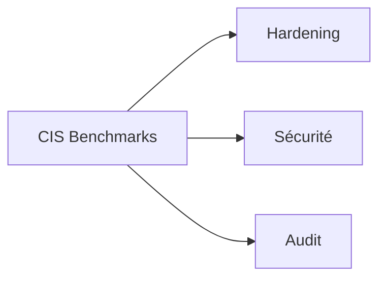

:::

## **D**

:::note Daemon

> Programme s'exécutant en arrière-plan comme service système sans interaction utilisateur

Utilisé pour fournir des services persistants (web, base de données, réseau)

-   **Convention :** nom terminé par 'd' (httpd, sshd, mysqld)
-   **Gestion :** systemd, init.d, service

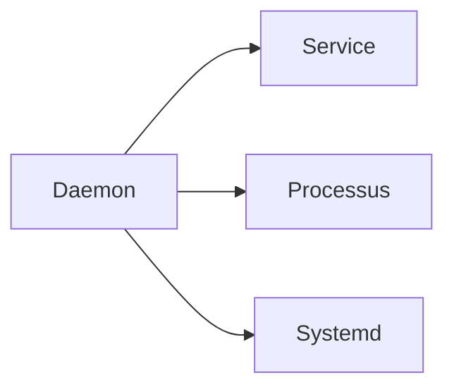

:::

:::note DHCP

> Protocole d'attribution automatique d'adresses IP et de configuration réseau

Utilisé pour simplifier la gestion réseau et éviter les conflits d'adresses

-   **Acronyme :** Dynamic Host Configuration Protocol
-   **Composants :** serveur DHCP, client, pool d'adresses, lease

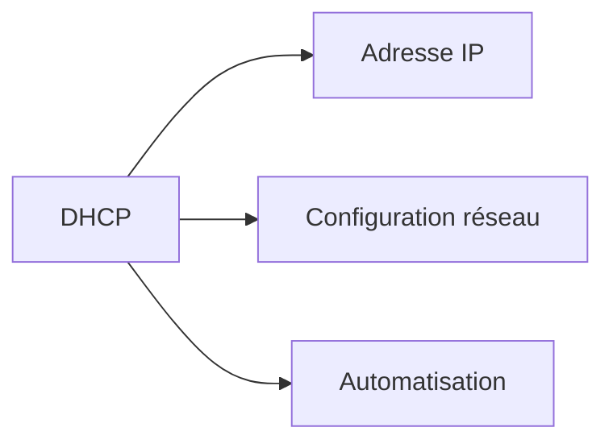

:::

## **E**

:::note EXT4

> Système de fichiers journalisé par défaut sur la plupart des distributions Linux

Utilisé pour le stockage des données avec fiabilité et performance

-   **Acronyme :** Fourth Extended File System
-   **Fonctionnalités :** journalisation, extents, allocation retardée

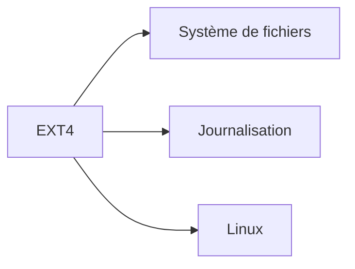

:::

## **F**

:::note Fail2ban

> Outil de protection contre les attaques par force brute analysant les logs système

Utilisé pour bloquer automatiquement les adresses IP suspectes

-   **Principe :** analyse des logs, détection de patterns, action (ban IP)
-   **Services protégés :** SSH, HTTP, FTP, mail

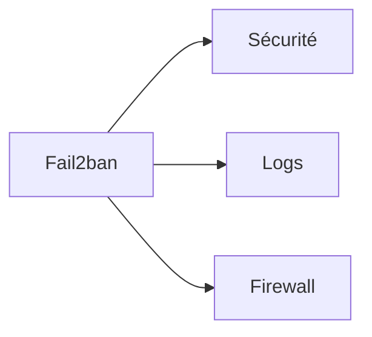

:::

:::note Filesystem

> Organisation logique et hiérarchique du stockage des fichiers et répertoires sur un support

Utilisé pour structurer, organiser et accéder aux données stockées

-   **Types :** EXT4, NTFS, APFS, ZFS, Btrfs
-   **Fonctions :** métadonnées, permissions, indexation

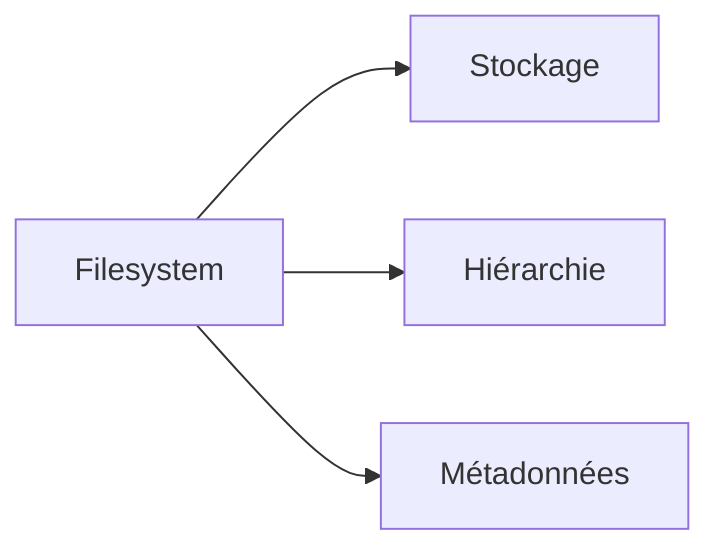

:::

## **G**

:::note GPT

> Standard moderne de partitionnement de disque remplaçant le MBR traditionnel

Utilisé pour les disques de grande capacité et le démarrage UEFI

-   **Acronyme :** GUID Partition Table
-   **Avantages :** support >2TB, 128 partitions, redondance

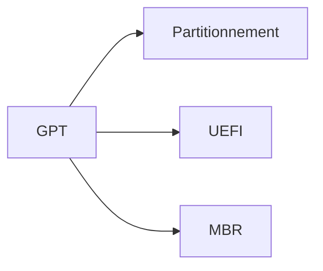

:::

## **H**

:::note Hardening

> Processus de sécurisation d'un système par configuration et suppression des vulnérabilités

Utilisé pour réduire la surface d'attaque et améliorer la posture sécuritaire

-   **Techniques :** désactivation services inutiles, mise à jour, configuration sécurisée
-   **Standards :** CIS Benchmarks, STIG

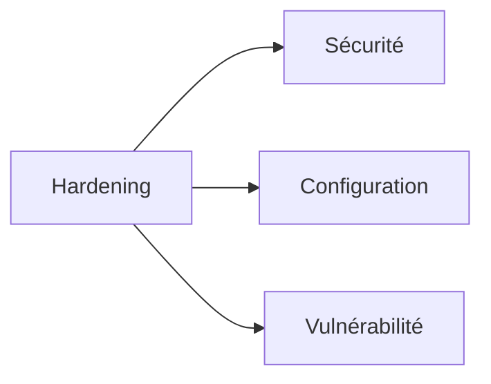

:::

:::note Htop

> Moniteur de processus interactif et amélioré pour systèmes Unix/Linux

Utilisé pour surveiller l'utilisation des ressources système en temps réel
Amélioration de : top
Fonctionnalités : interface colorée, tri, recherche, gestion processus

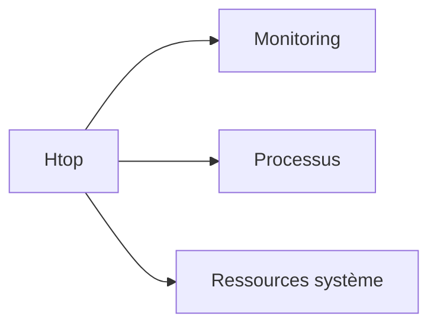

:::

## **I**

:::note Inode

> Structure de données contenant les métadonnées d'un fichier dans les systèmes Unix/Linux

Utilisé pour l'organisation interne des fichiers par le système de fichiers

-   **Contenu :** permissions, propriétaire, taille, timestamps, pointeurs vers blocs
-   **Limitation :** nombre d'inodes fixe à la création du filesystem

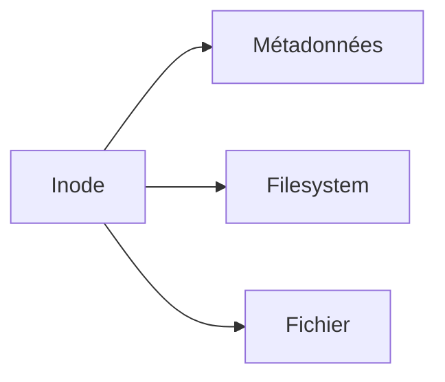

:::

:::note Iptables

> Framework de filtrage de paquets réseau pour Linux basé sur Netfilter

Utilisé pour implémenter des firewalls, NAT et manipulation de paquets

-   **Concepts :** tables (filter, nat, mangle), chaînes (INPUT, OUTPUT, FORWARD)
-   **Successeur :** nftables

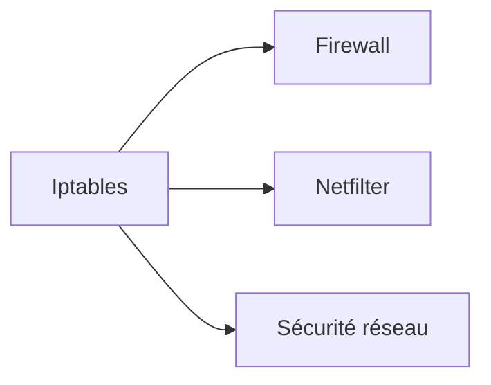

:::

## **J**

:::note Journald

> Service de journalisation centralisé faisant partie de systemd

Utilisé pour collecter, stocker et consulter les logs système de manière unifiée

-   **Commande :** journalctl
-   **Avantages :** indexation, recherche, rotation automatique

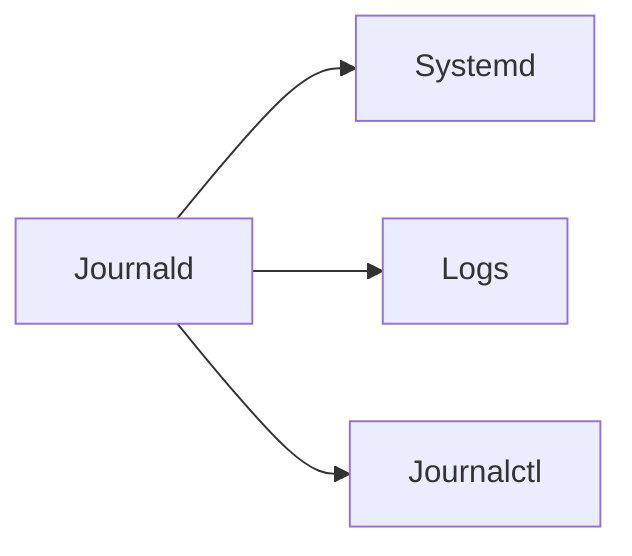

:::

## **K**

:::note Kernel

> Noyau du système d'exploitation gérant les ressources matérielles et logicielles

Utilisé comme interface entre les applications et le matériel

-   **Fonctions :** gestion mémoire, processus, périphériques, système de fichiers
-   **Types :** monolithique (Linux), microkernel, hybride

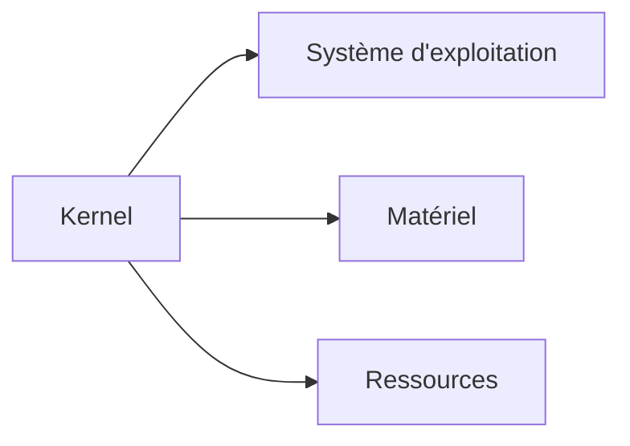

:::

:::note KVM

> Solution de virtualisation basée sur le noyau Linux utilisant les extensions matérielles

Utilisé pour créer et gérer des machines virtuelles haute performance

-   **Acronyme :** Kernel-based Virtual Machine
-   **Outils :** libvirt, QEMU, virt-manager

```mermaid
graph LR
    A[KVM] --> B[Virtualisation]
    A --> C[Hyperviseur]
    A --> D[Machine virtuelle]
```

:::

## **L**

:::note LDAP

> Protocole d'accès et de gestion d'annuaires informatiques centralisés

Utilisé pour l'authentification centralisée et la gestion d'identités

-   **Acronyme :** Lightweight Directory Access Protocol
-   **Implémentations :** Active Directory, OpenLDAP

```mermaid
graph LR
    A[LDAP] --> B[Annuaire]
    A --> C[Authentification]
    A --> D[Active Directory]
```

:::

:::note LVM

> Gestionnaire de volumes logiques permettant une gestion flexible du stockage

Utilisé pour redimensionner, déplacer et sauvegarder les volumes dynamiquement

-   **Acronyme :** Logical Volume Manager
-   **Composants :** PV (Physical Volume), VG (Volume Group), LV (Logical Volume)

```mermaid
graph LR
    A[LVM] --> B[Volume logique]
    A --> C[Stockage flexible]
    A --> D[Redimensionnement]
```

:::

:::note Log rotation

> Processus automatique d'archivage et de suppression des anciens fichiers de logs

Utilisé pour éviter la saturation de l'espace disque par les logs

-   **Outils :** logrotate, newsyslog
-   **Stratégies :** rotation par taille, par temps, compression

```mermaid
graph LR
    A[Log rotation] --> B[Logs]
    A --> C[Espace disque]
    A --> D[Archivage]
```

:::

## **M**

:::note Mount

> Action de rendre accessible un système de fichiers en l'attachant à l'arborescence

Utilisé pour accéder aux disques, partitions et systèmes de fichiers distants

-   **Commandes :** mount, umount
-   **Points de montage :** répertoires servant d'accès aux filesystems

```mermaid
graph LR
    A[Mount] --> B[Filesystem]
    A --> C[Point de montage]
    A --> D[Arborescence]
```

:::

:::note MBR

> Secteur de démarrage traditionnel contenant la table de partitions et le bootloader

Utilisé sur les anciens systèmes BIOS pour le démarrage et partitionnement

-   **Acronyme :** Master Boot Record
-   **Limitations :** 4 partitions primaires, disques &lt;2TB

```mermaid
graph LR
    A[MBR] --> B[Partitionnement]
    A --> C[BIOS]
    A --> D[GPT]
```

:::

## **N**

:::note NFS

> Protocole de partage de fichiers en réseau permettant l'accès distant transparent

Utilisé pour partager des systèmes de fichiers entre machines Unix/Linux

-   **Acronyme :** Network File System
-   **Versions :** NFSv3, NFSv4 (avec sécurité Kerberos)

```mermaid
graph LR
    A[NFS] --> B[Partage de fichiers]
    A --> C[Réseau]
    A --> D[Montage distant]
```

:::

:::note Nftables

> Framework moderne de filtrage réseau succédant à iptables

Utilisé pour la gestion avancée du trafic réseau et la sécurité

-   **Avantages :** syntaxe unifiée, performance améliorée, IPv4/IPv6 natif
-   **Compatibilité :** peut coexister avec iptables

```mermaid
graph LR
    A[Nftables] --> B[Iptables]
    A --> C[Firewall]
    A --> D[Netfilter]
```

:::

## **P**

:::note PAM

> Framework d'authentification modulaire permettant de configurer les méthodes d'auth

Utilisé pour centraliser et standardiser l'authentification système

-   **Acronyme :** Pluggable Authentication Modules
-   **Modules :** pam_unix, pam_ldap, pam_google_authenticator

```mermaid
graph LR
    A[PAM] --> B[Authentification]
    A --> C[Modules]
    A --> D[Sécurité]
```

:::

:::note PID

> Identifiant numérique unique attribué à chaque processus en cours d'exécution

Utilisé pour identifier, surveiller et gérer les processus système

-   **Acronyme :** Process ID
-   **Commandes :** ps, top, kill, pgrep

```mermaid
graph LR
    A[PID] --> B[Processus]
    A --> C[Gestion]
    A --> D[Surveillance]
```

:::

## **R**

:::note RAID

> Techniques de regroupement de disques pour améliorer performance et/ou redondance

Utilisé pour la haute disponibilité et la protection des données

-   **Acronyme :** Redundant Array of Independent Disks
-   **Niveaux :** RAID 0 (performance), RAID 1 (miroir), RAID 5 (parité)

```mermaid
graph LR
    A[RAID] --> B[Redondance]
    A --> C[Performance]
    A --> D[Stockage]
```

:::

:::note RPM

> Format de paquet et gestionnaire pour les distributions Red Hat et dérivées

Utilisé pour installer, mettre à jour et gérer les logiciels

-   **Acronyme :** Red Hat Package Manager / RPM Package Manager
-   **Commandes :** rpm, yum, dnf

```mermaid
graph LR
    A[RPM] --> B[Package management]
    A --> C[Red Hat]
    A --> D[YUM]
```

:::danger Attention
En réseau il existe le RPM pour la **rotation par minute** d'un disque dure 3" et demie. (7200/rpm)
:::

:::note Rsync

> Outil de synchronisation de fichiers efficace utilisant des algorithmes delta

Utilisé pour les sauvegardes, synchronisation et transferts optimisés

-   **Avantages :** transfert incrémental, compression, préservation métadonnées
-   **Utilisation :** backup, déploiement, migration

```mermaid
graph LR
    A[Rsync] --> B[Synchronisation]
    A --> C[Backup]
    A --> D[Transfert]
```

:::

## **S**

:::note SELinux

> Système de contrôle d'accès obligatoire ajoutant une couche de sécurité renforcée

Utilisé pour confiner les processus et limiter les dégâts en cas de compromission

-   **Acronyme :** Security-Enhanced Linux
-   **Modes :** enforcing, permissive, disabled

```mermaid
graph LR
    A[SELinux] --> B[Sécurité]
    A --> C[Confinement]
    A --> D[Contrôle d'accès]
```

:::

:::note SSH

> Protocole de communication sécurisée permettant l'accès distant chiffré

Utilisé pour l'administration à distance, transfert de fichiers et tunneling

-   **Acronyme :** Secure Shell
-   **Fonctionnalités :** authentification par clé, port forwarding, SFTP

```mermaid
graph LR
    A[SSH] --> B[Accès distant]
    A --> C[Chiffrement]
    A --> D[Administration]
```

:::

:::note Sudo

> Commande permettant l'exécution de commandes avec les privilèges d'un autre utilisateur

Utilisé pour l'élévation de privilèges temporaire et sécurisée

-   **Acronyme :** Substitute User DO / Super User DO
-   **Configuration :** /etc/sudoers, visudo

```mermaid
graph LR
    A[Sudo] --> B[Privilèges]
    A --> C[Sécurité]
    A --> D[Administration]
```

:::

:::note Systemd

> Système d'init moderne pour Linux gérant les services et le démarrage

Utilisé pour démarrer, arrêter et gérer les services système

-   **Composants :** systemctl, journald, networkd, resolved
-   **Units :** service, timer, mount, socket

```mermaid
graph LR
    A[Systemd] --> B[Init]
    A --> C[Services]
    A --> D[Journald]
```

:::

## **T**

:::note Tmpfs

> Système de fichiers temporaire stocké entièrement en mémoire RAM

Utilisé pour des données temporaires nécessitant des accès très rapides

-   **Avantages :** vitesse maximale, nettoyage automatique au redémarrage
-   **Utilisations :** /tmp, cache, builds temporaires

```mermaid
graph LR
    A[Tmpfs] --> B[Mémoire RAM]
    A --> C[Performance]
    A --> D[Temporaire]
```

:::

## **U**

:::note Umask

> Masque définissant les permissions par défaut des nouveaux fichiers et répertoires

Utilisé pour contrôler les permissions d'accès lors de la création

-   **Valeurs courantes :** 022 (755), 027 (750), 077 (700)
-   **Calcul :** permissions finales = permissions max - umask

```mermaid
graph LR
    A[Umask] --> B[Permissions]
    A --> C[Sécurité]
    A --> D[Fichier]
```

:::

:::note UUID

> Identifiant unique universel utilisé pour identifier de manière unique des ressources

Utilisé pour identifier disques, partitions, filesystems de manière persistante

-   **Acronyme :** Universally Unique Identifier
-   **Format :** 8-4-4-4-12 caractères hexadécimaux

```mermaid
graph LR
    A[UUID] --> B[Identification]
    A --> C[Partition]
    A --> D[Persistent]
```

:::

## **V**

:::note Virtualisation

> Technologie créant des environnements virtuels isolés sur du matériel physique

Utilisé pour optimiser l'utilisation des ressources et l'isolation des workloads

-   **Types :** hyperviseur de type 1 (bare metal), type 2 (hosted)
-   **Technologies :** Proxmox, VirtualBox, VMware, KVM, Hyper-V, Xen

```mermaid
graph LR
    A[Virtualisation] --> B[Hyperviseur]
    A --> C[Machine virtuelle]
    A --> D[Isolation]
```

:::

:::note VNC

> Protocole de bureau à distance permettant le contrôle graphique d'une machine

Utilisé pour l'administration graphique à distance de serveurs et postes

-   **Acronyme :** Virtual Network Computing
-   **Variantes :** TightVNC, RealVNC, TigerVNC

```mermaid
graph LR
    A[VNC] --> B[Bureau à distance]
    A --> C[Contrôle graphique]
    A --> D[Administration]
```

:::

## **Y**

:::note YUM

> Gestionnaire de paquets automatisant l'installation et les dépendances pour Red Hat

Utilisé pour simplifier la gestion des logiciels et mises à jour

-   **Acronyme :** Yellowdog Updater Modified
-   **Successeur :** DNF (Dandified YUM)

```mermaid
graph LR
    A[YUM] --> B[RPM]
    A --> C[Dépendances]
    A --> D[DNF]
```

:::

## **Z**

:::note ZFS

> Système de fichiers avancé combinant filesystem et gestionnaire de volumes

Utilisé pour la protection des données, snapshots et gestion du stockage enterprise

-   **Acronyme :** Zettabyte File System
-   **Fonctionnalités :** déduplication, compression, RAID intégré, checksums

```mermaid
graph LR
    A[ZFS] --> B[Snapshot]
    A --> C[Intégrité]
    A --> D[Déduplication]
```

:::

---

_Glossaire Administration Système v2025.1_
