# Glossaire - Bases Fondamentales

> Concepts incontournables de l'informatique - Algorithmique, programmation et architecture des systèmes

:::info 35 termes disponibles pour la partie lié aux bases fondamentales
:::

---

## **A**

:::note Algorithme

> Séquence d'instructions logiques et ordonnées pour résoudre un problème ou effectuer une tâche spécifique

Utilisé en programmation, recherche opérationnelle, intelligence artificielle et optimisation

-   **Synonymes :** procédure, méthode, processus algorithmique

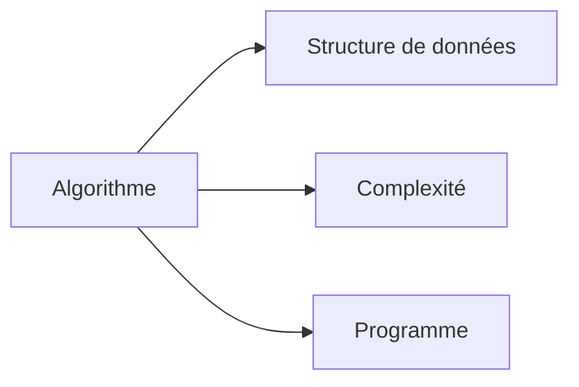

:::

:::note API

> Interface de programmation permettant la communication et l'échange de données entre différents logiciels ou services

Essentiel dans l'architecture microservices, développement web et intégration de systèmes

-   **Acronyme :** Application Programming Interface
-   **Variantes :** REST API, GraphQL API, SOAP API

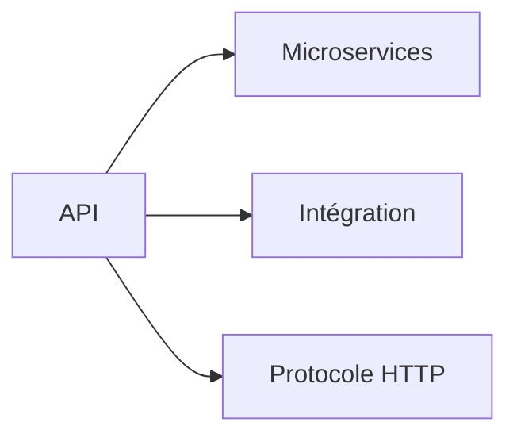

:::

:::note ASCII

> Standard d'encodage de caractères utilisant 7 bits pour représenter 128 caractères différents

Utilisé pour la compatibilité entre systèmes, protocoles de communication et encodage de base

-   **Acronyme :** American Standard Code for Information Interchange
-   **Extension :** ASCII étendu (8 bits, 256 caractères)

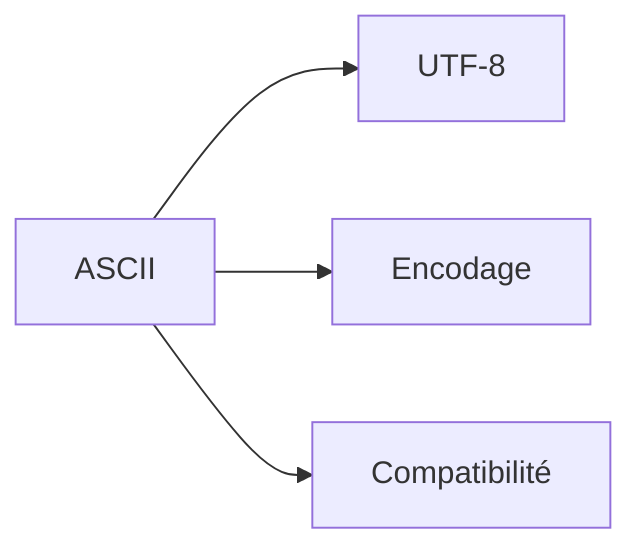

:::

## **B**

:::note Big O

> Notation mathématique décrivant la complexité algorithmique dans le pire des cas en fonction de la taille des données

Utilisé pour analyser et comparer l'efficacité des algorithmes

-   **Variantes :** Θ (Theta), Ω (Omega), o (petit o)

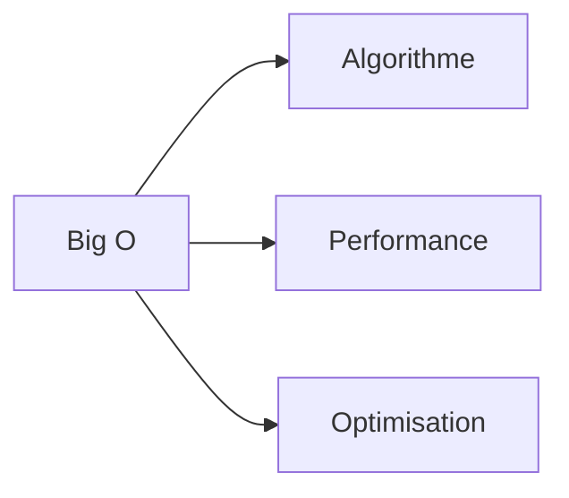

:::

:::note Binaire

> Système de numération en base 2 utilisant uniquement les chiffres 0 et 1, langage fondamental des ordinateurs

Utilisé dans tous les systèmes informatiques, représentation des données et logique booléenne

-   **Variantes :** BCD (Binary Coded Decimal), Gray code

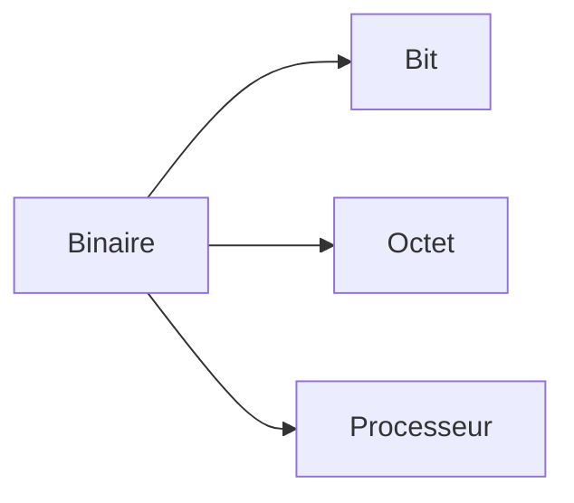

:::

:::note Bit

> Plus petite unité d'information en informatique, peut valoir 0 ou 1

Utilisé pour mesurer la capacité de stockage et la vitesse de transmission

-   **Variantes** : kb (kilobit), Mb (mégabit), Gb (gigabit)

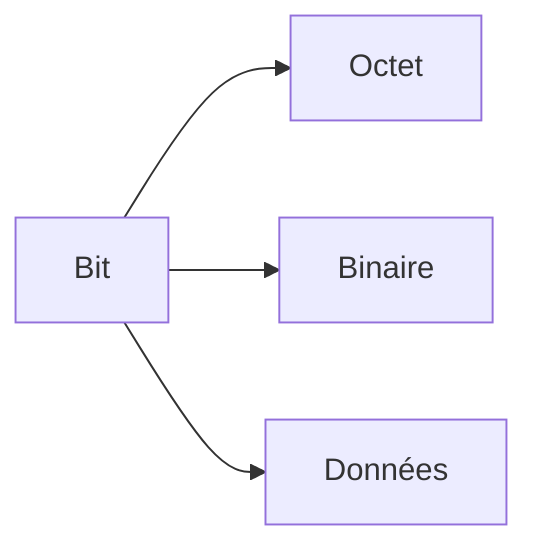

:::

:::note Byte

> Unité d'information composée de 8 bits, capable de représenter 256 valeurs différentes

Utilisé pour mesurer la taille des fichiers et la capacité mémoire

-   **Synonyme :** Octet
-   **Variantes :** KB (kilobyte), MB (mégabyte), GB (gigabyte)

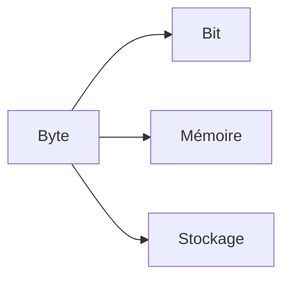

:::

## **C**

:::note Cache

> Mémoire rapide stockant temporairement des données fréquemment utilisées pour accélérer les accès

Utilisé dans les processeurs, navigateurs web, bases de données et systèmes distribués

-   **Types :** Cache L1/L2/L3, cache web, cache applicatif

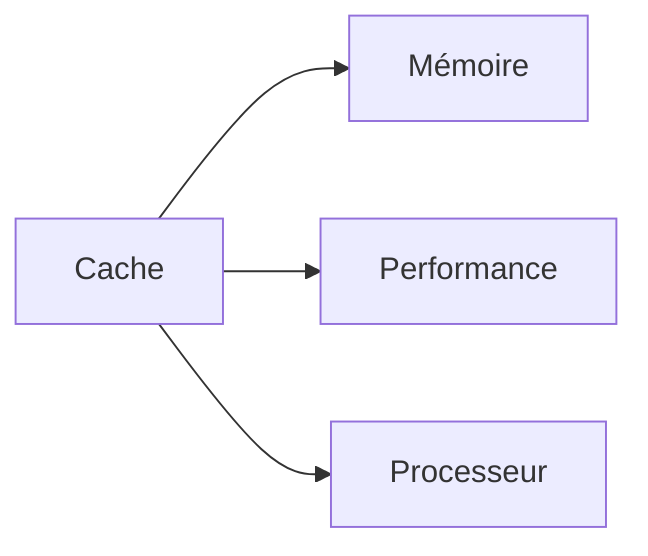

:::

:::note Compilation

> Processus de traduction du code source écrit par un programmeur en code machine exécutable par l'ordinateur

Utilisé dans le développement logiciel avec des langages comme C, C++, Rust, Go

-   **Antonyme :** Interprétation
-   **Types :** AOT (Ahead-of-Time), JIT (Just-in-Time)

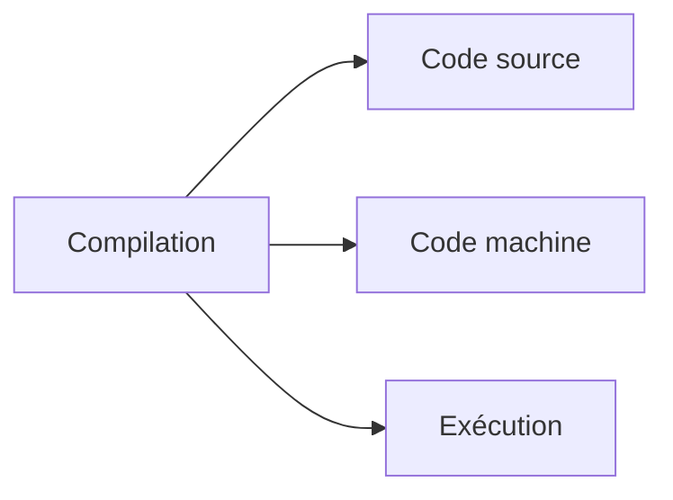

:::

:::note Complexité temporelle

> Mesure du temps d'exécution d'un algorithme en fonction de la taille des données d'entrée

Utilisé pour l'analyse d'algorithmes et l'optimisation de performance

-   **Notation :** Big O, Theta, Omega

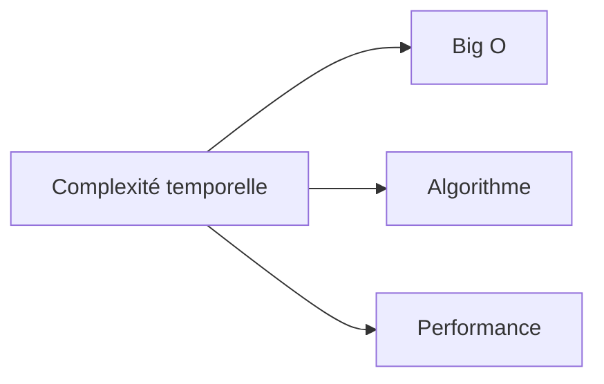

:::

## **D**

:::note Débogage

> Processus d'identification, d'analyse et de correction des erreurs dans un programme informatique

Utilisé durant le développement logiciel et la maintenance applicative

-   **Synonyme :** Debug
-   **Outils :** debugger, breakpoints, logs

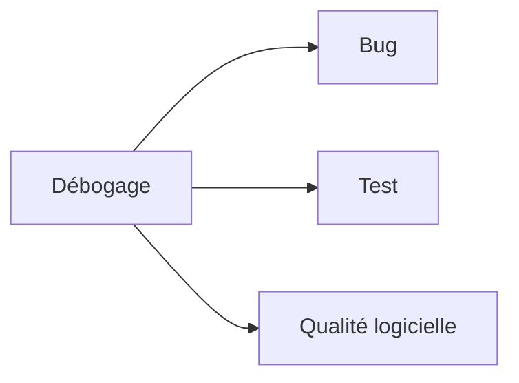

:::

:::note DFS

> Algorithme de parcours d'arbres ou de graphes explorant aussi profondément que possible avant de revenir en arrière

Utilisé en intelligence artificielle, résolution de problèmes et analyse de graphes

-   **Acronyme :** Depth-First Search
-   **Antonyme :** BFS (Breadth-First Search)

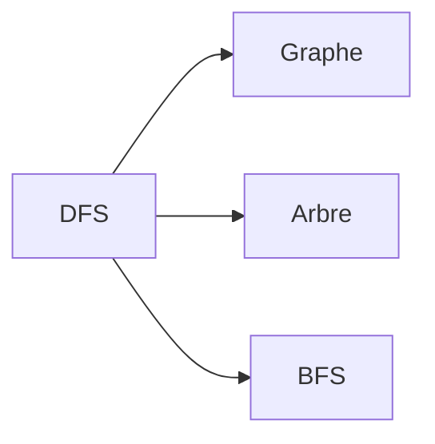

:::

## **E**

:::note Encodage

> Processus de conversion de données dans un format spécifique selon des règles définies

Utilisé pour la représentation de caractères, compression et transmission de données

-   **Types :** UTF-8, ASCII, Base64, URL encoding

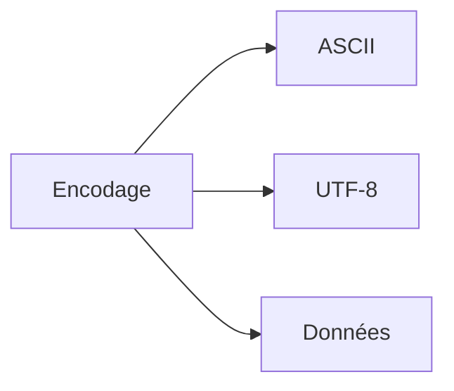

:::

## **F**

:::note Fonction

> Bloc de code réutilisable effectuant une tâche spécifique, pouvant recevoir des paramètres et retourner une valeur

Utilisé dans tous les paradigmes de programmation pour la modularité et la réutilisabilité

-   **Synonymes :** méthode, procédure, routine
-   **Types :** fonction pure, fonction récursive, fonction lambda

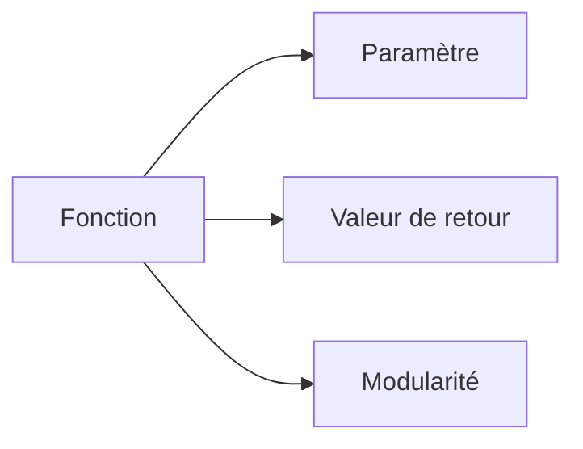

:::

:::note Framework

> Structure logicielle préconçue fournissant une base et des outils pour développer des applications

Utilisé pour accélérer le développement et standardiser l'architecture

-   **Types :** framework web, framework mobile, framework de test
-   **Exemples :** React, Django, Spring

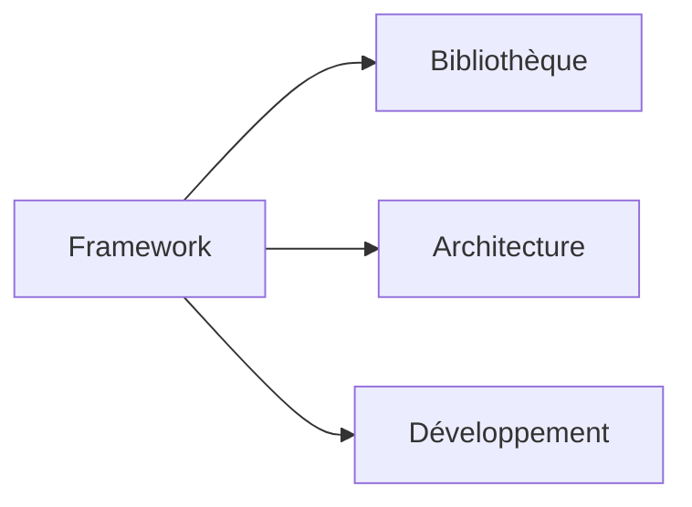

:::

## **G**

:::note Garbage Collection

> Processus automatique de libération de la mémoire occupée par des objets qui ne sont plus utilisés

Utilisé dans les langages managés comme Java, C#, Python pour éviter les fuites mémoire

-   **Synonyme :** ramasse-miettes
-   **Types :** mark-and-sweep, generational GC, reference counting

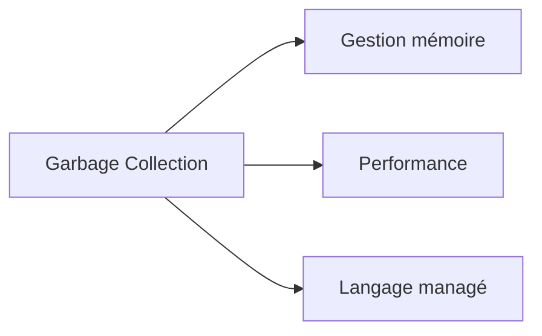

:::

:::note Git

> Système de contrôle de version distribué permettant de suivre les modifications de fichiers et de collaborer

Utilisé dans le développement logiciel pour le versioning et la collaboration

-   **Commandes principales :** add, commit, push, pull, merge
-   **Plateformes :** GitHub, GitLab, Bitbucket

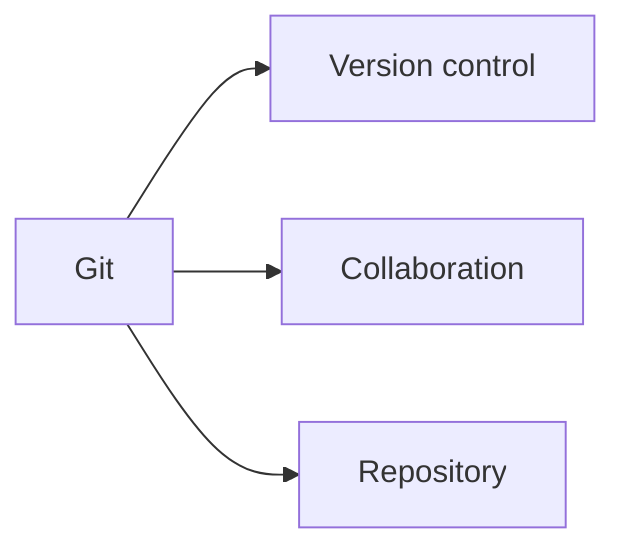

:::

## **H**

:::note Hash

> Fonction mathématique transformant des données de taille arbitraire en une empreinte de taille fixe

Utilisé pour l'intégrité des données, l'indexation et la cryptographie

-   **Synonyme :** hachage, empreinte
-   **Algorithmes :** MD5, SHA-256, bcrypt

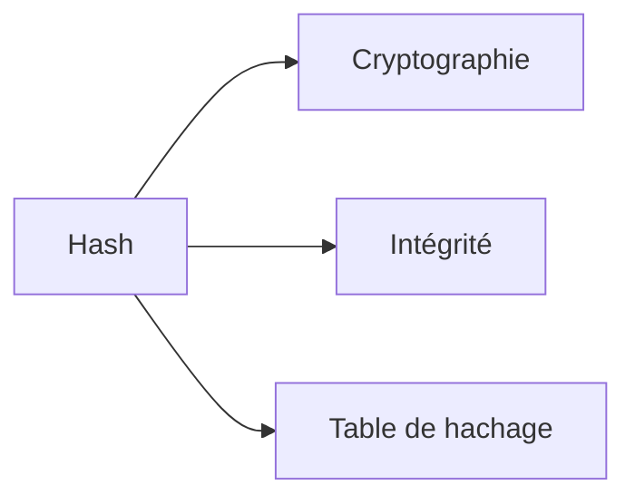

:::

:::note Heap

> Structure de données arborescente où chaque nœud parent est ordonné par rapport à `ses enfants` / `Zone mémoire` pour allocation dynamique

Utilisé dans les algorithmes de tri, files de priorité et gestion mémoire

-   **Types :** max-heap, min-heap, binary heap
-   **Distinction :** heap (structure) vs heap (mémoire)

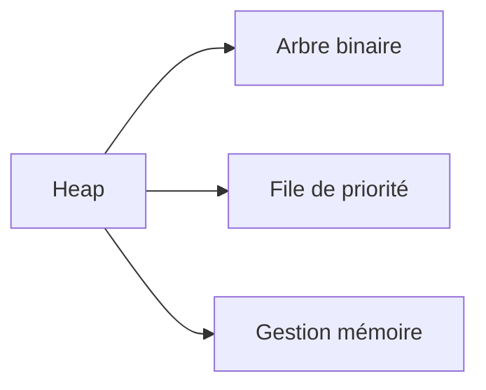

:::

:::note Hexadécimal

> Système de numération en base 16 utilisant les chiffres 0-9 et les lettres A-F

Utilisé pour représenter les adresses mémoire, codes couleur et données binaires

-   **Notation :** 0x prefix (0xFF), # prefix (#FF0000)

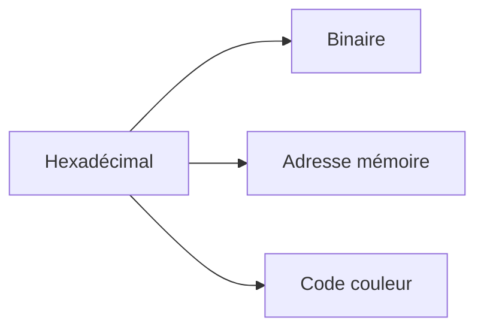

:::

## **I**

:::note IDE

> Environnement de développement intégré combinant éditeur de code, débogueur, compilateur et autres outils

Utilisé pour augmenter la productivité des développeurs

-   **Acronyme :** Integrated Development Environment
-   **Exemples :** VS Code, IntelliJ, Eclipse

```mermaid
graph LR
    A[IDE] --> B[Éditeur]
    A --> C[Débogueur]
    A --> D[Productivité]
```

:::

:::note Interprétation

> Exécution directe du code source ligne par ligne sans compilation préalable

Utilisé dans les langages de script comme Python, JavaScript, Ruby

-   **Antonyme :** Compilation
-   **Avantages :** flexibilité, développement rapide

```mermaid
graph LR
    A[Interprétation] --> B[Code source]
    A --> C[Exécution directe]
    A --> D[Compilation]
```

:::

## **J**

:::note JIT

> Technique de compilation à la volée pendant l'exécution du programme pour optimiser les performances

Utilisé dans les machines virtuelles comme JVM, .NET CLR

-   **Acronyme :** Just-In-Time compilation
-   **Avantage :** optimisations runtime spécifiques

```mermaid
graph LR
    A[JIT] --> B[Machine virtuelle]
    A --> C[Optimisation]
    A --> D[Performance]
```

:::

## **L**

:::note Langage de programmation

> Syntaxe formelle permettant d'écrire des instructions compréhensibles par un ordinateur

Utilisé pour créer des logiciels, applications et systèmes

-   **Types :** compilés, interprétés, hybrides
-   **Paradigmes :** impératif, orienté objet, fonctionnel

```mermaid
graph LR
    A[Langage de programmation] --> B[Paradigme]
    A --> C[Syntaxe]
    A --> D[Programme]
```

:::

:::note Liste chaînée

> Structure de données linéaire où chaque élément contient des données et un pointeur vers l'élément suivant

Utilisé pour l'implémentation de structures dynamiques et algorithmes

-   **Types :** simple, double, circulaire
-   **Avantages :** insertion/suppression efficaces

```mermaid
graph LR
    A[Liste chaînée] --> B[Pointeur]
    A --> C[Nœud]
    A --> D[Structure dynamique]
```

:::

## **M**

:::note Mémoire virtuelle

> Technique permettant d'utiliser l'espace disque comme extension de la mémoire physique

Utilisé par les systèmes d'exploitation pour gérer la mémoire efficacement

-   **Mécanismes :** pagination, segmentation, swap
-   **Avantages :** isolation des processus, gestion transparente

```mermaid
graph LR
    A[Mémoire virtuelle] --> B[Pagination]
    A --> C[Mémoire physique]
    A --> D[Système d'exploitation]
```

:::

## **O**

:::note Objet

> Instance d'une classe en programmation orientée objet, combinant données et méthodes

Utilisé pour modéliser des entités du monde réel dans le code

-   **Concepts liés :** encapsulation, héritage, polymorphisme
-   **Langages :** Java, C++, Python, C#

```mermaid
graph LR
    A[Objet] --> B[Classe]
    A --> C[Encapsulation]
    A --> D[POO]
```

:::

## **P**

:::note Pile

> Structure de données LIFO où les éléments sont ajoutés et retirés par le même bout

Utilisé pour la gestion des appels de fonctions, expressions arithmétiques

-   **Acronyme :** LIFO (Last In, First Out)
-   **Operations :** push, pop, top/peek

```mermaid
graph LR
    A[Pile] --> B[LIFO]
    A --> C[Appel de fonction]
    A --> D[File]
```

:::

:::note Pointeur

> Variable contenant l'adresse mémoire d'une autre variable ou structure de données

Utilisé dans les langages de bas niveau pour la gestion directe de la mémoire

-   **Langages :** C, C++, Assembly
-   **Risques :** segmentation fault, memory leak

```mermaid
graph LR
    A[Pointeur] --> B[Adresse mémoire]
    A --> C[Référence]
    A --> D[Gestion mémoire]
```

:::

:::note Polymorphisme

> Capacité d'un objet à prendre plusieurs formes selon le contexte d'utilisation

Utilisé en programmation orientée objet pour la flexibilité du code

-   **Types :** polymorphisme de sous-type, paramétrique, ad-hoc
-   **Mécanismes :** surcharge, redéfinition, interfaces

```mermaid
graph LR
    A[Polymorphisme] --> B[Héritage]
    A --> C[Interface]
    A --> D[POO]
```

:::

## **R**

:::note Récursivité

> Technique de programmation où une fonction s'appelle elle-même pour résoudre un problème

Utilisé pour résoudre des problèmes décomposables en sous-problèmes similaires

-   **Éléments :** cas de base, cas récursif
-   **Exemples :** factorielle, Fibonacci, parcours d'arbres

```mermaid
graph LR
    A[Récursivité] --> B[Fonction]
    A --> C[Cas de base]
    A --> D[Appel récursif]
```

:::

:::note Refactoring

> Processus de restructuration du code existant sans modifier son comportement externe

Utilisé pour améliorer la lisibilité, maintenabilité et performance du code

-   **Techniques :** extraction de méthode, renommage, simplification
-   **Outils :** IDE automatisés, analyseurs de code

```mermaid
graph LR
    A[Refactoring] --> B[Code legacy]
    A --> C[Maintenabilité]
    A --> D[Qualité logicielle]
```

:::

## **S**

:::note Structure de données

> Organisation logique et systématique des données en mémoire pour faciliter leur manipulation

Utilisé pour optimiser les opérations et l'utilisation de la mémoire

-   **Types :** linéaires (tableaux, listes), non-linéaires (arbres, graphes)
-   **Critères :** complexité temporelle/spatiale, cas d'usage

```mermaid
graph LR
    A[Structure de données] --> B[Algorithme]
    A --> C[Complexité]
    A --> D[Mémoire]
```

:::

## **T**

:::note Table de hachage

> Structure de données associant des clés à des valeurs via une fonction de hachage pour un accès rapide

Utilisé pour l'implémentation de dictionnaires, caches et index

-   **Synonymes :** hash table, hash map, dictionnaire
-   **Gestion des collisions :** chaînage, adressage ouvert

```mermaid
graph LR
    A[Table de hachage] --> B[Fonction de hachage]
    A --> C[Clé-valeur]
    A --> D[Collision]
```

:::

:::note TDD

> Méthodologie de développement où les tests unitaires sont écrits avant le code de production

Utilisé pour améliorer la qualité du code et la couverture de tests

-   **Acronyme :** Test-Driven Development
-   **Cycle :** Red-Green-Refactor

```mermaid
graph LR
    A[TDD] --> B[Test unitaire]
    A --> C[Code de production]
    A --> D[Refactoring]
```

:::

## **U**

:::note UTF-8

> Standard d'encodage Unicode utilisant 1 à 4 octets par caractère, compatible ASCII

Utilisé pour représenter tous les caractères Unicode dans les applications modernes

-   **Acronyme :** Unicode Transformation Format 8-bit
-   **Avantages :** compatibilité ASCII, efficacité, universalité

```mermaid
graph LR
    A[UTF-8] --> B[Unicode]
    A --> C[ASCII]
    A --> D[Encodage]
```

:::

## **V**

:::note Variable

> Espace mémoire nommé capable de stocker une valeur qui peut être modifiée pendant l'exécution

Utilisé dans tous les langages de programmation pour manipuler les données

-   **Types :** locale, globale, statique, dynamique
-   **Propriétés :** type, portée, durée de vie

```mermaid
graph LR
    A[Variable] --> B[Mémoire]
    A --> C[Type de données]
    A --> D[Portée]
```

:::

:::note Version control

> Système de suivi et de gestion des modifications apportées aux fichiers au fil du temps

Utilisé dans le développement logiciel pour la collaboration et l'historique

-   **Synonyme :** contrôle de version, SCM (Source Code Management)
-   **Systèmes :** Git, SVN, Mercurial

```mermaid
graph LR
    A[Version control] --> B[Git]
    A --> C[Collaboration]
    A --> D[Historique]
```

:::

---

_Glossaire Bases Fondamentales v2025.1_
