# Glossaire - Cloud Computing

> Plateformes cloud, conteneurisation et architectures natives - AWS, Azure, Kubernetes, serverless

:::info 30 termes disponible pour la partie Cloud
:::

:::warning A REVOIR
:::

---

## A

:::note Auto Scaling

> Ajustement automatique des ressources cloud en fonction de la demande en temps réel

Utilisé pour optimiser les coûts et maintenir la performance lors de pics de charge
Métriques : CPU, mémoire, requêtes par seconde, custom metrics
Types : horizontal (ajout d'instances), vertical (augmentation ressources)

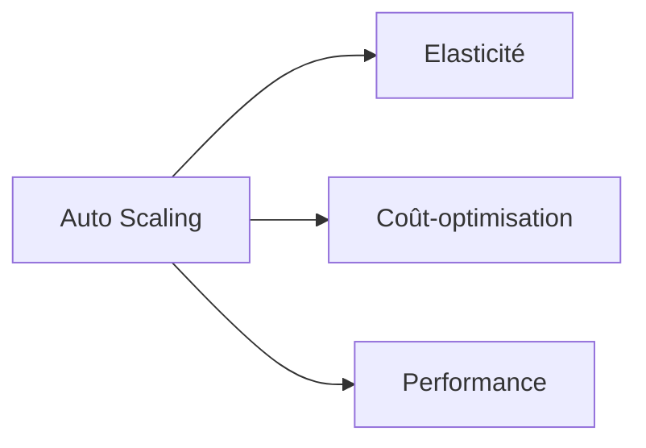

:::

:::note AWS

> Plateforme de services cloud Amazon offrant infrastructure, plateforme et logiciels

Utilisé pour héberger, développer et déployer des applications dans le cloud
Acronyme : Amazon Web Services
Services phares : EC2, S3, RDS, Lambda, VPC

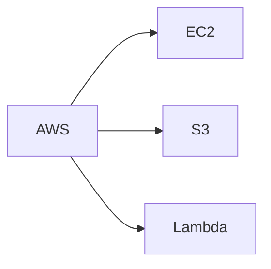

:::

:::note Azure

> Plateforme cloud Microsoft fournissant services IaaS, PaaS et SaaS

Utilisé pour l'intégration avec l'écosystème Microsoft et applications enterprise
Services : Virtual Machines, Storage, App Service, Functions
Integration : Active Directory, Office 365, Windows Server

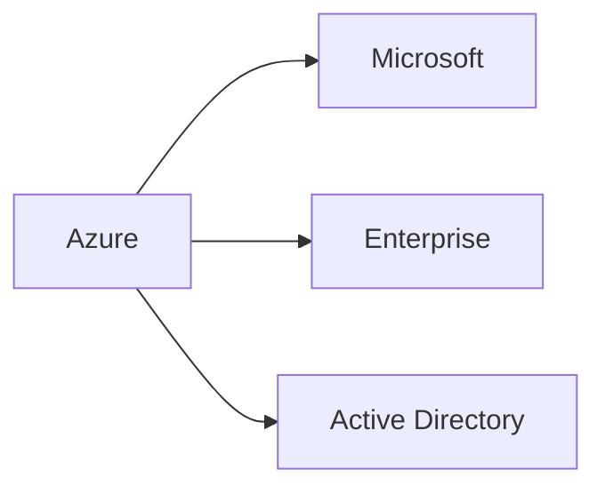

:::

## C

:::note Container

> Unité de déploiement légère incluant application et toutes ses dépendances

Utilisé pour standardiser les environnements et simplifier le déploiement
Avantages : portabilité, isolation, efficacité ressources
Technologies : Docker, containerd, CRI-O

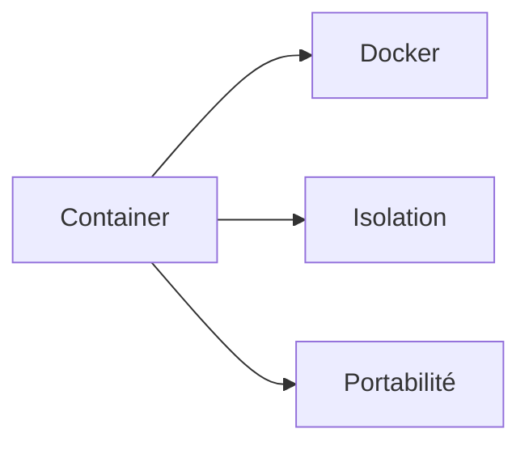

:::

:::note CloudFormation

> Service AWS d'infrastructure as code utilisant des templates JSON/YAML

Utilisé pour provisionner et gérer l'infrastructure AWS de manière déclarative
Concepts : stacks, templates, resources, parameters
Avantages : reproducibilité, versioning, rollback

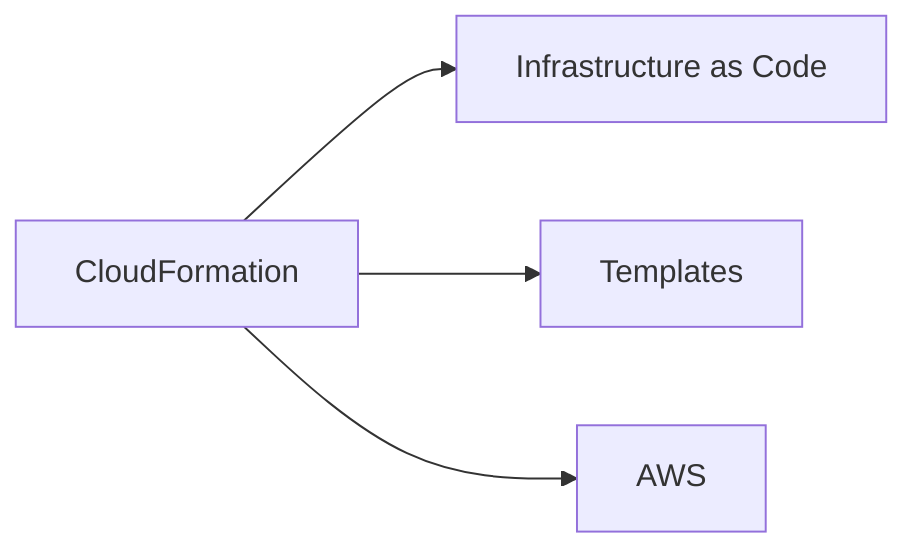

:::

## D

:::note Docker

> Plateforme de conteneurisation permettant d'empaqueter applications et dépendances

Utilisé pour créer des environnements cohérents du développement à la production
Composants : Docker Engine, images, containers, registries
Commandes : docker build, run, push, pull

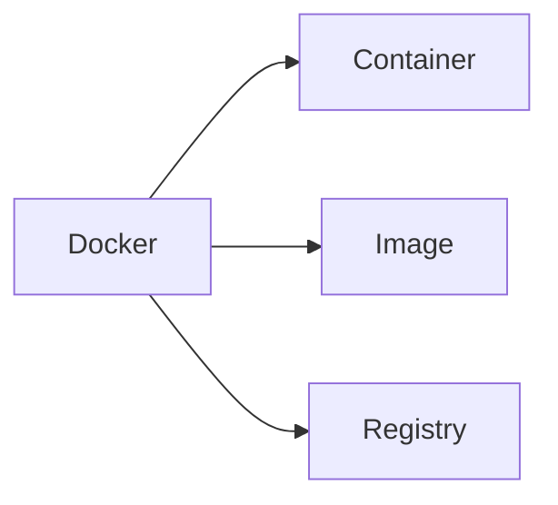

:::

:::note Dockerfile

> Script contenant les instructions pour construire une image Docker

Utilisé pour automatiser la création d'images reproductibles
Instructions : FROM, RUN, COPY, EXPOSE, CMD
Bonnes pratiques : multi-stage builds, layers optimization

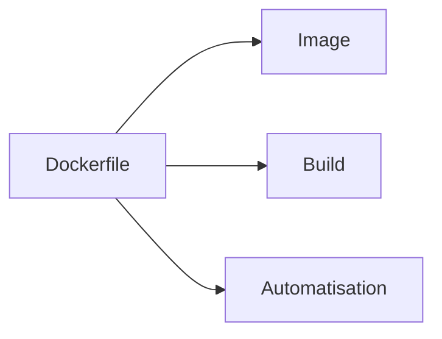

:::

## E

:::note EC2

> Service de machines virtuelles cloud d'Amazon Web Services

Utilisé pour exécuter des applications dans des instances virtuelles redimensionnables
Acronyme : Elastic Compute Cloud
Types : general purpose, compute optimized, memory optimized, storage optimized

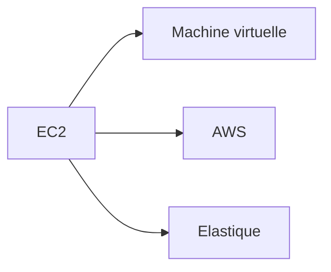

:::

:::note ECS

> Service de conteneurs managé d'AWS pour déployer et gérer des applications

Utilisé pour orchestrer des containers Docker sans gérer l'infrastructure sous-jacente
Acronyme : Elastic Container Service
Modes : EC2 (vous gérez), Fargate (fully managed)

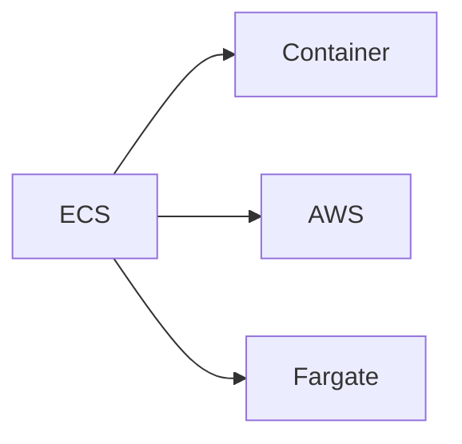

:::

:::note EKS

> Service Kubernetes managé d'AWS simplifiant le déploiement et la gestion

Utilisé pour exécuter Kubernetes sans complexité de gestion du control plane
Acronyme : Elastic Kubernetes Service
Intégrations : IAM, VPC, ELB, CloudWatch

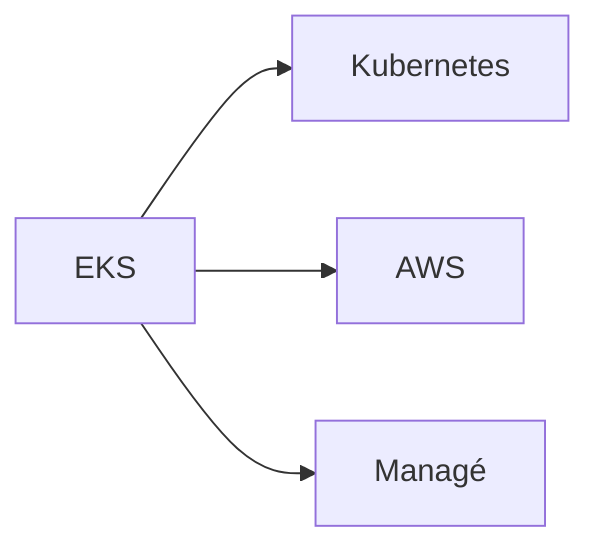

:::

## F

:::note FaaS

> Modèle d'exécution cloud où le code s'exécute en réponse à des événements

Utilisé pour créer des applications event-driven sans gestion de serveurs
Acronyme : Function as a Service
Exemples : AWS Lambda, Azure Functions, Google Cloud Functions

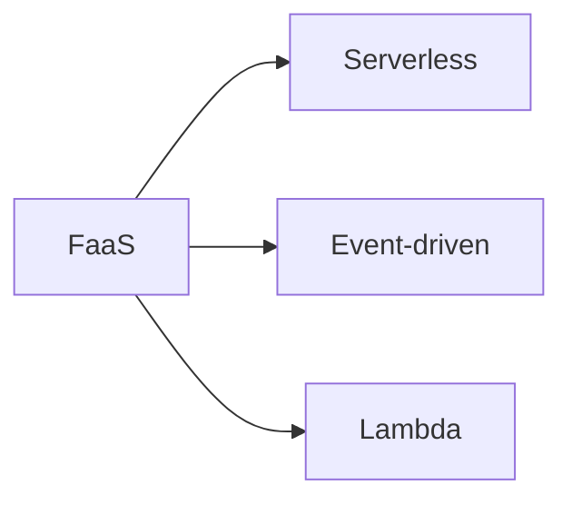

:::

:::note Fault tolerance

> Capacité d'un système à continuer de fonctionner malgré les pannes

Utilisé pour assurer la haute disponibilité des applications critiques
Techniques : redondance, failover, circuit breakers
Design : multi-AZ, multi-region, backup strategies

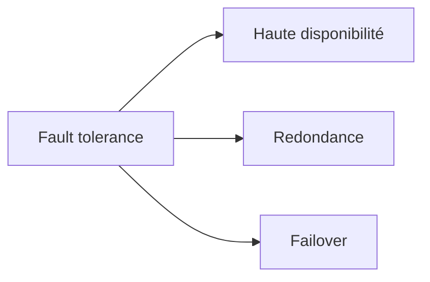

:::

## G

:::note GCP

> Plateforme de services cloud de Google axée sur l'analytique et l'IA

Utilisé pour les applications nécessitant machine learning et big data
Acronyme : Google Cloud Platform
Services : Compute Engine, BigQuery, AI Platform, Kubernetes Engine

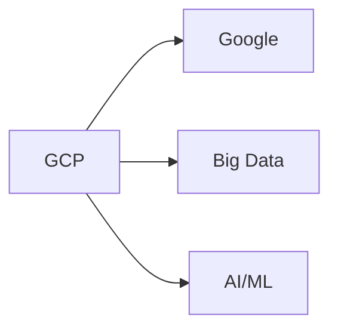

:::

## H

:::note Helm

> Gestionnaire de paquets pour Kubernetes facilitant le déploiement d'applications

Utilisé pour packager, configurer et déployer des applications Kubernetes complexes
Concepts : charts, releases, repositories, templates
Avantages : réutilisabilité, versioning, rollback

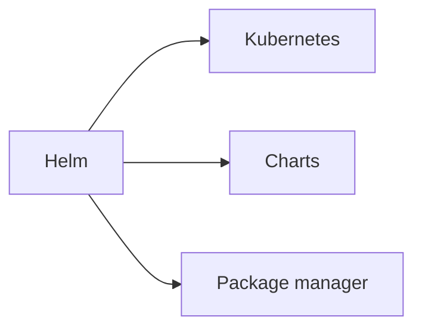

:::

:::note Horizontal scaling

> Ajout de ressources en parallèle pour gérer l'augmentation de charge

Utilisé pour distribuer la charge sur plusieurs instances identiques
Synonyme : scale out
Avantages : élasticité, tolérance aux pannes, coût-efficacité

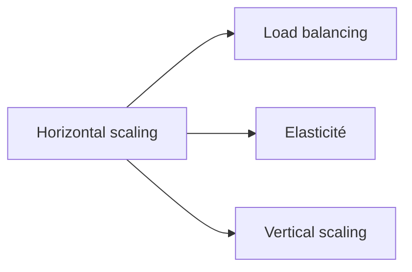

:::

## I

:::note IaaS

> Modèle cloud fournissant une infrastructure virtualisée à la demande

Utilisé pour migrer des workloads existants vers le cloud avec contrôle maximal
Acronyme : Infrastructure as a Service
Composants : compute, storage, networking, virtualization

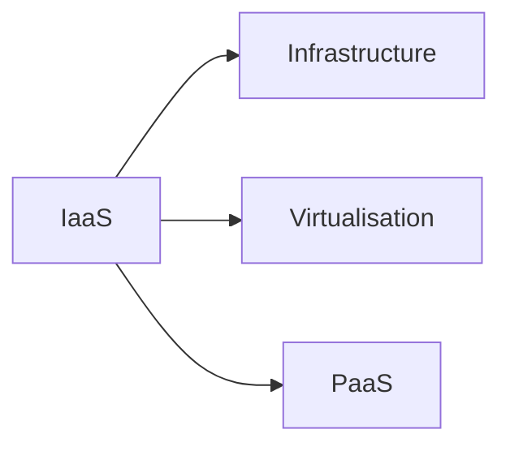

:::

:::note IAM

> Système de gestion des identités et des accès aux ressources cloud

Utilisé pour contrôler qui peut accéder à quoi dans l'environnement cloud
Acronyme : Identity and Access Management
Concepts : users, groups, roles, policies, permissions

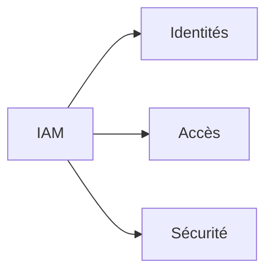

:::

## K

:::note Kubernetes

> Plateforme d'orchestration de conteneurs automatisant le déploiement et la gestion

Utilisé pour gérer des applications conteneurisées à grande échelle
Composants : master nodes, worker nodes, pods, services
Concepts : deployments, ingress, configmaps, secrets

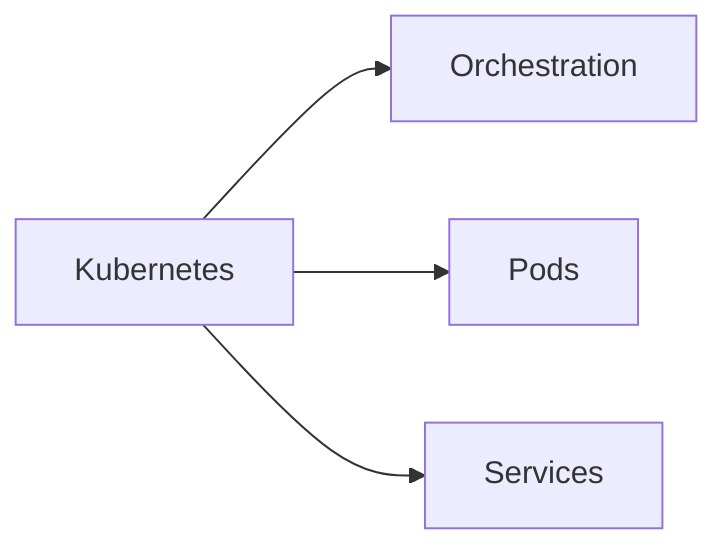

:::

:::note kubectl

> Outil en ligne de commande pour interagir avec les clusters Kubernetes

Utilisé pour déployer, inspecter et gérer les ressources Kubernetes
Commandes : get, create, apply, delete, describe
Configuration : kubeconfig, contexts, namespaces

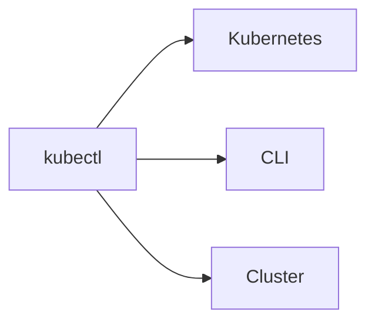

:::

## L

:::note Lambda

> Service de calcul serverless d'AWS exécutant du code en réponse à des événements

Utilisé pour créer des applications event-driven sans gestion de serveurs
Déclencheurs : API Gateway, S3, DynamoDB, CloudWatch
Langages : Python, Node.js, Java, C#, Go, Ruby

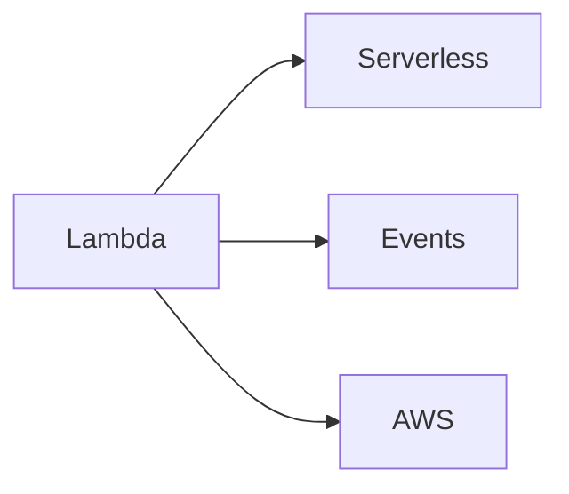

:::

:::note Load Balancer

> Service distribuant le trafic entrant sur plusieurs instances pour optimiser les performances

Utilisé pour améliorer la disponibilité et répartir la charge de travail
Types : Application (L7), Network (L4), Classic (L4/L7)
Algorithmes : round robin, least connections, weighted

```mermaid
graph LR
    A[Load Balancer] --> B[Distribution]
    A --> C[Haute disponibilité]
    A --> D[Performance]
```

:::

## M

:::note Microservices

> Architecture décomposant une application en services indépendants et communicants

Utilisé pour améliorer la scalabilité, maintenabilité et déploiement indépendant
Avantages : technologie diversity, team autonomy, fault isolation
Défis : distributed systems complexity, network latency, data consistency

```mermaid
graph LR
    A[Microservices] --> B[Indépendance]
    A --> C[Scalabilité]
    A --> D[API Gateway]
```

:::

:::note Multi-cloud

> Stratégie utilisant plusieurs fournisseurs cloud pour éviter le vendor lock-in

Utilisé pour diversifier les risques et optimiser les coûts selon les services
Avantages : négociation prix, best-of-breed, redondance
Défis : complexité gestion, intégration, compétences

```mermaid
graph LR
    A[Multi-cloud] --> B[Diversification]
    A --> C[Vendor lock-in]
    A --> D[Optimisation]
```

:::

## P

:::note PaaS

> Plateforme cloud fournissant un environnement de développement et déploiement complet

Utilisé pour développer et déployer des applications sans gérer l'infrastructure
Acronyme : Platform as a Service
Exemples : Heroku, App Engine, Azure App Service

```mermaid
graph LR
    A[PaaS] --> B[Développement]
    A --> C[Déploiement]
    A --> D[IaaS]
```

:::

:::note Pod

> Plus petite unité déployable dans Kubernetes contenant un ou plusieurs conteneurs

Utilisé comme wrapper pour les conteneurs partageant stockage et réseau
Caractéristiques : éphémère, IP unique, volumes partagés
Patterns : sidecar, ambassador, adapter

```mermaid
graph LR
    A[Pod] --> B[Container]
    A --> C[Kubernetes]
    A --> D[Éphémère]
```

:::

## S

:::note S3

> Service de stockage objet d'AWS offrant durabilité et scalabilité infinies

Utilisé pour stocker et récupérer n'importe quelle quantité de données
Acronyme : Simple Storage Service
Classes : Standard, IA, Glacier, Deep Archive

```mermaid
graph LR
    A[S3] --> B[Stockage objet]
    A --> C[Durabilité]
    A --> D[AWS]
```

:::

:::note SaaS

> Modèle cloud où le logiciel est accessible via Internet en tant que service

Utilisé pour consommer des applications sans installation ni maintenance
Acronyme : Software as a Service
Exemples : Salesforce, Office 365, Google Workspace

```mermaid
graph LR
    A[SaaS] --> B[Application]
    A --> C[Internet]
    A --> D[Abonnement]
```

:::

:::note Serverless

> Modèle d'exécution où l'infrastructure est entièrement gérée par le fournisseur cloud

Utilisé pour se concentrer sur le code métier sans préoccupations d'infrastructure
Avantages : scalabilité automatique, pay-per-use, pas de gestion serveur
Services : Functions, API Gateway, managed databases

```mermaid
graph LR
    A[Serverless] --> B[FaaS]
    A --> C[Managed services]
    A --> D[Pay-per-use]
```

:::

## T

:::note Terraform

> Outil d'infrastructure as code permettant de provisionner des ressources cloud

Utilisé pour gérer l'infrastructure de manière déclarative et reproductible
Concepts : providers, resources, variables, outputs, state
Avantages : multi-cloud, plan/apply workflow, state management

```mermaid
graph LR
    A[Terraform] --> B[Infrastructure as Code]
    A --> C[Multi-cloud]
    A --> D[State]
```

:::

## V

:::note VPC

> Réseau virtuel privé isolé dans le cloud pour vos ressources

Utilisé pour créer un environnement réseau sécurisé et contrôlé
Acronyme : Virtual Private Cloud
Composants : subnets, route tables, security groups, NACLs

```mermaid
graph LR
    A[VPC] --> B[Réseau privé]
    A --> C[Isolation]
    A --> D[Sécurité]
```

:::

:::note Vertical scaling

> Augmentation des ressources d'une machine existante pour gérer plus de charge

Utilisé quand l'application ne peut pas être distribuée horizontalement
Synonyme : scale up
Limitations : hardware limits, single point of failure, coût

```mermaid
graph LR
    A[Vertical scaling] --> B[Ressources]
    A --> C[Scale up]
    A --> D[Horizontal scaling]
```

:::

---

_Glossaire Cloud Computing v2024.1_
