# Glossaire - Cybersécurité

> Sécurité défensive, offensive et gouvernance - Cryptographie, détection, réponse aux incidents

:::info 42 termes disponible pour la partie Cloud
:::

:::warning A REVOIR
:::

---

## A

:::note AES

> Standard de chiffrement symétrique adopté par le gouvernement américain pour protéger les données

Utilisé pour le chiffrement de données sensibles et communications sécurisées
Acronyme : Advanced Encryption Standard
Tailles de clés : 128, 192, 256 bits
Remplace : DES, 3DES

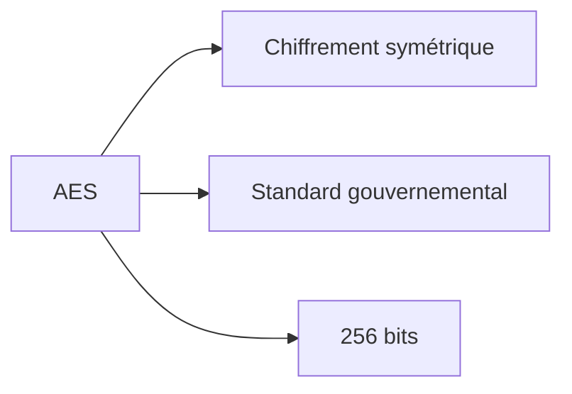

:::

:::note APT

> Cyberattaque sophistiquée et persistante menée par des acteurs étatiques ou criminels organisés

Utilisé pour décrire des campagnes d'attaque longues et ciblées
Acronyme : Advanced Persistent Threat
Caractéristiques : persistance, sophistication, ciblage spécifique
Exemples : APT1, Lazarus Group, Cozy Bear

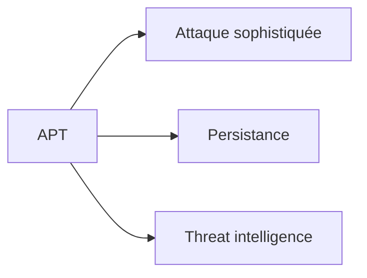

:::

:::note Antivirus

> Logiciel de protection détectant et supprimant les programmes malveillants

Utilisé pour la protection en temps réel des endpoints contre les malwares
Méthodes : signatures, heuristique, analyse comportementale
Évolution : antivirus → EDR → XDR

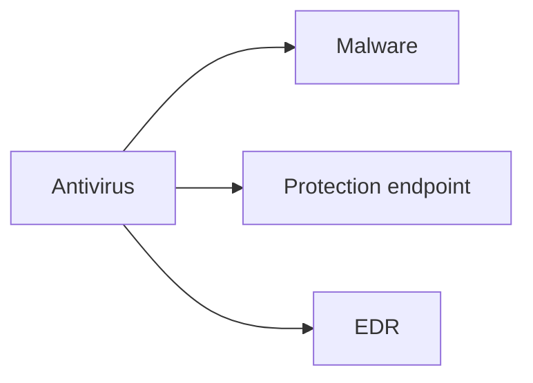

:::

## B

:::note Backdoor

> Accès secret et non autorisé installé dans un système pour contourner les contrôles de sécurité

Utilisé par les attaquants pour maintenir un accès persistant aux systèmes compromis
Types : hardware, software, protocol backdoors
Détection : monitoring réseau, analyse de code, forensics

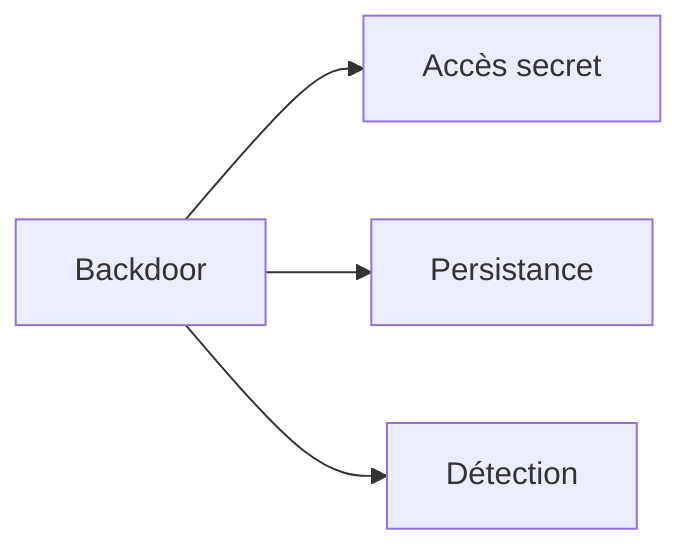

:::

:::note Blue Team

> Équipe défensive responsable de la protection et de la détection des cyberattaques

Utilisé dans les exercices de sécurité et opérations de cyberdéfense quotidiennes
Rôles : monitoring, détection, réponse aux incidents, hardening
Outils : SIEM, EDR, IDS/IPS, threat intelligence

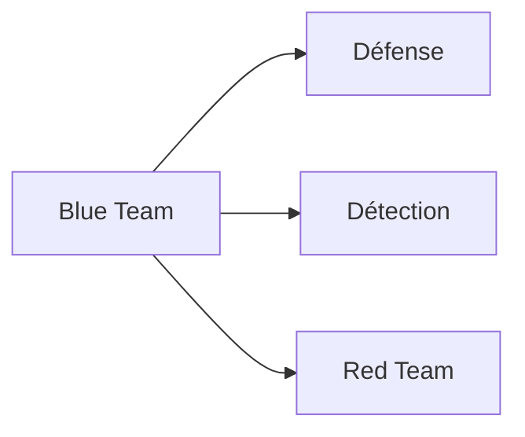

:::

:::note Botnet

> Réseau d'ordinateurs infectés contrôlés à distance par des cybercriminels

Utilisé pour mener des attaques DDoS, spam, cryptomining et vol de données
Composants : bot master, command & control (C&C), bots (zombies)
Exemples : Mirai, Zeus, Conficker

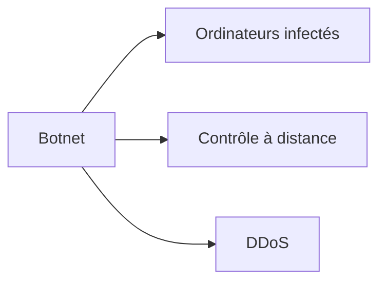

:::

## C

:::note CA

> Entité de confiance émettant et gérant des certificats numériques

Utilisé pour établir l'authenticité et l'intégrité des communications numériques
Acronyme : Certificate Authority
Fonctions : émission, révocation, validation des certificats
Exemples : Let's Encrypt, DigiCert, Verisign

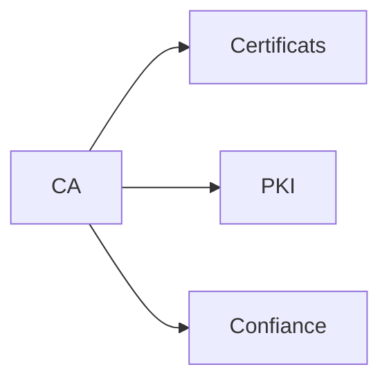

:::

:::note CERT

> Organisation dédiée à la réponse aux incidents de sécurité informatique

Utilisé pour coordonner la réponse aux cybermenaces et partager les renseignements
Acronyme : Computer Emergency Response Team
Activités : incident response, vulnerability research, threat intelligence
Exemples : US-CERT, CERT-FR, sectoriels

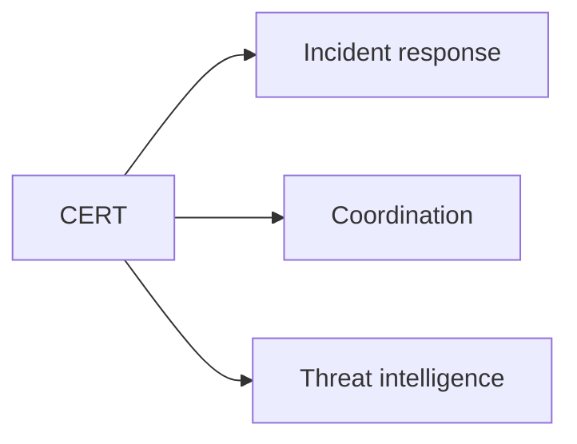

:::

:::note CVE

> Base de données publique des vulnérabilités de sécurité informatique connues

Utilisé pour identifier et référencer les failles de sécurité de manière standardisée
Acronyme : Common Vulnerabilities and Exposures
Format : CVE-YYYY-NNNN (année-numéro)
Gestion : MITRE Corporation

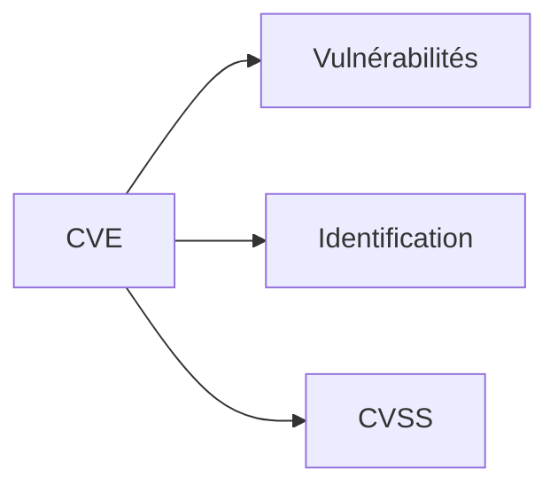

:::

:::note CVSS

> Système standardisé de notation de la gravité des vulnérabilités de sécurité

Utilisé pour prioriser les correctifs et évaluer les risques de sécurité
Acronyme : Common Vulnerability Scoring System
Score : 0.0 à 10.0 (None, Low, Medium, High, Critical)
Métriques : base, temporal, environmental

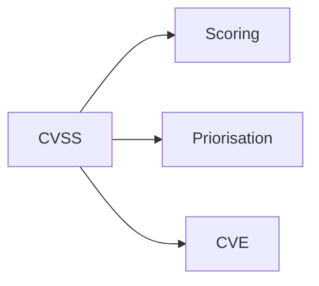

:::

## D

:::note DDoS

> Attaque visant à rendre un service indisponible en le surchargeant de requêtes

Utilisé pour perturber les services en ligne et extorquer les organisations
Acronyme : Distributed Denial of Service
Types : volumétrique, protocol, application layer
Protection : CDN, load balancing, rate limiting

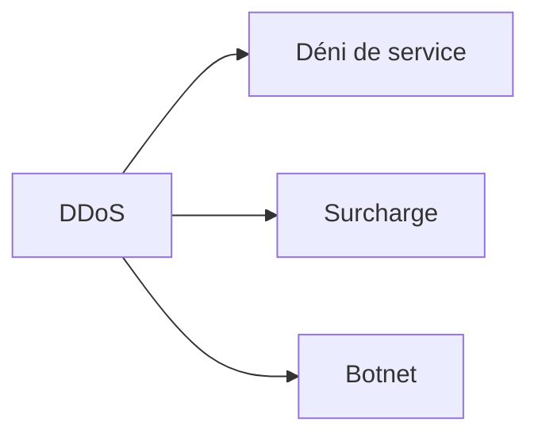

:::

:::note DLP

> Technologie empêchant la fuite de données sensibles hors de l'organisation

Utilisé pour protéger la propriété intellectuelle et respecter les réglementations
Acronyme : Data Loss Prevention
Approches : endpoint, network, storage DLP
Méthodes : pattern matching, machine learning, classification

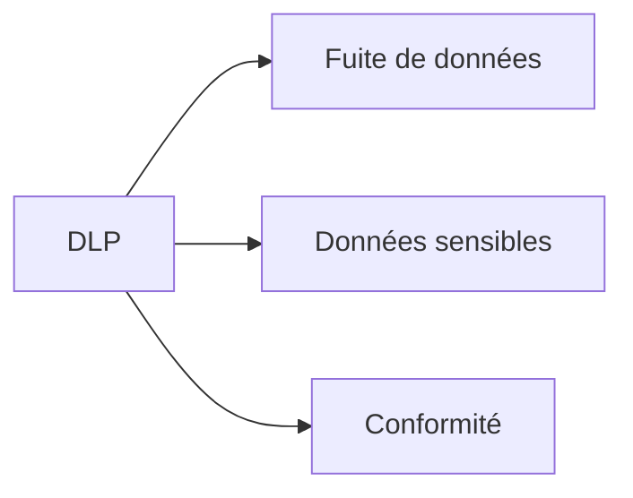

:::

## E

:::note EDR

> Solution de sécurité surveillant et analysant les activités des endpoints

Utilisé pour détecter, investiguer et répondre aux menaces avancées
Acronyme : Endpoint Detection and Response
Capacités : monitoring continu, threat hunting, forensics, response
Évolution : antivirus → EPP → EDR → XDR

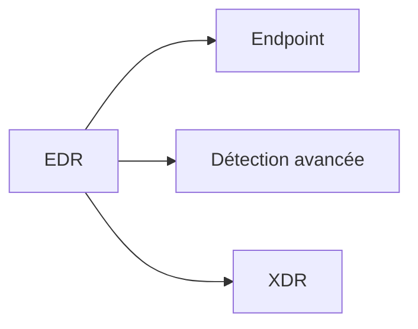

:::

:::note Encryption

> Processus de transformation des données en format illisible pour protéger la confidentialité

Utilisé pour sécuriser les données en transit et au repos
Types : symétrique, asymétrique, hash functions
Standards : AES, RSA, ECC, SHA

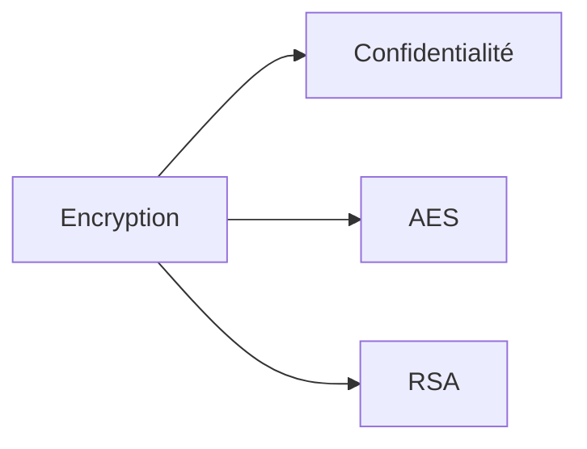

:::

## F

:::note Firewall

> Système de sécurité réseau filtrant le trafic selon des règles prédéfinies

Utilisé pour contrôler les communications entre réseaux de confiance différents
Types : packet filtering, stateful, application layer, NGFW
Déploiement : network, host-based, cloud firewalls

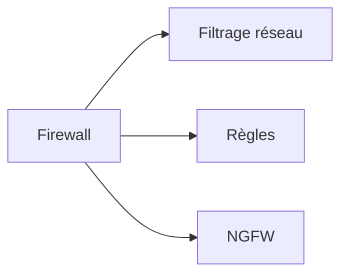

:::

:::note Forensics

> Investigation numérique pour analyser les preuves d'incidents de sécurité

Utilisé pour comprendre les attaques, identifier les responsables et récolter des preuves
Phases : préservation, acquisition, analyse, présentation
Outils : EnCase, FTK, Volatility, Autopsy

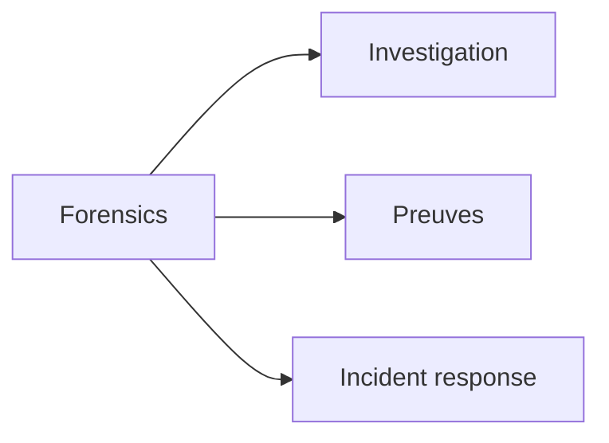

:::

## H

:::note Hash

> Fonction cryptographique produisant une empreinte unique et de taille fixe

Utilisé pour vérifier l'intégrité des données et stocker les mots de passe
Algorithmes : SHA-256, SHA-3, bcrypt, scrypt
Propriétés : déterministe, irréversible, résistant aux collisions

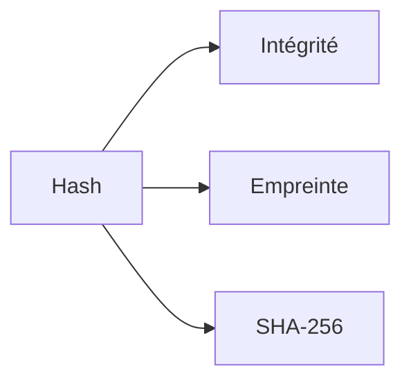

:::

:::note Honeypot

> Système leurre conçu pour attirer et détecter les attaquants

Utilisé pour collecter des renseignements sur les menaces et détourner les attaques
Types : low-interaction, high-interaction, honeynets
Objectifs : early warning, threat intelligence, forensics

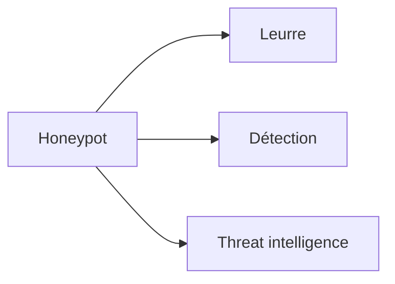

:::

## I

:::note IDS/IPS

> Systèmes de détection et prévention d'intrusions pour identifier les activités malveillantes

Utilisé pour surveiller le trafic réseau et les activités système suspectes
Acronyme : Intrusion Detection/Prevention System
Types : network-based (NIDS/NIPS), host-based (HIDS/HIPS)
Méthodes : signature-based, anomaly-based, behavioral

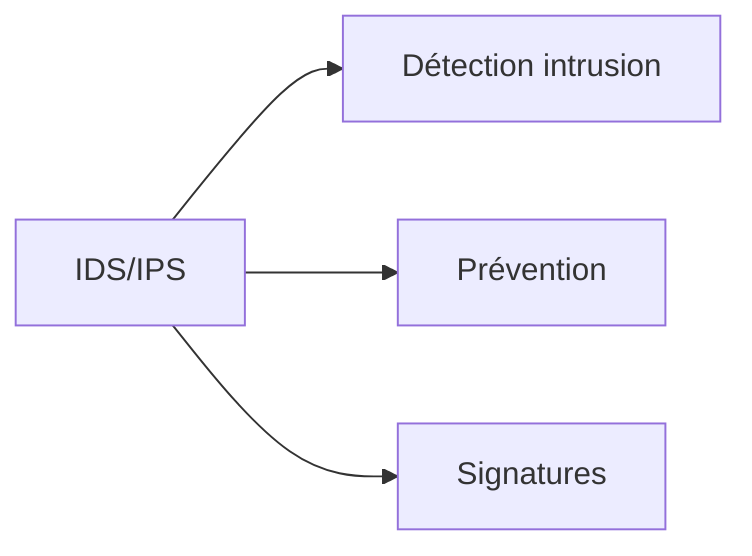

:::

:::note IOC

> Indicateurs techniques permettant d'identifier une compromission ou une menace

Utilisé pour la détection, investigation et threat hunting
Acronyme : Indicator of Compromise
Types : IP addresses, domain names, file hashes, registry keys
Formats : STIX/TAXII, OpenIOC, YARA rules

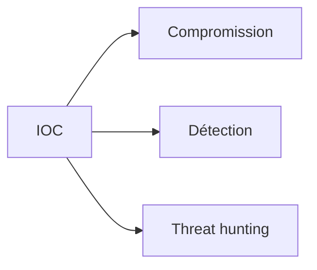

:::

## K

:::note Keylogger

> Logiciel ou matériel enregistrant secrètement les frappes clavier

Utilisé par les attaquants pour voler des mots de passe et informations sensibles
Types : software, hardware, acoustic, optical
Protection : virtual keyboards, anti-keylogger software, 2FA

```mermaid
graph LR
    A[Keylogger] --> B[Frappes clavier]
    A --> C[Vol de données]
    A --> D[Malware]
```

:::

## M

:::note Malware

> Logiciel malveillant conçu pour endommager, perturber ou accéder illégalement aux systèmes

Utilisé par les cybercriminels pour diverses activités malveillantes
Types : virus, worms, trojans, ransomware, spyware, adware
Vecteurs : email, web, USB, network, supply chain

```mermaid
graph LR
    A[Malware] --> B[Logiciel malveillant]
    A --> C[Ransomware]
    A --> D[Antivirus]
```

:::

:::note MFA

> Méthode d'authentification nécessitant plusieurs facteurs de vérification

Utilisé pour renforcer la sécurité des accès aux systèmes critiques
Acronyme : Multi-Factor Authentication
Facteurs : something you know/have/are (knowledge/possession/inherence)
Méthodes : SMS, TOTP, hardware tokens, biometrics

```mermaid
graph LR
    A[MFA] --> B[Authentification]
    A --> C[Facteurs multiples]
    A --> D[Sécurité renforcée]
```

:::

:::note MITRE ATT&CK

> Framework décrivant les tactiques, techniques et procédures des cyberattaquants

Utilisé pour comprendre les menaces et améliorer les défenses
Matrices : Enterprise, Mobile, ICS
Utilisation : threat modeling, gap analysis, SOC maturity

```mermaid
graph LR
    A[MITRE ATT&CK] --> B[TTPs]
    A --> C[Framework]
    A --> D[Threat modeling]
```

:::

## P

:::note Penetration Testing

> Test d'intrusion autorisé simulant une cyberattaque pour identifier les vulnérabilités

Utilisé pour évaluer la sécurité des systèmes avant qu'un vrai attaquant ne le fasse
Phases : reconnaissance, scanning, exploitation, post-exploitation, reporting
Types : black box, white box, gray box

```mermaid
graph LR
    A[Penetration Testing] --> B[Test d'intrusion]
    A --> C[Vulnérabilités]
    A --> D[Red Team]
```

:::

:::note Phishing

> Technique d'ingénierie sociale utilisant des communications frauduleuses pour voler des informations

Utilisé pour obtenir des credentials, informations personnelles ou installer des malwares
Types : email phishing, spear phishing, whaling, smishing, vishing
Protection : formation utilisateurs, filtres email, 2FA

```mermaid
graph LR
    A[Phishing] --> B[Ingénierie sociale]
    A --> C[Communications frauduleuses]
    A --> D[Social engineering]
```

:::

:::note PKI

> Infrastructure de gestion des clés publiques pour sécuriser les communications numériques

Utilisé pour établir la confiance et l'authenticité dans les environnements numériques
Acronyme : Public Key Infrastructure
Composants : CA, RA, certificates, CRL, OCSP

```mermaid
graph LR
    A[PKI] --> B[Clés publiques]
    A --> C[Certificats]
    A --> D[CA]
```

:::

## R

:::note Ransomware

> Malware chiffrant les données des victimes et exigeant une rançon pour la clé de déchiffrement

Utilisé par les cybercriminels pour extorquer de l'argent aux organisations
Évolution : crypto-ransomware → double extortion → triple extortion
Protection : backups, segmentation, EDR, user training

```mermaid
graph LR
    A[Ransomware] --> B[Chiffrement]
    A --> C[Rançon]
    A --> D[Malware]
```

:::

:::note Red Team

> Équipe offensive simulant des cyberattaques pour tester les défenses

Utilisé pour évaluer la capacité de détection et de réponse aux incidents
Approche : adversarial simulation, long-term engagement
Objectifs : test blue team, improve defenses, assess risk

```mermaid
graph LR
    A[Red Team] --> B[Attaque simulée]
    A --> C[Test défenses]
    A --> D[Blue Team]
```

:::

:::note Risk Assessment

> Processus d'identification, d'analyse et d'évaluation des risques de sécurité

Utilisé pour prioriser les investissements en sécurité et prendre des décisions éclairées
Étapes : asset identification, threat identification, vulnerability assessment, risk calculation
Méthodes : qualitative, quantitative, hybrid approaches

```mermaid
graph LR
    A[Risk Assessment] --> B[Identification]
    A --> C[Évaluation]
    A --> D[Priorisation]
```

:::

## S

:::note SIEM

> Plateforme centralisant la collecte et l'analyse des événements de sécurité

Utilisé pour détecter les incidents de sécurité et faciliter la réponse
Acronyme : Security Information and Event Management
Capacités : log management, correlation, alerting, dashboards
Évolution : SIEM → SOAR → security data lake

```mermaid
graph LR
    A[SIEM] --> B[Événements sécurité]
    A --> C[Corrélation]
    A --> D[SOAR]
```

:::

:::note SOAR

> Plateforme orchestrant et automatisant les réponses aux incidents de sécurité

Utilisé pour accélérer la réponse aux incidents et standardiser les processus
Acronyme : Security Orchestration Automation Response
Capacités : workflow automation, case management, threat intelligence integration

```mermaid
graph LR
    A[SOAR] --> B[Orchestration]
    A --> C[Automatisation]
    A --> D[SIEM]
```

:::

:::note SOC

> Centre opérationnel dédié à la surveillance et à la réponse aux incidents de sécurité

Utilisé pour fournir une surveillance 24/7 et une expertise en cybersécurité
Acronyme : Security Operations Center
Niveaux : Tier 1 (monitoring), Tier 2 (investigation), Tier 3 (hunting)

```mermaid
graph LR
    A[SOC] --> B[Surveillance 24/7]
    A --> C[Incident response]
    A --> D[Threat hunting]
```

:::

:::note Social Engineering

> Manipulation psychologique visant à obtenir des informations confidentielles ou des accès

Utilisé par les attaquants pour contourner les mesures techniques de sécurité
Techniques : pretexting, baiting, quid pro quo, authority, urgency
Protection : sensibilisation, formation, procédures de vérification

```mermaid
graph LR
    A[Social Engineering] --> B[Manipulation]
    A --> C[Phishing]
    A --> D[Formation]
```

:::

## T

:::note Threat Intelligence

> Informations collectées et analysées sur les menaces actuelles et émergentes

Utilisé pour prendre des décisions de sécurité éclairées et améliorer les défenses
Types : tactical, operational, strategic, technical
Sources : open source, commercial, government, internal

```mermaid
graph LR
    A[Threat Intelligence] --> B[Menaces]
    A --> C[Décisions]
    A --> D[IOC]
```

:::

:::note TLS

> Protocole cryptographique sécurisant les communications sur les réseaux

Utilisé pour protéger les données en transit sur Internet (HTTPS, email, VPN)
Acronyme : Transport Layer Security
Versions : TLS 1.2, TLS 1.3 (deprecated: SSL, TLS 1.0, 1.1)

```mermaid
graph LR
    A[TLS] --> B[Communication sécurisée]
    A --> C[HTTPS]
    A --> D[Chiffrement]
```

:::

:::note Two-Factor Authentication

> Méthode d'authentification utilisant deux facteurs distincts pour vérifier l'identité

Utilisé pour renforcer la sécurité des comptes utilisateur
Acronyme : 2FA
Facteurs : password + SMS/app/hardware token
Évolution : 2FA → MFA → passwordless

```mermaid
graph LR
    A[2FA] --> B[Deux facteurs]
    A --> C[Sécurité comptes]
    A --> D[MFA]
```

:::

## V

:::note Vulnerability

> Faiblesse dans un système, application ou processus exploitable par un attaquant

Utilisé pour identifier et corriger les points faibles avant exploitation
Types : software bugs, misconfigurations, design flaws
Gestion : vulnerability management, patch management, risk assessment

```mermaid
graph LR
    A[Vulnerability] --> B[Faiblesse système]
    A --> C[Exploitation]
    A --> D[CVE]
```

:::

:::note VPN

> Réseau privé virtuel créant une connexion sécurisée sur un réseau public

Utilisé pour protéger les communications et l'accès distant aux ressources internes
Acronyme : Virtual Private Network
Types : site-to-site, remote access, SSL/TLS VPN, IPSec VPN

```mermaid
graph LR
    A[VPN] --> B[Réseau privé virtuel]
    A --> C[Accès distant]
    A --> D[Chiffrement]
```

:::

## W

:::note WAF

> Pare-feu applicatif protégeant les applications web contre les attaques

Utilisé pour filtrer, surveiller et bloquer le trafic HTTP/HTTPS malveillant
Acronyme : Web Application Firewall
Protection : OWASP Top 10, DDoS, bot mitigation
Déploiement : cloud, on-premise, hybrid

```mermaid
graph LR
    A[WAF] --> B[Application web]
    A --> C[Filtrage HTTP]
    A --> D[OWASP Top 10]
```

:::

## Z

:::note Zero Trust

> Modèle de sécurité ne faisant confiance à aucun utilisateur ou dispositif par défaut

Utilisé pour sécuriser les environnements cloud et les architectures distribuées
Principe : "never trust, always verify"
Composants : identity verification, device security, network segmentation

```mermaid
graph LR
    A[Zero Trust] --> B[Never trust]
    A --> C[Always verify]
    A --> D[Segmentation]
```

:::

:::note Zero-Day

> Vulnérabilité inconnue des éditeurs et non patchée, exploitée par les attaquants

Utilisé pour décrire les menaces les plus dangereuses et difficiles à détecter
Cycle : découverte → exploitation → divulgation → patch → fin de vie
Protection : behavioral analysis, sandboxing, threat intelligence

```mermaid
graph LR
    A[Zero-Day] --> B[Vulnérabilité inconnue]
    A --> C[Non patchée]
    A --> D[APT]
```

:::

---

_Glossaire Cybersécurité v2024.1_
