# Glossaire - Développement Web

> Technologies frontend, backend et architectures web modernes - HTML, CSS, JavaScript, APIs

:::info 42 termes disponible pour la partie Développement
:::

:::warning A REVOIR
:::

---

## A

:::note AJAX

> Technique permettant la communication asynchrone entre navigateur et serveur sans rechargement de page

Utilisé pour créer des applications web dynamiques et interactives
Acronyme : Asynchronous JavaScript and XML
Technologies : XMLHttpRequest, Fetch API, JSON

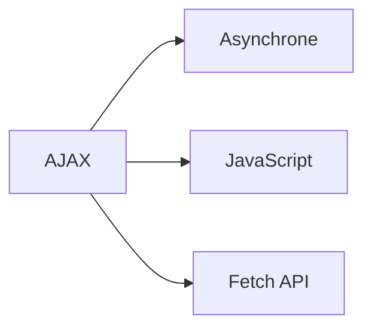

:::

:::note Angular

> Framework JavaScript développé par Google pour créer des applications web single-page

Utilisé pour développer des applications web complexes avec architecture MVC
Technologies : TypeScript, RxJS, CLI
Concepts : composants, services, directives, pipes

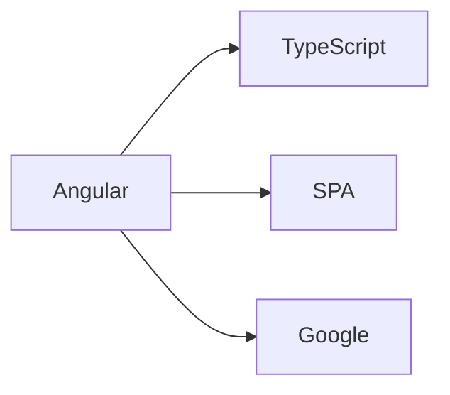

:::

:::note API Gateway

> Point d'entrée unifié gérant les requêtes vers des microservices backend

Utilisé pour centraliser l'authentification, le routage et la gestion des APIs
Fonctionnalités : rate limiting, transformation, monitoring
Services : AWS API Gateway, Kong, NGINX

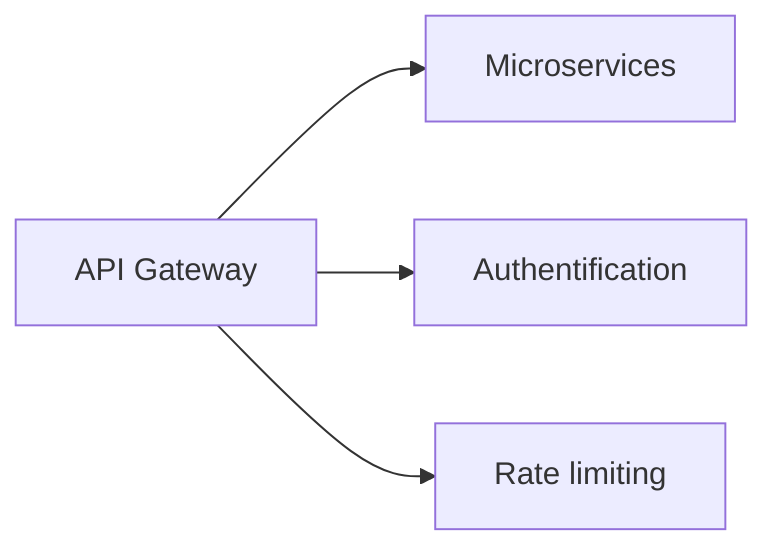

:::

## B

:::note Babel

> Transpileur JavaScript convertissant le code moderne en version compatible navigateurs

Utilisé pour utiliser les dernières fonctionnalités JS tout en gardant la compatibilité
Fonctionnalités : ES6+ vers ES5, plugins, presets
Configuration : .babelrc, babel.config.js

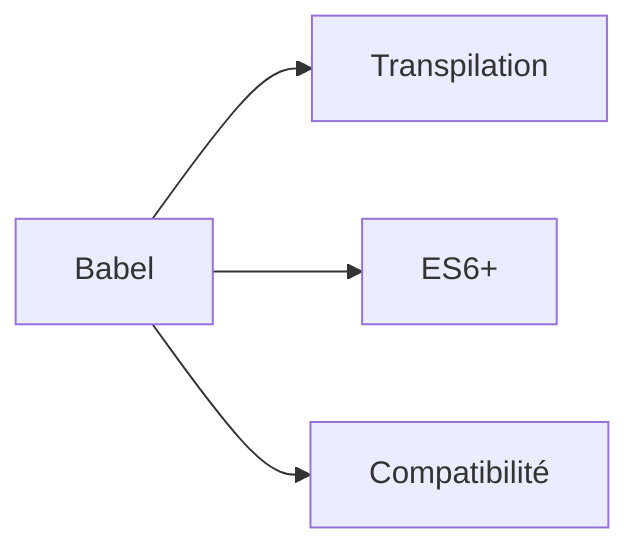

:::

:::note Bootstrap

> Framework CSS responsive fournissant des composants et une grille pré-stylés

Utilisé pour développer rapidement des interfaces web responsive
Composants : navbar, cards, modals, forms
Système : grid 12 colonnes, breakpoints responsive

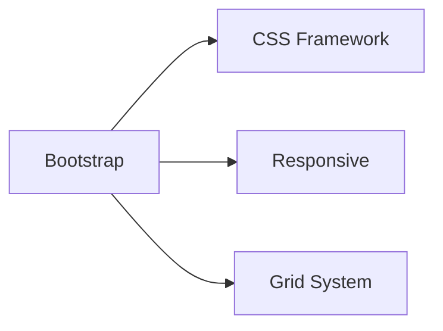

:::

## C

:::note CDN

> Réseau de serveurs géographiquement distribués pour la livraison optimisée de contenu

Utilisé pour améliorer les performances et la disponibilité des applications web
Acronyme : Content Delivery Network
Avantages : latence réduite, cache, protection DDoS

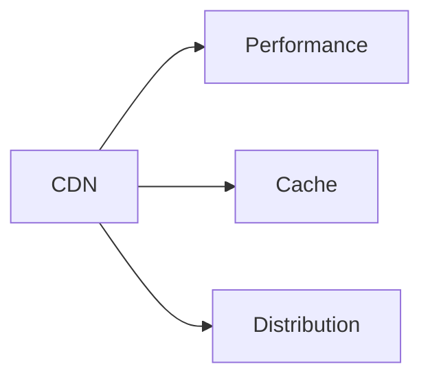

:::

:::note CORS

> Mécanisme permettant aux serveurs d'autoriser l'accès à leurs ressources depuis d'autres domaines

Utilisé pour sécuriser les requêtes cross-origin dans les applications web
Acronyme : Cross-Origin Resource Sharing
En-têtes : Access-Control-Allow-Origin, Access-Control-Allow-Methods

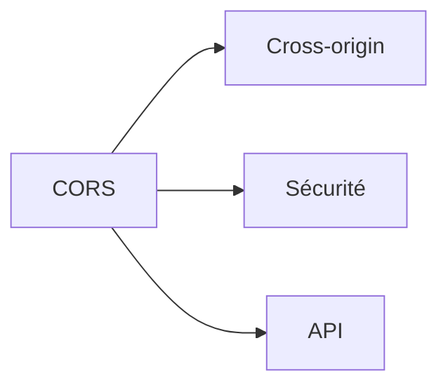

:::

:::note CSS

> Langage de feuilles de style décrivant la présentation des documents HTML

Utilisé pour styliser et mettre en forme les pages web
Acronyme : Cascading Style Sheets
Versions : CSS3, CSS Grid, Flexbox, Custom Properties

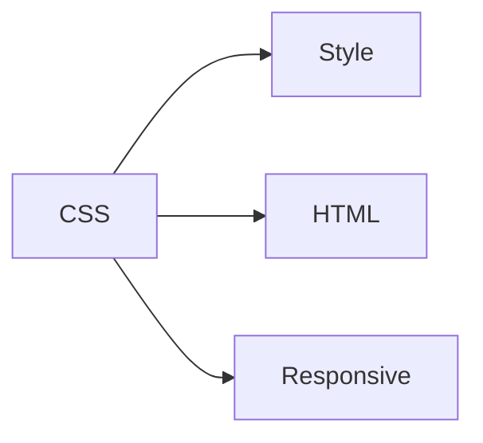

:::

:::note CSRF

> Attaque forçant un utilisateur authentifié à exécuter des actions non désirées

Utilisé comme vecteur d'attaque exploitant la confiance du serveur envers l'utilisateur
Acronyme : Cross-Site Request Forgery
Protection : tokens CSRF, SameSite cookies, vérification origine

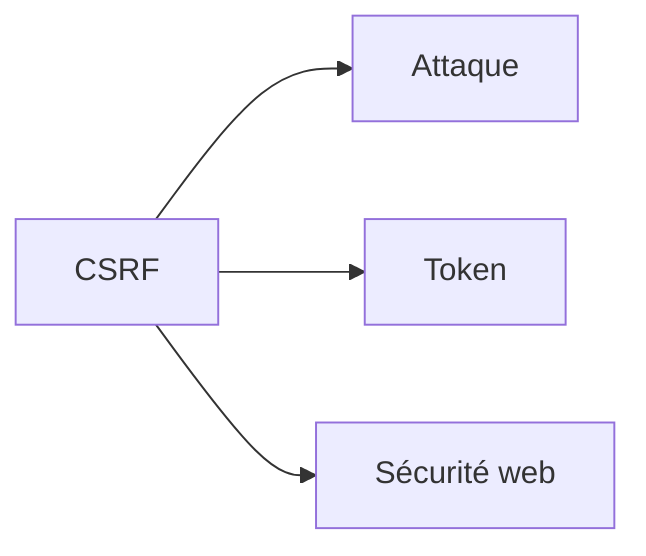

:::

## D

:::note Django

> Framework web Python haut niveau suivant le principe "batteries incluses"

Utilisé pour développer rapidement des applications web robustes et sécurisées
Architecture : MVT (Model-View-Template)
Fonctionnalités : ORM, admin interface, authentification

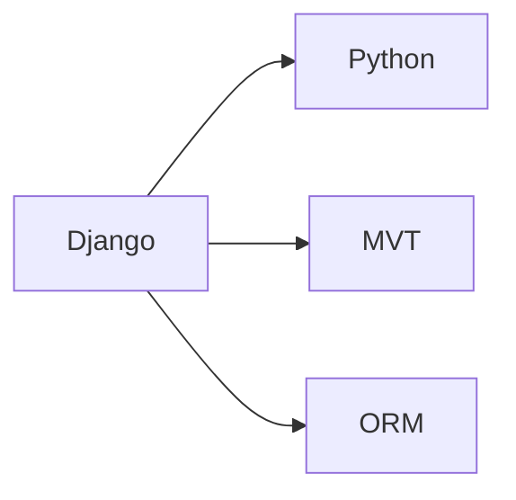

:::

:::note DOM

> Représentation en mémoire de la structure hiérarchique d'un document HTML/XML

Utilisé par JavaScript pour manipuler dynamiquement le contenu des pages web
Acronyme : Document Object Model
API : createElement, querySelector, addEventListener

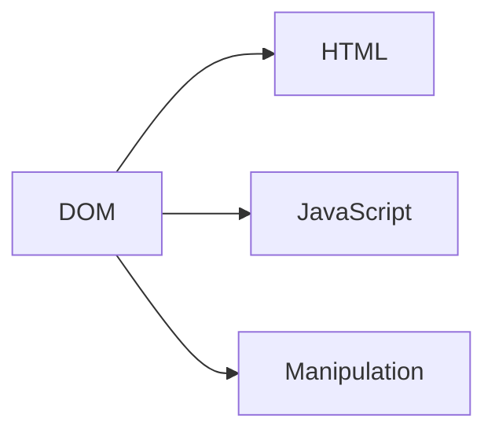

:::

:::note Docker

> Plateforme de conteneurisation permettant d'empaqueter applications et dépendances

Utilisé pour standardiser les environnements de développement et déploiement
Concepts : images, containers, Dockerfile, volumes
Avantages : portabilité, isolation, reproductibilité

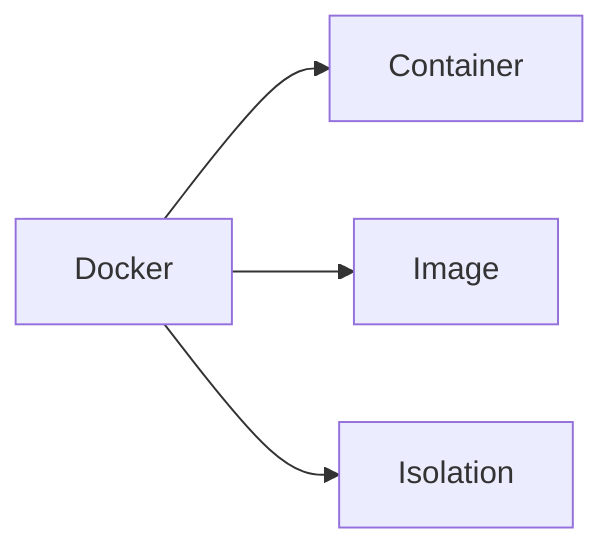

:::

## E

:::note Express.js

> Framework web minimaliste et flexible pour Node.js

Utilisé pour créer des APIs REST et des applications web côté serveur
Fonctionnalités : routing, middleware, template engines
Ecosystème : large communauté, nombreux plugins

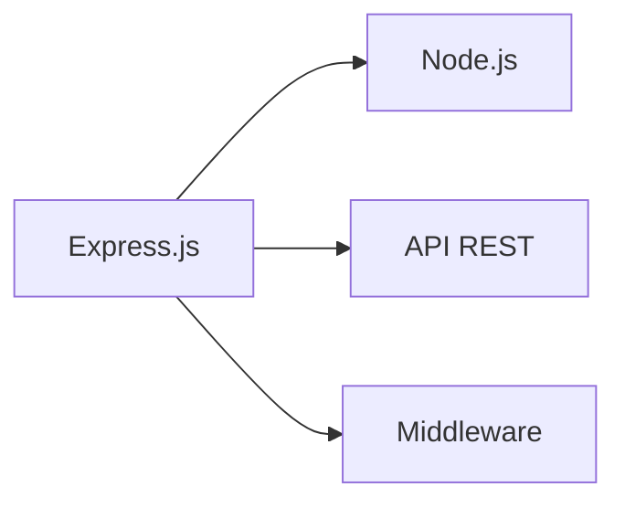

:::

## F

:::note Fetch API

> Interface moderne native pour effectuer des requêtes HTTP en JavaScript

Utilisé pour remplacer XMLHttpRequest avec une syntaxe plus moderne
Fonctionnalités : Promises, streaming, Request/Response objects
Support : tous les navigateurs modernes

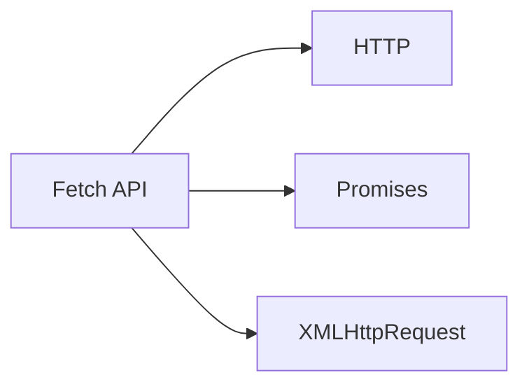

:::

:::note Flask

> Micro-framework web Python léger et extensible

Utilisé pour créer des applications web simples et des APIs
Philosophie : minimal core, extensions pour fonctionnalités avancées
Extensions : Flask-SQLAlchemy, Flask-Login, Flask-RESTful

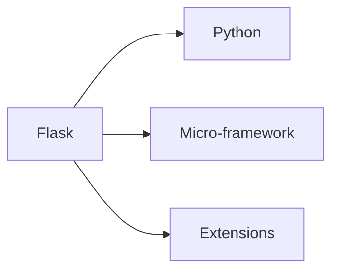

:::

## G

:::note GraphQL

> Langage de requête et runtime pour APIs offrant une alternative flexible à REST

Utilisé pour récupérer exactement les données nécessaires en une seule requête
Avantages : typage fort, introspection, single endpoint
Concepts : schema, resolvers, mutations, subscriptions

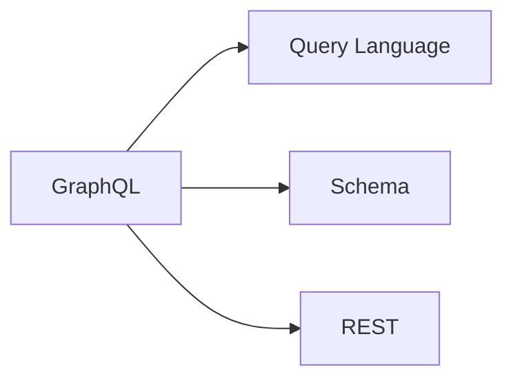

:::

## H

:::note HTML

> Langage de balisage standard pour créer des pages web structurées

Utilisé comme fondation de toutes les pages web pour définir le contenu et la structure
Acronyme : HyperText Markup Language
Versions : HTML5 avec nouvelles API et éléments sémantiques

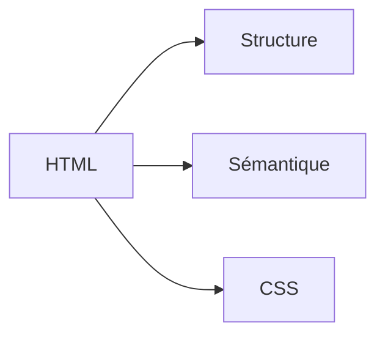

:::

:::note HTTP/HTTPS

> Protocoles de transfert de données entre clients web et serveurs

Utilisé pour toutes les communications web, HTTPS ajoutant la sécurité TLS
Acronyme : HyperText Transfer Protocol (Secure)
Méthodes : GET, POST, PUT, DELETE, PATCH

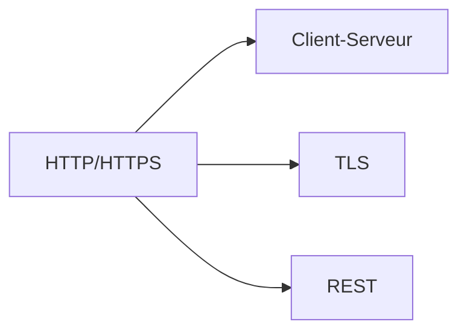

:::

## J

:::note JavaScript

> Langage de programmation dynamique pour le développement web côté client et serveur

Utilisé pour l'interactivité des pages web et le développement backend avec Node.js
Standards : ECMAScript (ES6+), TC39
Concepts : closures, prototypes, async/await, modules

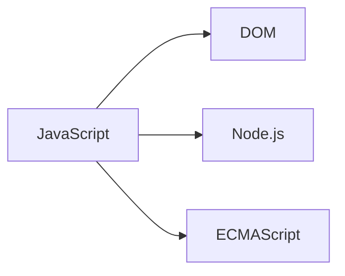

:::

:::note JSON

> Format léger d'échange de données structurées lisible par les humains

Utilisé pour la communication entre APIs, configuration et stockage de données
Acronyme : JavaScript Object Notation
Avantages : simplicité, support universel, types de base

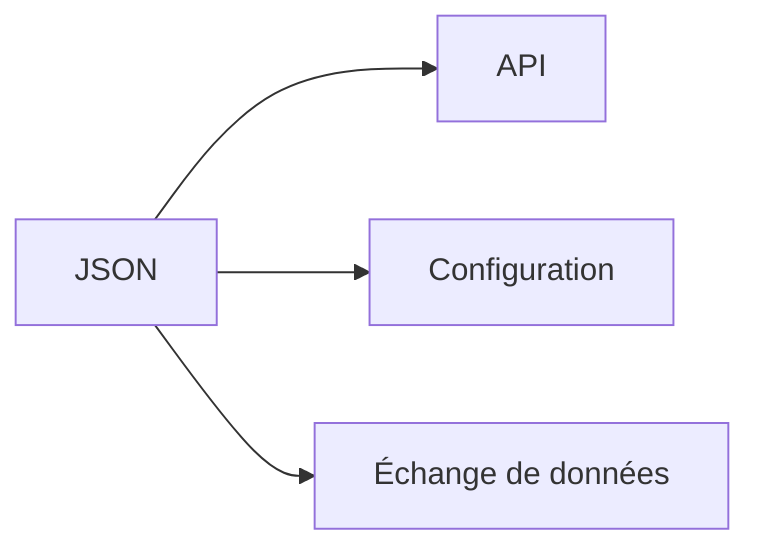

:::

:::note JWT

> Standard de token compact et sécurisé pour l'authentification et l'échange d'informations

Utilisé pour l'authentification stateless dans les APIs et applications distribuées
Acronyme : JSON Web Token
Structure : header.payload.signature (Base64 encodé)

```mermaid
graph LR
    A[JWT] --> B[Authentification]
    A --> C[Stateless]
    A --> D[API]
```

:::

## N

:::note Node.js

> Runtime JavaScript côté serveur basé sur le moteur V8 de Chrome

Utilisé pour développer des applications backend, APIs et outils de développement
Caractéristiques : event-driven, non-blocking I/O, npm ecosystem
Applications : serveurs web, APIs REST, microservices

```mermaid
graph LR
    A[Node.js] --> B[V8]
    A --> C[Backend]
    A --> D[npm]
```

:::

:::note npm

> Gestionnaire de paquets par défaut pour l'écosystème Node.js

Utilisé pour installer, gérer et partager des modules JavaScript
Acronyme : Node Package Manager
Fichiers : package.json, package-lock.json, node_modules

```mermaid
graph LR
    A[npm] --> B[Node.js]
    A --> C[Packages]
    A --> D[Dépendances]
```

:::

## O

:::note OAuth

> Framework d'autorisation permettant l'accès sécurisé aux ressources sans partager les mots de passe

Utilisé pour l'authentification tierce (Google, Facebook, GitHub) et APIs
Flux : authorization code, implicit, client credentials
Versions : OAuth 1.0a, OAuth 2.0, OIDC

```mermaid
graph LR
    A[OAuth] --> B[Autorisation]
    A --> C[Third-party]
    A --> D[API]
```

:::

:::note ORM

> Technique de programmation mappant les objets aux tables de base de données

Utilisé pour simplifier les interactions avec les bases de données relationnelles
Acronyme : Object-Relational Mapping
Exemples : Sequelize (Node.js), SQLAlchemy (Python), Hibernate (Java)

```mermaid
graph LR
    A[ORM] --> B[Base de données]
    A --> C[Objets]
    A --> D[SQL]
```

:::

## P

:::note PWA

> Application web offrant une expérience similaire aux applications natives

Utilisé pour créer des apps web installables avec fonctionnalités offline
Acronyme : Progressive Web App
Technologies : Service Workers, Web App Manifest, HTTPS

```mermaid
graph LR
    A[PWA] --> B[Service Worker]
    A --> C[Offline]
    A --> D[Installable]
```

:::

:::note PHP

> Langage de script côté serveur spécialement conçu pour le développement web

Utilisé pour créer des sites web dynamiques et des applications web
Acronyme : PHP: Hypertext Preprocessor (récursif)
Frameworks : Laravel, Symfony, CodeIgniter

```mermaid
graph LR
    A[PHP] --> B[Server-side]
    A --> C[Web dynamique]
    A --> D[Laravel]
```

:::

## R

:::note React

> Bibliothèque JavaScript développée par Facebook pour construire des interfaces utilisateur

Utilisé pour créer des applications web interactives avec architecture basée composants
Concepts : Virtual DOM, JSX, Hooks, state management
Ecosystème : Redux, React Router, Create React App

```mermaid
graph LR
    A[React] --> B[Virtual DOM]
    A --> C[Composants]
    A --> D[JSX]
```

:::

:::note REST

> Style architectural pour concevoir des services web utilisant les méthodes HTTP standard

Utilisé pour créer des APIs simples, scalables et interopérables
Acronyme : Representational State Transfer
Principes : stateless, cacheable, uniform interface, layered

```mermaid
graph LR
    A[REST] --> B[HTTP]
    A --> C[Stateless]
    A --> D[API]
```

:::

:::note Redux

> Gestionnaire d'état prévisible pour applications JavaScript

Utilisé pour gérer l'état global des applications complexes de manière centralisée
Concepts : store, actions, reducers, middleware
Principes : single source of truth, state is read-only, pure functions

```mermaid
graph LR
    A[Redux] --> B[State management]
    A --> C[Store]
    A --> D[React]
```

:::

## S

:::note SPA

> Application web fonctionnant sur une seule page avec navigation dynamique

Utilisé pour créer des expériences utilisateur fluides similaires aux applications desktop
Acronyme : Single Page Application
Technologies : React, Angular, Vue.js, routing client-side

```mermaid
graph LR
    A[SPA] --> B[Routing client]
    A --> C[UX fluide]
    A --> D[AJAX]
```

:::

:::note SQL Injection

> Technique d'attaque injectant du code SQL malveillant dans les requêtes

Utilisé par les attaquants pour accéder, modifier ou supprimer des données
Protection : requêtes préparées, validation input, ORM
Impact : vol de données, corruption, escalade de privilèges

```mermaid
graph LR
    A[SQL Injection] --> B[Attaque]
    A --> C[Base de données]
    A --> D[Sécurité web]
```

:::

:::note SSL/TLS

> Protocoles cryptographiques sécurisant les communications web

Utilisé pour chiffrer les données échangées entre navigateurs et serveurs (HTTPS)
Acronyme : Secure Sockets Layer / Transport Layer Security
Certificats : validation domaine, organisation, extended validation

```mermaid
graph LR
    A[SSL/TLS] --> B[Chiffrement]
    A --> C[HTTPS]
    A --> D[Certificat]
```

:::

## T

:::note TypeScript

> Sur-ensemble typé de JavaScript ajoutant un système de types statique

Utilisé pour développer des applications JavaScript plus robustes et maintenables
Fonctionnalités : typage statique, interfaces, generics, compilation
Adoption : Angular (natif), React (optionnel), Node.js

```mermaid
graph LR
    A[TypeScript] --> B[JavaScript]
    A --> C[Types]
    A --> D[Compilation]
```

:::

## V

:::note Vue.js

> Framework JavaScript progressif pour construire des interfaces utilisateur

Utilisé pour créer des applications web réactives avec courbe d'apprentissage douce
Caractéristiques : template syntax, reactive data, component-based
Ecosystème : Vue CLI, Vue Router, Vuex, Nuxt.js

```mermaid
graph LR
    A[Vue.js] --> B[Framework progressif]
    A --> C[Templates]
    A --> D[Réactivité]
```

:::

:::note Virtual DOM

> Représentation virtuelle légère du DOM réel pour optimiser les performances

Utilisé par React et autres frameworks pour minimiser les manipulations DOM coûteuses
Principe : diff algorithm, reconciliation, batch updates
Avantages : performance, predictability, testability

```mermaid
graph LR
    A[Virtual DOM] --> B[DOM réel]
    A --> C[Performance]
    A --> D[React]
```

:::

## W

:::note Webpack

> Bundler de modules construisant des bundles optimisés pour applications web

Utilisé pour empaqueter, transformer et optimiser les assets web
Concepts : entry points, loaders, plugins, code splitting
Fonctionnalités : hot reload, tree shaking, lazy loading

```mermaid
graph LR
    A[Webpack] --> B[Bundling]
    A --> C[Modules]
    A --> D[Optimisation]
```

:::

:::note WebSocket

> Protocole de communication bidirectionnelle full-duplex entre client et serveur

Utilisé pour les applications temps réel nécessitant des échanges fréquents
Applications : chat, gaming, trading, notifications live
Avantages : faible latence, persistant, full-duplex

```mermaid
graph LR
    A[WebSocket] --> B[Temps réel]
    A --> C[Bidirectionnel]
    A --> D[Full-duplex]
```

:::

:::note WYSIWYG

> Éditeur permettant de voir le résultat final pendant l'édition

Utilisé dans les CMS et éditeurs de contenu pour simplifier la création
Acronyme : What You See Is What You Get
Exemples : TinyMCE, CKEditor, Quill

```mermaid
graph LR
    A[WYSIWYG] --> B[Éditeur]
    A --> C[CMS]
    A --> D[Contenu]
```

:::

## X

:::note XSS

> Attaque injectant des scripts malveillants dans des pages web légitimes

Utilisé par les attaquants pour voler des données utilisateur ou contrôler des sessions
Acronyme : Cross-Site Scripting
Types : reflected, stored, DOM-based
Protection : validation input, CSP, encoding

```mermaid
graph LR
    A[XSS] --> B[Attaque]
    A --> C[Script injection]
    A --> D[Sécurité web]
```

:::

:::note XML

> Langage de balisage extensible pour structurer et échanger des données

Utilisé pour la configuration, échange de données et formats de document
Acronyme : eXtensible Markup Language
Applications : SOAP, RSS, configuration files, document formats

```mermaid
graph LR
    A[XML] --> B[Balisage]
    A --> C[Structure]
    A --> D[SOAP]
```

:::

---

_Glossaire Développement Web v2024.1_
