# Glossaire - DevSecOps

> Automatisation, sécurité intégrée et culture DevOps - CI/CD, monitoring, Infrastructure as Code

:::info 30 termes disponible pour la partie Développement
:::

:::warning A REVOIR
:::

---

## A

:::note Ansible

> Outil d'automatisation IT agentless pour la configuration, déploiement et orchestration

Utilisé pour gérer l'infrastructure et automatiser les tâches répétitives
Langage : YAML (playbooks, roles, inventories)
Avantages : simplicité, agentless, idempotence

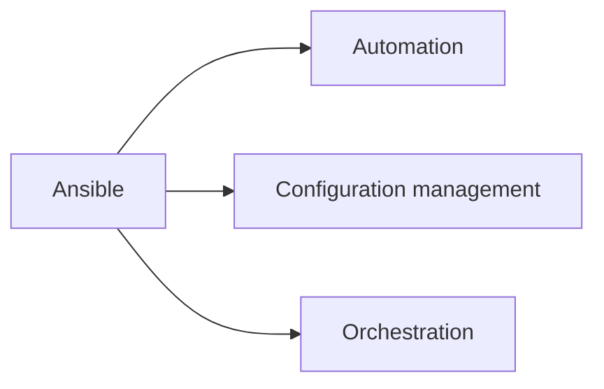

:::

:::note Artifact

> Produit livrable généré par un processus de build et stocké dans un repository

Utilisé pour versionner et distribuer les livrables entre environnements
Types : binaires, images Docker, packages, libraries
Repositories : Nexus, Artifactory, Harbor, npm registry

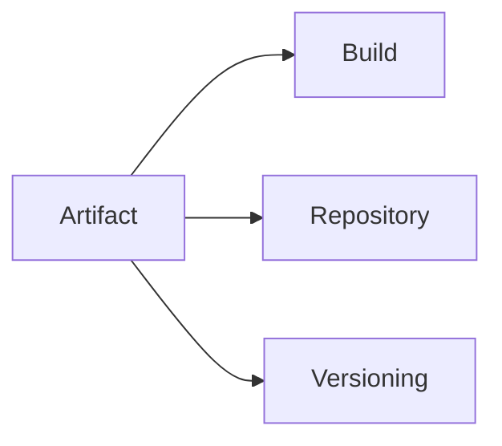

:::

:::note Automation

> Exécution automatique de tâches répétitives sans intervention humaine

Utilisé pour réduire les erreurs, accélérer les déploiements et standardiser les processus
Domaines : testing, deployment, infrastructure provisioning, monitoring
Outils : Jenkins, GitLab CI, GitHub Actions, Ansible

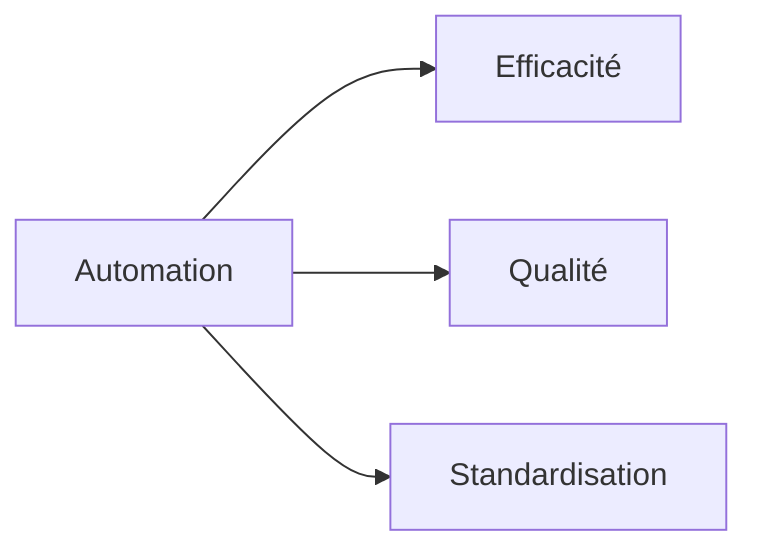

:::

## B

:::note Blue-Green Deployment

> Stratégie de déploiement utilisant deux environnements identiques pour les mises à jour

Utilisé pour minimiser les temps d'arrêt et faciliter les rollbacks
Principe : bascule instantanée entre environnements actif (blue) et standby (green)
Avantages : zero downtime, rollback rapide, test en production

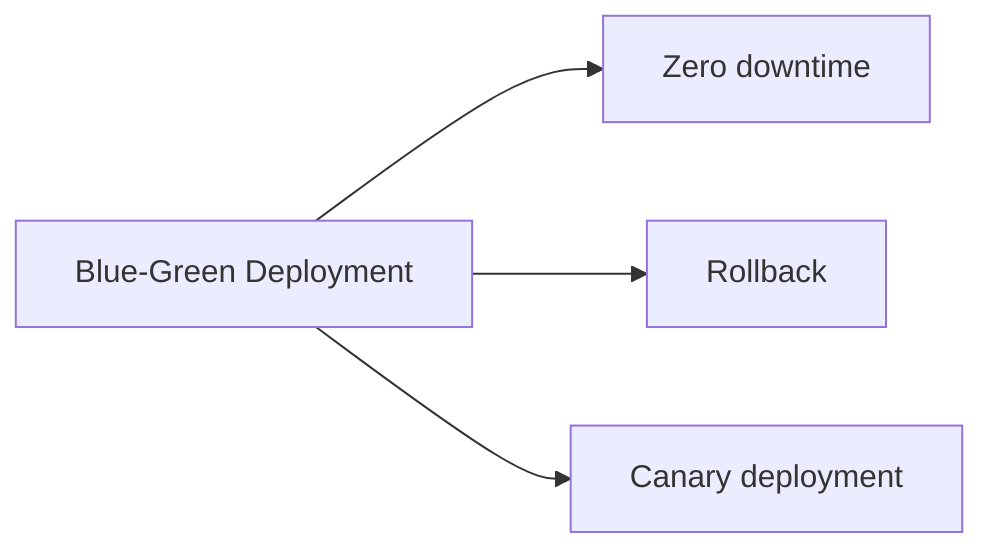

:::

## C

:::note CI/CD

> Pratiques d'intégration et de livraison continues automatisant le cycle de développement

Utilisé pour détecter rapidement les problèmes et déployer fréquemment
Acronyme : Continuous Integration / Continuous Deployment
Pipeline : source → build → test → deploy → monitor

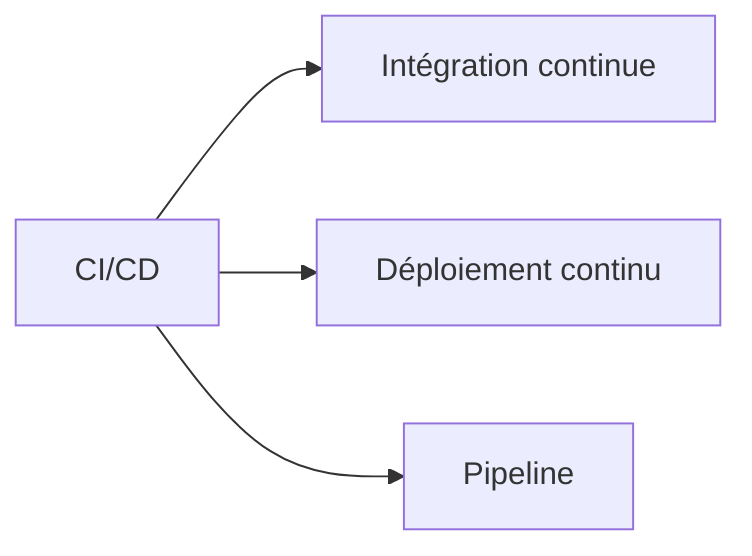

:::

:::note Canary Deployment

> Stratégie de déploiement progressif à un sous-ensemble d'utilisateurs pour tester en production

Utilisé pour réduire les risques en validant les changements sur un trafic limité
Principe : déploiement graduel avec monitoring des métriques
Métriques : error rate, latency, business KPIs

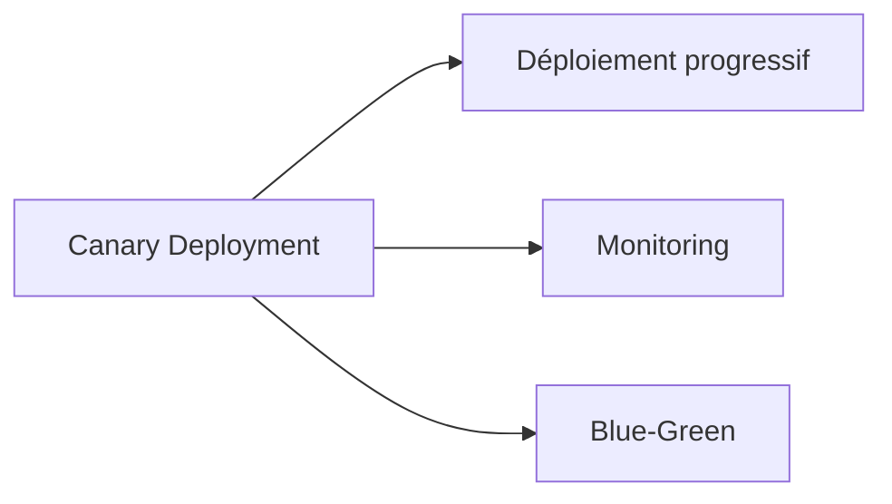

:::

:::note Chef

> Plateforme d'automatisation d'infrastructure utilisant du code Ruby pour la configuration

Utilisé pour gérer la configuration et l'état des serveurs à grande échelle
Concepts : cookbooks, recipes, nodes, chef-server
Approche : infrastructure as code, convergence automatique

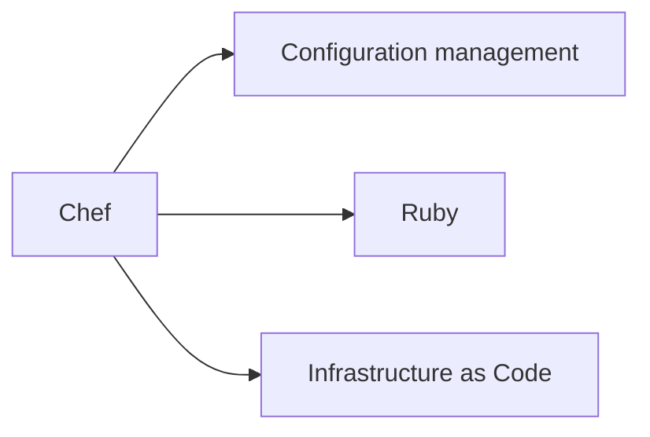

:::

:::note Configuration Drift

> Divergence progressive de la configuration réelle par rapport à l'état désiré

Utilisé comme problème à éviter via l'automatisation et le monitoring
Causes : modifications manuelles, mises à jour partielles, erreurs
Solutions : configuration management, immutable infrastructure

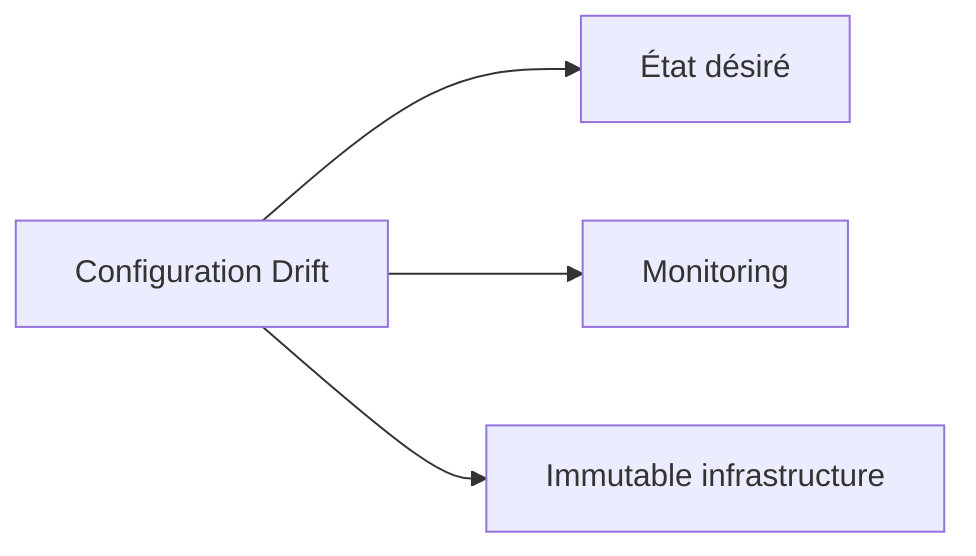

:::

## D

:::note DAST

> Tests de sécurité dynamiques analysant les applications en cours d'exécution

Utilisé pour détecter les vulnérabilités exploitables dans les applications web
Acronyme : Dynamic Application Security Testing
Approche : black box testing, simulation d'attaques
Outils : OWASP ZAP, Burp Suite, Veracode

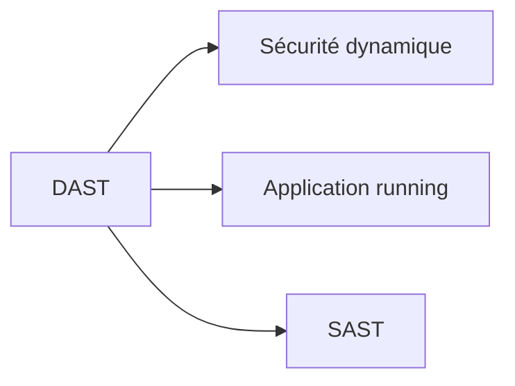

:::

:::note Docker Registry

> Service de stockage et distribution d'images de conteneurs Docker

Utilisé pour centraliser, versionner et distribuer les images Docker
Types : public (Docker Hub), private (Harbor, ECR, ACR)
Fonctionnalités : vulnerability scanning, access control, replication

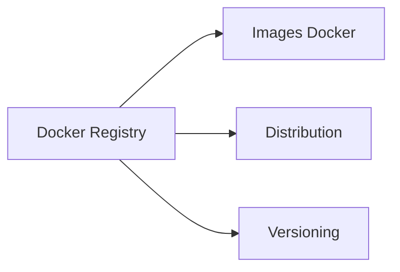

:::

:::note DORA Metrics

> Métriques de performance DevOps définies par DevOps Research and Assessment

Utilisé pour mesurer et améliorer la performance des équipes de livraison logicielle
Métriques : deployment frequency, lead time, MTTR, change failure rate
Niveaux : low, medium, high, elite performers

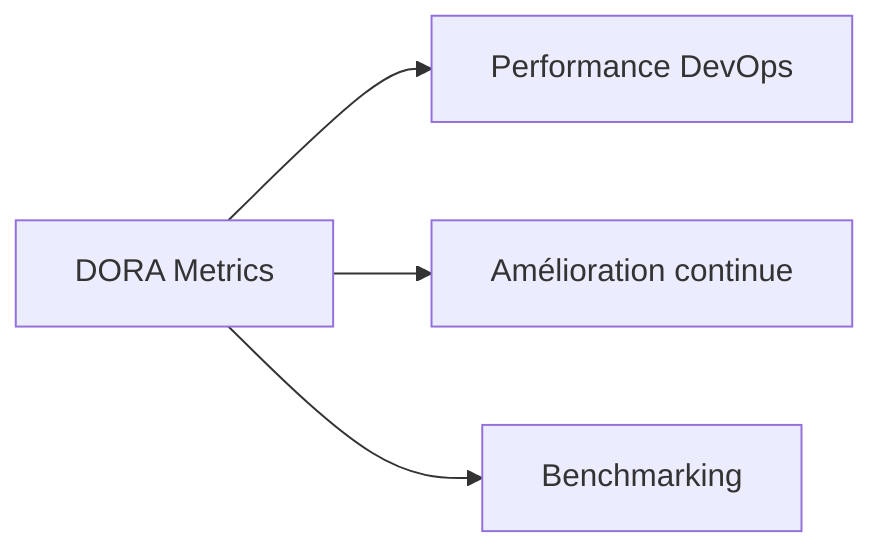

:::

## F

:::note Feature Flag

> Technique permettant d'activer ou désactiver des fonctionnalités sans redéploiement

Utilisé pour découpler déploiement et activation de features, faciliter les tests A/B
Avantages : rollback instantané, progressive rollout, testing en production
Outils : LaunchDarkly, Flagsmith, Split.io

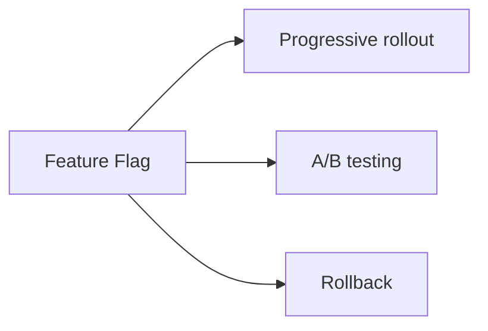

:::

## G

:::note GitOps

> Pratique utilisant Git comme source de vérité unique pour l'infrastructure et les déploiements

Utilisé pour gérer l'infrastructure et les applications de manière déclarative
Principe : état désiré dans Git, synchronisation automatique par agents
Outils : ArgoCD, Flux, Jenkins X

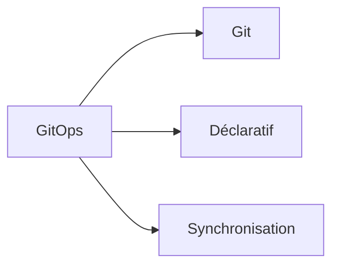

:::

:::note Grafana

> Plateforme open-source de visualisation et monitoring avec dashboards interactifs

Utilisé pour créer des tableaux de bord visuels à partir de diverses sources de données
Sources : Prometheus, InfluxDB, Elasticsearch, CloudWatch
Fonctionnalités : alerting, annotations, templating, sharing

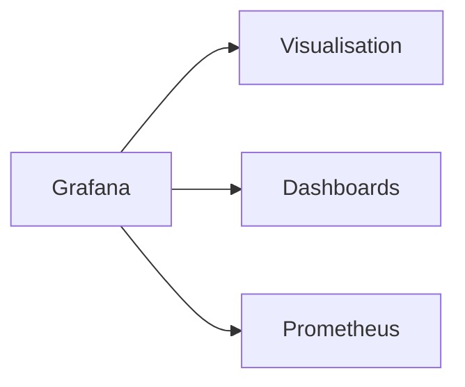

:::

## H

:::note Helm

> Gestionnaire de paquets pour Kubernetes facilitant le déploiement d'applications complexes

Utilisé pour packager, configurer et déployer des applications Kubernetes
Concepts : charts, values, templates, releases
Avantages : réutilisabilité, versioning, rollback, templating

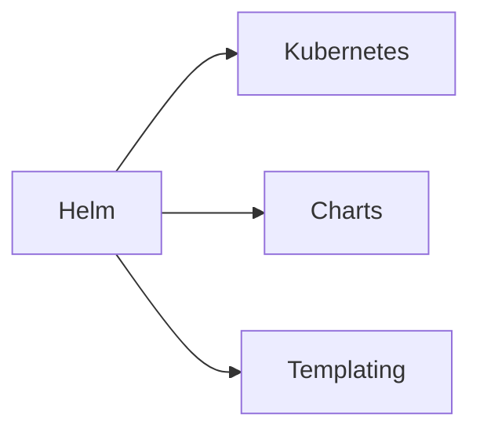

:::

## I

:::note IaC

> Approche gérant l'infrastructure via du code versionné et automatisé

Utilisé pour provisionner, configurer et gérer l'infrastructure de manière reproductible
Acronyme : Infrastructure as Code
Outils : Terraform, CloudFormation, Pulumi, ARM templates

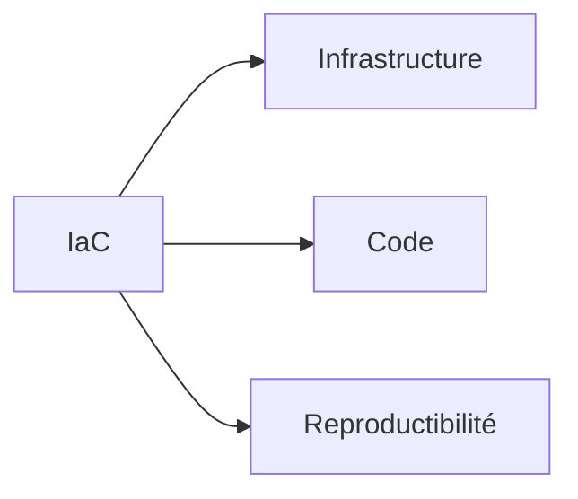

:::

:::note Immutable Infrastructure

> Architecture où les serveurs ne sont jamais modifiés après déploiement

Utilisé pour éliminer la dérive de configuration et améliorer la prévisibilité
Principe : replace, don't repair - nouvelles instances remplacent les anciennes
Bénéfices : consistency, reliability, easy rollback

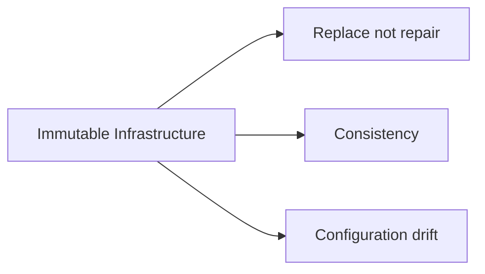

:::

## J

:::note Jenkins

> Serveur d'automatisation open-source pour CI/CD avec architecture extensible

Utilisé pour construire des pipelines de déploiement automatisés
Architecture : master/slave, plugins ecosystem
Concepts : jobs, pipelines, agents, Jenkinsfile

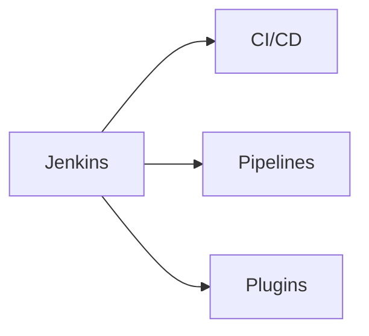

:::

## M

:::note MTTR

> Temps moyen nécessaire pour restaurer un service après une panne

Utilisé comme métrique clé pour mesurer l'efficacité de la réponse aux incidents
Acronyme : Mean Time To Recovery/Restore
Amélioration : monitoring, automation, runbooks, post-mortems

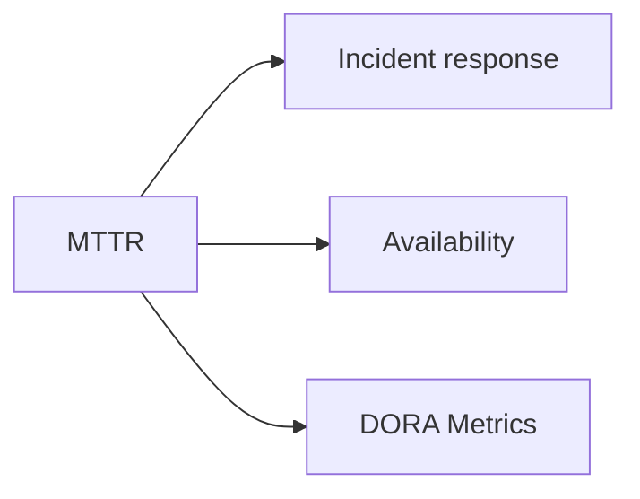

:::

:::note Monitoring

> Surveillance continue des systèmes et applications pour détecter les problèmes

Utilisé pour maintenir la performance, disponibilité et sécurité des services
Types : infrastructure, application, business metrics
Stack : collecte → stockage → visualisation → alerting

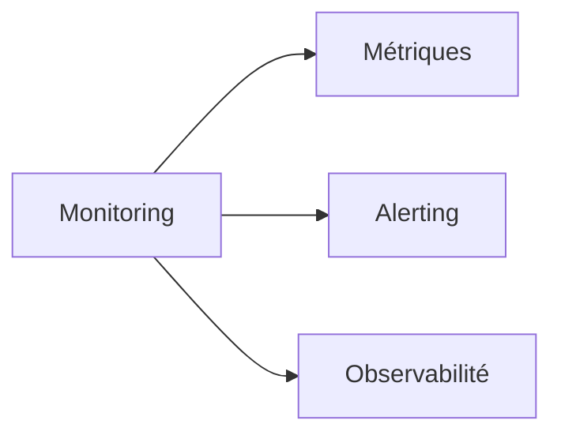

:::

## P

:::note Pipeline

> Séquence automatisée d'étapes pour transformer le code source en livrable déployé

Utilisé pour standardiser et automatiser le processus de livraison logicielle
Étapes : build, test, security scan, deploy, verify
Types : CI pipeline, CD pipeline, deployment pipeline

```mermaid
graph LR
    A[Pipeline] --> B[Automatisation]
    A --> C[Étapes]
    A --> D[Livraison]
```

:::

:::note Prometheus

> Système de monitoring et d'alerting collectant et stockant des métriques en time-series

Utilisé pour surveiller les applications et l'infrastructure cloud-native
Architecture : pull-based, service discovery, PromQL query language
Écosystème : Grafana (visualization), Alertmanager (alerting)

```mermaid
graph LR
    A[Prometheus] --> B[Time-series]
    A --> C[Métriques]
    A --> D[Grafana]
```

:::

## R

:::note Rolling Deployment

> Stratégie de mise à jour progressive remplaçant les instances une par une

Utilisé pour maintenir la disponibilité du service pendant les déploiements
Principe : replacement graduel avec vérification de santé
Avantages : zero downtime, rollback partiel possible

```mermaid
graph LR
    A[Rolling Deployment] --> B[Mise à jour progressive]
    A --> C[Zero downtime]
    A --> D[Health checks]
```

:::

:::note Runbook

> Documentation procédurale détaillée pour les opérations et résolution d'incidents

Utilisé pour standardiser les réponses aux incidents et faciliter l'escalade
Contenu : diagnostic steps, resolution procedures, escalation paths
Format : markdown, wiki, automation scripts

```mermaid
graph LR
    A[Runbook] --> B[Procédures]
    A --> C[Incidents]
    A --> D[Automation]
```

:::

## S

:::note SAST

> Tests de sécurité statiques analysant le code source sans l'exécuter

Utilisé pour détecter les vulnérabilités tôt dans le cycle de développement
Acronyme : Static Application Security Testing
Approche : white box testing, code analysis, early detection
Outils : SonarQube, Checkmarx, Veracode

```mermaid
graph LR
    A[SAST] --> B[Code source]
    A --> C[Sécurité statique]
    A --> D[DAST]
```

:::

:::note SCA

> Analyse des composants et dépendances tierces pour identifier les vulnérabilités

Utilisé pour gérer les risques de sécurité des bibliothèques et frameworks
Acronyme : Software Composition Analysis
Scope : open source libraries, licenses, known vulnerabilities
Outils : Snyk, WhiteSource, Black Duck

```mermaid
graph LR
    A[SCA] --> B[Dépendances]
    A --> C[Vulnérabilités]
    A --> D[Open source]
```

:::

:::note Secret Management

> Gestion sécurisée des informations sensibles comme mots de passe et clés API

Utilisé pour protéger les credentials et éviter leur exposition dans le code
Bonnes pratiques : rotation automatique, accès minimal, audit trail
Outils : HashiCorp Vault, AWS Secrets Manager, Kubernetes Secrets

```mermaid
graph LR
    A[Secret Management] --> B[Credentials]
    A --> C[Sécurité]
    A --> D[Rotation]
```

:::

:::note SRE

> Discipline appliquant les principes de l'ingénierie logicielle aux opérations

Utilisé pour améliorer la fiabilité des systèmes par l'automatisation et les métriques
Acronyme : Site Reliability Engineering
Concepts : SLI, SLO, error budgets, toil reduction

```mermaid
graph LR
    A[SRE] --> B[Fiabilité]
    A --> C[Automatisation]
    A --> D[Métriques]
```

:::

## T

:::note Terraform

> Outil d'infrastructure as code permettant de provisionner des ressources multi-cloud

Utilisé pour gérer l'infrastructure de manière déclarative et reproductible
Concepts : providers, resources, state, modules
Workflow : plan → apply → destroy

```mermaid
graph LR
    A[Terraform] --> B[Infrastructure as Code]
    A --> C[Multi-cloud]
    A --> D[State management]
```

:::

## V

:::note Vault

> Gestionnaire de secrets centralisé pour stocker et accéder aux données sensibles

Utilisé pour sécuriser les credentials, certificats et autres informations critiques
Fonctionnalités : encryption at rest/transit, dynamic secrets, audit logging
Intégrations : Kubernetes, CI/CD pipelines, cloud providers

```mermaid
graph LR
    A[Vault] --> B[Secrets]
    A --> C[Chiffrement]
    A --> D[Dynamic secrets]
```

:::

---

_Glossaire DevSecOps v2024.1_
