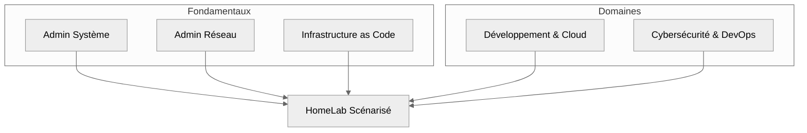

# Introduction générale

## HomeLab Pratique

Cette section est conçue pour allier **théorie fondamentale** et **mise en pratique intensive** à travers des projets concrets,
scénarisés et interconnectés. Elle vise à accompagner une **progression technique réelle et durable**, par l'expérimentation en environnement
**isolé**, **contrôlé**, et **éthique**.

:::danger Information critique
Lorsque des démonstrations impliquent la création de **malwares**, **trojans**, ou autres outils d’attaque, les étapes sensibles seront
**volontairement tronquées**. Cette décision est **délibérée** afin d’éviter la diffusion d’informations potentiellement exploitables à des
fins malveillantes.
:::

:::note Éthique avant tout
L’objectif est de **former à la défense**, à la compréhension des menaces et à la sécurisation des systèmes.  
Aucune démonstration n’a vocation à promouvoir l’exploitation offensive sans cadre légal.
:::

## Vision pédagogique

Chaque HomeLab est conçu comme un **environnement modulaire, reproductible et interconnectable** avec les autres volets de la documentation.
Cette approche permet :

-   de consolider des compétences clés : Linux, réseau, forensic, scripting…
-   de mettre en lien des outils variés : Docker, Wazuh, Volatility, Metasploit, etc.
-   de progresser par **la pratique scénarisée** avec une documentation pas-à-pas claire

:::note Expérience guidée et réaliste
_Chaque projet est accompagné de **méthodologies rigoureuses**, incluant des objectifs pédagogiques, des configurations types et des schémas._
:::

## Positionnement dans l’architecture documentaire

Voici comment les HomeLabs s’intègrent dans la logique globale de montée en compétence :

---

## Finalité des HomeLabs

:::tip Une progression pratique et complète
Les HomeLabs sont pensés pour **mettre en mouvement** les connaissances, simuler des **situations réalistes** 
( _intrusion, analyse mémoire, configuration réseau, récupération de fichiers, etc._ ) et donner du **sens** aux compétences théoriques.
:::

Ils permettent de :

-   Explorer un scénario technique complet ( par exemple : **attaque → détection → réponse** )
-   Appliquer plusieurs volets de compétence en un seul projet
-   Apprendre par la **documentation technique structurée**

## En résumé

| Élément              | Description                                                                       |
| -------------------- | --------------------------------------------------------------------------------- |
| **Objectif**         | _Favoriser l'apprentissage **opérationnel** en environnement maîtrisé_            |
| **Outils utilisés**  | _Wazuh, Metasploit, Docker, Suricata, Volatility, Yara, Wireshark, etc._          |
| **Approche**         | _Guidée, modulaire, reproductible, orientée "défense et compréhension technique"_ |
| **Éthique garantie** | _Aucun partage d’étape permettant une exploitation malveillante_                  |
