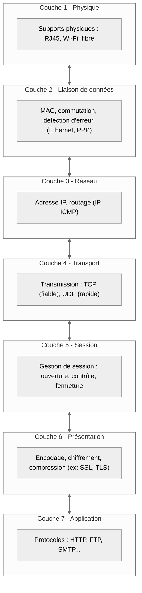
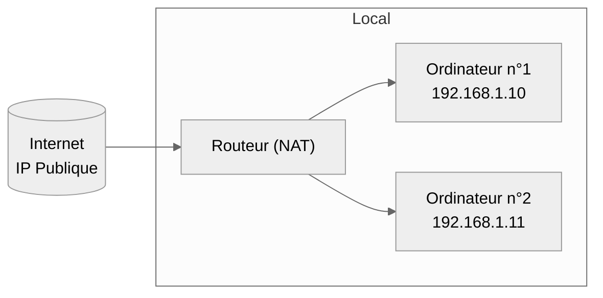
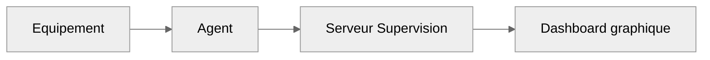

import Badge from '@site/src/components/Badge';

# Intro. Admin Réseau

## Administration Réseau

**Objectif** : acquérir les compétences fondamentales permettant de conçevoir, configurer, déployer, surveiller et sécuriser des
infrastructures réseau local ( _LAN_ ) ou élargi ( _WAN_ ) dans des environnements professionnels distribués et interconnectés.

L'administration réseau représente le **pilier invisible mais vital de tout système d'information**. Elle assure la communication efficace et
sécurisée entre les équipements, les services et les utilisateurs afin de permettre de garantir la **connectivité**, la **performance** et la
**sécurité** des systèmes interconnectés.

:::note
_à éditer._
:::

Ce module couvre les bases réseau essentielles à tout administrateur système ou futur ingénieur réseau. 
Les notions clés abordées sont :

-   **Modèle OSI & TCP/IP** : _compréhension des couches et des protocoles_
-   **Adressage IP & routage** : _calculs, masques, sous-réseaux_
-   **Services réseau essentiels** : _DNS, DHCP, NAT, pare-feu_
-   **Supervision et diagnostic** : _ping, traceroute, netstat, SNMP, etc._
-   **Sécurité réseau** : _filtrage, VLAN, segmentation_

 

:::tip Bonnes pratiques
Toujours **documenter son architecture réseau** ( _topologie, adresses, rôles_ ), **centraliser la supervision** et
**tester les modifications dans un environnement isolé** avant mise en production.
:::

:::warning Rappel
L'administration réseau se distingue de l'administration système par sa **portée transverse** : elle **englobe la communication entre
tous les hôtes**, **services** et **ressources**. Elle est également très proche des métiers de la **cybersécurité**
( _pare-feu, segmentation, analyse de paquets_ ).
:::

## Table des matières

| Section | Titre                               | Description                                                        |
| :-----: | ----------------------------------- | ------------------------------------------------------------------ |
|  **I**  | Modèles et protocoles réseau        | _Comprendre le fonctionnement du modèle OSI et des protocoles IP._ |
| **II**  | Adressage IP et Routage             | _Définir, calculer et manipuler les réseaux IP._                   |
| **III** | Services réseau fondamentaux        | _DNS, DHCP, NAT, gestion des ports et du trafic._                  |
| **IV**  | Outils de diagnostic et supervision | _Analyser et surveiller le comportement du réseau._                |
|  **V**  | Bonnes pratiques et sécurité réseau | _Contrôler, isoler et protéger son infrastructure._                |

---

## I. Modèles et protocoles réseau

**Objectif** : _Poser les bases de la compréhension des flux et protocoles réseau._ 
**Niveau** : <Badge niveau="Débutant" />

:::note Concept
Le modèle **OSI** est un **cadre théorique** qui aide à décomposer les fonctionnalités réseau en **7 couches logiques**. 
Le modèle **TCP/IP** en est l'équivalent **pratique et réellement utilisé**.
:::

**Schéma des couches OSI**

Le modèle OSI fonctionne dans les deux sens :

-   du haut vers le bas ( _émission_ )
-   du bas vers le haut ( _réception_ )

## II. Adressage IP et Routage

**Objectif** : _Gérer efficacement les réseaux et sous-réseaux IP._ 
**Niveau** : <Badge niveau="Intermédiaire" />

-   **IPv4** : classes, masques, sous-réseaux, gateway
-   **IPv6** : préfixes, autoconfiguration
-   **Routage statique** vs **dynamique**
-   **Commandes** : `ip`, `route`, `traceroute`, `netstat`

**Schéma de routage basique**

---

## III. Services réseau fondamentaux

**Objectif** : _Mettre en place les services de base pour un LAN fonctionnel._ 
**Niveau** : <Badge niveau="Intermédiaire" />

-   **DNS** : _résolution de noms, zones_
-   **DHCP** : _attribution automatique d'adresses IP_
-   **NAT** / **PAT** : _translation d'adresses pour l'accès internet_
-   **Services additionnels** : `NTP`, `FTP`, `HTTP`, etc.

---

## IV. Diagnostic et supervision

**Objectif** : _Contrôler et analyser la santé du réseau._ 
**Niveau** : <Badge niveau="Avancé" />

-   **Outils** : `ping`, `nmap`, `tcpdump`, `wireshark`, `snmpwalk`
-   Logs réseau, analyse de trafic, capture de paquets
-   Mise en place d'une supervision centralisée ( _Zabbix, Nagios_ )

**Flux de supervision typique**

---

## V. Bonnes pratiques et sécurité

**Objectif** : _Sécuriser son infrastructure réseau et éviter les erreurs courantes._ 
**Niveau** : <Badge niveau="Avancé" />

-   VLAN, segmentation
-   Pare-feux ( _iptables, firewalld, pfSense_ )
-   Filtrage MAC / IP, inspection détaillée
-   Cloisonnement des services et journaux réseau

---

## Mise en perspective

:::tip Transition vers la spécialisation
Les compétences réseau préparent aux métiers de **technicien réseau**, **administrateur infrastructure**, **analyste sécurité**
ou **architecte réseau**. Elles sont aussi fondamentales pour tout profil **DevOps**, **Cloud** ou **Pentester** ( _Cybersécurité_ ).
:::

**Prolongements possibles**

| Domaine      | Prérequis réseau acquis         | Évolutions naturelles                     |
| ------------ | ------------------------------- | ----------------------------------------- |
| **Sécurité** | Supervision, segmentation, logs | Analyse intrusion, SOC, pare-feux avancés |
| **Cloud**    | Routage, DNS, NAT               | VPC, Load Balancing, Peering              |
| **DevOps**   | Diagnostic, connectivité        | Intégration avec IaC, réseaux Docker      |
| **Télécoms** | Protocoles, couche liaison      | MPLS, QoS, gestion de trafic              |

Ces compétences constituent la base pour comprendre **les systèmes interconnectés**, **les menaces potentielles** et
l**es mécanismes de protection adaptés**.
