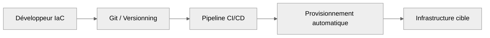
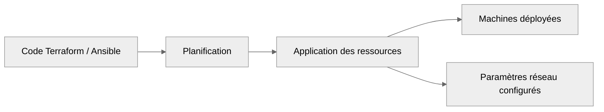

import Badge from '@site/src/components/Badge';

# Intro. IaC

## IaC ( _Infrastructure as Code_ )

**Objectif** : adopter une démarche d’automatisation complète des environnements systèmes et réseau par le biais du code déclaratif et des
outils de provisionnement.

L’IaC ( _Infrastructure as Code_ ) transforme radicalement la manière d’administrer : _fini les configurations manuelles non reproductibles_.
On passe à une **gestion programmée**, **traçable**, **versionnée de l’infrastructure**.

:::note
Ce module vise à mettre en œuvre des environnements fiables, scalables, portables et documentés. 
Il est au cœur des pratiques **DevOps** / **DevSecOps**, mais également **crucial en tests d’infrastructure**, en **projets cloud** ou pour
**tout déploiement répétable**.
:::

Les outils abordés ici :

-   **Terraform** / **OpenTofu** : _déclaration d'infrastructure Cloud ou locale_
-   **Ansible** : _configuration automatisée des systèmes_
-   **Packer** : _construction d’images système_
-   **Vagrant** : _environnements reproductibles de test ou de développement_
-   **Docker** : _conteneurs applicatifs et services isolés_

 

:::tip Pratique recommandée
Utilise **Git pour versionner chaque modification d’infrastructure**. Adopte une logique **modulaire**, **réutilisable**, et **structure ton
code selon les bonnes pratiques**. L’objectif est que ton infrastructure devienne un artefact versionné, comme ton code applicatif.
:::

:::warning Ne pas confondre
L’IaC n’est **pas une technologie** mais une **philosophie**, un **modèle de gestion** des infrastructures basé sur le code. Elle transcende
les outils et s’inscrit dans une démarche de **standardisation**, **d’automatisation** et **d’auditabilité**.
:::

:::danger Délimitation
Cette section ne couvre pas le **Cloud public** ( AWS, GCP, Azure ) de manière approfondie. Elle se concentre sur **les bases locales**,
**les patterns génériques**, et **l’interopérabilité avec les autres outils DevOps**.
:::

## Table des matières

| Section | Titre                          | Description                                                             |
| :-----: | ------------------------------ | ----------------------------------------------------------------------- |
|  **I**  | Concepts fondamentaux de l'IaC | _Pourquoi coder l'infrastructure ? Principes clés et philosophie._      |
| **II**  | Outils et langages             | _Terraform, OpenTofu, Ansible, Packer, Vagrant, Docker : introduction._ |
| **III** | Déploiement d’infrastructure   | _Provisionnement de VM, configuration, réseau._                         |
| **IV**  | Modularité et bonnes pratiques | _Organisation du code, variables, réutilisabilité._                     |

**Pour une progression logique, il convient de suivre ces sections dans l'ordre pour construire des fondamentaux solides.**

---

## I. Concepts fondamentaux de l'IaC

**Objectif** : _Comprendre la philosophie de l’automatisation déclarative appliquée à l’infrastructure._ 
**Niveau** : <Badge niveau="Débutant" />

:::note Concept
L'IaC permet de décrire une infrastructure entière dans un fichier texte versionné. Cela permet de **rejouer**, **modifier**, **partager** et
**auditer** chaque modification du système.
:::

-   **Déclaratif vs impératif** : _on décrit un état cible au lieu d’exécuter une suite de commandes._
-   **Idempotence** : _répéter le déploiement ne modifie pas le résultat si rien n’a changé._
-   **Traçabilité** : _chaque modification est visible dans Git ( versioning )._

**Schéma de principe IaC**

---

## II. Outils et langages

**Objectif** : _Identifier et comprendre le rôle des outils majeurs d’IaC._ 
**Niveau** : <Badge niveau="Intermédiaire" />

:::note Concept
Chaque outil répond à une étape clé du cycle de vie de l’infrastructure : **création**, **configuration**, **virtualisation**,
**conteneurisation**, **réplication**.
:::

|            Outil             | Usage Principal                                               |
| :--------------------------: | ------------------------------------------------------------- |
| **Terraform** / **OpenTofu** | _Définir l'infrastructure cible_ ( _machines, réseau, etc._ ) |
|         **Ansible**          | _Configurer les machines une fois déployées_                  |
|          **Packer**          | _Créer des images système automatisées_                       |
|          **Docker**          | _Conteneurisation des applications et services_               |
|         **Vagrant**          | _Environnements de test reproductibles_                       |

---

## III. Déploiement d'infrastructure

**Objectif** : _Créer une architecture complète avec réseau, machines, et configurations de base._ 
**Niveau** : <Badge niveau="Intermédiaire" />

:::note Concept
_On passe de l’écriture du code à l’infrastructure fonctionnelle : chaque ressource est créée à partir de définitions contrôlées._
:::

-   Déploiement de machines virtuelles ( _locales ou cloud_ )
-   Configuration réseau ( _interfaces, DNS, pare-feu_ )
-   Automatisation initiale ( _scripts post-install_ )

**Flux de déploiement automatisé**

---

## IV. Modularité et bonnes pratiques

**Objectif** : _Structurer son code pour qu’il soit réutilisable, lisible et maintenable._ 
**Niveau** : <Badge niveau="Débutant" />

:::note Concept
_Un projet IaC bien structuré est un projet durable : **lisibilité**, **réutilisabilité**, **sécurité** et **compatibilité**
sont les fondements d’une infrastructure pérenne._
:::

-   Organisation modulaire ( _dossiers/modules_ )
-   Utilisation de variables, outputs, fichiers .tfvars
-   Séparation entre environnement ( _dev, staging, prod_ )
-   Formatage automatique ( _terraform fmt, ansible-lint_ )
-   Tests d’infrastructure (_terraform validate, ansible --check_)

---

## Mise en perspective

:::tip Transition vers la spécialisation
Les compétences présentées ici constituent le socle technique nécessaire pour évoluer vers les métiers orientés
**DevOps**, **Cloud Engineering**, **SRE**, ou encore **Infrastructure Sécurisée**.

_La pratique de l’IaC vous offre une vision globale du système : du **code à la machine**, du **test local** au **déploiement en production**._
:::

**Prolongements possibles selon les contextes**

|      Domaine      | Prérequis acquis avec IaC              | Évolutions naturelles                            |
| :---------------: | -------------------------------------- | ------------------------------------------------ |
|    **DevOps**     | CI/CD, automatisation                  | Orchestration ( _Kubernetes, Helm_ ), GitOps     |
|     **Cloud**     | Provisionnement, déclaratif            | Multicloud, services managés, architectures HA   |
| **Cybersécurité** | Configuration versionnée, durcissement | Scans IaC, contrôles de sécurité automatisés     |
| **Observabilité** | Logging, intégration continue          | Monitoring infra, observabilité orientée service |

Ces perspectives renforcent l’idée que l’IaC est un **point d’entrée structurant** vers les architectures modernes et la sécurité by design.
