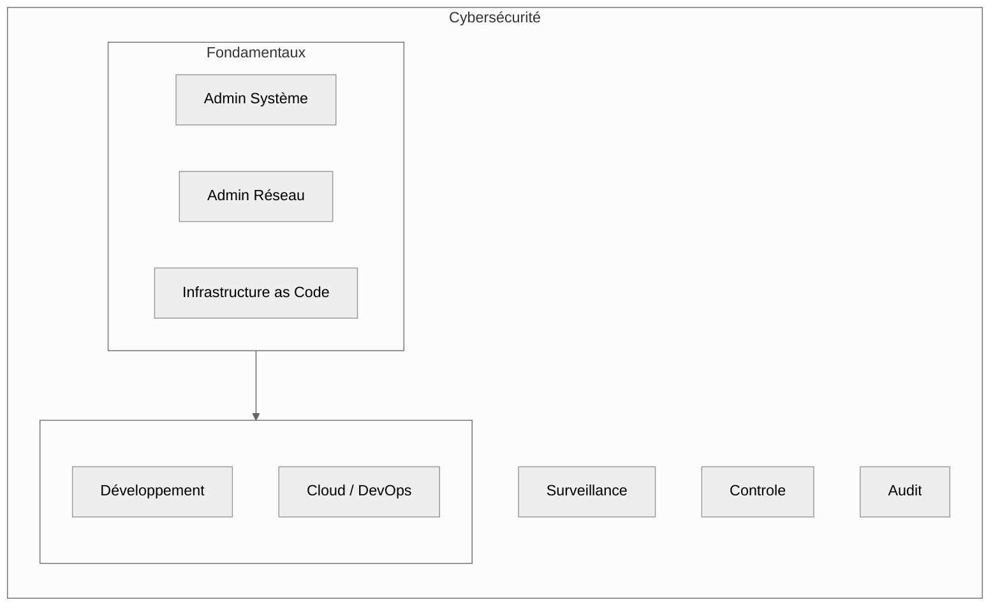

import Badge from '@site/src/components/Badge';

# Introduction générale

## Système, réseau et infrastructure

**Objectif** : offrir une vision d’ensemble structurée des domaines clés de l’informatique technique — **système**, **réseau** et
**infrastructure** — qui constituent le socle indispensable à toute spécialisation ( _Cloud, DevSecOps, Cybersécurité, etc._ ).

Cette section introductive permet d’identifier rapidement les parcours à suivre selon le domaine ciblé et **naviguer efficacement entre les
modules**.

## Aperçu synthétique des modules

|           Module           | Objectif pédagogique                                                                           | Accès directe                                                                      |
| :------------------------: | ---------------------------------------------------------------------------------------------- | ---------------------------------------------------------------------------------- |
| **Administration Système** | Apprendre à gérer un OS, automatiser les tâches, configurer des services, superviser.          | [Lien diecte](../infrastructure/admin-sys/introduction#administration-système)     |
| **Administration Réseau**  | Comprendre le modèle OSI, adresser un réseau, déployer des services et superviser le trafic.   | [Lien directe](../infrastructure/admin-reseau/introduction##administration-réseau) |
| **Infrastructure as Code** | Automatiser le déploiement d’environnements via du code : provisionnement, configuration, etc. | [Lien directe](../infrastructure/iac/introduction##infrastructure-as-code)         |

 

## Schéma relationnel des modules

:::info Vision d'ensemble
Le schéma ci-dessus illustre une architecture pédagogique complète :

-   **Fondamentaux** : base commune indispensable à tout technicien ou ingénieur.
-   **Développement / Cloud** : application concrète de ces connaissances pour créer des services et les déployer.
-   **Cybersécurité** : couche transversale qui contrôle, surveille, et audite l’ensemble.

Chacune de ces sections est développée indépendamment pour une meilleure clarté, mais elles sont **intimement liées** dans la pratique.
:::

:::tip Conseils de lecture ( _Méthode recommandée_ )
_Commence par le module **Système pour poser les bases**, puis explore les modules **Réseau** et **IaC** selon ton objectif professionnel.
L’ordre peut varier selon ton niveau, mais l’approche reste progressive et modulaire._
:::
